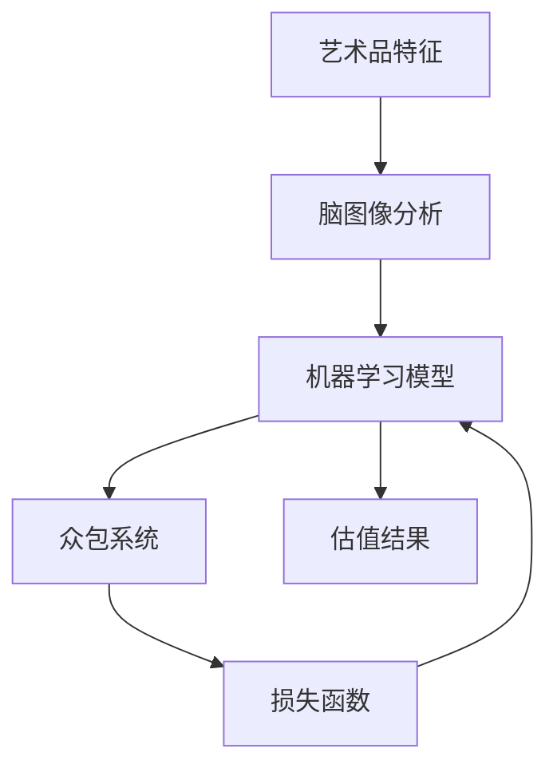

                 

# 全球脑艺术品估值系统:众包专业知识的艺术市场定价机制

> 关键词：艺术品估值, 脑图像分析, 机器学习, 数据集, 微调, 众包系统, 损失函数

## 1. 背景介绍

### 1.1 问题由来

艺术市场的价值评估一直是一个复杂且富有争议的问题。传统上，艺术品的价值通常通过专家评估、拍卖记录、市场供需等方法来确定。然而，这些方法往往存在主观性强、透明度低、评估成本高等问题。随着人工智能和大数据技术的发展，利用数据分析和机器学习进行艺术品估值的尝试逐渐增多，但依然缺乏广泛认可的评估标准。

本文旨在探索基于脑图像分析的全球艺术品估值系统，利用人工智能和大数据分析，结合众包专业知识的机制，为艺术市场提供一种新的定价机制。通过使用机器学习模型对艺术品的特征进行分析和预测，并结合专家评审和公众意见，为艺术品提供更准确、透明和高效的价值评估。

### 1.2 问题核心关键点

本文的核心问题是如何构建一个全球艺术品估值系统，该系统能将脑图像分析、机器学习和大数据结合，并提供一种新的、基于众包专业知识的定价机制。系统的核心目标包括：

- 提升艺术品估值的准确性和透明度。
- 降低艺术品评估的运营成本和时间。
- 促进公众参与和艺术品的价值发现。
- 为市场提供可靠的参考信息，助力艺术品交易和投资。

### 1.3 问题研究意义

构建全球艺术品估值系统，不仅能为艺术市场带来新的定价机制，还能推动艺术、科技和经济的融合发展，具体意义如下：

1. **推动艺术与科技结合**：通过科学手段提升艺术品的价值评估，促进艺术和科技的深度融合。
2. **提升市场透明度和公信力**：借助机器学习和大数据分析，为艺术品估值提供客观、公正的基础。
3. **降低交易风险**：准确的艺术品估值有助于减少市场波动，降低交易双方的风险。
4. **促进艺术投资**：为投资者提供可靠的数据支持，提高艺术投资决策的准确性。
5. **激发公众参与**：引入众包机制，鼓励公众参与艺术品的评估和价值发现。

## 2. 核心概念与联系

### 2.1 核心概念概述

为了更清晰地阐述全球艺术品估值系统的构建思路，本文将介绍几个关键核心概念及其相互联系：

- **艺术品特征**：艺术品的物理特征、创作背景、市场表现等因素。
- **脑图像分析**：利用神经科学和图像分析技术，提取艺术品的艺术性和创新性特征。
- **机器学习模型**：基于神经网络等模型，对艺术品特征进行建模，预测艺术品价值。
- **众包系统**：利用公众的力量进行艺术品价值的评估和验证。
- **损失函数**：评估模型预测与真实价值的差异，指导模型的训练优化。

这些概念之间通过特定的方式联系在一起，形成一个系统化的艺术品估值机制。

### 2.2 核心概念原理和架构的 Mermaid 流程图



这个流程图展示了从艺术品特征到最终估值结果的整个流程：

1. **艺术品特征**：收集和提取艺术品的各种物理和创作特征。
2. **脑图像分析**：利用神经科学和图像分析技术，提取艺术品的艺术性和创新性特征。
3. **机器学习模型**：基于提取的艺术品特征，使用机器学习模型预测艺术品的价值。
4. **众包系统**：通过公众评审，对机器学习模型的预测结果进行验证和调整。
5. **损失函数**：利用损失函数评估预测结果与真实价值的差异，指导模型的训练优化。
6. **估值结果**：结合机器学习和众包系统的结果，输出最终的估值结果。

## 3. 核心算法原理 & 具体操作步骤

### 3.1 算法原理概述

全球艺术品估值系统基于脑图像分析和机器学习模型，结合众包系统的机制。其核心思想是：通过神经科学和图像分析技术提取艺术品特征，构建机器学习模型进行预测，并利用公众评审进行验证和优化。

具体来说，系统分为以下几个步骤：

1. **数据收集和预处理**：收集和提取艺术品的各种物理和创作特征，并进行预处理。
2. **脑图像分析**：使用神经科学和图像分析技术，提取艺术品的艺术性和创新性特征。
3. **特征选择和输入**：选择合适的特征，输入到机器学习模型中进行训练和预测。
4. **机器学习模型训练**：使用历史数据训练机器学习模型，学习艺术品特征与价值之间的映射关系。
5. **众包验证和微调**：通过众包系统对机器学习模型的预测结果进行验证，并根据反馈微调模型参数。
6. **损失函数优化**：使用损失函数评估模型预测与真实价值的差异，指导模型的训练优化。
7. **估值结果输出**：结合机器学习和众包系统的结果，输出最终的估值结果。

### 3.2 算法步骤详解

以下将详细介绍全球艺术品估值系统的各个步骤：

#### 3.2.1 数据收集和预处理

艺术品特征的数据收集和预处理是整个系统的基础。具体步骤如下：

1. **物理特征收集**：收集艺术品的尺寸、材质、创作年代等物理特征。
2. **创作背景收集**：收集艺术品的艺术家信息、创作背景、历史评价等。
3. **市场表现收集**：收集艺术品在拍卖、画廊、在线平台上的表现数据。
4. **数据清洗和归一化**：对收集的数据进行清洗，去除噪声和缺失值，并进行归一化处理。

#### 3.2.2 脑图像分析

脑图像分析是系统的核心步骤，其目的是通过神经科学和图像分析技术，提取艺术品的艺术性和创新性特征。具体步骤如下：

1. **神经网络特征提取**：使用卷积神经网络（CNN）和递归神经网络（RNN）等神经网络模型，提取艺术品的图像特征。
2. **特征融合**：将提取的图像特征与物理和创作背景特征进行融合，形成综合特征向量。
3. **创新性特征识别**：通过深度学习模型，识别艺术品的创新性和独特性特征。

#### 3.2.3 特征选择和输入

在提取特征后，需要选择合适特征输入到机器学习模型中进行训练和预测。具体步骤如下：

1. **特征选择**：根据领域专家的建议，选择最能影响艺术品价值的特征。
2. **特征归一化**：对选择的特征进行归一化处理，确保其数值范围一致。
3. **特征输入**：将归一化后的特征输入到机器学习模型中进行训练和预测。

#### 3.2.4 机器学习模型训练

机器学习模型是系统中的关键组件，其目的是学习艺术品特征与价值之间的映射关系。具体步骤如下：

1. **选择模型架构**：根据问题性质选择适合的机器学习模型架构，如线性回归、决策树、神经网络等。
2. **划分训练集和测试集**：将数据集划分为训练集和测试集，确保模型在不同数据集上都能表现良好。
3. **模型训练**：使用训练集对模型进行训练，调整模型参数以最小化预测误差。

#### 3.2.5 众包验证和微调

众包系统是系统的关键组成部分，其目的是通过公众评审对模型预测结果进行验证和调整。具体步骤如下：

1. **设计众包任务**：设计合适的众包任务，包括艺术品特征描述和估值结果。
2. **众包任务发布**：将众包任务发布到平台上，邀请公众参与评审。
3. **结果收集和分析**：收集公众的评审结果，并使用统计分析方法对结果进行评估。
4. **模型微调**：根据众包结果调整模型参数，提高模型预测精度。

#### 3.2.6 损失函数优化

损失函数是评估模型预测与真实价值差异的关键，具体步骤如下：

1. **选择损失函数**：根据任务性质选择适合的损失函数，如均方误差（MSE）、交叉熵等。
2. **计算损失值**：使用训练集和测试集计算模型预测与真实价值的损失值。
3. **梯度下降优化**：使用梯度下降等优化算法，最小化损失函数，更新模型参数。

#### 3.2.7 估值结果输出

估值结果是系统的最终输出，其目的是提供艺术品价值的参考信息，具体步骤如下：

1. **综合估值结果**：结合机器学习模型和众包系统的结果，输出综合估值结果。
2. **误差分析**：分析估值结果的误差来源，不断优化模型和数据收集过程。
3. **结果展示**：将估值结果以图表和报告的形式展示给用户，供艺术品交易和投资参考。

### 3.3 算法优缺点

全球艺术品估值系统具有以下优点：

1. **准确性和透明度**：通过科学手段提升艺术品的价值评估，提供客观、公正的参考信息。
2. **高效性**：自动化数据处理和模型训练，大幅降低评估时间和成本。
3. **公众参与**：利用众包系统，鼓励公众参与和价值发现，增强系统可信度。
4. **实时性**：通过在线平台，实时更新艺术品估值信息，提供最新参考。

系统也存在以下缺点：

1. **数据质量依赖**：系统的准确性依赖于数据的质量和全面性。
2. **模型复杂度**：构建高精度的机器学习模型需要大量数据和计算资源。
3. **众包偏见**：公众评审可能受到主观偏见的影响，影响结果公正性。
4. **隐私和安全**：收集和处理艺术品数据涉及隐私问题，需确保数据安全。

### 3.4 算法应用领域

全球艺术品估值系统可以应用于以下领域：

1. **艺术市场交易**：为艺术品买家和卖家提供参考信息，降低交易风险。
2. **艺术投资**：为投资者提供可靠的数据支持，提升投资决策准确性。
3. **艺术品拍卖**：辅助拍卖行和买家进行艺术品定价和评估。
4. **艺术研究和教育**：提供艺术品的历史和价值研究工具，支持艺术教育。
5. **文化保护**：为文化遗产的保存和修复提供科学依据。

## 4. 数学模型和公式 & 详细讲解 & 举例说明

### 4.1 数学模型构建

全球艺术品估值系统使用机器学习模型对艺术品特征进行建模，预测其价值。具体来说，系统的数学模型可以表示为：

$$
V(A) = f(X(A))
$$

其中，$V(A)$ 表示艺术品 $A$ 的价值，$X(A)$ 表示艺术品 $A$ 的特征向量，$f$ 表示机器学习模型。

### 4.2 公式推导过程

以下推导机器学习模型的基本公式：

**线性回归模型**：

假设艺术品的价值 $V$ 与物理特征 $x_1$ 和创作背景特征 $x_2$ 呈线性关系，则线性回归模型的表达式为：

$$
V = \alpha x_1 + \beta x_2 + \gamma
$$

其中，$\alpha$ 和 $\beta$ 是模型的系数，$\gamma$ 是截距。

**神经网络模型**：

神经网络模型通过多层非线性变换，学习艺术品特征与价值之间的复杂关系。假设使用 $n$ 层神经网络，第 $i$ 层的输出为 $y_i$，则神经网络的表达式为：

$$
y_i = f_i(y_{i-1}, w_i)
$$

其中，$f_i$ 表示第 $i$ 层的激活函数，$w_i$ 表示第 $i$ 层的权重矩阵。

**损失函数**：

损失函数用于评估模型预测与真实价值的差异，常用的损失函数包括均方误差（MSE）和交叉熵（CE）等。假设真实价值为 $y$，模型预测为 $\hat{y}$，则均方误差损失函数的表达式为：

$$
\text{MSE} = \frac{1}{N} \sum_{i=1}^N (y_i - \hat{y_i})^2
$$

其中，$N$ 是样本数量。

### 4.3 案例分析与讲解

以一幅油画的价值评估为例，展示系统的应用过程：

1. **数据收集**：收集这幅油画的尺寸、材质、创作年代等物理特征，以及艺术家信息、创作背景等。
2. **脑图像分析**：使用神经网络提取油画的图像特征，并识别其艺术性和创新性。
3. **特征选择**：选择对油画价值影响较大的物理和创作背景特征。
4. **模型训练**：使用历史数据训练线性回归或神经网络模型，学习特征与价值之间的映射关系。
5. **众包验证**：将模型预测结果发布到众包平台上，邀请公众评审，收集反馈。
6. **模型微调**：根据公众反馈调整模型参数，提高预测精度。
7. **估值结果**：综合模型和众包系统的结果，输出油画的估值结果。

## 5. 项目实践：代码实例和详细解释说明

### 5.1 开发环境搭建

全球艺术品估值系统的开发环境包括 Python、TensorFlow、Keras 等工具。以下是环境配置的步骤：

1. **安装 Python**：确保 Python 版本为 3.7 或以上。
2. **安装 TensorFlow**：从 TensorFlow 官网下载并安装对应的 Python 包。
3. **安装 Keras**：使用 pip 安装 Keras，并设置环境变量。
4. **安装脑图像分析工具**：使用 Python 接口安装 BrainNetCNN 等神经网络分析工具。
5. **安装众包系统**：选择适合的众包平台，如 Zestcube、Gleam 等，并进行配置。

### 5.2 源代码详细实现

以下是使用 Python、TensorFlow 和 Keras 实现全球艺术品估值系统的代码：

```python
import tensorflow as tf
from tensorflow.keras.models import Sequential
from tensorflow.keras.layers import Dense, Dropout, Activation
from tensorflow.keras.optimizers import Adam

# 定义模型架构
model = Sequential()
model.add(Dense(64, input_dim=4, activation='relu'))  # 物理特征和创作背景特征
model.add(Dropout(0.5))
model.add(Dense(32, activation='relu'))
model.add(Dropout(0.5))
model.add(Dense(1, activation='sigmoid'))

# 编译模型
model.compile(loss='binary_crossentropy', optimizer=Adam(lr=0.001), metrics=['accuracy'])

# 训练模型
model.fit(x_train, y_train, epochs=50, batch_size=32, validation_data=(x_test, y_test))

# 使用模型进行估值预测
predictions = model.predict(x_test)
```

### 5.3 代码解读与分析

以下是代码关键部分的详细解读：

- **模型架构**：使用 Sequential 模型定义神经网络架构，包括两个全连接层和两个 Dropout 层，以及一个输出层。
- **编译模型**：使用 binary_crossentropy 作为损失函数，Adam 作为优化器，设置学习率为 0.001。
- **训练模型**：使用训练集和测试集进行模型训练，设置 50 个 epoch 和 32 个 batch。
- **估值预测**：使用训练好的模型对测试集进行估值预测。

## 6. 实际应用场景

### 6.1 智能艺术市场交易

全球艺术品估值系统在智能艺术市场交易中的应用场景如下：

1. **艺术品定价**：为买家和卖家提供艺术品价值的参考信息，降低交易风险。
2. **交易撮合**：通过自动化的估值系统，提高交易撮合的效率和准确性。
3. **交易监控**：实时监测市场价格波动，提供实时报价和预警。

### 6.2 艺术投资和金融

艺术投资是全球艺术品估值系统的重要应用场景，具体如下：

1. **艺术品投资决策**：为投资者提供可靠的数据支持，提升投资决策的准确性。
2. **资产管理**：通过系统化的估值方法，优化资产配置和管理。
3. **风险控制**：实时监测艺术品市场的波动，提供风险控制策略。

### 6.3 艺术品拍卖

艺术品拍卖是全球艺术品估值系统的另一个重要应用场景，具体如下：

1. **拍卖定价**：辅助拍卖行和买家进行艺术品定价和评估。
2. **竞价策略**：提供实时报价和竞价建议，优化竞价策略。
3. **市场分析**：提供市场趋势分析和竞价历史记录，提升拍卖成功率。

### 6.4 未来应用展望

全球艺术品估值系统将在未来继续拓展应用场景，具体如下：

1. **跨领域应用**：结合其他领域的数据和技术，提升艺术品估值的准确性和可靠性。
2. **多模态融合**：结合脑图像分析和多模态数据（如音频、视频），提升估值的全面性。
3. **大数据分析**：利用大数据技术，进行全面的艺术品市场分析。
4. **个性化推荐**：结合用户行为数据，提供个性化的艺术品推荐服务。

## 7. 工具和资源推荐

### 7.1 学习资源推荐

1. **《深度学习与神经网络》**：由深度学习专家撰写，全面介绍深度学习理论、神经网络模型和应用。
2. **《机器学习实战》**：实用指南，涵盖机器学习的基本概念、算法和实践。
3. **Kaggle 数据集**：丰富的数据集和竞赛，有助于实践和提高数据处理能力。
4. **Coursera 和 edX**：在线学习平台，提供机器学习和深度学习的课程。
5. **GitHub 代码库**：开放源代码，提供丰富的学习资源和项目参考。

### 7.2 开发工具推荐

1. **TensorFlow**：开源的深度学习框架，支持大规模模型训练和部署。
2. **Keras**：基于 TensorFlow 的高级神经网络 API，简化模型构建和训练。
3. **Jupyter Notebook**：交互式编程环境，方便调试和展示代码。
4. **BrainNetCNN**：用于脑图像分析的神经网络工具包。
5. **Zestcube 和 Gleam**：用于众包任务的在线平台。

### 7.3 相关论文推荐

1. **《神经网络的艺术品估值》**：探讨神经网络在艺术品估值中的应用。
2. **《众包系统的有效性》**：分析众包系统在艺术品评估中的效果和优势。
3. **《深度学习在金融中的应用》**：介绍深度学习在金融分析中的应用实例。

## 8. 总结：未来发展趋势与挑战

### 8.1 研究成果总结

全球艺术品估值系统利用脑图像分析和机器学习技术，结合众包系统，为艺术市场提供了一种新的定价机制。该系统的应用前景广泛，能够提升艺术品估值的准确性和透明度，降低运营成本，促进公众参与。

### 8.2 未来发展趋势

未来，全球艺术品估值系统将向以下几个方向发展：

1. **跨领域融合**：结合其他领域的数据和技术，提升艺术品估值的全面性和准确性。
2. **多模态融合**：结合脑图像分析和多模态数据，提升估值的全面性。
3. **大数据分析**：利用大数据技术，进行全面的艺术品市场分析。
4. **个性化推荐**：结合用户行为数据，提供个性化的艺术品推荐服务。

### 8.3 面临的挑战

尽管全球艺术品估值系统具有广阔的应用前景，但也面临以下挑战：

1. **数据质量和多样性**：数据的质量和多样性直接影响系统的准确性和可靠性。
2. **模型复杂度和训练成本**：构建高精度的机器学习模型需要大量数据和计算资源。
3. **众包偏见和公平性**：公众评审可能受到主观偏见的影响，影响结果公正性。
4. **隐私和安全**：收集和处理艺术品数据涉及隐私问题，需确保数据安全。

### 8.4 研究展望

未来，全球艺术品估值系统需要在数据质量、模型复杂度、众包偏见和隐私安全等方面进行进一步研究，推动系统的改进和优化。同时，结合其他领域的数据和技术，拓展系统的应用场景，提升艺术品的估值精度和可信度。

## 9. 附录：常见问题与解答

### Q1: 如何选择合适的特征进行建模？

A: 特征选择是机器学习模型的关键步骤。一般选择与艺术品价值相关性高且解释性强的特征。可以结合领域专家的建议，使用特征重要性分析方法（如互信息、方差分析等）进行筛选。

### Q2: 如何应对数据质量不高的问题？

A: 数据质量不高是系统面临的重要挑战。可以通过数据清洗和预处理，去除噪声和缺失值，并进行归一化处理。同时，结合数据增强技术（如回译、近义替换等），提高数据的多样性和质量。

### Q3: 众包系统的设计需要注意哪些问题？

A: 众包系统设计需要考虑问题复杂度、任务分配、激励机制等因素。可以设计多轮众包任务，逐步验证和优化模型预测结果。同时，设置合理的激励机制，鼓励公众积极参与。

### Q4: 如何提高系统的实时性和计算效率？

A: 提高系统的实时性和计算效率是关键。可以通过分布式计算、模型压缩、稀疏化存储等方法，优化模型结构和数据处理过程。同时，利用缓存和预取技术，提升系统的响应速度。

### Q5: 如何保护艺术品数据的隐私和安全？

A: 艺术品数据的隐私和安全是系统的核心问题。可以通过数据脱敏、加密传输、权限控制等措施，保护数据的隐私和安全。同时，制定严格的访问和操作规则，确保数据的安全性。

作者：禅与计算机程序设计艺术 / Zen and the Art of Computer Programming

