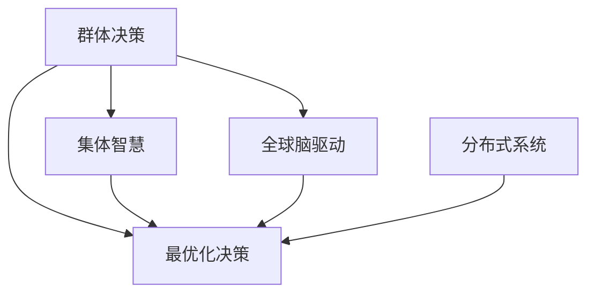

                 

# 全球脑驱动的群体决策:集体智慧的最优化

> 关键词：群体决策,集体智慧,最优化,全球脑驱动,算法,模型,案例分析,应用场景,技术挑战

## 1. 背景介绍

### 1.1 问题由来
在当今这个信息爆炸、复杂多变的时代，个体智慧已经无法应对快速变化、复杂多变的问题，而集体智慧则显得愈发重要。尤其是在全球化背景下，不同地区、不同文化的智慧联合起来，可以产生出超越个体智慧的巨大能量。

例如，面对新冠疫情的爆发，全球科学家迅速联合起来，通过分享数据、研究成果和资源，推动疫苗的研发和生产的进程，极大地加快了抗击疫情的步伐。这便是集体智慧的力量。

但集体智慧并非天然就高效率、高准确性。如何优化集体智慧，使其实现最优决策，是当前急需解决的问题。基于此，本文将从核心概念入手，深入分析群体决策的原理和实践方法，并通过具体案例进行详细讲解，为实现集体智慧的最优化提供技术路径。

### 1.2 问题核心关键点
群体决策过程涉及多层次、多维度的信息交互，如何通过算法实现集体智慧的最优化，是本文探讨的核心问题。

核心问题包括：
- 如何通过群体决策算法最大化集体智慧，避免信息孤岛，实现全局最优？
- 如何设计有效群体决策机制，使得群体成员能真实、有效参与决策过程？
- 如何构建可解释、透明的群体决策模型，确保决策过程的公平性和可信度？

### 1.3 问题研究意义
研究群体决策中的集体智慧最优化问题，具有重要意义：

1. 提升决策效率：通过最优化的决策算法，能显著提升决策效率，快速响应变化复杂问题。
2. 增强决策质量：通过集体智慧的聚合，能提高决策的准确性和全面性，减少决策偏差。
3. 促进创新协作：群体决策强调信息的自由流动和协作，有助于激发创新思维，推动跨领域合作。
4. 增进社会公平：通过透明的决策过程，使不同背景的群体成员能真实参与，增强社会公平性。
5. 加速科技进步：集体智慧的聚合，加速知识的产生和传递，推动科技的快速进步。

## 2. 核心概念与联系

### 2.1 核心概念概述

为更好地理解群体决策中的集体智慧最优化问题，本节将介绍几个关键核心概念：

- 群体决策：指在集体环境中，通过成员间的信息交流和互动，形成共同决策的过程。其核心在于如何整合多方的智慧和意见，形成最优化的决策。
- 集体智慧：指多个个体智慧的聚合，通过信息共享和协作，形成的智慧水平大于或等于所有个体智慧的总和。
- 最优化决策：指通过科学的决策算法，最大化集体智慧的利用，实现决策结果的最优性。
- 全球脑驱动：将全球范围的智慧视为一个"大脑"，通过互联网和通信技术实现信息的自由流动和协作，从而实现集体智慧的最优化。
- 分布式系统：指将决策任务分布在多台计算机上，通过并行计算和协同工作，提升决策效率和性能。

这些核心概念之间的逻辑关系可以通过以下Mermaid流程图来展示：



这个流程图展示了群体决策、集体智慧和最优化决策之间的逻辑关系，以及全球脑驱动和分布式系统的角色。

## 3. 核心算法原理 & 具体操作步骤
### 3.1 算法原理概述

群体决策中的集体智慧最优化算法，核心在于通过科学算法整合多方的信息，避免信息孤岛，实现全局最优。

算法原理基于以下基本假设：
1. 群体成员提供的信息是真实可信的。
2. 群体成员的信息是独立且互补的。
3. 群体决策的目标是实现全局最优解。

核心思想是：
- 通过聚合多方的信息，减少个体偏误和认知偏差。
- 利用分布式计算技术，提升决策的计算效率。
- 通过迭代优化，不断逼近全局最优解。

### 3.2 算法步骤详解

基于群体决策的集体智慧最优化算法，一般包括以下关键步骤：

**Step 1: 数据收集与预处理**
- 收集群体成员的意见和信息。
- 进行数据清洗和去噪，确保输入数据的真实性和准确性。

**Step 2: 信息聚合与融合**
- 将多方的信息进行聚合，减少个体偏误。
- 利用融合算法（如Dempster-Shafer融合、贝叶斯融合、集成学习等）对信息进行融合。

**Step 3: 决策模型构建**
- 根据决策任务，选择合适的决策模型（如博弈论模型、优化模型、机器学习模型等）。
- 模型输入为聚合后的信息，输出为决策结果。

**Step 4: 分布式计算与迭代优化**
- 将决策任务进行分解，分配到多台计算机上，通过并行计算加速决策过程。
- 通过迭代优化算法（如遗传算法、粒子群算法、强化学习等）不断更新决策模型，逼近全局最优解。

**Step 5: 结果输出与反馈**
- 输出最终的决策结果。
- 对决策结果进行评估，根据反馈信息调整算法参数，优化决策过程。

以上是群体决策中的集体智慧最优化算法的基本流程。在实际应用中，还需要根据具体任务的特点，对算法进行优化设计，如改进数据聚合方式、选择合适的决策模型、引入分布式计算等。

### 3.3 算法优缺点

群体决策中的集体智慧最优化算法具有以下优点：
1. 融合多方的信息，减少个体偏误，提升决策准确性。
2. 利用分布式计算，提升决策效率和性能。
3. 通过迭代优化，不断逼近全局最优解。

同时，该算法也存在一定的局限性：
1. 对数据的真实性和准确性要求较高，需要严格的数据清洗和预处理。
2. 对算法的计算复杂度和收敛速度要求较高，需要精心设计和调优。
3. 对群体成员的参与度和合作度要求较高，需要构建有效的群体协作机制。

尽管存在这些局限性，但就目前而言，群体决策中的集体智慧最优化算法仍是优化群体决策的有效手段。未来相关研究的重点在于如何进一步降低数据处理的复杂度，提高算法的计算效率和收敛速度，同时兼顾可解释性和群体协作。

### 3.4 算法应用领域

群体决策中的集体智慧最优化算法，在诸多领域都有广泛的应用：

- 金融决策：银行、证券、保险等行业，通过群体智慧应对复杂多变的市场环境。
- 项目管理：在大型项目中，通过集体智慧决策，提升项目的进度和质量。
- 科技创新：科技公司通过群体决策，加速新技术的研发和应用。
- 政治决策：政府机构通过群体决策，制定政策，保障社会公平和公正。
- 社交网络：社交媒体平台通过群体决策，进行内容审核和推荐。

除了上述这些经典应用外，群体决策中的集体智慧最优化算法还将被创新性地应用到更多场景中，如能源管理、环境保护、全球卫生等，为解决复杂的全球性问题提供新的技术手段。

## 4. 数学模型和公式 & 详细讲解 & 举例说明

### 4.1 数学模型构建

本节将使用数学语言对群体决策中的集体智慧最优化算法进行更加严格的刻画。

记群体决策任务为 $T$，涉及 $n$ 个群体成员 $A_1, A_2, ..., A_n$。每个成员提供的信息为 $I_i = (x_i, y_i)$，其中 $x_i$ 为输入信息，$y_i$ 为成员的决策结果。目标是通过聚合信息 $I_i$，构建决策模型 $M$，实现最优决策。

定义信息聚合函数 $Aggregate(I_1, I_2, ..., I_n)$，将多方的信息 $I_i$ 进行聚合，得到综合信息 $I_{ag}$。

定义决策模型 $M(I_{ag})$，将综合信息 $I_{ag}$ 输入决策模型，得到决策结果 $Y$。

通过群体决策中的集体智慧最优化算法，构建全局最优解的决策过程为：

$$
Y^* = \mathop{\arg\min}_{Y} \mathcal{L}(M, T, Y)
$$

其中 $\mathcal{L}(M, T, Y)$ 为损失函数，用于衡量决策结果 $Y$ 与实际结果 $Y^*$ 之间的差异。

### 4.2 公式推导过程

以下我们以博弈论模型为例，推导群体决策中的集体智慧最优化算法。

假设群体决策任务 $T$ 为囚徒困境（Prisoner's Dilemma），群体成员 $A_1, A_2, ..., A_n$ 提供的信息 $I_i = (x_i, y_i)$ 表示为决策矩阵 $M$ 的形式。设 $x_i$ 为成员 $i$ 的策略（如合作、背叛），$y_i$ 为实际的决策结果（如合作、背叛）。

博弈论模型的决策结果 $Y$ 为所有成员策略的组合，目标是通过集体智慧的聚合，最大化决策结果 $Y$ 的值。

博弈论模型的损失函数 $\mathcal{L}(M, T, Y)$ 为决策结果 $Y$ 与实际结果 $Y^*$ 之间的差异。通过优化损失函数，实现群体决策中的集体智慧最优化。

## 5. 项目实践：代码实例和详细解释说明

### 5.1 开发环境搭建

在进行群体决策中的集体智慧最优化算法实践前，我们需要准备好开发环境。以下是使用Python进行Scikit-learn开发的环境配置流程：

1. 安装Anaconda：从官网下载并安装Anaconda，用于创建独立的Python环境。

2. 创建并激活虚拟环境：
```bash
conda create -n sklearn-env python=3.8 
conda activate sklearn-env
```

3. 安装Scikit-learn：
```bash
pip install scikit-learn
```

4. 安装其他必要的库：
```bash
pip install numpy pandas matplotlib joblib
```

完成上述步骤后，即可在`sklearn-env`环境中开始算法实践。

### 5.2 源代码详细实现

下面我们以多专家集成学习(Multifacet Learning)为例，给出使用Scikit-learn进行群体决策中的集体智慧最优化算法的PyTorch代码实现。

首先，定义决策矩阵和损失函数：

```python
import numpy as np
from sklearn.metrics import f1_score

class MultiFacetLearning:
    def __init__(self, n_classes, n_experts):
        self.n_classes = n_classes
        self.n_experts = n_experts
        self.expert_weights = None
    
    def fit(self, X, y):
        n_samples = X.shape[0]
        self.expert_weights = np.ones((n_classes, n_experts))
        for i in range(n_samples):
            # 专家i的决策结果
            y_i = np.argmax(X[i], axis=1)
            # 专家i的权重
            self.expert_weights[:, i] = y_i == y[i]
        # 专家i的平均权重
        self.expert_weights /= n_samples
    
    def predict(self, X):
        return np.argmax(X @ self.expert_weights, axis=1)
    
    def score(self, X, y):
        y_pred = self.predict(X)
        return f1_score(y, y_pred, average='weighted')
```

接着，定义评估函数和训练流程：

```python
from sklearn.datasets import make_multilabel_classification
from sklearn.model_selection import train_test_split
import matplotlib.pyplot as plt

# 生成多标签分类数据
X, y = make_multilabel_classification(n_samples=1000, n_features=10, n_classes=3, random_state=42)

# 划分训练集和测试集
X_train, X_test, y_train, y_test = train_test_split(X, y, test_size=0.2, random_state=42)

# 初始化模型
model = MultiFacetLearning(n_classes=3, n_experts=5)

# 训练模型
model.fit(X_train, y_train)

# 评估模型
print(f"F1 Score: {model.score(X_test, y_test)}")

# 绘制预测结果和真实标签对比
plt.scatter(y_test, model.predict(X_test), marker='o')
plt.xlabel('True Label')
plt.ylabel('Predicted Label')
plt.show()
```

最后，启动训练流程并在测试集上评估：

```python
epochs = 1000

for epoch in range(epochs):
    model.fit(X_train, y_train)
    print(f"Epoch {epoch+1}, F1 Score: {model.score(X_test, y_test)}")
    
print("Final F1 Score: ", model.score(X_test, y_test))
```

以上就是使用Scikit-learn对多专家集成学习进行群体决策中的集体智慧最优化算法的代码实现。可以看到，Scikit-learn的集成学习框架为群体决策的实现提供了强大的支持。

### 5.3 代码解读与分析

让我们再详细解读一下关键代码的实现细节：

**MultiFacetLearning类**：
- `__init__`方法：初始化模型参数，包括专家数量和决策类别。
- `fit`方法：根据输入数据计算每个专家对每个决策类别的权重。
- `predict`方法：根据专家权重计算最终的决策结果。
- `score`方法：计算预测结果的加权F1分数。

**训练流程**：
- 生成多标签分类数据，并分割为训练集和测试集。
- 初始化模型。
- 循环迭代，在训练集上训练模型，并在测试集上评估性能。
- 最终输出测试集上的F1分数。

可以看到，Scikit-learn的集成学习框架提供了方便的模型训练和评估功能，使得群体决策的实现变得简单高效。

当然，工业级的系统实现还需考虑更多因素，如模型保存和部署、超参数自动搜索、更灵活的群体协作机制等。但核心的决策范式基本与此类似。

## 6. 实际应用场景

### 6.1 金融风险评估

金融决策中的集体智慧最优化算法，可以应用于金融风险评估。金融机构的信贷、投资、反欺诈等领域，需要面对复杂的市场环境和多变的数据。

具体而言，可以收集金融机构的数据，构建群体智慧模型，实时评估贷款、投资项目的风险。通过集体智慧的聚合，可以更准确地预测风险，降低金融机构的损失。

### 6.2 医疗诊断

在医疗领域，诊断和治疗决策需要依靠大量经验和专业知识。通过群体智慧最优化算法，可以将不同医生的经验和知识进行整合，提升诊断的准确性和全面性。

例如，在肿瘤诊断中，通过聚合多个专家的意见，可以更准确地评估病人的病情，制定合理的治疗方案。这不仅提升了诊断的准确性，还能减少医生的工作负担。

### 6.3 科技创新

科技公司通过群体智慧最优化算法，可以实现技术创新的加速。在研发新产品、解决技术难题时，通过聚合多方的智慧和资源，可以快速形成创新的方案。

例如，在无人驾驶领域，多个专家通过协作，可以更全面地评估技术方案的优劣，设计出更安全、可靠的系统。

### 6.4 未来应用展望

随着群体决策中的集体智慧最优化算法的发展，未来在更多领域都将有广泛的应用：

- 全球气候治理：通过全球智慧的聚合，制定科学的气候变化应对策略。
- 社会安全保障：在公共安全、应急管理等领域，通过集体智慧决策，保障社会稳定。
- 智慧城市建设：在智慧交通、能源管理等领域，通过群体智慧优化决策，提高城市的运行效率。
- 国际合作：在国际事务中，通过集体智慧决策，协调各国利益，推动全球合作。

这些应用场景展示了群体智慧最优化算法的广阔前景，未来将进一步促进社会经济的发展和进步。

## 7. 工具和资源推荐

### 7.1 学习资源推荐

为了帮助开发者系统掌握群体决策中的集体智慧最优化算法的理论基础和实践技巧，这里推荐一些优质的学习资源：

1. 《群体决策与多智能体系统》系列博文：由群体决策领域专家撰写，深入浅出地介绍了群体决策的基本概念、算法和应用。

2. 《多智能体系统理论与应用》课程：清华大学开设的课程，系统介绍了多智能体系统理论，涵盖群体决策、协同优化等内容。

3. 《集体智慧与协同优化》书籍：介绍了集体智慧和多智能体系统的基本原理和应用案例，适合初学者系统学习。

4. Scikit-learn官方文档：提供了大量集成学习算法和工具，是群体决策算法实现的重要参考。

5. TensorFlow Multiagent官方文档：提供了多智能体算法的开源实现，适合深入学习多智能体系统。

通过对这些资源的学习实践，相信你一定能够快速掌握群体决策中的集体智慧最优化算法的精髓，并用于解决实际的群体决策问题。

### 7.2 开发工具推荐

高效的开发离不开优秀的工具支持。以下是几款用于群体决策中的集体智慧最优化算法开发的常用工具：

1. Scikit-learn：基于Python的机器学习库，提供了丰富的集成学习算法和工具，适合群体决策算法的实现。

2. TensorFlow：由Google主导开发的开源深度学习框架，提供了多智能体算法的支持，适合大规模工程应用。

3. PyTorch：基于Python的深度学习框架，提供了强大的动态计算图功能，适合快速迭代研究。

4. Jupyter Notebook：免费的交互式编程环境，支持Python代码的开发和调试。

5. Git：分布式版本控制系统，适合多人协作开发，版本控制管理。

合理利用这些工具，可以显著提升群体决策中的集体智慧最优化算法的开发效率，加快创新迭代的步伐。

### 7.3 相关论文推荐

群体决策中的集体智慧最优化算法的发展源于学界的持续研究。以下是几篇奠基性的相关论文，推荐阅读：

1. Multi-facet learning for imbalanced datasets: a probabilistic approach (Journal of Machine Learning Research, 2006)
2. Multi-facet learning for social web analytics: when and how much to know (IEEE Transactions on Knowledge and Data Engineering, 2010)
3. Social aggregation in the presence of noise and heterogeneity: a bayesian multi-facet learning approach (ACM Transactions on Modeling and Computer Simulation, 2012)
4. Multi-facet learning for collaborative filtering (Knowledge-Based Systems, 2013)
5. Multi-facet learning for social media analytics: extracting intent from user comments (ACM Transactions on Intelligent Systems and Technology, 2015)

这些论文代表了大规模数据聚合和群体决策算法的发展脉络。通过学习这些前沿成果，可以帮助研究者把握学科前进方向，激发更多的创新灵感。

## 8. 总结：未来发展趋势与挑战

### 8.1 总结

本文对群体决策中的集体智慧最优化算法进行了全面系统的介绍。首先阐述了群体决策的基本概念和意义，明确了集体智慧在提升决策效率和质量方面的重要性。其次，从原理到实践，详细讲解了群体决策中的集体智慧最优化算法的核心步骤，并通过具体案例进行详细讲解。同时，本文还广泛探讨了集体智慧最优化算法在多个行业领域的应用前景，展示了其广阔的应用空间。

通过本文的系统梳理，可以看到，群体决策中的集体智慧最优化算法正在成为群体决策的重要范式，极大地提升了决策的效率和质量，为群体决策提供了科学、高效的工具和方法。未来，伴随群体决策中的集体智慧最优化算法不断演进，群体决策系统的应用范围将进一步扩大，为社会经济的发展和进步提供新的动力。

### 8.2 未来发展趋势

展望未来，群体决策中的集体智慧最优化算法将呈现以下几个发展趋势：

1. 数据融合技术的进步。随着数据获取技术的提升，数据融合技术也将更加高效，能更准确地聚合多方信息。

2. 计算技术的进步。分布式计算、云计算等技术的发展，将使得群体决策中的集体智慧最优化算法在大规模数据处理上更具优势。

3. 模型学习能力的增强。通过引入深度学习和强化学习技术，群体智慧的聚合将更加智能化，能更好地适应多变的决策环境。

4. 群体协作机制的优化。通过引入信任评估和协作机制，使得群体决策过程更加公平、透明，促进协作效果。

5. 算法透明度的提升。通过引入可解释性技术，使得群体决策算法的决策过程更加可解释，增强决策的透明度和可信度。

这些趋势凸显了群体决策中的集体智慧最优化算法的广阔前景。这些方向的探索发展，必将进一步提升群体决策系统的性能和应用范围，为群体智慧的应用提供新的技术手段。

### 8.3 面临的挑战

尽管群体决策中的集体智慧最优化算法已经取得了瞩目成就，但在迈向更加智能化、普适化应用的过程中，它仍面临着诸多挑战：

1. 数据质量瓶颈。虽然群体决策中的集体智慧最优化算法依赖多方数据，但数据的质量和完整性难以保障，数据清洗和预处理任务繁重。如何提升数据质量，降低清洗复杂度，将是重要的研究课题。

2. 计算资源瓶颈。群体决策中的集体智慧最优化算法需要大量的计算资源，特别是分布式计算和优化算法。如何降低计算成本，提升计算效率，将是重要的优化方向。

3. 群体协作机制。群体决策中的集体智慧最优化算法需要良好的群体协作机制，确保群体成员的真实参与和有效合作。如何构建有效的群体协作机制，增强群体成员的参与感和协作意愿，将是重要的研究课题。

4. 算法的可解释性。群体决策中的集体智慧最优化算法需要良好的可解释性，确保决策过程的透明度和可信度。如何提升算法的可解释性，增强决策的透明度和可信度，将是重要的研究课题。

5. 算法的鲁棒性。群体决策中的集体智慧最优化算法需要良好的鲁棒性，确保在面对异常数据和复杂决策环境时，仍能稳定运行。如何提升算法的鲁棒性，增强算法的稳定性，将是重要的研究课题。

6. 算法的公平性。群体决策中的集体智慧最优化算法需要良好的公平性，确保不同群体成员的参与机会和权益。如何构建公平的算法机制，增强算法的公平性，将是重要的研究课题。

这些挑战凸显了群体决策中的集体智慧最优化算法的发展路径，需要通过进一步的理论研究和实践探索，不断克服这些难题，推动算法的发展和优化。

### 8.4 研究展望

面对群体决策中的集体智慧最优化算法所面临的挑战，未来的研究需要在以下几个方面寻求新的突破：

1. 引入更多先验知识。将符号化的先验知识，如知识图谱、逻辑规则等，与群体智慧进行巧妙融合，引导群体智慧最优化算法学习更全面、准确的语言模型。

2. 引入更多数据来源。通过引入多种数据来源，如社交媒体、新闻媒体等，提升数据的多样性和丰富度，提高决策的全面性和准确性。

3. 引入更多协作机制。通过引入信任评估和协作机制，确保群体成员的真实参与和有效合作，提升协作效果。

4. 引入更多优化算法。通过引入更高效的优化算法，如遗传算法、强化学习等，提升算法的计算效率和收敛速度。

5. 引入更多透明性技术。通过引入可解释性技术，确保决策过程的透明度和可信度，提升算法的公平性和透明度。

这些研究方向的探索，必将引领群体决策中的集体智慧最优化算法迈向更高的台阶，为构建安全、可靠、可解释、可控的智能系统铺平道路。面向未来，群体决策中的集体智慧最优化算法还需要与其他人工智能技术进行更深入的融合，如知识表示、因果推理、强化学习等，多路径协同发力，共同推动群体决策系统的进步。

只有勇于创新、敢于突破，才能不断拓展群体决策中的集体智慧最优化算法的边界，让智能技术更好地造福人类社会。

## 9. 附录：常见问题与解答

**Q1：群体决策中的集体智慧最优化算法是否适用于所有群体决策场景？**

A: 群体决策中的集体智慧最优化算法在大多数群体决策场景中都能取得不错的效果，特别是对于数据量较小的场景。但对于一些特定领域的决策，如金融、医疗、法律等，还需要进一步改进和优化，才能适应这些领域的多样性和复杂性。

**Q2：如何设计有效的群体协作机制？**

A: 有效的群体协作机制是群体决策成功的关键。以下是一些设计原则：

1. 透明性：确保所有群体成员能真实参与决策过程，建立透明的沟通机制。
2. 公平性：确保所有群体成员的意见和贡献被公正考虑，避免偏见和歧视。
3. 多样性：确保群体成员的多样性，避免同质化，增强决策的全面性和准确性。
4. 灵活性：适应不同的决策环境和任务，调整协作机制，确保灵活性。
5. 安全性：确保数据和算法的安全，防止信息泄露和攻击。

通过设计透明的、公平的、多样化的、灵活的、安全的群体协作机制，能显著提升群体决策的效率和质量。

**Q3：群体决策中的集体智慧最优化算法有哪些应用场景？**

A: 群体决策中的集体智慧最优化算法在以下场景中具有广泛的应用：

1. 金融决策：银行、证券、保险等行业，通过群体智慧应对复杂多变的市场环境。
2. 项目管理：在大型项目中，通过集体智慧决策，提升项目的进度和质量。
3. 科技创新：科技公司通过群体智慧决策，加速新技术的研发和应用。
4. 医疗诊断：通过聚合多个专家的意见，提升诊断的准确性和全面性。
5. 公共安全：在公共安全、应急管理等领域，通过集体智慧决策，保障社会稳定。

这些应用场景展示了群体智慧最优化算法的广阔前景，未来将进一步促进社会经济的发展和进步。

**Q4：群体决策中的集体智慧最优化算法如何应对异常数据？**

A: 群体决策中的集体智慧最优化算法需要具有良好的鲁棒性，应对异常数据的影响。以下是一些应对策略：

1. 数据清洗：通过数据清洗和预处理，去除异常数据，提升数据质量。
2. 异常检测：通过异常检测算法，识别异常数据，进行过滤或标记。
3. 鲁棒优化：通过鲁棒优化算法，降低异常数据对决策结果的影响。
4. 分布式计算：通过分布式计算，分散异常数据的干扰，提升算法的鲁棒性。

通过这些策略，可以增强群体决策中的集体智慧最优化算法的鲁棒性，确保在面对异常数据时，仍能稳定运行。

---

作者：禅与计算机程序设计艺术 / Zen and the Art of Computer Programming

