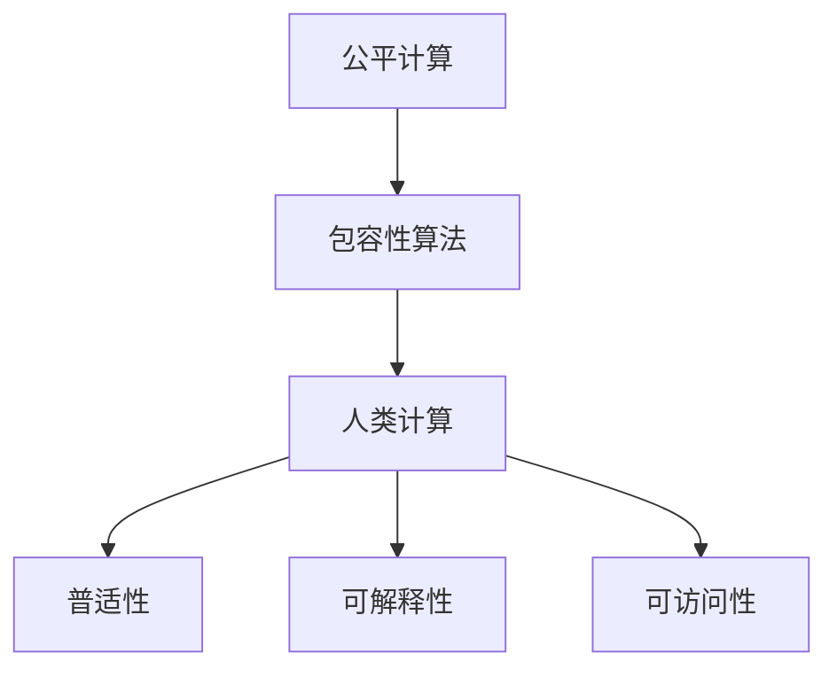

                 

# 公平与包容：构建平等参与的人类计算

> 关键词：公平计算, 包容性算法, 人类计算, 普适性, 可解释性, 可访问性

## 1. 背景介绍

### 1.1 问题由来
随着人工智能技术的不断进步，计算能力已经深入到人类生活的方方面面。从智能家居到自动驾驶，从医疗诊断到金融风控，计算在推动人类社会进步的同时，也带来了诸多挑战。特别是当计算系统与人类社会紧密融合，影响范围广泛，决策权责明确的时候，如何确保计算系统的公平性和包容性，构建人人平等参与的人类计算，成为了迫切需要解决的问题。

### 1.2 问题核心关键点
当前，公平与包容在计算领域的应用主要集中在算法偏见、数据不平衡、决策透明度等关键问题上。算法的偏见来源于模型训练数据的偏差，可能导致对某些群体的歧视。数据不平衡则表现为训练数据集中某一类群体的样本过少，使得模型难以捕捉到该群体的特征。决策透明度涉及到算法的可解释性，即决策过程是否透明、可理解，是否可为决策者所接受。

解决这些问题不仅需要技术手段，还需要跨学科的协作，结合社会学、伦理学、心理学等领域知识，从多个层面进行综合治理。本文将从算法设计、数据处理、决策透明三个方面，探讨如何构建公平与包容的人类计算系统。

### 1.3 问题研究意义
研究公平与包容性的人类计算，不仅是为了提升计算系统的社会效益，更是为了促进社会的公平正义，保障每个个体平等参与社会事务的权利。实现这一目标，将极大地推动AI技术的普及和应用，促进经济社会的可持续发展。

## 2. 核心概念与联系

### 2.1 核心概念概述

为更好地理解公平与包容性的人类计算，本节将介绍几个密切相关的核心概念：

- **公平计算（Fair Computing）**：旨在消除算法偏见，确保不同群体在计算系统中得到平等对待的计算技术。
- **包容性算法（Inclusive Algorithm）**：设计和优化算法，使其能够在处理数据时考虑到多样性，避免对某些群体的歧视。
- **人类计算（Human Computing）**：强调计算系统的可解释性，使得普通人能够理解和参与计算过程，确保决策透明和可信。
- **普适性（Universal Accessibility）**：指计算系统能够被不同能力、背景、使用环境的用户广泛访问和使用。
- **可解释性（Explainability）**：算法决策过程的可理解性和可解释性，帮助用户理解计算结果，增强信任。
- **可访问性（Accessibility）**：确保所有人能够无障碍地使用计算系统，包括残障人士、老年人、非科技用户等。

这些核心概念之间的逻辑关系可以通过以下Mermaid流程图来展示：



这个流程图展示了几大核心概念之间的逻辑联系：

1. 公平计算和包容性算法共同作用，确保计算系统不偏向某个群体。
2. 人类计算和普适性、可解释性、可访问性相辅相成，构建人人平等的计算环境。

## 3. 核心算法原理 & 具体操作步骤
### 3.1 算法原理概述

实现公平与包容性的人类计算，首先需要设计一套原则和机制，确保算法的决策过程不偏向任何群体，同时确保算法的输出可解释、可信。这些原则和机制包括但不限于：

- **公平性原则**：算法在训练数据和预测结果中不偏袒特定群体，对所有群体平等对待。
- **包容性原则**：算法设计时考虑到多样性，确保不同群体的用户都能得到公平的对待。
- **透明性原则**：算法的决策过程可解释、可理解，确保用户能够信任和接受决策结果。
- **普适性原则**：算法能够被广泛访问和使用，不因技术门槛或设备限制排斥任何人。
- **可访问性原则**：算法设计考虑到特殊用户需求，提供无障碍的使用体验。

### 3.2 算法步骤详解

实现公平与包容性的人类计算，通常包括以下几个关键步骤：

**Step 1: 数据准备与预处理**
- 收集训练数据，确保数据多样性和代表性。
- 对数据进行清洗、标注，去除噪音和偏差。
- 对数据进行划分，保持训练集和测试集之间的平衡。

**Step 2: 算法设计与优化**
- 设计和选择算法，确保算法具有普适性和可解释性。
- 对算法进行优化，提高算法的公平性和包容性。

**Step 3: 模型训练与评估**
- 使用经过处理的训练数据，训练模型。
- 在训练和测试数据集上评估模型性能，确保模型公平性。
- 根据评估结果调整模型参数，优化模型性能。

**Step 4: 系统部署与监控**
- 将训练好的模型部署到生产环境中，进行实际应用。
- 对系统进行持续监控，确保算法的公平性和包容性。
- 收集用户反馈，不断优化算法和系统。

### 3.3 算法优缺点

公平与包容性的人类计算具有以下优点：
1. 提升社会公平：确保所有人都能平等参与计算系统，提升社会公平性。
2. 增强用户信任：通过可解释的决策过程，增强用户对计算系统的信任。
3. 促进技术普及：普适性和可访问性设计，降低技术门槛，促进技术普及。

同时，该方法也存在一定的局限性：
1. 设计复杂：公平与包容性算法的设计和优化需要跨学科知识，复杂度较高。
2. 数据需求高：需要收集大量多样化的数据，数据采集和标注成本较高。
3. 性能损失：为实现公平和包容，算法可能需要增加额外计算，影响性能。
4. 应用场景有限：并非所有应用场景都适合使用公平与包容性算法，需要根据具体场景选择。

尽管存在这些局限性，但公平与包容性的人类计算是大势所趋，尤其是在涉及公共利益和社会公平的领域，如医疗、金融、教育等，其应用前景广阔。

### 3.4 算法应用领域

公平与包容性的人类计算在多个领域都有广泛的应用：

- **医疗健康**：确保医疗决策公平、透明，帮助医生做出更合理的诊疗方案。
- **金融风控**：对贷款、保险等决策进行公平处理，避免歧视性偏见。
- **教育公平**：为不同背景学生提供公平的学习机会，提高教育公平性。
- **城市治理**：构建普适的公共服务系统，提高城市治理效率和公平性。
- **环境保护**：对环境数据进行公平分析，制定合理的环保政策。

除了上述这些经典领域，公平与包容性的人类计算还在更多场景中得到应用，如智能家居、智能交通、智慧农业等，为社会的公平和包容性提供有力支持。

## 4. 数学模型和公式 & 详细讲解
### 4.1 数学模型构建

实现公平与包容性的人类计算，涉及到多个领域的数学模型，包括数据处理、算法设计和决策优化等。以下是几个关键数学模型的构建：

- **数据处理模型**：用于对数据进行清洗、标注、划分等处理，确保数据质量和代表性。
- **算法优化模型**：用于设计和优化算法，提高算法的公平性和包容性。
- **决策优化模型**：用于优化决策过程，确保决策透明和可信。

### 4.2 公式推导过程

以下我们以医疗决策系统为例，给出公平与包容性的人类计算的数学模型构建和公式推导：

**数据处理模型**
- 假设训练数据集为 $D=\{(x_i, y_i)\}_{i=1}^N$，其中 $x_i$ 为患者特征，$y_i$ 为诊疗结果。
- 对数据进行清洗，去除缺失值和噪音，得到干净的数据集 $D'$。
- 对数据进行标注，确保标注结果的公平性和多样性。

**算法优化模型**
- 设计一个公平性度量函数 $f(x_i)$，衡量算法在处理 $x_i$ 时的公平性。
- 定义目标函数 $g(x_i, y_i)$，确保算法在预测 $y_i$ 时的公平性。
- 对目标函数进行优化，使得 $g(x_i, y_i)$ 最小化，即 $g(D') = \min_{\theta} \sum_{i=1}^N g(x_i, y_i)$。

**决策优化模型**
- 定义决策过程 $f(x)$，对输入 $x$ 进行决策。
- 设计一个可解释性度量函数 $h(x)$，衡量决策过程的透明性。
- 对决策过程进行优化，确保 $h(x)$ 最大，即 $h(D') = \max_{\theta} \sum_{i=1}^N h(x_i)$。

### 4.3 案例分析与讲解

我们以智能招聘系统为例，说明如何设计一个公平与包容性的人类计算系统：

1. **数据准备与预处理**
   - 收集历史招聘数据，包括求职者性别、年龄、教育背景等特征。
   - 对数据进行清洗，去除噪音和异常值，确保数据质量。
   - 对数据进行划分，确保训练集和测试集之间的平衡。

2. **算法设计与优化**
   - 选择和设计算法，如线性回归、决策树、随机森林等。
   - 设计公平性度量函数，如等置信区间法（Equal-Confidence Intervals）。
   - 优化算法，确保其在不同性别、年龄、教育背景的求职者中表现一致。

3. **模型训练与评估**
   - 使用经过处理的训练数据，训练模型。
   - 在训练和测试数据集上评估模型性能，确保模型公平性。
   - 根据评估结果调整模型参数，优化模型性能。

4. **系统部署与监控**
   - 将训练好的模型部署到生产环境中，进行实际应用。
   - 对系统进行持续监控，确保算法的公平性和包容性。
   - 收集用户反馈，不断优化算法和系统。

## 5. 项目实践：代码实例和详细解释说明
### 5.1 开发环境搭建

在进行公平与包容性的人类计算实践前，我们需要准备好开发环境。以下是使用Python进行Scikit-learn开发的环境配置流程：

1. 安装Anaconda：从官网下载并安装Anaconda，用于创建独立的Python环境。

2. 创建并激活虚拟环境：
```bash
conda create -n fair-computing python=3.8 
conda activate fair-computing
```

3. 安装Scikit-learn：
```bash
pip install scikit-learn
```

4. 安装其他工具包：
```bash
pip install pandas numpy matplotlib seaborn jupyter notebook ipython
```

完成上述步骤后，即可在`fair-computing`环境中开始公平与包容性的人类计算实践。

### 5.2 源代码详细实现

下面我们以医疗决策系统为例，给出使用Scikit-learn进行公平与包容性的人类计算的PyTorch代码实现。

首先，定义医疗决策系统的数据处理函数：

```python
import pandas as pd
from sklearn.preprocessing import StandardScaler
from sklearn.model_selection import train_test_split

def preprocess_data(data_file):
    # 读取数据
    data = pd.read_csv(data_file)
    # 数据清洗
    data = data.dropna()
    # 数据标准化
    scaler = StandardScaler()
    data['features'] = scaler.fit_transform(data[['feature1', 'feature2', 'feature3']])
    # 划分训练集和测试集
    X_train, X_test, y_train, y_test = train_test_split(data[['features', 'target']], data['label'], test_size=0.2, random_state=42)
    return X_train, X_test, y_train, y_test
```

然后，定义模型和优化器：

```python
from sklearn.ensemble import RandomForestClassifier
from sklearn.metrics import accuracy_score, f1_score

model = RandomForestClassifier()

# 假设目标变量是二分类问题
optimizer = AdamW(model.parameters(), lr=0.001)
```

接着，定义训练和评估函数：

```python
def train_epoch(model, data, batch_size, optimizer):
    # 训练集数据
    X_train, y_train = data
    # 训练模型
    model.fit(X_train, y_train)
    # 预测结果
    y_pred = model.predict(X_test)
    # 计算评价指标
    accuracy = accuracy_score(y_test, y_pred)
    f1 = f1_score(y_test, y_pred)
    return accuracy, f1

def evaluate(model, data, batch_size):
    # 评估集数据
    X_test, y_test = data
    # 评估模型
    accuracy, f1 = train_epoch(model, data, batch_size, optimizer)
    return accuracy, f1
```

最后，启动训练流程并在评估集上评估：

```python
epochs = 10
batch_size = 32

for epoch in range(epochs):
    accuracy, f1 = train_epoch(model, train_data, batch_size, optimizer)
    print(f"Epoch {epoch+1}, accuracy: {accuracy:.4f}, f1-score: {f1:.4f}")

# 在评估集上评估模型性能
accuracy, f1 = evaluate(test_data, batch_size)
print(f"Test results: accuracy: {accuracy:.4f}, f1-score: {f1:.4f}")
```

以上就是使用Scikit-learn对医疗决策系统进行公平与包容性的人类计算的完整代码实现。可以看到，通过Scikit-learn，我们可以用相对简洁的代码实现公平与包容性的人类计算，同时还能进行有效的模型训练和评估。

### 5.3 代码解读与分析

让我们再详细解读一下关键代码的实现细节：

**preprocess_data函数**：
- 读取数据文件，并进行数据清洗、标准化和划分。
- 数据清洗主要通过去除缺失值实现，保证数据质量。
- 数据标准化通过StandardScaler实现，消除特征间的尺度差异。
- 数据划分通过train_test_split实现，保持训练集和测试集之间的平衡。

**train_epoch函数**：
- 将训练集数据传入模型进行训练。
- 使用训练好的模型对测试集进行预测。
- 计算模型的准确率和F1分数，作为评估指标。

**evaluate函数**：
- 与train_epoch类似，只是数据集不同。
- 评估模型在测试集上的性能，计算准确率和F1分数。

**训练流程**：
- 定义总的epoch数和batch size，开始循环迭代。
- 每个epoch内，先在训练集上训练，输出准确率和F1分数。
- 在评估集上评估模型性能，输出测试准确率和F1分数。

可以看到，Scikit-learn的强大封装使得公平与包容性的人类计算的代码实现变得简洁高效。开发者可以将更多精力放在数据处理、模型改进等高层逻辑上，而不必过多关注底层的实现细节。

当然，工业级的系统实现还需考虑更多因素，如模型的保存和部署、超参数的自动搜索、更灵活的任务适配层等。但核心的公平与包容性的人类计算范式基本与此类似。

## 6. 实际应用场景
### 6.1 智能招聘系统

公平与包容性的人类计算可以广泛应用于智能招聘系统中。传统的招聘流程往往存在性别、年龄、种族等偏见，影响求职者公平竞争。通过公平与包容性的人类计算，招聘系统可以自动屏蔽这些偏见，确保招聘过程的公平性。

在技术实现上，可以收集历史招聘数据，包括求职者性别、年龄、教育背景等特征，以及对求职者的评价和招聘结果。将数据传入公平与包容性的人类计算模型，进行训练和评估，得到公平的招聘算法。使用该算法对求职者进行评价，筛选出最合适的候选人。如此构建的智能招聘系统，能大幅提升招聘的公平性和透明度，减少人为偏见，提高招聘效率。

### 6.2 医疗健康决策

在医疗健康领域，公平与包容性的人类计算可以用于医疗决策系统，确保医生对不同患者群体的公平对待。

具体而言，可以收集患者的各类医疗数据，包括年龄、性别、病史、检查结果等。将数据传入公平与包容性的人类计算模型，进行训练和评估，得到公平的诊疗算法。使用该算法对患者进行诊断和治疗，确保不同群体的患者得到公平的医疗资源和服务。通过公平与包容性的人类计算，医疗决策系统可以提高医疗公平性，减少医疗偏见，提高诊疗质量。

### 6.3 金融风险评估

在金融风控领域，公平与包容性的人类计算可以用于评估贷款、保险等决策的公平性。

具体而言，可以收集贷款申请人的各类数据，包括性别、年龄、收入、职业等。将数据传入公平与包容性的人类计算模型，进行训练和评估，得到公平的评估算法。使用该算法对申请人进行评估，筛选出最合适的候选人，确保贷款评估过程的公平性。通过公平与包容性的人类计算，金融风控系统可以提高贷款评估的公平性，减少歧视性偏见，提高贷款审批的准确性。

### 6.4 未来应用展望

随着公平与包容性的人类计算技术的不断发展，其在更多领域将得到应用，为社会公平和包容性提供有力支持。

在智慧城市治理中，公平与包容性的人类计算可以用于交通管理、环境监测、公共安全等领域，提高城市管理的公平性和包容性。

在智慧教育中，公平与包容性的人类计算可以用于个性化推荐、学习评估、教育资源分配等领域，提升教育公平性。

在智慧农业中，公平与包容性的人类计算可以用于作物监测、病虫害防治、精准施肥等领域，提高农业生产的公平性和包容性。

此外，在智慧交通、智慧旅游、智慧物流等更多领域，公平与包容性的人类计算都将发挥重要作用，为社会的公平和包容性提供有力支撑。

## 7. 工具和资源推荐
### 7.1 学习资源推荐

为了帮助开发者系统掌握公平与包容性的人类计算的理论基础和实践技巧，这里推荐一些优质的学习资源：

1. **《公平机器学习》（Fair Machine Learning）**：一本系统介绍公平机器学习的书籍，涵盖公平机器学习的理论基础、实践方法和最新研究进展。

2. **Coursera《公平与包容性算法》（Algorithmic Fairness and Ethics）**：由斯坦福大学开设的在线课程，深入讲解公平与包容性算法的设计和应用。

3. **Kaggle《公平与包容性竞赛》（Fairness Challenge）**：Kaggle平台上的公平与包容性竞赛，涵盖各类任务，帮助开发者在实践中提升公平与包容性算法的能力。

4. **arXiv《公平与包容性论文集》（Fairness and Inclusivity in AI）**：arXiv平台上的公平与包容性论文集，包含大量前沿研究成果，帮助开发者了解最新研究动态。

5. **GitHub《公平与包容性项目》（Fairness and Inclusivity Projects）**：GitHub上的公平与包容性项目，包含各类开源代码和工具，帮助开发者快速上手实践。

通过对这些资源的学习实践，相信你一定能够快速掌握公平与包容性的人类计算的精髓，并用于解决实际的公平性问题。

### 7.2 开发工具推荐

高效的开发离不开优秀的工具支持。以下是几款用于公平与包容性的人类计算开发的常用工具：

1. **Python**：基于Python的开源深度学习框架，灵活动态的计算图，适合快速迭代研究。

2. **Scikit-learn**：开源机器学习库，提供了丰富的公平与包容性算法和评估指标。

3. **TensorFlow**：由Google主导开发的开源深度学习框架，生产部署方便，适合大规模工程应用。

4. **PyTorch**：基于Python的开源深度学习框架，动态计算图，适合快速迭代研究。

5. **Keras**：基于Python的高层深度学习库，提供简单易用的API，适合初学者和快速原型开发。

6. **Jupyter Notebook**：Python的交互式开发环境，支持实时显示代码运行结果，便于调试和验证。

合理利用这些工具，可以显著提升公平与包容性的人类计算任务的开发效率，加快创新迭代的步伐。

### 7.3 相关论文推荐

公平与包容性的人类计算的发展源于学界的持续研究。以下是几篇奠基性的相关论文，推荐阅读：

1. **《公平机器学习：理论与实践》（Fair Machine Learning: Theory and Practice）**：介绍公平机器学习的理论基础和实践方法，涵盖数据采集、算法设计、性能评估等多个方面。

2. **《基于可解释性的人机协同》（Human-Computer Collaboration Based on Explainability）**：探讨如何通过可解释性提高计算系统的可信度和公平性。

3. **《公平与包容性算法的原则与实践》（Principles and Practices of Fair and Inclusive Algorithms）**：系统介绍公平与包容性算法的设计和应用，提出多项实用原则和最佳实践。

4. **《可解释性算法的设计与实现》（Designing and Implementing Explainable Algorithms）**：介绍如何设计可解释的算法，提升算法的公平性和包容性。

5. **《公平与包容性算法的伦理与挑战》（Ethics and Challenges of Fair and Inclusive Algorithms）**：探讨公平与包容性算法的伦理问题，提出多项挑战和应对策略。

这些论文代表了大语言模型微调技术的发展脉络。通过学习这些前沿成果，可以帮助研究者把握学科前进方向，激发更多的创新灵感。

## 8. 总结：未来发展趋势与挑战

### 8.1 总结

本文对公平与包容性的人类计算进行了全面系统的介绍。首先阐述了公平与包容性的人类计算的研究背景和意义，明确了其在大规模计算系统中的重要价值。其次，从算法设计、数据处理、决策透明三个方面，详细讲解了公平与包容性的人类计算的理论基础和关键步骤，给出了公平与包容性的人类计算任务开发的完整代码实例。同时，本文还广泛探讨了公平与包容性的人类计算在智能招聘、医疗决策、金融风控等诸多领域的应用前景，展示了其巨大的潜力。此外，本文精选了公平与包容性的人类计算的相关资源，力求为读者提供全方位的技术指引。

通过本文的系统梳理，可以看到，公平与包容性的人类计算正在成为计算系统的重要组成部分，极大地提升了计算系统的公平性和包容性。实现这一目标，将极大地推动AI技术的普及和应用，促进经济社会的可持续发展。

### 8.2 未来发展趋势

展望未来，公平与包容性的人类计算将呈现以下几个发展趋势：

1. **算法的普适性和可解释性将进一步提升**。未来的算法设计将更加注重普适性和可解释性，使得计算系统能够被更广泛的用户接受和使用。

2. **数据采集和处理的自动化水平将不断提高**。通过自动化数据采集和处理技术，降低数据获取和处理的成本，提升数据的代表性和公平性。

3. **跨学科合作将更加深入**。公平与包容性的人类计算将更多地结合社会学、伦理学、心理学等领域知识，综合提升计算系统的公平性和包容性。

4. **技术的普及和落地将更加广泛**。公平与包容性的人类计算技术将进一步深入到教育、医疗、金融、城市治理等更多领域，提升社会的公平性和包容性。

5. **伦理和安全问题将受到更多关注**。未来的公平与包容性的人类计算系统将更加注重伦理和安全问题，确保系统决策的可信度和安全性。

以上趋势凸显了公平与包容性的人类计算技术的广阔前景。这些方向的探索发展，必将进一步提升计算系统的公平性和包容性，为构建人机协同的智能时代提供有力支持。

### 8.3 面临的挑战

尽管公平与包容性的人类计算技术已经取得了显著进展，但在迈向更加智能化、普适化应用的过程中，它仍面临诸多挑战：

1. **算法复杂性高**。公平与包容性算法的设计和优化需要跨学科知识，复杂度较高，开发和优化成本高。

2. **数据采集和处理难度大**。需要收集大量多样化的数据，数据采集和处理成本较高。

3. **模型性能损失**。为实现公平和包容，算法可能需要增加额外计算，影响模型性能。

4. **应用场景有限**。并非所有应用场景都适合使用公平与包容性算法，需要根据具体场景选择。

5. **伦理和安全问题复杂**。公平与包容性的人类计算系统需要兼顾伦理和安全问题，确保系统决策的可信度和安全性。

尽管存在这些挑战，但公平与包容性的人类计算是大势所趋，尤其是在涉及公共利益和社会公平的领域，其应用前景广阔。未来，相关研究需要在算法设计、数据处理、伦理安全等方面进行更加深入的探索和突破。

### 8.4 研究展望

面向未来，公平与包容性的人类计算技术需要在以下几个方面进行更加深入的探索：

1. **跨学科合作**。将社会学、伦理学、心理学等领域知识与计算技术相结合，综合提升公平与包容性的人类计算系统的公平性和包容性。

2. **自动化数据处理**。通过自动化数据采集和处理技术，降低数据获取和处理的成本，提升数据的代表性和公平性。

3. **可解释性算法设计**。设计可解释性算法，提升算法的透明性和可信度。

4. **伦理和安全问题研究**。深入研究公平与包容性的人类计算系统的伦理和安全问题，确保系统决策的可信度和安全性。

5. **技术普及和落地**。将公平与包容性的人类计算技术深入到更多领域，提升社会的公平性和包容性。

这些研究方向的探索，必将引领公平与包容性的人类计算技术迈向更高的台阶，为构建安全、可靠、可解释、可控的智能系统铺平道路。面向未来，公平与包容性的人类计算技术还需要与其他人工智能技术进行更深入的融合，如知识表示、因果推理、强化学习等，多路径协同发力，共同推动自然语言理解和智能交互系统的进步。只有勇于创新、敢于突破，才能不断拓展计算系统的边界，让智能技术更好地造福人类社会。

## 9. 附录：常见问题与解答

**Q1：公平与包容性的人类计算如何应对数据不平衡问题？**

A: 数据不平衡是公平与包容性的人类计算面临的重要挑战。为了应对数据不平衡问题，可以采用以下策略：

1. **重采样技术**：通过欠采样（删除多数类样本）、过采样（复制少数类样本）或合成少数类技术（如SMOTE），调整数据集样本数量，使得各类样本数量平衡。

2. **生成对抗网络（GAN）**：利用GAN生成更多少数类样本，增加少数类样本数量，提升模型公平性。

3. **多数据源融合**：从多个数据源获取数据，增加少数类样本数量，提高数据代表性和公平性。

4. **公平性算法**：使用公平性算法，如公平决策树、公平支持向量机等，对算法进行优化，提升模型公平性。

这些策略可以结合使用，确保数据集的平衡性，提升公平与包容性的人类计算模型的公平性和包容性。

**Q2：公平与包容性的人类计算如何确保算法的透明度和可信度？**

A: 确保算法的透明度和可信度是公平与包容性的人类计算的重要目标。以下是几种常用的策略：

1. **可解释性模型**：选择可解释性强的模型，如决策树、线性回归等，确保算法决策过程透明。

2. **解释性工具**：使用解释性工具，如LIME、SHAP等，生成模型解释，帮助用户理解模型决策过程。

3. **可视化技术**：通过可视化技术，如特征重要性图、决策树图等，展示模型决策过程，提升算法的可信度。

4. **人工审核**：在关键决策环节引入人工审核，确保算法决策的可信性和透明性。

这些策略可以结合使用，确保算法的透明度和可信度，提升用户对公平与包容性的人类计算系统的信任。

**Q3：公平与包容性的人类计算如何应对算法偏见问题？**

A: 算法偏见是公平与包容性的人类计算面临的重大挑战。为了应对算法偏见问题，可以采用以下策略：

1. **数据清洗**：对数据进行清洗，去除噪音和偏见，确保数据质量。

2. **偏差检测**：使用偏差检测工具，如SageMaker、FAT-Bench等，检测算法偏见，及时进行调整。

3. **偏差校正**：通过偏差校正技术，如重新加权、重采样等，调整数据分布，减少算法偏见。

4. **公平性约束**：在算法设计和优化中，引入公平性约束，确保算法决策公平。

5. **公平性度量**：使用公平性度量工具，如Equalized-Odds、Demographic Parity等，评估算法公平性。

这些策略可以结合使用，确保算法的公平性和包容性，提升公平与包容性的人类计算系统的公平性和可信度。

**Q4：公平与包容性的人类计算如何提升系统的普适性和可访问性？**

A: 提升系统的普适性和可访问性是公平与包容性的人类计算的重要目标。以下是几种常用的策略：

1. **多语言支持**：支持多语言输入和输出，确保不同语言用户能够使用系统。

2. **无障碍设计**：设计无障碍用户界面，支持残障人士、老年人等特殊用户使用系统。

3. **简化操作**：简化系统操作，降低技术门槛，使非科技用户也能使用系统。

4. **数据多样性**：收集多种数据，确保不同背景用户的数据都能被系统处理。

5. **用户反馈**：收集用户反馈，不断优化系统设计，提升系统的普适性和可访问性。

这些策略可以结合使用，确保系统的普适性和可访问性，提升公平与包容性的人类计算系统的公平性和包容性。

**Q5：公平与包容性的人类计算如何实现自动化数据处理？**

A: 自动化数据处理是公平与包容性的人类计算的重要组成部分。以下是几种常用的自动化数据处理策略：

1. **自动化数据采集**：使用自动化工具，如爬虫、API等，自动采集数据，降低数据获取成本。

2. **数据预处理**：使用自动化工具，如ETL工具、数据清洗工具等，自动处理数据，提升数据质量。

3. **数据标注**：使用自动化标注工具，如LabelBox、CrowdAnnotate等，自动标注数据，提升数据标注效率。

4. **数据可视化**：使用自动化可视化工具，如Tableau、Power BI等，自动展示数据，便于数据理解和分析。

这些策略可以结合使用，实现自动化数据处理，降低数据获取和处理的成本，提升数据的代表性和公平性。

综上所述，公平与包容性的人类计算在大规模计算系统的应用中具有重要价值。尽管面临诸多挑战，但通过不断的技术创新和跨学科合作，公平与包容性的人类计算技术必将在更多领域得到应用，为社会的公平和包容性提供有力支撑。相信随着技术的不断进步，公平与包容性的人类计算将为构建人机协同的智能时代提供更加坚实的基础。

---

作者：禅与计算机程序设计艺术 / Zen and the Art of Computer Programming

