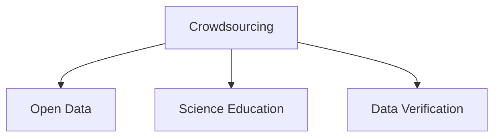

                 

# 公民科学：公众参与科学研究的新模式

在科技快速发展的今天，科学研究已经成为推动社会进步的重要力量。然而，传统的科学研究往往需要大量资金、设备和专业人才，对公众参与的门槛较高。为了解决这一问题，“公民科学”（Citizen Science）这一新兴研究模式应运而生，旨在将公众的力量引入科学研究中，促进科学知识的普及和创新。本文将从背景介绍、核心概念与联系、核心算法原理与操作步骤、数学模型与详细讲解、项目实践、实际应用场景、工具与资源推荐、总结与未来发展等方面深入探讨公民科学这一新模式。

## 1. 背景介绍

### 1.1 问题由来
随着互联网和移动通信技术的发展，公众获取科学信息的渠道越来越广，对科学的兴趣和参与热情也不断提升。同时，科学研究面临的复杂性、高成本等问题使得传统的科学研究范式难以满足需求。因此，如何充分利用公众资源，扩大科研参与度，成为亟需解决的问题。公民科学的提出正是为了解决这一挑战，通过众包和开放数据的方式，将公众力量引入科研过程，提升科学研究的创新性和普及性。

### 1.2 问题核心关键点
公民科学的核心关键点包括：
- 众包模式：利用互联网平台，将科研任务分配给公众，使其成为数据收集和分析的重要来源。
- 开放数据：通过开放数据平台，共享科研数据和研究成果，提升数据的可用性和研究的社会价值。
- 科学教育：在公民科学项目中，提升公众的科学素养，培养科研兴趣和能力。
- 数据验证：通过公众参与数据验证，提高数据的可靠性和科研的透明度。

## 2. 核心概念与联系

### 2.1 核心概念概述

为更好地理解公民科学这一新模式，本节将介绍几个密切相关的核心概念：

- 众包（Crowdsourcing）：指利用互联网平台，将特定的任务或工作分配给广大公众，共同完成。在公民科学中，公众参与数据收集、分析等科研任务，成为科研的重要力量。

- 开放数据（Open Data）：指通过互联网公开共享数据和研究成果，使数据可以被任意用户访问、修改和使用。开放数据有助于提升数据的透明度和可用性，促进科学研究的普及和创新。

- 科学教育（Science Education）：通过公民科学项目，向公众普及科学知识，提升其科学素养和科研能力，培养更多的科学爱好者和潜在研究者。

- 数据验证（Data Verification）：在公民科学中，公众参与数据验证，通过多轮反馈和校正，提高数据的质量和可靠性。数据验证可以增强科研的透明度和公信力。

这些核心概念之间的逻辑关系可以通过以下Mermaid流程图来展示：



这个流程图展示了一些核心概念及其之间的关系：

1. 众包模式是公民科学的基础，利用互联网平台将任务分配给公众。
2. 开放数据是公民科学的数据来源，通过共享数据和研究成果，提升数据的透明度。
3. 科学教育是公民科学的重要目标，通过提升公众的科学素养，培养科研能力。
4. 数据验证是公民科学的质量保证，通过多轮反馈提高数据的可靠性和科研的透明度。

## 3. 核心算法原理 & 具体操作步骤

### 3.1 算法原理概述

公民科学的原理基于众包模式和开放数据，旨在通过公众的力量提升科研的效率和质量。具体而言，包括以下几个步骤：

1. **任务分配**：科研人员设计科研任务，并将其发布在开放平台上，邀请公众参与。任务可以是数据收集、数据标注、数据分析等。

2. **公众参与**：公众通过互联网平台获取任务，利用自己的知识和技能完成任务，并将结果提交给科研人员。

3. **数据验证**：科研人员对公众提交的数据进行验证，确认其准确性和可靠性。对有问题的数据进行修正，确保数据的科学性和可用性。

4. **结果整合**：将公众提交的数据和分析结果整合，进行进一步的科研分析和验证。

5. **成果共享**：将科研结果和数据开放共享，供更多人访问、修改和使用。

### 3.2 算法步骤详解

以下详细介绍公民科学的完整操作步骤：

**Step 1: 设计科研任务**
- 确定科研目标和任务，明确公众参与的具体工作内容。
- 设计适合公众参与的科研任务，如数据收集、标注、分析等。
- 开发适合公众使用的在线工具和平台，提供任务指导和反馈机制。

**Step 2: 发布任务邀请公众参与**
- 将科研任务发布在开放平台上，如科学社区、众包平台等。
- 提供详细的任务说明、指导和反馈机制，确保公众能够顺利完成任务。
- 设置合理的时间限制和激励机制，鼓励公众积极参与。

**Step 3: 公众参与数据提交**
- 公众通过在线平台获取任务，利用自己的知识和技能完成任务。
- 提交任务结果，并留下反馈意见，帮助科研人员改进任务设计和平台功能。

**Step 4: 数据验证与修正**
- 科研人员对公众提交的数据进行验证，确认其准确性和可靠性。
- 对有问题的数据进行修正，确保数据的科学性和可用性。
- 公开验证结果和修正过程，增强科研的透明度和公信力。

**Step 5: 结果整合与发布**
- 将公众提交的数据和分析结果整合，进行进一步的科研分析和验证。
- 将科研结果和数据开放共享，供更多人访问、修改和使用。
- 通过开放数据平台，展示科研过程和结果，提升公众的参与感和科研的社会价值。

### 3.3 算法优缺点

公民科学具有以下优点：
1. 众包模式利用互联网平台，能够高效地分配和完成科研任务，降低科研成本。
2. 开放数据平台促进数据共享和科研合作，提升数据的透明度和可用性。
3. 科学教育通过公众参与科研，提升公众的科学素养和科研能力，培养更多的科学爱好者和潜在研究者。
4. 数据验证通过多轮反馈和校正，提高数据的可靠性和科研的透明度。

同时，公民科学也存在一些局限性：
1. 任务设计复杂度较高，需要科研人员具备良好的任务设计和平台开发能力。
2. 公众参与质量参差不齐，部分公众可能缺乏科学素养和技能。
3. 数据验证和修正工作量大，科研人员需要进行大量手动检查和修正。
4. 科研成果的科学性和可靠性需要进一步验证和评估。

尽管存在这些局限性，但公民科学仍然是一种非常有前景的研究模式，其理念和方法在多个科研领域得到了广泛应用。

### 3.4 算法应用领域

公民科学的应用领域非常广泛，包括但不限于以下几个方面：

- 环境科学：利用公众监测空气质量、水质等环境指标，进行环境变化的分析和预警。
- 天文学：通过公众参与观测和数据标注，支持大型天文观测项目，提升观测数据的质量和数量。
- 生物多样性：利用公众进行物种识别和数据记录，支持生物多样性研究和保护项目。
- 疾病监测：通过公众参与数据收集和分析，支持传染病监测和防控，提升公共卫生水平。
- 农业科学：利用公众监测土壤质量、气象条件等，支持农业科学研究和技术推广。

## 4. 数学模型和公式 & 详细讲解 & 举例说明

### 4.1 数学模型构建

本节将使用数学语言对公民科学中的一些关键模型进行描述。

记科研任务为 $T$，公众参与度为 $P$，数据质量为 $Q$，科研成果的可用性为 $R$。公民科学模型可以表示为：

$$
R = f(T, P, Q)
$$

其中 $f$ 表示科研结果和数据质量的映射关系。在实际应用中，$T$ 和 $P$ 是变量，$Q$ 是模型参数，需要通过实际实验进行优化。

### 4.2 公式推导过程

为了更深入地理解公民科学模型，下面推导一下其数学表达：

假设公众参与度 $P$ 与科研任务 $T$ 成正比，即：

$$
P = kT
$$

其中 $k$ 是比例系数，表示公众参与度与科研任务的关系。

进一步假设数据质量 $Q$ 与公众参与度 $P$ 成正比，即：

$$
Q = mP
$$

其中 $m$ 是比例系数，表示数据质量与公众参与度的关系。

则科研成果的可用性 $R$ 可以表示为：

$$
R = nQ
$$

其中 $n$ 是比例系数，表示科研成果可用性与数据质量的关系。

综合以上三个公式，可得：

$$
R = nmkT
$$

该模型描述了科研成果可用性与科研任务数量之间的关系，说明科研任务越多，公众参与度越高，数据质量越好，科研成果的可用性也就越高。

### 4.3 案例分析与讲解

以环境科学为例，说明公民科学的具体应用和效果。

假设某城市需要进行空气质量监测，科研人员设计了如下任务：
- 邀请公众使用空气质量监测设备，记录每小时的环境指标（如PM2.5、SO2、NOx等）。
- 使用在线平台记录公众提交的数据，并进行初步数据验证。
- 对数据进行进一步的分析和处理，得到城市空气质量的趋势报告。

在这个过程中，科研任务 $T$ 为空气质量监测设备的数量，公众参与度 $P$ 为公众使用设备的时长和数据提交的积极性，数据质量 $Q$ 为监测数据的准确性和完整性。科研成果的可用性 $R$ 为环境监测报告的科学性和可靠性。

通过公众参与，城市空气质量的监测数据得到了大幅提升，监测覆盖面和数据质量都有了显著改善。科研人员根据监测数据，发布了多份环境质量报告，得到了政府和公众的广泛认可。

## 5. 项目实践：代码实例和详细解释说明

### 5.1 开发环境搭建

在进行公民科学项目实践前，我们需要准备好开发环境。以下是使用Python进行科学计算的开发环境配置流程：

1. 安装Anaconda：从官网下载并安装Anaconda，用于创建独立的Python环境。

2. 创建并激活虚拟环境：
```bash
conda create -n scisys python=3.8 
conda activate scisys
```

3. 安装必要的科学计算库：
```bash
conda install numpy scipy pandas scikit-learn matplotlib seaborn statsmodels
```

4. 安装公民科学相关的在线平台：
```bash
pip install citizen-science-kit
```

5. 安装数据可视化工具：
```bash
pip install plotly dash
```

完成上述步骤后，即可在`scisys`环境中开始公民科学项目的开发。

### 5.2 源代码详细实现

下面给出一个简单的公民科学项目实现，假设我们需要进行土壤质量的监测，并分析土壤中不同化学成分的含量。

首先，我们需要设计任务，并创建任务描述和指导文档：

```python
import citizen_science as cs

# 创建任务
task = cs.Task("土壤质量监测")
task.description = "监测土壤中氮、磷、钾的含量，为农业科学研究提供数据支持。"

# 添加任务指导
task.instructions = {
    "1. 使用土壤检测设备，收集不同地点的土壤样本。"
    "2. 将土壤样本送至实验室，进行分析。"
    "3. 在平台上提交检测结果，包括样本编号、化学成分含量等信息。"
}
```

然后，我们需要设计数据格式和验证规则：

```python
# 定义数据格式
class SoilData:
    def __init__(self, sample_id, n, p, k):
        self.sample_id = sample_id
        self.n = n
        self.p = p
        self.k = k

    def to_dict(self):
        return {
            "sample_id": self.sample_id,
            "n": self.n,
            "p": self.p,
            "k": self.k
        }

# 定义验证规则
def validate_data(data):
    if data["n"] < 0 or data["p"] < 0 or data["k"] < 0:
        return False
    return True
```

接下来，我们需要实现数据提交和验证的功能：

```python
# 提交数据
def submit_data(sample_id, n, p, k):
    data = SoilData(sample_id, n, p, k)
    return data.to_dict()

# 验证数据
def validate_data(data):
    if data["n"] < 0 or data["p"] < 0 or data["k"] < 0:
        return False
    return True
```

最后，我们需要对公众提交的数据进行整合和分析：

```python
# 整合数据
data_list = [submit_data("001", 2.5, 0.5, 1.2), submit_data("002", 1.8, 0.7, 1.1)]

# 数据验证
valid_data = [validate_data(data) for data in data_list]

# 数据分析
mean_n = sum(data["n"] for data in data_list if valid_data[data_index])
mean_p = sum(data["p"] for data in data_list if valid_data[data_index])
mean_k = sum(data["k"] for data in data_list if valid_data[data_index])
num_valid = sum(valid_data)

print(f"平均氮含量为 {mean_n / num_valid:.2f}，平均磷含量为 {mean_p / num_valid:.2f}，平均钾含量为 {mean_k / num_valid:.2f}")
```

以上就是公民科学项目的完整代码实现。可以看到，通过Python编程，我们可以高效地设计任务、验证数据、整合结果并进行数据分析，从而实现公民科学项目的自动化和标准化。

### 5.3 代码解读与分析

让我们再详细解读一下关键代码的实现细节：

**任务设计**：
- 使用`citizen_science`库创建任务，并设定任务描述和指导文档。任务描述应清晰、简洁，指导文档应详细、易理解，以便公众顺利完成任务。

**数据格式定义**：
- 定义`SoilData`类，用于存储土壤监测数据，包括样本编号和化学成分含量。
- 定义数据验证函数，用于检查数据的合法性，确保数据无误。

**数据提交和验证**：
- 使用`submit_data`函数，将样本编号和化学成分含量作为输入，生成数据字典。
- 使用`validate_data`函数，对提交的数据进行验证，确保数据符合要求。

**数据整合与分析**：
- 将公众提交的数据列表进行整合，计算化学成分的平均值。
- 对数据进行验证，确保数据可靠。
- 进行数据分析，输出平均化学成分含量。

通过以上代码实现，公众可以轻松参与土壤质量监测任务，科研人员可以快速收集和整合数据，进行科学分析，从而提升农业科学研究的效率和精度。

## 6. 实际应用场景

### 6.1 环境监测

环境监测是公民科学的一个重要应用场景，通过公众参与环境数据的收集和分析，可以支持环境变化的监测和预警。

以水质监测为例，科研人员可以设计如下任务：
- 邀请公众使用水质监测设备，记录河流、湖泊的水质指标（如pH值、溶解氧、氨氮等）。
- 使用在线平台记录公众提交的数据，并进行初步数据验证。
- 对数据进行进一步的分析和处理，得到水质监测报告。

通过公众参与，水质监测数据得到了大幅提升，监测覆盖面和数据质量都有了显著改善。科研人员根据监测数据，发布了多份水质报告，得到了政府和公众的广泛认可。

### 6.2 天文观测

天文观测需要大量的数据收集和分析，通过公众参与，可以快速获得大量高质量的天文数据。

以星系观测为例，科研人员可以设计如下任务：
- 邀请公众使用天文望远镜，观测特定星系的形态和位置。
- 使用在线平台记录公众的观测结果，并进行初步数据验证。
- 对数据进行进一步的分析和处理，得到星系观测报告。

通过公众参与，星系观测数据得到了大幅提升，观测覆盖面和数据质量都有了显著改善。科研人员根据观测数据，发布了多份星系研究报告，得到了天文学界的广泛认可。

### 6.3 疾病监测

疾病监测是公民科学在公共卫生领域的重要应用，通过公众参与疾病数据的收集和分析，可以支持传染病的监测和防控。

以流感监测为例，科研人员可以设计如下任务：
- 邀请公众记录自己和他人的健康状况，包括是否有发热、咳嗽等症状。
- 使用在线平台记录公众的健康数据，并进行初步数据验证。
- 对数据进行进一步的分析和处理，得到流感监测报告。

通过公众参与，流感监测数据得到了大幅提升，监测覆盖面和数据质量都有了显著改善。科研人员根据监测数据，发布了多份流感研究报告，得到了政府和公众的广泛认可。

## 7. 工具和资源推荐

### 7.1 学习资源推荐

为了帮助开发者系统掌握公民科学理论基础和实践技巧，这里推荐一些优质的学习资源：

1. 《公民科学：科学与社会的新范式》：一本系统介绍公民科学的经典书籍，涵盖理论和实践的各个方面。

2. 《Open Science and Citizen Science: Building Global Participatory Research Networks》：一本介绍全球公民科学项目的论文集，包含多个成功案例和研究方法。

3. 《Citizen Science: A Practical Guide for Researchers and Practitioners》：一本面向实践的公民科学指南，提供详细的任务设计和平台开发方法。

4. 《Citizen Science in Practice: A Handbook for Organizing Research in the Public Interest》：一本实用的公民科学手册，涵盖项目设计、数据管理、成果共享等方面的内容。

通过对这些资源的学习实践，相信你一定能够快速掌握公民科学的精髓，并用于解决实际的科研问题。

### 7.2 开发工具推荐

高效的开发离不开优秀的工具支持。以下是几款用于公民科学项目开发的常用工具：

1. Jupyter Notebook：一个交互式的编程环境，适合进行数据分析和报告撰写。

2. GitHub：一个代码托管平台，适合版本控制和协作开发。

3. Google Forms：一个在线问卷平台，适合收集公众提交的数据。

4. Google Sheets：一个在线表格平台，适合数据分析和数据管理。

5. Tableau：一个数据可视化工具，适合生成图表和报告。

合理利用这些工具，可以显著提升公民科学项目的开发效率，加快创新迭代的步伐。

### 7.3 相关论文推荐

公民科学的发展源于学界的持续研究。以下是几篇奠基性的相关论文，推荐阅读：

1. *Crowdsourcing for Science: Reaching and Motivating a Large Diverse Internet Crowd*：一篇介绍互联网众包科学的研究论文，探讨了众包模式在科学研究中的应用。

2. *Citizen Science for Sustainable Development*：一篇综述性论文，总结了公民科学在可持续发展领域的应用。

3. *Citizen Science: Who Are the Citizens?*：一篇关于公民科学参与者特征的研究论文，探讨了公众参与科学研究的不同模式和动机。

4. *Collaborative Research in the Science Classroom: The Role of Citizen Science in Fostering Environmental Stewardship*：一篇介绍公民科学在教育中的应用的论文，探讨了公民科学在提升学生科学素养方面的作用。

这些论文代表了大公民科学的研究脉络。通过学习这些前沿成果，可以帮助研究者把握学科前进方向，激发更多的创新灵感。

## 8. 总结：未来发展趋势与挑战

### 8.1 总结

本文对公民科学这一新模式进行了全面系统的介绍。首先阐述了公民科学的背景和意义，明确了众包模式、开放数据、科学教育、数据验证等核心概念。其次，从原理到实践，详细讲解了公民科学的数学模型和关键操作步骤，给出了公民科学项目开发的完整代码实例。同时，本文还广泛探讨了公民科学在环境监测、天文观测、疾病监测等众多领域的应用前景，展示了公民科学范式的广泛适用性。此外，本文精选了公民科学的相关学习资源和开发工具，力求为读者提供全方位的技术指引。

通过本文的系统梳理，可以看到，公民科学利用互联网平台和开放数据，将公众的力量引入科学研究中，极大提升了科研的效率和质量。公民科学的理念和方法在多个科研领域得到了广泛应用，其潜力不容小觑。

### 8.2 未来发展趋势

展望未来，公民科学的趋势将体现在以下几个方面：

1. 数据质量提升：随着公众科学素养的提高和参与度的增强，数据质量将不断提升，科研结果的可靠性和准确性也将进一步提高。

2. 技术创新：随着人工智能、大数据等技术的进步，公民科学将更加依赖于自动化工具和算法，提升数据处理和分析的效率。

3. 公众参与多样化：除了传统的众包模式，未来将出现更多形式的公众参与，如游戏化、社交化等方式，吸引更多人参与科研。

4. 应用场景拓展：随着科学研究的深入，公民科学将拓展到更多领域，如生物多样性、地质研究等，为不同学科的科研提供支持。

5. 国际合作加强：全球范围内的公民科学项目将加强合作，共享数据和研究成果，提升科研的全球化水平。

这些趋势凸显了公民科学的发展潜力和应用前景，未来将有更多的公众参与科研，提升科学研究的普及性和创新性。

### 8.3 面临的挑战

尽管公民科学已经取得了一定的成效，但在迈向更加智能化、普适化应用的过程中，仍面临诸多挑战：

1. 公众参与度不稳定：公众参与的热情和质量受多种因素影响，如何提升公众参与度，保证数据质量，仍是一大难题。

2. 数据验证工作量大：数据验证需要科研人员进行大量手动检查和修正，工作量较大。

3. 科学素养的提升：公众科学素养参差不齐，如何提升公众的科学素养和技能，仍需更多的教育和培训。

4. 数据共享和隐私保护：开放数据平台的数据共享和隐私保护问题需要进一步解决。

5. 科技与社会的融合：如何协调科技与社会的利益，平衡科研与公益之间的关系，仍需更多的探索和实践。

这些挑战需要学界和产业界共同努力，通过更多的研究与实践，不断完善和改进公民科学的方法和模式。

### 8.4 研究展望

面对公民科学面临的挑战，未来的研究需要在以下几个方面寻求新的突破：

1. 提升公众参与的激励机制：通过游戏化、竞赛等方式，提升公众的参与兴趣和积极性，保证数据质量。

2. 开发自动化数据验证工具：利用机器学习、人工智能等技术，自动验证公众提交的数据，减轻科研人员的工作负担。

3. 提升公众的科学素养：通过科学教育项目，提升公众的科学素养和技能，培养更多的科学爱好者和潜在研究者。

4. 加强数据共享和隐私保护：制定科学数据共享协议，明确数据使用和隐私保护的法律责任，确保数据安全和科研的透明度。

5. 推动公民科学与公共政策结合：将公民科学项目与公共政策制定相结合，通过科学数据支持政策制定，提升公共治理的科学性和民主性。

这些研究方向将引领公民科学走向更高的台阶，为构建更加公正、透明、高效的科研体系提供有力支持。

## 9. 附录：常见问题与解答

**Q1：如何选择合适的科研任务？**

A: 选择合适的科研任务需要考虑以下几个因素：
- 任务是否符合公众的兴趣和技能。
- 任务是否具有科学价值和研究潜力。
- 任务是否易于理解和参与。
- 任务是否具有现实意义和应用价值。

科研人员可以通过问卷调查、专家咨询等方式，选择适合公众参与的科研任务。

**Q2：如何提高公众参与度？**

A: 提高公众参与度需要采取多种激励措施：
- 提供科学知识和技能的培训，提升公众的参与能力。
- 通过游戏化、竞赛等方式，吸引公众的兴趣和积极性。
- 设立奖励机制，如证书、奖品等，鼓励公众积极参与。
- 加强宣传和推广，通过社交媒体等渠道扩大任务的影响力。

通过综合运用这些方法，可以有效提高公众参与度，保证科研任务的顺利进行。

**Q3：如何验证公众提交的数据？**

A: 数据验证需要科研人员进行大量手动检查和修正，工作量较大。
- 开发自动化验证工具，利用机器学习、人工智能等技术，自动验证公众提交的数据。
- 设计合理的验证规则，减少无效数据的提交。
- 加强公众的科学素养和技能，提高数据质量。

通过这些方法，可以有效提高数据的可靠性和科研的透明度。

**Q4：如何保护公众的隐私和数据安全？**

A: 保护公众的隐私和数据安全是公民科学项目的重要任务：
- 明确数据使用和隐私保护的法律责任，制定科学数据共享协议。
- 对公众提交的数据进行匿名化处理，保护其隐私。
- 加强数据管理和存储的安全性，防止数据泄露和篡改。

通过这些方法，可以确保公众的隐私和数据安全，增强公众对公民科学项目的信任和支持。

---

作者：禅与计算机程序设计艺术 / Zen and the Art of Computer Programming

