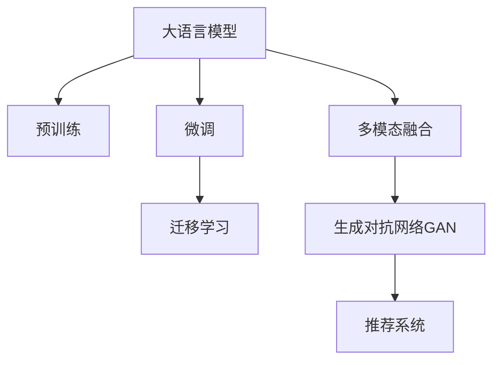

                 

# 创业者探索大模型新商业模式，打造AI产品矩阵

## 1. 背景介绍

在人工智能技术迅猛发展的背景下，大语言模型（Large Language Models, LLMs）已经成为驱动AI创新的重要引擎。创业公司如何在大模型上突破传统模式，发掘新价值，打造具有竞争力的AI产品矩阵，成为众多创业者面临的全新挑战。本文将围绕大语言模型在商业化应用中的探索和实践，为创业者和AI开发者提供深度思考和专业见解。

## 2. 核心概念与联系

### 2.1 核心概念概述

- **大语言模型**：通过大规模数据自监督预训练获得语言表示能力的模型，如GPT-3、BERT等。具备复杂的自然语言理解和生成能力。
- **预训练-微调**：利用大规模无标签数据进行预训练，然后通过下游任务的有标签数据进行微调，提升模型在特定任务上的表现。
- **迁移学习**：预训练模型通过微调适应新任务，减少了从头训练的需求，提高了模型的泛化能力。
- **多模态融合**：将文本、图像、声音等多模态信息结合起来，提升模型对复杂任务的理解能力。
- **生成对抗网络（GAN）**：一种生成模型，用于生成新的、逼真的文本或图像，常用于数据增强和数据生成。
- **推荐系统**：根据用户历史行为和偏好，推荐个性化内容，常用于电商平台、新闻推荐等。

这些概念之间的联系可以通过以下Mermaid流程图来展示：



## 3. 核心算法原理 & 具体操作步骤

### 3.1 算法原理概述

大语言模型通常包含自回归模型（如GPT）或自编码模型（如BERT），通过大规模语料预训练获得语言知识。预训练过程包括预测下一个单词或掩码语言模型任务。预训练后的模型通过有监督微调（Finetuning）适应具体任务，如分类、生成、匹配等。迁移学习允许预训练模型在特定任务上获得更好的性能，同时减少了从头训练的计算资源需求。

### 3.2 算法步骤详解

1. **数据准备**：收集并标注适用于特定任务的数据集。
2. **模型加载**：加载预训练模型（如BERT、GPT），并将其作为基础模型。
3. **适配层设计**：根据任务类型，设计合适的输出层和损失函数。
4. **微调训练**：在标注数据集上训练模型，优化输出层和适配层权重。
5. **评估与部署**：在验证集上评估模型性能，调整参数后部署到生产环境。

### 3.3 算法优缺点

- **优点**：
  - 高效利用预训练模型知识，减少从头训练时间。
  - 适应性强，能处理多种下游任务。
  - 性能提升显著，尤其在标注数据量有限的情况下。

- **缺点**：
  - 数据标注成本高。
  - 模型复杂，硬件资源需求大。
  - 过拟合风险高，需要谨慎选择学习率和正则化参数。

### 3.4 算法应用领域

大语言模型预训练-微调技术被广泛应用于自然语言处理（NLP）领域的多种任务，包括但不限于：

- **文本分类**：将文本归类到预定义的类别中。
- **命名实体识别**：识别文本中的实体，如人名、地名等。
- **机器翻译**：将一种语言翻译成另一种语言。
- **文本生成**：生成新的文本，如对话生成、文章摘要生成等。
- **问答系统**：根据用户问题提供准确答案。

## 4. 数学模型和公式 & 详细讲解 & 举例说明

### 4.1 数学模型构建

大语言模型的目标是通过优化损失函数 $L$，最大化模型在特定任务上的性能：

$$ L = \frac{1}{N} \sum_{i=1}^N \ell(y_i, M_{\theta}(x_i)) $$

其中 $M_{\theta}$ 为模型参数，$\ell$ 为损失函数，$y_i$ 为真实标签，$x_i$ 为输入。

### 4.2 公式推导过程

以分类任务为例，假设模型输出为概率 $P(y|x)$，真实标签为 $y$，交叉熵损失为：

$$ \ell = - \frac{1}{N} \sum_{i=1}^N y_i \log P(y|x_i) + (1 - y_i) \log (1 - P(y|x_i)) $$

模型参数的更新公式为：

$$ \theta_{new} = \theta_{old} - \eta \nabla_{\theta}L $$

其中，$\eta$ 为学习率，$\nabla_{\theta}L$ 为损失函数对参数的梯度。

### 4.3 案例分析与讲解

假设我们要训练一个文本分类模型，用于判断新闻文章是政治、体育、经济等类别。我们可以采用预训练的BERT模型，微调其全连接层以适应新闻分类任务。使用交叉熵损失函数和Adam优化器，微调过程如下：

1. 准备数据集：新闻文章及其类别。
2. 加载BERT模型，并冻结中间层。
3. 添加线性分类层，输出层使用softmax激活函数。
4. 训练模型：前向传播计算损失，反向传播更新参数。
5. 评估模型：在验证集上计算准确率、精确率、召回率等指标。
6. 部署模型：将模型应用于新的新闻文章，预测其类别。

## 5. 项目实践：代码实例和详细解释说明

### 5.1 开发环境搭建

1. **安装Python环境**：创建虚拟环境，安装必要的库（如TensorFlow、PyTorch、numpy等）。
2. **下载预训练模型**：使用Hugging Face的transformers库下载预训练的BERT模型。
3. **准备数据集**：使用Pandas等库准备训练集和验证集。

### 5.2 源代码详细实现

```python
import torch
import numpy as np
from transformers import BertForSequenceClassification, BertTokenizer

# 加载BERT模型和分词器
model = BertForSequenceClassification.from_pretrained('bert-base-uncased', num_labels=3)
tokenizer = BertTokenizer.from_pretrained('bert-base-uncased')

# 准备数据
train_data = ['headline1', 'headline2', 'headline3', ...]
train_labels = [0, 1, 0, 1, ...]
dev_data = ['headline4', 'headline5', 'headline6', ...]
dev_labels = [1, 0, 1, ...]

# 编码训练数据
train_encodings = tokenizer(train_data, truncation=True, padding='max_length')
dev_encodings = tokenizer(dev_data, truncation=True, padding='max_length')

# 模型训练
device = torch.device('cuda' if torch.cuda.is_available() else 'cpu')
model.to(device)

optimizer = torch.optim.Adam(model.parameters(), lr=2e-5)
for epoch in range(10):
    model.train()
    for batch in train_encodings:
        # 前向传播
        inputs = {key: torch.tensor(val) for key, val in batch.items()}
        with torch.no_grad():
            outputs = model(inputs)
        loss = outputs.loss
        # 反向传播
        optimizer.zero_grad()
        loss.backward()
        optimizer.step()

    # 评估模型
    model.eval()
    for batch in dev_encodings:
        with torch.no_grad():
            inputs = {key: torch.tensor(val) for key, val in batch.items()}
            outputs = model(inputs)
        loss = outputs.loss
        accuracy = torch.nn.functional.cross_entropy(outputs.logits, dev_labels).item()

    print(f"Epoch {epoch+1}, accuracy: {accuracy}")
```

### 5.3 代码解读与分析

- **模型加载与编码**：使用transformers库加载BERT模型和分词器，并将训练数据编码为模型所需的输入格式。
- **模型训练与评估**：使用Adam优化器，在每个epoch迭代训练数据，评估模型在验证集上的准确率。
- **模型部署**：将模型保存，用于新的新闻文章分类任务。

### 5.4 运行结果展示

通过上述代码，我们可以训练出一个新闻分类模型，并使用模型对新的新闻文章进行分类预测。训练过程中，我们需要注意验证集的准确率，并在达到预设的停止条件后保存模型。

## 6. 实际应用场景

### 6.1 智能客服系统

智能客服系统利用大语言模型处理客户咨询，提供了自动回复、情绪分析、智能导航等功能。微调后的模型能够理解客户的问题，生成符合人类沟通习惯的回答。

### 6.2 金融舆情监测

金融机构利用大语言模型分析市场舆情，识别潜在风险，及时做出反应。微调模型能够实时监控社交媒体、新闻报道等，判断市场情绪和趋势。

### 6.3 个性化推荐系统

推荐系统利用大语言模型理解用户需求，生成个性化推荐内容。微调模型能够根据用户的历史行为和偏好，生成更符合用户喜好的推荐列表。

### 6.4 未来应用展望

未来，大语言模型将在更多领域得到应用，如智慧医疗、智能教育、智慧城市等。多模态融合、生成对抗网络等技术将进一步提升模型的性能和应用范围。同时，模型的可解释性和安全性也将成为关注的重点。

## 7. 工具和资源推荐

### 7.1 学习资源推荐

- **《自然语言处理综论》**：经典NLP教材，详细介绍了NLP的基本概念和常用算法。
- **CS224N：《深度学习与自然语言处理》**：斯坦福大学课程，涵盖了NLP的主要理论和实践。
- **《深度学习》**：Ian Goodfellow著，全面介绍了深度学习的基础知识和最新进展。

### 7.2 开发工具推荐

- **PyTorch**：强大的深度学习框架，提供了丰富的神经网络库。
- **TensorFlow**：Google开发的深度学习框架，支持分布式训练。
- **Transformers**：Hugging Face开发的NLP工具库，提供了预训练模型的微调接口。
- **Jupyter Notebook**：交互式编程环境，便于代码调试和实验。

### 7.3 相关论文推荐

- **Attention is All You Need**：Transformer模型的原论文，奠定了NLP预训练大模型的基础。
- **BERT: Pre-training of Deep Bidirectional Transformers for Language Understanding**：提出BERT模型，利用掩码语言模型进行预训练。
- **BERT-Pretrained Representations for Financial Classification**：应用BERT模型于金融分类任务的经典论文。
- **Adversarial Examples in Natural Language Processing**：介绍生成对抗网络在NLP中的应用。

## 8. 总结：未来发展趋势与挑战

### 8.1 研究成果总结

大语言模型在预训练-微调技术上的应用，极大地提升了NLP任务的性能和可解释性。创业公司通过微调技术，能够在较少标注数据和计算资源的情况下，快速构建高性能的AI产品。

### 8.2 未来发展趋势

- **模型规模增大**：未来预训练模型将拥有更多参数，能够处理更复杂的任务。
- **多模态融合**：将文本、图像、声音等结合，提升模型的理解能力和生成能力。
- **生成对抗网络**：生成逼真的数据，用于数据增强和生成。
- **推荐系统**：结合深度学习和大数据技术，提供个性化推荐。

### 8.3 面临的挑战

- **数据标注成本高**：高质量标注数据的获取成本较高。
- **过拟合风险大**：模型在特定任务上容易出现过拟合。
- **模型复杂度高**：硬件资源需求大，部署成本高。
- **安全性问题**：模型可能输出有害信息，引发伦理问题。

### 8.4 研究展望

未来，大语言模型预训练-微调技术将在更多领域得到应用，成为推动AI产业发展的重要力量。创业者和AI开发者需要关注模型的安全性、可解释性和效率，进一步优化和扩展模型的应用范围。

## 9. 附录：常见问题与解答

### Q1: 大语言模型在微调过程中如何避免过拟合？

**A1:** 使用正则化技术（如L2正则、Dropout）、早停策略和数据增强等方法可以避免过拟合。同时，参数高效微调方法（如Adapter）也可以减少微调的过拟合风险。

### Q2: 如何评估微调后模型的性能？

**A2:** 在验证集上计算准确率、精确率、召回率等指标，并使用ROC曲线、AUC等方法评估模型的分类性能。

### Q3: 微调模型在实际部署中需要注意什么？

**A3:** 考虑模型的裁剪、量化加速、服务化封装、弹性伸缩、监控告警和安全防护等问题。

### Q4: 创业公司如何选择合适的预训练模型？

**A4:** 考虑模型的规模、参数量、计算资源需求和适用任务，选择适合自己需求的预训练模型。

通过深入了解大语言模型预训练-微调技术，创业者可以更加灵活地构建AI产品矩阵，提升企业的竞争力。同时，未来的技术发展也将为创业公司提供更多创新和突破的机会。

