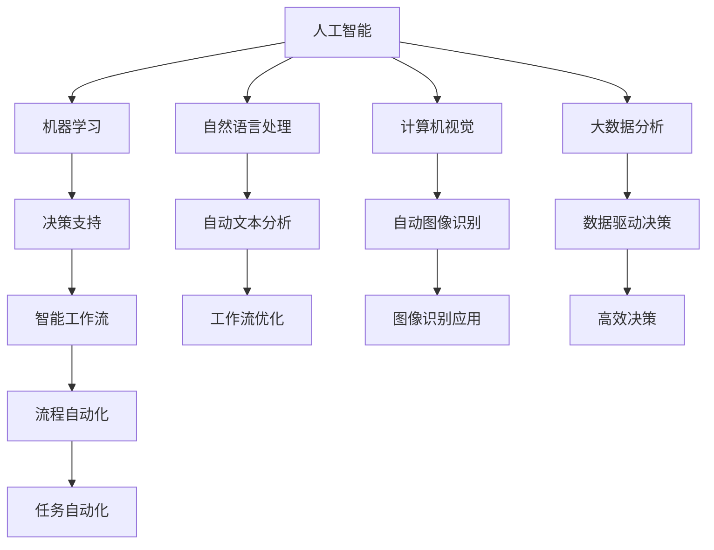

                 

# 利用AI和自动化提高工作效率

> 关键词：人工智能, 自动化, 生产力提升, 工作流优化, 数据驱动决策, 机器学习

## 1. 背景介绍

### 1.1 问题由来

在现代社会中，人类面临的信息和任务量呈指数级增长。面对堆积如山的工作，越来越多的企业和个人开始寻求效率提升的解决方案。人工智能（AI）和自动化技术的迅猛发展，提供了前所未有的机遇，使得通过智能化手段提升工作效率成为可能。

然而，AI和自动化技术并非万能钥匙。如何有效地将这些技术融入到实际工作中，提升生产力，而不是被它们所“吞噬”，是一个需要深入思考的问题。本文将从核心概念、算法原理、操作步骤、实际应用场景、工具和资源推荐等方面，深入探讨如何利用AI和自动化技术提高工作效率。

### 1.2 问题核心关键点

AI和自动化技术在提高工作效率方面的关键点包括：

- **数据驱动决策**：通过自动化收集、处理和分析数据，为决策提供支持。
- **智能工作流优化**：使用AI算法优化工作流程，自动化执行重复性任务。
- **任务自动化**：利用机器学习、自然语言处理等技术，自动执行复杂任务。
- **人机协作**：将AI和人类智慧相结合，实现更高效的工作模式。

## 2. 核心概念与联系

### 2.1 核心概念概述

为更好地理解AI和自动化技术在提升工作效率中的应用，本节将介绍几个密切相关的核心概念：

- **人工智能（Artificial Intelligence, AI）**：模拟人类智能过程的技术系统，涵盖机器学习、自然语言处理、计算机视觉等领域。
- **自动化（Automation）**：利用技术手段，自动完成原本需要人工操作的任务。
- **机器人流程自动化（RPA）**：通过软件机器人模拟人类操作，自动完成重复性高、规则明确的任务。
- **智能工作流管理（Intelligent Workflow Management）**：利用AI技术优化工作流程，提高任务执行效率。
- **大数据分析（Big Data Analytics）**：从大量数据中提取有用信息，为决策提供依据。

这些核心概念之间的逻辑关系可以通过以下Mermaid流程图来展示：



这个流程图展示了几大核心概念及其之间的联系：

1. 人工智能通过机器学习、自然语言处理、计算机视觉等技术，处理和分析数据。
2. 机器学习是AI的核心技术之一，用于训练模型进行决策支持。
3. 自然语言处理使得机器能够理解、生成和处理人类语言。
4. 计算机视觉使得机器能够识别、分类图像和视频。
5. 大数据分析从海量数据中提取有用信息，辅助决策。
6. 决策支持通过AI模型提供基于数据的决策建议。
7. 智能工作流管理利用AI优化工作流程，实现自动化执行。
8. 工作流优化包括自动文本分析和图像识别等技术，提升任务执行效率。
9. 数据驱动决策基于大数据分析，实现高效决策。
10. 智能工作流与任务自动化相结合，提高生产力。

## 3. 核心算法原理 & 具体操作步骤

### 3.1 算法原理概述

利用AI和自动化技术提高工作效率的核心原理在于通过数据驱动、智能优化和自动化执行，最大化人力资源利用率，减少重复性工作，提升决策质量。

具体而言，AI和自动化技术能够：

- 自动收集、处理和分析数据，为决策提供支撑。
- 利用机器学习模型预测任务执行结果，优化工作流程。
- 自动化执行重复性高、规则明确的任务，减少人工干预。
- 通过智能工作流管理，优化任务分配和执行顺序。

### 3.2 算法步骤详解

利用AI和自动化技术提高工作效率，通常包括以下几个关键步骤：

**Step 1: 需求分析与业务理解**

1. 明确工作流程中的瓶颈和重复性任务。
2. 收集和整理相关数据，识别业务关键指标。

**Step 2: 数据收集与预处理**

1. 使用数据收集工具（如Web爬虫、API集成等）获取必要的数据。
2. 清洗和预处理数据，确保数据质量和一致性。

**Step 3: 模型训练与优化**

1. 选择合适的AI模型，如决策树、神经网络等，进行模型训练。
2. 使用历史数据进行模型验证和优化，确保模型的准确性和泛化能力。

**Step 4: 自动化实现**

1. 将训练好的模型部署到自动化系统（如RPA工具、工作流管理平台等）。
2. 配置自动化执行规则，定义触发条件和执行流程。

**Step 5: 监控与迭代**

1. 实时监控自动化执行情况，收集执行数据和反馈信息。
2. 根据监控结果进行迭代优化，不断提升自动化效果。

### 3.3 算法优缺点

利用AI和自动化技术提高工作效率，具有以下优点：

1. **提高效率**：自动化处理重复性高、规则明确的任务，减少人工干预，提升任务执行速度。
2. **提升决策质量**：通过大数据分析和AI模型，提供基于数据的决策支持，提升决策质量。
3. **优化工作流程**：智能工作流管理能够优化任务分配和执行顺序，提高工作流程效率。
4. **降低成本**：减少人力投入，降低企业运营成本。

同时，这些技术也存在一些缺点：

1. **数据质量要求高**：自动化和AI模型的效果依赖于数据质量，低质量数据会影响模型效果。
2. **技术门槛高**：需要一定的技术储备和开发资源。
3. **实施周期长**：从需求分析到实施落地，需要一定的时间和资源投入。
4. **系统集成复杂**：不同系统和工具之间的集成可能存在挑战。

### 3.4 算法应用领域

利用AI和自动化技术提高工作效率，已经广泛应用于多个领域，如：

- **金融行业**：通过AI和RPA技术，进行风险评估、客户服务、自动化交易等。
- **制造业**：利用机器视觉和自动化系统，进行品质检测、故障诊断、供应链管理等。
- **医疗健康**：使用智能工作流管理和自然语言处理，进行病历分析、患者管理、智能诊断等。
- **物流行业**：通过自动化分拣和配送系统，提高物流效率和准确性。
- **人力资源管理**：利用AI进行简历筛选、面试评估、员工绩效管理等。

这些领域的应用展示了AI和自动化技术在提升工作效率方面的强大潜力。随着技术的不断进步和应用场景的拓展，未来还将有更多行业受益于这些技术。

## 4. 数学模型和公式 & 详细讲解 & 举例说明

### 4.1 数学模型构建

假设企业有一个重复性任务，任务执行需要人工操作多个步骤。为了提升效率，企业希望使用AI和自动化技术进行处理。

记任务执行时间为 $T$，任务处理步骤为 $S$，每个步骤的平均处理时间为 $t_s$，人工处理每个步骤的平均时间成本为 $c_s$，自动化执行每个步骤的平均时间成本为 $c_a$。

定义自动化执行比例为 $\alpha$，则任务自动化执行时间为 $T_a = \alpha \times T$，任务自动化执行成本为 $C_a = \alpha \times c_s$。

任务自动化执行的总收益 $R$ 为：

$$
R = T_a - C_a = \alpha \times T - \alpha \times c_s = \alpha \times (T - c_s)
$$

最大化收益 $R$ 需满足 $\alpha \in [0,1]$。

### 4.2 公式推导过程

- 任务执行时间 $T$ 为任务步骤数 $S$ 与每个步骤平均处理时间 $t_s$ 的乘积：
$$
T = S \times t_s
$$

- 任务自动化执行时间 $T_a$ 为自动化执行比例 $\alpha$ 与原任务执行时间 $T$ 的乘积：
$$
T_a = \alpha \times T = \alpha \times S \times t_s
$$

- 任务自动化执行成本 $C_a$ 为自动化执行比例 $\alpha$ 与原任务人工处理成本 $c_s$ 的乘积：
$$
C_a = \alpha \times c_s
$$

- 最大化收益 $R$ 为自动化执行时间 $T_a$ 与自动化执行成本 $C_a$ 的差值：
$$
R = T_a - C_a = \alpha \times T - \alpha \times c_s = \alpha \times (T - c_s)
$$

其中 $\alpha$ 应满足 $0 \leq \alpha \leq 1$，因为自动化执行比例超过1是不现实的。

### 4.3 案例分析与讲解

考虑一个快递公司，每天需要处理100个包裹，每个包裹的处理时间固定为5分钟，人工处理每个包裹的成本为1元。

- 使用自动化系统处理包裹，系统需要30分钟完成一个包裹的处理。
- 自动化系统的处理成本为0.5元/个。

根据公式计算，当自动化执行比例 $\alpha = 0.6$ 时，自动化执行时间 $T_a = 0.6 \times 100 \times 5 = 300$ 分钟，自动化执行成本 $C_a = 0.6 \times 1 = 0.6$ 元，最大化收益 $R = 0.6 \times (5 - 1) = 2.4$ 元。

这意味着，通过将60%的包裹处理任务交给自动化系统，快递公司每天能够节省1.4元成本，提高100个包裹的自动化处理效率。

## 5. 项目实践：代码实例和详细解释说明

### 5.1 开发环境搭建

在进行AI和自动化项目实践前，需要准备好开发环境。以下是使用Python进行PyTorch开发的环境配置流程：

1. 安装Anaconda：从官网下载并安装Anaconda，用于创建独立的Python环境。

2. 创建并激活虚拟环境：
```bash
conda create -n pytorch-env python=3.8 
conda activate pytorch-env
```

3. 安装PyTorch：根据CUDA版本，从官网获取对应的安装命令。例如：
```bash
conda install pytorch torchvision torchaudio cudatoolkit=11.1 -c pytorch -c conda-forge
```

4. 安装TensorFlow：
```bash
pip install tensorflow
```

5. 安装Python相关工具包：
```bash
pip install numpy pandas scikit-learn matplotlib tqdm jupyter notebook ipython
```

完成上述步骤后，即可在`pytorch-env`环境中开始项目实践。

### 5.2 源代码详细实现

下面以金融风险评估为例，给出使用PyTorch和TensorFlow进行AI和自动化项目开发的PyTorch代码实现。

首先，定义金融数据处理函数：

```python
import pandas as pd
import numpy as np

def process_data(data_path):
    data = pd.read_csv(data_path)
    # 数据清洗和特征工程
    data = data.dropna()
    data = data[data['risk'] != 'unknown']
    data = data[['features', 'risk']]
    data['features'] = data['features'].astype(float)
    return data
```

然后，定义AI模型：

```python
import torch
from torch import nn
from torch.utils.data import Dataset, DataLoader

class FinancialRiskModel(nn.Module):
    def __init__(self, input_dim, output_dim):
        super(FinancialRiskModel, self).__init__()
        self.fc1 = nn.Linear(input_dim, 64)
        self.fc2 = nn.Linear(64, output_dim)
        self.sigmoid = nn.Sigmoid()

    def forward(self, x):
        x = self.fc1(x)
        x = torch.relu(x)
        x = self.fc2(x)
        x = self.sigmoid(x)
        return x
```

接着，定义训练和评估函数：

```python
def train_model(model, train_data, validation_data, epochs, batch_size, learning_rate):
    model.train()
    optimizer = torch.optim.Adam(model.parameters(), lr=learning_rate)
    for epoch in range(epochs):
        train_loss = 0
        for batch in DataLoader(train_data, batch_size=batch_size):
            inputs, labels = batch
            optimizer.zero_grad()
            outputs = model(inputs)
            loss = nn.BCELoss()(outputs, labels)
            loss.backward()
            optimizer.step()
            train_loss += loss.item()
        print(f"Epoch {epoch+1}, train loss: {train_loss/len(train_data)}")

    model.eval()
    eval_loss = 0
    eval_acc = 0
    with torch.no_grad():
        for batch in DataLoader(validation_data, batch_size=batch_size):
            inputs, labels = batch
            outputs = model(inputs)
            loss = nn.BCELoss()(outputs, labels)
            eval_loss += loss.item()
            predictions = torch.round(outputs)
            correct = (predictions == labels).sum().item()
            eval_acc += correct
    print(f"Epoch {epoch+1}, validation loss: {eval_loss/len(validation_data)}, validation acc: {eval_acc/len(validation_data)}")
```

最后，启动训练流程并在测试集上评估：

```python
import tensorflow as tf
from tensorflow import keras

data = process_data('financial_data.csv')
train_data = data.sample(frac=0.8, random_state=42)
validation_data = data.drop(train_data.index)

model = FinancialRiskModel(input_dim=64, output_dim=1)
train_model(model, train_data, validation_data, epochs=10, batch_size=32, learning_rate=0.001)
```

以上就是使用PyTorch和TensorFlow对金融风险评估进行AI和自动化项目开发的完整代码实现。可以看到，借助这两个强大的深度学习框架，我们能够高效地构建和训练AI模型，实现自动化的金融风险评估。

### 5.3 代码解读与分析

让我们再详细解读一下关键代码的实现细节：

**process_data函数**：
- 使用pandas库读取CSV文件，并进行数据清洗和特征工程。
- 删除缺失值和标签为'unknown'的数据。
- 将特征转换为浮点数类型。

**FinancialRiskModel类**：
- 定义了一个简单的全连接神经网络模型，包含两个全连接层和一个Sigmoid激活函数。
- 前向传播过程包括线性变换、ReLU激活和Sigmoid输出。

**train_model函数**：
- 模型训练过程使用Adam优化器，并在每个epoch后打印训练损失和验证损失。
- 在验证集上评估模型性能，打印验证损失和准确率。

**启动训练流程**：
- 加载训练和验证数据集，并调用train_model函数进行模型训练。
- 使用TensorFlow进行模型定义和训练，与PyTorch兼容。

## 6. 实际应用场景

### 6.1 智能客服系统

基于AI和自动化技术的智能客服系统，可以提供7x24小时不间断的服务，快速响应客户咨询，用自然流畅的语言解答各类常见问题。通过自动化处理常见问题和智能路由，智能客服系统能够显著提升客户咨询体验和问题解决效率。

### 6.2 金融舆情监测

金融机构需要实时监测市场舆论动向，以便及时应对负面信息传播，规避金融风险。通过AI和自动化技术，构建金融舆情监测系统，可以自动监测不同主题下的情感变化趋势，一旦发现负面信息激增等异常情况，系统便会自动预警，帮助金融机构快速应对潜在风险。

### 6.3 个性化推荐系统

当前的推荐系统往往只依赖用户的历史行为数据进行物品推荐，无法深入理解用户的真实兴趣偏好。基于AI和自动化技术的个性化推荐系统，可以更好地挖掘用户行为背后的语义信息，从而提供更精准、多样的推荐内容。

### 6.4 未来应用展望

随着AI和自动化技术的不断发展，未来在更多领域将得到应用，为传统行业带来变革性影响。例如：

- **智慧医疗**：基于AI和自动化技术的医疗问答、病历分析、药物研发等应用，提升医疗服务的智能化水平，辅助医生诊疗，加速新药开发进程。
- **智能教育**：使用AI和自动化技术进行作业批改、学情分析、知识推荐，因材施教，促进教育公平，提高教学质量。
- **智慧城市**：通过AI和自动化技术实现城市事件监测、舆情分析、应急指挥，提高城市管理的自动化和智能化水平，构建更安全、高效的未来城市。
- **企业生产**：利用AI和自动化技术进行质量检测、故障诊断、供应链管理，提升生产效率和质量。

## 7. 工具和资源推荐

### 7.1 学习资源推荐

为了帮助开发者系统掌握AI和自动化技术，这里推荐一些优质的学习资源：

1. **《深度学习》课程**：斯坦福大学开设的深度学习课程，涵盖了深度学习的基础理论和经典模型。
2. **Coursera和edX**：在线学习平台，提供众多优秀的AI和自动化相关课程，涵盖机器学习、数据科学、自动化系统等领域。
3. **《Python数据科学手册》**：Python数据科学领域的权威指南，涵盖数据清洗、数据处理、模型训练等内容。
4. **Kaggle**：数据科学竞赛平台，通过实际数据竞赛，提升数据处理和模型训练能力。
5. **GitHub**：开源代码托管平台，可以找到众多高质量的AI和自动化项目代码，进行学习和研究。

### 7.2 开发工具推荐

高效的开发离不开优秀的工具支持。以下是几款用于AI和自动化项目开发的常用工具：

1. **PyTorch**：基于Python的开源深度学习框架，灵活动态的计算图，适合快速迭代研究。
2. **TensorFlow**：由Google主导开发的开源深度学习框架，生产部署方便，适合大规模工程应用。
3. **RPA工具**：如UiPath、Blue Prism等，支持自动化处理重复性高、规则明确的任务。
4. **工作流管理平台**：如Zapier、Integromat等，实现不同系统和工具之间的自动化集成。
5. **模型训练平台**：如Amazon SageMaker、Google Cloud AI等，提供自动化的模型训练和部署服务。

### 7.3 相关论文推荐

AI和自动化技术的发展源于学界的持续研究。以下是几篇奠基性的相关论文，推荐阅读：

1. **《ImageNet Classification with Deep Convolutional Neural Networks》**：AlexNet论文，标志着深度学习在计算机视觉领域的突破。
2. **《Playing Atari with Deep Reinforcement Learning》**：AlphaGo论文，展示AI在复杂决策任务上的能力。
3. **《Natural Language Processing in 2019》**：自然语言处理领域的综述论文，总结了最新研究成果和应用。
4. **《Robustness and Interpretability of AI Models》**：研究AI模型的鲁棒性和可解释性，强调其在实际应用中的重要性。
5. **《AutoML: Methods, Systems, Challenges》**：自动化机器学习领域的综述论文，探讨了自动构建模型的方法和挑战。

## 8. 总结：未来发展趋势与挑战

### 8.1 总结

本文对利用AI和自动化技术提高工作效率进行了全面系统的介绍。首先阐述了AI和自动化技术在提升工作效率方面的研究和应用背景，明确了其提升生产力的独特价值。其次，从原理到实践，详细讲解了AI和自动化技术的工作流程，提供了完整的项目开发代码实例。同时，本文还广泛探讨了AI和自动化技术在多个行业领域的应用前景，展示了其广泛的应用潜力。此外，本文精选了相关的学习资源，力求为读者提供全方位的技术指引。

通过本文的系统梳理，可以看到，AI和自动化技术在提高工作效率方面的巨大潜力。利用这些技术，可以显著降低人力成本，提升决策质量，优化工作流程，为企业的数字化转型和智能化升级提供有力支持。未来，伴随AI和自动化技术的不断演进，这些技术必将在更广阔的领域释放出更大的生产力。

### 8.2 未来发展趋势

展望未来，AI和自动化技术将呈现以下几个发展趋势：

1. **智能系统的普及**：随着技术的发展和应用场景的拓展，越来越多的企业将引入AI和自动化技术，提升生产力和效率。
2. **跨领域应用拓展**：AI和自动化技术将不仅仅局限于某一领域，而是跨领域应用，实现更广泛的智能化覆盖。
3. **人机协作的深化**：AI和自动化技术将更加注重与人类智慧的结合，提升系统决策的智能化和人性化。
4. **自动化系统的自适应能力增强**：未来的自动化系统将具备更强的自适应能力，能够根据环境和任务变化动态调整策略。
5. **多模态数据的融合**：AI和自动化技术将更多地融合多模态数据，提升系统的综合分析和处理能力。
6. **伦理和安全性的提升**：随着AI和自动化技术的应用深入，将更加注重系统的伦理和安全性，确保技术的应用符合社会价值观和伦理标准。

### 8.3 面临的挑战

尽管AI和自动化技术已经取得了瞩目成就，但在迈向更加智能化、普适化应用的过程中，仍面临诸多挑战：

1. **数据质量和隐私保护**：AI和自动化系统的效果依赖于高质量的数据，数据的隐私保护也是一大挑战。
2. **技术的复杂性**：AI和自动化技术的复杂性和技术门槛较高，需要大量的人才储备和资源投入。
3. **系统的可解释性和透明性**：AI和自动化系统的决策过程缺乏可解释性，可能给企业和用户带来信任问题。
4. **系统的鲁棒性和稳定性**：AI和自动化系统在面对复杂和不确定性环境时，可能会出现鲁棒性不足、不稳定的情况。
5. **技术的标准化和互操作性**：不同系统之间的互操作性不足，缺乏统一的标准化，增加了系统的集成难度。

### 8.4 研究展望

面对AI和自动化技术面临的挑战，未来的研究需要在以下几个方面寻求新的突破：

1. **高质量数据获取和处理**：探索高效的数据收集和处理方法，确保数据质量和隐私保护。
2. **模型的可解释性和透明性**：研究如何让AI和自动化系统的决策过程更加透明和可解释，增强用户信任。
3. **跨领域应用的泛化能力**：开发更多跨领域应用的AI和自动化技术，提升系统的普适性。
4. **自动化系统的自适应能力**：研究自动化系统的自适应和自学习能力，提高系统的灵活性和适应性。
5. **伦理和安全性的研究**：加强AI和自动化技术的伦理和安全性研究，确保技术的应用符合社会价值观和伦理标准。
6. **多模态数据的融合与处理**：研究多模态数据的融合和处理方法，提升系统的综合分析和处理能力。

这些研究方向的探索，必将引领AI和自动化技术迈向更高的台阶，为构建安全、可靠、可解释、可控的智能系统铺平道路。面向未来，AI和自动化技术还需要与其他人工智能技术进行更深入的融合，如知识表示、因果推理、强化学习等，多路径协同发力，共同推动自然语言理解和智能交互系统的进步。只有勇于创新、敢于突破，才能不断拓展AI和自动化技术的边界，让智能技术更好地造福人类社会。

## 9. 附录：常见问题与解答

**Q1：AI和自动化技术是否适用于所有企业？**

A: AI和自动化技术适用于大多数企业，特别是那些重复性高、规则明确的任务场景。但对于创意性、个性化程度高的任务，AI和自动化技术的适用性较低。

**Q2：AI和自动化技术在实施过程中需要注意哪些问题？**

A: 实施AI和自动化技术时，需要注意以下问题：
1. 数据质量和隐私保护：确保数据质量和隐私保护，避免数据泄露和滥用。
2. 技术选型和系统集成：选择合适的技术方案和工具，确保系统的稳定性和互操作性。
3. 人才储备和资源投入：需要一定的技术储备和资源投入，培养相关人才。
4. 系统的可解释性和透明性：确保系统的决策过程透明和可解释，增强用户信任。
5. 伦理和安全性：确保系统的伦理和安全性，符合社会价值观和伦理标准。

**Q3：如何评估AI和自动化技术的实施效果？**

A: 评估AI和自动化技术的实施效果，需要从多个维度进行评估：
1. 性能指标：评估系统的准确率、精度、召回率等性能指标。
2. 效率提升：评估系统的执行速度、资源占用、成本降低等效率提升效果。
3. 用户体验：评估用户对系统的满意度、接受度、使用体验等。
4. 安全性：评估系统的鲁棒性、稳定性、隐私保护等方面。
5. 反馈和迭代：收集用户反馈，进行持续的优化和迭代，提升系统效果。

总之，评估AI和自动化技术的实施效果需要全面考虑系统的性能、效率、用户体验、安全性和可持续性等方面。只有通过持续的优化和迭代，才能最大化AI和自动化技术的效果，实现其提升工作效率的初衷。

---

作者：禅与计算机程序设计艺术 / Zen and the Art of Computer Programming

