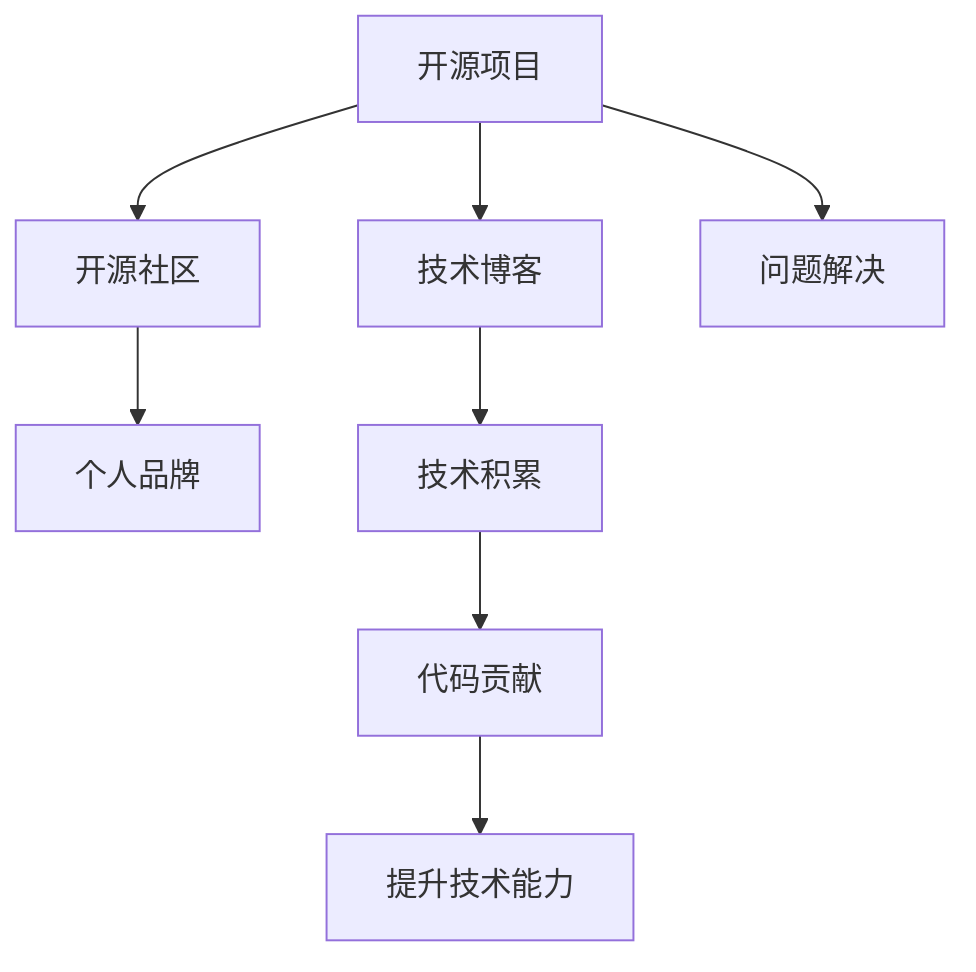

                 

## 1. 背景介绍

### 1.1 问题由来
在当今数字化时代，个人品牌建设已经成为各行各业从业者必备的技能之一。个人品牌不仅能提升个人影响力，还能在职场竞争中占据有利位置。而开源项目作为展示个人能力和才华的平台，无疑是一个极佳的选择。如何利用开源项目打造个人品牌，是众多开发者和从业者共同的关注点。

### 1.2 问题核心关键点
利用开源项目打造个人品牌的关键在于两个方面：一是要在开源社区中建立起良好的声誉和口碑，二是要通过开源项目积累技术实力和行业经验。

#### 1.2.1 开源社区声誉
在开源社区中，声誉是衡量个人能力的硬指标。开发高质量的开源项目、积极维护和更新，以及在社区中积极交流和合作，都能帮助提升个人品牌影响力。

#### 1.2.2 技术实力与行业经验
开源项目不仅能展示技术实力，还能通过项目实践积累行业经验。通过参与开源项目，开发者可以了解行业动态、解决实际问题，并通过项目应用落地实际场景。

## 2. 核心概念与联系

### 2.1 核心概念概述

为更好地理解如何利用开源项目打造个人品牌，本节将介绍几个密切相关的核心概念：

- 开源项目(Open Source Project)：指软件项目源代码公开，用户可自由修改、使用、分享的项目。开源项目一般具有开放性、协作性和多样性等特点。
- 个人品牌(Personal Brand)：指个人在特定领域内的知名度、影响力及社会评价。通过个人品牌，个体可以展示专业能力、积累行业经验，建立职业网络。
- 技术博客(Tech Blog)：指通过记录技术学习、项目开发、问题解决等内容的博客，展示个人技术水平和思考深度。
- 开源社区(Open Source Community)：指围绕开源项目形成的技术交流、协作和分享社群，常见的如GitHub、Stack Overflow等。
- 技术积累(Tech Accumulation)：指通过参与开源项目、解决技术问题等积累的技术知识、编码经验、行业见解等。

这些核心概念之间的逻辑关系可以通过以下Mermaid流程图来展示：



这个流程图展示了这个主题下的核心概念及其之间的关系：

1. 开源项目是展示技术实力的平台。
2. 技术博客是分享技术积累的渠道。
3. 开源社区是获取行业经验、建立职业网络的场所。
4. 个人品牌是技术积累和社区贡献的最终体现。

## 3. 核心算法原理 & 具体操作步骤
### 3.1 算法原理概述

利用开源项目打造个人品牌的算法原理是基于以下三点：

- 展示技术实力：通过贡献高质量的开源代码、撰写技术博客，展示技术深度和广度。
- 积累行业经验：通过参与开源项目，解决实际问题，积累行业知识和经验。
- 建立职业网络：通过开源社区积极交流、合作，建立行业人脉。

具体步骤如下：

1. 选择合适的开源项目。
2. 贡献高质量代码。
3. 撰写技术博客，记录项目开发、问题解决等。
4. 积极参与开源社区，与他人交流、合作。
5. 定期更新开源项目和博客内容，保持活跃。

### 3.2 算法步骤详解

以下是对每个步骤的详细说明：

#### 3.2.1 选择合适的开源项目

1. **了解自身优势**：评估自己的技术背景、兴趣方向，选择适合自己的开源项目。
2. **参与开源项目**：在GitHub等开源平台上搜索感兴趣的项目，了解其技术栈、需求、贡献方式等。
3. **贡献代码**：初步参与开源项目，贡献代码片段，熟悉项目流程和社区规范。

#### 3.2.2 贡献高质量代码

1. **代码审查**：贡献代码后，提交Pull Request，接受社区成员的代码审查，改进代码质量。
2. **文档完善**：完善代码注释、编写单元测试，确保代码可读性和可维护性。
3. **遵循规范**：遵循项目编码规范和开发流程，如代码审查、代码提交等。

#### 3.2.3 撰写技术博客

1. **内容规划**：确定博客主题，如项目开发、技术总结、问题解决等。
2. **撰写文章**：详细记录项目开发过程、解决的技术问题、心得体会等。
3. **发布分享**：在Medium、CSDN、个人博客等平台上发布，增加曝光率。

#### 3.2.4 积极参与开源社区

1. **问题解答**：在开源社区中积极回答问题，分享经验，建立声誉。
2. **交流合作**：与社区成员互动，建立职业网络。
3. **贡献资源**：提供技术支持、编写文档、参与组织活动等。

#### 3.2.5 定期更新开源项目和博客内容

1. **持续改进**：定期回顾和改进开源项目，增加新功能，解决新问题。
2. **博客更新**：定期更新博客内容，分享最新技术进展、项目成果等。
3. **参与讨论**：在开源社区中积极参与讨论，获取反馈。

### 3.3 算法优缺点

利用开源项目打造个人品牌的方法有以下优点：

- **展示技术实力**：通过高质量代码和博客内容，展示技术深度和广度。
- **积累行业经验**：通过参与开源项目，解决实际问题，积累行业知识和经验。
- **建立职业网络**：通过开源社区积极交流、合作，建立行业人脉。

同时，该方法也存在一些缺点：

- **时间成本高**：参与开源项目、撰写博客需要投入大量时间，对工作和学习负担较大。
- **知识更新快**：技术领域更新快，需要持续学习和跟进，防止知识过时。
- **缺乏制度保障**：开源社区的贡献反馈机制不完善，可能导致付出与收获不成正比。

尽管存在这些缺点，但总体而言，利用开源项目打造个人品牌是一种有效、实用的方法。通过不断的努力和积累，能显著提升个人品牌影响力，拓展职业发展空间。

### 3.4 算法应用领域

利用开源项目打造个人品牌的方法广泛应用于以下几个领域：

- **软件开发**：通过参与开源项目、撰写技术博客，展示编程能力和技术积累。
- **数据科学**：通过开源数据集分析、算法实现等，展示数据分析能力和技术实力。
- **人工智能**：通过开源AI项目、论文解读等，展示AI知识和项目经验。
- **硬件开发**：通过开源硬件设计、实现等，展示硬件设计能力和技术背景。

除了以上领域，利用开源项目打造个人品牌的方法还适用于教育、咨询、设计等众多行业，为从业者提供了展示专业能力和行业经验的平台。

## 4. 数学模型和公式 & 详细讲解 & 举例说明

### 4.1 数学模型构建

利用开源项目打造个人品牌的过程，可以通过数学模型进行建模。设个人品牌影响力为 $P$，代码质量为 $C$，社区活跃度为 $A$，技术博客访问量为 $B$，则可以构建以下模型：

$$
P = f(C, A, B)
$$

其中，$C$、$A$、$B$ 分别表示代码质量、社区活跃度和博客访问量。

### 4.2 公式推导过程

1. **代码质量 $C$**：贡献高质量代码，代码审查得分 $R$，注释完备性得分 $M$，单元测试覆盖率得分 $T$，则 $C = \max(R, M, T)$。
2. **社区活跃度 $A$**：积极回答问题，社区互动次数 $I$，组织活动次数 $O$，则 $A = I + O$。
3. **博客访问量 $B$**：博客阅读量 $R'$，推荐次数 $R''$，则 $B = R' + R''$。

将这些得分代入模型 $P = f(C, A, B)$，即可计算个人品牌影响力。

### 4.3 案例分析与讲解

以下通过一个具体案例来分析利用开源项目打造个人品牌的方法：

**案例**：一位开源项目贡献者利用GitHub平台，参与了一个开源数据分析项目。他通过以下步骤成功提升了个人品牌影响力：

1. **选择项目**：通过GitHub搜索找到了一个感兴趣的开源数据分析项目。
2. **贡献代码**：阅读项目文档，了解需求和贡献方式，提交了一些代码片段，并通过代码审查。
3. **撰写博客**：在CSDN上撰写了一篇详细介绍项目开发过程、遇到问题和解决方法的文章，获得了较高的阅读量和好评。
4. **参与社区**：在GitHub社区中积极回答问题，参与讨论，建立了良好的声誉。
5. **定期更新**：定期更新开源代码和博客内容，不断完善和提升。

通过上述步骤，该贡献者展示了技术实力，积累了行业经验，建立了职业网络，最终在开源社区中获得了较高的知名度和影响力。

## 5. 项目实践：代码实例和详细解释说明

### 5.1 开发环境搭建

以下是利用开源项目打造个人品牌的方法的开发环境搭建流程：

1. **安装Git**：在Linux系统上安装Git，可以通过命令行或包管理器进行安装。
2. **创建GitHub账户**：注册GitHub账户，建立个人仓库。
3. **克隆开源项目**：通过Git克隆开源项目到本地，使用以下命令：
   ```bash
   git clone https://github.com/username/project.git
   ```
4. **设置本地仓库**：配置本地仓库，关联远程仓库，使用以下命令：
   ```bash
   git remote add origin https://github.com/username/project.git
   git branch -M main
   git push -u origin main
   ```
5. **开发环境配置**：根据项目需求，安装必要的开发工具和依赖库。

### 5.2 源代码详细实现

以下是一个简单的开源项目贡献代码的示例：

1. **项目选择**：选择开源数据分析项目，如scikit-learn中的某个数据分析模块。
2. **阅读文档**：阅读项目文档，了解需求和贡献方式。
3. **编写代码**：在本地环境中编写代码，并提交Pull Request，接受代码审查。
4. **代码修改**：根据代码审查反馈，修改代码并提交新的Pull Request。
5. **完善文档**：编写代码文档，完善注释和单元测试，提交代码。

### 5.3 代码解读与分析

以下是代码实现和解释：

**代码示例**：

```python
# 导入依赖库
import pandas as pd
import numpy as np

# 读取数据集
data = pd.read_csv('data.csv')

# 数据清洗
data = data.dropna()

# 特征工程
data['feature'] = data['col'].apply(lambda x: x**2)

# 数据建模
model = LinearRegression()
model.fit(data[['feature']], data['target'])

# 模型评估
test_data = pd.read_csv('test_data.csv')
test_data = test_data.dropna()
y_pred = model.predict(test_data[['feature']])
```

**代码解释**：
- **导入依赖库**：导入常用的数据处理和模型库。
- **读取数据集**：使用Pandas读取数据集。
- **数据清洗**：去除缺失值。
- **特征工程**：提取特征，进行简单处理。
- **数据建模**：使用线性回归模型对数据进行建模。
- **模型评估**：使用测试数据集评估模型性能。

### 5.4 运行结果展示

以下是代码运行结果展示：

**运行结果**：
- **数据集加载成功**：显示数据集的基本信息，如列名、行数、数据类型等。
- **模型训练成功**：显示模型训练过程，如损失函数、训练轮数等。
- **模型评估成功**：显示模型在测试数据集上的性能评估结果，如均方误差等。

## 6. 实际应用场景

### 6.1 软件开发

在软件开发领域，开源项目是展示技术实力的重要平台。通过参与开源项目，开发者可以积累技术经验，提升编程能力，同时建立职业网络。

**案例**：一位开源贡献者参与了一个GitHub上的开源项目，通过贡献高质量代码、撰写技术博客、积极参与社区，最终在开源社区中建立了良好的声誉。他的个人品牌因此得到了显著提升，获得了更多的工作机会。

### 6.2 数据科学

数据科学领域中，开源项目和数据集是展示数据分析能力的重要资源。通过参与开源项目，数据分析师可以积累行业经验，展示技术深度。

**案例**：一位数据科学家参与了一个开源数据集分析项目，通过编写数据分析代码、撰写博客、参与社区讨论，积累了丰富的数据科学经验，并建立了广泛的人脉关系。他的个人品牌因此得到了大幅提升，获得了更多的行业认可。

### 6.3 人工智能

在人工智能领域，开源项目和模型库是展示AI知识和项目经验的重要途径。通过参与开源AI项目、撰写论文解读、分享AI应用，AI从业者可以展示技术实力，建立职业网络。

**案例**：一位AI研究员参与了一个开源深度学习项目，通过编写AI代码、撰写技术博客、参与社区讨论，展示了强大的AI能力和技术实力，最终在开源社区中建立了良好的声誉，并获得了更多的合作机会。

### 6.4 未来应用展望

利用开源项目打造个人品牌的方法在未来的发展前景广阔，将有以下几个趋势：

1. **生态化发展**：开源项目将更加注重生态系统的构建，通过开源平台、社区、技术博客等多维度展示个人品牌。
2. **跨界融合**：开源项目将突破技术领域的界限，涵盖更多行业和领域，如医疗、教育、金融等。
3. **工具和资源丰富化**：开源社区将提供更多工具和资源，如代码模板、文档模板、教程等，降低开源项目参与门槛。
4. **国际化拓展**：开源项目将打破地域限制，更多国际合作和交流，提升全球影响力。

## 7. 工具和资源推荐

### 7.1 学习资源推荐

为了帮助开发者系统掌握利用开源项目打造个人品牌的方法，这里推荐一些优质的学习资源：

1. **《开源社区的力量》**：介绍开源社区的概念、发展历程和影响力。
2. **《GitHub指南》**：详细讲解GitHub的使用方法，包括克隆、提交、Pull Request等。
3. **《技术博客写作指南》**：提供技术博客写作技巧，包括选题、排版、发布等。
4. **《开源项目贡献指南》**：提供开源项目贡献的具体步骤和最佳实践。
5. **《Python基础教程》**：提供Python编程基础，包括语言语法、数据结构、模块等。

通过这些资源的学习实践，相信你一定能够快速掌握利用开源项目打造个人品牌的方法，并用于解决实际的职业发展问题。

### 7.2 开发工具推荐

以下是几款用于利用开源项目打造个人品牌开发常用的工具：

1. **Git**：一款版本控制系统，用于管理代码版本和项目协作。
2. **GitHub**：一个开源代码托管平台，提供代码管理、协作和社区功能。
3. **Jupyter Notebook**：一款交互式编程环境，支持代码编写、数据可视化等。
4. **Docker**：一个容器化平台，用于封装和管理开源项目。
5. **Google Colab**：一个在线Jupyter Notebook环境，免费提供GPU/TPU算力，方便实验和分享。

合理利用这些工具，可以显著提升利用开源项目打造个人品牌的工作效率，加快创新迭代的步伐。

### 7.3 相关论文推荐

在开源项目和数据科学领域，以下是几篇奠基性的相关论文，推荐阅读：

1. **《开源社区中的知识共享》**：研究开源社区中的知识共享模式和影响。
2. **《开源项目的创新扩散》**：探讨开源项目的创新扩散机制和过程。
3. **《数据科学中的开源项目》**：介绍数据科学领域中的开源项目和工具。
4. **《利用开源项目进行技能学习》**：探讨如何通过参与开源项目进行技能学习。
5. **《开源项目在人工智能中的应用》**：介绍开源项目在人工智能领域的应用和影响。

这些论文代表了大语言模型微调技术的发展脉络。通过学习这些前沿成果，可以帮助研究者把握学科前进方向，激发更多的创新灵感。

## 8. 总结：未来发展趋势与挑战

### 8.1 总结

本文对利用开源项目打造个人品牌的方法进行了全面系统的介绍。首先阐述了开源项目在展示技术实力和积累行业经验方面的重要性，明确了利用开源项目打造个人品牌在职业发展中的关键作用。其次，从原理到实践，详细讲解了开源项目的参与步骤、贡献方式和品牌建设策略，给出了利用开源项目打造个人品牌的完整代码实例。同时，本文还广泛探讨了开源项目在软件开发、数据科学、人工智能等多个领域的应用前景，展示了开源项目在构建职业网络、提升技术实力方面的巨大潜力。

通过本文的系统梳理，可以看到，利用开源项目打造个人品牌的方法已经成为业界广泛采用的实践策略。开源项目不仅提供了展示技术实力的平台，还通过社区协作和知识分享，帮助从业者不断积累行业经验和职业人脉。未来，伴随开源社区和技术的不断进步，基于开源项目的职业发展将更加多元化、智能化，为从业者提供更多的职业选择和发展机会。

### 8.2 未来发展趋势

展望未来，利用开源项目打造个人品牌的方法将呈现以下几个发展趋势：

1. **开源项目生态化**：开源项目将形成完整的生态系统，涵盖开发、部署、维护等多个环节。
2. **跨领域融合**：开源项目将突破技术领域的界限，涵盖更多行业和领域，如医疗、教育、金融等。
3. **国际化拓展**：开源项目将打破地域限制，更多国际合作和交流，提升全球影响力。
4. **技术工具丰富化**：开源社区将提供更多工具和资源，如代码模板、文档模板、教程等，降低开源项目参与门槛。
5. **开源工具标准化**：开源社区将形成标准化的工具和规范，提高开源项目的管理和协作效率。

以上趋势凸显了利用开源项目打造个人品牌方法的广阔前景。这些方向的探索发展，必将进一步提升开源项目的社区影响力和职业发展价值。

### 8.3 面临的挑战

尽管利用开源项目打造个人品牌的方法已经取得了瞩目成就，但在迈向更加智能化、普适化应用的过程中，它仍面临着诸多挑战：

1. **时间成本高**：参与开源项目、撰写博客需要投入大量时间，对工作和学习负担较大。
2. **知识更新快**：技术领域更新快，需要持续学习和跟进，防止知识过时。
3. **缺乏制度保障**：开源社区的贡献反馈机制不完善，可能导致付出与收获不成正比。
4. **开源社区竞争激烈**：开源项目数量众多，如何脱颖而出并建立声誉是一个难题。
5. **个人能力差异**：开源项目参与者水平参差不齐，如何提升自身技术实力和影响力是一个挑战。

尽管存在这些挑战，但总体而言，利用开源项目打造个人品牌是一种有效、实用的方法。通过不断的努力和积累，能显著提升个人品牌影响力，拓展职业发展空间。

### 8.4 研究展望

面对利用开源项目打造个人品牌所面临的种种挑战，未来的研究需要在以下几个方面寻求新的突破：

1. **时间管理优化**：研究如何平衡工作、学习和开源项目参与，提高时间管理效率。
2. **知识更新策略**：研究如何通过高效学习和持续跟进，保持技术领先。
3. **贡献反馈机制**：研究如何完善开源社区的贡献反馈机制，提升贡献价值。
4. **社区参与策略**：研究如何通过积极交流和合作，建立良好的社区声誉。
5. **技能提升途径**：研究如何通过开源项目实践，提升自身技术实力和行业经验。

这些研究方向的探索，必将引领利用开源项目打造个人品牌技术迈向更高的台阶，为从业者提供更全面、高效的职业发展路径。总之，利用开源项目打造个人品牌需要不断学习和实践，才能逐步实现技术实力、行业经验和职业网络的全面提升，最终达到职业发展的目标。

## 9. 附录：常见问题与解答

**Q1：如何选择合适的开源项目？**

A: 选择合适的开源项目需要考虑自身技术背景、兴趣方向和项目需求。可以通过GitHub搜索、参与社区讨论等方式了解项目情况，选择适合自己的开源项目。

**Q2：贡献高质量代码需要注意哪些方面？**

A: 贡献高质量代码需要注意以下几点：
1. 遵循项目编码规范。
2. 完善代码注释和文档。
3. 编写单元测试和基准测试。
4. 接受代码审查，根据反馈改进代码。

**Q3：如何提升博客文章的曝光率？**

A: 提升博客文章的曝光率可以通过以下几点：
1. 选择合适的平台，如Medium、CSDN等。
2. 优化博客标题和摘要，提高搜索排名。
3. 积极参与社区讨论，分享博客链接。
4. 定期更新博客内容，保持活跃度。

**Q4：如何建立良好的开源社区声誉？**

A: 建立良好的开源社区声誉需要注意以下几点：
1. 积极回答问题，提供有价值的回答。
2. 参与社区讨论，与他人互动。
3. 编写高质量的文档和代码。
4. 组织社区活动，贡献资源。

**Q5：如何通过开源项目提升职业发展？**

A: 通过开源项目提升职业发展需要注意以下几点：
1. 参与多个开源项目，展示多方面技术实力。
2. 撰写技术博客，分享项目经验和技术总结。
3. 积极参与社区活动，建立职业网络。
4. 定期更新开源项目和博客内容，保持活跃度。

这些问题的解答，希望能帮助你更好地利用开源项目打造个人品牌，提升职业发展水平。

---

作者：禅与计算机程序设计艺术 / Zen and the Art of Computer Programming

