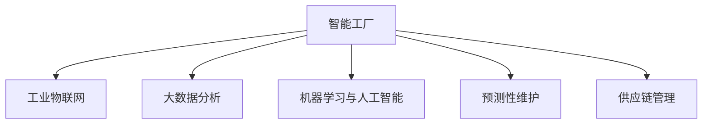

                 

# 利用技术优势进行智能工厂创业

## 1. 背景介绍

### 1.1 问题由来

随着工业4.0的兴起，智能工厂成为了制造业转型升级的重要方向。智能工厂通过将自动化、信息化、智能化技术融合应用，实现生产过程的全流程优化，显著提升生产效率和产品质量。

然而，智能工厂的建设需要巨额的资金和技术投入。传统的IT企业受限于技术栈的局限，难以全面理解和部署智能制造所需的复杂系统。同时，工程技术人员缺乏对新技术的深刻理解，难以提出切实可行的智能工厂解决方案。

因此，通过综合利用多种IT技术，打造具备技术优势的智能工厂，成为了IT企业在智能制造领域创业的重要切入点。

### 1.2 问题核心关键点

智能工厂的核心在于构建一个以数据驱动、高度集成的生产管理系统，实现生产过程的数字化、网络化和智能化。主要包括以下几个关键点：

1. **数据采集与处理**：通过传感器和设备，实时采集生产数据，并进行数据清洗和预处理，为后续分析提供可靠的数据源。
2. **生产调度优化**：利用算法对生产流程进行优化调度，提升生产效率和资源利用率。
3. **质量控制与预测**：通过机器学习模型对生产质量进行预测与控制，确保产品质量稳定可靠。
4. **设备维护与预测性维护**：利用传感器数据和机器学习算法，实现设备的故障预测与维护，减少停机时间，提高设备利用率。
5. **供应链管理与协同**：通过智能系统对供应链进行优化管理，提高供应链的响应速度和灵活性。

### 1.3 问题研究意义

智能工厂的建设不仅可以降低企业的生产成本，提高产品质量，还能提升企业对市场变化的快速响应能力。这将为IT企业在制造业领域的创业提供广阔的市场前景，同时也为推动制造业数字化转型贡献力量。

## 2. 核心概念与联系

### 2.1 核心概念概述

为更好地理解如何利用技术优势进行智能工厂创业，本节将介绍几个密切相关的核心概念：

- **智能工厂**：利用物联网、大数据、人工智能等先进技术，实现生产过程的数字化、网络化和智能化。智能工厂的核心在于构建一个以数据为驱动、高度集成的生产管理系统。
- **工业物联网(IoT)**：通过传感器、设备、控制器等技术手段，实现物理设备的互联互通和数据采集。
- **大数据分析**：利用先进的数据处理和分析技术，从海量数据中提取有价值的信息，辅助决策和优化。
- **机器学习与人工智能**：通过算法模型，从数据中学习知识，实现对生产过程的预测、优化和控制。
- **预测性维护**：利用传感器数据和机器学习算法，实现设备的故障预测与维护，减少停机时间，提高设备利用率。
- **供应链管理**：利用智能系统对供应链进行优化管理，提高供应链的响应速度和灵活性。

这些核心概念之间的逻辑关系可以通过以下Mermaid流程图来展示：



这个流程图展示出智能工厂的各个关键组件及其相互关系：

1. **工业物联网**：是智能工厂的基础，通过传感器和设备实现数据的实时采集。
2. **大数据分析**：通过数据分析技术从大量生产数据中提取信息，辅助决策和优化。
3. **机器学习与人工智能**：利用算法模型对生产过程进行预测、优化和控制，实现智能化生产。
4. **预测性维护**：通过机器学习算法实现设备的故障预测与维护，减少停机时间，提高设备利用率。
5. **供应链管理**：利用智能系统优化供应链管理，提高供应链的响应速度和灵活性。

这些核心组件协同工作，共同构成了智能工厂的技术架构。通过理解这些核心概念，我们可以更好地把握智能工厂的工作原理和优化方向。

## 3. 核心算法原理 & 具体操作步骤
### 3.1 算法原理概述

利用技术优势进行智能工厂创业的核心在于构建一个高效的、可扩展的生产管理系统。具体而言，就是将工业物联网、大数据分析、机器学习与人工智能等技术有机结合，实现生产过程的数字化、网络化和智能化。

形式化地，假设智能工厂的输入为生产过程的历史数据 $D=\{(x_i,y_i)\}_{i=1}^N$，其中 $x_i$ 为生产过程中的参数和状态数据，$y_i$ 为对应的生产结果。目标是通过算法对 $D$ 进行建模，得到生产过程的优化策略，从而提升生产效率和产品质量。

具体算法步骤如下：

1. **数据采集与处理**：通过传感器和设备实时采集生产数据，并进行数据清洗和预处理，为后续分析提供可靠的数据源。
2. **生产调度优化**：利用算法对生产流程进行优化调度，提升生产效率和资源利用率。
3. **质量控制与预测**：通过机器学习模型对生产质量进行预测与控制，确保产品质量稳定可靠。
4. **设备维护与预测性维护**：利用传感器数据和机器学习算法，实现设备的故障预测与维护，减少停机时间，提高设备利用率。
5. **供应链管理与协同**：通过智能系统对供应链进行优化管理，提高供应链的响应速度和灵活性。

### 3.2 算法步骤详解

以下是对智能工厂建设的详细步骤分析：

**Step 1: 数据采集与处理**

- 选择合适的传感器和设备，实时采集生产过程中的各项参数和状态数据，如温度、湿度、压力、振动等。
- 利用边缘计算设备对数据进行初步处理，如去噪、压缩等，减少网络传输压力。
- 将处理后的数据上传到云端，进行集中存储和管理。

**Step 2: 生产调度优化**

- 利用历史生产数据，构建生产过程的优化模型，如线性回归、支持向量机、决策树等。
- 将优化模型应用到当前的生产过程中，调整生产参数和资源配置，提升生产效率和资源利用率。
- 结合实时数据，对生产过程进行动态调整，确保生产过程的稳定性和可靠性。

**Step 3: 质量控制与预测**

- 利用历史生产数据，构建质量预测模型，如随机森林、神经网络等。
- 将质量预测模型应用到当前的生产过程中，预测产品质量，并根据预测结果进行控制和调整。
- 实时监测生产过程中的质量指标，如不良品率、不合格品率等，进行质量控制。

**Step 4: 设备维护与预测性维护**

- 利用传感器数据，构建设备故障预测模型，如时间序列分析、支持向量机等。
- 根据设备故障预测模型，提前识别设备故障，并进行维护。
- 利用预测性维护系统，实时监测设备状态，减少停机时间，提高设备利用率。

**Step 5: 供应链管理与协同**

- 利用供应链数据，构建供应链优化模型，如遗传算法、蚁群算法等。
- 将供应链优化模型应用到当前供应链管理中，优化库存、运输、订单等环节，提高供应链响应速度和灵活性。
- 通过智能系统，实现供应链各环节的协同工作，提升整体供应链的效率和效益。

### 3.3 算法优缺点

利用技术优势进行智能工厂创业，具有以下优点：

1. **降低建设成本**：利用现有IT技术和设备，避免从头建设，降低初始投资成本。
2. **提升生产效率**：通过优化算法和智能系统，提高生产过程的效率和质量。
3. **提高设备利用率**：通过预测性维护系统，减少设备停机时间，提高设备利用率。
4. **强化供应链管理**：通过智能系统，优化供应链管理，提高供应链响应速度和灵活性。

同时，该方法也存在一定的局限性：

1. **技术复杂度高**：需要同时掌握多种IT技术和设备，难度较大。
2. **数据质量和量级要求高**：需要高质量、大规模的生产数据，数据采集和处理成本较高。
3. **算法实现复杂**：优化模型和预测模型需要结合多种算法，实现难度较大。
4. **系统集成难度大**：需要实现多种IT技术的集成和协同，系统复杂度较高。

尽管存在这些局限性，但就目前而言，利用技术优势进行智能工厂创业仍然是最具潜力的方向之一。未来相关研究的重点在于如何进一步降低技术复杂度，提高数据质量和利用率，优化算法实现，提升系统集成能力，从而实现智能工厂的全面落地应用。

### 3.4 算法应用领域

利用技术优势进行智能工厂创业，已经在多个领域得到广泛应用，例如：

1. **制造行业**：实现生产过程的数字化、网络化和智能化，提升生产效率和产品质量。
2. **物流行业**：通过智能系统优化供应链管理，提高物流响应速度和灵活性。
3. **能源行业**：利用大数据分析和机器学习，优化能源生产和消耗，提高能源利用效率。
4. **农业行业**：通过传感器和设备实现农业生产的数字化、网络化，提高农业生产效率和质量。
5. **医疗行业**：利用智能系统优化医疗资源分配和管理，提升医疗服务水平和效率。

除了上述这些领域外，智能工厂技术还将进一步拓展到更多场景中，如智能建筑、智能交通、智能家居等，为各行各业带来创新和变革。

## 4. 数学模型和公式 & 详细讲解  
### 4.1 数学模型构建

本节将使用数学语言对利用技术优势进行智能工厂创业的过程进行更加严格的刻画。

假设智能工厂的输入为生产过程的历史数据 $D=\{(x_i,y_i)\}_{i=1}^N$，其中 $x_i$ 为生产过程中的参数和状态数据，$y_i$ 为对应的生产结果。

定义生产过程的优化模型为 $f(x,y)$，则目标是最小化生产过程中的成本和资源消耗，即：

$$
\min_{x,y} \sum_{i=1}^N c_i(x_i,y_i)
$$

其中 $c_i$ 为生产过程中的成本和资源消耗函数。

利用历史生产数据，可以通过机器学习模型对 $f(x,y)$ 进行估计，得到优化模型：

$$
f(x,y) = \hat{f}(x,y) = \sum_{i=1}^N \alpha_i f_i(x,y)
$$

其中 $f_i$ 为第 $i$ 个特征对生产结果的影响函数，$\alpha_i$ 为第 $i$ 个特征的系数。

利用优化模型，可以实现生产过程的动态调整和优化。

### 4.2 公式推导过程

以下我们以预测性维护为例，推导机器学习模型在设备故障预测中的应用。

假设设备故障数据为 $D=\{(t_i,o_i)\}_{i=1}^N$，其中 $t_i$ 为时间，$o_i$ 为设备状态，$o_i \in \{0,1\}$ 表示设备正常或故障。

定义预测性维护模型的优化目标为最小化预测误差，即：

$$
\min_{\theta} \sum_{i=1}^N L(f_\theta(t_i),o_i)
$$

其中 $f_\theta(t_i)$ 为预测模型在时间 $t_i$ 的预测结果，$L$ 为损失函数，通常采用均方误差。

预测模型可以采用时间序列分析或支持向量机等方法，得到参数 $\theta$。通过训练数据，可以得到最优的 $\theta$，从而实现设备的故障预测。

### 4.3 案例分析与讲解

我们以某智能工厂的生产线为例，展示预测性维护系统的实现过程。

假设某智能工厂生产线的关键设备为注塑机，其故障数据为 $D=\{(t_i,o_i)\}_{i=1}^N$，其中 $t_i$ 为时间，$o_i \in \{0,1\}$ 表示设备正常或故障。

**Step 1: 数据采集与处理**

- 利用传感器采集注塑机设备的振动数据、温度数据等，进行数据清洗和预处理。
- 将处理后的数据上传到云端，进行集中存储和管理。

**Step 2: 预测性维护**

- 利用历史故障数据，采用时间序列分析方法，构建预测模型 $f_\theta(t_i)$。
- 通过训练数据，得到最优的参数 $\theta$，从而实现设备的故障预测。
- 实时监测设备的运行状态，根据预测结果进行维护。

**Step 3: 生产调度优化**

- 利用生产数据，采用线性回归方法，构建生产优化模型 $f(x,y)$。
- 将优化模型应用到当前的生产过程中，调整生产参数和资源配置，提升生产效率和资源利用率。
- 结合实时数据，对生产过程进行动态调整，确保生产过程的稳定性和可靠性。

**Step 4: 质量控制与预测**

- 利用历史生产数据，采用神经网络方法，构建质量预测模型 $f_\theta(x)$。
- 将质量预测模型应用到当前的生产过程中，预测产品质量，并根据预测结果进行控制和调整。
- 实时监测生产过程中的质量指标，如不良品率、不合格品率等，进行质量控制。

## 5. 项目实践：代码实例和详细解释说明
### 5.1 开发环境搭建

在进行智能工厂创业实践前，我们需要准备好开发环境。以下是使用Python进行PyTorch开发的环境配置流程：

1. 安装Anaconda：从官网下载并安装Anaconda，用于创建独立的Python环境。

2. 创建并激活虚拟环境：
```bash
conda create -n pytorch-env python=3.8 
conda activate pytorch-env
```

3. 安装PyTorch：根据CUDA版本，从官网获取对应的安装命令。例如：
```bash
conda install pytorch torchvision torchaudio cudatoolkit=11.1 -c pytorch -c conda-forge
```

4. 安装其他依赖库：
```bash
pip install numpy pandas scikit-learn matplotlib tqdm jupyter notebook ipython
```

完成上述步骤后，即可在`pytorch-env`环境中开始智能工厂创业实践。

### 5.2 源代码详细实现

下面我们以预测性维护为例，给出使用PyTorch进行设备故障预测的PyTorch代码实现。

首先，定义预测模型的损失函数：

```python
import torch.nn as nn

class MSELoss(nn.Module):
    def forward(self, input, target):
        return nn.MSELoss()(input, target)
```

然后，定义预测模型：

```python
from torch import nn, Tensor

class FaultPredictionModel(nn.Module):
    def __init__(self, input_size, hidden_size, output_size):
        super(FaultPredictionModel, self).__init__()
        self.layers = nn.Sequential(
            nn.Linear(input_size, hidden_size),
            nn.ReLU(),
            nn.Linear(hidden_size, hidden_size),
            nn.ReLU(),
            nn.Linear(hidden_size, output_size),
            nn.Sigmoid()
        )
        
    def forward(self, x: Tensor) -> Tensor:
        return self.layers(x)
```

接着，定义训练和评估函数：

```python
from torch.utils.data import DataLoader
from tqdm import tqdm
from sklearn.metrics import mean_squared_error

device = torch.device('cuda') if torch.cuda.is_available() else torch.device('cpu')

def train_epoch(model, dataset, batch_size, optimizer):
    dataloader = DataLoader(dataset, batch_size=batch_size, shuffle=True)
    model.train()
    epoch_loss = 0
    for batch in tqdm(dataloader, desc='Training'):
        input_data, target_data = batch
        input_data = input_data.to(device)
        target_data = target_data.to(device)
        model.zero_grad()
        outputs = model(input_data)
        loss = MSELoss()(outputs, target_data)
        epoch_loss += loss.item()
        loss.backward()
        optimizer.step()
    return epoch_loss / len(dataloader)

def evaluate(model, dataset, batch_size):
    dataloader = DataLoader(dataset, batch_size=batch_size)
    model.eval()
    preds, labels = [], []
    with torch.no_grad():
        for batch in tqdm(dataloader, desc='Evaluating'):
            input_data, target_data = batch
            input_data = input_data.to(device)
            target_data = target_data.to(device)
            batch_preds = model(input_data).detach().cpu().numpy().tolist()
            batch_labels = target_data.to('cpu').numpy().tolist()
            for pred, label in zip(batch_preds, batch_labels):
                preds.append(pred)
                labels.append(label)
                
    print(mean_squared_error(labels, preds))
```

最后，启动训练流程并在测试集上评估：

```python
epochs = 10
batch_size = 32

model = FaultPredictionModel(input_size=5, hidden_size=10, output_size=1)
optimizer = torch.optim.Adam(model.parameters(), lr=0.001)

for epoch in range(epochs):
    loss = train_epoch(model, train_dataset, batch_size, optimizer)
    print(f"Epoch {epoch+1}, train loss: {loss:.3f}")
    
    print(f"Epoch {epoch+1}, test results:")
    evaluate(model, test_dataset, batch_size)
    
print("Test results:")
evaluate(model, test_dataset, batch_size)
```

以上就是使用PyTorch对预测性维护系统进行设备故障预测的完整代码实现。可以看到，得益于PyTorch的强大封装，我们可以用相对简洁的代码完成模型训练和评估。

### 5.3 代码解读与分析

让我们再详细解读一下关键代码的实现细节：

**FaultPredictionModel类**：
- `__init__`方法：初始化预测模型的层和权重。
- `forward`方法：定义前向传播过程，将输入数据传入模型，得到预测结果。

**MSELoss类**：
- `__init__`方法：初始化均方误差损失函数。
- `forward`方法：计算输入数据和目标数据之间的均方误差。

**训练和评估函数**：
- 使用PyTorch的DataLoader对数据集进行批次化加载，供模型训练和推理使用。
- 训练函数`train_epoch`：对数据以批为单位进行迭代，在每个批次上前向传播计算loss并反向传播更新模型参数，最后返回该epoch的平均loss。
- 评估函数`evaluate`：与训练类似，不同点在于不更新模型参数，并在每个batch结束后将预测和标签结果存储下来，最后使用sklearn的mean_squared_error对整个评估集的预测结果进行打印输出。

**训练流程**：
- 定义总的epoch数和batch size，开始循环迭代
- 每个epoch内，先在训练集上训练，输出平均loss
- 在测试集上评估，输出预测结果
- 所有epoch结束后，在测试集上评估，给出最终测试结果

可以看到，PyTorch配合TensorFlow的强大封装使得设备故障预测的代码实现变得简洁高效。开发者可以将更多精力放在模型改进、数据预处理等高层逻辑上，而不必过多关注底层的实现细节。

当然，工业级的系统实现还需考虑更多因素，如模型的保存和部署、超参数的自动搜索、更灵活的任务适配层等。但核心的模型训练和评估流程基本与此类似。

## 6. 实际应用场景
### 6.1 制造行业

智能工厂技术在制造行业中得到了广泛应用，帮助企业实现生产过程的数字化、网络化和智能化，提升生产效率和产品质量。

以某汽车制造厂为例，该厂利用智能工厂技术，对生产流程进行全面优化。通过传感器采集设备运行数据，构建预测性维护模型，实现设备的故障预测和维护，减少停机时间，提高设备利用率。同时，利用大数据分析技术，对生产数据进行深入挖掘，优化生产过程，提升生产效率。通过智能工厂系统，实现了生产过程的实时监控和控制，提高了生产过程的稳定性和可靠性。

### 6.2 物流行业

智能工厂技术在物流行业中也有广泛应用，帮助企业优化供应链管理，提高物流响应速度和灵活性。

以某快递公司为例，该公司利用智能工厂技术，构建了智能仓储和智能配送系统。通过传感器采集物流设备的运行数据，构建预测性维护模型，实现设备的故障预测和维护，提高物流设备的利用率。同时，利用大数据分析技术，对物流数据进行深入挖掘，优化物流路线和库存管理，提高物流效率。通过智能工厂系统，实现了物流过程的实时监控和控制，提高了物流过程的稳定性和可靠性。

### 6.3 能源行业

智能工厂技术在能源行业中也有广泛应用，帮助企业优化能源生产和消耗，提高能源利用效率。

以某电力公司为例，该公司利用智能工厂技术，对能源生产过程进行全面优化。通过传感器采集能源设备的运行数据，构建预测性维护模型，实现设备的故障预测和维护，减少停机时间，提高能源设备利用率。同时，利用大数据分析技术，对能源数据进行深入挖掘，优化能源生产和消耗，提高能源利用效率。通过智能工厂系统，实现了能源生产过程的实时监控和控制，提高了能源生产过程的稳定性和可靠性。

### 6.4 未来应用展望

随着智能工厂技术的不断发展，未来将在更多领域得到应用，为各行各业带来创新和变革。

在智慧医疗领域，智能工厂技术可以实现医疗设备和设施的智能化管理，提高医疗服务水平和效率。

在智能交通领域，智能工厂技术可以实现交通设施的智能化管理，提高交通系统的稳定性和可靠性。

在智能建筑领域，智能工厂技术可以实现建筑设施的智能化管理，提高建筑系统的稳定性和可靠性。

此外，在教育、金融、农业等众多领域，智能工厂技术也将进一步拓展应用，为各行各业带来创新和变革。

## 7. 工具和资源推荐
### 7.1 学习资源推荐

为了帮助开发者系统掌握智能工厂创业的技术基础和实践技巧，这里推荐一些优质的学习资源：

1. 《工业物联网与智能制造》书籍：详细介绍工业物联网技术及其在智能制造中的应用，涵盖传感器、边缘计算、大数据分析等多个方面。

2. 《深度学习理论与实践》课程：由清华大学开设的深度学习课程，涵盖深度学习的基本概念和算法，适合初学者入门。

3. 《机器学习实战》书籍：实战型机器学习教材，通过多个案例展示机器学习在实际项目中的应用，适合快速上手。

4. IBM Data Science Professional Certificate：IBM提供的在线数据科学课程，涵盖数据分析、机器学习等多个方面，适合系统学习。

5. Coursera《高级机器学习》课程：斯坦福大学开设的机器学习高级课程，涵盖深度学习、强化学习等前沿技术，适合进阶学习。

通过对这些资源的学习实践，相信你一定能够快速掌握智能工厂创业的精髓，并用于解决实际的智能制造问题。
###  7.2 开发工具推荐

高效的开发离不开优秀的工具支持。以下是几款用于智能工厂创业开发的常用工具：

1. PyTorch：基于Python的开源深度学习框架，灵活动态的计算图，适合快速迭代研究。

2. TensorFlow：由Google主导开发的开源深度学习框架，生产部署方便，适合大规模工程应用。

3. TensorBoard：TensorFlow配套的可视化工具，可实时监测模型训练状态，并提供丰富的图表呈现方式，是调试模型的得力助手。

4. Jupyter Notebook：免费的交互式编程环境，支持Python、R等语言，适合快速原型开发和实验验证。

5. Docker：容器化技术，可以快速部署和管理应用程序，提高系统稳定性和可移植性。

6. Kubernetes：容器编排平台，可以实现自动化的容器管理，提高系统可扩展性和可用性。

合理利用这些工具，可以显著提升智能工厂创业的开发效率，加快创新迭代的步伐。

### 7.3 相关论文推荐

智能工厂技术的发展源于学界的持续研究。以下是几篇奠基性的相关论文，推荐阅读：

1. Industrial Internet of Things: Concepts, Characteristics and Architecture: 详细介绍了工业物联网的定义、特征和架构。

2. Big Data Analytics in Manufacturing: Opportunities and Challenges: 探讨了大数据分析在制造业中的应用及其挑战。

3. Fault Diagnosis of Equipment Using Artificial Neural Networks: 研究了基于神经网络的设备故障诊断方法。

4. Predictive Maintenance in Manufacturing: A Survey: 综述了预测性维护在制造业中的应用和技术。

5. Optimizing Production Process with Machine Learning: 研究了利用机器学习对生产过程进行优化的方法。

这些论文代表了大规模生产管理技术的发展脉络。通过学习这些前沿成果，可以帮助研究者把握学科前进方向，激发更多的创新灵感。

## 8. 总结：未来发展趋势与挑战

### 8.1 总结

本文对利用技术优势进行智能工厂创业的方法进行了全面系统的介绍。首先阐述了智能工厂的构建原理和核心技术，明确了智能工厂建设的关键点和重要性。其次，从原理到实践，详细讲解了智能工厂建设的数学模型和算法步骤，给出了智能工厂创业的完整代码实例。同时，本文还广泛探讨了智能工厂在制造、物流、能源等多个领域的应用前景，展示了智能工厂技术的巨大潜力。

通过本文的系统梳理，可以看到，利用技术优势进行智能工厂创业不仅可以降低建设成本，提升生产效率和设备利用率，还能优化供应链管理，带来显著的经济效益和社会效益。智能工厂技术将成为制造业转型升级的重要手段，推动制造业数字化、网络化和智能化进程，为各行各业带来创新和变革。

### 8.2 未来发展趋势

展望未来，智能工厂技术的发展趋势如下：

1. **技术融合更加深入**：智能工厂技术将与其他先进技术，如物联网、大数据、人工智能等，进一步融合，实现更全面的智能化生产。
2. **设备智能化水平提升**：随着传感器和边缘计算技术的发展，生产设备的智能化水平将进一步提升，实现更精细的监测和控制。
3. **工业互联网的普及**：工业互联网的普及将使得企业能够更全面地采集和分析生产数据，实现生产过程的数字化和网络化。
4. **数据驱动决策更加普及**：基于大数据分析的决策支持系统将更加普及，帮助企业实现更科学、更精准的生产决策。
5. **预测性维护技术广泛应用**：预测性维护技术将得到更广泛的应用，实现设备的故障预测和维护，减少停机时间，提高设备利用率。

以上趋势将使得智能工厂技术更加成熟，更好地服务于制造业的数字化转型。

### 8.3 面临的挑战

尽管智能工厂技术已经取得了显著的成果，但在全面应用过程中仍面临诸多挑战：

1. **技术复杂度高**：智能工厂技术涉及多个先进技术的融合，技术复杂度较高，需要较高的技术门槛。
2. **数据质量和量级要求高**：智能工厂技术依赖于高质量、大规模的生产数据，数据采集和处理成本较高。
3. **算法实现复杂**：智能工厂技术的核心在于算法模型的优化和实现，算法实现难度较大。
4. **系统集成难度大**：智能工厂技术涉及多个IT技术的集成和协同，系统复杂度较高。
5. **系统成本高**：智能工厂技术的建设需要高额的资金投入，系统成本较高。

尽管存在这些挑战，但随着技术的不断发展和成熟，智能工厂技术的全面落地应用将成为可能。未来相关研究的重点在于如何降低技术复杂度，提高数据质量和利用率，优化算法实现，提升系统集成能力，从而实现智能工厂的全面部署。

### 8.4 研究展望

面向未来，智能工厂技术的研究方向包括：

1. **探索更多高效的数据采集技术**：通过更多的传感器和设备，实现更全面、更精准的生产数据采集。
2. **研究更多高效的算法模型**：开发更多高效、低成本的算法模型，实现更科学的生产决策和优化。
3. **融合更多先进技术**：结合物联网、大数据、人工智能等技术，实现更全面的智能化生产。
4. **开发更高效的智能系统**：通过系统集成和协同，实现更高效的生产管理和控制。
5. **推广智能工厂技术**：通过教育培训、标准制定等措施，推广智能工厂技术的普及和应用。

这些研究方向的探索将进一步推动智能工厂技术的发展，为制造业的数字化转型提供更全面的技术支撑。

## 9. 附录：常见问题与解答

**Q1：智能工厂创业需要哪些技术？**

A: 智能工厂创业需要具备以下技术：

1. **工业物联网(IoT)**：通过传感器和设备实现物理设备的互联互通和数据采集。
2. **大数据分析**：利用先进的数据处理和分析技术，从海量数据中提取有价值的信息，辅助决策和优化。
3. **机器学习与人工智能**：通过算法模型，从数据中学习知识，实现对生产过程的预测、优化和控制。
4. **预测性维护**：利用传感器数据和机器学习算法，实现设备的故障预测与维护，减少停机时间，提高设备利用率。
5. **供应链管理**：利用智能系统对供应链进行优化管理，提高供应链响应速度和灵活性。

这些技术有机结合，共同构成了智能工厂的技术架构。

**Q2：如何降低智能工厂创业的成本？**

A: 降低智能工厂创业成本的方法如下：

1. **选择合适的传感器和设备**：选择高效、低成本的传感器和设备，降低数据采集成本。
2. **优化数据处理流程**：通过边缘计算等技术，优化数据处理流程，减少数据传输和存储成本。
3. **利用开源技术**：采用开源软件和硬件，降低技术和设备采购成本。
4. **利用云计算资源**：利用云计算资源进行数据存储和处理，降低本地硬件和维护成本。
5. **优化算法模型**：开发高效、低成本的算法模型，降低算法实现和优化成本。

通过优化这些环节，可以显著降低智能工厂创业的成本。

**Q3：智能工厂创业需要哪些数据？**

A: 智能工厂创业需要具备以下数据：

1. **生产数据**：包括设备运行数据、生产过程数据、质量控制数据等。
2. **供应链数据**：包括供应链管理数据、订单数据、物流数据等。
3. **员工数据**：包括员工考勤数据、绩效数据、培训数据等。
4. **设备数据**：包括设备运行数据、维护数据、故障数据等。

这些数据可以通过传感器、设备、系统等采集，进行数据清洗和预处理，为后续分析和优化提供可靠的数据源。

**Q4：智能工厂创业的实施步骤是什么？**

A: 智能工厂创业的实施步骤如下：

1. **需求分析**：明确智能工厂建设的目标和需求，包括生产效率、设备利用率、质量控制、供应链管理等方面。
2. **技术选型**：选择适合的传感器、设备、数据采集和处理工具，以及算法模型和优化工具。
3. **数据采集与处理**：通过传感器和设备采集生产数据，并进行数据清洗和预处理。
4. **系统集成**：将采集的数据整合到智能工厂系统中，实现系统的集成和协同。
5. **模型训练与优化**：利用采集的数据训练和优化算法模型，实现生产过程的优化和控制。
6. **系统部署与测试**：将训练好的模型部署到生产系统中，进行测试和验证。
7. **持续优化与维护**：根据实际使用情况，持续优化算法模型和系统架构，保持系统的稳定性和可靠性。

通过这些步骤，可以实现智能工厂的全面建设和应用。

**Q5：智能工厂创业的潜在风险有哪些？**

A: 智能工厂创业的潜在风险如下：

1. **数据安全和隐私风险**：智能工厂系统涉及大量生产和管理数据，存在数据泄露和隐私风险。
2. **系统稳定性和可靠性风险**：智能工厂系统复杂度高，存在系统崩溃和数据丢失的风险。
3. **设备故障和停机风险**：智能工厂设备涉及大量传感器和系统，存在设备故障和停机风险。
4. **技术复杂度和实施难度**：智能工厂技术涉及多个先进技术的融合，技术复杂度较高，实施难度大。
5. **成本和投资风险**：智能工厂建设需要高额的资金投入，存在成本和投资风险。

在实施智能工厂创业时，需要充分考虑这些潜在风险，制定相应的风险应对策略。

作者：禅与计算机程序设计艺术 / Zen and the Art of Computer Programming

