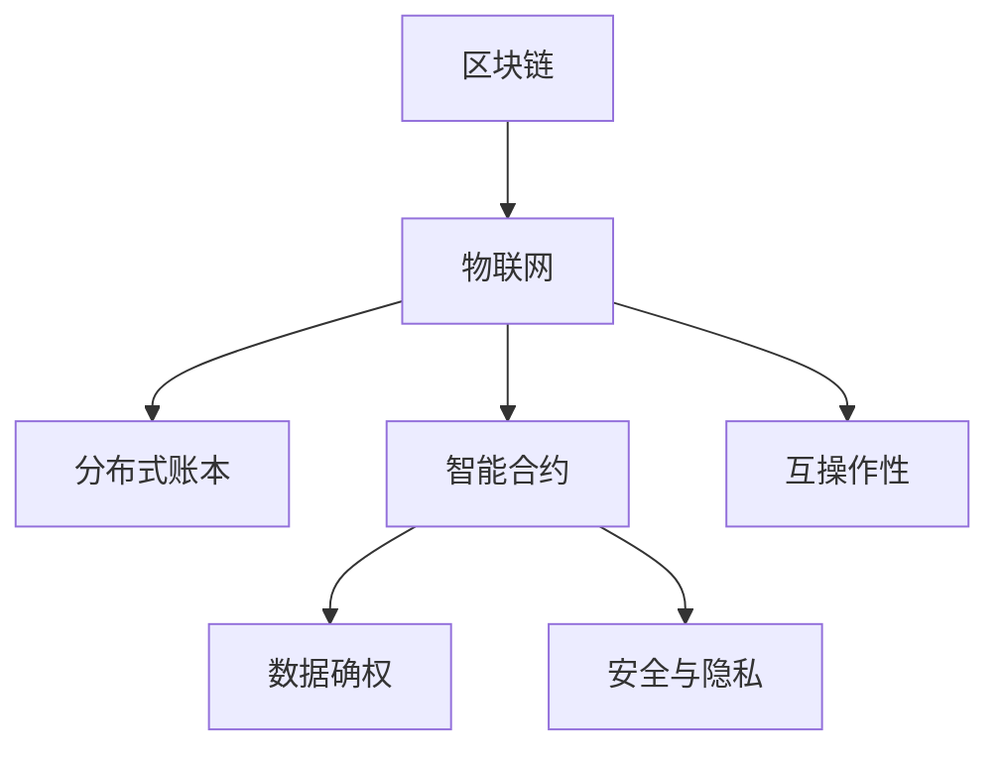

                 

# 区块链在物联网中的应用与挑战

> 关键词：区块链,物联网(IoT),智能合约,分布式账本,安全与隐私,数据确权,互操作性,应用场景

## 1. 背景介绍

### 1.1 问题由来
随着物联网(IoT)技术的快速发展，设备之间日益紧密的互联互通正在改变我们的生活方式。但随之而来的数据安全、隐私保护、设备互操作性等问题也逐渐显现。这些挑战如何应对？区块链技术作为一种颠覆性的分布式技术，以其去中心化、不可篡改、共识机制等特性，成为物联网领域的重要解决方案。

### 1.2 问题核心关键点
区块链在物联网中的应用主要集中在以下几个方面：

- 分布式账本：实现设备间数据的可信记录和共享。
- 智能合约：自动化设备间的数据交换与交互。
- 数据确权：保护数据归属和隐私。
- 安全与隐私：确保数据传输的机密性和完整性。
- 互操作性：促进不同设备间数据的标准化与互通。

这些核心关键点构成了区块链与物联网结合的基础，但在实际应用中仍面临诸多挑战。

## 2. 核心概念与联系

### 2.1 核心概念概述

为更好地理解区块链在物联网中的应用，本节将介绍几个核心概念：

- 区块链(Blockchain)：一种去中心化的分布式数据库，通过加密技术保证数据不可篡改和透明可信。区块链的三个核心特性是去中心化、分布式共识和不可篡改性。

- 物联网(IoT)：通过互联网将设备互联，实现数据的采集、传输和处理。物联网设备种类繁多，包括传感器、智能家居、可穿戴设备等。

- 智能合约(Smart Contract)：自动执行的合约，当特定条件满足时，自动执行合约条款。智能合约通常基于区块链技术实现，具有透明、不可篡改、自动执行的特点。

- 分布式账本(Distributed Ledger)：去中心化的数据库，记录并验证交易数据的真实性，每个参与节点都有完整副本。

- 数据确权(Data Ownership)：明确数据的归属，防止非法复制和滥用。

- 安全与隐私(Security and Privacy)：确保物联网设备间的通信安全，防止数据泄露和篡改。

- 互操作性(Interoperability)：实现不同设备和系统间的信息交换与协同工作。

这些核心概念之间的逻辑关系可以通过以下Mermaid流程图来展示：



这个流程图展示了区块链在物联网中的应用框架：

1. 区块链与物联网结合，记录设备间的交互数据。
2. 分布式账本保障数据记录的透明性和不可篡改性。
3. 智能合约实现自动化的数据交换和交互逻辑。
4. 数据确权明确数据的归属，保护用户隐私。
5. 安全与隐私确保通信和数据传输的安全性。
6. 互操作性促进不同设备和系统间的协同工作。

这些概念共同构成了区块链与物联网结合的技术基础，使其能够应用于多种场景。

## 3. 核心算法原理 & 具体操作步骤
### 3.1 算法原理概述

区块链在物联网中的应用，主要依赖于其去中心化的分布式账本、智能合约和共识机制等特性。以下将详细介绍这些核心算法原理：

- **去中心化分布式账本**：区块链通过分布式网络上的多个节点维护账本副本，每个节点都有完整的账本数据。分布式账本的去中心化特性保证了账本数据的不可篡改性和透明性。

- **智能合约**：基于区块链的智能合约通过代码形式定义了设备间的交互逻辑和规则。智能合约的执行依赖于区块链的分布式共识机制，确保其透明性和不可篡改性。

- **共识机制**：区块链通过共识算法确保网络中节点达成一致的账本更新。常见的共识算法包括PoW(工作量证明)、PoS(权益证明)、DPoS(授权权益证明)等。

### 3.2 算法步骤详解

基于区块链的物联网应用，主要包括以下几个关键步骤：

**Step 1: 设备身份认证与注册**

- 物联网设备通过区块链网络进行身份认证，记录设备的唯一标识信息和初始化配置。
- 设备初始化时，自动生成公私钥对，公钥用于标识设备身份，私钥用于数字签名。

**Step 2: 数据收集与记录**

- 物联网设备采集数据，并通过区块链网络提交交易。
- 数据记录在分布式账本上，保证数据的透明性和不可篡改性。

**Step 3: 智能合约执行**

- 根据业务需求，编写智能合约，定义设备间的数据交换逻辑。
- 当满足特定条件时，智能合约自动执行，完成数据交换或交易结算。

**Step 4: 数据确权与隐私保护**

- 通过区块链的哈希函数和加密技术，保护数据的完整性和隐私性。
- 明确数据的归属权，防止非法复制和滥用。

**Step 5: 安全与互操作性**

- 使用数字签名和公钥加密技术，确保数据传输的安全性。
- 定义标准化的数据格式和协议，促进不同设备和系统间的互操作性。

### 3.3 算法优缺点

区块链在物联网中的应用，具有以下优点：

1. 去中心化：减少对中心服务器的依赖，提高系统的可靠性和鲁棒性。
2. 透明性：分布式账本的透明性使得数据记录公开可查，提高信任度。
3. 不可篡改性：区块链的不可篡改特性保障数据的完整性和安全性。
4. 智能合约：自动化执行合约条款，提高效率和公平性。
5. 互操作性：促进不同设备和系统间的协同工作。

但同时也存在一些缺点：

1. 计算和存储开销大：区块链的分布式共识和记账过程消耗大量计算和存储资源。
2. 交易延迟：区块链的交易验证和共识过程可能导致一定延迟。
3. 扩展性问题：随着节点数量增加，区块链的网络处理能力可能受限。
4. 共识算法复杂性：不同共识算法有其优缺点，选择合适算法需要综合考虑安全性和效率。
5. 智能合约安全性：智能合约代码漏洞可能被攻击，导致资产损失。

### 3.4 算法应用领域

区块链技术在物联网中的应用主要集中在以下几个领域：

- **供应链管理**：记录和验证供应链各环节的交易和数据，提升供应链透明度和信任度。
- **智能制造**：通过区块链实现设备间的协作和数据共享，优化生产流程。
- **智能家居**：实现家居设备的自动化控制和数据管理，提高生活便利性和安全性。
- **智慧城市**：通过区块链技术实现城市基础设施的数据共享和协同管理。
- **医疗健康**：记录和验证患者数据和医疗记录，保护隐私和数据安全。
- **环境监测**：记录和验证环境数据，提升数据可信度和透明度。

这些应用场景展示了区块链在物联网中的广泛潜力，但实际部署时需要结合具体需求，选择适合的技术方案。

## 4. 数学模型和公式 & 详细讲解 & 举例说明

### 4.1 数学模型构建

区块链在物联网中的应用涉及多个数学模型，以下将介绍几个核心模型：

- **分布式账本模型**：基于时间序列的区块结构，每个区块包含一组交易记录和前一区块的哈希值。
- **智能合约模型**：通过代码实现设备间的数据交换逻辑，通常基于Ethereum等智能合约平台。
- **共识机制模型**：不同共识算法有其数学模型，如PoW中的工作量证明机制，PoS中的随机数选择算法等。

### 4.2 公式推导过程

以PoW(工作量证明)为例，其公式推导过程如下：

1. 区块头哈希计算公式：
$$
H = SHA-256(Merkle Tree Root | Block Number | Previous Block Hash)
$$

其中，$Merkle Tree Root$ 为区块内所有交易的哈希值，$Block Number$ 为区块号，$Previous Block Hash$ 为前一区块的哈希值。

2. 工作量证明公式：
$$
Work = hashpower \times blocktime
$$

其中，$hashpower$ 为哈希计算的功率，$blocktime$ 为每个区块的生成时间。

### 4.3 案例分析与讲解

**案例1: 供应链管理**

在供应链管理中，区块链用于记录和验证供应链各环节的交易和数据。以下是一个简化的供应链管理案例：

- **步骤1: 设备身份认证与注册**：物联网设备通过区块链网络进行身份认证，记录设备的唯一标识信息和初始化配置。
- **步骤2: 数据收集与记录**：设备采集供应链数据，并通过区块链网络提交交易。
- **步骤3: 智能合约执行**：定义供应链管理规则，智能合约自动执行交易结算。
- **步骤4: 数据确权与隐私保护**：通过哈希函数和加密技术保护数据隐私，明确数据归属权。

通过区块链的应用，供应链管理实现了数据的透明化、可信化和自动化，提升了供应链的整体效率和信任度。

**案例2: 智能家居**

在智能家居场景中，区块链用于设备和用户间的信任和数据管理。以下是一个简化的智能家居案例：

- **步骤1: 设备身份认证与注册**：智能家居设备通过区块链网络进行身份认证，生成公私钥对。
- **步骤2: 数据收集与记录**：设备采集家居数据，并通过区块链网络提交交易。
- **步骤3: 智能合约执行**：定义智能家居设备间的数据交换逻辑，智能合约自动执行交易结算。
- **步骤4: 数据确权与隐私保护**：通过哈希函数和加密技术保护数据隐私，明确数据归属权。
- **步骤5: 安全与互操作性**：使用公钥加密和数字签名技术，确保数据传输的安全性。

通过区块链的应用，智能家居系统实现了设备和用户间的信任和数据管理，提升了家居生活的便利性和安全性。

## 5. 项目实践：代码实例和详细解释说明

### 5.1 开发环境搭建

在进行物联网区块链项目开发前，我们需要准备好开发环境。以下是使用Python进行Hyperledger Fabric开发的环境配置流程：

1. 安装Anaconda：从官网下载并安装Anaconda，用于创建独立的Python环境。

2. 创建并激活虚拟环境：
```bash
conda create -n hyperledger python=3.8 
conda activate hyperledger
```

3. 安装Hyperledger Fabric：从官网获取对应的安装命令。例如：
```bash
conda install hyperledger-fabric -c conda-forge
```

4. 安装各类工具包：
```bash
pip install numpy pandas scikit-learn matplotlib tqdm jupyter notebook ipython
```

完成上述步骤后，即可在`hyperledger-env`环境中开始物联网区块链项目的开发。

### 5.2 源代码详细实现

下面以供应链管理为例，给出使用Hyperledger Fabric开发区块链的PyTorch代码实现。

首先，定义区块链网络配置文件：

```python
# network-config.json
{
    "orderer": {
        "batch-size": 1,
        "etcd-host": "localhost",
        "etcd-port": 2379,
        "rasp": {
            "batch-size": 1,
            "broadcast-peer-set": ["peer0.org1.example.com:7051"],
            "discovery": {
                "peer-set": "batch-peer-org1"
            },
            "gas": 1,
            "gas-price": 1
        }
    },
    "channel": {
        "channel-id": "supplychain",
        "config": "config.json"
    },
    "application": {
        "channel-id": "supplychain"
    },
    "peers": {
        "peer0.org1.example.com": {
            "organization-name": "org1",
            "peer-address": "localhost:7051",
            "client-identity": {
                "x509-cert-file": "client-org1-cert.pem",
                "key": "client-org1-key.pem"
            }
        }
    }
}
```

然后，编写智能合约代码：

```python
from shim import run_withsam
import math
import sys

def main():
    run_withsam(sys.argv[1], sys.argv[2])

def get_supplychain_record(supplychain_id):
    # 查询供应链记录
    # 获取查询结果
    pass

def add_supplychain_record(supplychain_id, product_id, supplier_id, supplier_name, supplier_location):
    # 添加供应链记录
    # 提交到区块链网络
    pass

def update_supplychain_record(supplychain_id, product_id, supplier_id, supplier_name, supplier_location):
    # 更新供应链记录
    # 提交到区块链网络
    pass

def remove_supplychain_record(supplychain_id, product_id, supplier_id):
    # 删除供应链记录
    # 提交到区块链网络
    pass

def get_supplychain_state(supplychain_id):
    # 获取供应链状态
    # 查询区块链网络
    pass
```

最后，编写客户端代码，调用智能合约：

```python
from hyperledger import Fabric
from shim import run_withsam
import math
import sys

def main():
    run_withsam(sys.argv[1], sys.argv[2])

def get_supplychain_record(supplychain_id):
    # 查询供应链记录
    # 获取查询结果
    pass

def add_supplychain_record(supplychain_id, product_id, supplier_id, supplier_name, supplier_location):
    # 添加供应链记录
    # 提交到区块链网络
    pass

def update_supplychain_record(supplychain_id, product_id, supplier_id, supplier_name, supplier_location):
    # 更新供应链记录
    # 提交到区块链网络
    pass

def remove_supplychain_record(supplychain_id, product_id, supplier_id):
    # 删除供应链记录
    # 提交到区块链网络
    pass

def get_supplychain_state(supplychain_id):
    # 获取供应链状态
    # 查询区块链网络
    pass
```

以上就是使用Hyperledger Fabric进行供应链管理区块链项目的完整代码实现。可以看到，通过Hyperledger Fabric，物联网设备和用户间的数据记录和交互得到了高度安全、透明和自动化的保障。

### 5.3 代码解读与分析

让我们再详细解读一下关键代码的实现细节：

**network-config.json文件**：
- 定义了区块链网络的配置信息，包括共识算法、通道信息、节点信息等。

**智能合约代码**：
- `get_supplychain_record`方法：查询指定供应链记录。
- `add_supplychain_record`方法：添加新的供应链记录。
- `update_supplychain_record`方法：更新已有供应链记录。
- `remove_supplychain_record`方法：删除指定供应链记录。
- `get_supplychain_state`方法：获取供应链状态。

**客户端代码**：
- 使用Hyperledger Fabric提供的API，调用智能合约方法，实现数据记录和交互。

以上代码实现了供应链管理中设备间的数据记录和交互，通过智能合约和区块链网络，保障了数据的安全性和透明性。

## 6. 实际应用场景

### 6.1 智能制造

在智能制造中，区块链用于设备和工厂之间的协同工作。以下是一个简化的智能制造案例：

- **步骤1: 设备身份认证与注册**：智能制造设备通过区块链网络进行身份认证，生成公私钥对。
- **步骤2: 数据收集与记录**：设备采集制造数据，并通过区块链网络提交交易。
- **步骤3: 智能合约执行**：定义制造设备的交互逻辑，智能合约自动执行生产计划和资源分配。
- **步骤4: 数据确权与隐私保护**：通过哈希函数和加密技术保护数据隐私，明确数据归属权。
- **步骤5: 安全与互操作性**：使用公钥加密和数字签名技术，确保数据传输的安全性。

通过区块链的应用，智能制造实现了设备和工厂间的信任和数据管理，提升了生产效率和制造质量。

### 6.2 智慧城市

在智慧城市中，区块链用于城市基础设施的数据管理和协同工作。以下是一个简化的智慧城市案例：

- **步骤1: 设备身份认证与注册**：智慧城市设备通过区块链网络进行身份认证，生成公私钥对。
- **步骤2: 数据收集与记录**：设备采集城市数据，并通过区块链网络提交交易。
- **步骤3: 智能合约执行**：定义城市基础设施的数据交换逻辑，智能合约自动执行城市管理和资源调配。
- **步骤4: 数据确权与隐私保护**：通过哈希函数和加密技术保护数据隐私，明确数据归属权。
- **步骤5: 安全与互操作性**：使用公钥加密和数字签名技术，确保数据传输的安全性。

通过区块链的应用，智慧城市实现了设备和用户间的信任和数据管理，提升了城市管理的智能化和协同效率。

### 6.3 未来应用展望

随着区块链技术的不断发展和物联网设备的普及，未来区块链在物联网中的应用前景广阔，将带来以下变革：

1. **设备身份认证与管理**：通过区块链实现设备的可信身份认证，增强设备的安全性和互操作性。
2. **数据共享与交易**：区块链促进不同设备和系统间的信息交换，实现数据的透明化、可信化和自动化。
3. **智能合约与自动化**：智能合约自动执行设备间的交互逻辑，提高效率和公平性。
4. **数据确权与隐私保护**：明确数据的归属权，保护用户隐私，促进数据安全。
5. **安全与互操作性**：通过公钥加密和数字签名技术，确保数据传输的安全性。

未来，随着区块链技术的成熟和应用场景的拓展，物联网将进一步实现设备的协同工作和数据的透明化，提升智能化水平和用户体验。

## 7. 工具和资源推荐
### 7.1 学习资源推荐

为了帮助开发者系统掌握区块链在物联网中的应用技术，这里推荐一些优质的学习资源：

1. Hyperledger官方文档：Hyperledger Fabric的官方文档，提供了完整的开发指南和代码示例，是入门的必备资料。

2. 《区块链技术与应用》系列书籍：详细介绍了区块链的基本原理和应用场景，适合初学者和进阶学习者。

3. 《智能合约原理与实践》课程：由区块链技术专家授课，介绍了智能合约的原理和开发方法。

4. CryptoZombies：通过编程游戏的方式学习区块链和智能合约开发，适合互动式学习。

5. 以太坊开发指南：详细介绍了以太坊智能合约的开发流程和最佳实践。

通过对这些资源的学习实践，相信你一定能够快速掌握区块链在物联网中的应用技术，并用于解决实际的NLP问题。

### 7.2 开发工具推荐

高效的开发离不开优秀的工具支持。以下是几款用于物联网区块链开发的常用工具：

1. Hyperledger Fabric：Hyperledger Fabric是Hyperledger联盟开发的开源区块链平台，支持企业级的分布式应用开发。

2. Ethereum：Ethereum是一个公有区块链平台，支持智能合约和去中心化应用开发，适合去中心化应用的应用场景。

3. Hyperledger Composer：Hyperledger Composer是一个区块链开发工具集，提供建模语言和可视化开发工具，方便开发者进行智能合约的建模和调试。

4. Quorum：Quorum是Hyperledger联盟开发的私有区块链平台，支持企业级的智能合约开发。

5. Truffle：Truffle是一个智能合约开发框架，提供IDE、测试工具、部署工具等，方便开发者进行以太坊智能合约的开发和测试。

合理利用这些工具，可以显著提升区块链在物联网中的开发效率，加快创新迭代的步伐。

### 7.3 相关论文推荐

区块链技术在物联网中的应用源于学界的持续研究。以下是几篇奠基性的相关论文，推荐阅读：

1. Satoshi Nakamoto，2008年，《Bitcoin: A Peer-to-Peer Electronic Cash System》：比特币白皮书，介绍了区块链的基本原理和应用场景。

2. Kim, M., & Lee, S. (2018). A Survey on Blockchain-Based IoT System. In IEEE Internet of Things Journal (pp. 3207-3221). IEEE.

3. Goswami, A., & Kumar, V. (2020). Blockchain for the Internet of Things: Opportunities and Challenges. IEEE Internet of Things Journal, 7(3), 1703-1713.

4. Zakharova, S., & Mouraviev, A. (2019). Smart Blockchain in the Internet of Things. In Internet of Things and Cyber-Physical Systems (IoT/CPS), 2019 International Conference on (pp. 14-19). IEEE.

5. Wang, X., & Zhang, H. (2020). Blockchain-Based Smart IoT Data Management. In 2020 IEEE International Conference on Big Data (Big Data) (pp. 2487-2493). IEEE.

这些论文代表了大规模区块链技术的发展脉络。通过学习这些前沿成果，可以帮助研究者把握学科前进方向，激发更多的创新灵感。

## 8. 总结：未来发展趋势与挑战

### 8.1 总结

本文对区块链在物联网中的应用与挑战进行了全面系统的介绍。首先阐述了区块链和物联网结合的基本原理和应用场景，明确了区块链在设备身份认证、数据记录、智能合约等方面的优势。其次，从原理到实践，详细讲解了物联网区块链的应用流程和关键技术。最后，本文还探讨了区块链在物联网中的实际应用案例和未来发展趋势。

通过本文的系统梳理，可以看到，区块链在物联网中的应用前景广阔，但其面临的计算和存储开销大、扩展性问题、共识算法复杂性等挑战还需进一步研究。未来，区块链技术将不断进化，推动物联网技术的智能化和协同化发展，为人类生产生活带来更多便利。

### 8.2 未来发展趋势

展望未来，物联网区块链技术将呈现以下几个发展趋势：

1. **计算和存储优化**：随着硬件设备的进步和计算模型的改进，区块链的计算和存储开销将得到进一步优化，提升系统的性能和扩展性。

2. **共识算法创新**：未来的共识算法将更加高效和灵活，如PoS、DPoS等，适应不同的应用场景。

3. **智能合约标准化**：智能合约的标准化和互操作性将得到提升，促进不同设备和系统间的协同工作。

4. **数据隐私保护**：区块链的数据隐私保护技术将不断完善，明确数据的归属权，保护用户隐私。

5. **边缘计算结合**：区块链与边缘计算结合，提升数据处理和存储的效率，降低传输延迟。

6. **跨链互操作**：区块链将实现跨链互操作，促进不同区块链平台间的协同工作。

以上趋势凸显了物联网区块链技术的广阔前景。这些方向的探索发展，必将进一步提升物联网系统的智能化和协同化水平，为人类生产生活带来更多便利。

### 8.3 面临的挑战

尽管物联网区块链技术已经取得了一定的进展，但在迈向大规模应用的过程中，仍面临诸多挑战：

1. **扩展性瓶颈**：区块链的网络处理能力受限，随着设备数量的增加，扩展性问题凸显。

2. **计算和存储开销大**：区块链的共识和记账过程消耗大量计算和存储资源，可能导致系统性能下降。

3. **共识算法复杂性**：不同共识算法有其优缺点，选择合适算法需要综合考虑安全性和效率。

4. **智能合约安全性**：智能合约代码漏洞可能被攻击，导致资产损失。

5. **数据隐私保护**：区块链的数据隐私保护技术仍需不断完善，明确数据的归属权。

6. **安全与互操作性**：确保数据传输的安全性和不同设备和系统间的互操作性。

这些挑战将是大规模物联网区块链应用的主要阻碍，需要通过技术创新和工程优化进行解决。

### 8.4 研究展望

面向未来，物联网区块链技术需要在以下几个方面进行进一步探索：

1. **计算和存储优化**：通过硬件优化和算法改进，降低区块链的计算和存储开销。

2. **共识算法创新**：研究新的共识算法，提升区块链的扩展性和安全性。

3. **智能合约标准化**：制定智能合约的标准化协议，促进不同设备和系统间的协同工作。

4. **数据隐私保护**：研究更加安全的数据隐私保护技术，明确数据的归属权，保护用户隐私。

5. **边缘计算结合**：区块链与边缘计算结合，提升数据处理和存储的效率，降低传输延迟。

6. **跨链互操作**：研究区块链的跨链互操作技术，促进不同区块链平台间的协同工作。

这些研究方向的探索，必将引领物联网区块链技术的进一步发展，推动物联网技术的智能化和协同化水平。只有勇于创新、敢于突破，才能不断拓展区块链的应用边界，实现物联网技术的深度融合。

## 9. 附录：常见问题与解答

**Q1: 区块链与物联网的区别是什么？**

A: 区块链和物联网在技术和应用场景上有明显区别。区块链是一种去中心化的分布式账本技术，主要用于记录和验证数据，保障数据的安全性和透明性；而物联网则通过互联网将设备互联，实现数据的采集、传输和处理。

**Q2: 区块链在物联网中的应用主要有哪些？**

A: 区块链在物联网中的应用主要包括以下几个方面：
1. 设备身份认证与管理：通过区块链实现设备的可信身份认证，增强设备的安全性和互操作性。
2. 数据共享与交易：区块链促进不同设备和系统间的信息交换，实现数据的透明化、可信化和自动化。
3. 智能合约与自动化：智能合约自动执行设备间的交互逻辑，提高效率和公平性。
4. 数据确权与隐私保护：明确数据的归属权，保护用户隐私。
5. 安全与互操作性：通过公钥加密和数字签名技术，确保数据传输的安全性。

**Q3: 区块链在物联网中面临的主要挑战是什么？**

A: 区块链在物联网中面临的主要挑战包括：
1. 扩展性瓶颈：区块链的网络处理能力受限，随着设备数量的增加，扩展性问题凸显。
2. 计算和存储开销大：区块链的共识和记账过程消耗大量计算和存储资源，可能导致系统性能下降。
3. 共识算法复杂性：不同共识算法有其优缺点，选择合适算法需要综合考虑安全性和效率。
4. 智能合约安全性：智能合约代码漏洞可能被攻击，导致资产损失。
5. 数据隐私保护：区块链的数据隐私保护技术仍需不断完善，明确数据的归属权。
6. 安全与互操作性：确保数据传输的安全性和不同设备和系统间的互操作性。

这些挑战将是大规模物联网区块链应用的主要阻碍，需要通过技术创新和工程优化进行解决。

**Q4: 区块链在物联网中的应用案例有哪些？**

A: 区块链在物联网中的应用案例主要包括以下几个方面：
1. 供应链管理：记录和验证供应链各环节的交易和数据，提升供应链透明度和信任度。
2. 智能制造：设备和工厂间的协同工作，提升生产效率和制造质量。
3. 智慧城市：城市基础设施的数据管理和协同工作，提升城市管理的智能化和协同效率。
4. 医疗健康：记录和验证患者数据和医疗记录，保护隐私和数据安全。
5. 环境监测：记录和验证环境数据，提升数据可信度和透明度。

这些应用案例展示了区块链在物联网中的广泛潜力，但实际部署时需要结合具体需求，选择适合的技术方案。

**Q5: 区块链在物联网中的未来展望是什么？**

A: 区块链在物联网中的未来展望包括以下几个方面：
1. 计算和存储优化：通过硬件优化和算法改进，降低区块链的计算和存储开销。
2. 共识算法创新：研究新的共识算法，提升区块链的扩展性和安全性。
3. 智能合约标准化：制定智能合约的标准化协议，促进不同设备和系统间的协同工作。
4. 数据隐私保护：研究更加安全的数据隐私保护技术，明确数据的归属权，保护用户隐私。
5. 边缘计算结合：区块链与边缘计算结合，提升数据处理和存储的效率，降低传输延迟。
6. 跨链互操作：研究区块链的跨链互操作技术，促进不同区块链平台间的协同工作。

这些未来展望将进一步推动物联网技术的智能化和协同化发展，为人类生产生活带来更多便利。

---

作者：禅与计算机程序设计艺术 / Zen and the Art of Computer Programming

