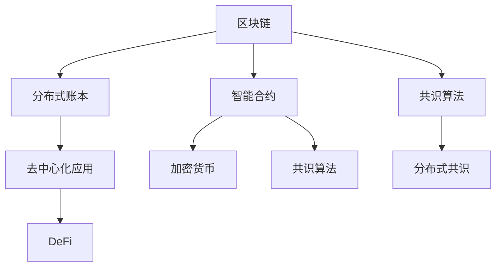

                 

# 区块链技术：去中心化应用开发

> 关键词：区块链, 去中心化应用(DeFi), 智能合约, 分布式共识, 加密货币, 分布式账本

## 1. 背景介绍

区块链技术自2009年诞生以来，已经成为去中心化应用开发的重要基础。其以去中心化、透明、不可篡改等特性，为互联网的进一步发展开辟了新的道路。在金融、供应链、医疗、版权保护等多个领域，区块链技术的应用前景广阔。然而，区块链的开发复杂度较高，涉及到分布式共识、加密算法、智能合约等多个关键技术点。本博客旨在系统介绍区块链技术和去中心化应用开发的原理、实践与前景。

## 2. 核心概念与联系

### 2.1 核心概念概述

为更好地理解区块链技术和去中心化应用开发的原理，本节将介绍几个密切相关的核心概念：

- 区块链(Blockchain)：是一种分布式账本技术，由多个块(Blocks)有序链接而成。每个块包含一组交易记录(Transactions)，同时前一个块的哈希值作为后一个块的依据。
- 分布式共识(Distributed Consensus)：区块链系统中不同节点间达成一致的算法。确保所有节点对账本内容的更新达成共识，防止数据篡改。
- 智能合约(Smart Contract)：一种部署在区块链上的自动化合约，当触发特定条件时，自动执行合同条款。
- 加密货币(Cryptocurrency)：一种基于区块链技术的去中心化数字货币，通过共识算法进行挖矿和发行。
- 共识算法(Consensus Algorithm)：保证网络共识的算法，如工作量证明(Proof of Work, PoW)、权益证明(Proof of Stake, PoS)等。
- 分布式账本(Distributed Ledger)：一种去中心化的数据存储方式，每个节点都有一份完整的账本副本。
- 去中心化应用(Decentralized Application, DeFi)：建立在区块链技术上的金融应用，具有去中心化、透明、无需中介等特点。

这些核心概念之间的逻辑关系可以通过以下Mermaid流程图来展示：



这个流程图展示出区块链技术的核心组成及其与其他核心概念的联系：

1. 区块链通过分布式账本存储交易数据，并使用共识算法保证账本内容的不可篡改性。
2. 智能合约部署在区块链上，实现自动化的合约执行。
3. 加密货币基于区块链技术进行发行和交易，保障其安全性。
4. 共识算法用于保证网络共识，使不同节点对账本内容的更新达成一致。
5. 去中心化应用建立在区块链之上，具有去中心化、透明、无需中介等特性。

这些核心概念共同构成了区块链技术的核心框架，使其能够在多个领域发挥重要作用。通过理解这些核心概念，我们可以更好地把握区块链技术的本质和应用前景。

## 3. 核心算法原理 & 具体操作步骤
### 3.1 算法原理概述

区块链技术的核心算法包括：

- 哈希函数(Hash Function)：用于计算块的哈希值，保障数据完整性和防篡改。
- 分布式共识算法：确保网络共识，如工作量证明、权益证明等。
- 加密算法：保障数据安全性和隐私性。

智能合约的执行基于区块链的智能合约语言，如Solidity、Ethereum Virtual Machine(ETHVM)等。其基本原理如下：

1. 编写智能合约代码。
2. 将智能合约代码部署到区块链上。
3. 触发智能合约的特定事件，执行相应的合约条款。

### 3.2 算法步骤详解

以下以Ethereum智能合约的开发为例，详细讲解智能合约的编写、部署和调用过程：

**步骤1: 编写智能合约代码**

```solidity
// SPDX-License-Identifier: MIT
pragma solidity ^0.8.0;

contract SimpleContract {
    uint256 private totalAmount;
    address payable private owner;
    
    event Transfer(uint256 amount, address to);
    
    constructor(uint256 initialAmount) {
        totalAmount = initialAmount;
        owner = msg.sender;
    }
    
    function transfer(address payable _recipient, uint256 _amount) public payable {
        require(_amount > 0);
        require(_amount <= totalAmount);
        require(msg.sender != _recipient);
        totalAmount -= _amount;
        _transfer(_recipient, _amount);
    }
    
    function transferFrom(address payable _sender, address _recipient, uint256 _amount) public payable {
        require(_amount > 0);
        require(_amount <= totalAmount);
        require(msg.sender == _sender || msg.sender == owner);
        _transfer(_recipient, _amount);
    }
    
    function _transfer(address payable _recipient, uint256 _amount) private {
        _recipient.transfer(_amount);
    }
}
```

上述代码定义了一个简单的智能合约，包含初始化、转账和转移函数。当接收者调用`transfer`函数时，如果余额足够，则更新总金额并执行转账操作，同时触发`Transfer`事件。

**步骤2: 部署智能合约**

使用MyEtherWallet等工具生成私钥和地址，然后使用Ethereum命令行或IDE(如Remix)将智能合约代码部署到区块链上：

```sh
# 使用MyEtherWallet生成私钥和地址
# 将私钥和智能合约代码上传至Ethereum网络
```

**步骤3: 调用智能合约**

部署后，通过调用合约函数来执行智能合约，如：

```sh
# 调用transfer函数转账
# 触发Transfer事件
```

以上就是使用Solidity编写、部署和调用智能合约的基本流程。通过这一过程，可以清晰地理解智能合约的原理和使用方法。

### 3.3 算法优缺点

区块链技术的优点包括：

- 去中心化：无中心节点，数据存储和交易记录由网络共识达成。
- 透明性：每个节点的账本副本相同，交易记录公开透明。
- 不可篡改：采用哈希函数和分布式共识算法保证数据不可篡改。
- 抗欺诈：共识算法和智能合约保障交易安全性。

然而，区块链技术也存在一些缺点：

- 性能瓶颈：区块链的交易速度较慢，不适合大规模交易。
- 能耗高：工作量证明等共识算法需要大量计算，能耗较高。
- 扩展性差：区块链的数据存储和交易记录有上限。
- 复杂度高：区块链开发和维护难度较大。

综合来看，区块链技术的优缺点显著，需要根据实际应用场景进行权衡和选择。

### 3.4 算法应用领域

区块链技术已经在多个领域得到了广泛应用，以下是几个典型应用场景：

- 金融：智能合约和去中心化交易所(DEX)在金融领域得到了广泛应用，如DeFi项目、ICO等。
- 供应链管理：区块链可以实现供应链的追溯和透明化管理，确保供应链各环节的数据安全。
- 医疗：区块链可以保障医疗数据的隐私性和完整性，防止数据泄露和篡改。
- 版权保护：区块链可以用于数字版权的登记和交易，确保版权的唯一性和不可篡改性。
- 物联网：区块链可以实现物联网设备的身份认证和数据透明化管理。
- 政府治理：区块链可以实现电子投票、电子合同等政府治理应用。

这些应用场景展示了区块链技术的广泛适用性和巨大潜力。随着区块链技术的不断发展和成熟，其在更多领域的应用前景将更加广阔。

## 4. 数学模型和公式 & 详细讲解 & 举例说明

### 4.1 数学模型构建

区块链的数学模型主要包括：

- 哈希函数：用于计算块的哈希值，如SHA-256。
- 分布式共识算法：如工作量证明(PoW)、权益证明(PoS)等。
- 加密算法：如RSA、ECC等。

智能合约的数学模型基于Ethereum Virtual Machine(ETHVM)，其计算模型如下：

- 存储器(Memory)：用于存储合约代码和交易数据。
- 存储器栈(Memory Stack)：用于临时存储中间结果。
- 存储器存储(Memory Storage)：用于存储变量和状态。
- 堆栈寄存器(Stack Pointer)：用于访问存储器栈。

### 4.2 公式推导过程

以哈希函数和分布式共识算法为例，介绍其数学原理：

哈希函数的数学模型：

- 输入：任意长度的二进制数据。
- 输出：固定长度的哈希值。
- 不可逆性：无法通过哈希值反推出原始数据。
- 防碰撞性：不同数据产生不同的哈希值。

分布式共识算法的数学模型：

- 共识：多个节点达成一致的算法。
- PoW：节点通过计算工作量证明，获得记账权。
- PoS：节点通过持有代币获得记账权。

智能合约的数学模型较为复杂，其运行原理包括：

- 变量赋值：如`uint256 x = 10;`。
- 条件判断：如`if(x > 5) { ... }`。
- 循环结构：如`for(i = 0; i < 10; i++) { ... }`。
- 函数调用：如`uint256 y = functionSum(x, y);`。

### 4.3 案例分析与讲解

以下以Ethereum智能合约的开发为例，具体分析其代码实现：

1. 变量定义：
   ```solidity
   uint256 private totalAmount;
   address payable private owner;
   ```

2. 事件定义：
   ```solidity
   event Transfer(uint256 amount, address to);
   ```

3. 构造函数：
   ```solidity
   constructor(uint256 initialAmount) {
       totalAmount = initialAmount;
       owner = msg.sender;
   }
   ```

4. 转账函数：
   ```solidity
   function transfer(address payable _recipient, uint256 _amount) public payable {
       require(_amount > 0);
       require(_amount <= totalAmount);
       require(msg.sender != _recipient);
       totalAmount -= _amount;
       _transfer(_recipient, _amount);
   }
   ```

5. 转移函数：
   ```solidity
   function transferFrom(address payable _sender, address _recipient, uint256 _amount) public payable {
       require(_amount > 0);
       require(_amount <= totalAmount);
       require(msg.sender == _sender || msg.sender == owner);
       _transfer(_recipient, _amount);
   }
   ```

6. 内部函数：
   ```solidity
   function _transfer(address payable _recipient, uint256 _amount) private {
       _recipient.transfer(_amount);
   }
   ```

以上代码实现了智能合约的基本功能，包含变量定义、事件定义、构造函数、转账函数和转移函数等。通过分析这些代码，可以清晰地理解智能合约的运行机制和执行逻辑。

## 5. 项目实践：代码实例和详细解释说明

### 5.1 开发环境搭建

在进行区块链和智能合约开发前，需要先搭建开发环境。以下是Ethereum智能合约开发的环境配置流程：

1. 安装Geth：从官网下载安装包并解压，启动Ethereum节点。
2. 配置钱包：使用MyEtherWallet等工具生成私钥和地址。
3. 安装Solidity编译器：从官网下载安装包并解压，配置环境变量。
4. 安装IDE：如Remix IDE，安装后配置与Geth的连接。

完成上述步骤后，即可在开发环境中进行智能合约的编写和部署。

### 5.2 源代码详细实现

以下是使用Solidity编写一个简单的智能合约的代码实现：

```solidity
// SPDX-License-Identifier: MIT
pragma solidity ^0.8.0;

contract SimpleContract {
    uint256 private totalAmount;
    address payable private owner;
    
    event Transfer(uint256 amount, address to);
    
    constructor(uint256 initialAmount) {
        totalAmount = initialAmount;
        owner = msg.sender;
    }
    
    function transfer(address payable _recipient, uint256 _amount) public payable {
        require(_amount > 0);
        require(_amount <= totalAmount);
        require(msg.sender != _recipient);
        totalAmount -= _amount;
        _transfer(_recipient, _amount);
    }
    
    function transferFrom(address payable _sender, address _recipient, uint256 _amount) public payable {
        require(_amount > 0);
        require(_amount <= totalAmount);
        require(msg.sender == _sender || msg.sender == owner);
        _transfer(_recipient, _amount);
    }
    
    function _transfer(address payable _recipient, uint256 _amount) private {
        _recipient.transfer(_amount);
    }
}
```

代码解释如下：

- 变量定义：定义私有变量`totalAmount`和`owner`，用于存储总金额和合约所有者地址。
- 事件定义：定义`Transfer`事件，记录转账操作。
- 构造函数：初始化总金额和合约所有者地址。
- 转账函数：判断金额是否合法，执行转账操作并触发`Transfer`事件。
- 转移函数：判断转账方和接收方是否合法，执行转账操作。
- 内部函数：私有函数`_transfer`，用于实现转账操作。

### 5.3 代码解读与分析

**变量定义**

```solidity
uint256 private totalAmount;
address payable private owner;
```

定义私有变量`totalAmount`和`owner`，用于存储总金额和合约所有者地址。`uint256`表示无符号整数类型，`address payable`表示接收方地址，可以接收以太币。

**事件定义**

```solidity
event Transfer(uint256 amount, address to);
```

定义`Transfer`事件，记录转账操作。`uint256 amount`表示转账金额，`address to`表示接收方地址。

**构造函数**

```solidity
constructor(uint256 initialAmount) {
    totalAmount = initialAmount;
    owner = msg.sender;
}
```

构造函数初始化总金额和合约所有者地址。`uint256 initialAmount`表示初始金额，`totalAmount`表示总金额，`owner`表示合约所有者地址。

**转账函数**

```solidity
function transfer(address payable _recipient, uint256 _amount) public payable {
    require(_amount > 0);
    require(_amount <= totalAmount);
    require(msg.sender != _recipient);
    totalAmount -= _amount;
    _transfer(_recipient, _amount);
}
```

转账函数判断金额是否合法，执行转账操作并触发`Transfer`事件。`address payable _recipient`表示接收方地址，`uint256 _amount`表示转账金额。`require`函数用于判断条件是否满足。

**转移函数**

```solidity
function transferFrom(address payable _sender, address _recipient, uint256 _amount) public payable {
    require(_amount > 0);
    require(_amount <= totalAmount);
    require(msg.sender == _sender || msg.sender == owner);
    _transfer(_recipient, _amount);
}
```

转移函数判断转账方和接收方是否合法，执行转账操作。`address payable _sender`表示转账方地址，`address _recipient`表示接收方地址，`uint256 _amount`表示转账金额。`require`函数用于判断条件是否满足。

**内部函数**

```solidity
function _transfer(address payable _recipient, uint256 _amount) private {
    _recipient.transfer(_amount);
}
```

内部函数`_transfer`，用于实现转账操作。`address payable _recipient`表示接收方地址，`uint256 _amount`表示转账金额。`_recipient.transfer(_amount)`函数用于转账。

### 5.4 运行结果展示

在部署智能合约后，可以使用Remix IDE等工具进行测试和调试。

测试转账操作：

1. 使用MyEtherWallet生成私钥和地址。
2. 在Remix IDE中编写智能合约代码，并部署到Ethereum网络。
3. 在Ethereum客户端调用`transfer`函数，进行转账操作。
4. 检查转账结果，确认交易是否成功。

以上就是使用Solidity编写、部署和调用智能合约的基本流程。通过这一过程，可以清晰地理解智能合约的原理和使用方法。

## 6. 实际应用场景

### 6.1 智能合约

智能合约是区块链技术的核心应用之一。通过智能合约，可以实现自动化和去中心化的合约执行，如自动支付、自动投票、自动合同等。以下是一个简单的智能合约实例：

1. 存入：甲方将一定金额的以太币存入智能合约，智能合约记录总金额。
2. 支取：甲方提出支取申请，乙方审核通过后，智能合约自动将一定金额的以太币支付给甲方。
3. 结算：乙方审核不通过，智能合约拒绝支付。

智能合约的优点包括：

- 自动化：自动执行合约条款，无需第三方介入。
- 透明性：交易记录公开透明，可追溯。
- 安全性：通过共识算法和智能合约保障交易安全。

### 6.2 去中心化交易所

去中心化交易所(DEX)是区块链技术的另一个重要应用。通过DEX，用户可以直接在区块链上进行交易，无需通过第三方中介，降低了交易成本和风险。以下是一个简单的去中心化交易所实例：

1. 注册：用户注册交易所账号。
2. 下单：用户下单买入或卖出。
3. 撮合：交易所匹配买方和卖方，进行交易。
4. 结算：交易所将交易金额自动支付给买方和卖方。

DEX的优点包括：

- 去中心化：无需第三方中介，提高交易效率。
- 低成本：交易费用较低，适合高频交易。
- 高流动性：用户可以在交易所上买卖不同资产。

### 6.3 供应链管理

区块链可以实现供应链的追溯和透明化管理，确保供应链各环节的数据安全。以下是一个简单的供应链管理实例：

1. 生产：生产商生产产品。
2. 运输：物流公司运输产品。
3. 销售：零售商销售产品。
4. 追溯：消费者可以查看产品从生产到销售的完整记录。

供应链管理的优点包括：

- 透明性：供应链各环节数据公开透明。
- 安全性：区块链保证数据不可篡改。
- 可靠性：区块链提高供应链各环节的可信度。

## 7. 工具和资源推荐
### 7.1 学习资源推荐

为了帮助开发者系统掌握区块链技术和去中心化应用开发的原理，这里推荐一些优质的学习资源：

1. 《Blockchain Basics》系列博文：由区块链技术专家撰写，深入浅出地介绍了区块链原理、智能合约等基础概念。

2. 《Ethereum Developer Documentation》文档：Ethereum官方文档，提供了丰富的智能合约开发资源和教程。

3. 《Solidity by Example》书籍：通过实例讲解Solidity智能合约的开发和应用。

4. 《Mastering Ethereum》书籍：深入讲解Ethereum平台的开发和应用，包含智能合约、共识算法等内容。

5. 《Blockchain for Developers》课程：由Udemy等平台提供的区块链开发课程，适合初学者快速入门。

通过对这些资源的学习实践，相信你一定能够快速掌握区块链技术和智能合约的精髓，并用于解决实际的开发问题。

### 7.2 开发工具推荐

高效的开发离不开优秀的工具支持。以下是几款用于区块链和智能合约开发的常用工具：

1. Geth：Ethereum官方客户端，提供丰富的开发工具和调试功能。

2. Remix IDE：Ethereum智能合约开发平台，提供了可视化编辑器和测试工具。

3. Truffle：Ethereum开发框架，支持智能合约编译、测试、部署等功能。

4. MetaMask：Ethereum钱包，支持智能合约交互和交易。

5. Web3.js：以太坊Web开发框架，提供丰富的API接口和开发工具。

6. Infura：Ethereum云服务提供商，提供免费的开发环境和API接口。

合理利用这些工具，可以显著提升区块链和智能合约开发的效率，加速创新迭代的步伐。

### 7.3 相关论文推荐

区块链技术和智能合约的发展源于学界的持续研究。以下是几篇奠基性的相关论文，推荐阅读：

1. Satoshi Nakamoto：《Bitcoin: A Peer-to-Peer Electronic Cash System》，比特币白皮书，奠定了区块链技术的基础。

2. Vitalik Buterin：《Ethereum Whitepaper》，以太坊白皮书，引入了智能合约和以太坊虚拟机。

3. Nick Szabo：《Smart Contracts: Defining Transactions on the Internet》，智能合约概念的提出者。

4. Niklaus Wirth：《Towards a Global System of Algorithms》，提出区块链技术的核心理念。

5. Daniel Larimer：《EOS.IO》白皮书，介绍EOS区块链平台。

6. Dmitri Zhelezov：《Blockchain Technology: The Future of Security, Trust and Privacy》，区块链技术的深度剖析。

这些论文代表了大区块链技术和智能合约的发展脉络。通过学习这些前沿成果，可以帮助研究者把握学科前进方向，激发更多的创新灵感。

## 8. 总结：未来发展趋势与挑战

### 8.1 总结

本文对区块链技术和去中心化应用开发的原理、实践与前景进行了全面系统的介绍。首先阐述了区块链技术的核心概念和基本原理，明确了智能合约在区块链开发中的核心地位。其次，详细讲解了智能合约的编写、部署和调用过程，并通过案例分析，帮助读者理解智能合约的运行机制和执行逻辑。最后，系统介绍了区块链技术在多个领域的应用前景，展示了其广阔的发展潜力和应用价值。

通过本文的系统梳理，可以看到，区块链技术和智能合约为去中心化应用开发提供了全新的基础，其去中心化、透明、不可篡改等特性，为互联网的进一步发展开辟了新的道路。随着区块链技术的不断发展和成熟，其应用前景将更加广阔，未来可期。

### 8.2 未来发展趋势

展望未来，区块链技术的未来发展趋势包括：

1. 扩展性提升：通过分片技术、闪电网络等手段，提升区块链的交易速度和扩展性。

2. 共识算法优化：通过权益证明、委托权益证明等新共识算法，提高区块链的能效和安全性。

3. 跨链技术发展：通过跨链桥接技术，实现不同区块链之间的互联互通。

4. 隐私保护增强：通过零知识证明、同态加密等隐私保护技术，提高区块链的隐私性和安全性。

5. 智能合约进化：通过新一代智能合约语言和虚拟机，提高智能合约的可读性和可维护性。

6. 去中心化应用多样化：除了金融领域，区块链将在供应链、医疗、版权保护等多个领域得到应用，形成更丰富的去中心化应用生态。

以上趋势凸显了区块链技术的广阔前景。这些方向的探索发展，必将进一步提升区块链的性能和应用范围，为构建去中心化应用提供更坚实的基础。

### 8.3 面临的挑战

尽管区块链技术已经取得了瞩目成就，但在迈向更加智能化、普适化应用的过程中，它仍面临着诸多挑战：

1. 扩展性瓶颈：当前区块链的交易速度较慢，无法支持大规模交易。

2. 能耗高：共识算法需要大量计算，能耗较高。

3. 复杂度高：区块链开发和维护难度较大。

4. 安全性问题：智能合约可能存在漏洞，导致资产被盗窃。

5. 法规风险：不同国家对区块链的监管政策不同，可能影响其发展。

6. 隐私保护不足：区块链的公开透明性可能带来隐私泄露风险。

正视区块链面临的这些挑战，积极应对并寻求突破，将是大规模应用的关键。相信随着学界和产业界的共同努力，这些挑战终将一一被克服，区块链技术必将在构建去中心化应用中扮演越来越重要的角色。

### 8.4 研究展望

面对区块链技术所面临的挑战，未来的研究需要在以下几个方面寻求新的突破：

1. 优化共识算法：引入新的共识算法，如权益证明、委托权益证明等，提高区块链的能效和安全性。

2. 提升扩展性：引入分片技术、闪电网络等手段，提升区块链的交易速度和扩展性。

3. 增强隐私保护：引入零知识证明、同态加密等隐私保护技术，提高区块链的隐私性和安全性。

4. 改进智能合约：引入新一代智能合约语言和虚拟机，提高智能合约的可读性和可维护性。

5. 跨链桥接技术：通过跨链桥接技术，实现不同区块链之间的互联互通。

6. 法规和标准制定：参与制定区块链技术的法规和标准，规范行业发展。

这些研究方向的探索，必将引领区块链技术迈向更高的台阶，为构建安全、可靠、可解释、可控的去中心化应用提供坚实的技术基础。面向未来，区块链技术还需要与其他人工智能技术进行更深入的融合，如分布式计算、自然语言处理等，多路径协同发力，共同推动区块链技术的进步。

## 9. 附录：常见问题与解答

**Q1：区块链的扩展性问题如何解决？**

A: 区块链的扩展性问题可以通过以下几种手段解决：

1. 分片技术：将区块链分为多个分片，并行处理交易，提升交易速度。

2. 闪电网络：通过二层网络，减少主链上的交易量，提升交易速度。

3. 跨链技术：通过跨链桥接技术，实现不同区块链之间的互联互通，提升扩展性。

4. 共识算法优化：引入新的共识算法，如权益证明、委托权益证明等，提高区块链的能效和安全性。

**Q2：智能合约如何保障安全性？**

A: 智能合约的安全性可以通过以下几种手段保障：

1. 代码审查：对智能合约代码进行仔细审查，发现和修复漏洞。

2. 审计和测试：通过第三方审计和测试，确保智能合约的安全性。

3. 多重签名：引入多重签名机制，提高智能合约的安全性。

4. 合约版本控制：定期更新合约代码，修复已知漏洞。

5. 白名单机制：限制合约的使用对象，减少恶意攻击风险。

**Q3：如何提高区块链的隐私保护能力？**

A: 区块链的隐私保护能力可以通过以下几种手段提高：

1. 隐私币：使用隐私币，减少交易数据的公开性。

2. 同态加密：使用同态加密技术，加密数据并执行计算。

3. 零知识证明：使用零知识证明技术，证明数据正确性而不泄露数据内容。

4. 匿名化：使用匿名化技术，减少交易数据的可追溯性。

**Q4：区块链技术有哪些应用场景？**

A: 区块链技术已经在多个领域得到了广泛应用，以下是几个典型应用场景：

1. 金融：智能合约和去中心化交易所(DEX)在金融领域得到了广泛应用，如DeFi项目、ICO等。

2. 供应链管理：区块链可以实现供应链的追溯和透明化管理，确保供应链各环节的数据安全。

3. 医疗：区块链可以保障医疗数据的隐私性和完整性，防止数据泄露和篡改。

4. 版权保护：区块链可以用于数字版权的登记和交易，确保版权的唯一性和不可篡改性。

5. 物联网：区块链可以实现物联网设备的身份认证和数据透明化管理。

6. 政府治理：区块链可以实现电子投票、电子合同等政府治理应用。

这些应用场景展示了区块链技术的广泛适用性和巨大潜力。随着区块链技术的不断发展和成熟，其在更多领域的应用前景将更加广阔。

**Q5：区块链技术有哪些优势？**

A: 区块链技术的主要优势包括：

1. 去中心化：无中心节点，数据存储和交易记录由网络共识达成。

2. 透明性：每个节点的账本副本相同，交易记录公开透明。

3. 不可篡改：采用哈希函数和分布式共识算法保证数据不可篡改。

4. 抗欺诈：共识算法和智能合约保障交易安全性。

5. 匿名性：用户可以匿名交易，保护隐私。

6. 去中介：无需第三方中介，降低交易成本。

这些优势使得区块链技术在多个领域具有广泛的应用前景，未来可期。

---

作者：禅与计算机程序设计艺术 / Zen and the Art of Computer Programming

