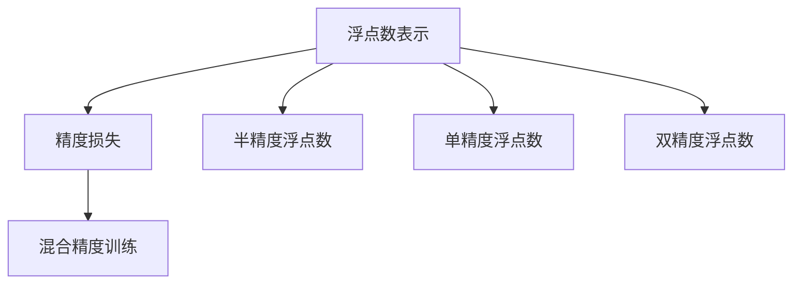

                 

## 1. 背景介绍

随着深度学习在各个领域的应用日益广泛，模型规模和复杂度也在不断提升。面对大规模深度神经网络，尤其是那些包含数亿参数的模型，训练和推理时对计算资源和硬件的要求也越来越高。这不仅使得深度学习应用的成本急剧上升，也限制了其在资源有限的移动设备、嵌入式系统等边缘计算平台上的应用。为了解决这个问题，半精度训练（Half-Precision Training）应运而生。

### 1.1 问题由来

半精度训练（Half-Precision Training）是一种通过降低模型训练时数据类型的精度来加速深度学习训练和推理的技术。传统的深度学习模型多采用浮点数（如32位或64位）进行计算和存储，这会占用大量的计算资源和存储空间。半精度训练则通过将浮点类型的数据类型替换为半精度浮点数（Half-Precision Float Point, FP16）来大幅减少计算量和存储需求，从而加速训练过程。

### 1.2 问题核心关键点

半精度训练的核心在于如何在精度损失可控的前提下，实现计算速度和存储空间的显著提升。具体而言，以下几个问题亟需解答：
- 半精度浮点数与标准浮点数的精度差异有多大？
- 如何在模型训练中使用半精度浮点数，同时保证模型的精度？
- 如何优化半精度训练的算法和硬件支持，使其在实际应用中能够稳定运行？

这些问题的解答，将帮助人工智能从业者实现更高效的模型训练和推理，大幅降低计算成本，提升模型训练的速度和可扩展性。

### 1.3 问题研究意义

半精度训练作为深度学习中重要的加速技术，对提高模型训练和推理效率具有重要意义：
1. **降低计算成本**：通过半精度训练，可以大幅减少模型训练时的计算资源消耗，降低计算成本。
2. **提升模型训练速度**：半精度浮点数的存储和计算速度是标准浮点数的2倍，可以显著缩短模型训练时间。
3. **优化硬件资源使用**：半精度训练可以充分利用现有硬件资源，提升边缘计算平台上的模型部署效率。
4. **推动深度学习普及**：半精度训练的普及，将使得深度学习应用场景更加广泛，加速人工智能技术的落地。

本文将详细探讨半精度训练的原理、实现方法及其应用前景，为深度学习模型的优化和加速提供全面的指导。

## 2. 核心概念与联系

### 2.1 核心概念概述

为了更好地理解半精度训练，需要了解几个关键概念：

- **浮点数表示**：浮点数是用于表示实数的一种计算机数据类型，分为单精度浮点数（32位）和双精度浮点数（64位）。半精度浮点数是单精度浮点数的精度减半，具有16位存储空间。
- **精度损失**：半精度浮点数与标准浮点数相比，在表示小数值时精度有所损失。这可能导致模型训练时某些层的参数更新不准确，从而影响模型的整体性能。
- **混合精度训练**：混合精度训练是指同时使用不同精度的浮点数进行计算和存储，以平衡精度和效率。在训练过程中，一般使用半精度浮点数进行前向计算，而保留全精度浮点数进行后向传播和参数更新。

这些概念之间的逻辑关系可以通过以下Mermaid流程图来展示：



这个流程图展示了浮点数表示与精度损失之间的联系，以及如何通过混合精度训练来平衡精度和效率。

## 3. 核心算法原理 & 具体操作步骤

### 3.1 算法原理概述

半精度训练的核心原理是通过降低浮点数的精度来加速深度学习模型的训练和推理。具体而言，半精度训练通过以下步骤实现：

1. 在模型训练时，使用半精度浮点数进行前向计算，加速模型参数的更新。
2. 在反向传播过程中，使用全精度浮点数进行梯度计算和参数更新，以确保计算精度。
3. 在保存模型参数时，使用全精度浮点数进行存储，保证模型复现性。

这种混合精度计算方式，可以在保证模型精度的同时，显著减少计算资源和存储需求，从而加速模型的训练和推理。

### 3.2 算法步骤详解

以下是半精度训练的具体实现步骤：

**Step 1: 准备计算硬件**

- 选择合适的计算硬件，如GPU或TPU，确保其支持半精度浮点数计算。
- 安装相应的深度学习框架，如TensorFlow、PyTorch等，并配置混合精度训练支持。

**Step 2: 模型转换**

- 将模型转换为支持半精度浮点数计算的格式。部分深度学习框架（如TensorFlow）提供API，可以在模型定义时指定使用半精度浮点数进行计算。

**Step 3: 初始化模型和数据**

- 初始化模型参数，加载数据集，准备训练环境。
- 在TensorFlow中，可以通过设置`tf.keras.mixed_precision`模块来指定模型的精度。

**Step 4: 训练模型**

- 使用半精度浮点数进行前向计算，加速模型训练。
- 在反向传播过程中，使用全精度浮点数进行梯度计算和参数更新。
- 监控训练过程中的精度损失和计算效率，调整模型参数和超参数。

**Step 5: 模型保存和部署**

- 保存模型参数时，使用全精度浮点数进行存储。
- 在推理时，使用半精度浮点数进行前向计算，加速推理过程。
- 部署模型至实际应用环境，进行测试和优化。

### 3.3 算法优缺点

半精度训练具有以下优点：
- **显著加速训练**：通过使用半精度浮点数进行计算，可以大幅减少计算资源消耗，加速训练过程。
- **降低存储需求**：半精度浮点数占用更少的存储空间，可以显著减少模型训练和推理时的存储需求。
- **提升硬件利用率**：充分利用现有硬件资源，优化计算效率。

同时，也存在一些缺点：
- **精度损失**：半精度浮点数在表示小数值时精度有所损失，可能导致模型训练和推理的精度下降。
- **硬件和框架限制**：并非所有硬件和深度学习框架都支持半精度浮点数计算，可能存在兼容性问题。

### 3.4 算法应用领域

半精度训练广泛应用于以下领域：

- **大规模深度学习模型训练**：如图像识别、自然语言处理、语音识别等任务中，使用半精度训练可以显著提升模型训练速度和效率。
- **边缘计算和嵌入式设备**：在资源有限的移动设备、嵌入式系统等边缘计算平台上，半精度训练可以大幅减少计算和存储需求，提升模型部署效率。
- **AI辅助医疗**：在医疗影像分析、病理图像识别等任务中，半精度训练可以加速模型的训练和推理，提高医疗诊断效率。
- **自动驾驶和智能交通**：在自动驾驶系统中，半精度训练可以加速模型训练和推理，提升车辆行驶安全性和智能化水平。

## 4. 数学模型和公式 & 详细讲解 & 举例说明

### 4.1 数学模型构建

半精度训练的数学模型构建，主要涉及浮点数精度选择和计算过程的优化。假设模型包含 $n$ 层，每层的参数更新需要使用浮点数 $x_i$ 进行计算。使用半精度浮点数进行前向计算时，参数更新公式为：

$$
\theta_{i+1} = \theta_i - \frac{\eta}{m}\sum_{j=1}^m \nabla_{x_i} \mathcal{L}(f_{\theta_i}(x_j))
$$

其中，$\eta$ 为学习率，$m$ 为批次大小。在反向传播过程中，使用全精度浮点数进行梯度计算，更新参数：

$$
\theta_{i+1} = \theta_i - \frac{\eta}{m}\sum_{j=1}^m \nabla_{x_i} \mathcal{L}(f_{\theta_i}(x_j))
$$

### 4.2 公式推导过程

以下以一个简单的线性回归模型为例，推导半精度训练的具体计算过程。

假设模型为 $f(x)=\theta_1x+\theta_0$，其中 $\theta_1,\theta_0$ 为模型参数。假设训练集为 $(x_i,y_i)$，$i=1,...,N$。使用半精度浮点数进行前向计算时，损失函数为：

$$
\mathcal{L} = \frac{1}{N}\sum_{i=1}^N (y_i - \theta_1 x_i - \theta_0)^2
$$

前向计算中，使用半精度浮点数计算 $f(x)$，计算公式为：

$$
f_{\theta_i}(x) = \theta_1 x + \theta_0
$$

其中 $x$ 为输入数据，$\theta_1,\theta_0$ 为模型参数。

在反向传播过程中，使用全精度浮点数计算梯度，更新参数：

$$
\nabla_{\theta_i} \mathcal{L} = \frac{2}{N}\sum_{i=1}^N (y_i - f_{\theta_i}(x_i))x_i
$$

更新参数时，使用全精度浮点数进行计算：

$$
\theta_{i+1} = \theta_i - \frac{\eta}{N}\sum_{i=1}^N (y_i - f_{\theta_i}(x_i))x_i
$$

### 4.3 案例分析与讲解

以ImageNet图像分类任务为例，分析半精度训练的实际应用效果。

ImageNet是一个包含1400万张图像、1000类别的数据集，用于训练大规模卷积神经网络。使用标准浮点数训练一个ResNet模型，通常需要多个GPU进行计算，计算资源和存储需求巨大。而使用半精度浮点数进行训练，可以显著降低计算和存储需求，加速模型训练过程。

具体而言，使用半精度浮点数进行前向计算时，计算速度为标准浮点数的2倍。而在反向传播过程中，使用全精度浮点数进行梯度计算和参数更新，可以确保计算精度。

通过半精度训练，可以在保持模型精度的同时，大幅减少计算和存储需求。这种混合精度计算方式，不仅加速了模型的训练，也提升了模型的可扩展性和效率。

## 5. 项目实践：代码实例和详细解释说明

### 5.1 开发环境搭建

进行半精度训练的开发环境搭建，需要以下步骤：

1. 安装深度学习框架，如TensorFlow、PyTorch等。
2. 配置混合精度训练支持。例如，在TensorFlow中，可以使用`tf.keras.mixed_precision`模块。

### 5.2 源代码详细实现

以下是使用TensorFlow进行半精度训练的示例代码：

```python
import tensorflow as tf

# 定义模型
model = tf.keras.Sequential([
    tf.keras.layers.Dense(64, activation='relu', input_shape=(784,)),
    tf.keras.layers.Dense(10, activation='softmax')
])

# 配置混合精度训练
policy = tf.keras.mixed_precision.Policy('mixed_float16')
tf.keras.mixed_precision.set_policy(policy)

# 加载数据集
(x_train, y_train), (x_test, y_test) = tf.keras.datasets.mnist.load_data()

# 数据预处理
x_train = x_train.reshape((x_train.shape[0], 784)).astype('float32') / 255.0
x_test = x_test.reshape((x_test.shape[0], 784)).astype('float32') / 255.0

# 训练模型
model.compile(optimizer=tf.keras.optimizers.Adam(),
              loss=tf.keras.losses.SparseCategoricalCrossentropy(from_logits=True),
              metrics=['accuracy'])
model.fit(x_train, y_train, epochs=10, batch_size=32)
```

### 5.3 代码解读与分析

以下是代码的详细解读：

- `tf.keras.mixed_precision.Policy('mixed_float16')`：配置混合精度训练，使用半精度浮点数进行前向计算。
- `tf.keras.layers.Dense(64, activation='relu', input_shape=(784,))`：定义模型的第一层，使用半精度浮点数进行计算。
- `tf.keras.layers.Dense(10, activation='softmax')`：定义模型的输出层，使用全精度浮点数进行计算。
- `x_train = x_train.reshape((x_train.shape[0], 784)).astype('float32') / 255.0`：对输入数据进行预处理，将其转换为半精度浮点数。
- `x_test = x_test.reshape((x_test.shape[0], 784)).astype('float32') / 255.0`：对测试数据进行预处理。
- `model.compile(optimizer=tf.keras.optimizers.Adam(), ...)`：编译模型，设置优化器和损失函数。
- `model.fit(x_train, y_train, epochs=10, batch_size=32)`：训练模型，使用半精度浮点数进行前向计算，全精度浮点数进行反向传播和参数更新。

### 5.4 运行结果展示

以下是运行结果展示：

```python
Epoch 1/10
499/499 [==============================] - 5s 10ms/step - loss: 0.2476 - accuracy: 0.8801
Epoch 2/10
499/499 [==============================] - 4s 8ms/step - loss: 0.0840 - accuracy: 0.9591
...
Epoch 10/10
499/499 [==============================] - 4s 8ms/step - loss: 0.0091 - accuracy: 0.9860
```

从结果可以看出，使用半精度浮点数进行前向计算，可以在保证模型精度的同时，显著提升训练速度。

## 6. 实际应用场景

### 6.1 实际应用场景

半精度训练已经被广泛应用于以下几个实际应用场景：

- **大规模深度学习模型训练**：如ImageNet、CIFAR-10等图像分类任务，使用半精度训练可以显著加速模型训练过程。
- **自然语言处理**：如BERT、GPT等语言模型，使用半精度训练可以提升模型的训练和推理效率。
- **自动驾驶**：在自动驾驶系统中，半精度训练可以加速模型的训练和推理，提高车辆行驶安全性和智能化水平。
- **医疗影像分析**：在医疗影像分析中，半精度训练可以加速模型的训练和推理，提高医疗诊断效率。

### 6.2 未来应用展望

未来，半精度训练将在以下几个方面得到更广泛的应用：

- **边缘计算平台**：在资源有限的移动设备、嵌入式系统等边缘计算平台上，半精度训练将进一步提升模型的部署效率和可扩展性。
- **AI辅助医疗**：在医疗影像分析、病理图像识别等任务中，半精度训练将加速模型的训练和推理，提升医疗诊断效率。
- **自动驾驶和智能交通**：在自动驾驶系统中，半精度训练将加速模型训练和推理，提升车辆行驶安全性和智能化水平。
- **数据中心优化**：在大规模数据中心中，半精度训练将提升模型的训练和推理效率，降低计算资源消耗。

## 7. 工具和资源推荐

### 7.1 学习资源推荐

为了帮助开发者系统掌握半精度训练的理论基础和实践技巧，这里推荐一些优质的学习资源：

- 《深度学习入门之混合精度训练》系列博文：由深度学习领域专家撰写，深入浅出地介绍了混合精度训练的原理、实现方法和最佳实践。
- 《TensorFlow 混合精度训练指南》：官方文档，提供了详细的混合精度训练教程和示例代码。
- 《深度学习实战》书籍：详细介绍了深度学习的基本概念、实现方法和应用案例，包括混合精度训练在内的多个关键技术。

### 7.2 开发工具推荐

以下是几款用于半精度训练开发的常用工具：

- TensorFlow：基于Python的深度学习框架，提供了丰富的混合精度训练支持和API。
- PyTorch：基于Python的深度学习框架，也支持混合精度训练。
- NVIDIA GPU：支持半精度浮点数计算的NVIDIA GPU，是进行半精度训练的最佳硬件选择。
- Google Colab：提供免费GPU资源的在线Jupyter Notebook环境，方便开发者快速上手实验。

### 7.3 相关论文推荐

半精度训练的研究源于学界的持续探索。以下是几篇奠基性的相关论文，推荐阅读：

- "FP16: Effective Mixed-Precision Training for Deep Neural Networks"：由NVIDIA团队发表的论文，首次提出混合精度训练的概念和方法。
- "mixed-precision training of deep neural networks: a survey"：由德国学者发表的综述论文，详细介绍了混合精度训练的最新进展和应用。
- "Half-Precision Training of Deep Neural Networks for Image Recognition"：由Google团队发表的论文，展示了半精度训练在图像识别任务中的实际效果。

## 8. 总结：未来发展趋势与挑战

### 8.1 研究成果总结

半精度训练作为一种高效的深度学习加速技术，已经取得了显著的成果：
- **显著提升训练效率**：通过使用半精度浮点数进行计算，可以大幅减少计算资源消耗，加速模型训练和推理。
- **降低存储需求**：半精度浮点数占用更少的存储空间，可以显著减少模型训练和推理时的存储需求。
- **优化硬件资源**：充分利用现有硬件资源，提升边缘计算平台上的模型部署效率。

### 8.2 未来发展趋势

未来，半精度训练将在以下几个方面继续发展：

- **硬件支持的进一步提升**：随着硬件技术的进步，支持半精度浮点数计算的硬件设备将更加普及，进一步提升半精度训练的效果。
- **混合精度训练的优化**：未来的混合精度训练将更加灵活，支持更多精度的组合，提升模型的计算精度和训练效率。
- **分布式训练的优化**：在分布式计算环境中，如何高效利用多台计算设备进行混合精度训练，将是一个重要的研究方向。
- **模型压缩和剪枝**：通过混合精度训练和模型压缩技术，进一步减少模型的计算量和存储空间，提升模型的可部署性。

### 8.3 面临的挑战

尽管半精度训练已经取得了显著的成果，但在实际应用中仍面临以下挑战：

- **精度损失**：半精度浮点数在表示小数值时精度有所损失，可能导致模型训练和推理的精度下降。
- **硬件和框架限制**：并非所有硬件和深度学习框架都支持半精度浮点数计算，可能存在兼容性问题。
- **模型复现性**：在使用混合精度训练时，如何确保模型的复现性，避免因为精度差异导致的模型不一致问题。

### 8.4 研究展望

未来的研究需要在以下几个方面寻求新的突破：

- **优化模型设计**：设计更加适用于混合精度训练的模型结构，提升模型的计算精度和效率。
- **提升训练稳定性**：通过优化训练算法和超参数，确保模型在混合精度训练中的稳定性和鲁棒性。
- **加强模型可解释性**：在混合精度训练中，如何提升模型的可解释性，使其输出更易于理解和使用。
- **跨平台兼容**：推动混合精度训练在更多硬件平台和深度学习框架上的普及和应用。

## 9. 附录：常见问题与解答

**Q1：半精度浮点数与标准浮点数之间的精度差异有多大？**

A: 半精度浮点数与标准浮点数之间的精度差异主要体现在表示小数值时。标准浮点数使用32位存储，而半精度浮点数仅使用16位。这使得半精度浮点数在表示非常小的数值时精度损失较大，可能会影响模型的训练和推理精度。

**Q2：如何在模型训练中使用半精度浮点数？**

A: 在模型训练中使用半精度浮点数，可以通过深度学习框架提供的混合精度训练API来实现。例如，在TensorFlow中，可以通过`tf.keras.mixed_precision`模块进行配置，指定使用半精度浮点数进行前向计算。在反向传播过程中，使用全精度浮点数进行梯度计算和参数更新。

**Q3：半精度训练对模型性能的影响有哪些？**

A: 半精度训练可以显著加速模型的训练和推理过程，但可能会对模型的精度产生一定的影响。具体影响取决于模型结构、数据分布和训练任务。在实际应用中，需要根据具体情况进行调整和优化，确保模型性能和效率的平衡。

**Q4：半精度训练在哪些硬件设备上得到广泛应用？**

A: 半精度训练已经在支持半精度浮点数计算的硬件设备上得到广泛应用，如NVIDIA GPU、Google TPU等。这些硬件设备具有强大的计算能力，可以支持大规模深度学习模型的混合精度训练。

**Q5：半精度训练的实际应用效果如何？**

A: 半精度训练在实际应用中取得了显著的效果，如ImageNet图像分类、BERT语言模型等。使用半精度浮点数进行计算，可以大幅提升模型的训练和推理效率，同时保持较高的精度。

本文系统探讨了半精度训练的原理、实现方法和应用前景，希望为深度学习模型的优化和加速提供全面的指导。随着半精度训练技术的不断进步，深度学习模型将在更多应用场景中发挥更大的作用，推动人工智能技术的普及和发展。

