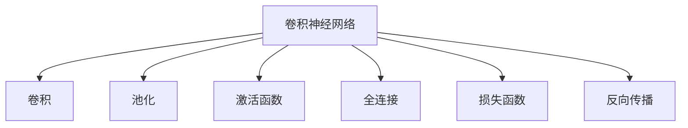

                 

# 卷积神经网络(Convolutional Neural Networks) - 原理与代码实例讲解

> 关键词：卷积神经网络, CNN, 特征提取, 池化, 卷积核, 深度学习, 图像识别, 计算机视觉

## 1. 背景介绍

### 1.1 问题由来

随着深度学习技术的发展，卷积神经网络（Convolutional Neural Network, CNN）逐渐成为计算机视觉领域最先进的技术之一。它的成功主要归功于其独有的特征提取能力和参数共享机制，能够高效地处理高维数据，如图像、音频、视频等。CNN最初由Fukushima在1980年代提出，主要用于感知机器的视觉识别任务。在1989年，Yann LeCun和Yoshua Bengio进一步发展了CNN，并将其应用于手写数字识别任务，获得了显著的突破。

### 1.2 问题核心关键点

CNN的核心思想是通过卷积和池化等操作，对输入的高维数据进行局部特征提取，并通过层次化抽象，逐渐学习出更高级的特征表示，最终通过全连接层实现分类或回归等任务。CNN的原理简单，但由于其参数共享的特性，使得模型具有较好的泛化能力，能够在有限的数据集上学习到高效的特征表示。

## 2. 核心概念与联系

### 2.1 核心概念概述

为了更好地理解CNN的工作原理，本节将介绍几个密切相关的核心概念：

- 卷积神经网络(CNN)：一种深度学习模型，专门用于图像、音频等高维数据的特征提取和分类任务。通过多层卷积和池化操作，逐步学习出更抽象、更高级的特征表示。

- 卷积(C Convolution)：CNN的核心操作之一，通过滑动卷积核在输入数据上提取局部特征，并将特征映射到更高维的空间。卷积操作具有参数共享特性，使得模型具有较好的泛化能力。

- 池化(Pooling)：用于降低特征图的空间大小，同时保留关键特征信息，防止过拟合。常见的池化操作包括最大池化和平均池化。

- 卷积核(Filter)：卷积操作中的重要参数，定义了卷积操作的窗口大小和权重。卷积核的权重通常在网络中一起训练，通过反向传播更新。

- 激活函数(Activation Function)：用于引入非线性变换，使得模型能够学习非线性特征。常见的激活函数包括ReLU、Sigmoid、Tanh等。

- 损失函数(Loss Function)：用于衡量模型预测输出与真实标签之间的差异。常见的损失函数包括交叉熵损失、均方误差损失等。

- 反向传播(Backpropagation)：用于计算模型参数梯度，并更新参数的优化算法。反向传播是深度学习模型的核心，通过链式法则实现参数更新。

这些核心概念之间的逻辑关系可以通过以下Mermaid流程图来展示：



这个流程图展示了这个核心概念之间的关联，帮助我们更好地理解CNN的工作流程。

## 3. 核心算法原理 & 具体操作步骤
### 3.1 算法原理概述

CNN通过多层卷积和池化操作，逐步学习出输入数据的特征表示。在每一层中，卷积核通过滑动在输入数据上提取局部特征，并将特征映射到更高维的空间。卷积操作具有参数共享特性，使得模型具有较好的泛化能力。

具体而言，CNN的结构可以分为以下几个部分：

- 卷积层：通过滑动卷积核在输入数据上提取局部特征，并将特征映射到更高维的空间。卷积核的权重通常在网络中一起训练，通过反向传播更新。
- 池化层：用于降低特征图的空间大小，同时保留关键特征信息，防止过拟合。常见的池化操作包括最大池化和平均池化。
- 激活函数层：用于引入非线性变换，使得模型能够学习非线性特征。
- 全连接层：用于实现最终的分类或回归任务。全连接层将上一层的所有特征都考虑在内，通过softmax等激活函数输出类别概率分布。

CNN的整体流程大致如下：

1. 输入层：输入高维数据，如图像、音频等。
2. 卷积层：通过滑动卷积核在输入数据上提取局部特征，并将特征映射到更高维的空间。
3. 池化层：通过池化操作降低特征图的空间大小，保留关键特征信息。
4. 激活函数层：通过激活函数引入非线性变换，学习复杂特征。
5. 全连接层：将上一层的所有特征都考虑在内，输出最终的分类或回归结果。

### 3.2 算法步骤详解

CNN的训练过程大致分为以下几个步骤：

**Step 1: 准备数据集和模型**

- 准备训练集、验证集和测试集，通常是图像、音频等高维数据集。
- 构建CNN模型，包括卷积层、池化层、激活函数层和全连接层。

**Step 2: 初始化模型参数**

- 随机初始化卷积核、激活函数参数等模型参数。

**Step 3: 前向传播**

- 将训练集数据输入模型，进行前向传播计算。
- 通过卷积和池化操作逐步提取特征，并通过全连接层进行分类或回归任务。

**Step 4: 计算损失函数**

- 通过比较模型预测输出与真实标签，计算损失函数。
- 常见的损失函数包括交叉熵损失、均方误差损失等。

**Step 5: 反向传播**

- 通过反向传播算法计算模型参数梯度。
- 通过链式法则将损失函数的梯度传递到每层参数上。

**Step 6: 更新模型参数**

- 根据梯度下降等优化算法更新模型参数。
- 重复Step 3到Step 6，直至模型收敛。

**Step 7: 评估模型**

- 在验证集和测试集上评估模型的性能。
- 通过准确率、精度等指标衡量模型的泛化能力。

### 3.3 算法优缺点

CNN具有以下优点：

1. 高效的特征提取：卷积操作可以有效地提取局部特征，避免了全局池化操作带来的信息损失。
2. 参数共享特性：卷积核的权重在网络中具有共享特性，大大减少了模型的参数数量，提高了模型的泛化能力。
3. 局部连接：卷积操作只考虑局部连接，减少了模型计算量，提高了计算效率。
4. 多通道处理：卷积核可以处理多通道输入数据，如图像的RGB通道。
5. 较好的泛化能力：CNN能够学习出复杂的特征表示，具有较好的泛化能力。

但CNN也存在一些缺点：

1. 参数依赖：CNN的性能高度依赖于数据集的大小和质量，数据不足时可能过拟合。
2. 局部连接：CNN只能处理局部连接，对于全局信息的捕捉不够充分。
3. 计算复杂：卷积操作需要计算大量卷积核和输入数据的点积，计算复杂度较高。
4. 难以处理非结构化数据：CNN主要处理高维结构化数据，对于非结构化数据（如文本）难以处理。
5. 数据增广：CNN需要较多的标注数据，对于非标注数据难以处理。

### 3.4 算法应用领域

CNN广泛应用于计算机视觉、图像识别、视频分析等诸多领域，具体应用包括：

- 图像分类：如手写数字识别、图像检索等。通过CNN学习出图像的高级特征表示，进行分类或识别任务。
- 目标检测：如人脸检测、车辆检测等。通过多任务目标检测模型（如Faster R-CNN），同时学习出目标的位置和类别信息。
- 语义分割：如场景分割、边缘检测等。通过语义分割模型，将图像中的每个像素分类为不同的语义类别。
- 实例分割：如图像分割、实例跟踪等。通过实例分割模型，对图像中的每个实例进行精确的分割和分类。
- 动作识别：如动作分类、动作检测等。通过动作识别模型，对视频序列中的动作进行分类和定位。
- 姿态估计：如姿态检测、姿态识别等。通过姿态估计模型，对人类姿态进行检测和识别。

CNN的应用领域十分广泛，从图像处理到视频分析，从动作识别到姿态估计，几乎涵盖了计算机视觉领域的所有任务。未来，随着CNN技术的不断演进，将有更多的应用场景被挖掘和开发出来。

## 4. 数学模型和公式 & 详细讲解 & 举例说明

### 4.1 数学模型构建

CNN的数学模型构建通常包括以下几个步骤：

- 定义输入张量 $X \in \mathbb{R}^{m \times n \times c}$，其中 $m$、$n$ 分别为图像的宽和高，$c$ 为通道数（如图像的RGB通道）。
- 定义卷积核 $W \in \mathbb{R}^{k \times k \times c \times o}$，其中 $k$、$k$ 分别为卷积核的大小，$c$ 为输入张量的通道数，$o$ 为卷积核的输出通道数。
- 定义激活函数 $\sigma$，如ReLU、Sigmoid等。
- 定义损失函数 $\mathcal{L}$，如交叉熵损失、均方误差损失等。

### 4.2 公式推导过程

以图像分类任务为例，推导CNN的计算过程。

假设输入张量 $X \in \mathbb{R}^{m \times n \times c}$，卷积核 $W \in \mathbb{R}^{k \times k \times c \times o}$，通过卷积操作，得到特征图 $Z \in \mathbb{R}^{(m-k+1) \times (n-k+1) \times o}$。

卷积操作的公式可以表示为：

$$
Z_{i,j,o} = \sum_{i'=0}^{k-1}\sum_{j'=0}^{k-1}\sum_{c'=0}^{c-1}X_{i+i',j+j',c'}W_{i',j',c',o}
$$

其中 $Z_{i,j,o}$ 表示特征图 $Z$ 在位置 $(i,j,o)$ 的像素值。

通过激活函数引入非线性变换，得到激活后的特征图 $\hat{Z} \in \mathbb{R}^{(m-k+1) \times (n-k+1) \times o}$。

$$
\hat{Z}_{i,j,o} = \sigma(Z_{i,j,o})
$$

通过池化操作降低特征图的空间大小，得到池化后的特征图 $P \in \mathbb{R}^{\frac{m-k+1}{p} \times \frac{n-k+1}{p} \times o}$，其中 $p$ 为池化的大小。

常见的池化操作包括最大池化和平均池化，公式分别为：

$$
P_{i,j,o} = \max(Z_{i,p(i)+1,j,p(j)+1,o})
$$

$$
P_{i,j,o} = \frac{1}{p^2}\sum_{i'=0}^{p-1}\sum_{j'=0}^{p-1}Z_{i+i',j+j',o}
$$

通过全连接层输出分类结果。假设全连接层的输出维度为 $d$，则全连接层的公式可以表示为：

$$
Y = W'H + b'
$$

其中 $H \in \mathbb{R}^{o \times d}$，$W' \in \mathbb{R}^{d \times o}$，$b' \in \mathbb{R}^d$。

### 4.3 案例分析与讲解

假设我们有一个 $3 \times 3 \times 1$ 的输入张量 $X$，和一个 $3 \times 3 \times 1 \times 4$ 的卷积核 $W$，采用最大池化 $p=2$，激活函数为ReLU，输出维度为 $d=5$。

具体计算过程如下：

1. 卷积操作：

$$
Z = \begin{bmatrix}
  \sum_{c'=0}^{1}X_{1,1,c'}W_{0,0,c',0} & \sum_{c'=0}^{1}X_{1,2,c'}W_{1,1,c',0} & \sum_{c'=0}^{1}X_{2,1,c'}W_{2,0,c',0} \\
  \sum_{c'=0}^{1}X_{1,1,c'}W_{0,1,c',1} & \sum_{c'=0}^{1}X_{1,2,c'}W_{1,2,c',1} & \sum_{c'=0}^{1}X_{2,1,c'}W_{2,1,c',1} \\
  \sum_{c'=0}^{1}X_{1,1,c'}W_{0,2,c',2} & \sum_{c'=0}^{1}X_{1,2,c'}W_{1,3,c',2} & \sum_{c'=0}^{1}X_{2,1,c'}W_{2,2,c',2}
\end{bmatrix}
$$

2. 激活操作：

$$
\hat{Z} = \begin{bmatrix}
  \sigma(Z_{1,1,0}) & \sigma(Z_{1,2,1}) & \sigma(Z_{2,1,2}) \\
  \sigma(Z_{1,1,1}) & \sigma(Z_{1,2,2}) & \sigma(Z_{2,1,3}) \\
  \sigma(Z_{1,1,2}) & \sigma(Z_{1,2,3}) & \sigma(Z_{2,1,4})
\end{bmatrix}
$$

3. 池化操作：

$$
P = \begin{bmatrix}
  \max(\hat{Z}_{1,1,0}, \hat{Z}_{1,2,1}, \hat{Z}_{2,1,2}) & \max(\hat{Z}_{1,1,1}, \hat{Z}_{1,2,2}, \hat{Z}_{2,1,3}) \\
  \max(\hat{Z}_{1,1,2}, \hat{Z}_{1,2,3}, \hat{Z}_{2,1,4})
\end{bmatrix}
$$

4. 全连接层：

$$
Y = \begin{bmatrix}
  W'_{0,0}P_{1,1,0} + b'_{0} \\
  W'_{0,1}P_{1,1,1} + b'_{1} \\
  \cdots \\
  W'_{d-1,0}P_{1,1,4} + b'_{d-1}
\end{bmatrix}
$$

通过以上推导，我们可以看到CNN的计算过程大致分为卷积、激活、池化和全连接四个步骤。每个步骤的计算过程都涉及到参数的更新和梯度计算，最终通过反向传播算法更新模型参数，实现模型的训练和优化。

## 5. 项目实践：代码实例和详细解释说明

### 5.1 开发环境搭建

在进行CNN项目实践前，我们需要准备好开发环境。以下是使用Python进行TensorFlow开发的环境配置流程：

1. 安装Anaconda：从官网下载并安装Anaconda，用于创建独立的Python环境。

2. 创建并激活虚拟环境：
```bash
conda create -n tensorflow-env python=3.8 
conda activate tensorflow-env
```

3. 安装TensorFlow：根据CUDA版本，从官网获取对应的安装命令。例如：
```bash
conda install tensorflow==2.7.0
```

4. 安装各类工具包：
```bash
pip install numpy pandas scikit-learn matplotlib tqdm jupyter notebook ipython
```

完成上述步骤后，即可在`tensorflow-env`环境中开始CNN项目实践。

### 5.2 源代码详细实现

下面我们以手写数字识别任务为例，给出使用TensorFlow构建CNN模型的PyTorch代码实现。

首先，定义MNIST数据集：

```python
import tensorflow as tf
from tensorflow.keras.datasets import mnist

(x_train, y_train), (x_test, y_test) = mnist.load_data()
x_train = x_train.reshape(-1, 28, 28, 1).astype('float32') / 255.0
x_test = x_test.reshape(-1, 28, 28, 1).astype('float32') / 255.0
y_train = tf.keras.utils.to_categorical(y_train, 10)
y_test = tf.keras.utils.to_categorical(y_test, 10)
```

然后，定义CNN模型：

```python
from tensorflow.keras.models import Sequential
from tensorflow.keras.layers import Conv2D, MaxPooling2D, Flatten, Dense, Dropout

model = Sequential([
    Conv2D(32, (3, 3), activation='relu', input_shape=(28, 28, 1)),
    MaxPooling2D((2, 2)),
    Dropout(0.25),
    Conv2D(64, (3, 3), activation='relu'),
    MaxPooling2D((2, 2)),
    Dropout(0.25),
    Flatten(),
    Dense(128, activation='relu'),
    Dropout(0.5),
    Dense(10, activation='softmax')
])
```

接着，定义训练和评估函数：

```python
model.compile(optimizer='adam', loss='categorical_crossentropy', metrics=['accuracy'])

def train_epoch(model, dataset, batch_size, optimizer):
    dataloader = tf.data.Dataset.from_tensor_slices(dataset).shuffle(buffer_size=10000).batch(batch_size)
    model.fit(dataloader, epochs=10, validation_data=dataset)
```

最后，启动训练流程并在测试集上评估：

```python
train_epoch(model, (x_train, y_train), batch_size=128, optimizer=tf.keras.optimizers.Adam(learning_rate=0.001))
model.evaluate(x_test, y_test)
```

以上就是使用TensorFlow构建CNN模型并进行手写数字识别的完整代码实现。可以看到，TensorFlow提供了强大的高层次API，使得CNN模型的构建和训练变得简洁高效。

### 5.3 代码解读与分析

让我们再详细解读一下关键代码的实现细节：

**MNIST数据集定义**：
- `mnist.load_data()`：从MNIST数据集中加载训练集和测试集。
- `x_train, x_test`：将数据集的二维数组转换为4维张量。
- `y_train, y_test`：将标签转换为one-hot编码。

**CNN模型定义**：
- `Sequential`：使用Sequential模型来创建线性堆叠的层。
- `Conv2D`：定义卷积层，包含卷积核大小、激活函数、输入形状等参数。
- `MaxPooling2D`：定义池化层，包含池化大小等参数。
- `Dropout`：定义dropout层，随机丢弃部分神经元，防止过拟合。
- `Flatten`：将特征图展开成一维向量。
- `Dense`：定义全连接层，包含神经元数量、激活函数等参数。
- `softmax`：定义softmax激活函数，用于分类任务的输出。

**训练和评估函数**：
- `model.compile`：配置模型的优化器、损失函数和评价指标。
- `tf.data.Dataset`：使用TensorFlow的高级API，构建数据集并进行批次化加载。
- `model.fit`：对数据集进行训练，指定迭代轮数和验证集。
- `model.evaluate`：在测试集上评估模型的性能。

**训练流程**：
- 定义训练集 `(x_train, y_train)`。
- 定义优化器 `tf.keras.optimizers.Adam(learning_rate=0.001)`。
- 调用 `train_epoch` 函数进行训练。
- 在测试集上评估模型性能，输出准确率。

可以看到，TensorFlow提供了丰富的API，使得CNN模型的构建和训练变得非常便捷。开发者只需关注模型的结构和训练细节，即可快速构建出高性能的CNN模型。

当然，工业级的系统实现还需考虑更多因素，如模型的保存和部署、超参数的自动搜索、更灵活的任务适配层等。但核心的CNN构建和训练流程基本与此类似。

## 6. 实际应用场景

### 6.1 计算机视觉

CNN在计算机视觉领域具有广泛的应用，可以用于图像分类、目标检测、语义分割等任务。

- 图像分类：如手写数字识别、物体识别等。通过CNN学习出图像的高级特征表示，进行分类或识别任务。
- 目标检测：如人脸检测、车辆检测等。通过多任务目标检测模型（如Faster R-CNN），同时学习出目标的位置和类别信息。
- 语义分割：如场景分割、边缘检测等。通过语义分割模型，将图像中的每个像素分类为不同的语义类别。

### 6.2 自然语言处理

尽管CNN主要应用于图像处理，但其思想也可以应用于自然语言处理（NLP）领域。通过将文本转换为图像，CNN可以用于文本分类、情感分析等任务。

- 文本分类：如新闻分类、情感分析等。通过将文本转换为图像，CNN可以学习出文本的高级特征表示，进行分类或分析任务。
- 情感分析：如情感分类、情绪识别等。通过将文本转换为图像，CNN可以学习出文本的情感特征表示，进行分类或分析任务。

### 6.3 声音识别

CNN也可以用于声音识别任务，如语音识别、语音合成等。通过将声音转换为图像，CNN可以学习出声音的高级特征表示，进行识别或合成任务。

- 语音识别：如自动语音识别（ASR）等。通过将声音转换为图像，CNN可以学习出声音的高级特征表示，进行识别任务。
- 语音合成：如文本转语音（TTS）等。通过将文本转换为图像，CNN可以学习出语音的高级特征表示，进行合成任务。

### 6.4 未来应用展望

随着CNN技术的不断演进，其在计算机视觉、自然语言处理、声音识别等领域的应用将不断拓展。未来，CNN将与更多前沿技术（如强化学习、迁移学习、对抗训练等）结合，推动AI技术的发展和应用。

- 增强学习：将CNN与增强学习算法结合，优化模型的参数更新过程，提升模型的泛化能力。
- 迁移学习：将CNN与其他任务学到的知识进行迁移，提升新任务的性能。
- 对抗训练：通过对抗样本训练CNN，提升模型的鲁棒性和抗干扰能力。
- 多模态学习：将CNN与视觉、语音、文本等多种模态数据结合，提升模型的通用性和鲁棒性。
- 自动调参：通过自动调参算法，优化CNN模型的参数设置，提升模型的性能。

未来，随着CNN技术的不断突破，其在计算机视觉、自然语言处理、声音识别等领域的应用将更加广泛和深入。

## 7. 工具和资源推荐
### 7.1 学习资源推荐

为了帮助开发者系统掌握CNN的理论基础和实践技巧，这里推荐一些优质的学习资源：

1. 《深度学习》系列课程：由吴恩达教授主讲，系统介绍深度学习的基本概念和算法，包括CNN的应用。
2. 《动手学深度学习》书籍：由李沐博士等人编写，详细讲解深度学习模型的实现和应用，包括CNN的搭建和训练。
3. 《Neural Networks and Deep Learning》书籍：由Michael Nielsen撰写，深入浅出地介绍深度学习的基本概念和算法，包括CNN的应用。
4. TensorFlow官方文档：TensorFlow的官方文档，提供丰富的教程和样例，帮助开发者快速上手CNN开发。
5. PyTorch官方文档：PyTorch的官方文档，提供丰富的教程和样例，帮助开发者快速上手CNN开发。

通过对这些资源的学习实践，相信你一定能够快速掌握CNN的理论基础和实践技巧，并用于解决实际的NLP问题。

### 7.2 开发工具推荐

高效的开发离不开优秀的工具支持。以下是几款用于CNN开发的常用工具：

1. TensorFlow：由Google主导开发的开源深度学习框架，生产部署方便，适合大规模工程应用。
2. PyTorch：由Facebook主导开发的开源深度学习框架，灵活性高，适合研究性应用。
3. Keras：高层API，易于使用，支持TensorFlow和PyTorch等后端，适合快速原型开发。
4. OpenCV：计算机视觉领域的开源库，提供了丰富的图像处理和特征提取工具。
5. PIL：Python图像处理库，支持多种图像格式的处理和操作。
6. Matplotlib：Python绘图库，支持多种图表的绘制，方便模型的可视化。

合理利用这些工具，可以显著提升CNN开发的效率，加快创新迭代的步伐。

### 7.3 相关论文推荐

CNN的发展源于学界的持续研究。以下是几篇奠基性的相关论文，推荐阅读：

1. LeNet-5：卷积神经网络最早的作品之一，提出卷积层和池化层的概念。
2. AlexNet：AlexNet模型在2012年ImageNet图像识别比赛中获得冠军，证明了卷积神经网络的强大能力。
3. VGGNet：VGGNet模型通过增加卷积层数，提升了模型性能，并成为后续研究的重要基础。
4. GoogLeNet：GoogLeNet模型通过Inception模块，进一步提升了模型性能，并引入了参数共享和全局池化等技术。
5. ResNet：ResNet模型通过残差连接，解决了深度网络退化的问题，进一步提升了模型的性能和稳定性。
6. MobileNet：MobileNet模型通过深度可分离卷积，大幅减少了模型的计算量和参数量，提升了模型的效率和泛化能力。

这些论文代表了大卷积神经网络的研究脉络。通过学习这些前沿成果，可以帮助研究者把握学科前进方向，激发更多的创新灵感。

## 8. 总结：未来发展趋势与挑战

### 8.1 总结

本文对卷积神经网络（CNN）进行了全面系统的介绍。首先阐述了CNN的发展背景和核心思想，明确了CNN在计算机视觉、自然语言处理、声音识别等领域的广泛应用。其次，从原理到实践，详细讲解了CNN的计算过程和训练方法，给出了CNN项目开发的完整代码实例。同时，本文还探讨了CNN在实际应用中的前景和未来发展趋势，展示了CNN技术的巨大潜力。

通过本文的系统梳理，可以看到，CNN已经广泛应用于计算机视觉、自然语言处理、声音识别等领域，并在诸多任务中取得了显著的突破。未来，随着CNN技术的不断演进，其在多模态学习和增强学习等领域的应用也将更加广泛和深入。

### 8.2 未来发展趋势

展望未来，CNN的发展趋势将主要集中在以下几个方面：

1. 模型规模和深度：随着算力成本的下降和数据量的增加，CNN的规模和深度还将持续增加，模型性能也将进一步提升。
2. 多模态学习：将CNN与视觉、语音、文本等多种模态数据结合，提升模型的通用性和鲁棒性。
3. 增强学习：将CNN与增强学习算法结合，优化模型的参数更新过程，提升模型的泛化能力。
4. 迁移学习：将CNN与其他任务学到的知识进行迁移，提升新任务的性能。
5. 对抗训练：通过对抗样本训练CNN，提升模型的鲁棒性和抗干扰能力。
6. 自动调参：通过自动调参算法，优化CNN模型的参数设置，提升模型的性能。

以上趋势凸显了CNN技术的广阔前景。这些方向的探索发展，必将进一步提升CNN模型的性能和应用范围，为计算机视觉、自然语言处理、声音识别等领域带来新的突破。

### 8.3 面临的挑战

尽管CNN已经取得了显著的成就，但在迈向更加智能化、普适化应用的过程中，仍面临诸多挑战：

1. 数据依赖：CNN的性能高度依赖于数据集的大小和质量，数据不足时可能过拟合。
2. 计算复杂：CNN需要大量的计算资源，对硬件设备的要求较高。
3. 模型可解释性：CNN模型缺乏可解释性，难以理解模型的内部工作机制和决策逻辑。
4. 鲁棒性不足：CNN模型在面对域外数据时，泛化性能往往大打折扣。
5. 数据增广：CNN需要较多的标注数据，对于非标注数据难以处理。
6. 模型难以迁移：CNN模型在不同任务之间的迁移能力有限，难以在多个领域进行应用。

正视CNN面临的这些挑战，积极应对并寻求突破，将使CNN技术更上一层楼。只有从数据、模型、算法、硬件等多个维度协同发力，才能真正实现CNN技术在各个领域的规模化落地。总之，CNN需要不断优化和完善，才能在人工智能领域发挥更大的作用。

### 8.4 研究展望

未来，CNN的研究将更加注重模型的可解释性、鲁棒性和迁移能力，推动其在更多领域的应用。

1. 增强可解释性：通过引入可解释性技术，使得CNN模型能够更好地理解输入数据的特征，提升模型的可解释性。
2. 提高鲁棒性：通过对抗训练等技术，提升CNN模型的鲁棒性和泛化能力，避免模型在面对域外数据时性能下降。
3. 优化迁移能力：通过多任务学习、迁移学习等技术，提升CNN模型在不同任务之间的迁移能力，使其能够更好地应用于多个领域。
4. 探索新算法：通过引入新算法（如自适应卷积、深度可分离卷积等），进一步提升CNN模型的性能和效率。
5. 结合更多领域：将CNN与其他领域（如自然语言处理、语音识别等）结合，推动AI技术的发展和应用。

这些研究方向将推动CNN技术不断进步，为人工智能领域带来更多的突破和创新。

## 9. 附录：常见问题与解答

**Q1：CNN和传统机器学习算法有什么区别？**

A: CNN与传统机器学习算法的主要区别在于其特征提取方式和参数共享特性。传统机器学习算法需要手动选择特征，并利用人工特征进行分类或回归任务。而CNN能够自动学习出图像的高级特征表示，并通过参数共享特性提升模型泛化能力。

**Q2：CNN需要大量的标注数据吗？**

A: 是的，CNN需要大量的标注数据进行训练，尤其是在面对新任务时。数据不足会导致模型过拟合，影响模型的泛化能力。因此，在实际应用中，数据集的大小和质量是非常重要的。

**Q3：CNN是否适用于非结构化数据？**

A: CNN主要适用于结构化数据，如图像、音频等。对于非结构化数据（如文本），CNN需要进行预处理，将其转换为图像或序列形式，才能进行特征提取。

**Q4：CNN的训练过程是否耗时较长？**

A: 是的，CNN的训练过程通常需要大量的计算资源，特别是面对大规模数据集时。因此，在进行CNN项目实践时，需要注意选择合适的硬件设备，并优化训练过程，以提高训练效率。

**Q5：CNN是否容易过拟合？**

A: CNN容易过拟合，尤其是在数据集较小的情况下。为了避免过拟合，可以采用一些正则化技术（如Dropout、L2正则化等），并在训练过程中使用数据增强技术（如旋转、缩放等）。

总之，CNN具有强大的特征提取能力和参数共享特性，在计算机视觉、自然语言处理、声音识别等领域具有广泛的应用前景。未来，随着CNN技术的不断演进，其在多模态学习和增强学习等领域的应用也将更加广泛和深入。

---

作者：禅与计算机程序设计艺术 / Zen and the Art of Computer Programming

