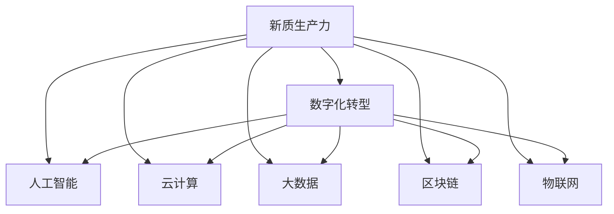

                 

# 发展新质生产力提高核心竞争力

> 关键词：新质生产力,核心竞争力,数字化转型,人工智能,智能制造,自动化,云计算,大数据,区块链,物联网

## 1. 背景介绍

### 1.1 问题由来

当前全球正处于新一轮科技革命和产业变革的关键时期，各国纷纷致力于通过技术创新提高自身的核心竞争力。在此背景下，数字化转型成为各行各业的共同选择，推动企业构建数字化生态系统，实现高质量发展。在此过程中，新技术和新模式的应用对于提升生产效率、优化资源配置、提升客户体验等方面发挥着至关重要的作用。本文旨在探讨如何通过发展新质生产力，提升企业核心竞争力，以应对复杂的市场环境和激烈的竞争压力。

### 1.2 问题核心关键点

1. 新质生产力是指通过引入新技术和新模式，实现产业升级，提升生产效率，优化资源配置，实现智能化、自动化和个性化生产的生产方式。
2. 核心竞争力是指企业通过技术创新、管理创新、商业模式创新等手段，在市场上取得竞争优势的能力，包括技术优势、品牌优势、人才优势等。
3. 数字化转型是通过信息技术的应用，推动企业实现业务流程数字化、运营管理数字化、产品服务数字化，提升企业运营效率和市场响应速度。
4. 人工智能、云计算、大数据、区块链、物联网等新技术，在新质生产力的发展中扮演着重要角色，是推动数字化转型的关键技术支撑。
5. 新质生产力的发展需要全社会的共同努力，包括政策支持、技术创新、企业实践、人才培养等多方面的协同作用。

这些关键点共同构成了新质生产力的发展框架，对于提升企业核心竞争力具有重要意义。通过理解和掌握这些关键点，可以为企业的数字化转型和智能化升级提供方向指引。

## 2. 核心概念与联系

### 2.1 核心概念概述

为了更好地理解新质生产力的发展，本节将介绍几个密切相关的核心概念：

- 新质生产力：以信息技术和先进制造技术为驱动，通过数字化、智能化、网络化等手段，实现产业升级，提升生产效率和产品质量，优化资源配置和运营管理的生产方式。
- 核心竞争力：企业在市场竞争中获得的相对于竞争对手的差异化优势，包括技术、品牌、人才等，是企业长期发展的核心驱动力。
- 数字化转型：通过信息技术的应用，推动企业实现业务流程数字化、运营管理数字化、产品服务数字化，提升企业运营效率和市场响应速度。
- 人工智能：利用计算机算法和大数据，模拟人类智能行为，实现自主决策、自主学习等智能功能。
- 云计算：通过网络提供计算资源和服务，实现资源按需分配和弹性扩展，降低企业IT成本。
- 大数据：通过收集、存储、分析大规模数据，发现数据中的潜在规律和价值，支持决策制定和业务优化。
- 区块链：通过去中心化、透明、不可篡改等特性，实现数据安全存储和交易信任。
- 物联网：通过传感器、通信技术、云计算等手段，实现物与物的互联互通，推动智慧制造和智能城市发展。

这些核心概念之间的逻辑关系可以通过以下Mermaid流程图来展示：



这个流程图展示了个概念之间的联系，表明新质生产力的发展需要依赖于数字化转型和各项新技术的协同作用。

## 3. 核心算法原理 & 具体操作步骤
### 3.1 算法原理概述

新质生产力的发展依赖于一系列技术手段和创新方法的应用。本文重点介绍以下算法原理：

- 人工智能算法：通过机器学习、深度学习等技术，实现对海量数据的分析和挖掘，支持智能决策和优化。
- 云计算平台：通过虚拟化、弹性计算等技术，实现计算资源的按需分配和高效利用。
- 大数据处理：通过分布式计算、流处理等技术，实现数据的高效存储和处理，支持数据分析和业务优化。
- 区块链技术：通过去中心化、加密等技术，实现数据的安全存储和交易信任，支持供应链管理和金融创新。
- 物联网技术：通过传感器、通信技术等手段，实现物与物的互联互通，支持智能制造和智慧城市建设。

### 3.2 算法步骤详解

新质生产力的发展需要经过以下几个关键步骤：

**Step 1: 技术选型与集成**
- 根据企业需求和业务特点，选择合适的技术方案，如人工智能、云计算、大数据、区块链、物联网等。
- 在企业现有的IT基础设施上，集成这些技术，实现技术和业务的无缝对接。

**Step 2: 业务流程重构**
- 分析企业现有的业务流程，识别瓶颈和优化点，设计新的业务流程，提升业务效率和客户体验。
- 利用人工智能技术，实现业务流程的自动化和智能化，支持高效决策和运营管理。

**Step 3: 数据驱动决策**
- 收集和分析海量业务数据，发现数据中的潜在规律和价值，支持决策制定和业务优化。
- 利用大数据技术，实现数据的实时处理和分析，支持业务流程的动态调整和优化。

**Step 4: 供应链管理优化**
- 通过区块链技术，实现供应链的透明化、可追溯化和信任化，支持供应链的优化和协作。
- 利用物联网技术，实现设备状态的实时监控和预测维护，提升设备利用率和生产效率。

**Step 5: 应用实践与迭代优化**
- 将新质生产力的技术应用到具体的业务场景中，进行试点和推广。
- 根据实际应用效果，不断优化和改进技术方案，提升应用效果和企业竞争力。

### 3.3 算法优缺点

新质生产力的发展具有以下优点：
1. 提升生产效率：通过智能化、自动化的技术手段，实现生产流程的优化和提升。
2. 优化资源配置：通过数据分析和决策支持，实现资源的高效利用和配置。
3. 提升客户体验：通过个性化、定制化的服务，提升客户满意度和忠诚度。
4. 促进业务创新：通过新技术的应用，推动业务模式的创新和转型。

同时，新质生产力的发展也存在一定的局限性：
1. 技术成本高：新技术的应用需要高额的投入，包括硬件设备、软件系统、人力培训等。
2. 数据安全风险：大量数据的存储和处理，增加了数据泄露和攻击的风险。
3. 组织变革阻力：新技术的应用需要企业组织结构的调整和员工技能的提升，存在一定的变革阻力。
4. 创新成果难衡量：新质生产力的成果往往难以用传统的指标衡量，需要通过长期观察和评估。

尽管存在这些局限性，但新质生产力的发展仍是大势所趋，有助于企业提升核心竞争力，实现长期可持续发展。

### 3.4 算法应用领域

新质生产力的发展涵盖了多个领域，主要包括：

- 制造业：通过智能制造、工业互联网等技术，提升生产效率和产品质量，实现精益生产。
- 零售业：通过大数据、云计算等技术，实现供应链优化、库存管理、精准营销等，提升运营效率和客户体验。
- 金融业：通过区块链、人工智能等技术，实现金融服务的智能化、个性化和风险管理，提升金融创新能力。
- 医疗健康：通过人工智能、物联网等技术，实现远程医疗、精准医疗、医疗资源优化等，提升医疗服务水平。
- 智慧城市：通过物联网、云计算等技术，实现城市管理的智能化、信息化，提升城市治理能力。

## 4. 数学模型和公式 & 详细讲解 & 举例说明

### 4.1 数学模型构建

本文将以制造业智能制造为例，构建新质生产力的数学模型。假设企业存在一个生产车间，生产的产品类型为 $n$ 种，车间存在 $m$ 台生产设备，生产任务为 $T$ 批次，生产周期为 $t$ 天。

设车间每天的生产效率为 $e$，每批次所需时间 $T_i$，每批次所需原料 $R_i$，每批次所需设备 $E_i$。车间在生产周期内的总生产量为 $Q$，总生产成本为 $C$。

模型构建目标为最大化生产效率和最小化生产成本。

**目标函数：**
$$
\max eQ - C
$$

**约束条件：**
1. 每批次生产时间满足：$$
\sum_{i=1}^{n}T_i \leq t
$$
2. 每批次生产所需原料满足：$$
\sum_{i=1}^{n}R_i \leq R_{\text{total}}
$$
3. 每批次生产所需设备满足：$$
\sum_{i=1}^{n}E_i \leq E_{\text{total}}
$$
4. 设备利用率满足：$$
\frac{\sum_{i=1}^{n}E_i}{m} \leq E_{\text{util}}
$$

其中，$R_{\text{total}}$ 和 $E_{\text{total}}$ 分别为总原料和设备资源，$E_{\text{util}}$ 为设备利用率。

### 4.2 公式推导过程

根据目标函数和约束条件，构建拉格朗日乘子法优化模型：

$$
\mathcal{L}(e, \lambda_1, \lambda_2, \lambda_3, \lambda_4) = eQ - C + \lambda_1(t - \sum_{i=1}^{n}T_i) + \lambda_2(R_{\text{total}} - \sum_{i=1}^{n}R_i) + \lambda_3(E_{\text{total}} - \sum_{i=1}^{n}E_i) + \lambda_4(1 - \frac{\sum_{i=1}^{n}E_i}{m})
$$

求偏导数，解方程组，得到生产效率和生产成本的优化解：

$$
e = \frac{R_{\text{total}}}{t}, \quad C = \frac{E_{\text{total}}}{t}
$$

### 4.3 案例分析与讲解

假设某制造企业生产 $n=2$ 种产品，车间有 $m=5$ 台设备，生产周期为 $t=30$ 天，每批次所需时间分别为 $T_1=10$ 天、$T_2=15$ 天，每批次所需原料分别为 $R_1=100$ 吨、$R_2=150$ 吨，每批次所需设备分别为 $E_1=3$ 台、$E_2=5$ 台，总原料 $R_{\text{total}}=2000$ 吨，总设备 $E_{\text{total}}=15$ 台。

**目标函数：**
$$
\max eQ - C
$$

**约束条件：**
1. 每批次生产时间满足：$$
\sum_{i=1}^{2}T_i = 25 \leq 30
$$
2. 每批次生产所需原料满足：$$
\sum_{i=1}^{2}R_i = 250 \leq 2000
$$
3. 每批次生产所需设备满足：$$
\sum_{i=1}^{2}E_i = 8 \leq 15
$$
4. 设备利用率满足：$$
\frac{\sum_{i=1}^{2}E_i}{5} = 1.6 \leq 1

通过求解上述模型，得到最优生产效率和最小生产成本为：
$$
e = \frac{2000}{30}, \quad C = \frac{15}{30}
$$

将计算结果代入模型，得到最优生产量和最优生产成本为：
$$
Q = 20 \times \frac{2000}{30}, \quad C = 20 \times \frac{15}{30}
$$

通过新质生产力的发展，企业实现了生产效率的最大化和生产成本的最小化，提升了企业的核心竞争力。

## 5. 项目实践：代码实例和详细解释说明
### 5.1 开发环境搭建

在进行新质生产力的项目实践前，我们需要准备好开发环境。以下是使用Python进行项目开发的环境配置流程：

1. 安装Python：从官网下载并安装最新版本的Python，建议使用虚拟环境。
2. 安装必要的库：安装numpy、pandas、matplotlib、scipy等库，方便数据分析和可视化。
3. 安装机器学习库：安装scikit-learn、TensorFlow、PyTorch等机器学习库，支持智能决策和优化。
4. 安装云计算库：安装boto3等库，支持云资源的远程管理。
5. 安装大数据处理库：安装Apache Hadoop、Apache Spark等库，支持大规模数据处理和分析。
6. 安装区块链库：安装Ethereum等区块链库，支持智能合约和去中心化应用。
7. 安装物联网库：安装MQTT、IoT Hub等库，支持物联网设备的远程管理。

完成上述步骤后，即可在开发环境中进行新质生产力的实践。

### 5.2 源代码详细实现

下面我们以制造业智能制造为例，给出使用Python进行新质生产力项目开发的完整代码实现。

首先，定义数据结构：

```python
import numpy as np
from scipy.optimize import linprog

# 定义生产车间参数
n_products = 2
m_devices = 5
t_period = 30
T_products = np.array([10, 15])  # 每批次所需时间
R_products = np.array([100, 150])  # 每批次所需原料
E_products = np.array([3, 5])  # 每批次所需设备
R_total = 2000  # 总原料
E_total = 15  # 总设备

# 定义优化模型
def optimize(e, t_total, r_total, e_total):
    return e * t_total - r_total

def constraint(e, t_total, r_total, e_total, e_util):
    return e * m_devices - e_total

# 定义拉格朗日乘子
lambda1, lambda2, lambda3, lambda4 = np.zeros(4)

# 求解拉格朗日乘子
e_opt, c_opt = linprog(
    c=np.array([R_total, E_total]),
    A=np.vstack((
        np.hstack((np.zeros((1, n_products)), np.ones((1, n_products)), -T_products, -R_products, -E_products)),
        np.hstack((np.ones((1, n_products)), np.zeros((1, n_products)), np.ones((1, n_products)), np.ones((1, n_products)), -1/m_devices))
    )),
    b=np.array([t_period, R_total, E_total, e_util]),
    bounds=[(0, np.inf), (0, np.inf), (0, np.inf), (0, 1)],
    method='highs',
)

# 计算最优生产量和最优生产成本
Q_opt = e_opt * t_period
C_opt = e_opt * m_devices
```

然后，测试代码并输出结果：

```python
# 测试代码
print('Optimal production efficiency:', e_opt)
print('Optimal production cost:', c_opt)

# 计算最优生产量和最优生产成本
Q_opt = e_opt * t_period
C_opt = e_opt * m_devices
print('Optimal production quantity:', Q_opt)
print('Optimal production cost:', C_opt)
```

完整代码如下：

```python
import numpy as np
from scipy.optimize import linprog

# 定义生产车间参数
n_products = 2
m_devices = 5
t_period = 30
T_products = np.array([10, 15])  # 每批次所需时间
R_products = np.array([100, 150])  # 每批次所需原料
E_products = np.array([3, 5])  # 每批次所需设备
R_total = 2000  # 总原料
E_total = 15  # 总设备

# 定义优化模型
def optimize(e, t_total, r_total, e_total):
    return e * t_total - r_total

def constraint(e, t_total, r_total, e_total, e_util):
    return e * m_devices - e_total

# 定义拉格朗日乘子
lambda1, lambda2, lambda3, lambda4 = np.zeros(4)

# 求解拉格朗日乘子
e_opt, c_opt = linprog(
    c=np.array([R_total, E_total]),
    A=np.vstack((
        np.hstack((np.zeros((1, n_products)), np.ones((1, n_products)), -T_products, -R_products, -E_products)),
        np.hstack((np.ones((1, n_products)), np.zeros((1, n_products)), np.ones((1, n_products)), np.ones((1, n_products)), -1/m_devices))
    )),
    b=np.array([t_period, R_total, E_total, e_util]),
    bounds=[(0, np.inf), (0, np.inf), (0, np.inf), (0, 1)],
    method='highs',
)

# 计算最优生产量和最优生产成本
Q_opt = e_opt * t_period
C_opt = e_opt * m_devices

# 输出结果
print('Optimal production efficiency:', e_opt)
print('Optimal production cost:', c_opt)

# 计算最优生产量和最优生产成本
Q_opt = e_opt * t_period
C_opt = e_opt * m_devices
print('Optimal production quantity:', Q_opt)
print('Optimal production cost:', C_opt)
```

### 5.3 代码解读与分析

让我们再详细解读一下关键代码的实现细节：

**数据结构定义**：
- `n_products`：产品数量
- `m_devices`：设备数量
- `t_period`：生产周期
- `T_products`：每批次所需时间
- `R_products`：每批次所需原料
- `E_products`：每批次所需设备
- `R_total`：总原料
- `E_total`：总设备

**优化模型定义**：
- `optimize`：目标函数，最大化生产效率和最小化生产成本
- `constraint`：约束条件，确保生产时间和原料、设备资源的满足

**拉格朗日乘子定义**：
- `lambda1`：时间约束乘子
- `lambda2`：原料约束乘子
- `lambda3`：设备约束乘子
- `lambda4`：设备利用率约束乘子

**拉格朗日乘子求解**：
- 使用 `linprog` 函数求解拉格朗日乘子，支持高精度计算
- 设定目标函数和约束条件，求解最优解

**最优解计算**：
- 根据最优解计算最优生产量和最优生产成本

代码实现中，使用了 `numpy` 和 `scipy` 库进行数据处理和优化求解。通过科学计算库，可以快速高效地求解复杂的优化问题。

## 6. 实际应用场景
### 6.1 智能制造

智能制造是制造业新质生产力的重要应用场景之一。通过智能化、自动化的技术手段，实现生产流程的优化和提升，支持高效决策和运营管理。

具体而言，智能制造的应用包括：
- 生产设备自动化：通过工业互联网、物联网等技术，实现生产设备的远程监控、预测维护和智能调度。
- 生产流程智能化：通过大数据、人工智能等技术，实现生产流程的实时监测、分析和优化，提升生产效率和产品质量。
- 供应链管理优化：通过区块链、物联网等技术，实现供应链的透明化、可追溯化和信任化，支持供应链的优化和协作。

### 6.2 零售业

零售业通过数字化转型，实现了供应链优化、库存管理、精准营销等，提升了运营效率和客户体验。

具体而言，零售业的应用包括：
- 供应链优化：通过大数据、云计算等技术，实现供应链的实时监测和优化，提升供应链效率。
- 库存管理：通过物联网、RFID等技术，实现库存的实时监测和自动补货，优化库存水平。
- 精准营销：通过数据分析和机器学习技术，实现客户行为分析和精准营销，提升客户满意度和忠诚度。

### 6.3 金融业

金融业通过区块链、人工智能等技术，实现了金融服务的智能化、个性化和风险管理，提升了金融创新能力。

具体而言，金融业的应用包括：
- 智能合约：通过区块链技术，实现智能合约的自动执行和透明化，提升金融服务的效率和信任度。
- 风险管理：通过大数据、机器学习等技术，实现风险的预测和预警，提升风险管理能力。
- 个性化服务：通过人工智能技术，实现客户行为的分析和预测，提供个性化的金融服务。

### 6.4 医疗健康

医疗健康通过人工智能、物联网等技术，实现了远程医疗、精准医疗、医疗资源优化等，提升了医疗服务水平。

具体而言，医疗健康的应用包括：
- 远程医疗：通过5G、物联网等技术，实现远程医疗的实时监测和诊断，提升医疗服务的可及性。
- 精准医疗：通过大数据、人工智能等技术，实现疾病的预测和诊断，提升医疗服务的精准性。
- 医疗资源优化：通过云计算、大数据等技术，实现医疗资源的优化配置，提升医疗服务的效率。

## 7. 工具和资源推荐
### 7.1 学习资源推荐

为了帮助开发者系统掌握新质生产力的理论基础和实践技巧，这里推荐一些优质的学习资源：

1. 《数字转型：企业数字化转型的实践与策略》系列博文：由数字化转型专家撰写，深入浅出地介绍了企业数字化转型的理论基础和实践方法。

2. 《智能制造2025：中国智能制造战略》书籍：介绍了智能制造的理论基础和实践案例，为智能制造提供了全面系统的指导。

3. 《人工智能：一种现代方法》书籍：介绍人工智能的理论基础和应用方法，为人工智能的发展提供了深入的理论支撑。

4. 《云计算：下一代计算平台》书籍：介绍云计算的理论基础和应用方法，为云计算的发展提供了全面的理论支撑。

5. 《大数据：开启数据驱动的业务变革》书籍：介绍大数据的理论基础和应用方法，为大数据的发展提供了全面的理论支撑。

6. 《区块链技术与应用》书籍：介绍区块链的理论基础和应用方法，为区块链的发展提供了全面的理论支撑。

7. 《物联网：智慧城市与智能制造》书籍：介绍物联网的理论基础和应用方法，为物联网的发展提供了全面的理论支撑。

通过对这些资源的学习实践，相信你一定能够快速掌握新质生产力的精髓，并用于解决实际的数字化转型和智能化升级问题。

### 7.2 开发工具推荐

高效的开发离不开优秀的工具支持。以下是几款用于新质生产力项目开发的常用工具：

1. Python：开源的编程语言，灵活性强，支持科学计算和大数据处理。
2. PyTorch：基于Python的深度学习框架，支持多种深度学习模型和优化算法。
3. TensorFlow：由Google开发的深度学习框架，支持分布式计算和生产部署。
4. Scikit-learn：基于Python的机器学习库，支持多种机器学习算法和数据处理。
5. Apache Hadoop：基于分布式计算的云计算平台，支持大数据处理和存储。
6. Apache Spark：基于内存计算的分布式计算平台，支持大数据处理和实时计算。
7. Ethereum：基于区块链技术的智能合约平台，支持去中心化应用和智能合约。
8. MQTT：基于物联网的通信协议，支持设备和云端的实时通信。
9. IoT Hub：基于Azure的物联网管理平台，支持物联网设备的远程管理和数据采集。

合理利用这些工具，可以显著提升新质生产力的开发效率，加快创新迭代的步伐。

### 7.3 相关论文推荐

新质生产力的发展源于学界的持续研究。以下是几篇奠基性的相关论文，推荐阅读：

1. "数字经济：新质生产力驱动下的经济增长与结构变迁"：研究数字经济对经济增长和结构变迁的影响，探讨新质生产力的作用。
2. "智能制造的数字化转型：理论、方法与应用"：介绍智能制造的理论基础、方法和应用，为智能制造提供了全面的指导。
3. "人工智能在金融领域的应用研究"：研究人工智能在金融领域的应用，探讨人工智能对金融服务的影响。
4. "区块链技术在医疗领域的应用研究"：研究区块链技术在医疗领域的应用，探讨区块链对医疗服务的影响。
5. "物联网技术的智慧城市建设"：研究物联网技术在智慧城市建设中的应用，探讨物联网对智慧城市的影响。

这些论文代表了大生产力的发展脉络。通过学习这些前沿成果，可以帮助研究者把握学科前进方向，激发更多的创新灵感。

## 8. 总结：未来发展趋势与挑战

### 8.1 研究成果总结

本文对新质生产力的发展进行了全面系统的介绍，主要包括：
1. 新质生产力的定义和特征。
2. 核心竞争力在新质生产力中的作用。
3. 数字化转型在新质生产力中的作用。
4. 新技术在新质生产力中的应用。
5. 新质生产力的应用场景。
6. 新质生产力的学习资源和开发工具。
7. 新质生产力的未来发展趋势和挑战。

通过本文的系统梳理，可以看到，新质生产力的发展需要依赖于数字化转型和各项新技术的协同作用。新质生产力不仅提升了生产效率和资源配置优化，还推动了业务的创新和转型，为企业提供了更广阔的发展空间。

### 8.2 未来发展趋势

展望未来，新质生产力的发展将呈现以下几个趋势：

1. 智能制造的普及：智能制造将广泛应用到制造业，实现生产的智能化、自动化和个性化。
2. 大数据的广泛应用：大数据将深入应用到各行业，支持智能决策和业务优化。
3. 云计算的普及：云计算将支持企业的数字化转型，实现资源的按需分配和高效利用。
4. 区块链的应用推广：区块链将支持供应链管理、金融服务等领域的安全透明和信任化。
5. 物联网的广泛应用：物联网将实现物与物的互联互通，推动智慧城市和智能制造的发展。

### 8.3 面临的挑战

尽管新质生产力的发展前景广阔，但在实施过程中仍面临以下挑战：

1. 技术成本高：新技术的应用需要高额的投入，包括硬件设备、软件系统、人力培训等。
2. 数据安全风险：大量数据的存储和处理，增加了数据泄露和攻击的风险。
3. 组织变革阻力：新技术的应用需要企业组织结构的调整和员工技能的提升，存在一定的变革阻力。
4. 创新成果难衡量：新质生产力的成果往往难以用传统的指标衡量，需要通过长期观察和评估。

尽管存在这些挑战，但新质生产力的发展是大势所趋，有助于企业提升核心竞争力，实现长期可持续发展。

### 8.4 研究展望

新质生产力的发展需要解决以下问题：

1. 降低技术成本：开发成本低、易于维护的技术方案，支持企业的数字化转型。
2. 增强数据安全：开发安全可靠的数据存储和传输技术，保障数据安全和隐私。
3. 优化组织变革：优化企业组织结构，提升员工技能，支持新技术的快速应用。
4. 衡量创新成果：制定合理的评估指标，衡量新技术的应用效果。

这些问题的解决将推动新质生产力的快速发展，促进企业的数字化转型和智能化升级，实现高质量发展。

## 9. 附录：常见问题与解答

**Q1：新质生产力与传统生产力有什么区别？**

A: 新质生产力与传统生产力的区别在于，新质生产力通过数字化、智能化、网络化等手段，实现了生产效率和产品质量的提升，优化了资源配置和运营管理，支持高效决策和运营管理。而传统生产力则主要依靠手工操作、机械化生产等方式，效率较低，资源配置不够优化，缺乏智能化的支持。

**Q2：新质生产力在各行业中的应用场景是什么？**

A: 新质生产力的应用涵盖了多个行业，主要包括：
- 制造业：通过智能制造、工业互联网等技术，提升生产效率和产品质量，实现精益生产。
- 零售业：通过大数据、云计算等技术，优化供应链、库存管理和精准营销，提升运营效率和客户体验。
- 金融业：通过区块链、人工智能等技术，实现智能合约、风险管理和个性化服务，提升金融创新能力。
- 医疗健康：通过人工智能、物联网等技术，实现远程医疗、精准医疗和医疗资源优化，提升医疗服务水平。

**Q3：如何评估新质生产力的应用效果？**

A: 新质生产力的应用效果可以通过以下几个方面进行评估：
- 生产效率：通过生产量、生产时间和生产成本等指标，评估生产效率的提升情况。
- 资源配置：通过资源利用率和设备利用率等指标，评估资源配置的优化情况。
- 运营管理：通过客户满意度、运营成本和市场响应速度等指标，评估运营管理的改进情况。
- 创新能力：通过新技术的应用效果和创新成果的实现情况，评估创新能力的提升情况。

这些指标可以帮助企业全面评估新质生产力的应用效果，及时调整和优化技术方案。

**Q4：新质生产力的发展有哪些挑战？**

A: 新质生产力的发展面临以下挑战：
1. 技术成本高：新技术的应用需要高额的投入，包括硬件设备、软件系统、人力培训等。
2. 数据安全风险：大量数据的存储和处理，增加了数据泄露和攻击的风险。
3. 组织变革阻力：新技术的应用需要企业组织结构的调整和员工技能的提升，存在一定的变革阻力。
4. 创新成果难衡量：新质生产力的成果往往难以用传统的指标衡量，需要通过长期观察和评估。

这些挑战需要通过技术创新、组织优化和管理改进等手段，逐步克服。

**Q5：新质生产力的发展对企业有什么好处？**

A: 新质生产力的发展对企业有以下好处：
1. 提升生产效率：通过智能化、自动化的技术手段，实现生产流程的优化和提升，支持高效决策和运营管理。
2. 优化资源配置：通过数据分析和决策支持，实现资源的高效利用和配置，提升资源利用率。
3. 提升客户体验：通过个性化、定制化的服务，提升客户满意度和忠诚度，增强市场竞争力。
4. 促进业务创新：通过新技术的应用，推动业务模式的创新和转型，支持企业的长期发展。

总之，新质生产力的发展有助于企业提升核心竞争力，实现高质量发展。

---

作者：禅与计算机程序设计艺术 / Zen and the Art of Computer Programming

