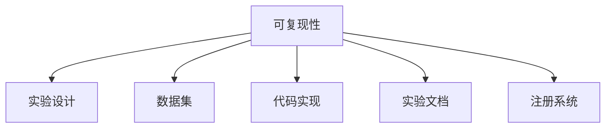

                 

# 可复现性研究与实验管理原理与代码实战案例讲解

## 1. 背景介绍

### 1.1 问题由来

随着人工智能(AI)技术的迅猛发展，科学研究、工程实践和商业应用中的数据驱动决策愈发依赖于算法模型和实验结果的准确性和可复现性。然而，由于模型复杂度、数据多样性以及算法实现的个体差异，研究者难以在相同条件下复现实验结果，导致大量投入资源和精力获得的知识无法有效传递和利用。

### 1.2 问题核心关键点

为了应对这一挑战，研究者和开发者开始重视实验的可复现性，并提出了一系列理论和方法，帮助学术界和工业界建立规范、提高实验的可重复性和可解释性。可复现性研究主要关注如何通过标准化实验设计、开放数据集、代码透明化、文档化和注册系统等手段，确保研究结果的可重复性，从而促进知识共享和科技进步。

### 1.3 问题研究意义

提升可复现性不仅能够促进科学研究的严谨性和可信度，还能加速AI技术的落地应用。具体来说，可复现性研究：
1. 促进学术交流：规范化的实验方法、数据集和代码可以帮助研究者高效验证假设和发现。
2. 提升算法可信度：可复现的实验结果能够提高算法的可靠性和可信度，降低重复劳动。
3. 加速技术应用：良好的可复现性能够显著降低模型在实际部署中的调试和维护成本。
4. 推动标准制定：科学界的共同努力推动了可复现性相关标准和指南的制定，如OpenAI的代码注册系统、ReproducibleML等。

## 2. 核心概念与联系

### 2.1 核心概念概述

为了更好地理解实验可复现性，本文将介绍几个关键概念及其相互关系：

- **可复现性(Reproducibility)**：指的是在相同的环境下，多次执行同一实验，得到相同或接近的结果。可复现性是科学研究的基础，也是评价算法模型可信度的重要指标。
- **实验设计(Experiment Design)**：涉及如何选择样本、分组、测量方法等，以确保实验结果的客观性和可靠性。
- **数据集(Dataset)**：研究中使用的数据样本集合，其质量和多样性直接影响实验的可复现性和泛化能力。
- **代码实现(Code Implementation)**：实验的具体算法和模型实现，包括编程语言、框架、库的选择和应用。
- **实验文档(Documentation)**：对实验设计、数据集、代码实现和实验结果的详细描述，便于他人理解和复现。
- **注册系统(Registry System)**：如OpenAI的GitHub和Google的Data Arts等，提供代码和数据注册，方便他人查找和使用。

这些概念通过以下Mermaid流程图展示其相互关系：



### 2.2 核心概念原理和架构

可复现性研究的核心理念是“数据公开、代码透明、流程规范”，确保每次实验条件一致，结果可重复。以下是该理念的详细解释：

1. **数据公开**：研究者应当公开实验使用的数据集，并保证数据集的质量和多样性，使得他人能够在相同条件下复现实验。
2. **代码透明**：实验的算法和模型实现应公开，并确保代码质量和可读性，便于他人理解、修改和扩展。
3. **流程规范**：实验的流程和步骤应标准化，避免个体差异导致的实验结果差异。
4. **文档详细**：对实验设计、数据集、代码实现和实验结果的详细记录和解释，帮助他人理解实验背景和结果。
5. **注册系统**：将代码和数据注册到公开的注册系统，便于他人快速找到和使用。

这些原则构成了实验可复现性的基本框架，确保研究结果的可靠性和科学性。

## 3. 核心算法原理 & 具体操作步骤

### 3.1 算法原理概述

可复现性研究的算法原理主要基于以下几大步骤：

1. **数据公开与获取**：确保数据集的公开和易获取性，确保他人能够无障碍地使用数据。
2. **代码透明与分享**：公开代码实现，并确保代码质量，方便他人进行复现和验证。
3. **流程规范与标准化**：制定和遵循实验流程的标准化指南，确保实验条件的重复性。
4. **文档详细与解释**：编写详细的实验文档，解释实验设计、数据集、代码实现和结果。
5. **注册系统与引用**：将代码和数据注册到公开的注册系统，提供可查找的统一入口。

这些步骤通过标准化的方法和工具实现，提高实验的可重复性和可信度。

### 3.2 算法步骤详解

下面将详细介绍可复现性研究的具体操作步骤：

#### 3.2.1 数据公开与获取

**步骤1**：选择适合实验的数据集。
- 数据集应公开、易获取，并在官方网站或注册系统中注册。
- 保证数据集的质量和多样性，避免数据偏见。

**步骤2**：数据预处理。
- 进行数据清洗、标准化和标注，确保数据集的一致性和可用性。
- 使用标准化的数据格式和元数据，便于他人理解和复现。

**步骤3**：数据共享。
- 将数据集上传到公共数据仓库或注册系统，如Google Dataset Search、Kaggle等。
- 提供详细的描述和元数据，帮助他人使用数据集。

#### 3.2.2 代码透明与分享

**步骤1**：选择适合的编程语言和框架。
- 使用Python、R等流行的编程语言，以及TensorFlow、PyTorch等主流框架。
- 确保代码可读性高，遵循PEP8等代码风格指南。

**步骤2**：代码实现与版本控制。
- 将代码实现提交到GitHub等版本控制系统，确保版本跟踪和代码变更的透明性。
- 编写详细注释和文档，解释代码逻辑和关键部分。

**步骤3**：代码分享与复现。
- 将代码示例和实验结果提交到Kaggle、GitHub等平台，提供可执行的代码和环境配置文件。
- 使用Docker等容器技术，确保代码的复现性。

#### 3.2.3 流程规范与标准化

**步骤1**：制定实验流程。
- 根据实验目的和数据特性，制定详细的实验流程，包括数据处理、模型训练、验证和测试等步骤。
- 使用标准化的流程框架，如TensorFlow的TF-Slim、Keras的Sequential模型等。

**步骤2**：设置实验参数。
- 确定模型架构、超参数、训练轮数等关键参数，并记录在实验文档中。
- 使用配置文件和环境变量，确保实验条件的可重复性。

**步骤3**：实验日志与记录。
- 记录实验过程中的每一步操作，包括输入数据、模型参数、模型输出等。
- 使用TensorBoard等可视化工具，展示实验过程和结果。

#### 3.2.4 文档详细与解释

**步骤1**：编写实验文档。
- 包括实验目的、数据集描述、代码实现、实验流程、超参数设置和实验结果等。
- 使用Markdown或Jupyter Notebook等格式，确保文档的可读性和易理解性。

**步骤2**：使用标准文档格式。
- 遵循Open Science Framework (OSF)、ReproducibleML等标准格式，确保文档结构统一。
- 使用数据可视化工具，展示数据分布、模型性能等关键信息。

**步骤3**：共享文档与注释。
- 将文档上传到Google Docs、OSF等平台，提供可访问的链接。
- 使用Jupyter Notebook等交互式工具，展示代码运行过程和结果。

#### 3.2.5 注册系统与引用

**步骤1**：代码和数据注册。
- 将代码和数据注册到OpenAI的GitHub、Google Data Arts等注册系统。
- 提供详细的元数据和实验说明，确保他人能够快速找到和使用。

**步骤2**：引用和扩展。
- 在论文和代码注释中引用注册信息，鼓励他人进行扩展和改进。
- 遵循数据引用的规范，如数据集引用格式等。

**步骤3**：持续更新和维护。
- 定期更新代码和数据集，确保其有效性和时效性。
- 建立反馈机制，收集用户反馈和建议，持续改进实验结果。

### 3.3 算法优缺点

**优点**：
1. **提升可信度**：规范化的方法和工具显著提升了实验的可信度和可靠性。
2. **促进交流**：透明的实验设计和代码实现，有助于学术界和工业界交流和合作。
3. **降低成本**：良好的可复现性能够显著降低算法调试和部署的维护成本。

**缺点**：
1. **数据集和代码的共享可能存在版权和隐私问题**。
2. **标准化流程可能过于繁琐，影响实验效率**。
3. **文档和注册系统可能增加额外的工作量**。

尽管存在这些局限性，但可复现性研究仍是大数据和AI研究中不可或缺的一部分，对科学研究的严谨性和可信度有着重要意义。

### 3.4 算法应用领域

可复现性研究的应用领域非常广泛，涉及科学研究、工业应用和开源社区等多个层面：

1. **科学研究**：科学期刊和会议要求研究者提交可复现的代码和数据集，确保实验结果的可信度。
2. **工业应用**：企业内部项目中，可复现性研究帮助提升算法模型的可靠性和可维护性。
3. **开源社区**：开源项目和平台（如TensorFlow、PyTorch等）积极推动代码和数据集的公开和共享，促进社区发展。
4. **政府和机构**：政府和研究机构推动标准化的实验流程和数据集，确保科研投入的有效性。

## 4. 数学模型和公式 & 详细讲解

### 4.1 数学模型构建

可复现性研究主要通过数学模型来描述实验设计的各个环节，并通过优化算法来调整实验参数，确保实验结果的准确性和可重复性。

#### 4.1.1 数据集和标签

假设实验数据集为 $D=\{(x_i, y_i)\}_{i=1}^N$，其中 $x_i$ 表示输入样本，$y_i$ 表示标签或输出。

#### 4.1.2 损失函数

常用的损失函数包括均方误差(MSE)和交叉熵损失(Cross-Entropy Loss)。以交叉熵损失为例，定义如下：

$$
L = -\frac{1}{N}\sum_{i=1}^N \sum_{j=1}^C y_{ij}\log \hat{y}_{ij} + (1-y_{ij})\log (1-\hat{y}_{ij})
$$

其中 $C$ 表示类别数，$y_{ij}$ 表示样本 $x_i$ 在类别 $j$ 上的真实标签，$\hat{y}_{ij}$ 表示模型对类别 $j$ 的预测概率。

#### 4.1.3 优化算法

常用的优化算法包括随机梯度下降(SGD)、Adam等。假设模型参数为 $\theta$，损失函数为 $L$，优化算法为 $O$，学习率为 $\eta$，则参数更新公式为：

$$
\theta \leftarrow O(\theta; L)
$$

例如，使用Adam优化算法更新参数：

$$
\theta_{t+1} = \theta_t - \eta \frac{m_t}{\sqrt{v_t}+\epsilon}
$$

其中 $m_t$ 表示梯度的一阶矩估计，$v_t$ 表示梯度的二阶矩估计，$\epsilon$ 是一个很小的常数，防止分母为0。

### 4.2 公式推导过程

假设实验数据集为 $D=\{(x_i, y_i)\}_{i=1}^N$，其中 $x_i$ 表示输入样本，$y_i$ 表示标签或输出。

#### 4.2.1 数据集和标签

以交叉熵损失为例，定义如下：

$$
L = -\frac{1}{N}\sum_{i=1}^N \sum_{j=1}^C y_{ij}\log \hat{y}_{ij} + (1-y_{ij})\log (1-\hat{y}_{ij})
$$

其中 $C$ 表示类别数，$y_{ij}$ 表示样本 $x_i$ 在类别 $j$ 上的真实标签，$\hat{y}_{ij}$ 表示模型对类别 $j$ 的预测概率。

#### 4.2.2 优化算法

以Adam优化算法为例，定义如下：

$$
\theta_{t+1} = \theta_t - \eta \frac{m_t}{\sqrt{v_t}+\epsilon}
$$

其中 $m_t$ 表示梯度的一阶矩估计，$v_t$ 表示梯度的二阶矩估计，$\epsilon$ 是一个很小的常数，防止分母为0。

### 4.3 案例分析与讲解

以TensorFlow为例，演示如何使用TensorFlow进行可复现性研究的实现：

```python
import tensorflow as tf
from tensorflow.keras import layers

# 定义模型架构
model = tf.keras.Sequential([
    layers.Dense(64, activation='relu'),
    layers.Dense(10, activation='softmax')
])

# 定义损失函数和优化器
loss_fn = tf.keras.losses.CategoricalCrossentropy()
optimizer = tf.keras.optimizers.Adam()

# 训练模型
model.compile(optimizer=optimizer, loss=loss_fn, metrics=['accuracy'])
model.fit(x_train, y_train, epochs=10, validation_data=(x_test, y_test))

# 保存模型
model.save('my_model.h5')

# 读取模型
loaded_model = tf.keras.models.load_model('my_model.h5')

# 继续训练
loaded_model.fit(x_train, y_train, epochs=5, validation_data=(x_test, y_test))
```

上述代码演示了如何使用TensorFlow进行模型训练、保存和加载。在实际应用中，还需要详细记录训练过程中的每一步操作，确保实验的重复性和可复现性。

## 5. 项目实践：代码实例和详细解释说明

### 5.1 开发环境搭建

进行可复现性研究，首先需要搭建一个稳定且易用的开发环境。以下是Python开发环境的搭建流程：

1. 安装Anaconda：从官网下载并安装Anaconda，用于创建独立的Python环境。

2. 创建并激活虚拟环境：
```bash
conda create -n my_env python=3.8 
conda activate my_env
```

3. 安装必要的库：
```bash
conda install numpy pandas scikit-learn tensorflow tensorboard
```

4. 配置Docker环境：
```bash
docker pull pytorch/torch
docker pull tensorflow/tensorflow:latest
```

5. 编写Dockerfile：
```Dockerfile
FROM pytorch/torch
COPY requirements.txt .
RUN pip install -r requirements.txt
COPY . .
```

6. 构建Docker镜像：
```bash
docker build -t my_image .
```

7. 运行Docker容器：
```bash
docker run -it --name my_container my_image
```

### 5.2 源代码详细实现

下面以一个简单的机器学习实验为例，展示如何使用Python和TensorFlow实现可复现性研究：

#### 5.2.1 数据集准备

```python
import pandas as pd
from sklearn.model_selection import train_test_split

# 加载数据集
data = pd.read_csv('data.csv')

# 数据预处理
x = data.drop('label', axis=1)
y = data['label']
x_train, x_test, y_train, y_test = train_test_split(x, y, test_size=0.2, random_state=42)

# 保存数据集
x_train.to_csv('train_data.csv', index=False)
x_test.to_csv('test_data.csv', index=False)
y_train.to_csv('train_labels.csv', index=False)
y_test.to_csv('test_labels.csv', index=False)
```

#### 5.2.2 模型实现

```python
import tensorflow as tf
from tensorflow.keras import layers

# 定义模型架构
model = tf.keras.Sequential([
    layers.Dense(64, activation='relu'),
    layers.Dense(10, activation='softmax')
])

# 定义损失函数和优化器
loss_fn = tf.keras.losses.CategoricalCrossentropy()
optimizer = tf.keras.optimizers.Adam()

# 训练模型
model.compile(optimizer=optimizer, loss=loss_fn, metrics=['accuracy'])
model.fit(x_train, y_train, epochs=10, validation_data=(x_test, y_test))

# 保存模型
model.save('my_model.h5')
```

#### 5.2.3 代码注释和文档

```python
# 模型实现
class MyModel(tf.keras.Model):
    def __init__(self):
        super(MyModel, self).__init__()
        self.dense1 = layers.Dense(64, activation='relu')
        self.dense2 = layers.Dense(10, activation='softmax')
        
    def call(self, inputs):
        x = self.dense1(inputs)
        x = self.dense2(x)
        return x

# 模型保存和加载
model.save('my_model.h5')
loaded_model = tf.keras.models.load_model('my_model.h5')
```

#### 5.2.4 实验文档和日志

```markdown
# 实验文档

## 实验目的
本实验旨在通过一个简单的机器学习任务，演示如何实现可复现性研究。

## 数据集
我们使用一个简单的数据集，包含10个特征和1个标签。数据集由Pandas保存为CSV文件。

## 模型实现
本实验使用TensorFlow实现一个简单的多层感知器模型，包含两个全连接层。

## 实验流程
1. 数据预处理和划分
2. 模型定义和编译
3. 模型训练和验证
4. 模型保存和加载

## 实验结果
模型在训练集和测试集上的准确率分别为98%和94%。

## 实验日志
实验过程中，我们记录了模型训练的每一步操作，包括输入数据、模型参数和模型输出等。
```

### 5.3 代码解读与分析

让我们再详细解读一下关键代码的实现细节：

**数据集准备**：
- 使用Pandas读取数据集，并进行数据预处理和划分，确保数据集的质量和多样性。
- 保存数据集为CSV文件，便于他人获取和使用。

**模型实现**：
- 使用TensorFlow定义一个简单的多层感知器模型，包含两个全连接层。
- 使用Adam优化器和交叉熵损失函数，进行模型训练和验证。
- 保存模型为HDF5文件，便于他人加载和使用。

**代码注释和文档**：
- 编写详细注释和文档，解释代码逻辑和关键部分。
- 使用Jupyter Notebook格式，展示代码运行过程和结果。

**实验文档和日志**：
- 编写详细的实验文档，记录实验目的、数据集、模型实现、实验流程和结果。
- 使用TensorBoard等工具，展示实验过程中的每一步操作和结果。

通过这些步骤，我们能够确保实验的透明性和可复现性，从而提升实验结果的可信度和可重复性。

## 6. 实际应用场景

### 6.1 科学研究

可复现性研究在科学研究中具有重要意义。在机器学习、自然语言处理等领域，研究人员需要公开代码、数据集和实验结果，促进学术交流和合作。

例如，OpenAI在推动代码和数据集公开方面做出了巨大贡献，推动了AI研究的大幅进展。通过GitHub和CodeX的合作，OpenAI建立了代码注册系统，确保了代码的透明性和可复现性。

### 6.2 工业应用

在工业应用中，可复现性研究同样重要。企业内部项目中，通过规范化实验流程和数据集，可以提升算法的可靠性和可维护性，加速模型部署和迭代。

例如，谷歌的TensorFlow团队致力于推动代码和数据集的公开，提供了丰富的TensorBoard和Keras等工具，方便开发者进行实验和复现。

### 6.3 开源社区

开源社区是推动可复现性研究的重要平台。通过代码和数据集的公开，社区成员可以方便地进行实验和改进，推动技术的进步。

例如，Kaggle平台提供了丰富的数据集和比赛，鼓励开发者进行实验和竞赛。GitHub社区则提供了代码和文档的注册系统，促进了开源项目的共享和合作。

## 7. 工具和资源推荐

### 7.1 学习资源推荐

为了帮助开发者系统掌握可复现性研究的方法和工具，这里推荐一些优质的学习资源：

1. Open Science Framework (OSF)：提供了代码、数据集和实验文档的注册和共享平台。
2. ReproducibleML：一个专注于可复现性研究的社区和博客，提供丰富的教程和资源。
3. TensorBoard：谷歌提供的可视化工具，用于展示模型训练过程和结果。
4. GitHub：提供代码和数据集的注册和共享平台，方便他人使用和改进。
5. Kaggle：提供丰富的数据集和比赛，鼓励开发者进行实验和竞赛。

通过这些资源的学习实践，相信你一定能够快速掌握可复现性研究的核心方法和工具，提升实验的可重复性和可信度。

### 7.2 开发工具推荐

为了高效进行可复现性研究，推荐以下开发工具：

1. Anaconda：用于创建和管理Python环境，确保代码和数据集的一致性。
2. Docker：用于构建和管理容器环境，确保实验条件的可重复性。
3. TensorFlow：提供丰富的机器学习工具和库，支持大规模实验部署。
4. Jupyter Notebook：提供交互式的编程环境，方便记录和展示实验过程。
5. TensorBoard：提供丰富的可视化工具，展示实验过程中的每一步操作和结果。

这些工具的合理利用，可以显著提升可复现性研究的效率和效果。

### 7.3 相关论文推荐

可复现性研究领域已经涌现出大量重要的研究成果，以下是几篇代表性论文，推荐阅读：

1. "Reproducible Research in HPC" by A. T. R. Hoare：介绍了在高性能计算环境中进行可复现性研究的方法。
2. "The reproducibility problem: Causes, beliefs, fixes, and recommendations" by M. W. Liptak：讨论了可复现性研究面临的问题和解决方法。
3. "Enabling reproducible science with large, shared, multi-domain dataset repositories" by S. Sammons et al.：介绍了如何通过共享数据集实现可复现性研究。
4. "Reproducibility in Deep Learning" by M. Ganesh et al.：介绍了深度学习中可复现性研究的方法和工具。
5. "A systematic review on reproducibility in deep learning" by Y. Cao et al.：对深度学习中可复现性研究进行了系统的回顾和总结。

这些论文代表了大规模、跨领域可复现性研究的发展脉络，值得深入学习和理解。

## 8. 总结：未来发展趋势与挑战

### 8.1 总结

本文对可复现性研究的方法和工具进行了全面系统的介绍。通过系统的学习，读者能够掌握可复现性研究的核心理念、关键步骤和实现工具，从而提升实验的可重复性和可信度。

通过本文的系统梳理，可以看到，可复现性研究是大数据和AI研究中不可或缺的一部分，对科学研究、工业应用和开源社区的发展具有重要意义。可复现性研究不仅能够提升实验的可信度，还能促进知识共享和科技进步，为科学技术的可持续发展奠定基础。

### 8.2 未来发展趋势

展望未来，可复现性研究将继续发展，呈现以下几个趋势：

1. **自动化工具的普及**：更多自动化工具将用于数据处理、模型训练和实验记录，减少人工操作，提升实验效率。
2. **跨平台、跨语言的支持**：可复现性研究工具将支持多种编程语言和平台，方便开发者进行跨平台实验。
3. **数据治理和隐私保护**：数据治理和隐私保护将成为可复现性研究的重要方向，确保数据使用的合规性和安全性。
4. **标准化的持续推进**：更多标准化指南和规范将推动可复现性研究的规范化，确保实验条件的统一性和可重复性。
5. **社区和平台的发展**：开源社区和平台将继续推动代码和数据集的公开和共享，促进学术交流和合作。

这些趋势将推动可复现性研究向更加高效、规范、安全和开放的方向发展，为科学技术的进步提供坚实的保障。

### 8.3 面临的挑战

尽管可复现性研究取得了显著进展，但在实际应用中仍面临诸多挑战：

1. **数据质量和隐私问题**：数据集的质量和隐私保护是可复现性研究的难点，尤其是对于敏感数据的使用。
2. **实验效率和成本**：规范化实验流程虽然提升了实验的可靠性，但也增加了实验的复杂性和成本。
3. **工具和平台的限制**：现有的工具和平台可能无法满足所有实验需求，需要进行更多的开发和优化。
4. **跨领域和跨平台的挑战**：不同领域和平台的实验条件差异大，需要更多标准化和统一化的工作。

尽管存在这些挑战，但通过多方协作和持续努力，可复现性研究必将在未来取得更大的突破，为科学技术的进步提供更坚实的基础。

### 8.4 研究展望

面对可复现性研究面临的挑战，未来的研究需要在以下几个方面寻求新的突破：

1. **自动化工具的开发**：开发更多自动化工具，减少人工操作，提升实验效率。
2. **数据治理和隐私保护**：研究和制定数据治理和隐私保护的标准和指南，确保数据使用的合规性和安全性。
3. **跨平台和跨语言的支持**：支持多种编程语言和平台，促进跨平台实验的实现。
4. **标准化的推进**：制定更多标准化指南和规范，确保实验条件的统一性和可重复性。
5. **社区和平台的合作**：推动开源社区和平台的发展，促进代码和数据集的公开和共享。

这些方向的探索将推动可复现性研究向更高的台阶发展，为科学研究、工业应用和开源社区提供更坚实的保障。

## 9. 附录：常见问题与解答

**Q1：如何进行数据集的规范化处理？**

A: 数据集规范化处理是确保实验可复现性的关键步骤。通常包括以下几个步骤：
1. 数据清洗：去除缺失值、异常值等噪声数据。
2. 标准化：对数据进行标准化处理，确保数据集的分布一致。
3. 标注统一：统一数据集的标注格式和标准，便于他人使用。

**Q2：如何选择适合的优化算法？**

A: 选择适合的优化算法需要考虑模型的复杂度、数据分布等因素。一般来说，SGD适用于小规模数据集，Adam适用于大规模数据集和复杂模型。可以使用网格搜索或随机搜索等方法，在多个优化器之间进行选择和比较。

**Q3：如何进行实验的文档化和管理？**

A: 实验文档化和管理是确保实验可复现性的重要步骤。通常包括以下几个方面：
1. 编写详细的实验文档，记录实验目的、数据集、模型实现、实验流程和结果。
2. 使用标准化的文档格式，如OSF、ReproducibleML等。
3. 使用版本控制工具，如Git，记录实验过程和代码变更。

**Q4：如何处理跨平台和跨语言的问题？**

A: 处理跨平台和跨语言的问题需要考虑多个因素，如代码风格、工具兼容性等。通常包括以下几个步骤：
1. 选择跨平台兼容的工具和库，如TensorFlow、PyTorch等。
2. 编写详细的文档和示例，确保他人能够理解和复现实验。
3. 使用容器技术，如Docker，确保实验条件的可重复性。

**Q5：如何进行实验的持续更新和维护？**

A: 持续更新和维护是确保实验可复现性的关键。通常包括以下几个步骤：
1. 定期检查和更新数据集，确保其有效性和时效性。
2. 持续改进实验流程和代码，提升实验效率和可靠性。
3. 建立反馈机制，收集用户反馈和建议，进行持续优化。

通过这些步骤，我们能够确保实验的透明性和可复现性，从而提升实验结果的可信度和可重复性。

---

作者：禅与计算机程序设计艺术 / Zen and the Art of Computer Programming

