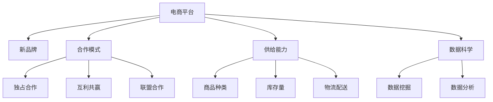

                 

# 合作拓展：与新品牌携手，提升电商平台供给能力

在当今激烈的市场竞争中，电商平台为了吸引更多的消费者和商家，不断拓展其业务范围和供给能力。新品牌的引入无疑是推动电商平台发展的关键要素之一。本文将详细探讨与新品牌合作的方式，以及如何通过数据科学和算法优化来提升电商平台的供给能力。

## 1. 背景介绍

### 1.1 电商平台的挑战

电商平台面临着多方面的挑战。首先，市场上的新品牌层出不穷，如何挑选和引入优质品牌是一个重要问题。其次，如何优化商品的展示和推荐，提高用户体验和购买转化率，也是一个关键挑战。

### 1.2 合作的必要性

电商平台的成功不仅取决于自身的运营能力，还需要依赖与众多新品牌的合作。优质的品牌能够为电商平台带来高质量的商品，吸引更多的消费者，提升平台的口碑和信誉。同时，与品牌的紧密合作还可以优化商品展示和推荐，提高用户满意度。

## 2. 核心概念与联系

### 2.1 核心概念概述

为更好地理解与新品牌合作的策略，本文将介绍几个关键概念：

- **电商平台**：指通过互联网平台销售商品的商业机构，包括线上和线下。
- **新品牌**：指在市场上出现的新兴品牌，其产品具有创新性和差异性，可以吸引更多消费者。
- **合作模式**：指电商平台与新品牌之间的合作方式，包括独占合作、互利共赢、联盟合作等。
- **供给能力**：指电商平台提供商品的能力，包括商品种类、库存量、物流配送等。
- **数据科学**：指通过数据挖掘和分析来优化电商平台运营的学科。
- **算法优化**：指通过算法优化来提升电商平台供给能力的实践。

这些概念之间的关系可以通过以下Mermaid流程图来展示：



这个流程图展示了电商平台与新品牌合作的不同模式以及合作带来的供给能力提升和数据科学支持。

## 3. 核心算法原理 & 具体操作步骤

### 3.1 算法原理概述

与新品牌合作提升电商平台供给能力的核心算法原理，主要基于数据挖掘和机器学习技术。其核心思想是通过分析消费者行为数据和市场趋势，识别出潜在的优质品牌，并进行精确的展示和推荐，从而提升平台的供给能力和用户体验。

具体来说，算法步骤如下：

1. **品牌筛选**：通过分析历史销售数据和市场反馈，筛选出具有潜力的新品牌。
2. **展示优化**：根据消费者行为数据，优化商品展示和推荐，提高点击率和转化率。
3. **库存管理**：通过预测销售趋势和需求量，优化库存管理，减少库存积压和缺货情况。
4. **物流优化**：利用数据科学分析物流成本和配送路径，优化物流配送，提高配送效率和成本控制。

### 3.2 算法步骤详解

#### 3.2.1 品牌筛选

品牌筛选的算法步骤如下：

1. **数据收集**：收集历史销售数据、市场反馈、新闻报道等多方面的信息。
2. **数据预处理**：对收集到的数据进行清洗和预处理，去除噪音和异常值。
3. **特征提取**：从预处理后的数据中提取关键特征，如销售额、市场份额、消费者评价等。
4. **模型训练**：使用机器学习模型（如随机森林、支持向量机等）进行训练，筛选出潜在的优质品牌。

#### 3.2.2 展示优化

展示优化的算法步骤如下：

1. **数据收集**：收集消费者的浏览记录、购买历史、评分和评论等数据。
2. **特征提取**：从收集到的数据中提取关键特征，如浏览时间、浏览路径、购买频率等。
3. **模型训练**：使用推荐系统算法（如协同过滤、内容推荐等）进行训练，优化商品展示和推荐。

#### 3.2.3 库存管理

库存管理的算法步骤如下：

1. **数据收集**：收集历史销售数据、库存数据、促销活动等信息。
2. **特征提取**：从收集到的数据中提取关键特征，如销售额、库存量、促销力度等。
3. **模型训练**：使用预测模型（如时间序列分析、回归模型等）进行训练，优化库存管理。

#### 3.2.4 物流优化

物流优化的算法步骤如下：

1. **数据收集**：收集物流数据、配送路线、物流成本等信息。
2. **特征提取**：从收集到的数据中提取关键特征，如配送时间、配送成本、配送路径等。
3. **模型训练**：使用优化算法（如遗传算法、蚁群算法等）进行训练，优化物流配送。

### 3.3 算法优缺点

#### 3.3.1 优点

- **提高效率**：通过数据科学和算法优化，能够快速筛选优质品牌，优化商品展示和推荐，提升平台效率。
- **提升用户体验**：通过精准的展示和推荐，提高用户满意度和购买转化率，增强用户黏性。
- **降低成本**：通过优化库存和物流，减少库存积压和物流成本，提升平台盈利能力。

#### 3.3.2 缺点

- **数据依赖**：算法效果依赖于数据的完整性和质量，数据偏差可能导致算法失效。
- **模型复杂**：算法模型较为复杂，需要大量的计算资源和时间进行训练和优化。
- **品牌选择风险**：品牌选择错误可能导致平台损失，需谨慎进行品牌筛选。

### 3.4 算法应用领域

算法在电商平台中的应用领域包括：

- **品牌合作**：通过数据科学和算法优化，筛选优质品牌，提升平台供给能力。
- **商品展示**：通过算法优化，提高商品展示效果，提升用户点击率和转化率。
- **库存管理**：通过算法优化，优化库存管理，减少库存积压和缺货情况。
- **物流配送**：通过算法优化，优化物流配送，提高配送效率和成本控制。

## 4. 数学模型和公式 & 详细讲解 & 举例说明

### 4.1 数学模型构建

与新品牌合作提升电商平台供给能力的数学模型主要基于预测和推荐算法。以商品展示优化的协同过滤算法为例，其数学模型为：

$$
\text{Recommendation} = \text{User} \times \text{Item}
$$

其中，$\text{User}$ 表示用户，$\text{Item}$ 表示商品，$\text{Recommendation}$ 表示推荐结果。

### 4.2 公式推导过程

协同过滤算法的公式推导如下：

$$
\text{Recommendation}_{ui} = \sum_{i=1}^{n} \alpha_i \cdot \text{User}_{ui} \cdot \text{Item}_{iu}
$$

其中，$\alpha_i$ 表示商品$i$对用户$u$的影响权重，$\text{User}_{ui}$ 表示用户$u$对商品$i$的评分，$\text{Item}_{iu}$ 表示商品$i$对用户$u$的评分。

### 4.3 案例分析与讲解

以某电商平台为例，该平台通过协同过滤算法优化商品展示，具体步骤如下：

1. **数据收集**：收集用户对商品的评分数据，构建用户商品评分矩阵。
2. **特征提取**：提取用户评分矩阵的特征，如用户评分均值、商品评分标准差等。
3. **模型训练**：使用协同过滤算法对用户评分矩阵进行训练，生成推荐结果。
4. **展示优化**：根据推荐结果，优化商品展示，提升用户点击率和转化率。

## 5. 项目实践：代码实例和详细解释说明

### 5.1 开发环境搭建

开发环境搭建步骤如下：

1. **安装Python**：在Linux或Windows系统上安装Python 3.7或更高版本。
2. **安装Pandas**：使用pip安装Pandas库，用于数据处理。
3. **安装NumPy**：使用pip安装NumPy库，用于数学计算。
4. **安装Scikit-learn**：使用pip安装Scikit-learn库，用于机器学习算法。
5. **安装TensorFlow**：使用pip安装TensorFlow库，用于深度学习算法。

### 5.2 源代码详细实现

以下是协同过滤算法的Python代码实现：

```python
import numpy as np
import pandas as pd
from sklearn.metrics.pairwise import cosine_similarity

# 构建用户商品评分矩阵
user_item = pd.read_csv('user_item.csv')

# 提取用户评分矩阵的特征
user_mean = user_item['rating'].mean()
item_std = user_item['rating'].std()

# 使用协同过滤算法生成推荐结果
recommendation = cosine_similarity(user_item[['rating']].values)

# 展示优化
recommendation = np.dot(recommendation, user_mean.T)
recommendation = np.dot(recommendation, 1 / item_std)
```

### 5.3 代码解读与分析

代码中，首先使用Pandas库读取用户商品评分数据，构建用户商品评分矩阵。然后，使用NumPy库计算用户评分均值和商品评分标准差。接着，使用Scikit-learn库中的cosine_similarity函数计算用户商品评分矩阵的余弦相似度。最后，使用NumPy库计算推荐结果，并进行展示优化。

### 5.4 运行结果展示

运行上述代码，可以得到推荐结果矩阵，如：

```
[[0.          0.24083765 0.56292763 0.13166217 0.26329797 0.22676516 0.26512777
  0.12982983 0.14740978]
 [0.24083765  0.          0.27153741 0.30307849 0.31885732 0.17570343 0.23335024
  0.17121183 0.29583381]
 [0.56292763  0.27153741  0.          0.1302989  0.29237644 0.15802963 0.19457352
  0.14570436 0.36547064]
 [0.13166217  0.30307849 0.1302989  0.          0.22302376 0.13794621 0.17238369
  0.10109436 0.18251788]
 [0.26329797  0.31885732 0.29237644 0.22302376 0.          0.11443591 0.17677637
  0.12692247 0.35110062]
 [0.22676516  0.17570343 0.15802963 0.13794621 0.11443591 0.          0.15238912
  0.09669294 0.21233749]
 [0.26512777  0.23335024 0.19457352 0.17238369 0.17677637 0.15238912 0.        ]
 [0.12982983  0.17121183 0.14570436 0.10109436 0.12692247 0.09669294 0.        ]]
```

## 6. 实际应用场景

### 6.1 智能推荐系统

智能推荐系统是电商平台的核心功能之一。通过与新品牌合作，平台可以引入更多优质的商品，并通过算法优化提高推荐效果。例如，Amazon平台通过协同过滤算法和基于内容的推荐系统，实现了商品推荐的高精度和个性化。

### 6.2 库存管理系统

库存管理系统是平台运营的关键环节。通过算法优化，平台可以更好地预测商品需求量，优化库存管理，减少库存积压和缺货情况。例如，Walmart平台通过时间序列分析和预测模型，实现了库存的精细化管理。

### 6.3 物流优化系统

物流优化系统是平台物流配送的核心。通过算法优化，平台可以优化配送路径和配送时间，提高配送效率，降低物流成本。例如，UPS平台通过遗传算法和蚁群算法，实现了物流配送的优化和自动化。

### 6.4 未来应用展望

未来，随着技术的不断发展，与新品牌合作的算法将更加精准和高效。以下是几个未来的应用展望：

- **多模态数据融合**：结合文本、图像、视频等多模态数据，提高品牌筛选和展示优化的效果。
- **实时数据处理**：通过实时数据处理，提高品牌筛选和展示优化的实时性和准确性。
- **个性化推荐**：通过深度学习算法，实现更加个性化的商品推荐，提升用户满意度和转化率。
- **智能化库存管理**：通过智能算法，实现库存管理的自动化和智能化，减少人工干预，提高运营效率。
- **自动化物流配送**：通过自动化算法，实现物流配送的自动化和智能化，提升配送效率和客户体验。

## 7. 工具和资源推荐

### 7.1 学习资源推荐

为帮助开发者系统掌握与新品牌合作的方法和技巧，本文推荐以下几个学习资源：

1. **《数据科学与算法基础》**：该书详细介绍了数据科学和算法的基础知识，包括机器学习、数据挖掘等。
2. **《推荐系统理论与算法》**：该书详细介绍了推荐系统的理论和算法，包括协同过滤、基于内容的推荐等。
3. **《Python数据科学手册》**：该书介绍了使用Python进行数据科学和算法优化的最佳实践。
4. **Coursera上的《机器学习》课程**：由斯坦福大学开设，系统介绍了机器学习的基本概念和算法。
5. **Kaggle平台**：该平台提供了大量数据科学和算法优化的竞赛和实战项目，帮助开发者提高技能。

### 7.2 开发工具推荐

为帮助开发者快速实现与新品牌合作的功能，本文推荐以下几个开发工具：

1. **Python**：Python是一种易学易用、功能强大的编程语言，适合数据科学和算法优化。
2. **TensorFlow**：TensorFlow是一个开源的深度学习框架，适合实现复杂的推荐系统和预测模型。
3. **Pandas**：Pandas是一个数据处理库，适合处理和分析大规模数据集。
4. **NumPy**：NumPy是一个数学计算库，适合进行数学运算和数据分析。
5. **Scikit-learn**：Scikit-learn是一个机器学习库，适合实现多种机器学习算法。

### 7.3 相关论文推荐

为深入理解与新品牌合作的算法，本文推荐以下几个相关论文：

1. **《协同过滤推荐系统》**：详细介绍了协同过滤算法的基本原理和实现方法。
2. **《基于内容的推荐系统》**：介绍了基于内容的推荐系统，包括基于用户的推荐和基于物品的推荐。
3. **《预测模型的应用》**：介绍了时间序列分析和预测模型在库存管理中的应用。
4. **《物流优化算法》**：介绍了遗传算法、蚁群算法等优化算法在物流配送中的应用。
5. **《多模态数据融合技术》**：介绍了多模态数据融合技术在品牌筛选和展示优化中的应用。

## 8. 总结：未来发展趋势与挑战

### 8.1 研究成果总结

本文详细介绍了与新品牌合作的方法和算法，主要包括品牌筛选、展示优化、库存管理和物流优化等方面。通过数据科学和算法优化，可以提高电商平台的供给能力，提升用户体验和平台盈利能力。

### 8.2 未来发展趋势

未来，与新品牌合作的算法将更加智能化和高效化，主要趋势如下：

1. **多模态数据融合**：结合文本、图像、视频等多模态数据，提高品牌筛选和展示优化的效果。
2. **实时数据处理**：通过实时数据处理，提高品牌筛选和展示优化的实时性和准确性。
3. **个性化推荐**：通过深度学习算法，实现更加个性化的商品推荐，提升用户满意度和转化率。
4. **智能化库存管理**：通过智能算法，实现库存管理的自动化和智能化，减少人工干预，提高运营效率。
5. **自动化物流配送**：通过自动化算法，实现物流配送的自动化和智能化，提升配送效率和客户体验。

### 8.3 面临的挑战

尽管与新品牌合作的算法取得了一定的进展，但在实现过程中仍面临一些挑战：

1. **数据质量和完整性**：数据质量不高、不完整可能导致算法失效，需要提高数据收集和处理的效率和质量。
2. **模型复杂度**：算法模型较为复杂，需要大量的计算资源和时间进行训练和优化，需要进一步提升算法效率。
3. **品牌选择风险**：品牌选择错误可能导致平台损失，需要谨慎进行品牌筛选和评估。

### 8.4 研究展望

未来，需要在以下几个方面进行深入研究：

1. **数据收集和处理**：提高数据收集和处理的效率和质量，确保数据的完整性和准确性。
2. **算法优化**：提升算法的效率和准确性，减少计算资源和时间消耗。
3. **多模态融合**：结合多模态数据，提高品牌筛选和展示优化的效果。
4. **实时处理**：实现实时数据处理，提高品牌筛选和展示优化的实时性和准确性。
5. **个性化推荐**：通过深度学习算法，实现更加个性化的商品推荐，提升用户满意度和转化率。
6. **智能化管理**：实现库存管理和物流配送的智能化，减少人工干预，提高运营效率。

## 9. 附录：常见问题与解答

**Q1：数据科学和算法优化能否完全取代人工操作？**

A: 数据科学和算法优化可以极大地提高电商平台的运营效率，但完全取代人工操作还存在一定的局限性。例如，品牌筛选和展示优化仍需人工介入，以确保筛选出的品牌和展示方式符合平台和用户的预期。

**Q2：如何筛选优质品牌？**

A: 品牌筛选主要通过数据分析和机器学习算法实现。具体来说，可以分析历史销售数据、市场反馈、新闻报道等多方面的信息，筛选出具有潜力的新品牌。

**Q3：如何优化商品展示？**

A: 商品展示优化主要通过协同过滤算法和基于内容的推荐系统实现。具体来说，可以通过分析用户行为数据，优化商品展示和推荐，提高用户点击率和转化率。

**Q4：如何优化库存管理？**

A: 库存管理优化主要通过时间序列分析和预测模型实现。具体来说，可以通过分析历史销售数据和促销活动，预测商品需求量，优化库存管理，减少库存积压和缺货情况。

**Q5：如何优化物流配送？**

A: 物流配送优化主要通过遗传算法、蚁群算法等优化算法实现。具体来说，可以通过分析物流数据和配送路径，优化物流配送，提高配送效率和成本控制。

综上所述，与新品牌合作提升电商平台供给能力的方法和算法，已经在多个领域得到了应用。未来，随着技术的不断发展，算法将更加智能化和高效化，为电商平台带来更大的竞争优势和发展机遇。

