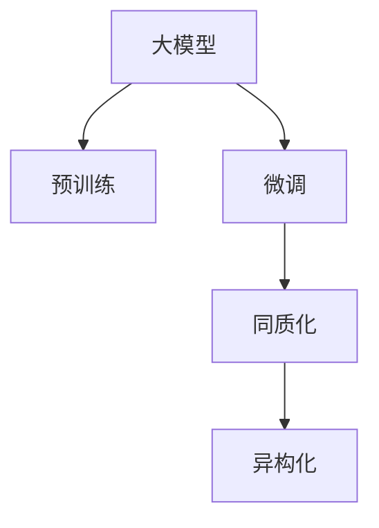

                 

# 国内大模型市场：贾扬清的观点，同质化发展的挑战与机会

## 1. 背景介绍

随着人工智能技术的迅猛发展，大模型（Large Models）已成为驱动人工智能应用的引擎。特别是在自然语言处理（NLP）领域，大模型以其在预训练和微调（Fine-tuning）上的优异性能，带来了革命性的变革。然而，在国内大模型市场，虽然多家厂商纷纷入局，但在技术路线、市场竞争和应用前景等方面，出现了不同程度的“同质化”现象。本文将从国内大模型市场的发展现状、核心概念及其实际应用出发，深度探讨同质化发展的挑战与机会，希望能为国内大模型市场的长远发展提供一些有益的思考。

## 2. 核心概念与联系

### 2.1 核心概念概述

为更好地理解国内大模型市场的发展现状，本节将介绍几个核心概念：

- **大模型（Large Models）**：以深度学习模型为代表，通过在海量数据上进行大规模预训练，学习到的通用语言表示，具备强大的自然语言理解和生成能力。
- **预训练（Pre-training）**：指在大规模无标注数据上，通过自监督学习任务训练模型，学习通用语言表示的过程。
- **微调（Fine-tuning）**：指在预训练模型的基础上，通过有监督学习优化模型在特定任务上的性能。
- **同质化（Homogenization）**：指在特定领域内，多个厂商的大模型产品，在技术路线、应用场景和市场策略上呈现高度相似的现象。
- **异构化（Heterogenization）**：指在大模型发展中，通过差异化的技术创新和应用定位，形成竞争优势，避免同质化竞争。

这些核心概念之间的逻辑关系可以通过以下Mermaid流程图来展示：



这个流程图展示了大模型发展的核心概念及其之间的关系：

1. 大模型通过预训练获得基础能力。
2. 微调使大模型更好地适应特定任务。
3. 同质化现象可能削弱市场竞争力。
4. 异构化促进技术差异化和市场多元化。

这些概念共同构成了大模型发展的基本框架，帮助理解国内大模型市场的现状及未来方向。

## 3. 核心算法原理 & 具体操作步骤
### 3.1 算法原理概述

国内大模型市场中的同质化现象，主要体现在以下几个方面：

1. **技术路线趋同**：众多厂商在大模型的预训练和微调方法上，都采用了类似的技术路线。例如，基于Transformer结构的预训练模型，加上基于Transformer的微调方法，成为主流技术路线。
2. **应用场景相似**：许多厂商在市场推广中，都聚焦于传统的NLP任务，如文本分类、命名实体识别、情感分析等，缺乏对新兴领域的探索。
3. **市场策略雷同**：大多数厂商在销售策略上，采用了以价格竞争为主的市场策略，缺乏差异化的市场定位。

这些同质化现象的背后，是整个市场在技术创新和市场策略上缺乏差异化，导致竞争激烈，资源分散。要打破同质化困境，需要从技术创新和市场策略两个方面入手，推动异构化发展。

### 3.2 算法步骤详解

要实现异构化发展，需要在以下步骤中进行深入探索：

**Step 1: 深化技术创新**
- **算法优化**：针对特定的应用场景，优化模型的预训练和微调算法，提升模型性能。
- **模型压缩**：通过模型压缩技术，减少模型参数，提高模型效率。
- **模型融合**：将不同模型的优势进行融合，构建更强大的复合模型。

**Step 2: 探索新应用领域**
- **垂直领域**：深入垂直领域，如医疗、金融、教育等，挖掘新应用场景，推动大模型在这些领域的应用。
- **跨模态融合**：结合视觉、听觉等多模态信息，推动跨模态大模型的研究和发展。

**Step 3: 创新市场策略**
- **差异化定位**：根据自身技术优势和资源条件，进行差异化定位，避免价格战。
- **生态建设**：构建完善的生态系统，包括模型、工具、应用和服务，提供全面的解决方案。
- **合作共赢**：与其他厂商和机构进行合作，共同推动大模型技术的发展和应用。

### 3.3 算法优缺点

同质化发展具有以下优点：
1. 降低市场门槛：类似的技术路线和应用场景，使得市场进入门槛降低，更多企业可以参与竞争。
2. 快速扩展市场：相同的产品和市场策略，可以快速覆盖市场，提高市场渗透率。
3. 增加行业知识：在相同的应用场景下，各厂商可以相互借鉴，促进行业知识的积累。

但同质化发展也存在以下缺点：
1. 资源浪费：大量厂商在相同的技术路线和应用场景上投入资源，导致资源浪费。
2. 市场同质化竞争：过度竞争导致产品同质化，难以形成真正的差异化优势。
3. 创新乏力：市场缺乏创新动力，可能导致技术停滞不前。

### 3.4 算法应用领域

国内大模型市场的应用领域非常广泛，主要包括：

1. **智能客服**：利用大模型进行智能对话，提升客户服务体验。
2. **自然语言处理**：如文本分类、命名实体识别、情感分析等。
3. **自动摘要和翻译**：通过大模型进行文本的自动摘要和翻译，提高信息处理效率。
4. **医疗健康**：利用大模型进行病历分析、疾病预测等。
5. **金融风控**：利用大模型进行金融舆情监测、风险评估等。
6. **教育领域**：利用大模型进行教育资源推荐、个性化学习等。

这些应用领域展示了国内大模型市场的多样性和潜力，但不同领域的应用现状和技术成熟度存在较大差异。未来需要进一步探索和优化，以推动大模型在更多领域的应用。

## 4. 数学模型和公式 & 详细讲解 & 举例说明

### 4.1 数学模型构建

为了更好地理解国内大模型市场的发展现状，本节将介绍大模型的数学模型构建方法。

假设大模型为 $M_{\theta}$，其中 $\theta$ 为模型的参数。在预训练阶段，使用无标注数据 $D_{pre}$ 进行自监督学习，构建预训练损失函数 $\mathcal{L}_{pre}$：

$$
\mathcal{L}_{pre} = \frac{1}{N_{pre}} \sum_{i=1}^{N_{pre}} \ell_{pre}(M_{\theta}(x_i))
$$

其中 $N_{pre}$ 为预训练数据集的大小，$\ell_{pre}$ 为预训练任务对应的损失函数。

在微调阶段，使用标注数据 $D_{fin}$ 进行有监督学习，构建微调损失函数 $\mathcal{L}_{fin}$：

$$
\mathcal{L}_{fin} = \frac{1}{N_{fin}} \sum_{i=1}^{N_{fin}} \ell_{fin}(M_{\theta}(x_i), y_i)
$$

其中 $N_{fin}$ 为微调数据集的大小，$\ell_{fin}$ 为微调任务对应的损失函数。

通过最小化预训练和微调损失函数的总和，可以得到大模型的整体损失函数 $\mathcal{L}$：

$$
\mathcal{L} = \mathcal{L}_{pre} + \mathcal{L}_{fin}
$$

### 4.2 公式推导过程

以情感分析任务为例，推导大模型的微调公式。假设输入为文本 $x$，输出为情感标签 $y$。模型的输出为 $M_{\theta}(x) = [\hat{y}_1, \hat{y}_2, \ldots, \hat{y}_N]$，其中 $N$ 为词汇表大小。模型的预测概率为：

$$
\hat{y}_i = \sigma(W_{fin} \cdot \tanh(V_{fin} \cdot M_{\theta}(x)) + b_{fin})
$$

其中 $W_{fin}$ 和 $b_{fin}$ 为微调任务对应的线性层和偏置项，$\sigma$ 为sigmoid激活函数，$\tanh$ 为tanh激活函数。

模型的损失函数为：

$$
\mathcal{L}(M_{\theta}, y) = -\sum_{i=1}^{N} y_i \log \hat{y}_i + (1-y_i) \log (1-\hat{y}_i)
$$

在微调过程中，通过反向传播更新模型参数 $\theta$：

$$
\theta \leftarrow \theta - \eta \nabla_{\theta} \mathcal{L}(M_{\theta}, y)
$$

其中 $\eta$ 为学习率，$\nabla_{\theta} \mathcal{L}(M_{\theta}, y)$ 为损失函数对参数 $\theta$ 的梯度。

### 4.3 案例分析与讲解

以下以医疗领域为例，分析大模型在微调过程中的应用和挑战。

假设医疗领域的微调任务为疾病预测，输入为患者的病历记录 $x$，输出为疾病标签 $y$。模型的输出为 $M_{\theta}(x) = [\hat{y}_1, \hat{y}_2, \ldots, \hat{y}_N]$，其中 $N$ 为疾病种类。模型的预测概率为：

$$
\hat{y}_i = \sigma(W_{fin} \cdot \tanh(V_{fin} \cdot M_{\theta}(x)) + b_{fin})
$$

模型的损失函数为：

$$
\mathcal{L}(M_{\theta}, y) = -\sum_{i=1}^{N} y_i \log \hat{y}_i + (1-y_i) \log (1-\hat{y}_i)
$$

在微调过程中，需要考虑以下几个问题：

1. **数据标注**：医疗领域的标注成本较高，需要专业医生对病历进行标注。如何高效获取高质量标注数据是一个挑战。
2. **数据隐私**：病历数据涉及隐私保护，如何在保护隐私的前提下进行微调是一个重要问题。
3. **模型解释性**：医疗领域对模型的解释性要求较高，如何解释模型的预测结果是一个关键问题。
4. **跨模态融合**：结合病历记录和患者影像等数据，进行跨模态微调是一个未来方向。

## 5. 项目实践：代码实例和详细解释说明
### 5.1 开发环境搭建

在进行大模型微调实践前，需要先搭建开发环境。以下是使用Python进行PyTorch开发的环境配置流程：

1. 安装Anaconda：从官网下载并安装Anaconda，用于创建独立的Python环境。

2. 创建并激活虚拟环境：
```bash
conda create -n pytorch-env python=3.8 
conda activate pytorch-env
```

3. 安装PyTorch：根据CUDA版本，从官网获取对应的安装命令。例如：
```bash
conda install pytorch torchvision torchaudio cudatoolkit=11.1 -c pytorch -c conda-forge
```

4. 安装Transformers库：
```bash
pip install transformers
```

5. 安装各类工具包：
```bash
pip install numpy pandas scikit-learn matplotlib tqdm jupyter notebook ipython
```

完成上述步骤后，即可在`pytorch-env`环境中开始微调实践。

### 5.2 源代码详细实现

下面以医疗领域中的疾病预测任务为例，给出使用Transformers库对BERT模型进行微调的PyTorch代码实现。

首先，定义疾病预测任务的数据处理函数：

```python
from transformers import BertTokenizer
from torch.utils.data import Dataset
import torch

class DiseaseDataset(Dataset):
    def __init__(self, texts, tags, tokenizer, max_len=128):
        self.texts = texts
        self.tags = tags
        self.tokenizer = tokenizer
        self.max_len = max_len
        
    def __len__(self):
        return len(self.texts)
    
    def __getitem__(self, item):
        text = self.texts[item]
        tags = self.tags[item]
        
        encoding = self.tokenizer(text, return_tensors='pt', max_length=self.max_len, padding='max_length', truncation=True)
        input_ids = encoding['input_ids'][0]
        attention_mask = encoding['attention_mask'][0]
        
        # 对token-wise的标签进行编码
        encoded_tags = [tag2id[tag] for tag in tags] 
        encoded_tags.extend([tag2id['O']] * (self.max_len - len(encoded_tags)))
        labels = torch.tensor(encoded_tags, dtype=torch.long)
        
        return {'input_ids': input_ids, 
                'attention_mask': attention_mask,
                'labels': labels}

# 标签与id的映射
tag2id = {'O': 0, 'B-DISEASE': 1, 'I-DISEASE': 2, 'B-NORMAL': 3, 'I-NORMAL': 4}
id2tag = {v: k for k, v in tag2id.items()}

# 创建dataset
tokenizer = BertTokenizer.from_pretrained('bert-base-cased')

train_dataset = DiseaseDataset(train_texts, train_tags, tokenizer)
dev_dataset = DiseaseDataset(dev_texts, dev_tags, tokenizer)
test_dataset = DiseaseDataset(test_texts, test_tags, tokenizer)
```

然后，定义模型和优化器：

```python
from transformers import BertForTokenClassification, AdamW

model = BertForTokenClassification.from_pretrained('bert-base-cased', num_labels=len(tag2id))

optimizer = AdamW(model.parameters(), lr=2e-5)
```

接着，定义训练和评估函数：

```python
from torch.utils.data import DataLoader
from tqdm import tqdm
from sklearn.metrics import classification_report

device = torch.device('cuda') if torch.cuda.is_available() else torch.device('cpu')
model.to(device)

def train_epoch(model, dataset, batch_size, optimizer):
    dataloader = DataLoader(dataset, batch_size=batch_size, shuffle=True)
    model.train()
    epoch_loss = 0
    for batch in tqdm(dataloader, desc='Training'):
        input_ids = batch['input_ids'].to(device)
        attention_mask = batch['attention_mask'].to(device)
        labels = batch['labels'].to(device)
        model.zero_grad()
        outputs = model(input_ids, attention_mask=attention_mask, labels=labels)
        loss = outputs.loss
        epoch_loss += loss.item()
        loss.backward()
        optimizer.step()
    return epoch_loss / len(dataloader)

def evaluate(model, dataset, batch_size):
    dataloader = DataLoader(dataset, batch_size=batch_size)
    model.eval()
    preds, labels = [], []
    with torch.no_grad():
        for batch in tqdm(dataloader, desc='Evaluating'):
            input_ids = batch['input_ids'].to(device)
            attention_mask = batch['attention_mask'].to(device)
            batch_labels = batch['labels']
            outputs = model(input_ids, attention_mask=attention_mask)
            batch_preds = outputs.logits.argmax(dim=2).to('cpu').tolist()
            batch_labels = batch_labels.to('cpu').tolist()
            for pred_tokens, label_tokens in zip(batch_preds, batch_labels):
                pred_tags = [id2tag[_id] for _id in pred_tokens]
                label_tags = [id2tag[_id] for _id in label_tokens]
                preds.append(pred_tags[:len(label_tags)])
                labels.append(label_tags)
                
    print(classification_report(labels, preds))
```

最后，启动训练流程并在测试集上评估：

```python
epochs = 5
batch_size = 16

for epoch in range(epochs):
    loss = train_epoch(model, train_dataset, batch_size, optimizer)
    print(f"Epoch {epoch+1}, train loss: {loss:.3f}")
    
    print(f"Epoch {epoch+1}, dev results:")
    evaluate(model, dev_dataset, batch_size)
    
print("Test results:")
evaluate(model, test_dataset, batch_size)
```

以上就是使用PyTorch对BERT进行医疗领域疾病预测任务微调的完整代码实现。可以看到，得益于Transformers库的强大封装，我们可以用相对简洁的代码完成BERT模型的加载和微调。

### 5.3 代码解读与分析

让我们再详细解读一下关键代码的实现细节：

**DiseaseDataset类**：
- `__init__`方法：初始化文本、标签、分词器等关键组件。
- `__len__`方法：返回数据集的样本数量。
- `__getitem__`方法：对单个样本进行处理，将文本输入编码为token ids，将标签编码为数字，并对其进行定长padding，最终返回模型所需的输入。

**tag2id和id2tag字典**：
- 定义了标签与数字id之间的映射关系，用于将token-wise的预测结果解码回真实的标签。

**训练和评估函数**：
- 使用PyTorch的DataLoader对数据集进行批次化加载，供模型训练和推理使用。
- 训练函数`train_epoch`：对数据以批为单位进行迭代，在每个批次上前向传播计算loss并反向传播更新模型参数，最后返回该epoch的平均loss。
- 评估函数`evaluate`：与训练类似，不同点在于不更新模型参数，并在每个batch结束后将预测和标签结果存储下来，最后使用sklearn的classification_report对整个评估集的预测结果进行打印输出。

**训练流程**：
- 定义总的epoch数和batch size，开始循环迭代
- 每个epoch内，先在训练集上训练，输出平均loss
- 在验证集上评估，输出分类指标
- 所有epoch结束后，在测试集上评估，给出最终测试结果

可以看到，PyTorch配合Transformers库使得BERT微调的代码实现变得简洁高效。开发者可以将更多精力放在数据处理、模型改进等高层逻辑上，而不必过多关注底层的实现细节。

当然，工业级的系统实现还需考虑更多因素，如模型的保存和部署、超参数的自动搜索、更灵活的任务适配层等。但核心的微调范式基本与此类似。

## 6. 实际应用场景
### 6.1 智能客服系统

基于大语言模型微调的对话技术，可以广泛应用于智能客服系统的构建。传统客服往往需要配备大量人力，高峰期响应缓慢，且一致性和专业性难以保证。而使用微调后的对话模型，可以7x24小时不间断服务，快速响应客户咨询，用自然流畅的语言解答各类常见问题。

在技术实现上，可以收集企业内部的历史客服对话记录，将问题和最佳答复构建成监督数据，在此基础上对预训练对话模型进行微调。微调后的对话模型能够自动理解用户意图，匹配最合适的答案模板进行回复。对于客户提出的新问题，还可以接入检索系统实时搜索相关内容，动态组织生成回答。如此构建的智能客服系统，能大幅提升客户咨询体验和问题解决效率。

### 6.2 金融舆情监测

金融机构需要实时监测市场舆论动向，以便及时应对负面信息传播，规避金融风险。传统的人工监测方式成本高、效率低，难以应对网络时代海量信息爆发的挑战。基于大语言模型微调的文本分类和情感分析技术，为金融舆情监测提供了新的解决方案。

具体而言，可以收集金融领域相关的新闻、报道、评论等文本数据，并对其进行主题标注和情感标注。在此基础上对预训练语言模型进行微调，使其能够自动判断文本属于何种主题，情感倾向是正面、中性还是负面。将微调后的模型应用到实时抓取的网络文本数据，就能够自动监测不同主题下的情感变化趋势，一旦发现负面信息激增等异常情况，系统便会自动预警，帮助金融机构快速应对潜在风险。

### 6.3 个性化推荐系统

当前的推荐系统往往只依赖用户的历史行为数据进行物品推荐，无法深入理解用户的真实兴趣偏好。基于大语言模型微调技术，个性化推荐系统可以更好地挖掘用户行为背后的语义信息，从而提供更精准、多样的推荐内容。

在实践中，可以收集用户浏览、点击、评论、分享等行为数据，提取和用户交互的物品标题、描述、标签等文本内容。将文本内容作为模型输入，用户的后续行为（如是否点击、购买等）作为监督信号，在此基础上微调预训练语言模型。微调后的模型能够从文本内容中准确把握用户的兴趣点。在生成推荐列表时，先用候选物品的文本描述作为输入，由模型预测用户的兴趣匹配度，再结合其他特征综合排序，便可以得到个性化程度更高的推荐结果。

### 6.4 未来应用展望

随着大语言模型微调技术的发展，其在更多领域的应用前景将不断扩大。

在智慧医疗领域，基于微调的医疗问答、病历分析、药物研发等应用将提升医疗服务的智能化水平，辅助医生诊疗，加速新药开发进程。

在智能教育领域，微调技术可应用于作业批改、学情分析、知识推荐等方面，因材施教，促进教育公平，提高教学质量。

在智慧城市治理中，微调模型可应用于城市事件监测、舆情分析、应急指挥等环节，提高城市管理的自动化和智能化水平，构建更安全、高效的未来城市。

此外，在企业生产、社会治理、文娱传媒等众多领域，基于大模型微调的人工智能应用也将不断涌现，为NLP技术带来了全新的突破。

## 7. 工具和资源推荐
### 7.1 学习资源推荐

为了帮助开发者系统掌握大模型微调的理论基础和实践技巧，这里推荐一些优质的学习资源：

1. 《Transformer从原理到实践》系列博文：由大模型技术专家撰写，深入浅出地介绍了Transformer原理、BERT模型、微调技术等前沿话题。

2. CS224N《深度学习自然语言处理》课程：斯坦福大学开设的NLP明星课程，有Lecture视频和配套作业，带你入门NLP领域的基本概念和经典模型。

3. 《Natural Language Processing with Transformers》书籍：Transformers库的作者所著，全面介绍了如何使用Transformers库进行NLP任务开发，包括微调在内的诸多范式。

4. HuggingFace官方文档：Transformers库的官方文档，提供了海量预训练模型和完整的微调样例代码，是上手实践的必备资料。

5. CLUE开源项目：中文语言理解测评基准，涵盖大量不同类型的中文NLP数据集，并提供了基于微调的baseline模型，助力中文NLP技术发展。

通过对这些资源的学习实践，相信你一定能够快速掌握大模型微调的精髓，并用于解决实际的NLP问题。
### 7.2 开发工具推荐

高效的开发离不开优秀的工具支持。以下是几款用于大模型微调开发的常用工具：

1. PyTorch：基于Python的开源深度学习框架，灵活动态的计算图，适合快速迭代研究。大部分预训练语言模型都有PyTorch版本的实现。

2. TensorFlow：由Google主导开发的开源深度学习框架，生产部署方便，适合大规模工程应用。同样有丰富的预训练语言模型资源。

3. Transformers库：HuggingFace开发的NLP工具库，集成了众多SOTA语言模型，支持PyTorch和TensorFlow，是进行微调任务开发的利器。

4. Weights & Biases：模型训练的实验跟踪工具，可以记录和可视化模型训练过程中的各项指标，方便对比和调优。与主流深度学习框架无缝集成。

5. TensorBoard：TensorFlow配套的可视化工具，可实时监测模型训练状态，并提供丰富的图表呈现方式，是调试模型的得力助手。

6. Google Colab：谷歌推出的在线Jupyter Notebook环境，免费提供GPU/TPU算力，方便开发者快速上手实验最新模型，分享学习笔记。

合理利用这些工具，可以显著提升大模型微调任务的开发效率，加快创新迭代的步伐。

### 7.3 相关论文推荐

大语言模型和微调技术的发展源于学界的持续研究。以下是几篇奠基性的相关论文，推荐阅读：

1. Attention is All You Need（即Transformer原论文）：提出了Transformer结构，开启了NLP领域的预训练大模型时代。

2. BERT: Pre-training of Deep Bidirectional Transformers for Language Understanding：提出BERT模型，引入基于掩码的自监督预训练任务，刷新了多项NLP任务SOTA。

3. Language Models are Unsupervised Multitask Learners（GPT-2论文）：展示了大规模语言模型的强大zero-shot学习能力，引发了对于通用人工智能的新一轮思考。

4. Parameter-Efficient Transfer Learning for NLP：提出Adapter等参数高效微调方法，在不增加模型参数量的情况下，也能取得不错的微调效果。

5. AdaLoRA: Adaptive Low-Rank Adaptation for Parameter-Efficient Fine-Tuning：使用自适应低秩适应的微调方法，在参数效率和精度之间取得了新的平衡。

6. Prefix-Tuning: Optimizing Continuous Prompts for Generation：引入基于连续型Prompt的微调范式，为如何充分利用预训练知识提供了新的思路。

这些论文代表了大语言模型微调技术的发展脉络。通过学习这些前沿成果，可以帮助研究者把握学科前进方向，激发更多的创新灵感。

## 8. 总结：未来发展趋势与挑战

### 8.1 研究成果总结

本文对国内大模型市场的发展现状进行了全面系统的介绍。首先阐述了大模型在预训练和微调方面的最新进展，明确了微调在拓展预训练模型应用、提升下游任务性能方面的独特价值。其次，从原理到实践，详细讲解了微调过程的数学模型和操作步骤，给出了微调任务开发的完整代码实例。同时，本文还广泛探讨了微调技术在智能客服、金融舆情、个性化推荐等多个领域的应用前景，展示了微调范式的巨大潜力。

通过本文的系统梳理，可以看到，国内大模型市场在技术路线、市场竞争和应用前景等方面存在一定的同质化现象。然而，通过深化技术创新、探索新应用领域、创新市场策略，有望实现异构化发展，推动大模型在更多领域的应用。

### 8.2 未来发展趋势

展望未来，国内大模型市场的发展将呈现以下几个趋势：

1. **技术路线多元化**：随着模型的不断演进和应用的不断深入，将出现更多元化的技术路线，如跨模态大模型、自监督大模型等，推动技术创新。

2. **应用场景深化**：在垂直领域，如医疗、金融、教育等，将探索更多应用场景，实现大模型的深度应用。

3. **市场策略差异化**：各厂商将在差异化定位、生态建设、合作共赢等方面进行探索，避免同质化竞争，提升市场竞争力。

4. **伦理与安全关注**：大模型在应用过程中将面临更多的伦理与安全问题，如隐私保护、偏见消除、可信度验证等，推动相关研究和政策制定。

5. **标准化与规范化**：随着市场的发展，将逐步建立标准化与规范化的框架，提升大模型的可复用性和互操作性。

### 8.3 面临的挑战

尽管国内大模型市场发展迅速，但在迈向更加智能化、普适化应用的过程中，仍面临以下挑战：

1. **数据质量和规模**：高质量标注数据的获取成本较高，限制了大模型的训练和微调效果。

2. **资源和成本**：大模型训练和微调需要高性能计算资源，成本较高。

3. **模型泛化能力**：不同领域的微调效果差异较大，模型的泛化能力有待提升。

4. **市场同质化竞争**：众多厂商在相同技术路线和应用场景下竞争，导致市场资源分散。

5. **安全与伦理**：大模型的应用可能带来隐私保护、偏见消除等问题，需要更加严格的安全与伦理保障。

### 8.4 研究展望

面向未来，大模型微调技术需要在以下方面进行深入研究：

1. **深度学习理论与算法的创新**：推动深度学习理论和技术不断突破，提升大模型的性能和鲁棒性。

2. **跨模态与多模态融合**：推动视觉、听觉等多模态信息的整合，提升模型的理解和表达能力。

3. **模型压缩与优化**：推动模型压缩与优化技术的不断进步，提升模型的效率和可部署性。

4. **伦理与安全研究**：推动模型伦理与安全研究，建立更加安全的模型应用框架。

5. **大模型标准化与规范化**：推动大模型标准化与规范化研究，提升模型的可复用性和互操作性。

这些研究方向将推动国内大模型市场的发展，带来更多的创新和突破。

## 9. 附录：常见问题与解答

**Q1：国内大模型市场存在哪些同质化现象？**

A: 国内大模型市场存在以下同质化现象：
1. 技术路线趋同：众多厂商采用类似的技术路线进行大模型预训练和微调。
2. 应用场景相似：多数厂商聚焦于传统NLP任务，缺乏对新场景的探索。
3. 市场策略雷同：大多厂商采用价格竞争策略，缺乏差异化定位。

**Q2：如何实现大模型市场的异构化发展？**

A: 实现异构化发展需要从以下方面入手：
1. 深化技术创新：优化模型、改进算法、提升性能。
2. 探索新应用领域：深入垂直领域，拓展跨模态融合。
3. 创新市场策略：差异化定位、构建生态、合作共赢。

**Q3：国内大模型市场面临哪些挑战？**

A: 国内大模型市场面临以下挑战：
1. 数据质量和规模：高质量标注数据获取成本高。
2. 资源和成本：大模型训练和微调需要高性能计算资源。
3. 模型泛化能力：不同领域的微调效果差异较大。
4. 市场同质化竞争：竞争激烈，资源分散。
5. 安全与伦理：模型应用可能带来隐私保护、偏见消除等问题。

**Q4：国内大模型市场的发展趋势是什么？**

A: 国内大模型市场的发展趋势包括：
1. 技术路线多元化：出现更多元化的技术路线。
2. 应用场景深化：在垂直领域探索更多应用场景。
3. 市场策略差异化：各厂商差异化定位、生态建设、合作共赢。
4. 伦理与安全关注：推动伦理与安全研究，建立安全框架。
5. 标准化与规范化：建立标准化与规范化的框架。

**Q5：大模型微调中，如何缓解过拟合问题？**

A: 缓解过拟合问题的方法包括：
1. 数据增强：通过回译、近义替换等方式扩充训练集。
2. 正则化：使用L2正则、Dropout、Early Stopping等防止过拟合。
3. 对抗训练：引入对抗样本，提高模型鲁棒性。
4. 参数高效微调：只调整少量参数，减小过拟合风险。

**Q6：大模型微调中，如何进行模型裁剪？**

A: 模型裁剪的目的是减小模型尺寸，提高模型效率和可部署性。具体的裁剪方法包括：
1. 去除不必要的层和参数。
2. 量化加速：将浮点模型转为定点模型。
3. 模型并行：通过并行计算减少推理时间。

---

作者：禅与计算机程序设计艺术 / Zen and the Art of Computer Programming

