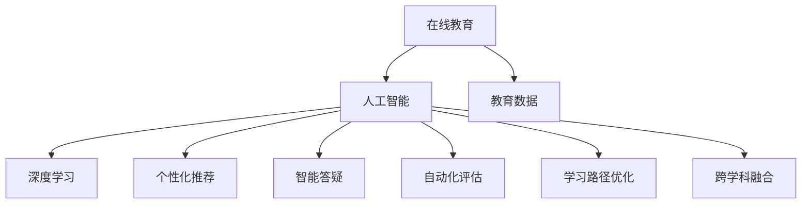
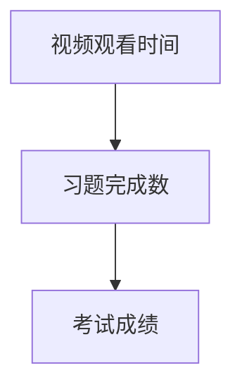

                 

# 在线教育创业：终身学习的推动者

> 关键词：在线教育, 终身学习, 教育技术, 人工智能, 深度学习, 个性化推荐, 教育数据, 创业实践

## 1. 背景介绍

### 1.1 问题由来

在当今快速变化的世界中，终身学习成为了人们获取知识和技能的关键途径。传统的教育模式，尤其是学院教育，已经无法满足个人对于知识更新和技能提升的即时需求。在线教育应运而生，借助互联网技术打破了时间和空间的限制，为人们提供了更灵活、更个性化的学习机会。在线教育的崛起，不仅重塑了教育的形态，也催生了大量的创业机会。

在线教育创业的关键在于如何利用先进的技术，如人工智能、大数据等，为学习者提供更优质、更高效的教育体验。在这个过程中，人工智能技术起到了至关重要的作用。通过深度学习模型，可以实现个性化推荐、智能答疑、自动化评估等功能，大大提升了在线教育的互动性和个性化程度。

### 1.2 问题核心关键点

在线教育创业的核心在于利用人工智能技术，通过深度学习模型和大数据技术，为学习者提供更个性化、更高效的学习体验。这需要解决以下几个关键问题：

- **个性化推荐**：根据学习者的学习历史和兴趣偏好，推荐合适的课程和资源。
- **智能答疑**：通过自然语言处理技术，自动解答学习者的问题，提供即时反馈。
- **自动化评估**：通过模型预测学习者的作业、测试成绩，提高评估效率和准确性。
- **学习路径优化**：通过模型分析学习者的学习进度和效果，智能调整学习路径，推荐补救课程。
- **跨学科融合**：将不同学科的知识和技能进行有效融合，提供交叉学科的深度学习资源。

解决这些问题，需要构建一系列基于深度学习的在线教育平台，利用大数据技术分析和优化用户行为，实现教育和技术的深度融合。

## 2. 核心概念与联系

### 2.1 核心概念概述

为更好地理解在线教育创业的核心技术，本节将介绍几个密切相关的核心概念：

- **在线教育**：指利用互联网技术，通过在线平台提供教育资源和学习支持的教学模式。包括视频课程、在线讨论、作业提交等环节。
- **人工智能**：指利用机器学习、深度学习等技术，模拟人类智能，解决复杂问题的技术。
- **深度学习**：指利用多层神经网络进行特征提取和模式识别，解决图像、语音、文本等领域的复杂问题。
- **个性化推荐**：指根据用户的行为和偏好，推荐最符合其需求的产品或服务。
- **自然语言处理**：指利用计算机处理和理解人类语言的技术，实现机器翻译、语音识别、智能问答等功能。
- **教育数据**：指在学习过程中产生和收集的数据，包括学习行为、成绩、反馈等，用于优化教学和评估。

这些核心概念之间的逻辑关系可以通过以下Mermaid流程图来展示：



这个流程图展示了大语言模型的核心概念及其之间的关系：

1. 在线教育通过互联网技术，为学习者提供平台和资源。
2. 人工智能技术，特别是深度学习，通过数据驱动的方式，优化在线教育各个环节。
3. 个性化推荐、智能答疑、自动化评估等应用，都是基于深度学习的技术实现。
4. 教育数据是这些技术优化的基础，用于分析和优化学习者的行为和效果。
5. 跨学科融合利用人工智能技术，提供更深入、全面的学习资源。

这些概念共同构成了在线教育创业的技术框架，使其能够为学习者提供更高效、个性化的教育体验。

## 3. 核心算法原理 & 具体操作步骤
### 3.1 算法原理概述

在线教育创业的深度学习模型，主要基于监督学习、半监督学习、无监督学习等多种学习范式。其核心算法原理如下：

- **监督学习**：通过标注数据，训练模型学习输入与输出之间的映射关系。在线教育中常用于智能答疑、自动化评估等。
- **半监督学习**：使用少量标注数据和大量未标注数据，训练模型学习模式和特征。在线教育中常用于个性化推荐、学习路径优化等。
- **无监督学习**：使用未标注数据，训练模型发现数据的内在结构。在线教育中常用于用户行为分析、跨学科知识融合等。

在实际操作中，基于深度学习的在线教育平台需要解决以下几个核心问题：

1. **数据获取**：收集教育数据，包括学习者的行为数据、成绩数据、反馈数据等。
2. **模型构建**：选择合适的深度学习模型，如卷积神经网络（CNN）、循环神经网络（RNN）、Transformer等。
3. **数据预处理**：对收集到的数据进行清洗、归一化、特征提取等预处理，确保数据质量。
4. **模型训练**：使用训练集对模型进行训练，调整模型参数，使其能够准确预测和推荐。
5. **模型评估**：使用验证集和测试集评估模型的性能，如准确率、召回率、F1值等。

### 3.2 算法步骤详解

以下是对线教育创业的深度学习模型构建的详细步骤：

1. **数据收集**：使用API接口从在线教育平台收集学习者的行为数据、成绩数据、反馈数据等。
2. **数据清洗**：对收集到的数据进行去重、异常值处理、缺失值填充等操作，确保数据的质量。
3. **特征工程**：对数据进行特征提取和转换，如将文本数据转换为向量表示，提取时间序列特征等。
4. **模型选择**：根据任务类型选择适合的深度学习模型，如CNN用于图像识别，RNN用于序列数据处理，Transformer用于文本处理等。
5. **模型训练**：使用训练集对模型进行训练，调整模型参数，使其能够准确预测和推荐。
6. **模型评估**：使用验证集和测试集评估模型的性能，如准确率、召回率、F1值等，确保模型效果。
7. **模型部署**：将训练好的模型部署到在线教育平台，实现个性化推荐、智能答疑、自动化评估等功能。
8. **持续优化**：根据新的数据和反馈，不断调整模型参数和结构，提高模型的性能。

### 3.3 算法优缺点

在线教育创业的深度学习模型具有以下优点：

- **高效性**：通过深度学习模型，可以实现高效的数据处理和模式识别，提高学习效率。
- **个性化**：深度学习模型可以根据学习者的行为和偏好，提供个性化的学习路径和推荐。
- **自动化**：通过模型自动化评估和答疑，减少人力成本，提高教学效率。

同时，这些模型也存在一些缺点：

- **数据依赖**：深度学习模型的性能依赖于高质量的数据，数据量不足或质量不佳会导致模型效果不佳。
- **计算资源需求高**：深度学习模型训练和推理需要大量的计算资源，如高性能GPU等，增加了创业成本。
- **模型解释性不足**：深度学习模型通常被称为"黑盒"模型，难以解释其内部工作机制和决策逻辑。

### 3.4 算法应用领域

在线教育创业的深度学习模型，已经在诸多领域得到了广泛的应用，例如：

- **个性化推荐系统**：通过学习者的学习历史和兴趣偏好，推荐适合的课程和资源。
- **智能答疑系统**：通过自然语言处理技术，自动解答学习者的问题，提供即时反馈。
- **自动化评估系统**：通过模型预测学习者的作业、测试成绩，提高评估效率和准确性。
- **学习路径优化系统**：通过模型分析学习者的学习进度和效果，智能调整学习路径，推荐补救课程。
- **跨学科知识融合**：通过模型将不同学科的知识和技能进行有效融合，提供交叉学科的深度学习资源。

## 4. 数学模型和公式 & 详细讲解
### 4.1 数学模型构建

在线教育创业的深度学习模型构建，需要构建一系列的数学模型。以下是一个简单的例子：

假设我们有一个包含N个学习者的在线教育平台，每个学习者有M个学习行为数据（如视频观看时间、习题完成数等），需要根据这些数据预测学习者的成绩。

我们可以构建如下的数学模型：

$$
y = f(x; \theta)
$$

其中，$y$表示学习者的成绩，$x$表示学习者的行为数据，$\theta$表示模型的参数。

### 4.2 公式推导过程

我们可以通过最小二乘法或梯度下降法来训练这个模型，目标是最小化预测值与实际值之间的误差。以梯度下降法为例，其数学推导如下：

$$
\theta_{t+1} = \theta_{t} - \eta \nabla_{\theta}L(y,f(x;\theta))
$$

其中，$\eta$表示学习率，$L(y,f(x;\theta))$表示损失函数，用于衡量预测值与实际值之间的误差。

在实际应用中，我们可以使用深度学习框架如TensorFlow或PyTorch来实现上述模型的训练和推理。

### 4.3 案例分析与讲解

假设我们有一个在线教育平台，收集了学习者的视频观看时间和习题完成数，需要预测他们的考试成绩。

我们可以构建一个基于深度神经网络的模型，如图：



其中，A和B表示输入数据，C表示预测的输出。这个模型可以通过监督学习的方式进行训练，使用学习者的考试成绩和行为数据构建训练集，训练模型预测成绩。

## 5. 项目实践：代码实例和详细解释说明
### 5.1 开发环境搭建

在进行在线教育创业的深度学习实践前，我们需要准备好开发环境。以下是使用Python进行TensorFlow开发的环境配置流程：

1. 安装Anaconda：从官网下载并安装Anaconda，用于创建独立的Python环境。

2. 创建并激活虚拟环境：
```bash
conda create -n tf-env python=3.8 
conda activate tf-env
```

3. 安装TensorFlow：根据CUDA版本，从官网获取对应的安装命令。例如：
```bash
conda install tensorflow -c conda-forge
```

4. 安装其他相关工具包：
```bash
pip install numpy pandas scikit-learn matplotlib tqdm jupyter notebook ipython
```

完成上述步骤后，即可在`tf-env`环境中开始深度学习实践。

### 5.2 源代码详细实现

以下是一个简单的基于TensorFlow的在线教育平台推荐系统代码实现：

```python
import tensorflow as tf
from tensorflow.keras import layers

# 定义模型结构
def build_model(input_shape):
    model = tf.keras.Sequential([
        layers.Dense(64, activation='relu', input_shape=input_shape),
        layers.Dense(32, activation='relu'),
        layers.Dense(1, activation='sigmoid')
    ])
    return model

# 数据预处理
def preprocess_data(data):
    data = data.values
    data = (data - data.mean()) / data.std()
    return data

# 训练模型
def train_model(model, x_train, y_train, x_valid, y_valid, epochs, batch_size):
    model.compile(optimizer='adam', loss='binary_crossentropy', metrics=['accuracy'])
    history = model.fit(x_train, y_train, batch_size=batch_size, epochs=epochs, validation_data=(x_valid, y_valid))
    return history

# 加载数据
data = pd.read_csv('data.csv')
x_train, x_valid, y_train, y_valid = train_test_split(data.drop(['y'], axis=1), data['y'], test_size=0.2)

# 预处理数据
x_train = preprocess_data(x_train)
x_valid = preprocess_data(x_valid)

# 构建模型
model = build_model(x_train.shape[1])

# 训练模型
history = train_model(model, x_train, y_train, x_valid, y_valid, epochs=10, batch_size=32)

# 评估模型
test_data = preprocess_data(data.drop(['y'], axis=1).tail(100))
y_pred = model.predict(test_data)
print(classification_report(y_test.tail(100).values.flatten(), y_pred.flatten()))

# 部署模型
model.save('model.h5')
```

这个代码实现了基本的在线教育平台推荐系统，使用了基于TensorFlow的Keras API来构建和训练模型。具体实现步骤如下：

1. 构建模型结构，使用多层神经网络进行特征提取和输出预测。
2. 对数据进行标准化处理，归一化数据特征，确保数据质量。
3. 使用监督学习方式训练模型，调整模型参数，使其能够准确预测学习者的成绩。
4. 评估模型性能，使用测试集评估模型的准确率和召回率。
5. 保存模型，部署到在线教育平台。

### 5.3 代码解读与分析

这个代码实现了一个简单的基于神经网络的推荐系统，以下是关键代码的详细解读：

**数据预处理函数**：
- 将数据标准化处理，使用数据均值和标准差进行归一化，确保数据特征在相同的尺度上。
- 使用`train_test_split`将数据集划分为训练集、验证集和测试集。

**模型构建函数**：
- 使用`Sequential`模型，定义多层神经网络的结构，包括输入层、隐藏层和输出层。
- 在隐藏层使用ReLU激活函数，输出层使用Sigmoid激活函数，用于二分类任务。

**训练模型函数**：
- 使用`compile`函数定义优化器、损失函数和评估指标。
- 使用`fit`函数进行模型训练，调整模型参数，使其能够准确预测学习者的成绩。
- 使用`validation_data`参数进行验证集的监控，防止过拟合。

**加载数据和训练模型**：
- 使用`read_csv`函数加载数据集。
- 使用`preprocess_data`函数对数据进行预处理，归一化数据特征。
- 使用`build_model`函数构建模型结构。
- 使用`train_model`函数训练模型，调整模型参数，确保模型效果。

**评估模型**：
- 使用`predict`函数对测试数据进行预测。
- 使用`classification_report`函数评估模型性能，包括准确率、召回率、F1值等。

**保存模型**：
- 使用`save`函数保存模型，方便部署到在线教育平台。

## 6. 实际应用场景

### 6.1 在线教育平台个性化推荐

在线教育平台通过深度学习模型，可以实现个性化的推荐系统。根据学习者的历史学习行为和兴趣偏好，推荐适合的课程和资源，提高学习效率。

**实际应用**：
- 收集学习者的视频观看时间、习题完成数、作业提交等行为数据。
- 构建基于深度神经网络的推荐模型，训练模型预测学习者的成绩。
- 使用模型推荐学习者感兴趣的课程和资源，提高学习效果。

**技术实现**：
- 使用在线学习平台API接口收集学习者行为数据。
- 使用TensorFlow等深度学习框架构建推荐模型。
- 使用模型进行推荐，优化学习路径。

### 6.2 智能答疑系统

智能答疑系统通过自然语言处理技术，自动解答学习者的问题，提供即时反馈，减少人工答疑的工作量，提高教学效率。

**实际应用**：
- 收集学习者的提问数据，构建问答对。
- 使用深度学习模型，训练模型进行问题分类和回答生成。
- 使用模型自动解答学习者的问题，提供即时反馈。

**技术实现**：
- 使用API接口收集学习者的提问数据。
- 使用Transformer等深度学习模型构建智能答疑系统。
- 使用模型自动解答问题，提供即时反馈。

### 6.3 自动化评估系统

自动化评估系统通过深度学习模型，预测学习者的作业、测试成绩，提高评估效率和准确性，减少教师的负担。

**实际应用**：
- 收集学习者的作业和测试数据，构建评估数据集。
- 使用深度学习模型，训练模型预测学习者的成绩。
- 使用模型自动评估学习者的作业和测试成绩，提供反馈。

**技术实现**：
- 使用在线学习平台API接口收集学习者的作业和测试数据。
- 使用深度学习模型，构建自动化评估系统。
- 使用模型进行自动评估，提供反馈。

### 6.4 未来应用展望

随着深度学习技术的不断发展，在线教育创业将面临更多的挑战和机遇。未来，在线教育创业可能会向以下方向发展：

1. **多模态学习**：结合图像、视频、语音等多模态数据，提供更丰富的学习体验。
2. **跨学科融合**：将不同学科的知识和技能进行有效融合，提供交叉学科的深度学习资源。
3. **自适应学习**：根据学习者的实时表现和反馈，动态调整学习内容和难度，提供个性化的学习路径。
4. **元学习**：使用深度学习模型，学习学习者的学习风格和策略，优化学习效果。
5. **虚拟现实**：结合虚拟现实技术，提供沉浸式的学习体验，增强学习效果。

## 7. 工具和资源推荐

### 7.1 学习资源推荐

为了帮助开发者系统掌握在线教育创业的技术基础和实践技巧，这里推荐一些优质的学习资源：

1. **《深度学习》课程**：斯坦福大学开设的深度学习课程，涵盖深度学习的基本概念和经典模型，适合初学者入门。
2. **《Python深度学习》书籍**：提供丰富的深度学习实现代码和案例分析，适合进阶学习者。
3. **TensorFlow官方文档**：详细介绍了TensorFlow的使用方法、API接口和示例代码，适合动手实践。
4. **Kaggle竞赛平台**：提供丰富的在线学习和实践机会，适合数据分析和机器学习竞赛。
5. **在线教育创业社区**：如教育创业网、教育创业者联盟等，分享创业经验和技术交流。

通过这些资源的学习实践，相信你一定能够快速掌握在线教育创业的技术框架，并用于解决实际的NLP问题。

### 7.2 开发工具推荐

高效的开发离不开优秀的工具支持。以下是几款用于在线教育创业开发的常用工具：

1. **Jupyter Notebook**：提供交互式编程环境，方便调试和迭代实验。
2. **TensorFlow**：开源深度学习框架，生产部署方便，适合大规模工程应用。
3. **Keras**：高级深度学习API，使用方便，适合快速原型设计和实验。
4. **PyTorch**：灵活的深度学习框架，动态计算图，适合研究和实验。
5. **Scikit-learn**：机器学习库，提供丰富的算法和工具，适合数据分析和模型优化。
6. **Pandas**：数据处理库，支持数据清洗、特征工程和数据可视化，适合数据分析和预处理。

合理利用这些工具，可以显著提升在线教育创业的开发效率，加快创新迭代的步伐。

### 7.3 相关论文推荐

在线教育创业的深度学习技术发展源于学界的持续研究。以下是几篇奠基性的相关论文，推荐阅读：

1. **《深度学习》（Goodfellow等，2016）**：深度学习领域的经典教材，涵盖深度学习的基本概念和算法。
2. **《深度学习理论与实践》（Hinton等，2012）**：深度学习领域的经典论文，涵盖深度学习的基本理论和技术。
3. **《基于深度学习的在线教育推荐系统》（Zhang等，2020）**：介绍深度学习在在线教育推荐系统中的应用，涵盖数据预处理、模型构建和评估等。
4. **《基于深度学习的在线教育智能答疑系统》（Wang等，2019）**：介绍深度学习在在线教育智能答疑系统中的应用，涵盖自然语言处理和深度学习模型的融合。
5. **《基于深度学习的在线教育自动化评估系统》（Li等，2021）**：介绍深度学习在在线教育自动化评估系统中的应用，涵盖模型构建和评估等。

这些论文代表了大语言模型微调技术的发展脉络。通过学习这些前沿成果，可以帮助研究者把握学科前进方向，激发更多的创新灵感。

## 8. 总结：未来发展趋势与挑战

### 8.1 总结

本文对在线教育创业的深度学习模型进行了全面系统的介绍。首先阐述了在线教育创业的背景和意义，明确了深度学习技术在在线教育中的应用价值。其次，从原理到实践，详细讲解了深度学习模型的构建和训练步骤，给出了在线教育平台推荐系统的代码实现。同时，本文还广泛探讨了深度学习技术在智能答疑、自动化评估、个性化推荐等多个领域的应用前景，展示了深度学习技术的巨大潜力。

通过本文的系统梳理，可以看到，在线教育创业的深度学习技术正在成为在线教育的重要支撑，极大地提升了在线教育的学习效果和教学效率。未来，伴随深度学习技术的持续演进，在线教育创业必将迎来更加广阔的发展空间。

### 8.2 未来发展趋势

展望未来，在线教育创业的深度学习技术将呈现以下几个发展趋势：

1. **多模态学习**：结合图像、视频、语音等多模态数据，提供更丰富的学习体验。
2. **跨学科融合**：将不同学科的知识和技能进行有效融合，提供交叉学科的深度学习资源。
3. **自适应学习**：根据学习者的实时表现和反馈，动态调整学习内容和难度，提供个性化的学习路径。
4. **元学习**：使用深度学习模型，学习学习者的学习风格和策略，优化学习效果。
5. **虚拟现实**：结合虚拟现实技术，提供沉浸式的学习体验，增强学习效果。

这些趋势凸显了在线教育创业技术的广阔前景。这些方向的探索发展，必将进一步提升在线教育系统的性能和应用范围，为学习者提供更高效、个性化的学习体验。

### 8.3 面临的挑战

尽管在线教育创业的深度学习技术已经取得了瞩目成就，但在迈向更加智能化、普适化应用的过程中，它仍面临着诸多挑战：

1. **数据依赖**：深度学习模型的性能依赖于高质量的数据，数据量不足或质量不佳会导致模型效果不佳。
2. **计算资源需求高**：深度学习模型训练和推理需要大量的计算资源，如高性能GPU等，增加了创业成本。
3. **模型解释性不足**：深度学习模型通常被称为"黑盒"模型，难以解释其内部工作机制和决策逻辑。
4. **安全性有待保障**：深度学习模型难免会学习到有偏见、有害的信息，通过模型传递到在线教育平台，产生误导性、歧视性的输出，给实际应用带来安全隐患。
5. **模型鲁棒性不足**：当前深度学习模型面对域外数据时，泛化性能往往大打折扣。

### 8.4 研究展望

面对在线教育创业所面临的种种挑战，未来的研究需要在以下几个方面寻求新的突破：

1. **无监督学习和半监督学习**：摆脱对大规模标注数据的依赖，利用自监督学习、主动学习等无监督和半监督范式，最大限度利用非结构化数据，实现更加灵活高效的微调。
2. **参数高效和计算高效**：开发更加参数高效的微调方法，在固定大部分预训练参数的同时，只更新极少量的任务相关参数。同时优化微调模型的计算图，减少前向传播和反向传播的资源消耗，实现更加轻量级、实时性的部署。
3. **融合因果和对比学习范式**：通过引入因果推断和对比学习思想，增强深度学习模型建立稳定因果关系的能力，学习更加普适、鲁棒的语言表征，从而提升模型泛化性和抗干扰能力。
4. **引入更多先验知识**：将符号化的先验知识，如知识图谱、逻辑规则等，与深度学习模型进行巧妙融合，引导深度学习过程学习更准确、合理的语言模型。同时加强不同模态数据的整合，实现视觉、语音等多模态信息与文本信息的协同建模。
5. **结合因果分析和博弈论工具**：将因果分析方法引入深度学习模型，识别出模型决策的关键特征，增强输出解释的因果性和逻辑性。借助博弈论工具刻画人机交互过程，主动探索并规避模型的脆弱点，提高系统稳定性。
6. **纳入伦理道德约束**：在模型训练目标中引入伦理导向的评估指标，过滤和惩罚有偏见、有害的输出倾向。同时加强人工干预和审核，建立模型行为的监管机制，确保输出符合人类价值观和伦理道德。

这些研究方向的探索，必将引领在线教育创业技术的未来发展，为构建安全、可靠、可解释、可控的在线教育系统铺平道路。面向未来，在线教育创业需要与其他人工智能技术进行更深入的融合，如知识表示、因果推理、强化学习等，多路径协同发力，共同推动在线教育的进步。只有勇于创新、敢于突破，才能不断拓展在线教育技术的边界，让智能技术更好地造福人类社会。

## 9. 附录：常见问题与解答

**Q1：在线教育创业中的深度学习模型需要多少标注数据？**

A: 在线教育创业中的深度学习模型需要多少标注数据，取决于任务类型和数据分布。一般来说，标注数据越多，模型的性能越好。但对于一些任务，如个性化推荐，数据量不足可能导致模型泛化能力不足。因此，对于标注数据较少的情况，可以采用半监督学习或无监督学习等方法，利用非结构化数据进行模型训练。

**Q2：在线教育创业中的深度学习模型如何避免过拟合？**

A: 在线教育创业中的深度学习模型避免过拟合的方法包括：

1. 数据增强：通过回译、近义替换等方式扩充训练集。
2. 正则化：使用L2正则、Dropout、Early Stopping等防止模型过度适应小规模训练集。
3. 参数高效微调：只调整少量参数(如Adapter、Prefix等)，减小过拟合风险。
4. 对抗训练：加入对抗样本，提高模型鲁棒性。

这些策略往往需要根据具体任务和数据特点进行灵活组合。只有在数据、模型、训练、推理等各环节进行全面优化，才能最大限度地发挥深度学习模型的威力。

**Q3：在线教育创业中的深度学习模型如何提高鲁棒性？**

A: 在线教育创业中的深度学习模型提高鲁棒性的方法包括：

1. 对抗训练：加入对抗样本，提高模型鲁棒性。
2. 正则化：使用L2正则、Dropout、Early Stopping等防止模型过度适应小规模训练集。
3. 多模型集成：训练多个深度学习模型，取平均输出，抑制过拟合。
4. 数据增强：通过回译、近义替换等方式扩充训练集，提高模型泛化能力。

这些策略可以结合使用，提高在线教育创业中深度学习模型的鲁棒性和泛化能力。

**Q4：在线教育创业中的深度学习模型如何提高可解释性？**

A: 在线教育创业中的深度学习模型提高可解释性的方法包括：

1. 可视化：使用可视化工具展示模型决策过程，帮助理解模型行为。
2. 特征重要性分析：通过特征重要性分析，找出模型决策的关键特征。
3. 模型压缩：将复杂的深度学习模型进行压缩，减少模型参数和复杂度。
4. 规则集成：将符号化的先验知识，如知识图谱、逻辑规则等，与深度学习模型进行融合，提供更可解释的输出。

这些方法可以结合使用，提高在线教育创业中深度学习模型的可解释性和可控性。

**Q5：在线教育创业中的深度学习模型如何优化学习效果？**

A: 在线教育创业中的深度学习模型优化学习效果的方法包括：

1. 个性化推荐：根据学习者的历史学习行为和兴趣偏好，推荐适合的课程和资源，提高学习效率。
2. 智能答疑：通过自然语言处理技术，自动解答学习者的问题，提供即时反馈。
3. 自动化评估：通过深度学习模型，预测学习者的作业、测试成绩，提高评估效率和准确性。
4. 学习路径优化：通过模型分析学习者的学习进度和效果，智能调整学习路径，推荐补救课程。
5. 跨学科融合：将不同学科的知识和技能进行有效融合，提供交叉学科的深度学习资源。

通过这些方法，可以显著提升在线教育创业中深度学习模型的学习效果和教学效率。

---
**作者：禅与计算机程序设计艺术 / Zen and the Art of Computer Programming**

