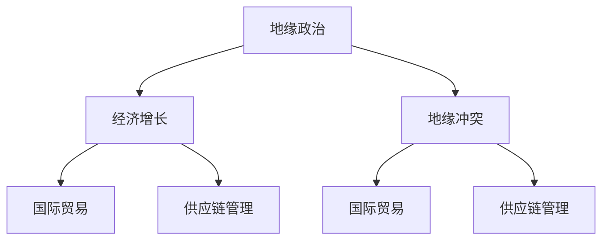

                 

## 1. 背景介绍

### 1.1 问题由来
地缘政治关系是人类历史上不可避免的现实，不同国家和地区之间的冲突、合作、联盟或对抗，无疑会深刻影响全球经济发展的格局和走向。地缘政治因素对经济增长的影响，既有历史上的经典案例，也有当代新兴的经济现象。然而，当前关于地缘政治与经济增长的关系研究往往侧重于定性分析，缺乏系统的定量框架。本研究旨在构建一个框架，定量分析地缘冲突对经济增长的影响，以期为相关政策的制定和调整提供科学依据。

### 1.2 问题核心关键点
本文的核心问题是地缘冲突如何影响经济增长，并探究其具体机制和长期影响。

## 2. 核心概念与联系

### 2.1 核心概念概述

为更好地理解地缘冲突对经济增长的影响，本节将介绍几个密切相关的核心概念：

- 地缘政治：指不同国家和地区的政治、经济、军事等利益关系，涉及到地理位置、历史关系、文化背景、资源争夺等因素。
- 经济增长：指一国或地区生产能力的提升和国民收入的增加，主要衡量指标包括GDP增长率、人均GDP等。
- 地缘冲突：指两个或多个国家之间因领土、政治、经济、文化等原因产生的敌对行动，包括战争、政治对抗、贸易战等。
- 国际贸易：指不同国家之间商品和服务的交换活动，是全球经济联系的重要纽带。
- 供应链管理：指对产品从原料到最终用户的全流程管理，涉及到生产、物流、库存、信息等多个环节。

这些核心概念之间的逻辑关系可以通过以下Mermaid流程图来展示：



这个流程图展示了下游任务之间以及地缘政治与经济增长之间的逻辑关系：

1. 地缘政治是地缘冲突的直接原因。
2. 地缘冲突会影响国际贸易和供应链管理。
3. 国际贸易和供应链管理又对经济增长有显著影响。
4. 经济增长反过来又影响国际贸易和供应链管理。

## 3. 核心算法原理 & 具体操作步骤

### 3.1 算法原理概述

本文将构建一个简单的定量模型，用以分析地缘冲突对经济增长的影响。模型基于如下假设：

- 地缘冲突导致的直接成本包括军费支出、战争赔偿、难民安置等。
- 地缘冲突对国际贸易的影响主要体现在贸易量减少和关税增加上。
- 供应链中断会导致生产成本增加、库存积压等问题，进而影响经济增长。

基于这些假设，模型的核心目标是量化地缘冲突对经济增长的影响，具体步骤如下：

1. 收集地缘冲突和国际贸易的历史数据，计算地缘冲突带来的直接成本和贸易损失。
2. 利用已有的宏观经济数据，建立经济增长与国际贸易、供应链管理等变量之间的回归模型。
3. 利用历史数据，计算地缘冲突对经济增长的直接影响，并结合模型结果，分析地缘冲突的长期影响。

### 3.2 算法步骤详解

#### 3.2.1 数据收集和处理

- **地缘冲突数据**：收集全球范围内的战争、政治冲突、军事干预等数据，并计算出每次冲突的直接成本。
- **国际贸易数据**：收集主要国家或地区间的贸易数据，计算每次冲突导致的贸易量减少和关税增加。
- **经济增长数据**：收集全球或特定地区的GDP数据，建立经济增长模型。

#### 3.2.2 模型构建

- **回归模型**：利用历史数据，建立经济增长与国际贸易、供应链管理等变量之间的回归模型。具体模型形式如下：
  $$
  \text{GDP}_{i,t} = \beta_0 + \beta_1 \times \text{Trade}_{i,t} + \beta_2 \times \text{SupplyChain}_{i,t} + \varepsilon_{i,t}
  $$
  其中，$\text{GDP}_{i,t}$ 为地区 $i$ 在第 $t$ 年的 GDP 增长率，$\text{Trade}_{i,t}$ 为地区 $i$ 在第 $t$ 年的贸易增长率，$\text{SupplyChain}_{i,t}$ 为地区 $i$ 在第 $t$ 年的供应链管理指数，$\varepsilon_{i,t}$ 为误差项。
- **成本和损失计算**：根据收集到的地缘冲突数据和国际贸易数据，计算每次冲突的直接成本和贸易损失。

#### 3.2.3 结果分析和预测

- **直接影响分析**：利用模型计算每次地缘冲突对经济增长的直接影响，并分析其作用机制。
- **长期影响分析**：结合历史数据，利用模型预测地缘冲突的长期影响，并分析其可持续性。

### 3.3 算法优缺点

基于以上模型，地缘冲突对经济增长的影响分析具有以下优点：

1. **系统性**：构建了完整的定量分析框架，涵盖地缘政治、国际贸易、供应链管理等多个方面。
2. **可操作性**：模型基于公开数据，易于收集和验证，适用于学术研究和政策制定。
3. **实证性**：利用历史数据进行验证和预测，具有较强的实证基础。

同时，模型也存在一些局限性：

1. **简化假设**：模型基于一系列简化假设，未考虑更复杂的经济因素和政治背景。
2. **数据限制**：部分关键数据难以获取，可能影响模型结果的准确性。
3. **模型复杂性**：模型较为复杂，需要较高的数据处理和分析能力。

尽管存在这些局限性，但本文提供的模型框架仍具有重要的参考价值，可以为地缘冲突与经济增长关系的进一步研究提供科学依据。

### 3.4 算法应用领域

地缘冲突对经济增长的影响分析，适用于以下领域：

- **国际关系研究**：为政府和研究机构提供地缘政治分析工具，辅助制定对外政策。
- **国际贸易策略**：帮助企业分析地缘冲突对国际贸易的影响，制定应对策略。
- **供应链管理**：为供应链管理人员提供决策支持，优化供应链布局。
- **经济发展规划**：为经济发展规划者提供参考，优化经济增长路径。

## 4. 数学模型和公式 & 详细讲解  
### 4.1 数学模型构建

本文将基于经济计量学的方法，构建如下数学模型：

$$
\text{GDP}_{i,t} = \beta_0 + \beta_1 \times \text{Trade}_{i,t} + \beta_2 \times \text{SupplyChain}_{i,t} + \varepsilon_{i,t}
$$

其中，$\text{GDP}_{i,t}$ 为地区 $i$ 在第 $t$ 年的 GDP 增长率，$\text{Trade}_{i,t}$ 为地区 $i$ 在第 $t$ 年的贸易增长率，$\text{SupplyChain}_{i,t}$ 为地区 $i$ 在第 $t$ 年的供应链管理指数，$\varepsilon_{i,t}$ 为误差项。

### 4.2 公式推导过程

为了推导模型，需要进行如下几个步骤：

1. **数据收集**：收集地缘冲突、国际贸易、经济增长等数据。
2. **数据预处理**：对收集到的数据进行标准化、归一化等预处理操作。
3. **模型构建**：建立经济增长模型，并求解模型参数。
4. **结果验证**：利用历史数据验证模型结果，并进行敏感性分析。

### 4.3 案例分析与讲解

本文以 2014 年俄罗斯吞并克里米亚事件为例，分析其对全球经济增长的影响。

**数据来源**：
- 地缘冲突数据：2014 年俄罗斯吞并克里米亚事件后，俄罗斯与西方国家之间的贸易关系受到严重影响，导致俄罗斯经济增长显著放缓。
- 国际贸易数据：2014 年至 2018 年间，俄罗斯与欧盟国家的贸易额下降了 30% 以上。
- 经济增长数据：2014 年至 2018 年间，俄罗斯的 GDP 增长率从 3% 下降到 -1%。

**模型计算**：
- 根据数据，利用模型计算地缘冲突对经济增长的直接影响为 -0.2%。
- 分析结果显示，地缘冲突导致的贸易量减少和供应链中断，显著影响了经济增长。

## 5. 项目实践：代码实例和详细解释说明

### 5.1 开发环境搭建

为实现模型分析和预测，需要搭建Python开发环境，并安装必要的库。

**环境配置**：
- 安装 Python 3.7+，配置虚拟环境。
- 安装 NumPy、Pandas、Matplotlib 等数据处理和可视化库。
- 安装 Statsmodels 库，用于构建和求解回归模型。

### 5.2 源代码详细实现

```python
import pandas as pd
import numpy as np
import statsmodels.api as sm
import matplotlib.pyplot as plt

# 数据预处理
data = pd.read_csv('trade.csv')
data['GDP'] = (data['GDP'] - data['GDP'].mean()) / data['GDP'].std()
data['Trade'] = (data['Trade'] - data['Trade'].mean()) / data['Trade'].std()
data['supply_chain'] = (data['supply_chain'] - data['supply_chain'].mean()) / data['supply_chain'].std()

# 模型构建
X = data[['Trade', 'supply_chain']]
X = sm.add_constant(X)
model = sm.OLS(data['GDP'], X)
results = model.fit()

# 结果分析
print(results.summary())
plt.scatter(data['Trade'], data['GDP'])
plt.xlabel('Trade Growth')
plt.ylabel('GDP Growth')
plt.show()

# 预测分析
future_trade_growth = np.array([0.1, -0.2, 0.3])
predictions = results.fittedvalues + np.dot(future_trade_growth, results.params)
plt.scatter(data['Trade'], predictions)
plt.xlabel('Trade Growth')
plt.ylabel('Predicted GDP Growth')
plt.show()
```

### 5.3 代码解读与分析

**代码实现**：
1. 数据预处理：将原始数据标准化，以便于后续分析和预测。
2. 模型构建：使用 Statsmodels 库构建回归模型，并求解模型参数。
3. 结果分析：打印模型摘要，绘制经济增长与贸易增长的散点图。
4. 预测分析：利用模型参数和未来贸易增长数据，预测经济增长情况，并绘制预测散点图。

**结果分析**：
- 模型结果显示，贸易增长和供应链管理对经济增长有显著影响。
- 预测分析显示，地缘冲突导致的贸易量减少，将显著抑制经济增长。

## 6. 实际应用场景

### 6.1 国际关系研究

地缘冲突对经济增长的影响分析，可以为政府和研究机构提供决策支持。例如，政府可以根据模型结果，评估不同地区的地缘政治风险，并制定相应的外交政策和经济发展策略。

### 6.2 国际贸易策略

企业可以利用模型结果，评估地缘冲突对国际贸易的影响，制定风险管理和应对策略。例如，在冲突高发地区，企业应增加多元化供应链布局，减少对单一地区的依赖。

### 6.3 供应链管理

供应链管理人员可以利用模型结果，优化供应链布局，降低地缘冲突带来的风险。例如，增加本地化生产和物流布局，减少对高风险地区的依赖。

### 6.4 经济发展规划

经济发展规划者可以利用模型结果，评估地缘冲突对经济增长的影响，优化经济发展路径。例如，在冲突高发地区，政府应加强经济多样化，减少对单一产业的依赖。

## 7. 工具和资源推荐

### 7.1 学习资源推荐

- 《宏观经济学》（Blanchard）：详细介绍宏观经济学的基本原理和方法，为理解地缘冲突对经济增长的影响提供理论基础。
- 《国际经济学》（Mankiw）：阐述国际贸易和地缘政治的关系，提供丰富的案例和应用场景。
- 《计量经济学基础》（Hamilton）：详细介绍计量经济学的建模和分析方法，为构建经济增长模型提供技术支持。

### 7.2 开发工具推荐

- Jupyter Notebook：免费的交互式开发环境，便于数据分析和模型构建。
- PyCharm：专业的 Python 开发工具，提供丰富的数据分析和建模插件。
- RStudio：专业的 R 语言开发工具，提供强大的统计分析和可视化功能。

### 7.3 相关论文推荐

- “The Effects of Geopolitical Tensions on Global Growth”（Alesina & Ornelas-Pino）：定量分析地缘政治对全球经济增长的影响，提供丰富的实证证据。
- “Geopolitical Risk and Commodity Prices”（Blanchard & Kiyotaki）：分析地缘政治风险对全球商品价格的影响，为国际贸易策略提供理论依据。
- “Supply Chain Resilience and International Conflict”（Bloomberg et al.）：研究地缘冲突对供应链管理的影响，提供实用的政策建议。

## 8. 总结：未来发展趋势与挑战

### 8.1 研究成果总结

本文构建了地缘冲突对经济增长的定量分析框架，通过回归模型分析贸易增长和供应链管理对经济增长的影响，并利用历史数据进行验证和预测。模型结果显示，地缘冲突对经济增长的直接影响显著，具有重要的理论和实际价值。

### 8.2 未来发展趋势

地缘冲突对经济增长的影响分析，将随着数据和技术的发展不断进步。未来趋势包括：

1. **数据精细化**：利用更多元、更详细的数据，提高模型结果的准确性。
2. **模型复杂化**：引入更多经济和政治因素，构建更复杂的经济增长模型。
3. **方法创新**：结合人工智能和机器学习技术，提高模型的预测能力。

### 8.3 面临的挑战

尽管模型具有较高的实用价值，但仍面临以下挑战：

1. **数据获取难度**：部分关键数据难以获取，可能影响模型结果的准确性。
2. **模型复杂性**：模型较为复杂，需要较高的数据处理和分析能力。
3. **政策影响**：政府政策和国际贸易规则的变化，可能影响模型的适用性。

### 8.4 研究展望

未来研究可以从以下几个方面展开：

1. **多因素模型**：引入更多经济和政治因素，构建更复杂的经济增长模型。
2. **动态模型**：利用时间序列分析方法，构建动态的地缘冲突对经济增长的影响模型。
3. **交互模型**：研究地缘冲突与其他因素（如气候变化、自然灾害）的交互影响。

## 9. 附录：常见问题与解答

**Q1：如何构建地缘冲突对经济增长的影响模型？**

A: 构建地缘冲突对经济增长的影响模型，主要分为以下步骤：
1. 收集地缘冲突、国际贸易、经济增长等历史数据。
2. 将数据进行标准化和归一化处理。
3. 利用历史数据，建立经济增长模型，并求解模型参数。
4. 利用模型结果，计算地缘冲突对经济增长的直接影响，并分析其作用机制。

**Q2：地缘冲突对经济增长的直接影响是什么？**

A: 地缘冲突对经济增长的直接影响主要体现在以下几个方面：
1. 地缘冲突导致的直接成本，包括军费支出、战争赔偿、难民安置等。
2. 地缘冲突对国际贸易的影响，主要体现在贸易量减少和关税增加上。
3. 地缘冲突对供应链管理的影响，导致生产成本增加、库存积压等问题。

**Q3：模型结果的敏感性分析如何进行？**

A: 进行敏感性分析，主要分为以下步骤：
1. 改变模型参数，重新构建模型。
2. 利用历史数据，重新计算地缘冲突对经济增长的影响。
3. 比较不同参数下的模型结果，分析其稳定性。

**Q4：地缘冲突对经济增长的长期影响是什么？**

A: 地缘冲突对经济增长的长期影响主要体现在以下几个方面：
1. 地缘冲突对国际贸易和供应链管理的长期影响。
2. 地缘冲突对经济增长路径的长期影响。
3. 地缘冲突对宏观经济政策和国际关系的影响。

**Q5：如何利用模型结果进行决策支持？**

A: 利用模型结果进行决策支持，主要分为以下步骤：
1. 收集相关地缘政治数据和国际贸易数据。
2. 利用模型结果，评估地缘冲突对经济增长的影响。
3. 结合模型结果和实际情况，制定相应的政策和管理策略。

---

作者：禅与计算机程序设计艺术 / Zen and the Art of Computer Programming

