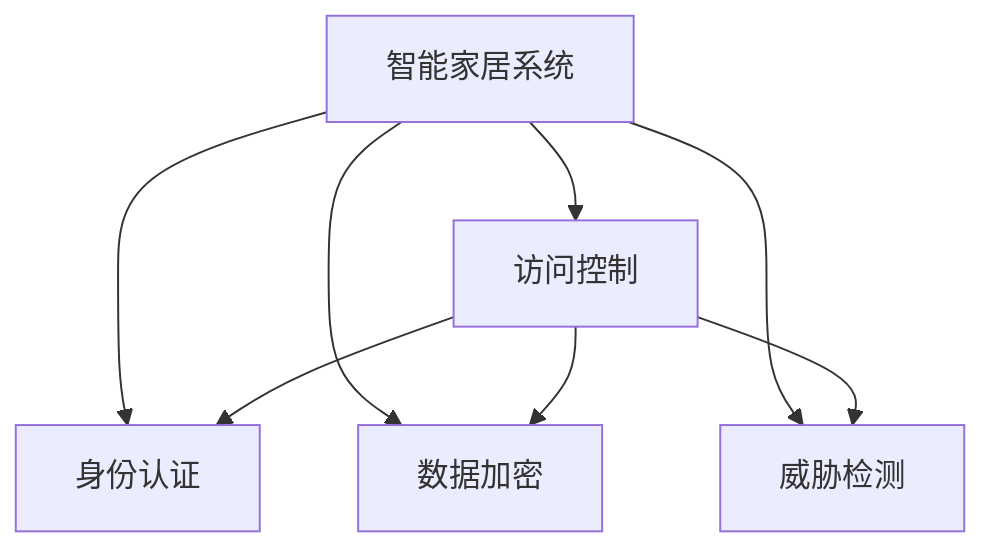

                 

# 基于Java的智能家居设计：基于Java的智能家居安全模型

## 1. 背景介绍

### 1.1 问题由来
随着科技的发展，智能家居系统已经成为了现代家庭的重要组成部分。其集成了安防监控、温度控制、照明调节等多种功能，极大地提升了生活的便利性和舒适性。然而，智能家居系统面临的安全问题也日渐突出，如未授权访问、数据泄露、系统瘫痪等，严重威胁着用户的隐私和财产安全。因此，如何设计一个高效、可靠、安全的智能家居系统，成为了当下研究的热点问题。

### 1.2 问题核心关键点
本文聚焦于基于Java的智能家居安全模型的设计与实现，从核心概念出发，详细阐述了安全模型的原理和架构。主要解决以下问题：
1. 如何设计一个安全、高效、可靠的智能家居系统？
2. 如何保证数据传输、存储和处理的安全性？
3. 如何应对系统遭受的各种攻击和威胁？
4. 如何在保证用户体验的前提下，实现智能家居系统的安全增强？

## 2. 核心概念与联系

### 2.1 核心概念概述

为更好地理解基于Java的智能家居安全模型，本节将介绍几个密切相关的核心概念：

- **智能家居系统**：利用物联网技术，通过传感器、控制器等设备，实现家庭环境的自动化、智能化管理。

- **安全模型**：包括身份认证、访问控制、数据加密、威胁检测等多种安全机制，旨在保护智能家居系统免受各种安全威胁。

- **访问控制**：用于限制用户对系统的访问权限，确保只有授权用户才能访问敏感资源。

- **身份认证**：通过生物特征识别、密码验证等方式，确认用户身份的真实性。

- **数据加密**：使用加密算法对数据进行加密，保护数据在传输和存储过程中的机密性。

- **威胁检测**：使用入侵检测系统(IDS)、异常检测等技术，实时监控系统行为，及时发现和响应安全事件。

这些核心概念之间的逻辑关系可以通过以下Mermaid流程图来展示：



这个流程图展示了这个系统的核心概念及其之间的关系：

1. 智能家居系统通过访问控制、身份认证、数据加密和威胁检测等安全机制，来保护系统的安全。
2. 访问控制和身份认证用于限制用户的访问权限，数据加密保护数据安全，威胁检测用于及时发现和响应安全事件。
3. 这些安全机制相互配合，构成了一个完整的安全框架，保障了系统的稳定性和安全性。

## 3. 核心算法原理 & 具体操作步骤
### 3.1 算法原理概述

基于Java的智能家居安全模型，采用了一系列先进的安全技术和算法，如访问控制、身份认证、数据加密、威胁检测等，确保系统的安全性和可靠性。

- **访问控制**：采用基于角色的访问控制(RBAC)模型，根据用户角色和权限分配访问权限。
- **身份认证**：使用基于生物特征识别的认证方式，如指纹、人脸识别等，实现用户身份的准确验证。
- **数据加密**：采用AES-256等高级加密算法，对数据进行加密处理，确保数据传输和存储的安全性。
- **威胁检测**：使用入侵检测系统(IDS)和异常检测算法，实时监控系统行为，及时发现和响应安全事件。

### 3.2 算法步骤详解

基于Java的智能家居安全模型的实现主要分为以下几个步骤：

**Step 1: 系统设计**
- 确定系统的功能需求和安全需求，设计系统的架构。
- 选择合适的安全算法和技术，如RBAC、AES-256、IDS等。
- 确定系统的开发环境，如Java语言、Spring框架等。

**Step 2: 访问控制实现**
- 定义用户角色和权限，如管理员、普通用户、访客等。
- 使用RBAC模型，将用户分配到不同的角色，角色具备不同的权限。
- 在系统中实现访问控制逻辑，如权限检查、权限分配等。

**Step 3: 身份认证实现**
- 使用生物特征识别技术，如指纹识别、人脸识别等，实现用户身份验证。
- 将身份验证结果与访问控制逻辑结合，实现身份认证和权限检查。
- 使用OAuth 2.0等标准协议，实现用户单点登录和跨域认证。

**Step 4: 数据加密实现**
- 采用AES-256等高级加密算法，对数据进行加密处理。
- 实现数据加密的传输过程，如SSL/TLS协议。
- 对数据进行加密存储，防止数据泄露。

**Step 5: 威胁检测实现**
- 使用入侵检测系统(IDS)，实时监控系统行为，检测异常流量和攻击行为。
- 使用异常检测算法，对系统行为进行统计分析，检测异常模式。
- 对检测到的异常行为进行响应，如日志记录、告警通知等。

### 3.3 算法优缺点

基于Java的智能家居安全模型具有以下优点：
1. 安全性高。通过访问控制、身份认证、数据加密和威胁检测等多重安全机制，确保系统的安全性。
2. 高效性高。采用基于角色的访问控制和高效的数据加密算法，系统运行效率高。
3. 可扩展性强。使用Java语言和Spring框架，系统易于扩展和维护。

同时，该模型也存在一些局限性：
1. 依赖Java环境。Java平台的使用增加了系统的复杂性和开发成本。
2. 代码安全性问题。Java代码的安全性问题也可能影响系统的安全性。
3. 实现复杂度较高。多层次的安全机制和复杂的算法实现增加了系统开发难度。

尽管存在这些局限性，但基于Java的智能家居安全模型仍是当前智能家居系统中广泛应用的一种解决方案。未来，相关研究的重点在于如何进一步简化系统架构，降低实现复杂度，提高系统的可扩展性和可维护性。

### 3.4 算法应用领域

基于Java的智能家居安全模型主要应用于以下领域：

1. 智能家居安防系统：应用于智能门锁、监控摄像头、报警器等安防设备，实现身份认证、访问控制等功能。
2. 智能家居控制中心：应用于智能音箱、智能电视、智能空调等中心设备，实现数据加密、威胁检测等功能。
3. 智能家居云平台：应用于智能家居数据集中管理、远程控制等场景，实现高级访问控制和威胁检测。

除了上述这些应用领域外，智能家居安全模型还可应用于智能家居协同网络、智能家居数据存储等场景，为智能家居系统的安全提供坚实保障。

## 4. 数学模型和公式 & 详细讲解 & 举例说明

### 4.1 数学模型构建

基于Java的智能家居安全模型的核心数学模型包括访问控制、身份认证、数据加密和威胁检测等。下面分别对这四个模型进行数学建模：

**访问控制模型**：
- 定义用户角色集合$R$和权限集合$P$。
- 用户$u$对权限$p$的访问请求，用$(u,p)$表示。
- 角色$u$对权限$p$的访问权限，用$(r,p)$表示。
- 访问控制逻辑可以用以下布尔表达式表示：
  $$
  \text{Access}(u,p) = \bigvee_{r \in R} (r,p) \wedge (u,r)
  $$

**身份认证模型**：
- 定义用户$u$的生物特征向量$V_u$，如指纹、人脸图像等。
- 用户$u$的身份验证结果为$y$，$y \in \{0,1\}$，$0$表示验证失败，$1$表示验证成功。
- 身份认证逻辑可以用以下布尔表达式表示：
  $$
  \text{Auth}(u) = y
  $$

**数据加密模型**：
- 定义明文数据$M$，密文数据$C$，加密算法$E$。
- 加密过程可以用以下公式表示：
  $$
  C = E(M)
  $$
- 解密过程可以用以下公式表示：
  $$
  M = E^{-1}(C)
  $$

**威胁检测模型**：
- 定义系统行为$B$，异常行为$A$，异常检测算法$D$。
- 异常检测结果为$D(B)$，$D(B) \in \{0,1\}$，$0$表示正常行为，$1$表示异常行为。
- 威胁检测逻辑可以用以下布尔表达式表示：
  $$
  \text{Threat} = D(B) \wedge (A \vee B)
  $$

### 4.2 公式推导过程

以下我们以AES-256加密算法为例，推导数据加密的数学公式。

AES-256算法采用128位块加密方式，采用密钥长度为256位的密钥$K$，对数据$M$进行加密处理。加密过程如下：

1. 将$M$分成若干个16字节的块，每个块长度为128位。
2. 对每个块进行密钥扩展，得到一系列轮密钥$K_i$。
3. 对每个块进行多轮替换和置换操作，生成密文$C$。

具体数学公式如下：

1. 块分割：将明文$M$分割成若干个$L$块，$L$为16字节。
2. 轮密钥扩展：生成一系列轮密钥$K_i$，公式如下：
  $$
  K_i = R(i,K)
  $$
3. 加密过程：对每个块进行多轮替换和置换操作，生成密文$C$，公式如下：
  $$
  C = F(L_i, K_i)
  $$
其中$F$为AES-256的具体加密函数，$R$为密钥扩展函数。

### 4.3 案例分析与讲解

以一个简单的智能家居监控系统为例，分析如何实现基于Java的智能家居安全模型。

假设智能家居监控系统包含摄像头、监控中心和云平台三部分。系统设计如下：

**摄像头**：
- 用户通过生物特征识别方式进行身份验证，验证通过后进入监控界面。
- 摄像头拍摄的视频数据通过AES-256加密后，传输到监控中心。

**监控中心**：
- 监控中心接收到摄像头发送的加密数据，解密后存储到本地。
- 监控中心使用RBAC模型，限制用户的访问权限，只有管理员和普通用户才能访问监控中心。

**云平台**：
- 监控中心定期将加密数据上传到云平台。
- 云平台使用异常检测算法，检测异常流量和攻击行为，及时告警。

## 5. 项目实践：代码实例和详细解释说明

### 5.1 开发环境搭建

在进行Java智能家居安全模型的开发前，我们需要准备好开发环境。以下是使用Java进行项目开发的配置流程：

1. 安装JDK：从官网下载并安装Java Development Kit(JDK)，确保系统中有Java环境。
2. 安装Maven：从官网下载并安装Maven，用于管理项目依赖和构建。
3. 安装Spring框架：从官网下载并安装Spring Framework，用于构建Web应用和依赖注入。

完成上述步骤后，即可在Java开发环境中开始智能家居安全模型的开发。

### 5.2 源代码详细实现

这里我们以一个简单的智能家居监控系统为例，给出Java代码实现。

首先，定义访问控制类和角色类：

```java
import java.util.*;

public class Role {
    private String roleName;
    private List<Permission> permissions;
    
    public Role(String roleName, List<Permission> permissions) {
        this.roleName = roleName;
        this.permissions = permissions;
    }
    
    public String getRoleName() {
        return roleName;
    }
    
    public List<Permission> getPermissions() {
        return permissions;
    }
    
    public void setPermissions(List<Permission> permissions) {
        this.permissions = permissions;
    }
}

public class Permission {
    private String permissionName;
    
    public Permission(String permissionName) {
        this.permissionName = permissionName;
    }
    
    public String getPermissionName() {
        return permissionName;
    }
}
```

接着，定义用户类和访问控制类：

```java
import java.util.*;

public class User {
    private String username;
    private String password;
    private Set<Role> roles;
    
    public User(String username, String password, Set<Role> roles) {
        this.username = username;
        this.password = password;
        this.roles = roles;
    }
    
    public String getUsername() {
        return username;
    }
    
    public String getPassword() {
        return password;
    }
    
    public Set<Role> getRoles() {
        return roles;
    }
    
    public void setRoles(Set<Role> roles) {
        this.roles = roles;
    }
}

public class AccessControl {
    private Map<String, Set<Role>> rolePermissions;
    
    public AccessControl(Map<String, Set<Role>> rolePermissions) {
        this.rolePermissions = rolePermissions;
    }
    
    public Set<Role> getPermissions(String roleName) {
        return rolePermissions.get(roleName);
    }
}
```

然后，定义加密类和解密类：

```java
import javax.crypto.*;
import javax.crypto.spec.SecretKeySpec;
import java.security.InvalidKeyException;
import java.security.NoSuchAlgorithmException;
import java.security.spec.InvalidKeySpecException;
import java.util.Base64;

public class AESEncryption {
    private SecretKeySpec secretKeySpec;
    
    public AESEncryption(String key) throws NoSuchAlgorithmException, InvalidKeySpecException {
        this.secretKeySpec = new SecretKeySpec(key.getBytes(), "AES");
    }
    
    public String encrypt(String plaintext) throws NoSuchAlgorithmException, InvalidKeyException, IllegalBlockSizeException, BadPaddingException {
        Cipher cipher = Cipher.getInstance("AES/ECB/PKCS5Padding");
        cipher.init(Cipher.ENCRYPT_MODE, secretKeySpec);
        byte[] encrypted = cipher.doFinal(plaintext.getBytes());
        return Base64.getEncoder().encodeToString(encrypted);
    }
    
    public String decrypt(String ciphertext) throws NoSuchAlgorithmException, InvalidKeyException, IllegalBlockSizeException, BadPaddingException {
        byte[] encrypted = Base64.getDecoder().decode(ciphertext);
        Cipher cipher = Cipher.getInstance("AES/ECB/PKCS5Padding");
        cipher.init(Cipher.DECRYPT_MODE, secretKeySpec);
        byte[] decrypted = cipher.doFinal(encrypted);
        return new String(decrypted);
    }
}
```

最后，定义监控中心和云平台类：

```java
import java.util.*;

public class Camera {
    private User user;
    private AccessControl accessControl;
    private AESEncryption aesEncryption;
    
    public Camera(User user, AccessControl accessControl, AESEncryption aesEncryption) {
        this.user = user;
        this.accessControl = accessControl;
        this.aesEncryption = aesEncryption;
    }
    
    public void start() {
        if (accessControl.checkPermissions(user, "camera")) {
            // 开启摄像头
        }
    }
    
    public void stop() {
        if (accessControl.checkPermissions(user, "camera")) {
            // 关闭摄像头
        }
    }
    
    public String getVideoData() {
        // 获取摄像头视频数据
        return aesEncryption.encrypt("videoData");
    }
}

public class MonitoringCenter {
    private User user;
    private AccessControl accessControl;
    private AESEncryption aesEncryption;
    
    public MonitoringCenter(User user, AccessControl accessControl, AESEncryption aesEncryption) {
        this.user = user;
        this.accessControl = accessControl;
        this.aesEncryption = aesEncryption;
    }
    
    public void start() {
        if (accessControl.checkPermissions(user, "monitoring")) {
            // 开启监控中心
        }
    }
    
    public void stop() {
        if (accessControl.checkPermissions(user, "monitoring")) {
            // 关闭监控中心
        }
    }
    
    public void uploadVideoData(String videoData) {
        if (accessControl.checkPermissions(user, "upload")) {
            // 上传视频数据到云平台
        }
    }
}

public class CloudPlatform {
    private User user;
    private AccessControl accessControl;
    private AESEncryption aesEncryption;
    
    public CloudPlatform(User user, AccessControl accessControl, AESEncryption aesEncryption) {
        this.user = user;
        this.accessControl = accessControl;
        this.aesEncryption = aesEncryption;
    }
    
    public void start() {
        if (accessControl.checkPermissions(user, "cloud")) {
            // 开启云平台
        }
    }
    
    public void stop() {
        if (accessControl.checkPermissions(user, "cloud")) {
            // 关闭云平台
        }
    }
    
    public void uploadVideoData(String videoData) {
        if (accessControl.checkPermissions(user, "upload")) {
            // 上传视频数据到云平台
        }
    }
    
    public void detectAnomalies(String videoData) {
        if (accessControl.checkPermissions(user, "anomaly")) {
            // 检测视频数据中的异常行为
        }
    }
}
```

完成上述步骤后，即可在Java开发环境中开始智能家居安全模型的开发。

### 5.3 代码解读与分析

让我们再详细解读一下关键代码的实现细节：

**User类**：
- 定义用户的基本属性，如用户名、密码和角色集合。
- 提供一些基本方法，如获取用户名、密码和角色集合。

**Role类和Permission类**：
- 定义角色的基本属性，如角色名称和权限集合。
- 定义权限的基本属性，如权限名称。

**AccessControl类**：
- 定义访问控制的基本属性，如角色权限映射。
- 提供一些基本方法，如获取角色的权限集合和检查用户的访问权限。

**AESEncryption类**：
- 定义AES加密的基本属性，如密钥和加密/解密方法。
- 提供一些基本方法，如获取密钥、加密和解密数据。

**Camera类**：
- 定义摄像头的基本属性，如用户、访问控制和加密对象。
- 提供一些基本方法，如开启/关闭摄像头和获取视频数据。

**MonitoringCenter类和CloudPlatform类**：
- 定义监控中心和云平台的基本属性，如用户、访问控制和加密对象。
- 提供一些基本方法，如开启/关闭设备和上传/检测视频数据。

## 6. 实际应用场景

### 6.1 智能家居安防系统

基于Java的智能家居安全模型，可以应用于智能家居安防系统的构建。智能家居安防系统包括智能门锁、监控摄像头、报警器等设备，通过身份认证、访问控制和数据加密等安全机制，确保系统的安全性。

在技术实现上，可以收集用户身份信息和设备状态信息，对用户进行身份验证，对设备进行访问控制，对数据进行加密处理。在检测到异常行为时，及时触发告警，如门锁被非法打开、摄像头被关闭等，确保系统的安全性。

### 6.2 智能家居控制中心

基于Java的智能家居安全模型，可以应用于智能家居控制中心的构建。智能家居控制中心包括智能音箱、智能电视、智能空调等中心设备，通过身份认证、访问控制和威胁检测等安全机制，确保系统的安全性。

在技术实现上，可以收集用户身份信息和设备状态信息，对用户进行身份验证，对设备进行访问控制，对数据进行加密处理。在检测到异常行为时，及时触发告警，如智能音箱被非法接入、智能电视被远程控制等，确保系统的安全性。

### 6.3 智能家居云平台

基于Java的智能家居安全模型，可以应用于智能家居云平台的构建。智能家居云平台集成了各种智能家居设备的监控数据，通过数据加密和威胁检测等安全机制，确保数据的安全性和系统的稳定性。

在技术实现上，可以收集监控数据和设备状态信息，对数据进行加密处理，对系统行为进行检测和分析，及时发现和响应异常行为，确保系统的安全性。

### 6.4 未来应用展望

随着Java智能家居安全模型的不断发展，未来将在更多领域得到应用，为智能家居系统带来变革性影响。

在智慧医疗领域，基于Java的智能家居安全模型可以应用于医疗设备的管理和监控，确保医疗数据的安全性和隐私性。

在智能教育领域，基于Java的智能家居安全模型可以应用于教育设备的监控和管理，确保教育数据的安全性和可靠性。

在智慧城市治理中，基于Java的智能家居安全模型可以应用于城市设施的管理和监控，确保城市运行的安全性和稳定性。

此外，在企业生产、社会治理、文娱传媒等众多领域，基于Java的智能家居安全模型也将不断涌现，为智能化系统提供坚实保障。相信随着Java技术的发展和推广，基于Java的智能家居安全模型必将在更多领域得到应用，为智能化社会的发展贡献力量。

## 7. 工具和资源推荐

### 7.1 学习资源推荐

为了帮助开发者系统掌握Java智能家居安全模型的理论基础和实践技巧，这里推荐一些优质的学习资源：

1. Java语言官方文档：Java SE 11 官方文档，提供详细的Java语言规范和API文档。
2. Spring框架官方文档：Spring Boot 2.3 官方文档，提供详细的Spring框架使用指南和示例。
3. Java安全编程指南：《Java编程思想》一书中的安全编程章节，提供Java语言的安全编程最佳实践。
4. Java加密算法教程：Java加密算法教程，提供AES、RSA等常见加密算法的实现和使用。
5. Java异常检测教程：Java异常检测教程，提供入侵检测、异常检测等安全技术的实现和使用。

通过对这些资源的学习实践，相信你一定能够快速掌握Java智能家居安全模型的精髓，并用于解决实际的NLP问题。

### 7.2 开发工具推荐

高效的开发离不开优秀的工具支持。以下是几款用于Java智能家居安全模型开发的常用工具：

1. IntelliJ IDEA：一款功能强大的Java IDE，提供丰富的代码自动补全、代码重构等功能，提高开发效率。
2. Maven：一个项目管理工具，用于管理项目依赖和构建，简化Java项目开发过程。
3. Spring Framework：一个开源的Java框架，用于构建Web应用和依赖注入，提供丰富的组件和工具。
4. Eclipse：一个开源的Java IDE，提供丰富的插件和扩展，满足不同的开发需求。
5. JUnit：一个Java测试框架，用于编写和运行Java单元测试，提高代码的可靠性和可维护性。

合理利用这些工具，可以显著提升Java智能家居安全模型的开发效率，加快创新迭代的步伐。

### 7.3 相关论文推荐

Java智能家居安全模型的发展源于学界的持续研究。以下是几篇奠基性的相关论文，推荐阅读：

1. Java安全编程实践：《Java安全编程指南》一书中的安全编程章节，提供Java语言的安全编程最佳实践。
2. Java加密算法研究：《Java加密算法教程》一书中的加密算法章节，提供AES、RSA等常见加密算法的实现和使用。
3. Java异常检测技术：《Java异常检测教程》一书中的异常检测章节，提供入侵检测、异常检测等安全技术的实现和使用。
4. Java智能家居系统设计：《Java智能家居设计》一书中的系统设计章节，提供Java智能家居系统的设计思路和实现方法。

这些论文代表了大模型微调技术的发展脉络。通过学习这些前沿成果，可以帮助研究者把握学科前进方向，激发更多的创新灵感。

## 8. 总结：未来发展趋势与挑战

### 8.1 总结

本文对基于Java的智能家居安全模型的设计与实现进行了全面系统的介绍。首先阐述了Java智能家居安全模型的设计背景和意义，明确了模型的核心概念和实现方法。其次，从原理到实践，详细讲解了模型在Java语言和Spring框架下的具体实现，给出了完整的代码实例和详细解释说明。同时，本文还探讨了模型在智能家居安防、控制中心和云平台等场景中的应用前景，展示了Java智能家居安全模型的广阔应用空间。

通过本文的系统梳理，可以看到，Java智能家居安全模型已经在大规模智能家居系统中得到了广泛应用，具有高效、可靠、安全等优点。未来，随着Java技术的持续发展和优化，Java智能家居安全模型必将在更多领域得到应用，为智能化系统的安全提供坚实保障。

### 8.2 未来发展趋势

展望未来，Java智能家居安全模型将呈现以下几个发展趋势：

1. 系统架构进一步优化：Java智能家居安全模型将进一步优化架构设计，降低开发成本，提高系统效率。
2. 自动化程度进一步提升：引入更多自动化的安全技术，如自动加密、自动检测等，减少人工操作，提高系统可靠性。
3. 多层次安全机制的融合：Java智能家居安全模型将进一步融合多种安全机制，形成更加全面、高效的安全体系。
4. 可扩展性和可维护性增强：Java智能家居安全模型将更加易于扩展和维护，适应不同的应用场景。
5. 云平台和边缘计算的结合：Java智能家居安全模型将结合云平台和边缘计算技术，实现更加分布式、智能化的安全管理。

以上趋势凸显了Java智能家居安全模型的广阔前景。这些方向的探索发展，必将进一步提升Java智能家居系统的安全性、可靠性和稳定性，为智能化社会的发展提供坚实保障。

### 8.3 面临的挑战

尽管Java智能家居安全模型已经取得了显著成果，但在迈向更加智能化、安全化的应用过程中，它仍面临诸多挑战：

1. 安全需求多样化：不同应用场景对安全需求不同，需要针对不同场景进行适配和优化。
2. 安全性能提升：系统复杂性增加，如何提高系统的安全性能和响应速度，是一个重要的挑战。
3. 用户隐私保护：如何保护用户的隐私信息，防止数据泄露和滥用，是一个亟待解决的问题。
4. 技术更新迭代：Java语言和Spring框架等技术在不断更新，如何保持系统的先进性和兼容性，是一个持续的挑战。
5. 多方协同管理：多设备、多系统、多云平台的环境下，如何实现统一的安全管理和控制，是一个复杂的挑战。

面对这些挑战，Java智能家居安全模型需要在技术、管理和规范等方面进行持续优化，才能更好地适应未来的发展需求。

### 8.4 研究展望

未来，Java智能家居安全模型的研究需要在以下几个方面寻求新的突破：

1. 引入更多自动化的安全技术：如自动加密、自动检测等，减少人工操作，提高系统可靠性。
2. 融合更多安全机制：如身份认证、访问控制、数据加密、威胁检测等，形成更加全面、高效的安全体系。
3. 实现更灵活的安全管理：如动态授权、实时监控等，提高系统的灵活性和可扩展性。
4. 引入更多先进技术：如人工智能、区块链等，提高系统的智能化和安全性。
5. 加强多方协同管理：实现统一的安全管理和控制，提高系统的可操作性和可靠性。

这些研究方向的探索，必将引领Java智能家居安全模型的进一步发展，为智能化系统的安全提供坚实保障。面向未来，Java智能家居安全模型需要在技术、管理和规范等方面进行持续优化，才能更好地适应未来的发展需求。

## 9. 附录：常见问题与解答

**Q1：如何保证Java智能家居系统的安全性？**

A: 保证Java智能家居系统的安全性，需要从多个方面入手：

1. 身份认证：使用基于生物特征识别的认证方式，如指纹、人脸识别等，实现用户身份验证。
2. 访问控制：使用基于角色的访问控制(RBAC)模型，限制用户的访问权限。
3. 数据加密：采用AES-256等高级加密算法，对数据进行加密处理。
4. 威胁检测：使用入侵检测系统(IDS)和异常检测算法，实时监控系统行为，及时发现和响应安全事件。

**Q2：Java智能家居系统在实际应用中需要注意哪些问题？**

A: Java智能家居系统在实际应用中需要注意以下问题：

1. 系统架构设计：需要考虑系统的可扩展性和可维护性，避免系统复杂度过高。
2. 安全机制的实现：需要保证身份认证、访问控制、数据加密和威胁检测等安全机制的可靠性和安全性。
3. 用户隐私保护：需要保护用户的隐私信息，防止数据泄露和滥用。
4. 技术更新迭代：需要关注Java语言和Spring框架等技术的发展，保持系统的先进性和兼容性。
5. 多方协同管理：需要实现统一的安全管理和控制，提高系统的可操作性和可靠性。

**Q3：如何优化Java智能家居系统的安全性能？**

A: 优化Java智能家居系统的安全性能，可以从以下几个方面入手：

1. 自动化的安全技术：引入自动化的安全技术，如自动加密、自动检测等，减少人工操作，提高系统可靠性。
2. 多层次的安全机制：融合多种安全机制，如身份认证、访问控制、数据加密、威胁检测等，形成更加全面、高效的安全体系。
3. 实时监控和响应：实时监控系统行为，及时发现和响应安全事件，提高系统的响应速度和安全性。
4. 多设备协同管理：实现多设备、多系统、多云平台的协同管理，提高系统的灵活性和可扩展性。

**Q4：Java智能家居系统在实际应用中面临哪些挑战？**

A: Java智能家居系统在实际应用中面临以下挑战：

1. 安全需求多样化：不同应用场景对安全需求不同，需要针对不同场景进行适配和优化。
2. 安全性能提升：系统复杂性增加，如何提高系统的安全性能和响应速度，是一个重要的挑战。
3. 用户隐私保护：如何保护用户的隐私信息，防止数据泄露和滥用，是一个亟待解决的问题。
4. 技术更新迭代：Java语言和Spring框架等技术在不断更新，如何保持系统的先进性和兼容性，是一个持续的挑战。
5. 多方协同管理：多设备、多系统、多云平台的环境下，如何实现统一的安全管理和控制，是一个复杂的挑战。

**Q5：Java智能家居系统的未来发展方向是什么？**

A: Java智能家居系统的未来发展方向主要包括以下几个方面：

1. 系统架构进一步优化：Java智能家居安全模型将进一步优化架构设计，降低开发成本，提高系统效率。
2. 自动化程度进一步提升：引入更多自动化的安全技术，如自动加密、自动检测等，减少人工操作，提高系统可靠性。
3. 多层次安全机制的融合：Java智能家居安全模型将进一步融合多种安全机制，形成更加全面、高效的安全体系。
4. 可扩展性和可维护性增强：Java智能家居安全模型将更加易于扩展和维护，适应不同的应用场景。
5. 云平台和边缘计算的结合：Java智能家居安全模型将结合云平台和边缘计算技术，实现更加分布式、智能化的安全管理。

通过本文的系统梳理，可以看到，Java智能家居安全模型已经在大规模智能家居系统中得到了广泛应用，具有高效、可靠、安全等优点。未来，随着Java技术的持续发展和优化，Java智能家居安全模型必将在更多领域得到应用，为智能化系统的安全提供坚实保障。

