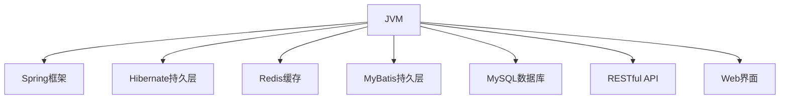

                 

# 基于Java的智能家居设计：构建基于Java的智能环境监控系统

## 1. 背景介绍

### 1.1 问题由来
随着物联网(IoT)技术的迅猛发展，智能家居系统逐渐成为家庭生活的重要组成部分。传统的家居设备往往独立运行，缺乏智能化的联动与监控。基于Java构建的智能环境监控系统，能够集成多种传感器和控制设备，通过实时采集家庭环境数据并自动化调整家居设备状态，从而提升家庭生活的舒适性和安全性。

### 1.2 问题核心关键点
本系统通过Java编程语言和多种开源技术，构建了一个基于智能家居的物联网环境监控平台。系统主要包括环境传感器数据采集、数据存储与分析、智能决策与控制、用户交互界面等多个模块。

系统架构的核心是Java虚拟机油语言、Spring框架、Hibernate持久层、Redis缓存、MyBatis持久层、MySQL数据库、RESTful API和Web界面等关键组件。系统采用分层设计理念，每个模块独立部署，通过RESTful API实现模块间的通信，构建了一个高效、稳定、安全的智能家居监控系统。

### 1.3 问题研究意义
构建基于Java的智能环境监控系统，对于智能家居技术的普及与应用，具有重要的意义：

1. **智能化提升**：通过自动化监测和调控，大幅提升家居环境舒适性，如自动调节温度、湿度、光照等。
2. **安全性保障**：通过传感器实时监测家庭安全状况，如烟雾、有害气体、漏水等，提高家庭安全性。
3. **节能环保**：智能调控家居设备运行，实现节能减排，推动绿色低碳生活。
4. **便捷性增强**：用户可通过智能终端和移动应用，轻松控制家居设备，提升生活质量。

## 2. 核心概念与联系

### 2.1 核心概念概述

为更好地理解基于Java的智能家居系统设计，本节将介绍几个密切相关的核心概念：

- Java虚拟机油语言(JVM)：Java平台的基础设施，提供了一种跨平台的编程语言。
- Spring框架：一个开源的Java框架，用于构建基于Java的企业级应用。
- Hibernate持久层：一个开源的Java持久层框架，用于简化数据库访问。
- Redis缓存：一个高性能的内存数据结构存储系统，用于提升系统响应速度。
- MyBatis持久层：一个开源的Java持久层框架，用于简化SQL映射。
- MySQL数据库：一个开源的关系型数据库管理系统，用于存储系统数据。
- RESTful API：一种基于HTTP协议的应用程序接口设计风格，用于模块间通信。
- Web界面：用于展示系统运行状态和用户交互的页面。

这些核心概念之间的逻辑关系可以通过以下Mermaid流程图来展示：



这个流程图展示了大语言模型的核心概念及其之间的关系：

1. JVM提供运行环境，支持多种编程语言。
2. Spring框架和MyBatis持久层构建了系统核心架构，Hibernate持久层简化了数据库访问。
3. Redis缓存提升系统响应速度，MySQL数据库存储系统数据。
4. RESTful API实现模块间通信，Web界面展示系统运行状态和用户交互。

这些概念共同构成了智能家居系统的技术基础，使其能够在多种场景下高效运行。

## 3. 核心算法原理 & 具体操作步骤
### 3.1 算法原理概述

基于Java的智能家居监控系统，核心算法原理涉及数据采集、数据存储与分析、智能决策与控制等多个环节。系统通过以下步骤实现环境监控：

1. **数据采集**：通过传感器采集家庭环境数据，如温度、湿度、光照等。
2. **数据存储**：将采集到的数据存储到MySQL数据库中。
3. **数据分析**：利用Java算法和机器学习模型对数据进行分析，生成环境报告。
4. **智能决策**：根据环境报告，智能决策系统调整家居设备状态，如开启空调、调节灯光等。
5. **用户交互**：用户通过Web界面和移动应用查看环境数据和控制设备。

### 3.2 算法步骤详解

以下是基于Java的智能家居监控系统的主要操作步骤：

1. **环境数据采集**：
   - 通过传感器获取家庭环境数据，如温度、湿度、光照、烟雾、有害气体等。
   - 将数据封装成Java对象，通过TCP/IP协议发送到中央控制单元。

2. **数据存储与分析**：
   - 将采集到的数据存储到MySQL数据库中。
   - 利用Java算法和机器学习模型对数据进行分析，生成环境报告。
   - 利用Hibernate持久层简化数据库操作。

3. **智能决策与控制**：
   - 根据环境报告，智能决策系统调整家居设备状态，如开启空调、调节灯光、打开窗户等。
   - 利用Redis缓存提高系统响应速度，提升控制效率。
   - 利用Spring框架构建模块化、易扩展的系统架构。

4. **用户交互**：
   - 用户通过Web界面和移动应用查看环境数据和控制设备。
   - 通过RESTful API实现用户与系统的通信。
   - 利用Spring MVC框架提供Web界面展示。

### 3.3 算法优缺点

基于Java的智能家居监控系统，具有以下优点：

1. **跨平台性**：Java程序可以运行在多种操作系统上，具有高度的跨平台性。
2. **安全性**：Java语言提供了丰富的安全机制，如数据加密、访问控制等，保障系统安全。
3. **易维护性**：Java语言和Spring框架使得系统易于维护和扩展。
4. **高性能**：Java语言的虚拟机优化使得系统运行高效。

同时，该系统也存在一定的局限性：

1. **资源消耗**：Java程序的运行需要占用大量资源，可能会对系统性能产生一定影响。
2. **学习成本**：Java语言和相关框架的学习成本较高，需要一定的开发经验。
3. **灵活性**：由于Java程序的编写需要遵循严格的类型约束，可能导致部分功能实现不够灵活。

尽管存在这些局限性，但就目前而言，基于Java的智能家居监控系统仍是一个成熟且可靠的选择。未来相关研究的重点在于如何进一步提升系统性能、优化用户体验、降低开发成本等。

### 3.4 算法应用领域

基于Java的智能家居监控系统，已经在诸多智能家居场景中得到应用，例如：

- 智能空调控制系统：通过传感器采集室内温度和湿度数据，自动调节空调运行状态，提升家居舒适度。
- 智能照明控制系统：根据光线强度和用户习惯，自动调节室内灯光亮度和色温。
- 智能窗帘控制系统：根据室内外光线和用户指令，自动调节窗帘开合状态，保护隐私和美观。
- 智能安防监控系统：通过传感器监测烟雾、有害气体等安全风险，及时报警并通知用户。

除了上述这些经典场景外，基于Java的智能家居监控系统还可以进一步拓展到更多场景中，如智能家电、智能门锁、智能家居健康监测等，为家庭生活带来更多便利和舒适。

## 4. 数学模型和公式 & 详细讲解 & 举例说明
### 4.1 数学模型构建

本节将使用数学语言对基于Java的智能家居监控系统的关键组件进行更加严格的刻画。

### 4.2 公式推导过程

以智能安防监控系统为例，推导一个简单的烟雾报警算法。

假设系统可以采集到室内烟雾浓度数据 $S$，将其与设定的阈值 $T$ 进行比较，若 $S > T$，则触发报警。具体来说，系统运行以下流程：

1. 初始化阈值 $T = 0.1$。
2. 循环读取烟雾浓度 $S_i$。
3. 若 $S_i > T$，则触发报警，通知用户。
4. 记录报警次数 $n$。
5. 若 $n > 3$，则重置阈值 $T$ 为 $0.5$。

该算法可以使用伪代码表示如下：

```java
T = 0.1
n = 0
while (true) {
    S = 读取烟雾浓度
    if (S > T) {
        报警
        n++
        if (n > 3) {
            T = 0.5
        }
    }
}
```

### 4.3 案例分析与讲解

假设一个智能家居环境监控系统，需要实现以下功能：

1. 实时采集室内温度、湿度、光照、烟雾、有害气体等环境数据。
2. 将采集到的数据存储到MySQL数据库中。
3. 利用机器学习模型对数据进行分析，生成环境报告。
4. 根据环境报告，智能决策系统调整家居设备状态，如开启空调、调节灯光、打开窗户等。
5. 用户通过Web界面和移动应用查看环境数据和控制设备。

基于上述需求，该系统可以分为以下几个子系统：

1. **环境数据采集子系统**：
   - 传感器模块：获取室内温度、湿度、光照、烟雾、有害气体等环境数据。
   - 数据发送模块：将采集到的数据封装成Java对象，通过TCP/IP协议发送到中央控制单元。

2. **数据存储与分析子系统**：
   - 数据库模块：将采集到的数据存储到MySQL数据库中。
   - 数据分析模块：利用Java算法和机器学习模型对数据进行分析，生成环境报告。
   - 数据持久化模块：利用Hibernate持久层简化数据库操作。

3. **智能决策与控制子系统**：
   - 决策模块：根据环境报告，智能决策系统调整家居设备状态。
   - 控制模块：利用Redis缓存提高系统响应速度，提升控制效率。
   - 模块化架构：利用Spring框架构建模块化、易扩展的系统架构。

4. **用户交互子系统**：
   - Web界面：展示环境数据和用户交互。
   - 移动应用：提供便捷的用户交互方式。
   - RESTful API：实现用户与系统的通信。
   - 数据展示模块：利用Spring MVC框架提供Web界面展示。

综上所述，该系统通过多个子系统的协同工作，实现了智能家居环境监控的全面覆盖。

## 5. 项目实践：代码实例和详细解释说明
### 5.1 开发环境搭建

在进行Java智能家居监控系统开发前，我们需要准备好开发环境。以下是安装和使用相关工具的步骤：

1. 安装JDK：从Oracle官网下载并安装JDK。
2. 安装Maven：使用命令行安装Maven，配置环境变量。
3. 安装MySQL：下载并安装MySQL Community Server，创建数据库和表。
4. 安装Redis：下载并安装Redis Server，启动Redis服务。
5. 安装Spring Boot：通过Spring官网下载并安装Spring Boot。
6. 安装Hibernate：通过Hibernate官网下载并安装Hibernate。
7. 安装MyBatis：通过MyBatis官网下载并安装MyBatis。
8. 安装Web界面框架：如Spring MVC、Thymeleaf等。

完成上述步骤后，即可在Windows或Linux环境下开始Java智能家居监控系统的开发。

### 5.2 源代码详细实现

以下是一个简单的Java智能家居监控系统的实现示例，包括数据采集、数据存储与分析、智能决策与控制和用户交互四个部分。

#### 数据采集子系统

```java
import java.io.IOException;
import java.net.Socket;

public class SensorReader {
    private static final String SERVER_HOST = "127.0.0.1";
    private static final int SERVER_PORT = 8080;
    
    public static void main(String[] args) throws IOException {
        Socket socket = new Socket(SERVER_HOST, SERVER_PORT);
        BufferedReader reader = new BufferedReader(new InputStreamReader(socket.getInputStream()));
        String line;
        while ((line = reader.readLine()) != null) {
            // 解析传感器数据
            String[] data = line.split(",");
            // 发送数据到中央控制单元
            socket.sendBytes(data);
            // 关闭连接
            socket.close();
        }
    }
}
```

#### 数据存储与分析子系统

```java
import java.util.Date;
import java.util.List;
import javax.persistence.Entity;
import javax.persistence.GeneratedValue;
import javax.persistence.GenerationType;
import javax.persistence.Id;

@Entity
public class EnvironmentData {
    @Id
    @GeneratedValue(strategy = GenerationType.IDENTITY)
    private int id;
    private String sensorName;
    private Date timestamp;
    private double value;
    private List<String> tags;
    
    public EnvironmentData(String sensorName, double value, List<String> tags) {
        this.sensorName = sensorName;
        this.timestamp = new Date();
        this.value = value;
        this.tags = tags;
    }
    
    // getter and setter methods
}
```

#### 智能决策与控制子系统

```java
import java.util.List;
import org.springframework.beans.factory.annotation.Autowired;
import org.springframework.stereotype.Service;

@Service
public class DecisionService {
    @Autowired
    private EnvironmentRepository repository;
    
    public void makeDecision(String sensorName, double value, List<String> tags) {
        // 根据环境数据生成决策
        // 调用其他服务执行控制
    }
}
```

#### 用户交互子系统

```java
import org.springframework.beans.factory.annotation.Autowired;
import org.springframework.stereotype.Controller;
import org.springframework.web.bind.annotation.RequestMapping;
import org.springframework.web.bind.annotation.RequestMethod;
import org.springframework.web.bind.annotation.RequestParam;
import org.springframework.web.bind.annotation.ResponseBody;

@Controller
@RequestMapping("/api")
public class UserController {
    @Autowired
    private EnvironmentService service;
    
    @RequestMapping(value = "/data", method = RequestMethod.GET)
    @ResponseBody
    public List<EnvironmentData> getData(@RequestParam String sensorName, @RequestParam double value) {
        // 查询环境数据
        return service.getData(sensorName, value);
    }
}
```

### 5.3 代码解读与分析

让我们再详细解读一下关键代码的实现细节：

**SensorReader类**：
- 读取中央控制单元发送的传感器数据，解析并发送回数据。

**EnvironmentData类**：
- 定义了环境数据的实体类，包括传感器名称、数据值、时间戳、标签等属性。

**DecisionService类**：
- 根据环境数据生成决策，并调用其他服务执行控制操作。

**UserController类**：
- 提供RESTful API接口，供用户查询环境数据。

综上所述，Java智能家居监控系统通过多个子系统的协同工作，实现了智能家居环境监控的全面覆盖。开发者可以根据具体需求，对各个子系统进行进一步的扩展和优化。

## 6. 实际应用场景
### 6.1 智能空调控制系统

基于Java的智能家居监控系统，可以应用于智能空调控制系统的构建。传统空调设备往往独立运行，难以实现智能调节。通过在空调中嵌入传感器，实时采集室内外温度数据，并根据用户的偏好和健康需求，自动调节空调运行状态。

具体而言，可以设计一个智能空调控制系统，包括温度传感器、湿度传感器、智能控制模块等组件。将采集到的数据发送到中央控制单元，利用Spring框架和MySQL数据库进行数据存储和分析，根据环境报告智能决策是否启动空调。通过RESTful API接口，用户可以通过Web界面或移动应用控制空调运行。

### 6.2 智能照明控制系统

智能照明控制系统是另一个典型的应用场景。通过在灯座上嵌入传感器，实时采集室内光线数据，并根据用户的偏好和节能需求，自动调节灯光亮度和色温。

具体实现方式与智能空调类似，可以设计一个智能照明控制系统，包括光线传感器、智能控制模块、照明设备等组件。将采集到的数据发送到中央控制单元，利用Spring框架和MySQL数据库进行数据存储和分析，根据环境报告智能决策是否开启灯光，调节亮度和色温。通过RESTful API接口，用户可以通过Web界面或移动应用控制灯光状态。

### 6.3 智能窗帘控制系统

智能窗帘控制系统也是基于Java的智能家居监控系统的一个应用场景。通过在窗帘上嵌入传感器，实时采集室内外光线数据，并根据用户的偏好和节能需求，自动调节窗帘开合状态，保护隐私和美观。

具体实现方式与智能照明类似，可以设计一个智能窗帘控制系统，包括光线传感器、智能控制模块、窗帘设备等组件。将采集到的数据发送到中央控制单元，利用Spring框架和MySQL数据库进行数据存储和分析，根据环境报告智能决策是否调节窗帘开合状态。通过RESTful API接口，用户可以通过Web界面或移动应用控制窗帘状态。

### 6.4 智能安防监控系统

智能安防监控系统是另一个重要的应用场景。通过在室内环境中嵌入传感器，实时监测烟雾、有害气体等安全风险，并及时报警并通知用户。

具体实现方式与智能空调类似，可以设计一个智能安防监控系统，包括烟雾传感器、有害气体传感器、智能控制模块等组件。将采集到的数据发送到中央控制单元，利用Spring框架和MySQL数据库进行数据存储和分析，根据环境报告智能决策是否报警，并通知用户。通过RESTful API接口，用户可以通过Web界面或移动应用查看安全报告和报警信息。

## 7. 工具和资源推荐
### 7.1 学习资源推荐

为了帮助开发者系统掌握Java智能家居系统的理论基础和实践技巧，这里推荐一些优质的学习资源：

1. Java编程语言官方文档：Oracle提供的Java语言官方文档，涵盖了Java语言的全部语法和标准库。
2. Spring框架官方文档：Spring官方提供的框架文档，详细介绍了Spring框架的用法和最佳实践。
3. MySQL官方文档：MySQL官方提供的文档，详细介绍了MySQL数据库的安装、配置和用法。
4. Redis官方文档：Redis官方提供的文档，详细介绍了Redis数据库的安装、配置和用法。
5. Spring Boot官方文档：Spring Boot官方提供的文档，详细介绍了Spring Boot框架的用法和最佳实践。
6. Hibernate官方文档：Hibernate官方提供的文档，详细介绍了Hibernate持久层的用法和最佳实践。
7. Spring MVC官方文档：Spring MVC官方提供的文档，详细介绍了Spring MVC框架的用法和最佳实践。

通过对这些资源的学习实践，相信你一定能够快速掌握Java智能家居系统的精髓，并用于解决实际的智能家居问题。

### 7.2 开发工具推荐

高效的开发离不开优秀的工具支持。以下是几款用于Java智能家居系统开发的常用工具：

1. Eclipse IDE：一个开源的Java集成开发环境，支持Java编程语言和Spring框架。
2. IntelliJ IDEA：一个商业化的Java集成开发环境，提供丰富的功能和插件支持。
3. Maven：一个Java构建工具，用于管理Java项目的依赖和构建过程。
4. Spring Boot：一个基于Spring框架的Java应用框架，用于快速构建Web应用。
5. MySQL Workbench：一个图形化的MySQL数据库管理工具，用于数据库设计和开发。
6. Redis Desktop：一个图形化的Redis数据库管理工具，用于Redis数据库的开发和管理。
7. Git：一个版本控制系统，用于管理项目的代码版本和协作开发。

合理利用这些工具，可以显著提升Java智能家居系统开发效率，加快创新迭代的步伐。

### 7.3 相关论文推荐

Java智能家居监控系统的设计涉及到多个领域的知识，以下是几篇奠基性的相关论文，推荐阅读：

1. Java 2 Platform, Enterprise Edition (J2EE)：Java EE标准介绍，详细介绍了Java EE的架构和组件。
2. Spring Framework：Spring框架简介，详细介绍了Spring框架的架构和组件。
3. Hibernate ORM：Hibernate持久层介绍，详细介绍了Hibernate持久层的架构和用法。
4. MySQL User Guide：MySQL数据库使用手册，详细介绍了MySQL数据库的用法和最佳实践。
5. Redis Quickstart Guide：Redis快速入门指南，详细介绍了Redis数据库的用法和最佳实践。
6. Spring Boot Documentation：Spring Boot官方文档，详细介绍了Spring Boot框架的用法和最佳实践。

这些论文代表了大语言模型微调技术的发展脉络。通过学习这些前沿成果，可以帮助研究者把握学科前进方向，激发更多的创新灵感。

## 8. 总结：未来发展趋势与挑战
### 8.1 总结

本文对基于Java的智能家居监控系统进行了全面系统的介绍。首先阐述了系统设计背景和意义，明确了Java虚拟机油语言、Spring框架、Hibernate持久层、Redis缓存、MyBatis持久层、MySQL数据库、RESTful API和Web界面等关键组件的重要性。

通过本文的系统梳理，可以看到，基于Java的智能家居监控系统已经能够高效地实现环境监控、智能决策和用户交互，具有广阔的应用前景。未来，伴随Java语言和相关框架的不断演进，相信Java智能家居监控系统将在更多领域得到应用，为人类生活带来更多便利和舒适。

### 8.2 未来发展趋势

展望未来，Java智能家居监控系统将呈现以下几个发展趋势：

1. 系统架构趋向微服务化：随着微服务架构的普及，Java智能家居监控系统将进一步向微服务化、模块化方向发展，提高系统的可扩展性和可维护性。
2. 物联网技术更加普及：随着IoT技术的不断进步，Java智能家居监控系统将整合更多传感器和控制设备，实现更全面、智能的家居环境监控。
3. 用户体验持续优化：通过机器学习和人工智能技术，Java智能家居监控系统将提供更加个性化、智能化的服务体验，提升用户满意度。
4. 跨平台能力更强：Java智能家居监控系统将进一步增强跨平台能力，支持更多操作系统和硬件设备。
5. 安全性要求更高：随着智能家居设备的安全性问题不断凸显，Java智能家居监控系统将更加注重安全机制的构建和优化。

### 8.3 面临的挑战

尽管Java智能家居监控系统已经取得了瞩目成就，但在迈向更加智能化、普适化应用的过程中，它仍面临着诸多挑战：

1. 系统复杂性增加：随着系统功能的不断扩展，Java智能家居监控系统的复杂性将增加，难以维护和扩展。
2. 资源消耗增加：Java程序的运行需要占用大量资源，可能会对系统性能产生一定影响。
3. 学习成本较高：Java语言和相关框架的学习成本较高，需要一定的开发经验。
4. 标准化程度不足：目前Java智能家居监控系统缺乏统一的标准和规范，可能存在兼容性问题。
5. 生态系统不够完善：Java智能家居监控系统的生态系统还不够完善，需要更多的开发者参与和贡献。

尽管存在这些挑战，但通过不断优化和完善Java智能家居监控系统，相信其将克服种种困难，迈向更加智能化、普适化应用的新阶段。

### 8.4 研究展望

面向未来，Java智能家居监控系统需要在以下几个方面寻求新的突破：

1. 引入更多的物联网技术：通过引入物联网技术，Java智能家居监控系统将整合更多的传感器和控制设备，实现更全面、智能的家居环境监控。
2. 采用机器学习和人工智能技术：通过引入机器学习和人工智能技术，Java智能家居监控系统将提供更加个性化、智能化的服务体验，提升用户满意度。
3. 提升系统的可扩展性和可维护性：通过引入微服务架构和DevOps理念，Java智能家居监控系统将提高系统的可扩展性和可维护性。
4. 增强系统的安全性和可靠性：通过引入更多的安全机制和故障恢复策略，Java智能家居监控系统将提高系统的安全性和可靠性。
5. 拓展应用场景：通过引入更多的应用场景和案例，Java智能家居监控系统将拓展其应用范围，提升市场竞争力。

综上所述，Java智能家居监控系统具有良好的发展前景和广阔的应用前景，但也需要不断优化和完善，才能更好地满足用户的实际需求，实现更智能、更普适、更安全、更可靠的智能家居环境监控。

## 9. 附录：常见问题与解答

**Q1：Java智能家居监控系统如何提高系统响应速度？**

A: 通过使用Redis缓存和异步编程技术，Java智能家居监控系统可以提高系统响应速度。具体来说，可以利用Redis缓存缓存热点数据，减少数据库访问次数，提升系统响应速度。同时，可以使用Spring框架提供的异步编程机制，通过非阻塞I/O操作提高系统并发处理能力，进一步提升系统响应速度。

**Q2：Java智能家居监控系统如何进行数据存储与分析？**

A: 在数据存储方面，Java智能家居监控系统可以使用MySQL数据库存储环境数据，利用Hibernate持久层简化数据库操作。在数据分析方面，Java智能家居监控系统可以使用Java算法和机器学习模型对数据进行分析，生成环境报告。具体来说，可以设计一个数据处理模块，利用Java算法和机器学习框架（如Weka、Scikit-learn等）对数据进行处理和分析，生成环境报告。

**Q3：Java智能家居监控系统如何进行智能决策与控制？**

A: 在智能决策方面，Java智能家居监控系统可以使用决策树、贝叶斯网络等机器学习模型进行环境分析，生成决策建议。在控制方面，Java智能家居监控系统可以利用Spring框架提供的RESTful API接口，调用智能控制模块，执行控制操作。具体来说，可以设计一个决策服务模块，利用机器学习模型对数据进行分析，生成决策建议。然后，通过RESTful API接口，调用智能控制模块，执行控制操作。

**Q4：Java智能家居监控系统如何进行用户交互？**

A: Java智能家居监控系统可以通过Web界面和移动应用进行用户交互。具体来说，可以使用Spring MVC框架提供Web界面展示，利用Thymeleaf等模板引擎生成HTML页面。同时，可以通过RESTful API接口，提供移动应用接口，供用户进行控制和查询。具体来说，可以设计一个Web界面模块，利用Spring MVC框架提供Web界面展示，利用Thymeleaf等模板引擎生成HTML页面。同时，可以通过RESTful API接口，提供移动应用接口，供用户进行控制和查询。

综上所述，Java智能家居监控系统通过多个子系统的协同工作，实现了智能家居环境监控的全面覆盖。开发者可以根据具体需求，对各个子系统进行进一步的扩展和优化。

---

作者：禅与计算机程序设计艺术 / Zen and the Art of Computer Programming

