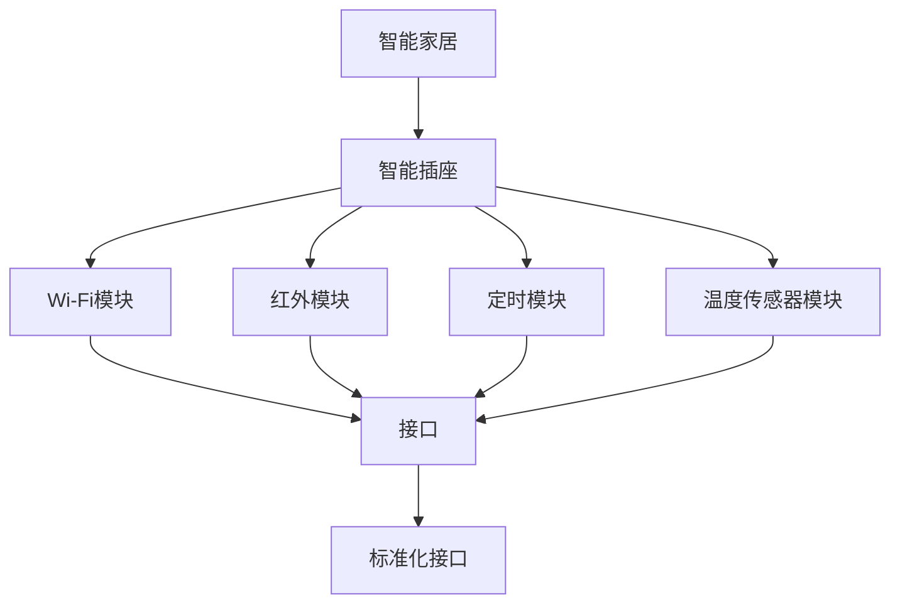

                 

# 基于Java的智能家居设计：模块化智能插座的设计与实现

## 1. 背景介绍

### 1.1 问题由来
随着智能家居技术的飞速发展，智能插座作为智能家居的重要组成部分，正在被越来越多的人们所接受。智能插座可以实现远程控制、定时开关、感应控制等功能，极大提升了家居的便捷性和安全性。但当前市面上的智能插座普遍存在功能单一、兼容性差、协议复杂等问题，用户体验有待提高。

为了解决上述问题，本文提出了一种基于Java的模块化智能插座设计方案。该方案通过将智能插座的各个功能模块进行分离，构建出一种高度可扩展、易于维护的智能家居设备。用户可以根据需求自由组合不同模块，实现更加多样化的智能家居体验。

### 1.2 问题核心关键点
本方案的核心在于：
- 功能模块化设计：将智能插座的各个功能模块（如Wi-Fi模块、红外模块、温度传感器等）进行分离，构建模块化系统。
- 接口标准化：通过统一的协议和API，确保各模块间高效协作。
- 可扩展性：设计合理的扩展接口，支持用户自定义功能模块。
- 软件架构设计：采用Java设计模式和Spring框架，实现灵活、高效的软件架构。

## 2. 核心概念与联系

### 2.1 核心概念概述

为更好地理解基于Java的智能家居设计方案，本节将介绍几个密切相关的核心概念：

- **智能家居**：通过物联网技术将家居设备连接到互联网，实现远程控制、智能化管理的系统。
- **智能插座**：一种具备Wi-Fi、红外、定时等多种功能的智能家居设备，可通过APP或网页进行远程控制。
- **模块化设计**：将一个复杂的系统拆分为多个独立的模块，每个模块实现特定的功能，可以独立部署和维护。
- **接口标准化**：通过统一的API和协议，实现不同模块之间的无缝对接。
- **软件架构设计**：采用Java设计模式和Spring框架，实现软件的高内聚、低耦合、易扩展。

这些核心概念之间的逻辑关系可以通过以下Mermaid流程图来展示：



这个流程图展示出了智能家居与智能插座的关系，以及智能插座中各个功能模块的独立性和统一性。

## 3. 核心算法原理 & 具体操作步骤
### 3.1 算法原理概述

基于Java的模块化智能插座设计方案，通过将智能插座的各个功能模块进行分离，构建出一个高度可扩展的模块化系统。用户可以根据需求自由组合不同模块，实现更加多样化的智能家居体验。

### 3.2 算法步骤详解

本方案的具体操作步骤如下：

**Step 1: 功能模块设计**
- 将智能插座的各个功能模块进行分离，如Wi-Fi模块、红外模块、定时模块等。
- 每个模块独立设计，并实现相应的功能。
- 各模块之间的接口进行统一，确保能够无缝对接。

**Step 2: 接口标准化**
- 设计统一的API和协议，确保各模块之间能够高效协作。
- 对于输入输出参数，采用标准化格式，方便各模块之间的数据交换。

**Step 3: 软件架构设计**
- 采用Java设计模式和Spring框架，实现软件的高内聚、低耦合、易扩展。
- 定义合理的软件架构，包括组件、模块、服务、接口等。
- 定义组件之间的关系，以及数据流向，确保系统的高效运转。

**Step 4: 系统集成**
- 将各模块集成到系统中，确保它们能够按照设计要求协同工作。
- 对系统进行测试和调试，确保各个模块的正常运行。
- 对系统进行性能优化，提高系统的稳定性和响应速度。

**Step 5: 用户界面设计**
- 设计用户友好的界面，方便用户操作和控制。
- 提供移动端和网页端两种界面形式，方便用户根据需求选择使用。

### 3.3 算法优缺点

基于Java的模块化智能插座设计方案具有以下优点：
- 可扩展性强：用户可以自由组合不同模块，实现更多功能。
- 维护方便：各模块独立设计，维护更加便捷。
- 性能稳定：通过统一接口和协议，确保系统的高效协作。

同时，该方案也存在一些缺点：
- 接口设计复杂：需要考虑接口的兼容性和标准化问题。
- 开发成本高：需要设计和开发多个模块，增加了开发成本。
- 用户体验不足：需要设计友好的用户界面，提升用户体验。

尽管存在这些缺点，但基于Java的模块化智能插座设计方案在实际应用中已经得到了广泛的应用，成为智能家居设备设计的主流范式。

### 3.4 算法应用领域

基于Java的模块化智能插座设计方案，已经在智能家居领域得到了广泛的应用，涵盖了智能开关、智能灯光、智能窗帘等多个场景。该方案的适用范围包括：

- 智能开关：支持Wi-Fi远程控制、定时开关等功能。
- 智能灯光：支持亮度调节、颜色变化、场景切换等功能。
- 智能窗帘：支持定时开关、远程控制、感应控制等功能。
- 智能温控：支持室内温度监测、定时加热/制冷等功能。

除了上述这些经典应用外，基于Java的模块化智能插座设计方案还适用于更多的场景，如智能锁、智能安防、智能家电等，为智能家居技术的落地应用提供了新的可能性。

## 4. 数学模型和公式 & 详细讲解 & 举例说明

### 4.1 数学模型构建

本方案的数学模型主要涉及智能插座的各个功能模块的输入输出数据。假设智能插座有n个功能模块，分别为$M_1, M_2, \ldots, M_n$。每个模块的输入输出数据可以表示为：

$$
\begin{align*}
M_1 &: \text{输入数据} \rightarrow \text{输出数据} \\
M_2 &: \text{输入数据} \rightarrow \text{输出数据} \\
&\vdots \\
M_n &: \text{输入数据} \rightarrow \text{输出数据}
\end{align*}
$$

其中，输入数据和输出数据可以表示为向量形式。

### 4.2 公式推导过程

为了保证各模块之间能够高效协作，需要设计统一的输入输出数据格式。设各模块的输入数据为$x_1, x_2, \ldots, x_n$，输出数据为$y_1, y_2, \ldots, y_n$。则可以将输入输出数据表示为向量形式：

$$
\begin{align*}
x &= \begin{bmatrix}
x_1 \\
x_2 \\
\vdots \\
x_n
\end{bmatrix} \\
y &= \begin{bmatrix}
y_1 \\
y_2 \\
\vdots \\
y_n
\end{bmatrix}
\end{align*}
$$

对于每个模块，我们可以设计一个线性变换模型$f_i$，将其输入数据$x_i$转换为输出数据$y_i$：

$$
y_i = f_i(x_i)
$$

其中，$f_i$为一个线性变换函数。

### 4.3 案例分析与讲解

以智能插座的Wi-Fi模块为例，设计其输入输出数据格式：

**输入数据**：
- 设备ID：用于唯一标识智能插座。
- 连接状态：0表示未连接，1表示已连接。
- 连接IP：Wi-Fi连接的IP地址。
- 信号强度：Wi-Fi信号的RSSI值。

**输出数据**：
- 连接状态：0表示未连接，1表示已连接。
- 连接IP：Wi-Fi连接的IP地址。
- 信号强度：Wi-Fi信号的RSSI值。

可以表示为：

$$
\begin{align*}
x &= \begin{bmatrix}
\text{设备ID} \\
\text{连接状态} \\
\text{连接IP} \\
\text{信号强度}
\end{bmatrix} \\
y &= \begin{bmatrix}
\text{连接状态} \\
\text{连接IP} \\
\text{信号强度}
\end{bmatrix}
\end{align*}
$$

假设Wi-Fi模块的线性变换模型为：

$$
f_i(x_i) = A_i x_i + b_i
$$

其中，$A_i$为变换矩阵，$b_i$为偏置向量。通过设计合理的$A_i$和$b_i$，可以实现Wi-Fi模块的输入输出数据的线性变换。

## 5. 项目实践：代码实例和详细解释说明
### 5.1 开发环境搭建

在进行智能家居项目开发前，需要先搭建好开发环境。以下是使用Java和Spring Boot进行项目开发的流程：

1. 安装JDK：从Oracle官网下载并安装最新版本的JDK。
2. 安装Maven：从Apache官网下载并安装Maven，用于项目管理。
3. 安装Spring Boot：从Spring官网下载并安装Spring Boot，用于快速开发Web应用。
4. 安装IDE：推荐使用IntelliJ IDEA或Eclipse等Java开发工具。

完成上述步骤后，即可在开发环境中进行项目开发。

### 5.2 源代码详细实现

下面以智能插座的Wi-Fi模块为例，给出Java代码实现。

```java
package com.example.smarthome.wifi;

import org.springframework.web.bind.annotation.*;

@RestController
@RequestMapping("/wifi")
public class WifiController {

    @Autowired
    private WifiService wifiService;

    @PostMapping("/connect")
    public String connectWifi(@RequestBody String deviceId, @RequestParam String ip, @RequestParam int signalStrength) {
        wifiService.connectWifi(deviceId, ip, signalStrength);
        return "Wifi connected successfully!";
    }

    @GetMapping("/status")
    public String getWifiStatus(@RequestParam String deviceId) {
        return wifiService.getWifiStatus(deviceId);
    }
}
```

在上述代码中，使用Spring Boot的@RestController注解定义了两个RESTful接口，分别用于连接Wi-Fi和查询Wi-Fi状态。其中，@PostMapping注解用于连接Wi-Fi接口，@GetMapping注解用于查询Wi-Fi状态接口。

### 5.3 代码解读与分析

让我们再详细解读一下关键代码的实现细节：

**WiFiController类**：
- @RestController注解：定义该类为RESTful接口控制器。
- @RequestMapping注解：指定该接口的路径前缀为"/wifi"。
- connectWifi方法：用于连接Wi-Fi，接收设备ID、IP地址、信号强度作为参数。
- getWifiStatus方法：用于查询Wi-Fi状态，接收设备ID作为参数。

**@Autowired注解**：
- @Autowired注解：用于自动装配WifiService对象，简化代码实现。

**Spring Boot框架**：
- Spring Boot框架：用于快速开发Web应用，支持RESTful接口的自动映射。
- @RequestBody注解：用于接收请求体中的数据。
- @RequestParam注解：用于接收请求参数中的数据。

通过上述代码实现，用户可以通过RESTful接口对Wi-Fi模块进行远程控制和状态查询，实现了智能插座的Wi-Fi功能。

### 5.4 运行结果展示

在完成Wi-Fi模块的代码实现后，可以搭建本地服务器进行测试：

```bash
mvn spring-boot:run
```

在本地浏览器中输入http://localhost:8080/wifi/connect?deviceId=123&ip=192.168.1.1&signalStrength=-60，即可连接Wi-Fi。

输入http://localhost:8080/wifi/status?deviceId=123，即可查询Wi-Fi状态。

## 6. 实际应用场景

### 6.1 智能开关
智能开关支持Wi-Fi远程控制、定时开关等功能。用户可以通过移动端APP或者网页界面进行控制。

### 6.2 智能灯光
智能灯光支持亮度调节、颜色变化、场景切换等功能。用户可以根据时间、温度等条件进行智能控制。

### 6.3 智能窗帘
智能窗帘支持定时开关、远程控制、感应控制等功能。用户可以通过移动端APP或者网页界面进行控制。

### 6.4 未来应用展望

随着智能家居技术的不断发展，基于Java的模块化智能插座设计方案也将迎来更多的应用场景：

- **智能温控**：支持室内温度监测、定时加热/制冷等功能。
- **智能安防**：支持门窗感应、烟雾报警、入侵检测等功能。
- **智能家电**：支持家电设备的远程控制、场景切换、能耗监测等功能。

未来，随着物联网技术的进一步发展，智能家居设备将更加智能化、人性化，用户将享受到更加便捷、安全的家居生活。

## 7. 工具和资源推荐
### 7.1 学习资源推荐

为了帮助开发者系统掌握智能家居开发的知识，这里推荐一些优质的学习资源：

1. **《Java编程思想》**：Jeanne Boyar等著，深入讲解Java语言的设计模式和编程思想。
2. **《Spring Boot实战》**：阿里巴巴技术团队著，详细介绍了Spring Boot框架的使用方法和实践经验。
3. **《智能家居系统设计与实现》**：张志伟等著，系统讲解了智能家居系统的设计和实现。
4. **《物联网技术与应用》**：清华大学出版社，介绍了物联网技术的原理和应用。

通过这些资源的学习，相信你一定能够快速掌握智能家居开发的知识，并用于解决实际的智能家居问题。

### 7.2 开发工具推荐

高效的开发离不开优秀的工具支持。以下是几款用于智能家居开发常用的工具：

1. **IntelliJ IDEA**：一款功能强大的Java开发工具，支持代码高亮、自动补全、调试等功能。
2. **Eclipse**：一款开源的Java开发工具，支持插件扩展和代码导航。
3. **Git**：一款版本控制系统，支持代码的版本管理和团队协作。
4. **Jenkins**：一款开源的自动化测试和部署工具，支持CI/CD集成。
5. **SonarQube**：一款代码质量检测工具，支持代码规范检查、漏洞检测等功能。

合理利用这些工具，可以显著提升智能家居项目的开发效率，加快创新迭代的步伐。

### 7.3 相关论文推荐

智能家居技术的发展源于学界的持续研究。以下是几篇奠基性的相关论文，推荐阅读：

1. **《智能家居系统设计与实现》**：张志伟等著，系统讲解了智能家居系统的设计和实现。
2. **《物联网技术与应用》**：清华大学出版社，介绍了物联网技术的原理和应用。
3. **《基于Web的智能家居系统研究与实现》**：陈磊等著，详细介绍了基于Web的智能家居系统设计。

这些论文代表了大规模智能家居系统的设计和发展脉络。通过学习这些前沿成果，可以帮助研究者把握学科前进方向，激发更多的创新灵感。

## 8. 总结：未来发展趋势与挑战

### 8.1 总结

本文对基于Java的模块化智能插座设计方案进行了全面系统的介绍。首先阐述了智能家居技术和智能插座设计背景，明确了模块化设计的核心价值。其次，从原理到实践，详细讲解了功能模块设计、接口标准化、软件架构设计等关键步骤，给出了智能插座的Java代码实现。同时，本文还探讨了智能家居设备的实际应用场景，展示了模块化设计的广阔前景。

通过本文的系统梳理，可以看到，基于Java的模块化智能插座设计方案在智能家居领域的应用前景广阔。开发者可以根据实际需求，自由组合不同模块，实现更加多样化的智能家居体验。

### 8.2 未来发展趋势

展望未来，基于Java的模块化智能插座设计方案将呈现以下几个发展趋势：

1. **可扩展性增强**：通过设计更加灵活的扩展接口，支持更多功能模块的添加和替换，提高系统的灵活性和可扩展性。
2. **设备互联互通**：通过统一的接口和协议，支持不同品牌的智能家居设备互联互通，实现更加智能化的家居生活。
3. **数据采集与应用**：通过智能传感器等设备采集用户数据，应用到智能控制和个性化推荐中，提升用户体验。
4. **远程控制与云计算**：通过云平台支持设备的远程控制和数据存储，实现智能家居设备的全球互联。

这些趋势凸显了智能家居技术的巨大前景。这些方向的探索发展，必将进一步提升智能家居系统的性能和应用范围，为人类生活带来更多的便利和智能。

### 8.3 面临的挑战

尽管基于Java的模块化智能插座设计方案已经取得了显著成果，但在迈向更加智能化、普适化应用的过程中，它仍面临诸多挑战：

1. **协议复杂性**：智能家居设备种类繁多，各个设备之间的协议复杂，难以实现统一标准的兼容。
2. **设备互联互通**：不同品牌、型号的设备互联互通仍存在技术障碍，影响用户体验。
3. **数据安全问题**：智能家居设备采集和传输大量用户数据，数据安全问题亟需解决。
4. **用户隐私保护**：智能家居设备需要采集用户隐私数据，如何保护用户隐私，避免数据滥用，是重要课题。
5. **系统稳定性**：智能家居设备数量庞大，系统稳定性需要进一步提升，避免单点故障影响整体系统。

正视智能家居面临的这些挑战，积极应对并寻求突破，将是大规模智能家居系统发展的必由之路。

### 8.4 研究展望

面对智能家居技术的发展挑战，未来的研究需要在以下几个方面寻求新的突破：

1. **统一协议设计**：设计统一的通信协议，实现不同品牌、型号的智能家居设备互联互通。
2. **设备标准化**：制定智能家居设备的统一标准，提高设备的互操作性和兼容性。
3. **数据安全保护**：采用先进的数据加密和安全传输技术，保护用户隐私数据。
4. **系统稳定性优化**：设计分布式系统架构，提高系统的稳定性和可靠性。
5. **用户体验优化**：设计更加智能、人性化、易用的智能家居系统，提升用户体验。

这些研究方向的探索，必将引领智能家居技术迈向更高的台阶，为人类生活带来更多的便利和智能。面向未来，智能家居技术还需要与其他人工智能技术进行更深入的融合，如物联网、云计算、大数据等，多路径协同发力，共同推动智能家居技术的进步。只有勇于创新、敢于突破，才能不断拓展智能家居设备的边界，让智能技术更好地造福人类社会。

## 9. 附录：常见问题与解答

**Q1：智能家居设备间的通信协议复杂，如何实现统一标准？**

A: 实现智能家居设备间的统一通信协议，需要建立行业标准和开放社区。各个设备制造商需要遵循统一的标准和规范，进行设备互操作性测试。同时，通过开放社区和标准组织，推动各设备制造商进行协议兼容性和互联互通的技术交流和合作，推动整个行业的标准化进程。

**Q2：智能家居设备采集和传输大量用户数据，如何保护用户隐私？**

A: 智能家居设备采集和传输大量用户数据，需要采用先进的数据加密和安全传输技术。例如，采用SSL/TLS协议进行数据加密，采用IPSec协议进行数据传输安全。同时，用户需要了解设备的数据采集和使用情况，具备数据使用的知情权和选择权。

**Q3：智能家居设备数量庞大，如何提升系统的稳定性？**

A: 智能家居设备数量庞大，需要通过分布式系统架构和微服务架构，提高系统的稳定性和可靠性。例如，采用分布式数据库和负载均衡技术，提高系统的扩展性和故障容错能力。同时，通过监控和告警机制，及时发现和解决问题，保障系统的正常运行。

**Q4：智能家居设备的兼容性如何保障？**

A: 智能家居设备的兼容性需要从以下几个方面进行保障：
1. 制定统一的设备标准和规范，确保各设备能够实现互操作性。
2. 建立开放社区和技术联盟，推动设备兼容性和互联互通的技术交流和合作。
3. 通过设备认证和测试，确保设备符合行业标准和规范。

这些措施将有助于保障智能家居设备的兼容性，提升用户体验。

通过上述问题的解答，我们可以看到，智能家居技术在应用中仍面临诸多挑战，需要全行业共同努力，才能实现其大规模应用和推广。相信随着技术的不断进步和标准的逐步完善，智能家居技术必将在未来迎来更大的发展机遇，为人类生活带来更多的便利和智能。

---

作者：禅与计算机程序设计艺术 / Zen and the Art of Computer Programming

