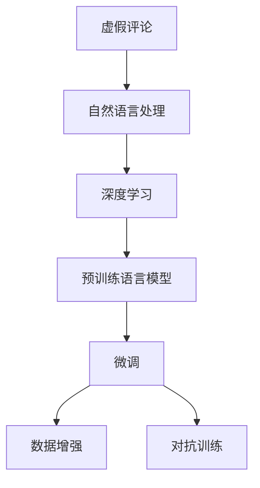

                 

# 基于NLP的虚假评论识别研究

> 关键词：虚假评论,自然语言处理,深度学习,模型微调,数据增强,对抗训练

## 1. 背景介绍

### 1.1 问题由来

虚假评论（Falsified Reviews）是指由第三方或广告商人为地创建，旨在影响产品或服务评价的评论。随着电子商务的兴起，虚假评论问题逐渐成为一种普遍存在的欺诈行为，严重扰乱市场秩序，损害消费者权益。近年来，虚假评论识别已成为研究热点，多个学术团队和企业投入大量资源研发解决方案。

虚假评论识别的挑战在于：
1. **高数量**：电商平台上评论数量巨大，欺诈评论往往混杂其中，难以手工审核。
2. **多样性**：欺诈评论形式多样，语言表达各异，难以统一规则。
3. **隐蔽性**：有些欺诈评论刻意隐藏其虚假性，难以通过简单的关键词匹配或规则过滤。

### 1.2 问题核心关键点
虚假评论识别主要依赖自然语言处理(NLP)技术，其核心在于判断评论是否真实可信。深度学习尤其是预训练语言模型（如BERT、GPT等）的兴起，为虚假评论识别提供了新思路。本文将系统介绍基于深度学习的虚假评论识别方法，包括模型构建、训练、评估和优化策略。

## 2. 核心概念与联系

### 2.1 核心概念概述

为更好地理解基于深度学习的虚假评论识别方法，本节将介绍几个密切相关的核心概念：

- **虚假评论（Falsified Reviews）**：指由第三方或广告商人为地创建，旨在影响产品或服务评价的评论。
- **自然语言处理（Natural Language Processing, NLP）**：涉及计算机如何理解和生成人类语言的技术。
- **深度学习（Deep Learning）**：基于多层神经网络，具有自动提取特征的能力，常用于自然语言处理任务。
- **预训练语言模型（Pre-trained Language Models）**：如BERT、GPT等，通过在大规模无标签文本上预训练，学习语言特征。
- **微调（Fine-tuning）**：在大规模预训练模型的基础上，通过特定任务的数据进行有监督学习，优化模型在该任务上的性能。
- **数据增强（Data Augmentation）**：通过对训练数据进行各种形式的变换，丰富训练集多样性。
- **对抗训练（Adversarial Training）**：加入对抗样本，提高模型鲁棒性。

这些核心概念之间的逻辑关系可以通过以下Mermaid流程图来展示：



这个流程图展示了大语言模型的核心概念及其之间的关系：

1. 虚假评论问题需通过自然语言处理技术解决。
2. 深度学习是解决自然语言处理问题的主要手段。
3. 预训练语言模型通过大规模无标签数据预训练，学习语言特征。
4. 微调将预训练模型在特定任务上进行优化，提升识别能力。
5. 数据增强和对抗训练可进一步提高模型的鲁棒性和泛化能力。

## 3. 核心算法原理 & 具体操作步骤

### 3.1 算法原理概述

基于深度学习的虚假评论识别方法，核心在于通过模型学习文本数据的分布特征，识别出异常的欺诈评论。其流程大致分为以下几步：

1. **数据准备**：收集标注的虚假评论和真实评论数据集。
2. **模型选择**：选择合适的预训练语言模型，如BERT、GPT等。
3. **模型微调**：在虚假评论数据集上进行微调，优化模型性能。
4. **评估与优化**：在独立测试集上评估模型性能，根据结果进行参数调优。
5. **部署应用**：将模型部署到实际应用中，实时识别新评论的虚假性。

### 3.2 算法步骤详解

以下是虚假评论识别模型的详细步骤：

**Step 1: 数据准备**

- **数据收集**：从电商网站、论坛、社交媒体等平台收集标注的虚假评论和真实评论数据。
- **数据划分**：将数据集分为训练集、验证集和测试集。一般建议将真实评论和虚假评论均衡分配到各集中，以确保模型的泛化能力。

**Step 2: 模型选择**

- **预训练模型选择**：选择适合NLP任务的预训练语言模型，如BERT、GPT等。
- **微调层选择**：选择模型中需要微调的层数，通常选择全层微调或顶层微调。

**Step 3: 模型微调**

- **损失函数**：选择合适的损失函数，如交叉熵损失、F1损失等。
- **优化器**：设置优化器及其参数，如Adam、SGD等，调整学习率。
- **正则化**：应用正则化技术，如L2正则、Dropout等，防止过拟合。
- **训练轮数**：设置训练轮数，一般从几十到几百轮不等。

**Step 4: 评估与优化**

- **模型评估**：在验证集上评估模型性能，使用精度、召回率、F1分数等指标。
- **参数调整**：根据验证集评估结果，调整模型参数，如学习率、批大小等。

**Step 5: 部署应用**

- **模型部署**：将微调后的模型部署到实际应用中，实时处理新评论。
- **实时监测**：通过API接口，实时监测新评论的虚假性，记录相关统计信息。

### 3.3 算法优缺点

基于深度学习的虚假评论识别方法，具有以下优点：

1. **高效性**：深度学习模型能够自动学习特征，识别复杂模式的欺诈评论，不需要手工设计规则。
2. **泛化能力**：预训练语言模型在大规模数据上预训练，具有较强的泛化能力。
3. **可解释性**：通过注意力机制等技术，可以可视化模型的决策过程，增强可解释性。
4. **适应性**：模型通过微调可以适应新的数据集和任务，具有较高的灵活性。

同时，该方法也存在一些局限：

1. **数据依赖**：深度学习模型需要大量高质量的标注数据，获取成本较高。
2. **过拟合风险**：在标注数据有限的情况下，深度模型容易过拟合，泛化性能下降。
3. **计算资源消耗大**：深度学习模型计算量较大，需要高性能计算资源。
4. **复杂度**：模型构建和训练过程较复杂，需要较深的技术背景。

## 4. 数学模型和公式 & 详细讲解 & 举例说明

### 4.1 数学模型构建

虚假评论识别模型通常基于文本分类任务，使用二分类模型对评论进行真实性分类。设真实评论集合为 $X_{real}$，虚假评论集合为 $X_{fake}$，则模型任务为：

$$
\min_{\theta} \mathbb{E}_{(x,y) \sim D} [\ell(M_{\theta}(x),y)]
$$

其中，$M_{\theta}$ 为预训练语言模型，$(x,y)$ 为输入输出对，$\ell$ 为损失函数。

### 4.2 公式推导过程

以BERT模型为例，其微调过程如下：

1. **输入编码**：将输入评论文本 $x$ 转换为BERT的输入格式，包括token ids、attention mask等。
2. **前向传播**：将输入文本 $x$ 输入BERT模型，得到隐状态 $h_x$。
3. **线性变换**：将隐状态 $h_x$ 通过全连接层进行线性变换，得到分类输出 $y \in \{0,1\}$。
4. **损失计算**：根据输出 $y$ 和真实标签 $y$ 计算损失函数 $\ell$，通常使用交叉熵损失。
5. **反向传播**：计算梯度并更新模型参数 $\theta$。

**交叉熵损失函数**：

$$
\ell = -\sum_{i=1}^N [y_i \log \hat{y}_i + (1-y_i) \log (1-\hat{y}_i)]
$$

其中，$y_i$ 为真实标签，$\hat{y}_i$ 为模型预测值。

**模型参数更新公式**：

$$
\theta \leftarrow \theta - \eta \nabla_{\theta} \mathcal{L}(\theta)
$$

其中，$\eta$ 为学习率，$\nabla_{\theta} \mathcal{L}(\theta)$ 为损失函数对参数的梯度。

### 4.3 案例分析与讲解

以电商平台的虚假评论识别为例，假设模型已通过微调得到较好的识别能力。使用模型评估指标如下：

1. **准确率（Accuracy）**：分类正确的评论比例。
2. **召回率（Recall）**：真实评论被正确识别的比例。
3. **F1分数（F1 Score）**：综合考虑准确率和召回率，平衡两者权重。

## 5. 项目实践：代码实例和详细解释说明

### 5.1 开发环境搭建

在进行虚假评论识别开发前，我们需要准备好开发环境。以下是使用Python进行PyTorch开发的环境配置流程：

1. 安装Anaconda：从官网下载并安装Anaconda，用于创建独立的Python环境。
2. 创建并激活虚拟环境：
```bash
conda create -n pytorch-env python=3.8 
conda activate pytorch-env
```

3. 安装PyTorch：根据CUDA版本，从官网获取对应的安装命令。例如：
```bash
conda install pytorch torchvision torchaudio cudatoolkit=11.1 -c pytorch -c conda-forge
```

4. 安装Transformers库：
```bash
pip install transformers
```

5. 安装各类工具包：
```bash
pip install numpy pandas scikit-learn matplotlib tqdm jupyter notebook ipython
```

完成上述步骤后，即可在`pytorch-env`环境中开始开发。

### 5.2 源代码详细实现

以下是使用PyTorch对BERT模型进行虚假评论识别的PyTorch代码实现。

首先，定义虚假评论识别任务的数据处理函数：

```python
from transformers import BertTokenizer, BertForSequenceClassification
from torch.utils.data import Dataset
import torch

class ReviewsDataset(Dataset):
    def __init__(self, texts, labels, tokenizer, max_len=128):
        self.texts = texts
        self.labels = labels
        self.tokenizer = tokenizer
        self.max_len = max_len
        
    def __len__(self):
        return len(self.texts)
    
    def __getitem__(self, item):
        text = self.texts[item]
        label = self.labels[item]
        
        encoding = self.tokenizer(text, return_tensors='pt', max_length=self.max_len, padding='max_length', truncation=True)
        input_ids = encoding['input_ids'][0]
        attention_mask = encoding['attention_mask'][0]
        
        # 将标签转换为id
        label_id = {'real': 1, 'fake': 0}[label]
        label = torch.tensor(label_id, dtype=torch.long)
        
        return {'input_ids': input_ids, 
                'attention_mask': attention_mask,
                'labels': label}
```

然后，定义模型和优化器：

```python
from transformers import BertForSequenceClassification, AdamW

model = BertForSequenceClassification.from_pretrained('bert-base-uncased', num_labels=2)

optimizer = AdamW(model.parameters(), lr=2e-5)
```

接着，定义训练和评估函数：

```python
from torch.utils.data import DataLoader
from tqdm import tqdm

device = torch.device('cuda') if torch.cuda.is_available() else torch.device('cpu')
model.to(device)

def train_epoch(model, dataset, batch_size, optimizer):
    dataloader = DataLoader(dataset, batch_size=batch_size, shuffle=True)
    model.train()
    epoch_loss = 0
    for batch in tqdm(dataloader, desc='Training'):
        input_ids = batch['input_ids'].to(device)
        attention_mask = batch['attention_mask'].to(device)
        labels = batch['labels'].to(device)
        model.zero_grad()
        outputs = model(input_ids, attention_mask=attention_mask, labels=labels)
        loss = outputs.loss
        epoch_loss += loss.item()
        loss.backward()
        optimizer.step()
    return epoch_loss / len(dataloader)

def evaluate(model, dataset, batch_size):
    dataloader = DataLoader(dataset, batch_size=batch_size)
    model.eval()
    preds, labels = [], []
    with torch.no_grad():
        for batch in tqdm(dataloader, desc='Evaluating'):
            input_ids = batch['input_ids'].to(device)
            attention_mask = batch['attention_mask'].to(device)
            labels = batch['labels'].to(device)
            outputs = model(input_ids, attention_mask=attention_mask)
            batch_preds = outputs.logits.argmax(dim=1).to('cpu').tolist()
            batch_labels = labels.to('cpu').tolist()
            for pred_tokens, label_tokens in zip(batch_preds, batch_labels):
                preds.append(pred_tokens)
                labels.append(label_tokens)
                
    print(classification_report(labels, preds))
```

最后，启动训练流程并在测试集上评估：

```python
epochs = 5
batch_size = 16

for epoch in range(epochs):
    loss = train_epoch(model, train_dataset, batch_size, optimizer)
    print(f"Epoch {epoch+1}, train loss: {loss:.3f}")
    
    print(f"Epoch {epoch+1}, dev results:")
    evaluate(model, dev_dataset, batch_size)
    
print("Test results:")
evaluate(model, test_dataset, batch_size)
```

以上就是使用PyTorch对BERT进行虚假评论识别任务微调的完整代码实现。可以看到，得益于Transformers库的强大封装，我们可以用相对简洁的代码完成BERT模型的加载和微调。

### 5.3 代码解读与分析

让我们再详细解读一下关键代码的实现细节：

**ReviewsDataset类**：
- `__init__`方法：初始化文本、标签、分词器等关键组件。
- `__len__`方法：返回数据集的样本数量。
- `__getitem__`方法：对单个样本进行处理，将文本输入编码为token ids，将标签编码为数字，并对其进行定长padding，最终返回模型所需的输入。

**模型和优化器定义**：
- 使用BERT模型作为初始化参数，设置num_labels为2，对应真实和虚假两类。
- 使用AdamW优化器，设置学习率为2e-5。

**训练和评估函数**：
- 使用PyTorch的DataLoader对数据集进行批次化加载，供模型训练和推理使用。
- 训练函数`train_epoch`：对数据以批为单位进行迭代，在每个批次上前向传播计算损失函数，反向传播更新模型参数。
- 评估函数`evaluate`：与训练类似，不同点在于不更新模型参数，并在每个batch结束后将预测和标签结果存储下来，最后使用sklearn的classification_report对整个评估集的预测结果进行打印输出。

**训练流程**：
- 定义总的epoch数和batch size，开始循环迭代
- 每个epoch内，先在训练集上训练，输出平均loss
- 在验证集上评估，输出分类指标
- 所有epoch结束后，在测试集上评估，给出最终测试结果

可以看到，PyTorch配合Transformers库使得虚假评论识别任务的代码实现变得简洁高效。开发者可以将更多精力放在数据处理、模型改进等高层逻辑上，而不必过多关注底层的实现细节。

当然，工业级的系统实现还需考虑更多因素，如模型的保存和部署、超参数的自动搜索、更灵活的任务适配层等。但核心的微调范式基本与此类似。

## 6. 实际应用场景

### 6.1 电商平台虚假评论识别

电商平台的虚假评论识别可以直接应用到商品评价、排行榜生成等场景中。例如，通过实时监控评论数据，自动识别并剔除虚假评论，确保评论数据的真实性和可靠性。

具体实现上，电商网站可以将用户提交的评论实时传递给虚假评论识别系统，系统自动标注每条评论的真实性，过滤掉虚假评论，保证评论数据的真实性和公正性。

### 6.2 社交媒体平台虚假评论检测

社交媒体平台上的虚假评论同样影响用户决策，甚至引发舆情。虚假评论检测可以应用于社交媒体平台的评论过滤、账号封禁等环节。

例如，微博、抖音等社交媒体平台，可以通过虚假评论检测系统，自动识别并删除虚假评论，避免对用户决策的误导。同时，系统可以追踪虚假评论的来源，进行账号封禁等操作，提升平台环境的质量。

### 6.3 新闻媒体虚假信息识别

新闻媒体平台上的虚假评论识别，可以应用于事实核查、新闻筛选等环节。例如，新闻网站可以通过虚假评论检测系统，自动识别虚假评论，确保新闻报道的真实性。

具体实现上，新闻网站可以将评论数据传递给虚假评论检测系统，系统自动标注每条评论的真实性，筛选掉虚假评论，确保新闻报道的公正性和可信度。

### 6.4 未来应用展望

随着虚假评论识别技术的不断发展，其在更多领域的应用前景将更加广阔。未来，虚假评论识别技术有望在以下领域得到深入应用：

1. **内容推荐系统**：通过识别并过滤虚假评论，提升推荐系统的准确性和可信度。
2. **舆情监控系统**：实时监测社交媒体、论坛等平台上的虚假评论，及时发现和处理虚假信息。
3. **智能客服系统**：识别并过滤掉虚假客服评论，提升客户服务质量。
4. **市场研究**：通过分析产品评价中的虚假评论，提供更准确的市场调研结果。
5. **广告投放**：识别并过滤掉虚假广告评论，提升广告投放效果。

虚假评论识别技术的发展，将进一步提升网络空间的清朗度和可信度，推动互联网环境的健康发展。相信随着技术的持续进步，虚假评论识别技术必将在更多领域大放异彩。

## 7. 工具和资源推荐

### 7.1 学习资源推荐

为了帮助开发者系统掌握虚假评论识别技术的理论基础和实践技巧，这里推荐一些优质的学习资源：

1. **《自然语言处理基础》**：介绍NLP的基本概念和经典算法，适合初学者入门。
2. **《深度学习》**：深度学习领域的经典教材，涵盖神经网络、优化算法等基础知识。
3. **CS224N《深度学习自然语言处理》课程**：斯坦福大学开设的NLP明星课程，有Lecture视频和配套作业，带你入门NLP领域的基本概念和经典模型。
4. **《NLP实战》**：系统介绍NLP实际应用，涵盖数据预处理、模型构建、训练优化等各个环节。
5. **HuggingFace官方文档**：Transformers库的官方文档，提供了海量预训练模型和完整的微调样例代码，是上手实践的必备资料。

通过对这些资源的学习实践，相信你一定能够快速掌握虚假评论识别技术的精髓，并用于解决实际的NLP问题。

### 7.2 开发工具推荐

高效的开发离不开优秀的工具支持。以下是几款用于虚假评论识别开发的常用工具：

1. **PyTorch**：基于Python的开源深度学习框架，灵活动态的计算图，适合快速迭代研究。大部分预训练语言模型都有PyTorch版本的实现。
2. **TensorFlow**：由Google主导开发的开源深度学习框架，生产部署方便，适合大规模工程应用。同样有丰富的预训练语言模型资源。
3. **Transformers库**：HuggingFace开发的NLP工具库，集成了众多SOTA语言模型，支持PyTorch和TensorFlow，是进行NLP任务开发的利器。
4. **Weights & Biases**：模型训练的实验跟踪工具，可以记录和可视化模型训练过程中的各项指标，方便对比和调优。与主流深度学习框架无缝集成。
5. **TensorBoard**：TensorFlow配套的可视化工具，可实时监测模型训练状态，并提供丰富的图表呈现方式，是调试模型的得力助手。
6. **Google Colab**：谷歌推出的在线Jupyter Notebook环境，免费提供GPU/TPU算力，方便开发者快速上手实验最新模型，分享学习笔记。

合理利用这些工具，可以显著提升虚假评论识别任务的开发效率，加快创新迭代的步伐。

### 7.3 相关论文推荐

虚假评论识别技术的发展离不开学界的持续研究。以下是几篇奠基性的相关论文，推荐阅读：

1. **Attention is All You Need**：提出了Transformer结构，开启了NLP领域的预训练大模型时代。
2. **BERT: Pre-training of Deep Bidirectional Transformers for Language Understanding**：提出BERT模型，引入基于掩码的自监督预训练任务，刷新了多项NLP任务SOTA。
3. **GPT-2**：展示了大规模语言模型的强大zero-shot学习能力，引发了对于通用人工智能的新一轮思考。
4. **Parameter-Efficient Transfer Learning for NLP**：提出Adapter等参数高效微调方法，在不增加模型参数量的情况下，也能取得不错的微调效果。
5. **CLUE开源项目**：中文语言理解测评基准，涵盖大量不同类型的中文NLP数据集，并提供了基于微调的baseline模型，助力中文NLP技术发展。

这些论文代表了大语言模型微调技术的发展脉络。通过学习这些前沿成果，可以帮助研究者把握学科前进方向，激发更多的创新灵感。

## 8. 总结：未来发展趋势与挑战

### 8.1 总结

本文对基于深度学习的虚假评论识别方法进行了全面系统的介绍。首先阐述了虚假评论识别问题的背景和意义，明确了深度学习在其中的重要作用。其次，从原理到实践，详细讲解了虚假评论识别的数学原理和关键步骤，给出了虚假评论识别任务开发的完整代码实例。同时，本文还广泛探讨了虚假评论识别技术在多个行业领域的应用前景，展示了其巨大的应用潜力。

通过本文的系统梳理，可以看到，基于深度学习的虚假评论识别方法正在成为NLP领域的重要范式，极大地拓展了预训练语言模型的应用边界，催生了更多的落地场景。得益于大规模语料的预训练和深度模型的自动特征学习，虚假评论识别技术在识别复杂模式和提升泛化能力方面表现出色。未来，随着技术的持续进步，虚假评论识别技术必将进一步提升网络空间的清朗度和可信度，推动互联网环境的健康发展。

### 8.2 未来发展趋势

展望未来，虚假评论识别技术将呈现以下几个发展趋势：

1. **模型规模增大**：随着算力成本的下降和数据规模的扩张，预训练语言模型的参数量还将持续增长，大型模型有望成为标配。
2. **微调方法多样**：未来会涌现更多参数高效的微调方法，如Prefix-Tuning、LoRA等，在节省计算资源的同时也能保证微调精度。
3. **持续学习**：模型的持续学习能力将成为重要研究方向，以保持对数据分布变化的适应性。
4. **少样本学习**：基于 Prompt 学习的少样本学习技术将得到广泛应用，进一步降低微调对标注数据的依赖。
5. **多模态融合**：未来的模型将融合视觉、语音等多模态信息，提升虚假评论识别的准确性和鲁棒性。
6. **可解释性增强**：通过可视化工具和模型解释方法，增强虚假评论识别系统的可解释性，提升用户信任度。

以上趋势凸显了虚假评论识别技术的广阔前景。这些方向的探索发展，必将进一步提升NLP系统的性能和应用范围，为虚假评论识别技术带来更多创新。

### 8.3 面临的挑战

尽管虚假评论识别技术已经取得了瞩目成就，但在迈向更加智能化、普适化应用的过程中，它仍面临诸多挑战：

1. **数据获取难**：获取高质量的标注数据成本较高，虚假评论的标注通常需要人工审核，效率较低。
2. **模型过拟合**：在标注数据有限的情况下，深度模型容易过拟合，泛化性能下降。
3. **计算资源消耗大**：深度学习模型计算量较大，需要高性能计算资源。
4. **技术复杂度高**：模型构建和训练过程较复杂，需要较深的技术背景。
5. **系统可解释性不足**：模型决策过程缺乏可解释性，难以进行调试和优化。

正视虚假评论识别面临的这些挑战，积极应对并寻求突破，将是大语言模型微调走向成熟的必由之路。相信随着学界和产业界的共同努力，这些挑战终将一一被克服，虚假评论识别技术必将在构建清朗的网络空间中扮演越来越重要的角色。

### 8.4 研究展望

面对虚假评论识别所面临的种种挑战，未来的研究需要在以下几个方面寻求新的突破：

1. **无监督和半监督学习**：探索利用无监督和半监督学习范式，降低对标注数据的依赖，提高模型泛化能力。
2. **多任务学习**：将虚假评论识别与其他NLP任务结合，共享中间特征表示，提高模型性能。
3. **模型压缩**：通过模型压缩和稀疏化存储等技术，降低模型计算和存储资源消耗。
4. **系统可解释性**：引入可解释性方法，如注意力机制、可视化工具等，增强系统可解释性和透明性。
5. **跨领域应用**：将虚假评论识别技术应用于更多领域，如社交媒体、新闻媒体等，提升整体网络环境的可信度。

这些研究方向的探索，必将引领虚假评论识别技术迈向更高的台阶，为构建清朗的网络空间提供更坚实的技术保障。面向未来，虚假评论识别技术还需要与其他人工智能技术进行更深入的融合，如知识表示、因果推理、强化学习等，多路径协同发力，共同推动网络环境的优化升级。

## 9. 附录：常见问题与解答

**Q1：虚假评论识别的准确率如何提高？**

A: 虚假评论识别的准确率可以通过以下方法提高：
1. **数据增强**：通过回译、近义替换等方式扩充训练集。
2. **模型微调**：使用高表现力的预训练语言模型，调整模型参数，提升模型泛化能力。
3. **对抗训练**：加入对抗样本，提高模型鲁棒性。
4. **超参数优化**：调整学习率、批大小、迭代轮数等超参数，找到最优的训练策略。
5. **集成学习**：采用多个模型的结果进行集成，提升系统性能。

**Q2：虚假评论识别在哪些场景中应用广泛？**

A: 虚假评论识别在多个领域中具有广泛的应用前景：
1. **电商平台**：用于筛选虚假评论，保证评价数据的真实性。
2. **社交媒体**：用于检测虚假评论，提升平台环境质量。
3. **新闻媒体**：用于事实核查，确保新闻报道的真实性。
4. **内容推荐系统**：用于识别虚假评论，提升推荐系统的可信度。
5. **广告投放**：用于识别虚假广告评论，提升广告投放效果。

**Q3：虚假评论识别在工业级系统中的部署策略有哪些？**

A: 虚假评论识别在工业级系统中的部署策略主要包括以下几点：
1. **模型裁剪**：去除不必要的层和参数，减小模型尺寸，加快推理速度。
2. **量化加速**：将浮点模型转为定点模型，压缩存储空间，提高计算效率。
3. **服务化封装**：将模型封装为标准化服务接口，便于集成调用。
4. **弹性伸缩**：根据请求流量动态调整资源配置，平衡服务质量和成本。
5. **监控告警**：实时采集系统指标，设置异常告警阈值，确保服务稳定性。
6. **安全防护**：采用访问鉴权、数据脱敏等措施，保障数据和模型安全。

通过这些策略，可以确保虚假评论识别系统在实际应用中稳定、高效、安全地运行。

---

作者：禅与计算机程序设计艺术 / Zen and the Art of Computer Programming

