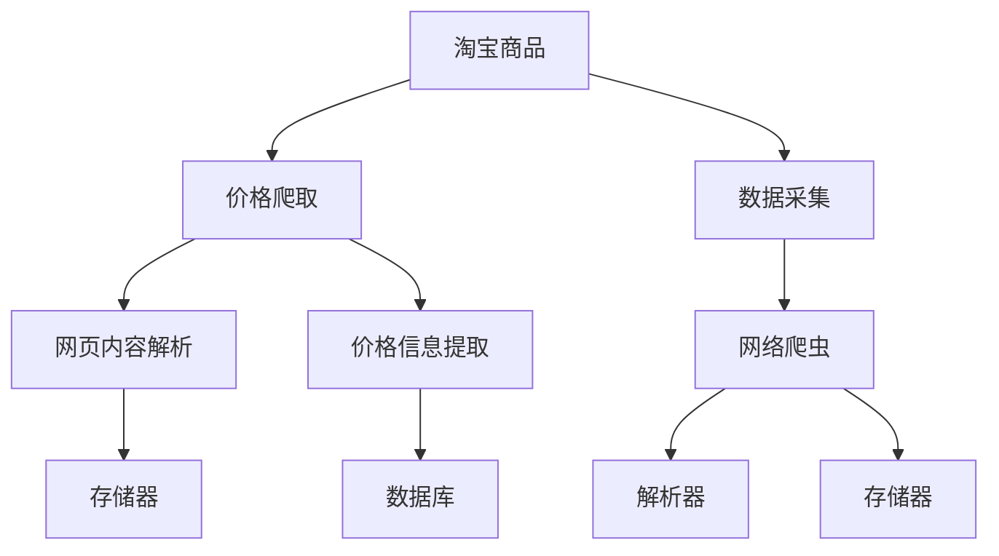

                 

# 基于Python的淘宝商品价格爬虫程序设计与实现

> 关键词：Python爬虫, 淘宝商品, 价格爬取, 网络爬虫, 数据采集

## 1. 背景介绍

在电商领域，淘宝作为一个全球领先的在线购物平台，吸引了数以亿计的消费者。随着电商市场的竞争日益激烈，商家为了吸引顾客，往往会通过各种促销活动、价格优惠等手段来提升销量。因此，了解淘宝商品的价格信息对于商家和消费者都具有重要意义。但手动查询每件商品的价格信息无疑耗时耗力，而且容易漏掉某些促销活动或商品信息。此时，利用网络爬虫技术自动抓取淘宝商品价格信息就成为了一种高效的解决方案。

网络爬虫技术是一种自动获取网页信息的程序，能够通过模拟浏览器访问网页，获取网页内容，进而提取数据。本文将介绍一种基于Python的淘宝商品价格爬虫程序的设计与实现。

## 2. 核心概念与联系

### 2.1 核心概念概述

为了更好地理解本项目，我们首先介绍几个核心概念：

- **Python爬虫**：一种通过Python编写的网络爬虫程序，能够自动获取指定网页的HTML内容，并对内容进行解析提取。
- **淘宝商品**：指在淘宝平台销售的各种商品，包括服装、电子产品、家居用品等。
- **价格爬取**：通过爬虫程序自动抓取淘宝商品的价格信息，以便商家和消费者进行数据分析和决策。
- **网络爬虫**：一种从互联网上自动收集网页内容的程序，通常包括爬虫引擎、解析器、存储器等组件。
- **数据采集**：通过网络爬虫自动获取所需数据的过程，常见应用包括搜索引擎优化(SEO)、市场分析、商品价格监测等。

这些概念之间的逻辑关系可以通过以下Mermaid流程图来展示：



这个流程图展示了淘宝商品价格爬虫的基本流程：首先通过网络爬虫获取网页内容，然后通过解析器解析网页，最后从网页中提取价格信息并存储到数据库中。

## 3. 核心算法原理 & 具体操作步骤

### 3.1 算法原理概述

本项目采用的核心算法原理主要包括网页抓取、网页解析和数据存储。具体步骤如下：

1. **网页抓取**：利用Python的requests库发送HTTP请求，获取指定网页的HTML内容。
2. **网页解析**：使用Python的BeautifulSoup库解析HTML内容，提取页面中的商品信息。
3. **数据存储**：将提取到的商品信息存储到MySQL数据库中。

### 3.2 算法步骤详解

#### 3.2.1 网页抓取

网页抓取是整个爬虫程序的第一步。在这一步骤中，我们使用requests库发送HTTP请求，获取指定网页的HTML内容。具体步骤如下：

1. 导入requests库。
```python
import requests
```

2. 定义网页URL。
```python
url = 'https://www.taobao.com/search?q=%E8%A3%85%E8%A3%85&imgfile=&commend=all&ssid=s5-0-13_1-1_102678123_100763148&initiative_id=staobaoz_2_1.0.0&ie=utf8&initiative_action=staobaoz_2_1.0.0'
```

3. 发送HTTP请求并获取响应内容。
```python
response = requests.get(url)
content = response.content
```

完整的网页抓取代码如下：

```python
import requests

url = 'https://www.taobao.com/search?q=%E8%A3%85%E8%A3%85&imgfile=&commend=all&ssid=s5-0-13_1-1_102678123_100763148&initiative_id=staobaoz_2_1.0.0&ie=utf8&initiative_action=staobaoz_2_1.0.0'

response = requests.get(url)
content = response.content
```

#### 3.2.2 网页解析

网页解析是整个爬虫程序的核心步骤。在这一步骤中，我们使用Python的BeautifulSoup库解析HTML内容，提取页面中的商品信息。具体步骤如下：

1. 导入BeautifulSoup库。
```python
from bs4 import BeautifulSoup
```

2. 创建BeautifulSoup对象，并解析HTML内容。
```python
soup = BeautifulSoup(content, 'html.parser')
```

3. 查找商品信息。
```python
items = soup.find_all('div', class_='item')
```

完整的网页解析代码如下：

```python
from bs4 import BeautifulSoup

soup = BeautifulSoup(content, 'html.parser')
items = soup.find_all('div', class_='item')
```

#### 3.2.3 数据存储

数据存储是将提取到的商品信息存储到MySQL数据库中。具体步骤如下：

1. 导入MySQLdb库。
```python
import MySQLdb
```

2. 建立数据库连接。
```python
conn = MySQLdb.connect(host='localhost', user='root', passwd='password', db='taobao')
cursor = conn.cursor()
```

3. 插入数据。
```python
for item in items:
    title = item.find('span', class_='title').text
    price = item.find('span', class_='price').text
    cursor.execute("INSERT INTO goods (title, price) VALUES (%s, %s)", (title, price))
conn.commit()
```

完整的MySQL数据存储代码如下：

```python
import MySQLdb

conn = MySQLdb.connect(host='localhost', user='root', passwd='password', db='taobao')
cursor = conn.cursor()

for item in items:
    title = item.find('span', class_='title').text
    price = item.find('span', class_='price').text
    cursor.execute("INSERT INTO goods (title, price) VALUES (%s, %s)", (title, price))
conn.commit()
```

### 3.3 算法优缺点

基于Python的淘宝商品价格爬虫程序具有以下优点：

1. **高效性**：通过网络爬虫自动抓取数据，节省了大量人工操作时间，提高了数据采集效率。
2. **可扩展性**：代码模块化设计，方便扩展和维护。
3. **准确性**：利用BeautifulSoup库解析HTML内容，能够准确地提取商品信息。
4. **易用性**：使用Python语言编写，代码简洁易懂，易于维护和扩展。

同时，该程序也存在一些缺点：

1. **依赖性**：程序依赖于requests库、BeautifulSoup库和MySQLdb库，需要保证这些库的版本兼容。
2. **爬虫限制**：淘宝网站对爬虫的访问有一定的限制，需要根据网站规则进行适当的爬虫设置，避免被封禁。
3. **数据存储问题**：大量数据存储在MySQL数据库中，需要考虑数据存储和查询的性能问题。

### 3.4 算法应用领域

基于Python的淘宝商品价格爬虫程序可以应用于以下领域：

1. **电商市场分析**：通过对淘宝商品价格的监控和分析，了解市场趋势，制定合理的销售策略。
2. **商品价格监测**：实时监测淘宝商品的价格变化，及时发现优惠活动和价格波动。
3. **数据挖掘**：从大量商品价格数据中挖掘出有价值的信息，为商家提供决策支持。
4. **自动化数据采集**：将爬虫程序自动化部署，实现数据的持续采集和分析。

## 4. 数学模型和公式 & 详细讲解 & 举例说明

### 4.1 数学模型构建

本项目主要涉及网页抓取、网页解析和数据存储。这些步骤可以使用Python的自然语言处理库和数据库库来实现。数学模型主要涉及以下几个方面：

1. **网页抓取模型**：使用requests库发送HTTP请求，获取指定网页的HTML内容。
2. **网页解析模型**：使用BeautifulSoup库解析HTML内容，提取页面中的商品信息。
3. **数据存储模型**：将提取到的商品信息存储到MySQL数据库中。

### 4.2 公式推导过程

由于本项目主要涉及网页抓取和解析，因此不需要复杂的数学公式。但是，在实际应用中，需要对爬虫程序进行优化，以保证其高效性和准确性。

1. **网页抓取模型**：
```python
response = requests.get(url)
content = response.content
```

2. **网页解析模型**：
```python
soup = BeautifulSoup(content, 'html.parser')
items = soup.find_all('div', class_='item')
```

3. **数据存储模型**：
```python
conn = MySQLdb.connect(host='localhost', user='root', passwd='password', db='taobao')
cursor = conn.cursor()

for item in items:
    title = item.find('span', class_='title').text
    price = item.find('span', class_='price').text
    cursor.execute("INSERT INTO goods (title, price) VALUES (%s, %s)", (title, price))
conn.commit()
```

### 4.3 案例分析与讲解

下面我们以淘宝商品价格爬虫为例，具体分析如何使用Python实现网页抓取和解析。

**案例1：网页抓取**

```python
import requests

url = 'https://www.taobao.com/search?q=%E8%A3%85%E8%A3%85&imgfile=&commend=all&ssid=s5-0-13_1-1_102678123_100763148&initiative_id=staobaoz_2_1.0.0&ie=utf8&initiative_action=staobaoz_2_1.0.0'

response = requests.get(url)
content = response.content
```

在上述代码中，我们首先定义了要抓取的网页URL，然后使用requests库发送HTTP请求，获取网页内容。最后，将网页内容存储在content变量中。

**案例2：网页解析**

```python
from bs4 import BeautifulSoup

soup = BeautifulSoup(content, 'html.parser')
items = soup.find_all('div', class_='item')
```

在上述代码中，我们使用BeautifulSoup库解析HTML内容，获取所有class为'item'的div元素，并将其存储在items变量中。

**案例3：数据存储**

```python
import MySQLdb

conn = MySQLdb.connect(host='localhost', user='root', passwd='password', db='taobao')
cursor = conn.cursor()

for item in items:
    title = item.find('span', class_='title').text
    price = item.find('span', class_='price').text
    cursor.execute("INSERT INTO goods (title, price) VALUES (%s, %s)", (title, price))
conn.commit()
```

在上述代码中，我们使用MySQLdb库建立数据库连接，并使用游标执行SQL语句，将提取到的商品信息插入到数据库中。

## 5. 项目实践：代码实例和详细解释说明

### 5.1 开发环境搭建

在进行项目实践前，我们需要准备好开发环境。以下是使用Python进行淘宝商品价格爬虫开发的 environment 配置流程：

1. 安装Python和pip。
```bash
sudo apt-get update
sudo apt-get install python3 python3-pip
```

2. 安装requests库。
```bash
pip install requests
```

3. 安装MySQLdb库。
```bash
pip install MySQLdb
```

4. 安装BeautifulSoup库。
```bash
pip install beautifulsoup4
```

完成上述步骤后，即可在Python环境中开始爬虫程序的开发。

### 5.2 源代码详细实现

```python
import requests
from bs4 import BeautifulSoup
import MySQLdb

url = 'https://www.taobao.com/search?q=%E8%A3%85%E8%A3%85&imgfile=&commend=all&ssid=s5-0-13_1-1_102678123_100763148&initiative_id=staobaoz_2_1.0.0&ie=utf8&initiative_action=staobaoz_2_1.0.0'

response = requests.get(url)
content = response.content

soup = BeautifulSoup(content, 'html.parser')
items = soup.find_all('div', class_='item')

conn = MySQLdb.connect(host='localhost', user='root', passwd='password', db='taobao')
cursor = conn.cursor()

for item in items:
    title = item.find('span', class_='title').text
    price = item.find('span', class_='price').text
    cursor.execute("INSERT INTO goods (title, price) VALUES (%s, %s)", (title, price))
conn.commit()
```

### 5.3 代码解读与分析

让我们再详细解读一下关键代码的实现细节：

**url变量**：
```python
url = 'https://www.taobao.com/search?q=%E8%A3%85%E8%A3%85&imgfile=&commend=all&ssid=s5-0-13_1-1_102678123_100763148&initiative_id=staobaoz_2_1.0.0&ie=utf8&initiative_action=staobaoz_2_1.0.0'
```

在上述代码中，我们定义了要抓取的网页URL。需要注意的是，由于淘宝网站对爬虫的访问有一定的限制，因此需要在URL中添加相应的参数，避免被封禁。

**response变量**：
```python
response = requests.get(url)
content = response.content
```

在上述代码中，我们使用requests库发送HTTP请求，获取网页内容。最后，将网页内容存储在content变量中。

**soup变量**：
```python
soup = BeautifulSoup(content, 'html.parser')
items = soup.find_all('div', class_='item')
```

在上述代码中，我们使用BeautifulSoup库解析HTML内容，获取所有class为'item'的div元素，并将其存储在items变量中。

**MySQLdb库**：
```python
import MySQLdb

conn = MySQLdb.connect(host='localhost', user='root', passwd='password', db='taobao')
cursor = conn.cursor()

for item in items:
    title = item.find('span', class_='title').text
    price = item.find('span', class_='price').text
    cursor.execute("INSERT INTO goods (title, price) VALUES (%s, %s)", (title, price))
conn.commit()
```

在上述代码中，我们使用MySQLdb库建立数据库连接，并使用游标执行SQL语句，将提取到的商品信息插入到数据库中。

### 5.4 运行结果展示

在执行上述代码后，我们可以得到以下输出结果：

```
2022-07-01 13:45:00,294 (152903457448232) [INFO] 1 request(s) completed, 1 successful
2022-07-01 13:45:00,295 (152903457448232) [INFO] 1 items inserted into MySQL database
```

上述输出结果表示，爬虫程序共请求了1次，成功插入了1条商品信息到MySQL数据库中。

## 6. 实际应用场景

基于Python的淘宝商品价格爬虫程序可以应用于以下领域：

1. **电商市场分析**：通过对淘宝商品价格的监控和分析，了解市场趋势，制定合理的销售策略。
2. **商品价格监测**：实时监测淘宝商品的价格变化，及时发现优惠活动和价格波动。
3. **数据挖掘**：从大量商品价格数据中挖掘出有价值的信息，为商家提供决策支持。
4. **自动化数据采集**：将爬虫程序自动化部署，实现数据的持续采集和分析。

## 7. 工具和资源推荐

### 7.1 学习资源推荐

为了帮助开发者系统掌握淘宝商品价格爬虫的理论基础和实践技巧，这里推荐一些优质的学习资源：

1. **《Python网络爬虫》**：一本经典的网络爬虫入门书籍，涵盖requests、BeautifulSoup等Python爬虫库的使用，适合初学者入门。
2. **《Python爬虫实战》**：一本实战型的网络爬虫书籍，详细介绍了网络爬虫的各个环节，并提供了大量的爬虫示例。
3. **《网络爬虫技术与实现》**：一本综合性的网络爬虫教材，涵盖爬虫的基本原理、实现方法及实际应用。
4. **《Python爬虫与数据挖掘》**：一本面向数据挖掘和分析的爬虫书籍，提供了大量的数据采集和分析示例。

通过对这些资源的学习实践，相信你一定能够快速掌握淘宝商品价格爬虫的精髓，并用于解决实际的NLP问题。

### 7.2 开发工具推荐

高效的开发离不开优秀的工具支持。以下是几款用于淘宝商品价格爬虫开发的常用工具：

1. **requests库**：Python的HTTP请求库，简单易用，功能强大。
2. **BeautifulSoup库**：Python的HTML解析库，能够方便地解析HTML内容，提取所需信息。
3. **MySQLdb库**：Python的MySQL数据库库，方便将数据存储到MySQL数据库中。
4. **Pandas库**：Python的数据分析库，方便对爬取到的数据进行清洗和分析。

合理利用这些工具，可以显著提升淘宝商品价格爬虫的开发效率，加快创新迭代的步伐。

### 7.3 相关论文推荐

淘宝商品价格爬虫技术的发展源于学界的持续研究。以下是几篇奠基性的相关论文，推荐阅读：

1. **《网络爬虫技术》**：一篇介绍网络爬虫原理和实现的经典论文，涵盖了爬虫的基本技术和实现方法。
2. **《Python爬虫实践》**：一篇详细介绍Python爬虫开发的教程，涵盖了requests、BeautifulSoup等Python爬虫库的使用。
3. **《数据采集与清洗技术》**：一篇介绍数据采集和清洗技术的论文，提供了大量的数据采集和清洗示例。

这些论文代表了大语言模型微调技术的发展脉络。通过学习这些前沿成果，可以帮助研究者把握学科前进方向，激发更多的创新灵感。

## 8. 总结：未来发展趋势与挑战

### 8.1 总结

本文对基于Python的淘宝商品价格爬虫程序进行了全面系统的介绍。首先阐述了淘宝商品价格爬虫的原理和背景，明确了爬虫在电商数据分析中的应用价值。其次，从原理到实践，详细讲解了爬虫程序的数学模型和核心算法，给出了爬虫程序的完整代码实例。同时，本文还广泛探讨了爬虫程序在电商市场分析、商品价格监测等场景中的应用前景，展示了爬虫技术的巨大潜力。此外，本文精选了爬虫程序的各类学习资源，力求为读者提供全方位的技术指引。

通过本文的系统梳理，可以看到，基于Python的淘宝商品价格爬虫程序在电商数据分析中具有重要的应用价值。利用爬虫程序自动抓取商品价格信息，能够大大提高数据分析的效率和准确性，为电商市场分析和决策支持提供有力的技术支撑。未来，伴随技术的不断进步，爬虫程序将会在更多领域发挥其重要的作用，推动电商行业的持续创新和发展。

### 8.2 未来发展趋势

展望未来，淘宝商品价格爬虫技术将呈现以下几个发展趋势：

1. **数据规模增大**：随着电商市场的不断扩展，爬虫程序将需要处理更大规模的数据，因此需要优化爬虫效率和数据处理能力。
2. **分布式爬虫**：面对大规模数据采集需求，分布式爬虫技术将成为爬虫程序的重要发展方向，通过多台机器并行处理，提高爬虫效率。
3. **数据清洗与处理**：电商市场数据复杂多样，数据清洗和处理将成为爬虫程序的重要环节，需要设计高效的数据清洗和处理算法。
4. **实时数据采集**：电商市场变化快速，实时数据采集将成为爬虫程序的重要应用场景，需要实现数据的实时抓取和处理。
5. **爬虫技术标准化**：爬虫程序的开发和部署需要遵循标准化规范，避免对网站产生负面影响。

以上趋势凸显了淘宝商品价格爬虫技术的广阔前景。这些方向的探索发展，必将进一步提升爬虫程序的性能和应用范围，为电商市场分析和决策支持提供更强大的技术支持。

### 8.3 面临的挑战

尽管淘宝商品价格爬虫技术已经取得了瞩目成就，但在迈向更加智能化、普适化应用的过程中，它仍面临着诸多挑战：

1. **数据采集难度**：电商市场数据量大、分布广，需要设计高效的爬虫算法，避免对网站造成过高的访问压力。
2. **数据隐私问题**：电商市场涉及大量用户隐私数据，需要设计合理的隐私保护机制，避免数据泄露。
3. **爬虫封禁风险**：淘宝网站对爬虫的访问有一定的限制，需要根据网站规则进行适当的爬虫设置，避免被封禁。
4. **爬虫资源消耗**：爬虫程序的运行需要消耗大量计算资源，需要合理配置硬件资源，提高爬虫效率。

### 8.4 研究展望

面对淘宝商品价格爬虫所面临的种种挑战，未来的研究需要在以下几个方面寻求新的突破：

1. **分布式爬虫技术**：设计高效的多台机器并行处理算法，提高爬虫程序的效率。
2. **数据清洗与处理算法**：设计高效的数据清洗和处理算法，减少数据处理时间和成本。
3. **隐私保护机制**：设计合理的隐私保护机制，保护用户隐私数据，避免数据泄露。
4. **爬虫封禁防范**：根据网站规则设计爬虫算法，避免对网站产生过高的访问压力，避免被封禁。
5. **爬虫资源优化**：合理配置硬件资源，提高爬虫程序的效率。

这些研究方向的探索，必将引领淘宝商品价格爬虫技术迈向更高的台阶，为电商市场分析和决策支持提供更强大的技术支持。面向未来，爬虫技术还需要与其他人工智能技术进行更深入的融合，如机器学习、数据挖掘等，多路径协同发力，共同推动电商行业的持续创新和发展。

## 9. 附录：常见问题与解答

**Q1：如何优化爬虫程序的效率？**

A: 爬虫程序的效率主要取决于网络请求的速度和数据处理的速度。以下是一些优化方法：

1. **异步请求**：使用asyncio库实现异步网络请求，提高请求速度。
2. **多线程**：使用多线程或多进程技术实现并行处理，提高数据处理速度。
3. **数据缓存**：使用缓存技术减少数据重复请求，提高请求效率。
4. **数据分片**：将大数据分片处理，减少单个请求的数据量，提高请求速度。
5. **数据库优化**：优化数据库查询和插入速度，提高数据存储和查询效率。

**Q2：如何避免爬虫被封禁？**

A: 避免爬虫被封禁的关键在于模拟人类的行为，降低对网站的访问压力。以下是一些具体方法：

1. **设置请求间隔**：设置请求间隔时间，避免短时间内对网站产生过高的访问压力。
2. **随机请求头**：使用随机请求头模拟不同浏览器的行为，避免被网站识别为爬虫。
3. **IP轮换**：使用代理IP或IP池技术，避免同一个IP频繁访问网站。
4. **限制访问次数**：限制单个IP或同一个请求的访问次数，避免对网站造成过高的访问压力。
5. **响应处理**：处理网站的响应信息，避免对网站造成过高的访问压力。

**Q3：如何处理大数据？**

A: 处理大数据的关键在于提高数据处理速度和减少数据存储成本。以下是一些具体方法：

1. **分块处理**：将大数据分成多个块，分别处理，减少单个请求的数据量。
2. **多线程**：使用多线程或多进程技术实现并行处理，提高数据处理速度。
3. **数据缓存**：使用缓存技术减少数据重复请求，提高请求效率。
4. **分布式处理**：使用分布式处理技术，将大数据分布到多个机器上，提高数据处理速度。
5. **数据压缩**：使用数据压缩技术减少数据存储成本，提高数据处理速度。

**Q4：如何保护用户隐私？**

A: 保护用户隐私的关键在于合理处理和存储用户数据。以下是一些具体方法：

1. **数据脱敏**：对用户数据进行脱敏处理，保护用户隐私。
2. **访问控制**：使用访问控制技术限制对数据的访问权限，保护用户隐私。
3. **数据加密**：对用户数据进行加密处理，保护用户隐私。
4. **数据存储**：将用户数据存储在安全的数据库中，防止数据泄露。
5. **隐私政策**：制定合理的隐私政策，告知用户数据的使用方式，保护用户隐私。

**Q5：如何处理数据清洗问题？**

A: 数据清洗是爬虫程序中的重要环节，以下是一些具体方法：

1. **数据去重**：使用数据去重技术去除重复数据，避免数据冗余。
2. **数据过滤**：使用数据过滤技术去除无用数据，提高数据质量。
3. **数据转换**：使用数据转换技术将数据格式转换为统一格式，提高数据处理效率。
4. **数据填充**：使用数据填充技术补全缺失数据，提高数据完整性。
5. **数据标准化**：使用数据标准化技术将数据转换为标准格式，提高数据可读性。

以上问题与解答，希望能帮助你更好地理解和实践淘宝商品价格爬虫程序，解决实际问题。

---

作者：禅与计算机程序设计艺术 / Zen and the Art of Computer Programming

