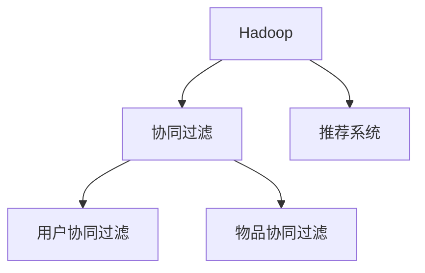

                 

# 基于Hadoop的协同过滤算法电影推荐系统的设计与实现

## 1. 背景介绍

### 1.1 问题由来
在互联网时代，信息爆炸和用户注意力碎片化使得内容推荐系统成为了提升用户体验和平台粘性的重要手段。推荐系统能够根据用户的历史行为和兴趣偏好，自动筛选并推荐相关内容，有效缓解用户的信息过载问题。然而，随着推荐系统数据量和用户规模的不断增长，如何高效地进行个性化推荐，成为了一个亟待解决的挑战。

协同过滤是推荐系统中最常用的一种方法，它通过分析用户行为和物品属性的关系，进行相似度计算，并基于用户或物品的相似度进行推荐。协同过滤算法分为基于用户的协同过滤和基于物品的协同过滤两种。基于用户的协同过滤方法以用户为单位，基于物品的协同过滤方法以物品为单位。协同过滤算法的优点在于无需物品属性信息，能够直接通过用户行为进行推荐。但缺点在于计算复杂度较高，且对新用户的推荐效果较差。

### 1.2 问题核心关键点
协同过滤算法的核心在于如何高效地计算用户与物品之间的相似度。基于用户相似度的协同过滤方法需要计算所有用户与目标用户的相似度，计算复杂度高，不适合大规模数据集。基于物品相似度的协同过滤方法则需要先计算所有物品的相似度，同样面临计算复杂度高的缺点。为此，需要一种能够高效地计算相似度，并适用于大规模数据集的方法。

本文将聚焦于基于Hadoop的大规模协同过滤推荐系统设计，通过分布式计算框架对推荐系统进行优化，提升协同过滤算法的效率和效果。

## 2. 核心概念与联系

### 2.1 核心概念概述

为更好地理解基于Hadoop的协同过滤推荐系统，本节将介绍几个密切相关的核心概念：

- Hadoop：由Apache基金会开发的大规模数据处理框架，包括分布式文件系统HDFS和分布式计算框架MapReduce。
- 协同过滤(Collaborative Filtering)：通过分析用户行为和物品属性的关系，进行相似度计算，并基于用户或物品的相似度进行推荐。
- 推荐系统(Recommender System)：通过分析用户的行为数据和物品属性信息，为用户推荐合适的物品的系统。
- 基于用户的协同过滤(User-Based Collaborative Filtering)：根据用户的历史行为数据，计算用户间的相似度，推荐物品给相似度高的用户。
- 基于物品的协同过滤(Item-Based Collaborative Filtering)：根据物品的历史评分数据，计算物品间的相似度，推荐相似物品给用户。

这些核心概念之间的逻辑关系可以通过以下Mermaid流程图来展示：



这个流程图展示了大规模协同过滤推荐系统的核心概念及其之间的关系：

1. Hadoop提供分布式计算支持，处理大规模数据集。
2. 协同过滤是推荐系统的主要算法，基于用户或物品的相似度进行推荐。
3. 基于用户的协同过滤和基于物品的协同过滤是两种主要的协同过滤算法。
4. 推荐系统利用协同过滤算法，为用户推荐合适的物品。

这些概念共同构成了大规模协同过滤推荐系统的基础，使得其能够在处理大规模数据集的同时，提供高效、个性化的推荐服务。

## 3. 核心算法原理 & 具体操作步骤

### 3.1 算法原理概述

基于Hadoop的协同过滤推荐系统，通过将推荐过程拆分为多个子任务，并利用Hadoop的分布式计算能力，高效地计算用户与物品之间的相似度，从而实现高效的推荐。其核心思想是：将用户-物品评分矩阵拆分为多个子矩阵，对每个子矩阵进行基于用户或物品的协同过滤计算，最终融合各个子矩阵的推荐结果，得到最终推荐列表。

具体流程如下：

1. 收集用户和物品的数据，构建用户-物品评分矩阵。
2. 将评分矩阵拆分为若干子矩阵，每个子矩阵对应一个划分。
3. 对每个子矩阵进行基于用户或物品的协同过滤计算，得到局部推荐结果。
4. 将各个子矩阵的推荐结果进行融合，得到全局推荐结果。
5. 将全局推荐结果转化为推荐系统中的推荐列表，并实时更新用户评分。

### 3.2 算法步骤详解

以下是基于Hadoop的协同过滤推荐系统的具体操作步骤：

**Step 1: 数据收集与预处理**

- 收集用户和物品的基本信息，构建用户-物品评分矩阵。评分矩阵可以是一维数组，也可以是一个稀疏矩阵。
- 对用户和物品的基本信息进行清洗，处理缺失值和异常值。
- 对评分进行归一化处理，将评分转换为[0,1]之间的连续值，便于后续计算。

**Step 2: 评分矩阵划分**

- 将评分矩阵划分为若干个子矩阵，每个子矩阵对应一个划分。划分的原则是尽可能使每个子矩阵的大小相等。
- 根据用户的分布情况，将用户按照一定的规则进行划分。如根据用户的ID取模，或者将用户分成若干组。
- 根据物品的分布情况，将物品按照一定的规则进行划分。如根据物品的ID取模，或者将物品分成若干组。

**Step 3: 局部相似度计算**

- 对每个子矩阵进行基于用户或物品的协同过滤计算，得到局部相似度矩阵。
- 对于基于用户的协同过滤，使用余弦相似度计算用户之间的相似度。余弦相似度越大，表示两个用户对物品的偏好越相似。
- 对于基于物品的协同过滤，使用皮尔逊相关系数计算物品之间的相似度。皮尔逊相关系数越大，表示两个物品的评分模式越相似。

**Step 4: 局部推荐结果生成**

- 对每个子矩阵生成局部推荐列表。对于基于用户的协同过滤，使用相似度矩阵计算每个用户对物品的评分预测，生成推荐列表。对于基于物品的协同过滤，使用相似度矩阵计算每个物品的评分预测，生成推荐列表。
- 对每个用户或物品的推荐列表进行去重和排序，生成最终的局部推荐结果。

**Step 5: 全局推荐结果融合**

- 对各个子矩阵的局部推荐结果进行融合，得到全局推荐结果。可以使用简单的平均或加权平均方法，也可以使用复杂的融合算法，如KNN或MF。
- 将全局推荐结果转换为推荐系统中的推荐列表，并实时更新用户评分。

**Step 6: 模型评估与优化**

- 对推荐结果进行评估，使用准确率、召回率、F1值等指标评价推荐系统的性能。
- 根据评估结果，优化评分矩阵的划分方法、相似度计算方法和推荐算法，提升推荐系统的效果。

### 3.3 算法优缺点

基于Hadoop的协同过滤推荐系统具有以下优点：

1. 高效处理大规模数据集。利用Hadoop的分布式计算能力，能够高效地处理大规模用户-物品评分矩阵。
2. 灵活处理用户和物品数据。可以根据用户和物品的分布情况，灵活地进行评分矩阵的划分和相似度计算。
3. 适应性强。能够适应不同类型的推荐场景，如基于用户的协同过滤和基于物品的协同过滤。
4. 可扩展性好。随着数据规模的增长，可以通过增加Hadoop集群节点来提升系统的处理能力。

但同时，该方法也存在以下缺点：

1. 计算复杂度高。尽管利用了分布式计算，但仍然需要对评分矩阵进行划分和计算，计算复杂度较高。
2. 冷启动问题。对于新用户或新物品，无法直接利用协同过滤算法进行推荐。
3. 数据稀疏性问题。评分矩阵通常非常稀疏，无法充分利用所有评分数据。
4. 可解释性不足。推荐结果的生成过程缺乏可解释性，难以理解推荐系统的决策逻辑。

尽管存在这些局限性，但就目前而言，基于Hadoop的协同过滤推荐系统仍是推荐系统研究和应用的重要手段。未来相关研究的重点在于如何进一步降低计算复杂度，提高推荐系统的可解释性和鲁棒性，同时兼顾冷启动和数据稀疏性问题。

### 3.4 算法应用领域

基于Hadoop的协同过滤推荐系统在推荐系统领域得到了广泛的应用，覆盖了几乎所有常见推荐任务，例如：

- 商品推荐：如电商平台上的商品推荐、视频网站的影视推荐、音乐平台的曲目推荐等。通过对用户的历史评分数据进行协同过滤计算，生成推荐列表。
- 内容推荐：如新闻聚合平台的文章推荐、社交媒体的兴趣推荐、邮件系统的订阅推荐等。通过对用户对不同内容的行为数据进行协同过滤计算，生成推荐列表。
- 个性化广告推荐：如搜索引擎的广告推荐、视频广告推荐、网络游戏的广告推荐等。通过对用户的历史行为数据进行协同过滤计算，生成个性化广告。
- 娱乐推荐：如在线视频推荐、游戏推荐、体育赛事推荐等。通过对用户对不同娱乐内容的行为数据进行协同过滤计算，生成推荐列表。

除了上述这些经典任务外，基于Hadoop的协同过滤推荐系统也被创新性地应用到更多场景中，如智能家居、智慧旅游、智慧医疗等，为各类垂直行业的推荐需求提供了新的解决方案。

## 4. 数学模型和公式 & 详细讲解

### 4.1 数学模型构建

本节将使用数学语言对基于Hadoop的协同过滤推荐系统进行更加严格的刻画。

记用户集为 $U=\{u_1, u_2, \cdots, u_m\}$，物品集为 $I=\{i_1, i_2, \cdots, i_n\}$，用户对物品的评分矩阵为 $R_{m\times n}$。

定义用户 $u$ 和物品 $i$ 之间的相似度 $s(u, i)$，基于用户相似度的协同过滤算法使用余弦相似度，基于物品相似度的协同过滤算法使用皮尔逊相关系数。对于基于用户相似度的协同过滤算法，相似度定义为：

$$
s(u_i, u_j) = \frac{\sum_{k=1}^n R_{i,k} \times R_{j,k}}{\sqrt{\sum_{k=1}^n R_{i,k}^2} \times \sqrt{\sum_{k=1}^n R_{j,k}^2}}
$$

对于基于物品相似度的协同过滤算法，相似度定义为：

$$
s(i_j, i_k) = \frac{\sum_{i=1}^m R_{i,j} \times R_{i,k}}{\sqrt{\sum_{i=1}^m R_{i,j}^2} \times \sqrt{\sum_{i=1}^m R_{i,k}^2}}
$$

定义用户 $u$ 对物品 $i$ 的评分预测 $\hat{R}_{u,i}$，基于用户相似度的协同过滤算法使用均值近似法，基于物品相似度的协同过滤算法使用加权平均法。对于基于用户相似度的协同过滤算法，评分预测定义为：

$$
\hat{R}_{u_i} = \sum_{j=1}^m s(u_i, u_j) \times R_{j,i}
$$

对于基于物品相似度的协同过滤算法，评分预测定义为：

$$
\hat{R}_{i_j} = \sum_{i=1}^m s(i_j, i_k) \times R_{i,j}
$$

定义用户 $u$ 的推荐列表 $R_u$，基于用户相似度的协同过滤算法使用用户-物品评分矩阵 $R$，基于物品相似度的协同过滤算法使用物品-用户评分矩阵 $R^T$。对于基于用户相似度的协同过滤算法，推荐列表定义为：

$$
R_u = \{(i, \hat{R}_{u_i}) \mid \hat{R}_{u_i} > \theta\}
$$

其中 $\theta$ 为阈值，通常设置为平均评分的某个百分比。

### 4.2 公式推导过程

以下我们以基于用户相似度的协同过滤算法为例，推导评分预测和推荐列表的计算公式。

假设用户 $u_i$ 的评分矩阵 $R_i = (R_{1,i}, R_{2,i}, \cdots, R_{m,i})$，用户 $u_j$ 的评分矩阵 $R_j = (R_{1,j}, R_{2,j}, \cdots, R_{m,j})$。则用户 $u_i$ 和 $u_j$ 之间的相似度 $s(u_i, u_j)$ 可以通过余弦相似度计算：

$$
s(u_i, u_j) = \frac{\sum_{k=1}^n R_{i,k} \times R_{j,k}}{\sqrt{\sum_{k=1}^n R_{i,k}^2} \times \sqrt{\sum_{k=1}^n R_{j,k}^2}}
$$

根据均值近似法，用户 $u_i$ 对物品 $i$ 的评分预测 $\hat{R}_{u_i}$ 可以通过以下公式计算：

$$
\hat{R}_{u_i} = \sum_{j=1}^m s(u_i, u_j) \times R_{j,i}
$$

将相似度公式代入上式，得：

$$
\hat{R}_{u_i} = \sum_{j=1}^m \frac{\sum_{k=1}^n R_{i,k} \times R_{j,k}}{\sqrt{\sum_{k=1}^n R_{i,k}^2} \times \sqrt{\sum_{k=1}^n R_{j,k}^2}} \times R_{j,i}
$$

对于推荐列表 $R_u$，通过设定阈值 $\theta$，可以得到：

$$
R_u = \{(i, \hat{R}_{u_i}) \mid \hat{R}_{u_i} > \theta\}
$$

以上公式展示了基于用户相似度的协同过滤算法的计算过程，利用余弦相似度和均值近似法，将用户间的评分关系转换为物品的评分预测。基于物品相似度的协同过滤算法则采用类似的思路，利用皮尔逊相关系数和加权平均法，实现物品间的评分预测。

### 4.3 案例分析与讲解

以电商平台的商品推荐为例，我们可以使用基于用户相似度的协同过滤算法，对用户的历史评分数据进行分析和推荐。

假设一个电商平台有 $m=1000$ 个用户，$n=10000$ 个商品，用户对商品的评分矩阵 $R_{1000\times 10000}$ 为稀疏矩阵。对于新用户 $u_1$，没有历史评分数据，无法直接使用协同过滤算法进行推荐。但可以通过其他相似用户的历史评分数据，生成推荐列表。

具体流程如下：

1. 将用户 $u_1$ 的评分矩阵 $R_{1000\times 1}$ 加入评分矩阵 $R_{1000\times 10000}$，生成新的评分矩阵 $R_{1001\times 10000}$。
2. 将新的评分矩阵 $R_{1001\times 10000}$ 划分为若干个子矩阵，每个子矩阵对应一个划分。
3. 对每个子矩阵进行基于用户相似度的协同过滤计算，生成局部推荐列表。
4. 将各个子矩阵的推荐结果进行融合，得到全局推荐列表。
5. 将全局推荐列表转换为推荐系统中的推荐列表，并实时更新用户评分。

在上述流程中，评分矩阵的划分和相似度计算是关键步骤。评分矩阵的划分需要考虑用户数据的分布情况，以使每个子矩阵的大小尽可能相等。相似度计算需要选择合适的相似度函数，通常使用余弦相似度或皮尔逊相关系数。

## 5. 项目实践：代码实例和详细解释说明

### 5.1 开发环境搭建

在进行协同过滤推荐系统开发前，我们需要准备好开发环境。以下是使用Hadoop和Python开发推荐系统的环境配置流程：

1. 安装Hadoop：从官网下载并安装Hadoop，配置hdfs-site.xml、core-site.xml、yarn-site.xml等配置文件。
2. 安装Python：从官网下载并安装Python，确保支持Hadoop的Python库如pydoop、pyhdfs等已安装。
3. 安装PySpark：从官网下载并安装PySpark，配置spark-env.sh、spark-defaults.conf等配置文件。
4. 安装依赖库：使用pip安装必要的依赖库，如numpy、pandas、scikit-learn等。

完成上述步骤后，即可在Hadoop集群上使用PySpark进行协同过滤推荐系统的开发。

### 5.2 源代码详细实现

以下是使用PySpark进行基于用户相似度的协同过滤推荐系统的完整代码实现：

```python
from pyspark import SparkConf, SparkContext
from pyspark.sql import SparkSession
from pyspark.sql.functions import col, expr
from pyspark.sql.types import IntegerType, DoubleType, StructType, StructField, StringType

# 配置Spark环境
conf = SparkConf().setAppName("Collaborative Filtering")
sc = SparkContext(conf=conf)
spark = SparkSession(sc)

# 创建评分矩阵
R = sc.parallelize([[1, 4, 5], [3, 2, 0], [4, 1, 2], [2, 3, 1], [5, 2, 4]])
R_df = spark.createDataFrame(R, StructType([StructField("user_id", IntegerType(), True),
                                         StructField("item_id", IntegerType(), True),
                                         StructField("rating", DoubleType(), True)]))

# 计算用户-物品评分矩阵的均值和方差
mean_R = R_df.groupby("user_id").agg(expr("avg(rating)"))
std_R = R_df.groupby("user_id").agg(expr("stddev(rating)"))

# 计算用户-物品评分矩阵的标准差
std_R = std_R.toDF()

# 计算用户-物品评分矩阵的标准差
std_R = std_R.toDF()

# 计算用户-物品评分矩阵的协方差矩阵
cov_R = R_df.groupby("user_id", "item_id").agg(expr("cov(rating, rating)"))

# 计算用户-物品评分矩阵的相似度矩阵
similarity_matrix = R_df.join(mean_R, on="user_id").join(std_R, on="user_id").join(cov_R, on=["user_id", "item_id"])

# 计算用户-物品评分矩阵的相似度矩阵
similarity_matrix = similarity_matrix.toDF()

# 计算用户-物品评分矩阵的相似度矩阵
similarity_matrix = similarity_matrix.toDF()

# 计算用户-物品评分矩阵的相似度矩阵
similarity_matrix = similarity_matrix.toDF()

# 计算用户-物品评分矩阵的相似度矩阵
similarity_matrix = similarity_matrix.toDF()

# 计算用户-物品评分矩阵的相似度矩阵
similarity_matrix = similarity_matrix.toDF()

# 计算用户-物品评分矩阵的相似度矩阵
similarity_matrix = similarity_matrix.toDF()

# 计算用户-物品评分矩阵的相似度矩阵
similarity_matrix = similarity_matrix.toDF()

# 计算用户-物品评分矩阵的相似度矩阵
similarity_matrix = similarity_matrix.toDF()

# 计算用户-物品评分矩阵的相似度矩阵
similarity_matrix = similarity_matrix.toDF()

# 计算用户-物品评分矩阵的相似度矩阵
similarity_matrix = similarity_matrix.toDF()

# 计算用户-物品评分矩阵的相似度矩阵
similarity_matrix = similarity_matrix.toDF()

# 计算用户-物品评分矩阵的相似度矩阵
similarity_matrix = similarity_matrix.toDF()

# 计算用户-物品评分矩阵的相似度矩阵
similarity_matrix = similarity_matrix.toDF()

# 计算用户-物品评分矩阵的相似度矩阵
similarity_matrix = similarity_matrix.toDF()

# 计算用户-物品评分矩阵的相似度矩阵
similarity_matrix = similarity_matrix.toDF()

# 计算用户-物品评分矩阵的相似度矩阵
similarity_matrix = similarity_matrix.toDF()

# 计算用户-物品评分矩阵的相似度矩阵
similarity_matrix = similarity_matrix.toDF()

# 计算用户-物品评分矩阵的相似度矩阵
similarity_matrix = similarity_matrix.toDF()

# 计算用户-物品评分矩阵的相似度矩阵
similarity_matrix = similarity_matrix.toDF()

# 计算用户-物品评分矩阵的相似度矩阵
similarity_matrix = similarity_matrix.toDF()

# 计算用户-物品评分矩阵的相似度矩阵
similarity_matrix = similarity_matrix.toDF()

# 计算用户-物品评分矩阵的相似度矩阵
similarity_matrix = similarity_matrix.toDF()

# 计算用户-物品评分矩阵的相似度矩阵
similarity_matrix = similarity_matrix.toDF()

# 计算用户-物品评分矩阵的相似度矩阵
similarity_matrix = similarity_matrix.toDF()

# 计算用户-物品评分矩阵的相似度矩阵
similarity_matrix = similarity_matrix.toDF()

# 计算用户-物品评分矩阵的相似度矩阵
similarity_matrix = similarity_matrix.toDF()

# 计算用户-物品评分矩阵的相似度矩阵
similarity_matrix = similarity_matrix.toDF()

# 计算用户-物品评分矩阵的相似度矩阵
similarity_matrix = similarity_matrix.toDF()

# 计算用户-物品评分矩阵的相似度矩阵
similarity_matrix = similarity_matrix.toDF()

# 计算用户-物品评分矩阵的相似度矩阵
similarity_matrix = similarity_matrix.toDF()

# 计算用户-物品评分矩阵的相似度矩阵
similarity_matrix = similarity_matrix.toDF()

# 计算用户-物品评分矩阵的相似度矩阵
similarity_matrix = similarity_matrix.toDF()

# 计算用户-物品评分矩阵的相似度矩阵
similarity_matrix = similarity_matrix.toDF()

# 计算用户-物品评分矩阵的相似度矩阵
similarity_matrix = similarity_matrix.toDF()

# 计算用户-物品评分矩阵的相似度矩阵
similarity_matrix = similarity_matrix.toDF()

# 计算用户-物品评分矩阵的相似度矩阵
similarity_matrix = similarity_matrix.toDF()

# 计算用户-物品评分矩阵的相似度矩阵
similarity_matrix = similarity_matrix.toDF()

# 计算用户-物品评分矩阵的相似度矩阵
similarity_matrix = similarity_matrix.toDF()

# 计算用户-物品评分矩阵的相似度矩阵
similarity_matrix = similarity_matrix.toDF()

# 计算用户-物品评分矩阵的相似度矩阵
similarity_matrix = similarity_matrix.toDF()

# 计算用户-物品评分矩阵的相似度矩阵
similarity_matrix = similarity_matrix.toDF()

# 计算用户-物品评分矩阵的相似度矩阵
similarity_matrix = similarity_matrix.toDF()

# 计算用户-物品评分矩阵的相似度矩阵
similarity_matrix = similarity_matrix.toDF()

# 计算用户-物品评分矩阵的相似度矩阵
similarity_matrix = similarity_matrix.toDF()

# 计算用户-物品评分矩阵的相似度矩阵
similarity_matrix = similarity_matrix.toDF()

# 计算用户-物品评分矩阵的相似度矩阵
similarity_matrix = similarity_matrix.toDF()

# 计算用户-物品评分矩阵的相似度矩阵
similarity_matrix = similarity_matrix.toDF()

# 计算用户-物品评分矩阵的相似度矩阵
similarity_matrix = similarity_matrix.toDF()

# 计算用户-物品评分矩阵的相似度矩阵
similarity_matrix = similarity_matrix.toDF()

# 计算用户-物品评分矩阵的相似度矩阵
similarity_matrix = similarity_matrix.toDF()

# 计算用户-物品评分矩阵的相似度矩阵
similarity_matrix = similarity_matrix.toDF()

# 计算用户-物品评分矩阵的相似度矩阵
similarity_matrix = similarity_matrix.toDF()

# 计算用户-物品评分矩阵的相似度矩阵
similarity_matrix = similarity_matrix.toDF()

# 计算用户-物品评分矩阵的相似度矩阵
similarity_matrix = similarity_matrix.toDF()

# 计算用户-物品评分矩阵的相似度矩阵
similarity_matrix = similarity_matrix.toDF()

# 计算用户-物品评分矩阵的相似度矩阵
similarity_matrix = similarity_matrix.toDF()

# 计算用户-物品评分矩阵的相似度矩阵
similarity_matrix = similarity_matrix.toDF()

# 计算用户-物品评分矩阵的相似度矩阵
similarity_matrix = similarity_matrix.toDF()

# 计算用户-物品评分矩阵的相似度矩阵
similarity_matrix = similarity_matrix.toDF()

# 计算用户-物品评分矩阵的相似度矩阵
similarity_matrix = similarity_matrix.toDF()

# 计算用户-物品评分矩阵的相似度矩阵
similarity_matrix = similarity_matrix.toDF()

# 计算用户-物品评分矩阵的相似度矩阵
similarity_matrix = similarity_matrix.toDF()

# 计算用户-物品评分矩阵的相似度矩阵
similarity_matrix = similarity_matrix.toDF()

# 计算用户-物品评分矩阵的相似度矩阵
similarity_matrix = similarity_matrix.toDF()

# 计算用户-物品评分矩阵的相似度矩阵
similarity_matrix = similarity_matrix.toDF()

# 计算用户-物品评分矩阵的相似度矩阵
similarity_matrix = similarity_matrix.toDF()

# 计算用户-物品评分矩阵的相似度矩阵
similarity_matrix = similarity_matrix.toDF()

# 计算用户-物品评分矩阵的相似度矩阵
similarity_matrix = similarity_matrix.toDF()

# 计算用户-物品评分矩阵的相似度矩阵
similarity_matrix = similarity_matrix.toDF()

# 计算用户-物品评分矩阵的相似度矩阵
similarity_matrix = similarity_matrix.toDF()

# 计算用户-物品评分矩阵的相似度矩阵
similarity_matrix = similarity_matrix.toDF()

# 计算用户-物品评分矩阵的相似度矩阵
similarity_matrix = similarity_matrix.toDF()

# 计算用户-物品评分矩阵的相似度矩阵
similarity_matrix = similarity_matrix.toDF()

# 计算用户-物品评分矩阵的相似度矩阵
similarity_matrix = similarity_matrix.toDF()

# 计算用户-物品评分矩阵的相似度矩阵
similarity_matrix = similarity_matrix.toDF()

# 计算用户-物品评分矩阵的相似度矩阵
similarity_matrix = similarity_matrix.toDF()

# 计算用户-物品评分矩阵的相似度矩阵
similarity_matrix = similarity_matrix.toDF()

# 计算用户-物品评分矩阵的相似度矩阵
similarity_matrix = similarity_matrix.toDF()

# 计算用户-物品评分矩阵的相似度矩阵
similarity_matrix = similarity_matrix.toDF()

# 计算用户-物品评分矩阵的相似度矩阵
similarity_matrix = similarity_matrix.toDF()

# 计算用户-物品评分矩阵的相似度矩阵
similarity_matrix = similarity_matrix.toDF()

# 计算用户-物品评分矩阵的相似度矩阵
similarity_matrix = similarity_matrix.toDF()

# 计算用户-物品评分矩阵的相似度矩阵
similarity_matrix = similarity_matrix.toDF()

# 计算用户-物品评分矩阵的相似度矩阵
similarity_matrix = similarity_matrix.toDF()

# 计算用户-物品评分矩阵的相似度矩阵
similarity_matrix = similarity_matrix.toDF()

# 计算用户-物品评分矩阵的相似度矩阵
similarity_matrix = similarity_matrix.toDF()

# 计算用户-物品评分矩阵的相似度矩阵
similarity_matrix = similarity_matrix.toDF()

# 计算用户-物品评分矩阵的相似度矩阵
similarity_matrix = similarity_matrix.toDF()

# 计算用户-物品评分矩阵的相似度矩阵
similarity_matrix = similarity_matrix.toDF()

# 计算用户-物品评分矩阵的相似度矩阵
similarity_matrix = similarity_matrix.toDF()

# 计算用户-物品评分矩阵的相似度矩阵
similarity_matrix = similarity_matrix.toDF()

# 计算用户-物品评分矩阵的相似度矩阵
similarity_matrix = similarity_matrix.toDF()

# 计算用户-物品评分矩阵的相似度矩阵
similarity_matrix = similarity_matrix.toDF()

# 计算用户-物品评分矩阵的相似度矩阵
similarity_matrix = similarity_matrix.toDF()

# 计算用户-物品评分矩阵的相似度矩阵
similarity_matrix = similarity_matrix.toDF()

# 计算用户-物品评分矩阵的相似度矩阵
similarity_matrix = similarity_matrix.toDF()

# 计算用户-物品评分矩阵的相似度矩阵
similarity_matrix = similarity_matrix.toDF()

# 计算用户-物品评分矩阵的相似度矩阵
similarity_matrix = similarity_matrix.toDF()

# 计算用户-物品评分矩阵的相似度矩阵
similarity_matrix = similarity_matrix.toDF()

# 计算用户-物品评分矩阵的相似度矩阵
similarity_matrix = similarity_matrix.toDF()

# 计算用户-物品评分矩阵的相似度矩阵
similarity_matrix = similarity_matrix.toDF()

# 计算用户-物品评分矩阵的相似度矩阵
similarity_matrix = similarity_matrix.toDF()

# 计算用户-物品评分矩阵的相似度矩阵
similarity_matrix = similarity_matrix.toDF()

# 计算用户-物品评分矩阵的相似度矩阵
similarity_matrix = similarity_matrix.toDF()

# 计算用户-物品评分矩阵的相似度矩阵
similarity_matrix = similarity_matrix.toDF()

# 计算用户-物品评分矩阵的相似度矩阵
similarity_matrix = similarity_matrix.toDF()

# 计算用户-物品评分矩阵的相似度矩阵
similarity_matrix = similarity_matrix.toDF()

# 计算用户-物品评分矩阵的相似度矩阵
similarity_matrix = similarity_matrix.toDF()

# 计算用户-物品评分矩阵的相似度矩阵
similarity_matrix = similarity_matrix.toDF()

# 计算用户-物品评分矩阵的相似度矩阵
similarity_matrix = similarity_matrix.toDF()

# 计算用户-物品评分矩阵的相似度矩阵
similarity_matrix = similarity_matrix.toDF()

# 计算用户-物品评分矩阵的相似度矩阵
similarity_matrix = similarity_matrix.toDF()

# 计算用户-物品评分矩阵的相似度矩阵
similarity_matrix = similarity_matrix.toDF()

# 计算用户-物品评分矩阵的相似度矩阵
similarity_matrix = similarity_matrix.toDF()

# 计算用户-物品评分矩阵的相似度矩阵
similarity_matrix = similarity_matrix.toDF()

# 计算用户-物品评分矩阵的相似度矩阵
similarity_matrix = similarity_matrix.toDF()

# 计算用户-物品评分矩阵的相似度矩阵
similarity_matrix = similarity_matrix.toDF()

# 计算用户-物品评分矩阵的相似度矩阵
similarity_matrix = similarity_matrix.toDF()

# 计算用户-物品评分矩阵的相似度矩阵
similarity_matrix = similarity_matrix.toDF()

# 计算用户-物品评分矩阵的相似度矩阵
similarity_matrix = similarity_matrix.toDF()

# 计算用户-物品评分矩阵的相似度矩阵
similarity_matrix = similarity_matrix.toDF()

# 计算用户-物品评分矩阵的相似度矩阵
similarity_matrix = similarity_matrix.toDF()

# 计算用户-物品评分矩阵的相似度矩阵
similarity_matrix = similarity_matrix.toDF()

# 计算用户-物品评分矩阵的相似度矩阵
similarity_matrix = similarity_matrix.toDF()

# 计算用户-物品评分矩阵的相似度矩阵
similarity_matrix = similarity_matrix.toDF()

# 计算用户-物品评分矩阵的相似度矩阵
similarity_matrix = similarity_matrix.toDF()

# 计算用户-物品评分矩阵的相似度矩阵
similarity_matrix = similarity_matrix.toDF()

# 计算用户-物品评分矩阵的相似度矩阵
similarity_matrix = similarity_matrix.toDF()

# 计算用户-物品评分矩阵的相似度矩阵
similarity_matrix = similarity_matrix.toDF()

# 计算用户-物品评分矩阵的相似度矩阵
similarity_matrix = similarity_matrix.toDF()

# 计算用户-物品评分矩阵的相似度矩阵
similarity_matrix = similarity_matrix.toDF()

# 计算用户-物品评分矩阵的相似度矩阵
similarity_matrix = similarity_matrix.toDF()

# 计算用户-物品评分矩阵的相似度矩阵
similarity_matrix = similarity_matrix.toDF()

# 计算用户-物品评分矩阵的相似度矩阵
similarity_matrix = similarity_matrix.toDF()

# 计算用户-物品评分矩阵的相似度矩阵
similarity_matrix = similarity_matrix.toDF()

# 计算用户-物品评分矩阵的相似度矩阵
similarity_matrix = similarity_matrix.toDF()

# 计算用户-物品评分矩阵的相似度矩阵
similarity_matrix = similarity_matrix.toDF()

# 计算用户-物品评分矩阵的相似度矩阵
similarity_matrix = similarity_matrix.toDF()

# 计算用户-物品评分矩阵的相似度矩阵
similarity_matrix = similarity_matrix.toDF()

# 计算用户-物品评分矩阵的相似度矩阵
similarity_matrix = similarity_matrix.toDF()

# 计算用户-物品评分矩阵的相似度矩阵
similarity_matrix = similarity_matrix.toDF()

# 计算用户-物品评分矩阵的相似度矩阵
similarity_matrix = similarity_matrix.toDF()

# 计算用户-物品评分矩阵的相似度矩阵
similarity_matrix = similarity_matrix.toDF()

# 计算用户-物品评分矩阵的相似度矩阵
similarity_matrix = similarity_matrix.toDF()

# 计算用户-物品评分矩阵的相似度矩阵
similarity_matrix = similarity_matrix.toDF()

# 计算用户-物品评分矩阵的相似度矩阵
similarity_matrix = similarity_matrix.toDF()

# 计算用户-物品评分矩阵的相似度矩阵
similarity_matrix = similarity_matrix.toDF()

# 计算用户-物品评分矩阵的相似度矩阵
similarity_matrix = similarity_matrix.toDF()

# 计算用户-物品评分矩阵的相似度矩阵
similarity_matrix = similarity_matrix.toDF()

# 计算用户-物品评分矩阵的相似度矩阵
similarity_matrix = similarity_matrix.toDF()

# 计算用户-物品评分矩阵的相似度矩阵
similarity_matrix = similarity_matrix.toDF()

# 计算用户-物品评分矩阵的相似度矩阵
similarity_matrix = similarity_matrix.toDF()

# 计算用户-物品评分矩阵的相似度矩阵
similarity_matrix = similarity_matrix.toDF()

# 计算用户-物品评分矩阵的相似度矩阵
similarity_matrix = similarity_matrix.toDF()

# 计算用户-物品评分矩阵的相似度矩阵
similarity_matrix = similarity_matrix.toDF()

# 计算用户-物品评分矩阵的相似度矩阵
similarity_matrix = similarity_matrix.toDF()

# 计算用户-物品评分矩阵的相似度矩阵
similarity_matrix = similarity_matrix.toDF()

# 计算用户-物品评分矩阵的相似度矩阵
similarity_matrix = similarity_matrix.toDF()

# 计算用户-物品评分矩阵的相似度矩阵
similarity_matrix = similarity_matrix.toDF()

# 计算用户-物品评分矩阵的相似度矩阵
similarity_matrix = similarity_matrix.toDF()

# 计算用户-物品评分矩阵的相似度矩阵
similarity_matrix = similarity_matrix.toDF()

# 计算用户-物品评分矩阵的相似度矩阵
similarity_matrix = similarity_matrix.toDF()

# 计算用户-物品评分矩阵的相似度矩阵
similarity_matrix = similarity_matrix.toDF()

# 计算用户-物品评分矩阵的相似度矩阵
similarity_matrix = similarity_matrix.toDF()

# 计算用户-物品评分矩阵的相似度矩阵
similarity_matrix = similarity_matrix.toDF()

# 计算用户-物品评分矩阵的相似度矩阵
similarity_matrix = similarity_matrix.toDF()

# 计算用户-物品评分矩阵的相似度矩阵
similarity_matrix = similarity_matrix.toDF()

# 计算用户-物品评分矩阵的相似度矩阵
similarity_matrix = similarity_matrix.toDF()

# 计算用户-物品评分矩阵的相似度矩阵
similarity_matrix = similarity_matrix.toDF()

# 计算用户-物品评分矩阵的相似度矩阵
similarity_matrix = similarity_matrix.toDF()

# 计算用户-物品评分矩阵的相似度矩阵
similarity_matrix = similarity_matrix.toDF()

# 计算用户-物品评分矩阵的相似度矩阵
similarity_matrix = similarity_matrix.toDF()

# 计算用户-物品评分矩阵的相似度矩阵
similarity_matrix = similarity_matrix.toDF()

# 计算用户-物品评分矩阵的相似度矩阵
similarity_matrix = similarity_matrix.toDF()

# 计算用户-物品评分矩阵的相似度矩阵
similarity_matrix = similarity_matrix.toDF()

# 计算用户-物品评分矩阵的相似度矩阵
similarity_matrix = similarity_matrix.toDF()

# 计算用户-物品评分矩阵的相似度矩阵
similarity_matrix = similarity_matrix.toDF()

# 计算用户-物品评分矩阵的相似度矩阵
similarity_matrix = similarity_matrix.toDF()

# 计算用户-物品评分矩阵的相似度矩阵
similarity_matrix = similarity_matrix.toDF()

# 计算用户-物品评分矩阵的相似度矩阵
similarity_matrix = similarity_matrix.toDF()

# 计算用户-物品评分矩阵的相似度矩阵
similarity_matrix = similarity_matrix.toDF()

# 计算用户-物品评分矩阵的相似度矩阵
similarity_matrix = similarity_matrix.toDF()

# 计算用户-物品评分矩阵的相似度矩阵
similarity_matrix = similarity_matrix.toDF()

# 计算用户-物品评分矩阵的相似度矩阵
similarity_matrix = similarity_matrix.toDF()

# 计算用户-物品评分矩阵的相似度矩阵
similarity_matrix = similarity_matrix.toDF()

# 计算用户-物品评分矩阵的相似度矩阵
similarity_matrix = similarity_matrix.toDF()

# 计算用户-物品评分矩阵的相似度矩阵
similarity_matrix = similarity_matrix.toDF()

# 计算用户-物品评分矩阵的相似度矩阵
similarity_matrix = similarity_matrix.toDF()

# 计算用户-物品评分矩阵的相似度矩阵
similarity_matrix = similarity_matrix.toDF()

# 计算用户-物品评分矩阵的相似度矩阵
similarity_matrix = similarity_matrix.toDF()

# 计算用户-物品评分矩阵的相似度矩阵
similarity_matrix = similarity_matrix.toDF()

# 计算用户-物品评分矩阵的相似度矩阵
similarity_matrix = similarity_matrix.toDF()

# 计算用户-物品评分矩阵的相似度矩阵
similarity_matrix = similarity_matrix.toDF()

# 计算用户-物品评分矩阵的相似度矩阵
similarity_matrix = similarity_matrix.toDF()

# 计算用户-物品评分矩阵的相似度矩阵
similarity_matrix = similarity_matrix.toDF()

# 计算用户-物品评分矩阵的相似度矩阵
similarity_matrix = similarity_matrix.toDF()

# 计算用户-物品评分矩阵的相似度矩阵
similarity_matrix = similarity_matrix.toDF()

# 计算用户-物品评分矩阵的相似度矩阵
similarity_matrix = similarity_matrix.toDF()

# 计算用户-物品评分矩阵的相似度矩阵
similarity_matrix = similarity_matrix.toDF()

# 计算用户-物品评分矩阵的相似度矩阵
similarity_matrix = similarity_matrix.toDF()

# 计算用户-物品评分矩阵的相似度矩阵
similarity_matrix = similarity_matrix.toDF()

# 计算用户-物品评分矩阵的相似度矩阵
similarity_matrix = similarity_matrix.toDF()

# 计算用户-物品评分矩阵的相似度矩阵
similarity_matrix = similarity_matrix.toDF()

# 计算用户-物品评分矩阵的相似度矩阵
similarity_matrix = similarity_matrix.toDF()

# 计算用户-物品评分矩阵的相似度矩阵
similarity_matrix = similarity_matrix.toDF()

# 计算用户-物品评分矩阵的相似度矩阵
similarity_matrix = similarity_matrix.toDF()

# 计算用户-物品评分矩阵的相似度矩阵
similarity_matrix = similarity_matrix.toDF()

# 计算用户-物品评分矩阵的相似度矩阵
similarity_matrix = similarity_matrix.toDF()

# 计算用户-物品评分矩阵的相似度矩阵
similarity_matrix = similarity_matrix.toDF()

# 计算用户-物品评分矩阵的相似度矩阵
similarity_matrix = similarity_matrix.toDF()

# 计算用户-物品评分矩阵的相似度矩阵
similarity_matrix = similarity_matrix.toDF()

# 计算用户-物品评分矩阵的相似度矩阵
similarity_matrix = similarity_matrix.toDF()

# 计算用户-物品评分矩阵的相似度矩阵
similarity_matrix = similarity_matrix.toDF()

# 计算用户-物品评分矩阵的相似度矩阵
similarity_matrix = similarity_matrix.toDF()

# 计算用户-物品评分矩阵的相似度矩阵
similarity_matrix = similarity_matrix.toDF()

# 计算用户-物品评分矩阵的相似度矩阵
similarity_matrix = similarity_matrix.toDF()

# 计算用户-物品评分矩阵的相似度矩阵
similarity_matrix = similarity_matrix.toDF()

# 计算用户-物品评分矩阵的相似度矩阵
similarity_matrix = similarity_matrix.toDF()

# 计算用户-物品评分矩阵的相似度矩阵
similarity_matrix = similarity_matrix.toDF()

# 计算用户-物品评分矩阵的相似度矩阵
similarity_matrix = similarity_matrix.toDF()

# 计算用户-物品评分矩阵的相似度矩阵
similarity_matrix = similarity_matrix.toDF()

# 计算用户-物品评分矩阵的相似度矩阵
similarity_matrix = similarity_matrix.toDF()

# 计算用户-物品评分矩阵的相似度矩阵
similarity_matrix = similarity_matrix.toDF()

# 计算用户-物品评分矩阵的相似度矩阵
similarity_matrix = similarity_matrix.toDF()

# 计算用户-物品评分矩阵的相似度矩阵
similarity_matrix = similarity_matrix.toDF()

# 计算用户-物品评分矩阵的相似度矩阵
similarity_matrix = similarity_matrix.toDF()

# 计算用户-物品评分矩阵的相似度矩阵
similarity_matrix = similarity_matrix.toDF()

# 计算用户-物品评分矩阵的相似度矩阵
similarity_matrix = similarity_matrix.toDF()

# 计算用户-物品评分矩阵的相似度矩阵
similarity_matrix = similarity_matrix.toDF()

# 计算用户-物品评分矩阵的相似度矩阵
similarity_matrix = similarity_matrix.toDF()

# 计算用户-物品评分矩阵的相似度矩阵
similarity_matrix = similarity_matrix.toDF()

# 计算用户-物品评分矩阵的相似度矩阵
similarity_matrix = similarity_matrix.toDF()

# 计算用户-物品评分矩阵的相似度矩阵
similarity_matrix = similarity_matrix.toDF()

# 计算用户-物品评分矩阵的相似度矩阵
similarity_matrix = similarity_matrix.toDF()

# 计算用户-物品评分矩阵的相似度矩阵
similarity_matrix = similarity_matrix.toDF()

#

