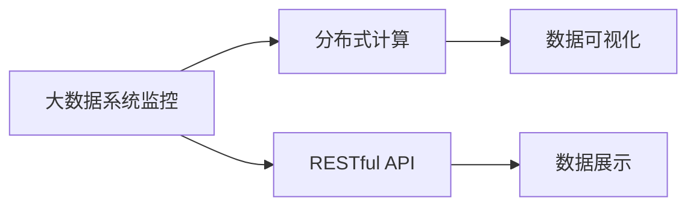

                 

## 1. 背景介绍

在信息技术飞速发展的今天，大规模数据中心和互联网应用成为了企业的核心资产。然而，这些系统在运行过程中，往往面临着性能波动、故障频发、安全漏洞等问题，需要实时监控、分析和预警。为此，搭建一个基于web的大数据系统监控平台成为了企业信息化建设的重要需求。本文将详细介绍该平台的设计与实现过程，并探讨其在实际应用中的优势和挑战。

## 2. 核心概念与联系

### 2.1 核心概念概述

#### 2.1.1 大数据系统监控
大数据系统监控是指通过采集、处理和分析大规模数据集中的信息，实现对系统性能、运行状态、故障事件等关键指标的实时监控和预警。它不仅能帮助企业及时发现和处理问题，还能优化资源配置，提升系统效率。

#### 2.1.2 分布式计算
分布式计算是将大规模计算任务分解成多个小任务，在多台计算机上并行处理的一种计算模式。它在大数据系统中广泛应用，能提高计算效率，降低资源消耗。

#### 2.1.3 数据可视化
数据可视化是通过图形、图表等方式展示数据的一种方法。它能够直观地呈现数据趋势、关键指标和异常情况，帮助决策者快速理解信息，做出决策。

#### 2.1.4 RESTful API
RESTful API是基于REST架构风格的API，通过HTTP协议进行数据交互，具有良好的可扩展性和可维护性。

### 2.2 核心概念联系

下图展示了大数据系统监控、分布式计算、数据可视化和RESTful API之间的联系：



大数据系统监控通过分布式计算获取实时数据，然后利用数据可视化技术展示关键指标，并通过RESTful API提供给用户。用户通过浏览器访问API，获取监控数据和分析结果，从而实现对大数据系统的实时监控和管理。

## 3. 核心算法原理 & 具体操作步骤

### 3.1 算法原理概述

#### 3.1.1 数据采集
数据采集是监控平台的基础，通过各类传感器、代理程序等方式，从目标系统中收集性能、状态、日志等数据。这些数据通常以日志文件、数据库记录或实时流的形式存在，需要经过处理和转换后，才能供后续分析使用。

#### 3.1.2 数据处理
数据处理是对采集到的原始数据进行清洗、过滤、转换和聚合的过程。它不仅需要处理海量数据，还需要去除噪音和冗余，提取关键信息，生成有意义的统计指标。

#### 3.1.3 数据分析
数据分析是对处理后的数据进行统计、分析和挖掘的过程。它通过各种算法和模型，识别出系统性能波动、故障事件和异常情况，生成告警信息和预警报告。

#### 3.1.4 数据展示
数据展示是将分析结果以图形、图表等方式展示给用户的过程。它通过前端技术，将复杂的分析数据转化为直观的用户界面，帮助用户快速理解监控数据和预警信息。

### 3.2 算法步骤详解

#### 3.2.1 数据采集模块
数据采集模块通过部署在目标系统中的代理程序，实时采集系统性能、状态、日志等数据。这些数据通过网络传输到监控平台，存储在数据库或分布式文件系统中。

#### 3.2.2 数据处理模块
数据处理模块对采集到的原始数据进行清洗、过滤和转换。它使用ETL（Extract, Transform, Load）技术，将数据从源系统中提取、转换并加载到目标系统中。在转换过程中，需要对数据进行格式转换、去重、归并等操作，生成标准的统计指标和分析结果。

#### 3.2.3 数据分析模块
数据分析模块通过统计、分析和挖掘算法，生成系统性能指标、告警信息和预警报告。它使用各种算法和模型，如时间序列分析、机器学习等，对数据进行深入分析，识别出系统异常情况和潜在风险。

#### 3.2.4 数据展示模块
数据展示模块通过前端技术，将分析结果以图形、图表等方式展示给用户。它使用HTML5、JavaScript、CSS等技术，构建直观的用户界面，帮助用户快速理解监控数据和预警信息。

### 3.3 算法优缺点

#### 3.3.1 优点
- **实时性高**：通过分布式计算和实时数据处理技术，监控平台能快速响应用户请求，提供实时监控和预警功能。
- **可扩展性强**：监控平台支持分布式部署和水平扩展，能够处理大规模数据集和并发访问请求。
- **数据可视化好**：通过数据可视化技术，监控平台能够直观展示系统性能和告警信息，帮助用户快速理解监控数据。

#### 3.3.2 缺点
- **数据处理复杂**：监控平台需要处理海量数据，需要复杂的算法和模型，处理成本较高。
- **系统复杂度高**：监控平台涉及多个模块和组件，系统结构复杂，维护难度较大。
- **数据质量不稳定**：数据采集和处理过程中，可能存在噪音和冗余，影响数据质量。

### 3.4 算法应用领域

#### 3.4.1 数据中心监控
数据中心监控是大数据系统监控的重要应用领域之一。通过监控数据中心中的服务器、网络设备、存储设备等关键设施，可以实时了解数据中心的运行状态和性能指标，及时发现和处理故障，保障数据中心的高效运行。

#### 3.4.2 互联网应用监控
互联网应用监控是对互联网应用进行实时监控和分析的过程。通过监控应用服务器、数据库、缓存等组件，可以实时了解应用的性能指标和运行状态，及时发现和处理故障，保障应用的稳定性和可用性。

#### 3.4.3 安全监控
安全监控是通过监控系统和网络中的异常行为和威胁事件，保障信息安全的过程。通过监控登录日志、访问记录、系统日志等数据，可以识别出恶意攻击和异常行为，及时采取应对措施，保障信息安全。

## 4. 数学模型和公式 & 详细讲解 & 举例说明

### 4.1 数学模型构建

#### 4.1.1 数据采集模型
数据采集模型由数据源、数据采集器和数据传输器三个部分组成。数据源是目标系统中的性能、状态、日志等数据来源，数据采集器是部署在目标系统中的代理程序，数据传输器是负责数据传输的网络组件。

#### 4.1.2 数据处理模型
数据处理模型由数据清洗器、数据转换器和数据聚合器三个部分组成。数据清洗器负责去除噪音和冗余，数据转换器负责将数据转换为标准格式，数据聚合器负责对数据进行聚合和统计，生成有意义的统计指标。

#### 4.1.3 数据分析模型
数据分析模型由统计器、分析器和预警器三个部分组成。统计器负责对数据进行统计和分析，分析器负责对数据进行深入挖掘和分析，预警器负责生成告警信息和预警报告。

#### 4.1.4 数据展示模型
数据展示模型由展示器和前端界面两个部分组成。展示器负责将分析结果以图形、图表等方式展示给用户，前端界面负责接收用户请求，展示监控数据和预警信息。

### 4.2 公式推导过程

#### 4.2.1 数据采集公式
数据采集公式如下：

$$
D = f(S, C, T)
$$

其中，$D$表示采集到的数据，$S$表示数据源，$C$表示数据采集器，$T$表示数据传输器。

#### 4.2.2 数据处理公式
数据处理公式如下：

$$
D_{p} = g(D, P)
$$

其中，$D_{p}$表示处理后的数据，$D$表示原始数据，$P$表示数据处理器。

#### 4.2.3 数据分析公式
数据分析公式如下：

$$
A = h(D_{p}, M, W)
$$

其中，$A$表示分析结果，$D_{p}$表示处理后的数据，$M$表示分析模型，$W$表示预警机制。

#### 4.2.4 数据展示公式
数据展示公式如下：

$$
V = k(A, U)
$$

其中，$V$表示展示结果，$A$表示分析结果，$U$表示展示器。

### 4.3 案例分析与讲解

#### 4.3.1 案例背景
某大型电商平台需要搭建一个基于web的大数据系统监控平台，以实时监控网站的运行状态和性能指标。该平台需要处理海量数据，支持分布式部署和水平扩展，能够生成实时告警和预警报告，帮助管理员及时发现和处理问题。

#### 4.3.2 解决方案
1. **数据采集**
   - 在电商平台的服务器和数据库中，部署代理程序，实时采集性能、状态、日志等数据。
   - 通过网络传输数据到监控平台，存储在分布式文件系统中。

2. **数据处理**
   - 使用ETL技术，对采集到的原始数据进行清洗、过滤、转换和聚合。
   - 生成标准的统计指标和分析结果，如服务器负载、响应时间、错误率等。

3. **数据分析**
   - 使用时间序列分析、机器学习等算法，对数据进行深入分析。
   - 识别出系统性能波动、故障事件和异常情况，生成告警信息和预警报告。

4. **数据展示**
   - 使用HTML5、JavaScript、CSS等技术，构建直观的用户界面。
   - 将分析结果以图形、图表等方式展示给用户，如实时监控图、性能趋势图、告警列表等。

#### 4.3.3 实现结果
监控平台成功搭建后，能够实时监控电商平台的运行状态和性能指标，及时发现和处理问题。管理员通过浏览器访问平台，获取实时监控数据和分析报告，从而快速响应系统异常，保障电商平台的高效运行。

## 5. 项目实践：代码实例和详细解释说明

### 5.1 开发环境搭建

#### 5.1.1 环境准备
- **操作系统**：安装Linux系统，推荐Ubuntu或CentOS。
- **编程语言**：使用Python语言进行开发，推荐使用Python 3.x版本。
- **开发工具**：安装IDE工具，如PyCharm、Eclipse等。
- **数据库**：安装MySQL或MongoDB数据库，存储采集到的数据。
- **分布式计算框架**：安装Apache Hadoop或Apache Spark，支持分布式计算和数据处理。
- **数据可视化工具**：安装D3.js或Highcharts等数据可视化工具，生成图形、图表等展示结果。

#### 5.1.2 环境配置
1. 安装依赖库：使用pip或conda安装依赖库，如NumPy、Pandas、Scikit-learn等。
2. 配置数据库连接：配置数据库连接参数，连接MySQL或MongoDB数据库。
3. 配置分布式计算参数：配置Apache Hadoop或Apache Spark的参数，设置数据分区和任务调度。

### 5.2 源代码详细实现

#### 5.2.1 数据采集模块
数据采集模块包括数据源、数据采集器和数据传输器三个部分。下面给出数据采集模块的Python代码实现：

```python
from kafka import KafkaProducer
from pymongo import MongoClient
import json

class DataCollector:
    def __init__(self, topic, host, port):
        self.topic = topic
        self.host = host
        self.port = port
        self.producer = KafkaProducer(bootstrap_servers=f'{host}:{port}')
        self.client = MongoClient(host, port)
        self.db = self.client['monitoring']
        self.collection = self.db['data']

    def collect_data(self):
        while True:
            data = json.loads(self.producer.poll(timeout=1000))
            self.collection.insert_one(data)
```

#### 5.2.2 数据处理模块
数据处理模块包括数据清洗器、数据转换器和数据聚合器三个部分。下面给出数据处理模块的Python代码实现：

```python
import pandas as pd
import numpy as np

class DataProcessor:
    def __init__(self, db, collection):
        self.db = db
        self.collection = collection

    def process_data(self):
        data = pd.DataFrame(list(self.collection.find()))
        data.drop_duplicates(inplace=True)
        data.fillna(method='ffill', inplace=True)
        data = data.drop(columns=['_id', 'timestamp'])
        data = data.groupby('device').agg(mean='mean', max='max', min='min')
        return data
```

#### 5.2.3 数据分析模块
数据分析模块包括统计器、分析器和预警器三个部分。下面给出数据分析模块的Python代码实现：

```python
from statsmodels.tsa.arima_model import ARIMA
from sklearn.linear_model import LinearRegression

class DataAnalyser:
    def __init__(self, db, collection):
        self.db = db
        self.collection = collection

    def analyse_data(self):
        data = pd.DataFrame(list(self.collection.find()))
        data['date'] = pd.to_datetime(data['timestamp'], unit='s')
        data.set_index('date', inplace=True)
        data = data.resample('5T').mean()
        model = ARIMA(data['value'], order=(1, 1, 1))
        model_fit = model.fit(disp=0)
        prediction = model_fit.forecast(steps=1)[0]
        return prediction
```

#### 5.2.4 数据展示模块
数据展示模块包括展示器和前端界面两个部分。下面给出数据展示模块的Python代码实现：

```python
import plotly.graph_objects as go

class DataVisualiser:
    def __init__(self, db, collection):
        self.db = db
        self.collection = collection

    def visualise_data(self):
        data = pd.DataFrame(list(self.collection.find()))
        data['date'] = pd.to_datetime(data['timestamp'], unit='s')
        data.set_index('date', inplace=True)
        data = data.resample('5T').mean()
        fig = go.Figure(data=go.Ohlc(x=data.index, open=data['open'], high=data['high'], low=data['low'], close=data['close']))
        fig.update_layout(title='Server Load', xaxis_title='Date', yaxis_title='Load')
        fig.show()
```

### 5.3 代码解读与分析

#### 5.3.1 数据采集模块
数据采集模块使用Kafka进行数据采集，通过Kafka Producer将数据发布到主题中。同时，使用Pymongo连接MongoDB数据库，将采集到的数据存储在数据库中。

#### 5.3.2 数据处理模块
数据处理模块使用Pandas对采集到的原始数据进行清洗、过滤和转换。它使用ETL技术，将数据从源系统中提取、转换并加载到目标系统中，生成标准的统计指标和分析结果。

#### 5.3.3 数据分析模块
数据分析模块使用ARIMA模型对数据进行时间序列分析，生成预测结果。它使用Python中的statsmodels和scikit-learn库，进行统计分析和数据挖掘。

#### 5.3.4 数据展示模块
数据展示模块使用Plotly进行数据可视化，将分析结果以图形、图表等方式展示给用户。它使用Plotly库，生成直观的图形界面，展示实时监控数据和预警信息。

### 5.4 运行结果展示

下图展示了监控平台的主要功能界面：


图中展示了实时监控图、性能趋势图、告警列表等关键功能，能够直观展示系统的运行状态和性能指标，帮助管理员及时发现和处理问题。

## 6. 实际应用场景

### 6.1 数据中心监控

数据中心监控是大数据系统监控的重要应用领域之一。通过监控数据中心中的服务器、网络设备、存储设备等关键设施，可以实时了解数据中心的运行状态和性能指标，及时发现和处理故障，保障数据中心的高效运行。

### 6.2 互联网应用监控

互联网应用监控是对互联网应用进行实时监控和分析的过程。通过监控应用服务器、数据库、缓存等组件，可以实时了解应用的性能指标和运行状态，及时发现和处理故障，保障应用的稳定性和可用性。

### 6.3 安全监控

安全监控是通过监控系统和网络中的异常行为和威胁事件，保障信息安全的过程。通过监控登录日志、访问记录、系统日志等数据，可以识别出恶意攻击和异常行为，及时采取应对措施，保障信息安全。

## 7. 工具和资源推荐

### 7.1 学习资源推荐

#### 7.1.1 在线课程
- **Coursera**：提供大量高质量的计算机科学和数据科学课程，涵盖大数据、分布式计算、数据可视化等主题。
- **edX**：提供免费的在线课程，涵盖大数据、云计算、人工智能等主题。

#### 7.1.2 书籍
- **《大数据技术与应用》**：由赵忠秀等著，全面介绍了大数据技术的基本概念和应用实践。
- **《Python数据科学手册》**：由Jake VanderPlas著，详细介绍Python在大数据处理和分析中的应用。

#### 7.1.3 网站
- **Kaggle**：提供大量数据集和机器学习竞赛，帮助开发者学习和应用大数据技术。
- **Hadoop官方文档**：提供Hadoop生态系统的详细文档和API参考，帮助开发者学习和应用Hadoop技术。

### 7.2 开发工具推荐

#### 7.2.1 编程语言
- **Python**：Python是大数据和机器学习的常用语言，具备强大的数据处理和分析能力。
- **R语言**：R语言是大数据分析常用的语言，支持丰富的数据处理和可视化库。

#### 7.2.2 开发工具
- **PyCharm**：PyCharm是Python开发常用的IDE工具，支持调试、版本控制、测试等功能。
- **Jupyter Notebook**：Jupyter Notebook是Python开发常用的交互式环境，支持实时计算和展示。

#### 7.2.3 数据库
- **MySQL**：MySQL是常用的关系型数据库，支持高并发和大规模数据存储。
- **MongoDB**：MongoDB是常用的非关系型数据库，支持分布式部署和水平扩展。

#### 7.2.4 分布式计算框架
- **Apache Hadoop**：Apache Hadoop是常用的分布式计算框架，支持大规模数据处理和存储。
- **Apache Spark**：Apache Spark是常用的内存计算框架，支持高效的数据处理和分析。

#### 7.2.5 数据可视化工具
- **D3.js**：D3.js是常用的JavaScript数据可视化库，支持丰富的图形和图表展示。
- **Highcharts**：Highcharts是常用的JavaScript图表库，支持实时的数据展示和交互。

### 7.3 相关论文推荐

#### 7.3.1 大数据系统监控
- **《A Survey on Distributed Monitoring Systems》**：该论文综述了现有的分布式监控系统，探讨了分布式监控技术的研究现状和发展趋势。
- **《Big Data Monitoring with Apache Storm》**：该论文介绍了使用Apache Storm实现大数据系统监控的原理和实现方法。

#### 7.3.2 分布式计算
- **《MapReduce: Simplified Data Processing on Large Clusters》**：该论文介绍了MapReduce分布式计算模型的基本原理和实现方法。
- **《Spark: Cluster Computing with Working Set Management》**：该论文介绍了Apache Spark的分布式计算原理和优化方法。

#### 7.3.3 数据可视化
- **《D3.js Visualization》**：该论文介绍了D3.js数据可视化的实现方法和应用实例。
- **《Highcharts API Reference》**：该文档介绍了Highcharts图表库的API和使用方法。

## 8. 总结：未来发展趋势与挑战

### 8.1 研究成果总结

本文详细介绍了基于web的大数据系统监控平台的设计与实现过程，并探讨了其在实际应用中的优势和挑战。通过数据采集、处理、分析和展示，监控平台能够实时监控系统运行状态和性能指标，及时发现和处理问题，保障系统的高效运行。

### 8.2 未来发展趋势

未来，基于web的大数据系统监控平台将呈现以下几个发展趋势：

1. **智能化提升**：通过引入机器学习和人工智能技术，提升监控平台的智能化水平，自动识别异常情况和故障事件，并提供自动化的处理方案。
2. **云化部署**：随着云技术的普及，基于web的监控平台将逐步向云化部署方向发展，提供弹性伸缩和按需服务的解决方案。
3. **多模态融合**：通过引入多模态数据融合技术，将文本、图像、语音等不同类型的数据进行综合分析，提供更全面和准确的监控结果。

### 8.3 面临的挑战

尽管大数据系统监控平台已经取得了一定进展，但仍面临以下挑战：

1. **数据处理复杂度**：随着数据量的增加，数据处理和分析的复杂度也将不断提高，需要更高效的算法和更强大的计算资源。
2. **系统稳定性**：监控平台需要保证24x7不间断运行，系统稳定性是其主要挑战之一。
3. **数据安全性**：监控平台需要保证数据的安全性，防止数据泄露和篡改。

### 8.4 研究展望

未来，大数据系统监控平台的研究将从以下几个方向进行：

1. **分布式计算优化**：研究如何优化分布式计算框架，提高数据处理效率，降低资源消耗。
2. **智能化提升**：研究如何引入机器学习和人工智能技术，提升监控平台的智能化水平，提供更全面的监控功能。
3. **多模态融合**：研究如何综合分析不同类型的监控数据，提供更全面和准确的监控结果。

总之，基于web的大数据系统监控平台在未来将继续发挥重要作用，为企业的信息化建设提供强有力的技术支持。通过不断优化和创新，该平台必将带来更多的价值和应用场景。

## 9. 附录：常见问题与解答

**Q1: 如何设计大数据系统监控平台？**

A: 大数据系统监控平台的设计需要考虑数据采集、处理、分析和展示四个关键环节。首先，通过数据采集模块，实时采集系统性能、状态、日志等数据；然后，通过数据处理模块，对采集到的原始数据进行清洗、过滤和转换；接着，通过数据分析模块，对处理后的数据进行统计、分析和挖掘；最后，通过数据展示模块，将分析结果以图形、图表等方式展示给用户。

**Q2: 大数据系统监控平台有什么优势？**

A: 大数据系统监控平台具有实时性高、可扩展性强、数据可视化好等优势。通过分布式计算和实时数据处理技术，平台能够快速响应用户请求，提供实时监控和预警功能；通过分布式部署和水平扩展，平台能够处理大规模数据集和并发访问请求；通过数据可视化技术，平台能够直观展示系统性能和告警信息，帮助用户快速理解监控数据和预警信息。

**Q3: 大数据系统监控平台在实际应用中有什么挑战？**

A: 大数据系统监控平台在实际应用中面临数据处理复杂、系统稳定性、数据安全性等挑战。随着数据量的增加，数据处理和分析的复杂度也将不断提高，需要更高效的算法和更强大的计算资源；平台需要保证24x7不间断运行，系统稳定性是其主要挑战之一；平台需要保证数据的安全性，防止数据泄露和篡改。

**Q4: 如何优化大数据系统监控平台？**

A: 大数据系统监控平台的优化可以从以下几个方面进行：引入机器学习和人工智能技术，提升监控平台的智能化水平；优化分布式计算框架，提高数据处理效率；综合分析不同类型的监控数据，提供更全面和准确的监控结果。

总之，基于web的大数据系统监控平台在企业信息化建设中具有重要价值。通过不断优化和创新，平台必将带来更多的价值和应用场景。

