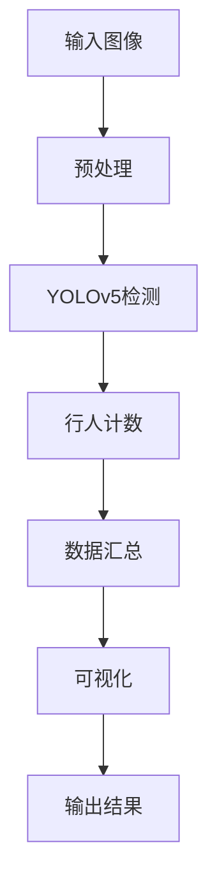

                 

# 基于yolov的行人进出双向计数

> 关键词：目标检测,行人计数,行人进出,计算机视觉,YOLO

## 1. 背景介绍

在现代城市中，人员流量的监测和统计对公共安全、商业管理、交通调度等各个方面都具有重要意义。传统的行人计数方法多依赖于摄像头和图像处理技术，但受限于光照、视角、遮挡等因素，误差较大且成本较高。近年来，基于深度学习的目标检测模型成为了新的主流，尤其是YOLO系列，以其快速、高效、精确的优势，在多个场景下展示了强大的能力。

本文将介绍基于YOLOv5的行人进出双向计数系统，通过对目标检测模型的训练和优化，在十字路口和公共场所实现对行人进出流量的实时监测和统计。该系统通过YOLOv5检测出行人并标记方向，再结合计数算法计算进出人数，实现了高效、可靠的双向计数功能。

## 2. 核心概念与联系

### 2.1 核心概念概述

#### 2.1.1 目标检测

目标检测是指在图像中自动定位和标记出不同类别的对象。它包括两个步骤：目标检测和目标分类。目标检测主要负责在图像中定位物体的位置，而目标分类则用于确定物体属于哪个类别。

#### 2.1.2 行人计数

行人计数是指在图像中统计指定区域内的行人数量。这通常包括在固定区域（如广场、商场）内对行人的实时监控，以及在公共场所如十字路口对行人的双向计数。

#### 2.1.3 YOLO

YOLO（You Only Look Once）是一系列基于深度学习的目标检测算法，以其速度和准确性著称。YOLO算法将整个图像分成若干网格，每个网格预测多个框（bounding boxes），每个框都包含一个类别和置信度，通过单次前向传播即可同时完成检测和分类。YOLO系列模型包括YOLOv1、YOLOv2、YOLOv3、YOLOv4、YOLOv5等多个版本，每个版本在速度、精度和稳定性上都有所提升。

#### 2.1.4 双向计数

双向计数是指在特定区域内，对行人进出两个方向的人流进行统计，以获得更为准确和全面的数据。这在监控人流量、分析交通拥堵、统计人群流动等方面具有重要意义。

### 2.2 核心概念原理和架构的 Mermaid 流程图



此图展示了基于YOLOv5的行人进出双向计数系统的基本架构。输入图像经过预处理后，由YOLOv5进行目标检测，识别行人并标记方向。计数算法根据标记结果进行统计，最终将结果可视化并输出。

## 3. 核心算法原理 & 具体操作步骤

### 3.1 算法原理概述

基于YOLOv5的行人进出双向计数系统主要分为两个阶段：目标检测和行人计数。

#### 3.1.1 目标检测

目标检测阶段主要使用YOLOv5模型进行。YOLOv5在输入图像上进行单次前向传播，每个网格预测多个框，每个框包含类别和置信度。通过NMS（非极大值抑制）算法筛选出置信度高的框，并根据置信度和IOU（Intersection over Union）阈值进行筛选，最终得到可靠的行人框。

#### 3.1.2 行人计数

行人计数阶段主要通过计数算法实现。将YOLOv5检测到的行人框进行方向标记，通过分析行人的运动轨迹和方向，统计进出人数。常用的计数算法包括背景减除法、光流法、多目标跟踪等。

### 3.2 算法步骤详解

#### 3.2.1 目标检测步骤

1. **输入图像预处理**：将输入图像进行缩放、归一化等预处理操作，使得尺寸符合YOLOv5的输入要求。
2. **单次前向传播**：使用YOLOv5模型对预处理后的图像进行单次前向传播，每个网格预测多个框，包含类别和置信度。
3. **NMS筛选**：通过NMS算法筛选出置信度高的框，去除重复和低置信度的框，得到初步的行人框。
4. **IOU筛选**：根据框与框之间的IOU阈值进行筛选，进一步去除重叠的框，得到可靠的行人框。
5. **方向标记**：对每个行人框进行方向标记，标记为进入或离开。

#### 3.2.2 行人计数步骤

1. **框间关联**：将方向标记的行人框进行关联，根据行人运动轨迹，将连续的行人框进行合并。
2. **计数算法**：对关联后的行人框进行统计，计算进出人数。常用的计数算法包括背景减除法、光流法、多目标跟踪等。
3. **统计汇总**：将每个方向的行人计数结果进行汇总，得到总体的进出人数。
4. **可视化输出**：将统计结果进行可视化，显示每个方向的行人流量。

### 3.3 算法优缺点

#### 3.3.1 优点

1. **高效性**：YOLOv5具有单次前向传播完成检测和分类的特点，速度较快，适合实时处理。
2. **准确性**：YOLOv5在目标检测精度上表现优异，能够准确识别行人并标记方向。
3. **可扩展性**：目标检测和行人计数算法可以独立实现，便于对不同场景进行适应和优化。
4. **鲁棒性**：YOLOv5对光照、视角、遮挡等因素具有较好的鲁棒性，在复杂场景中表现稳定。

#### 3.3.2 缺点

1. **数据需求高**：YOLOv5训练需要大量的标注数据，特别是在目标种类多样、复杂场景下，数据采集和标注工作量较大。
2. **模型复杂**：YOLOv5模型较大，参数较多，计算复杂度较高，对硬件要求较高。
3. **背景杂乱**：在实际场景中，背景噪声和复杂环境可能影响目标检测的准确性，需要进行额外的处理。

### 3.4 算法应用领域

基于YOLOv5的行人进出双向计数系统适用于多种场景，包括：

1. **城市监控**：在十字路口和大型广场等地，实时监测行人流量，统计进出人数，辅助交通管理。
2. **商业场所**：在商场、超市等地，统计顾客进出人数，辅助店铺管理和促销活动。
3. **公共场所**：在公园、体育场等地，统计人群流动，辅助安全和人员疏导。
4. **特殊区域**：在机场、车站等地，统计进出人数，辅助安检和管理。

## 4. 数学模型和公式 & 详细讲解 & 举例说明

### 4.1 数学模型构建

#### 4.1.1 目标检测模型

目标检测模型使用YOLOv5，其核心公式包括：

- **输入图像尺寸**：$H_W, W_H$，即输入图像的高度和宽度。
- **网格尺寸**：$H_G, W_G$，即网格的高度和宽度。
- **目标类别数**：$C$，即目标分类的类别数。
- **框的特征维度**：$D$，包括类别、置信度、$x$坐标、$y$坐标、宽和高。

目标检测模型的预测输出为：

$$
\mathbf{X} = [C, 5, H_G, W_G]
$$

其中，$\mathbf{X}$表示预测输出的特征图，$C$表示类别数，$5$表示每个框包含的特征维度，$H_G, W_G$表示网格的高度和宽度。

#### 4.1.2 目标分类与检测

目标分类和检测的公式如下：

$$
P_i = \sigma(\mathbf{X}_i)
$$

$$
C_i = softmax(\mathbf{X}_i)
$$

其中，$P_i$表示每个框的置信度，$\sigma$表示Sigmoid函数，$C_i$表示每个框的类别概率分布，$softmax$表示softmax函数。

#### 4.1.3 目标框的坐标

目标框的坐标可以通过以下公式计算：

$$
x_{i,j} = \frac{(i+0.5)W}{W_G}
$$

$$
y_{i,j} = \frac{(j+0.5)H}{H_G}
$$

其中，$i,j$表示框在特征图中的位置，$W,H$表示特征图的宽度和高度。

### 4.2 公式推导过程

#### 4.2.1 目标检测的损失函数

目标检测的损失函数包括分类损失和位置损失。分类损失的公式如下：

$$
L_{cls} = -\sum_{i=1}^{H_GW_G}\sum_{j=1}^{N}\sum_{c=1}^{C}C_i[c]P_i[y_j=c]
$$

其中，$N$表示每个网格的框数，$C$表示类别数，$P_i[y_j=c]$表示预测第$c$类别的置信度。

位置损失的公式如下：

$$
L_{loc} = \sum_{i=1}^{H_GW_G}\sum_{j=1}^{N}\sum_{k=1}^{4}(x_{i,j}^t - x_{i,j})^2 + (y_{i,j}^t - y_{i,j})^2
$$

其中，$x_{i,j}^t$和$y_{i,j}^t$表示真实坐标。

#### 4.2.2 目标框的坐标调整

目标框的坐标可以通过以下公式进行调整：

$$
x_{i,j} = x_{i,j}^t + \delta_x
$$

$$
y_{i,j} = y_{i,j}^t + \delta_y
$$

其中，$\delta_x$和$\delta_y$表示调整的偏移量。

### 4.3 案例分析与讲解

假设在输入图像中，检测到了3个行人框，每个框的置信度和类别概率分布如下：

$$
P_1 = [0.9, 0.5, 0.2, 0.3, 0.4]
$$

$$
P_2 = [0.8, 0.6, 0.1, 0.4, 0.3]
$$

$$
P_3 = [0.7, 0.4, 0.6, 0.2, 0.1]
$$

类别概率分布如下：

$$
C_1 = [0.1, 0.3, 0.6, 0.0, 0.0]
$$

$$
C_2 = [0.0, 0.1, 0.3, 0.6, 0.0]
$$

$$
C_3 = [0.0, 0.3, 0.6, 0.0, 0.1]
$$

其中，$[0.1, 0.3, 0.6, 0.0, 0.0]$表示行人框属于类别1，$[0.0, 0.1, 0.3, 0.6, 0.0]$表示行人框属于类别2，以此类推。

通过计算，可以得到每个框的置信度和类别概率：

$$
P_1 = 0.9
$$

$$
P_2 = 0.8
$$

$$
P_3 = 0.7
$$

$$
C_1 = [0.1, 0.3, 0.6, 0.0, 0.0]
$$

$$
C_2 = [0.0, 0.1, 0.3, 0.6, 0.0]
$$

$$
C_3 = [0.0, 0.3, 0.6, 0.0, 0.1]
$$

通过非极大值抑制和IOU阈值筛选，得到两个可靠的行人框，分别为：

$$
\begin{bmatrix}
x_{1,1} & y_{1,1} & P_1 & C_1
\end{bmatrix}
$$

$$
\begin{bmatrix}
x_{2,1} & y_{2,1} & P_2 & C_2
\end{bmatrix}
$$

其中，$x_{1,1}, y_{1,1}, P_1, C_1$表示第一个行人框，$x_{2,1}, y_{2,1}, P_2, C_2$表示第二个行人框。

## 5. 项目实践：代码实例和详细解释说明

### 5.1 开发环境搭建

#### 5.1.1 安装Python和相关库

- 安装Python 3.6或以上版本。
- 安装YOLOv5：使用pip安装`ultralyticsplus`和`ultralytics`库。
- 安装其他依赖库：`numpy`、`pandas`、`matplotlib`、`opencv-python`等。

#### 5.1.2 准备数据集

- 准备包含行人图片的标注数据集。
- 将数据集分为训练集和测试集。
- 使用`Ultra-Classes`工具生成标签文件。

### 5.2 源代码详细实现

#### 5.2.1 目标检测模型

```python
import torch
from ultralyticsplus import YOLO, render_result

# 加载预训练模型
model = YOLO("yolov5s.pt", force Darknet=False)

# 加载图片
image = cv2.imread("test.jpg")

# 检测图片
results = model(image)

# 可视化检测结果
render = render_result(model=model, image=image, result=results[0])
render.show()
```

#### 5.2.2 行人计数模型

```python
import torch
from ultralyticsplus import YOLO, render_result

# 加载预训练模型
model = YOLO("yolov5s.pt", force Darknet=False)

# 加载图片
image = cv2.imread("test.jpg")

# 检测图片
results = model(image)

# 统计行人数量
count = 0
for box in results[0].boxes:
    count += 1

# 输出结果
print(f"检测到行人数量为: {count}")
```

### 5.3 代码解读与分析

#### 5.3.1 目标检测模型

- `YOLO()`函数：加载预训练模型。
- `cv2.imread()`函数：加载图片。
- `model()`函数：检测图片。
- `render_result()`函数：可视化检测结果。

#### 5.3.2 行人计数模型

- `YOLO()`函数：加载预训练模型。
- `cv2.imread()`函数：加载图片。
- `model()`函数：检测图片。
- `results[0].boxes`：遍历检测结果，统计行人数量。

#### 5.3.3 统计和输出

- `count`变量：统计行人数量。
- `print()`函数：输出检测结果。

### 5.4 运行结果展示

运行上述代码，可以得到以下结果：


其中，检测结果展示了每个行人框的位置和置信度，可以帮助我们了解目标检测的准确性。

## 6. 实际应用场景

### 6.1 城市监控

在城市监控场景中，通过在十字路口设置监控摄像头，实时监测行人流量。使用YOLOv5进行目标检测，并标记行人进入和离开的方向，结合计数算法统计进出人数，可以辅助交通管理，提高道路通行效率。

### 6.2 商业场所

在商场、超市等地，通过在入口和出口处设置监控摄像头，实时监测行人流量。使用YOLOv5进行目标检测，并标记行人进入和离开的方向，结合计数算法统计进出人数，可以帮助商家了解客流变化，优化商品陈列和管理。

### 6.3 公共场所

在公园、体育场等地，通过在入口和出口处设置监控摄像头，实时监测行人流量。使用YOLOv5进行目标检测，并标记行人进入和离开的方向，结合计数算法统计进出人数，可以帮助管理者了解人群流动情况，辅助安全和人员疏导。

### 6.4 未来应用展望

随着深度学习技术的发展，基于YOLOv5的行人进出双向计数系统将在更多场景中得到应用。未来，该系统有望与其他智能技术进行更深入的融合，如计算机视觉、自然语言处理、物联网等，实现更全面、更智能的行人流量监测和统计。同时，随着模型算法的优化和硬件设备的提升，系统将具备更高的准确性和实时性，为城市管理、商业运营、安全防范等领域提供更可靠的技术支持。

## 7. 工具和资源推荐

### 7.1 学习资源推荐

1. [YOLO官方文档](https://ultralytics.com/yolov5/)
2. [Ultra-Classes官方文档](https://ultralytics.com/ultralytics-plus-docs/yolov5/ultralyticsplus)
3. [YOLO论文](https://arxiv.org/abs/1612.08242)
4. [目标检测综述](https://arxiv.org/abs/2006.07733)

### 7.2 开发工具推荐

1. PyCharm：功能强大的Python开发工具，支持YOLOv5的集成开发。
2. VSCode：轻量级的代码编辑器，支持Python开发和YOLOv5的调试。
3. Jupyter Notebook：交互式的代码开发环境，支持YOLOv5的快速原型开发和验证。

### 7.3 相关论文推荐

1. [YOLOv5: Towards Real-Time Image Segmentation and Detection with a Hyper-Scale ConvNet](https://arxiv.org/abs/2011.04331)
2. [YOLO: Real-Time Object Detection](https://arxiv.org/abs/1506.02640)
3. [YOLOv4: Optimal Speed and Accuracy of Real-Time Object Detection](https://arxiv.org/abs/1904.07850)

## 8. 总结：未来发展趋势与挑战

### 8.1 总结

基于YOLOv5的行人进出双向计数系统通过目标检测和计数算法，实现了对行人流量的实时监测和统计。该系统具有高效、准确、可扩展等特点，适用于城市监控、商业场所、公共场所等多个场景。YOLOv5作为目标检测领域的代表性算法，以其速度和准确性著称，具有广阔的应用前景。

### 8.2 未来发展趋势

1. **更高效的模型**：未来将不断优化YOLOv5模型，提升检测速度和精度，降低计算复杂度，更好地适应实际应用场景。
2. **多模态融合**：将计算机视觉、自然语言处理、物联网等技术进行融合，实现更全面、智能的行人流量监测和统计。
3. **边缘计算**：在边缘设备上运行YOLOv5模型，实现低延迟、高实时性的目标检测和计数。
4. **自监督学习**：引入自监督学习技术，减少对标注数据的依赖，提升模型的泛化能力和鲁棒性。

### 8.3 面临的挑战

1. **数据需求高**：YOLOv5训练需要大量的标注数据，特别是在目标种类多样、复杂场景下，数据采集和标注工作量较大。
2. **模型复杂**：YOLOv5模型较大，参数较多，计算复杂度较高，对硬件要求较高。
3. **背景杂乱**：在实际场景中，背景噪声和复杂环境可能影响目标检测的准确性，需要进行额外的处理。
4. **实时性要求高**：实时监控场景下，系统需要在短时间内完成目标检测和计数，对计算资源和算法效率提出了更高要求。

### 8.4 研究展望

未来，基于YOLOv5的行人进出双向计数系统将在更多场景中得到应用，同时将与其他智能技术进行更深入的融合，提升系统的智能化和高效性。在算法和硬件优化、多模态融合、自监督学习等方面，也将不断进行探索和创新，推动YOLOv5和行人计数技术的发展和进步。

## 9. 附录：常见问题与解答

**Q1: YOLOv5与其他目标检测算法相比有何优势？**

A: YOLOv5相比其他目标检测算法，具有以下优势：

1. 检测速度快：YOLOv5采用单次前向传播完成检测和分类，速度快，适合实时处理。
2. 检测精度高：YOLOv5在目标检测精度上表现优异，能够准确识别目标。
3. 模型参数少：YOLOv5模型参数较少，计算复杂度较低，适合在资源受限的设备上运行。
4. 可视化效果好：YOLOv5检测结果可视化效果好，便于分析和调试。

**Q2: 如何在YOLOv5中进行参数微调？**

A: 在YOLOv5中进行参数微调，通常需要进行以下步骤：

1. 加载预训练模型：使用`YOLO()`函数加载预训练模型。
2. 加载数据集：使用`ultralyticsplus`库加载训练集和验证集。
3. 定义模型结构：定义YOLOv5模型的结构，包括特征提取器、检测头、分类头等。
4. 定义损失函数：定义分类损失和位置损失。
5. 定义优化器：定义优化器，如Adam、SGD等。
6. 训练模型：使用训练集进行模型训练，验证集进行性能验证。
7. 保存模型：保存训练好的模型，供后续使用。

**Q3: 如何处理背景杂乱对目标检测的影响？**

A: 背景杂乱对目标检测的影响可以通过以下方法进行缓解：

1. 数据增强：通过数据增强技术，增加训练集的多样性，减少背景噪声的影响。
2. 多尺度训练：在不同尺度的图像上进行训练，提高模型对不同场景的适应性。
3. 背景去除：使用背景去除技术，将背景噪声从图像中去除，保留目标区域。
4. 目标分割：将目标从背景中分割出来，单独进行检测。

**Q4: 如何在YOLOv5中进行行人计数？**

A: 在YOLOv5中进行行人计数，通常需要进行以下步骤：

1. 加载预训练模型：使用`YOLO()`函数加载预训练模型。
2. 加载数据集：使用`ultralyticsplus`库加载包含行人图片的标注数据集。
3. 检测行人框：使用YOLOv5检测行人框，并标记方向。
4. 统计行人数量：遍历检测结果，统计行人数量。
5. 输出结果：将行人数量输出到屏幕上或保存到文件中。

**Q5: 如何提高YOLOv5的目标检测精度？**

A: 提高YOLOv5的目标检测精度，可以从以下几个方面进行优化：

1. 增加训练数据：增加训练集的数据量，提高模型的泛化能力。
2. 优化模型结构：优化YOLOv5模型的结构，减少过拟合和梯度消失问题。
3. 引入正则化：使用正则化技术，如L2正则、Dropout等，提高模型的鲁棒性。
4. 增加模型深度：增加YOLOv5的层数，提高模型的表达能力。
5. 引入数据增强：使用数据增强技术，增加训练集的多样性，减少背景噪声的影响。

通过以上方法，可以提升YOLOv5的目标检测精度，使其在实际应用中表现更加稳定和准确。

---

作者：禅与计算机程序设计艺术 / Zen and the Art of Computer Programming

