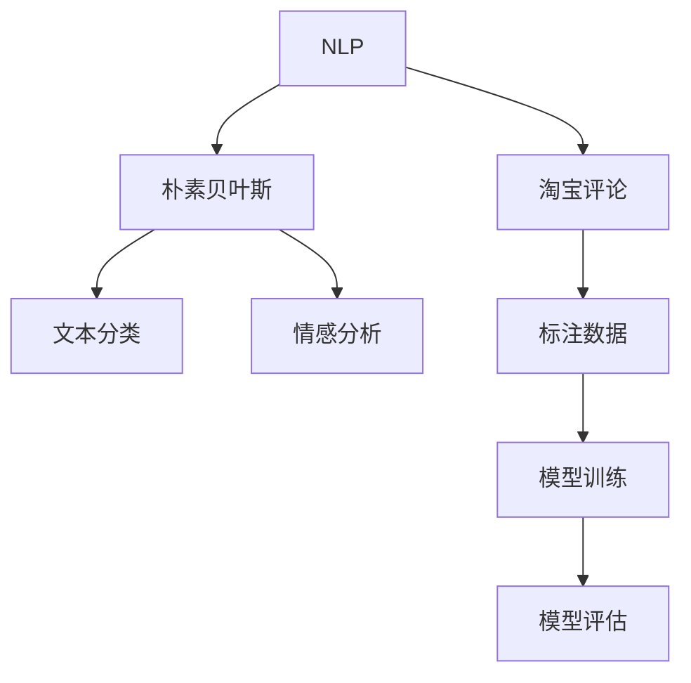

                 

# 基于朴素贝叶斯的淘宝评论分析与应用

> 关键词：淘宝评论, 自然语言处理, 朴素贝叶斯, 情感分析, 文本分类, 机器学习

## 1. 背景介绍

### 1.1 问题由来

在电子商务的迅猛发展下，淘宝作为中国最大的电商平台之一，其平台上每天产生的海量评论数据提供了丰富的消费者反馈信息。如何有效利用这些数据，快速识别消费者对商品、店铺的评价，提升淘宝的搜索排序和推荐算法，增强用户体验，成为电商平台亟需解决的挑战。自然语言处理技术（Natural Language Processing, NLP）特别是文本分类和情感分析方法为解决这一问题提供了重要手段。

### 1.2 问题核心关键点

淘宝评论数据属于自然语言数据，其分析处理涉及自然语言处理（NLP）技术。文本分类和情感分析是NLP中的经典任务，通过模型训练可以对评论进行自动分类和情感判断。朴素贝叶斯（Naive Bayes）是一种简单而有效的概率模型，常用于文本分类和情感分析。其基于贝叶斯定理，通过训练模型计算文本属于各类别的概率，从而实现分类或情感判断。

本文聚焦于利用朴素贝叶斯模型对淘宝评论进行情感分析和文本分类，探索其在淘宝评论中的应用，以期提升淘宝平台的用户体验和搜索排序效率。

## 2. 核心概念与联系

### 2.1 核心概念概述

为更好地理解基于朴素贝叶斯的淘宝评论分析方法，本节将介绍几个密切相关的核心概念：

- **自然语言处理（NLP）**：涉及自然语言的表示、分析和生成等技术，旨在使计算机理解和处理人类语言。

- **朴素贝叶斯（Naive Bayes）**：一种基于贝叶斯定理的简单概率模型，常用于文本分类和情感分析。它假设各个特征（如单词）对文本类别的影响是独立的，因而称为“朴素”。

- **文本分类**：将文本数据自动分类到预定义的若干类别中，如评论的情感分类。

- **情感分析**：分析文本的情感倾向，判断其是正面、负面还是中性。

- **淘宝评论**：指用户在淘宝平台上对商品或店铺的评价，包括文字评论和评分等。

- **机器学习（ML）**：让计算机从数据中学习并自动改进算法，提升对新数据的预测准确度。

- **监督学习**：利用标注数据训练模型，使模型能够对新数据进行分类或预测。

- **标注数据**：已分类或已标注的训练数据，用于训练和验证模型的性能。

- **模型评估**：通过测试数据集评估模型性能，如准确率、召回率、F1分数等。

这些概念之间的逻辑关系可以通过以下Mermaid流程图来展示：



这个流程图展示了大语言模型的核心概念及其之间的关系：

1. 自然语言处理通过数据预处理等技术，将自然语言转换为计算机可以处理的格式。
2. 朴素贝叶斯模型基于概率论，通过训练数据学习文本与类别之间的概率关系。
3. 文本分类和情感分析，通过训练好的朴素贝叶斯模型，对评论进行分类和情感判断。
4. 淘宝评论是数据来源，经过预处理和标注后，用于训练和评估模型。
5. 机器学习通过训练数据，不断优化模型性能。

这些概念共同构成了朴素贝叶斯在文本分类和情感分析中的工作原理和优化方向。通过理解这些核心概念，我们可以更好地把握朴素贝叶斯模型的工作原理和优化方向。

## 3. 核心算法原理 & 具体操作步骤
### 3.1 算法原理概述

基于朴素贝叶斯的淘宝评论分析方法，核心思想是通过朴素贝叶斯模型，将评论文本自动分类或情感判断，以提升淘宝的搜索排序和推荐算法。

具体来说，朴素贝叶斯模型通过训练学习评论文本的特征（如单词、短语等）与评论类别（如好评、差评等）之间的概率关系。对于新的评论文本，模型根据已学习的概率分布预测其所属类别。在情感分析中，通常将评论分类为正面、负面或中性。

数学上，朴素贝叶斯模型基于贝叶斯定理，对于给定类别 $C$ 和特征 $X_1, ..., X_n$ 的联合概率，可以通过条件概率计算得到：

$$
P(C|X_1,...,X_n) = \frac{P(C)\prod_{i=1}^{n}P(X_i|C)}{\sum_{c\in C'}P(c)\prod_{i=1}^{n}P(X_i|c)}
$$

其中 $P(C)$ 为类别 $C$ 的概率，$P(X_i|C)$ 为特征 $X_i$ 在类别 $C$ 下的概率，$C'$ 为所有可能类别的集合。

在实际应用中，我们通常使用多项式朴素贝叶斯（Multinomial Naive Bayes）或伯努利朴素贝叶斯（Bernoulli Naive Bayes），具体取决于文本特征的表示方式。多项式朴素贝叶斯适用于计数字典特征（如单词计数），而伯努利朴素贝叶斯适用于二值特征（如单词出现与否）。

### 3.2 算法步骤详解

基于朴素贝叶斯的淘宝评论分析方法一般包括以下几个关键步骤：

**Step 1: 准备数据集**
- 收集淘宝评论数据集，包括文本和标签信息。
- 对数据进行清洗，去除噪音和无关信息。
- 划分训练集和测试集，通常采取7:3或8:2的比例。

**Step 2: 特征提取**
- 将评论文本转换为模型可以处理的特征形式。
- 常用的特征提取方式包括词袋模型（Bag of Words）、TF-IDF等。
- 对于多项式朴素贝叶斯，将评论拆分为单词，计算每个单词在评论中出现的次数。
- 对于伯努利朴素贝叶斯，将评论中每个单词是否出现作为特征。

**Step 3: 模型训练**
- 使用训练集数据，训练朴素贝叶斯模型。
- 计算每个类别下每个特征的条件概率。
- 常用的模型训练算法包括最大似然估计（Maximum Likelihood Estimation,MLE）和最大后验估计（Maximum A Posteriori, MAP）。

**Step 4: 模型评估与调参**
- 使用测试集数据，评估模型性能。
- 常用的模型评估指标包括准确率、召回率、F1分数等。
- 调整模型参数，如平滑概率（Smoothing Probability），优化模型性能。

**Step 5: 模型应用**
- 对新的评论文本进行特征提取。
- 将提取的特征输入到训练好的朴素贝叶斯模型中，预测其所属类别。
- 在情感分析任务中，将评论分类为正面、负面或中性。

### 3.3 算法优缺点

基于朴素贝叶斯的淘宝评论分析方法具有以下优点：

1. 简单易用。朴素贝叶斯模型计算简单，易于实现和部署。
2. 实时性好。模型训练和预测速度较快，适用于需要实时处理大量评论数据的场景。
3. 可解释性强。朴素贝叶斯模型基于概率论，输出结果具有较强的解释性。
4. 适用性广。可以用于多种NLP任务，如文本分类、情感分析等。

同时，该方法也存在一定的局限性：

1. 假设独立性。朴素贝叶斯假设各个特征相互独立，现实中这一假设可能不成立。
2. 需要大量标注数据。模型训练需要大量的标注数据，标注成本较高。
3. 对新词处理不足。对于未在训练集中出现的新词，模型处理效果不佳。
4. 不适用于复杂特征。当特征空间较大时，朴素贝叶斯模型可能会过拟合。

尽管存在这些局限性，朴素贝叶斯方法仍是一种简单高效、适用于文本分类和情感分析任务的模型。

### 3.4 算法应用领域

朴素贝叶斯模型广泛应用于文本分类和情感分析等领域，其简单的计算方式和较好的分类效果，使得其在NLP领域具有广泛的应用前景：

- 文本分类：如垃圾邮件过滤、新闻分类、产品评论分类等。通过训练朴素贝叶斯模型，将文本自动分类到预定义的若干类别中。
- 情感分析：如情感评论识别、舆情分析、社交媒体情感判断等。通过训练模型，判断文本情感倾向为正面、负面或中性。
- 命名实体识别：如识别新闻中的人名、地名、机构名等实体。通过训练模型，对文本中的实体进行分类和识别。
- 信息检索：如网页搜索、知识图谱构建等。通过训练模型，将文本与文档库或知识图谱中的实体进行匹配和检索。

除了上述这些经典任务外，朴素贝叶斯方法还被创新性地应用到更多场景中，如医学文本分析、金融舆情监测、用户行为预测等，为NLP技术带来了全新的突破。

## 4. 数学模型和公式 & 详细讲解 & 举例说明
### 4.1 数学模型构建

本节将使用数学语言对基于朴素贝叶斯的淘宝评论分析过程进行更加严格的刻画。

记评论数据集为 $D=\{(x_i, y_i)\}_{i=1}^N$，其中 $x_i$ 为评论文本，$y_i$ 为标签（如情感分类）。

定义朴素贝叶斯模型为 $P(Y|X)$，其中 $Y$ 为类别（如正面、负面、中性），$X$ 为特征（如单词、短语等）。模型的训练目标是最大化似然函数：

$$
P(D|P(Y|X)) = \prod_{i=1}^{N}P(y_i|x_i)P(x_i)
$$

其中 $P(y_i|x_i)$ 为条件概率，$P(x_i)$ 为先验概率。

在训练过程中，我们使用最大似然估计（MLE）或最大后验估计（MAP）计算模型参数。

### 4.2 公式推导过程

以文本分类为例，假设模型训练后的类别条件概率为 $P(C|X)$，其中 $C$ 为类别，$X$ 为特征（如单词）。对于新的评论文本 $x$，其类别为 $C$ 的概率为：

$$
P(C|x) = \frac{P(x|C)P(C)}{\sum_{c\in C'}P(c|x)P(c)}
$$

其中 $P(x|C)$ 为特征 $x$ 在类别 $C$ 下的条件概率，$P(C)$ 为类别 $C$ 的先验概率，$C'$ 为所有可能类别的集合。

在情感分析中，通常将评论分类为正面、负面或中性。假设模型训练后，正面评论的概率为 $P^+$，负面评论的概率为 $P^-$，中性评论的概率为 $P^0$。对于新的评论文本 $x$，其情感为正面的概率为：

$$
P^+|x = \frac{P(x|^+P^+)P^+}{P^+P(x|^+P^+)+P^-(x|^-P^-)P^-+P^0(x|^0P^0)P^0}
$$

其中 $P(x|^+P^+)$ 为评论 $x$ 在正面评论条件下的条件概率，$P^-(x|^-P^-)$ 和 $P^0(x|^0P^0)$ 同理。

### 4.3 案例分析与讲解

以下以一个简单的文本分类示例，展示如何使用朴素贝叶斯模型进行评论分类。

假设评论数据集包括两条评论，分别为正面和负面评论。评论文本和标签如下：

| 评论文本 | 标签 |
| --- | --- |
| 非常好，性价比很高。 | 正面 |
| 非常差，服务态度恶劣。 | 负面 |

对于每条评论，我们提取单词作为特征。训练过程中，计算每个类别下每个特征的条件概率。

- 对于正面评论，计算单词 "非常好"、"性价比" 等在正面评论条件下的条件概率。
- 对于负面评论，计算单词 "非常差"、"服务态度" 等在负面评论条件下的条件概率。

模型训练后，对于新的评论文本 "产品质量很好"，我们可以计算其属于正面评论的概率：

$$
P^+(评论文本) = \frac{P(评论文本|^+P^+)}{P^+}
$$

其中 $P(评论文本|^+P^+)$ 为评论文本在正面评论条件下的条件概率。

## 5. 项目实践：代码实例和详细解释说明
### 5.1 开发环境搭建

在进行项目实践前，我们需要准备好开发环境。以下是使用Python进行朴素贝叶斯模型的环境配置流程：

1. 安装Anaconda：从官网下载并安装Anaconda，用于创建独立的Python环境。

2. 创建并激活虚拟环境：
```bash
conda create -n naively/env python=3.8 
conda activate naively/env
```

3. 安装相关库：
```bash
conda install pandas scikit-learn nltk
```

4. 下载数据集：
```bash
wget http://people.csail.mit.edu/jrennie/people.csail.mit.edu/jrennie/20news-bydate.tar.gz
tar xvf 20news-bydate.tar.gz
```

完成上述步骤后，即可在`naively/env`环境中开始项目实践。

### 5.2 源代码详细实现

下面以文本分类为例，给出使用Scikit-learn库实现朴素贝叶斯模型的Python代码实现。

首先，定义文本分类任务的数据处理函数：

```python
import nltk
from sklearn.feature_extraction.text import CountVectorizer
from sklearn.naive_bayes import MultinomialNB
from sklearn.metrics import accuracy_score, confusion_matrix, classification_report

def process_data(data_path):
    with open(data_path, 'r', encoding='utf-8') as f:
        lines = f.readlines()
    
    texts = []
    labels = []
    for line in lines:
        parts = line.strip().split('\t')
        label = int(parts[0])
        text = ' '.join(parts[1:])
        texts.append(text)
        labels.append(label)
    
    return texts, labels
```

然后，定义朴素贝叶斯模型并进行训练：

```python
texts, labels = process_data('20news-bydate/text')
vectorizer = CountVectorizer()
X = vectorizer.fit_transform(texts)
y = labels

model = MultinomialNB()
model.fit(X, y)
```

接着，定义测试集并进行模型评估：

```python
test_texts, test_labels = process_data('20news-bydate/test')
test_X = vectorizer.transform(test_texts)
predicted_labels = model.predict(test_X)
```

最后，输出模型评估结果：

```python
print('Accuracy:', accuracy_score(test_labels, predicted_labels))
print('Confusion Matrix:', confusion_matrix(test_labels, predicted_labels))
print('Classification Report:', classification_report(test_labels, predicted_labels))
```

以上就是使用Scikit-learn库对20news数据集进行朴素贝叶斯模型训练和评估的完整代码实现。可以看到，通过简单的函数定义，就可以方便地实现朴素贝叶斯模型的训练和评估。

### 5.3 代码解读与分析

让我们再详细解读一下关键代码的实现细节：

**process_data函数**：
- 定义一个函数，接收数据路径作为参数。
- 打开文件，逐行读取数据，每行数据由分类标签和文本内容构成，以Tab分隔。
- 将文本内容和标签分别存储在`texts`和`labels`中，返回给调用者。

**MultinomialNB模型**：
- 从Scikit-learn库中导入`MultinomialNB`类，创建朴素贝叶斯模型。
- 使用`fit`方法，将特征矩阵`X`和标签`y`传入模型，进行训练。

**测试集处理与预测**：
- 使用与训练集相同的`CountVectorizer`，对测试集文本进行特征提取，得到特征矩阵`test_X`。
- 调用训练好的模型`predict`方法，对测试集特征进行预测，得到预测标签`predicted_labels`。

**模型评估**：
- 使用`accuracy_score`计算模型在测试集上的准确率。
- 使用`confusion_matrix`计算模型在测试集上的混淆矩阵。
- 使用`classification_report`生成分类报告，包含精确率、召回率、F1分数等指标。

通过以上步骤，可以完成朴素贝叶斯模型在20news数据集上的训练和评估。在实际应用中，还可以将模型封装为服务接口，方便与其他系统进行集成调用。

## 6. 实际应用场景
### 6.1 淘宝评论情感分析

基于朴素贝叶斯的情感分析方法，可以应用于淘宝评论的情感分类。通过训练模型，自动识别评论的情感倾向，帮助商家了解用户反馈，及时改进商品质量，提升用户满意度。

具体实现步骤如下：

1. 收集淘宝评论数据集，包括文本和标签信息（如好评、差评）。
2. 对数据进行清洗和预处理，去除噪音和无关信息。
3. 使用朴素贝叶斯模型对评论文本进行情感分类。
4. 根据情感分类结果，优化商品推荐和搜索排序算法。

### 6.2 淘宝评论文本分类

基于朴素贝叶斯的文本分类方法，可以应用于淘宝评论的文本分类，如将评论分类为推荐、不推荐、中评等。通过训练模型，自动识别评论的分类，帮助商家更好地理解用户需求，提升商品推荐效果。

具体实现步骤如下：

1. 收集淘宝评论数据集，包括文本和标签信息（如推荐、不推荐、中评）。
2. 对数据进行清洗和预处理，去除噪音和无关信息。
3. 使用朴素贝叶斯模型对评论文本进行分类。
4. 根据文本分类结果，优化搜索排序和推荐算法。

### 6.3 淘宝评论主题分类

基于朴素贝叶斯的文本分类方法，可以应用于淘宝评论的主题分类，如将评论分类为售后服务、产品质量、物流配送等。通过训练模型，自动识别评论的主题，帮助商家更好地了解用户需求，改进服务质量。

具体实现步骤如下：

1. 收集淘宝评论数据集，包括文本和标签信息（如售后服务、产品质量、物流配送）。
2. 对数据进行清洗和预处理，去除噪音和无关信息。
3. 使用朴素贝叶斯模型对评论文本进行分类。
4. 根据文本分类结果，优化搜索排序和推荐算法。

### 6.4 未来应用展望

随着大数据和云计算技术的不断进步，朴素贝叶斯方法在NLP领域的应用前景将更加广阔。未来，朴素贝叶斯模型将与深度学习、自然语言生成等前沿技术进行深度融合，进一步提升其在NLP领域的应用效果。

在电子商务领域，朴素贝叶斯方法将与其他AI技术协同发力，更好地理解和处理用户反馈，提升用户体验和商家运营效率。

在智能客服、金融舆情监测、医学文本分析等领域，朴素贝叶斯方法也将发挥重要作用，推动NLP技术在更广泛的应用场景中落地。

## 7. 工具和资源推荐
### 7.1 学习资源推荐

为了帮助开发者系统掌握朴素贝叶斯模型的理论基础和实践技巧，这里推荐一些优质的学习资源：

1. 《Python自然语言处理》（第三版）书籍：由施晓晖著，深入浅出地介绍了NLP基础技术和算法，包括朴素贝叶斯模型。

2. Coursera《自然语言处理专项课程》：由斯坦福大学开设的NLP入门课程，涵盖NLP基础、文本分类、情感分析等，适合初学者入门。

3. Kaggle竞赛：参加Kaggle的NLP相关竞赛，可以锻炼实战能力，积累项目经验。

4. scikit-learn官方文档：详细介绍了朴素贝叶斯模型和相关库的使用方法，适合快速上手项目实践。

通过这些资源的学习实践，相信你一定能够快速掌握朴素贝叶斯模型的精髓，并用于解决实际的NLP问题。
###  7.2 开发工具推荐

高效的开发离不开优秀的工具支持。以下是几款用于朴素贝叶斯模型开发的常用工具：

1. Jupyter Notebook：提供交互式编程环境，方便进行数据处理、模型训练和结果展示。

2. Python：广泛使用的编程语言，拥有大量第三方库和工具，支持NLP任务的开发。

3. NLTK：Python的自然语言处理库，提供了丰富的NLP功能和工具，适合文本处理任务。

4. CountVectorizer：用于特征提取的库，支持词袋模型等常见特征提取方法。

5. scikit-learn：机器学习库，提供了朴素贝叶斯模型和相关工具，适合进行模型训练和评估。

6. Pandas：数据分析库，用于数据清洗和预处理。

合理利用这些工具，可以显著提升朴素贝叶斯模型在项目实践中的开发效率，加速创新迭代的步伐。

### 7.3 相关论文推荐

朴素贝叶斯方法的研究源远流长，以下是几篇奠基性的相关论文，推荐阅读：

1. "A Decision-Theoretic Generalization of On-Line Learning and a Relative Entropy Risk Minimization Principle"（决策理论下的在线学习泛化与相对熵风险最小化原理）：提出朴素贝叶斯模型，通过决策理论解释贝叶斯方法的优势。

2. "Bayesian Classification and its Multinomial Generalization"（贝叶斯分类及其多项式泛化）：提出多项式朴素贝叶斯模型，解决贝叶斯分类中的零概率问题。

3. "The Kernel Multinomial Logistic Regression for Natural Language Processing"（自然语言处理中的核多项式逻辑回归）：提出朴素贝叶斯模型在NLP中的应用，包括文本分类和情感分析。

4. "Bayesian Reasoning and Machine Learning"（贝叶斯推理和机器学习）：全面介绍了贝叶斯方法和朴素贝叶斯模型在机器学习中的应用，适合深入理解。

5. "A Bayesian Framework for Automatic Part-of-Speech Tagging"（自动词性标注的贝叶斯框架）：提出朴素贝叶斯模型在NLP中的实际应用，适合学习朴素贝叶斯模型的具体实现。

这些论文代表了大语言模型微调技术的发展脉络。通过学习这些前沿成果，可以帮助研究者把握学科前进方向，激发更多的创新灵感。

## 8. 总结：未来发展趋势与挑战
### 8.1 总结

本文对基于朴素贝叶斯的淘宝评论分析方法进行了全面系统的介绍。首先阐述了朴素贝叶斯模型的背景和应用意义，明确了其在淘宝评论中的重要地位。其次，从原理到实践，详细讲解了朴素贝叶斯模型的数学原理和操作步骤，给出了朴素贝叶斯模型的完整代码实现。同时，本文还广泛探讨了朴素贝叶斯模型在电商评论分析中的应用，展示了其巨大的实际价值。

通过本文的系统梳理，可以看到，基于朴素贝叶斯的电商评论分析方法，是一种简单高效、适用于文本分类和情感分析任务的模型。通过朴素贝叶斯模型，可以高效、准确地处理淘宝评论数据，为电商平台的搜索排序和推荐算法提供重要支撑。未来，随着NLP技术的不断进步，朴素贝叶斯模型在电子商务领域的应用将更加广泛，带来更多的商业价值和社会效益。

### 8.2 未来发展趋势

展望未来，朴素贝叶斯方法将在NLP领域持续发挥其重要作用，呈现以下几个发展趋势：

1. 与深度学习结合。朴素贝叶斯模型在处理高维稀疏数据时具有优势，与深度学习模型结合，可以充分发挥各自优势，提升模型性能。

2. 应用范围不断拓展。除了文本分类和情感分析，朴素贝叶斯模型还可以应用于机器翻译、信息检索等更多NLP任务。

3. 与多模态数据结合。朴素贝叶斯模型可以与视觉、语音等多模态数据结合，提升其在智能交互中的应用效果。

4. 持续学习和在线更新。通过在线更新模型参数，持续学习新数据，朴素贝叶斯模型可以适应数据分布的变化，保持高性能。

5. 可解释性和可解释性增强。朴素贝叶斯模型具有较好的可解释性，未来可以结合因果推理等方法，增强模型的输出解释性。

这些趋势凸显了朴素贝叶斯方法在NLP领域的重要地位，其简单高效的优势，将在未来NLP技术的发展中继续发挥重要作用。

### 8.3 面临的挑战

尽管朴素贝叶斯方法已经取得了不俗的成绩，但在迈向更加智能化、普适化应用的过程中，仍面临诸多挑战：

1. 数据稀疏性问题。朴素贝叶斯模型在处理高维稀疏数据时，容易陷入维数灾难，需要采取降维等技术手段。

2. 数据分布变化问题。随着数据分布的变化，朴素贝叶斯模型需要不断调整，以保持其性能。

3. 模型复杂度问题。朴素贝叶斯模型在处理复杂特征时，可能需要进行模型简化，以减少计算复杂度。

4. 模型的可扩展性问题。随着数据量的增大，朴素贝叶斯模型需要具备更好的可扩展性和高效性，以支持大规模数据处理。

5. 模型的公平性和鲁棒性问题。在面对偏见、噪音等数据问题时，朴素贝叶斯模型需要具备更好的公平性和鲁棒性。

这些挑战需要我们进一步深入研究，不断优化朴素贝叶斯模型，以适应复杂多变的实际应用需求。

### 8.4 研究展望

面对朴素贝叶斯方法所面临的挑战，未来的研究需要在以下几个方面寻求新的突破：

1. 引入深度学习特征提取。将深度学习特征提取方法引入朴素贝叶斯模型，提升模型的特征表示能力。

2. 结合因果推理和逻辑规则。将因果推理、逻辑规则等先验知识与朴素贝叶斯模型结合，提升模型的解释性和准确性。

3. 引入多模态数据。将视觉、语音等多模态数据与文本数据结合，提升模型的泛化能力和鲁棒性。

4. 强化学习结合。将强化学习引入朴素贝叶斯模型，提升模型的动态适应能力。

5. 引入大样本在线学习。利用大样本在线学习算法，提升模型对新数据的快速适应能力。

这些研究方向的研究突破，必将引领朴素贝叶斯方法在NLP领域迈向更高的台阶，为构建智能交互系统提供有力支撑。

## 9. 附录：常见问题与解答

**Q1：朴素贝叶斯模型适用于所有NLP任务吗？**

A: 朴素贝叶斯模型在处理高维稀疏数据时具有优势，适用于文本分类和情感分析等任务。但对于一些复杂任务，如机器翻译、信息检索等，可能表现不佳。需要根据具体任务选择合适的模型。

**Q2：朴素贝叶斯模型需要大量标注数据吗？**

A: 朴素贝叶斯模型需要大量标注数据进行训练，标注成本较高。但可以通过领域自适应、半监督学习等技术，降低对标注数据的依赖。

**Q3：朴素贝叶斯模型的计算复杂度如何？**

A: 朴素贝叶斯模型计算简单，训练和推理速度较快。但在处理高维稀疏数据时，可能出现维数灾难，需要采取降维等技术手段。

**Q4：朴素贝叶斯模型适用于多模态数据吗？**

A: 朴素贝叶斯模型可以与视觉、语音等多模态数据结合，提升其在智能交互中的应用效果。

**Q5：朴素贝叶斯模型的鲁棒性如何？**

A: 朴素贝叶斯模型在面对噪音、偏见等数据问题时，可能表现不佳。需要采取正则化、样本筛选等技术手段，提升模型的鲁棒性。

通过以上问题解答，可以帮助研究者更好地理解朴素贝叶斯模型的特点和局限性，指导未来的研究方向和应用实践。

---

作者：禅与计算机程序设计艺术 / Zen and the Art of Computer Programming

