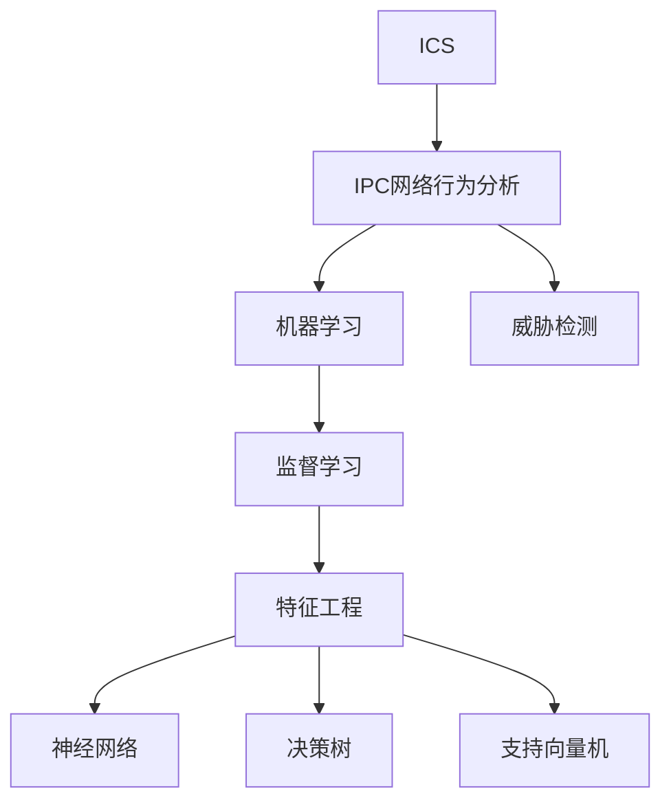

                 

# 基于机器学习的IPC网络行为安全检测

## 1. 背景介绍

随着互联网的迅猛发展，网络安全问题变得越来越严峻。近年来，针对工业控制系统的攻击频繁发生，造成了巨大的经济损失。工业控制系统(Industrial Control Systems, 简称ICS)，包括自动化、监控、控制等系统，广泛应用在电力、石油、化工等关键基础设施领域。它们通常运行在较为封闭的网络环境中，而开放的互联网和移动设备的普及，使得ICS成为新的攻击目标。

IPC（Internet Protocol Camera，即IP网络摄像机）在监控应用中被广泛使用，同时，它也是ICS网络中的一个常见组件。由于IPC设备与互联网直接连接，攻击者可能利用IPC设备作为跳板，发动针对工业控制系统的攻击。因此，对IPC设备的网络行为进行安全检测，是保障ICS安全的关键措施之一。

## 2. 核心概念与联系

### 2.1 核心概念概述

为了更好地理解基于机器学习的IPC网络行为安全检测，本节将介绍几个密切相关的核心概念：

- 工业控制系统(ICS)：指用于监控、控制关键基础设施的自动化系统，包括自动化控制系统、监控系统、数据采集与监视控制系统(SCADA)等。
- IPC网络行为分析：指对IPC设备的网络行为进行分析，识别异常行为，并根据特征进行威胁检测。
- 机器学习(ML)：指通过数据驱动的学习方法，使机器能够从数据中学习规律，自动提升其性能。
- 监督学习(Supervised Learning)：指使用有标签的数据进行训练，让模型能够对新数据进行分类或回归预测的机器学习方法。
- 特征工程(Feature Engineering)：指对原始数据进行处理，提取有意义的特征，提升模型性能的预处理技术。
- 神经网络(Neural Network)：指受人类大脑启发的复杂非线性模型，广泛应用于图像、语音、文本等多种类型的数据处理。
- 决策树(Decision Tree)：指一种树状结构的分类模型，通过分裂节点的方式进行决策。
- 支持向量机(SVM)：指通过找到数据的高维特征空间中的最优超平面，将数据分成两类或多类的分类模型。

这些核心概念之间的逻辑关系可以通过以下Mermaid流程图来展示：



这个流程图展示了大语言模型的核心概念及其之间的关系：

1. 工业控制系统通过IPC设备进行监控，而IPC设备的网络行为是威胁检测的重要指标。
2. 机器学习通过学习网络行为特征，使模型能够对新数据进行分类或回归预测。
3. 监督学习利用有标签的数据，使模型能够进行精确的分类或回归。
4. 特征工程对原始数据进行处理，提取特征以提升模型性能。
5. 神经网络、决策树、支持向量机等不同的机器学习模型，都可以用于威胁检测。
6. 威胁检测通过对网络行为特征的分析，确定是否存在威胁。

## 3. 核心算法原理 & 具体操作步骤

### 3.1 算法原理概述

基于机器学习的IPC网络行为安全检测，本质上是一个有监督的分类问题。其核心思想是：通过收集IPC设备的网络行为数据，将其标记为正常或异常，并在此基础上使用监督学习算法训练模型，从而能够对新的网络行为数据进行威胁检测。

形式化地，假设IPC设备的网络行为数据集为 $D=\{(x_i, y_i)\}_{i=1}^N$，其中 $x_i$ 表示第 $i$ 条网络行为记录，$y_i$ 表示 $x_i$ 的标签，$y_i \in \{0, 1\}$，$0$ 表示正常，$1$ 表示异常。

定义模型 $M$ 在输入 $x$ 上的输出为 $\hat{y}=M(x)$，即模型预测结果。则威胁检测的目标是最小化分类误差，即：

$$
\mathcal{L}(M)=\frac{1}{N}\sum_{i=1}^N I(y_i \neq \hat{y})
$$

其中 $I(\cdot)$ 为示性函数，当条件成立时返回 $1$，否则返回 $0$。

通过梯度下降等优化算法，威胁检测过程不断更新模型参数 $\theta$，最小化损失函数 $\mathcal{L}(M)$，使得模型输出逼近真实标签。由于机器学习模型已经在大规模网络行为数据上进行预训练，因此即便在异常行为较少的情况下，也能快速收敛到理想的模型参数 $\hat{\theta}$。

### 3.2 算法步骤详解

基于机器学习的IPC网络行为安全检测一般包括以下几个关键步骤：

**Step 1: 数据预处理**

- 收集IPC设备的网络行为数据，确保数据的多样性和代表性。
- 对数据进行清洗，去除噪音和无关信息。
- 将数据分为训练集和测试集，确保模型在未见过的数据上也能够泛化。

**Step 2: 特征提取**

- 对原始网络行为数据进行特征工程，提取有意义的特征。
- 常见的特征包括数据流量、连接时间、端口、协议等。
- 特征提取过程中，需要考虑特征之间的相关性和重要性，去除冗余特征。

**Step 3: 模型选择与训练**

- 选择合适的机器学习模型，如神经网络、决策树、支持向量机等。
- 在训练集上使用监督学习算法训练模型，最小化分类误差。
- 使用交叉验证等技术评估模型性能，选择合适的超参数。

**Step 4: 威胁检测**

- 在测试集上评估模型性能，计算准确率、召回率、F1值等指标。
- 对新的网络行为数据进行威胁检测，预测是否存在异常行为。

**Step 5: 模型部署与应用**

- 将训练好的模型部署到生产环境。
- 实时监控IPC设备的网络行为，使用模型进行威胁检测。
- 根据检测结果进行应急响应，保护工业控制系统安全。

以上是基于机器学习的IPC网络行为安全检测的一般流程。在实际应用中，还需要根据具体任务的特点，对特征提取、模型训练等环节进行优化设计，以进一步提升模型性能。

### 3.3 算法优缺点

基于机器学习的IPC网络行为安全检测方法具有以下优点：

1. 高效实时。模型训练完成后，可以实时检测IPC设备的网络行为，快速识别威胁。
2. 准确率高。使用监督学习算法训练的模型能够很好地适应特定任务，预测准确率较高。
3. 泛化能力强。模型在大规模数据上进行预训练，对新数据有较好的泛化能力。
4. 可解释性强。机器学习模型能够提供特征重要性解释，有助于理解模型决策过程。

同时，该方法也存在一定的局限性：

1. 对标注数据依赖较大。模型的性能很大程度上取决于标注数据的质量和数量，获取高质量标注数据的成本较高。
2. 模型复杂度高。大模型通常需要较长的训练时间和较大的计算资源，不适合实时性要求高的场景。
3. 特征提取难度大。网络行为特征复杂多样，需要较强的特征工程能力。
4. 对抗攻击脆弱。模型可能受到对抗样本的攻击，影响检测结果。
5. 易受数据分布变化影响。模型训练时使用的数据分布与实际应用场景可能不同，导致检测结果出现偏差。

尽管存在这些局限性，但就目前而言，基于监督学习的IPC网络行为安全检测方法仍是一种高效、准确的方法。未来相关研究的重点在于如何进一步降低对标注数据的依赖，提高模型的实时性、鲁棒性和泛化能力，同时兼顾模型的可解释性和安全性等因素。

### 3.4 算法应用领域

基于IPC网络行为的安全检测，可以广泛应用于各种工业控制系统的安全防护，例如：

- 电力系统：实时监控IPC设备的网络行为，识别异常入侵行为，防止电力系统被攻击。
- 石油化工：监控IPC设备的网络流量，识别非法访问和恶意操作，保护石油化工生产安全。
- 水务系统：检测IPC设备的网络连接，防范黑客入侵，确保水务系统稳定运行。
- 交通系统：实时监控IPC设备的网络通信，识别异常行为，保障交通安全。
- 医疗系统：监控IPC设备的网络活动，识别威胁，保护医院网络安全。

除了上述这些行业领域外，IPC网络行为的安全检测技术还将在更多场景中得到应用，为工业控制系统的网络安全保驾护航。

## 4. 数学模型和公式 & 详细讲解 & 举例说明

### 4.1 数学模型构建

本节将使用数学语言对基于机器学习的IPC网络行为安全检测过程进行更加严格的刻画。

假设IPC设备的网络行为数据集为 $D=\{(x_i, y_i)\}_{i=1}^N$，其中 $x_i$ 表示第 $i$ 条网络行为记录，$y_i$ 表示 $x_i$ 的标签，$y_i \in \{0, 1\}$，$0$ 表示正常，$1$ 表示异常。定义模型 $M$ 在输入 $x$ 上的输出为 $\hat{y}=M(x)$，即模型预测结果。

定义模型 $M$ 在输入 $x$ 上的输出为 $\hat{y}=M(x)$，即模型预测结果。则威胁检测的目标是最小化分类误差，即：

$$
\mathcal{L}(M)=\frac{1}{N}\sum_{i=1}^N I(y_i \neq \hat{y})
$$

其中 $I(\cdot)$ 为示性函数，当条件成立时返回 $1$，否则返回 $0$。

在实践中，我们通常使用基于梯度的优化算法（如SGD、Adam等）来近似求解上述最优化问题。设 $\eta$ 为学习率，$\lambda$ 为正则化系数，则参数的更新公式为：

$$
\theta \leftarrow \theta - \eta \nabla_{\theta}\mathcal{L}(\theta) - \eta\lambda\theta
$$

其中 $\nabla_{\theta}\mathcal{L}(\theta)$ 为损失函数对参数 $\theta$ 的梯度，可通过反向传播算法高效计算。

### 4.2 公式推导过程

以下我们以二分类任务为例，推导交叉熵损失函数及其梯度的计算公式。

假设模型 $M$ 在输入 $x$ 上的输出为 $\hat{y}=M(x) \in [0,1]$，表示样本属于正类的概率。真实标签 $y \in \{0,1\}$。则二分类交叉熵损失函数定义为：

$$
\ell(M(x),y) = -[y\log \hat{y} + (1-y)\log (1-\hat{y})]
$$

将其代入经验风险公式，得：

$$
\mathcal{L}(\theta) = -\frac{1}{N}\sum_{i=1}^N [y_i\log M_{\theta}(x_i)+(1-y_i)\log(1-M_{\theta}(x_i))]
$$

根据链式法则，损失函数对参数 $\theta_k$ 的梯度为：

$$
\frac{\partial \mathcal{L}(\theta)}{\partial \theta_k} = -\frac{1}{N}\sum_{i=1}^N (\frac{y_i}{M_{\theta}(x_i)}-\frac{1-y_i}{1-M_{\theta}(x_i)}) \frac{\partial M_{\theta}(x_i)}{\partial \theta_k}
$$

其中 $\frac{\partial M_{\theta}(x_i)}{\partial \theta_k}$ 可进一步递归展开，利用自动微分技术完成计算。

在得到损失函数的梯度后，即可带入参数更新公式，完成模型的迭代优化。重复上述过程直至收敛，最终得到适应特定任务的优化模型参数 $\theta^*$。

### 4.3 案例分析与讲解

为了更好地理解基于机器学习的IPC网络行为安全检测，以下我们将给出几个具体的案例分析：

**案例1：IPC设备流量异常检测**

假设我们收集了IPC设备的网络流量数据，其中包含设备在一定时间内的数据包数、数据量、连接速率等特征。将这些特征作为输入 $x$，将设备是否处于正常状态作为标签 $y$，进行模型训练。在训练完成后，对于新的流量数据，模型能够实时检测其是否属于异常行为，预测是否存在网络攻击。

**案例2：IPC设备连接时间异常检测**

假设我们监控IPC设备的连接时间，记录每个连接的开始时间和结束时间。将这些时间戳作为特征 $x$，将设备是否处于正常状态作为标签 $y$，进行模型训练。在训练完成后，对于新的连接时间数据，模型能够实时检测其是否属于异常行为，预测是否存在网络攻击。

**案例3：IPC设备协议异常检测**

假设我们监控IPC设备的协议类型，记录设备在一定时间内的协议种类及其出现频率。将这些协议种类及其频率作为特征 $x$，将设备是否处于正常状态作为标签 $y$，进行模型训练。在训练完成后，对于新的协议类型数据，模型能够实时检测其是否属于异常行为，预测是否存在网络攻击。

以上案例展示了基于机器学习的IPC网络行为安全检测的多种应用场景，通过特征工程和模型训练，可以有效检测IPC设备的网络异常行为，保障工业控制系统安全。

## 5. 项目实践：代码实例和详细解释说明

### 5.1 开发环境搭建

在进行IPC网络行为安全检测的开发前，我们需要准备好开发环境。以下是使用Python进行TensorFlow开发的环境配置流程：

1. 安装Anaconda：从官网下载并安装Anaconda，用于创建独立的Python环境。

2. 创建并激活虚拟环境：
```bash
conda create -n tf-env python=3.8 
conda activate tf-env
```

3. 安装TensorFlow：根据CUDA版本，从官网获取对应的安装命令。例如：
```bash
conda install tensorflow-gpu=2.6.0 -c conda-forge
```

4. 安装各类工具包：
```bash
pip install numpy pandas scikit-learn matplotlib tqdm jupyter notebook ipython
```

完成上述步骤后，即可在`tf-env`环境中开始项目实践。

### 5.2 源代码详细实现

这里我们以IPC设备流量异常检测为例，给出使用TensorFlow进行机器学习模型训练的PyTorch代码实现。

首先，定义数据预处理函数：

```python
import numpy as np
import pandas as pd
from sklearn.model_selection import train_test_split
from tensorflow.keras.preprocessing.sequence import pad_sequences

def preprocess_data(df, max_len=128):
    X = df[['traffic', 'duration', 'src_port', 'dst_port', 'protocol']]
    y = df['label']
    X = pad_sequences(X.values, maxlen=max_len, padding='post')
    X_train, X_test, y_train, y_test = train_test_split(X, y, test_size=0.2, random_state=42)
    return X_train, X_test, y_train, y_test
```

然后，定义模型类：

```python
from tensorflow.keras.models import Sequential
from tensorflow.keras.layers import Dense, Dropout

class IPCModel:
    def __init__(self, input_dim, hidden_dim=64, output_dim=1):
        self.model = Sequential()
        self.model.add(Dense(hidden_dim, activation='relu', input_shape=(input_dim,)))
        self.model.add(Dropout(0.2))
        self.model.add(Dense(output_dim, activation='sigmoid'))

    def compile_model(self, optimizer='adam', loss='binary_crossentropy', metrics=['accuracy']):
        self.model.compile(optimizer=optimizer, loss=loss, metrics=metrics)

    def fit_model(self, X_train, y_train, epochs=10, batch_size=32):
        self.model.fit(X_train, y_train, epochs=epochs, batch_size=batch_size, validation_split=0.2)

    def evaluate_model(self, X_test, y_test):
        loss, accuracy = self.model.evaluate(X_test, y_test)
        return loss, accuracy
```

接着，定义训练函数：

```python
from tensorflow.keras.callbacks import EarlyStopping

def train_model(X_train, y_train, X_test, y_test, epochs=10, batch_size=32, verbose=1):
    model = IPCModel(input_dim=X_train.shape[1], output_dim=1)
    model.compile_model(optimizer='adam', loss='binary_crossentropy', metrics=['accuracy'])
    early_stopping = EarlyStopping(patience=3, restore_best_weights=True)
    model.fit_model(X_train, y_train, epochs=epochs, batch_size=batch_size, validation_split=0.2, callbacks=[early_stopping])
    loss, accuracy = model.evaluate_model(X_test, y_test)
    return model, loss, accuracy
```

最后，启动训练流程并在测试集上评估：

```python
from sklearn.metrics import classification_report

X_train, X_test, y_train, y_test = preprocess_data(df)

model, loss, accuracy = train_model(X_train, y_train, X_test, y_test)

print(f'Accuracy: {accuracy:.4f}, Loss: {loss:.4f}')

print(f'Model performance on test data:')
print(classification_report(y_test, np.round(model.predict(X_test)) > 0.5))
```

以上就是使用TensorFlow对IPC设备流量异常检测进行机器学习模型训练的完整代码实现。可以看到，得益于TensorFlow的强大封装，我们可以用相对简洁的代码完成模型的构建和训练。

### 5.3 代码解读与分析

让我们再详细解读一下关键代码的实现细节：

**preprocess_data函数**：
- 定义数据预处理函数，将原始数据进行归一化、截断、填充等处理，确保模型输入的一致性。
- 使用sklearn的train_test_split函数对数据进行划分，保留20%的数据用于验证集。

**IPCModel类**：
- 定义模型类，使用Keras提供的Sequential模型，依次添加输入层、隐藏层、输出层。
- 使用Dense层进行全连接操作，激活函数为ReLU。
- 使用Dropout层进行正则化，避免过拟合。
- 输出层使用Sigmoid激活函数，输出一个介于0和1之间的概率值。

**compile_model方法**：
- 定义模型编译方法，设置优化器、损失函数、评估指标等关键参数。

**fit_model方法**：
- 定义模型训练方法，使用fit函数进行模型训练，设置迭代次数、批次大小等关键参数。
- 使用EarlyStopping回调函数，在验证集性能没有提升时停止训练，避免过拟合。

**evaluate_model方法**：
- 定义模型评估方法，使用evaluate函数在测试集上计算损失和精度。

**train_model函数**：
- 定义模型训练流程，先创建模型对象，然后编译、训练、评估。
- 使用EarlyStopping回调函数，在验证集性能没有提升时停止训练，避免过拟合。
- 返回训练好的模型、损失和精度。

可以看到，TensorFlow配合Keras使得模型训练的代码实现变得简洁高效。开发者可以将更多精力放在数据处理、模型改进等高层逻辑上，而不必过多关注底层的实现细节。

当然，工业级的系统实现还需考虑更多因素，如模型的保存和部署、超参数的自动搜索、更灵活的任务适配层等。但核心的机器学习模型训练流程基本与此类似。

## 6. 实际应用场景

### 6.1 智能监控系统

基于IPC设备的网络行为安全检测，可以广泛应用于智能监控系统的构建。传统监控系统通常需要配备大量人力，高峰期响应缓慢，且监控效果依赖于监控人员的经验。而使用基于机器学习的IPC网络行为安全检测技术，可以自动监控IPC设备的网络行为，实时识别异常行为，提供更加高效、准确的监控服务。

在技术实现上，可以实时监控IPC设备的网络流量、连接时间、协议类型等网络行为数据，使用机器学习模型进行异常检测。检测到异常行为后，系统可以自动报警，通知管理员进行应急处理，从而提高监控系统的效率和准确性。

### 6.2 工业安全防护

工业控制系统中的IPC设备通常用于监控关键设备的状态，其网络行为异常会直接影响到整个系统的安全稳定。基于IPC网络行为的安全检测技术，可以在工业控制系统中实时监控IPC设备的网络活动，及时识别和应对潜在威胁，保障工业控制系统的安全。

在实际应用中，可以将基于IPC设备的网络行为检测技术集成到工业控制系统的监控系统中，实时监控IPC设备的网络活动，检测是否存在异常行为。一旦检测到异常行为，系统可以自动报警，通知相关人员进行处理，从而保障工业控制系统的稳定运行。

### 6.3 网络安全监测

在广域网中，IPC设备也是重要的安全监控对象。基于IPC设备的网络行为安全检测技术，可以应用于网络安全监测中，实时监控IPC设备的网络活动，识别潜在的攻击行为，保障网络安全。

在实际应用中，可以将基于IPC设备的网络行为检测技术集成到网络安全监测系统中，实时监控IPC设备的网络活动，检测是否存在异常行为。一旦检测到异常行为，系统可以自动报警，通知相关人员进行处理，从而保障网络的安全。

### 6.4 未来应用展望

随着机器学习技术的发展，基于IPC设备的网络行为安全检测技术将迎来更多应用场景，为工业控制系统、网络安全监测等领域提供更高效、更准确的安全防护措施。

在智慧城市治理中，基于IPC设备的网络行为安全检测技术可以应用于城市事件监测、舆情分析、应急指挥等环节，提高城市管理的自动化和智能化水平，构建更安全、高效的未来城市。

在智慧交通系统中，基于IPC设备的网络行为安全检测技术可以应用于交通事件监测、车辆行为分析、交通流量预测等环节，提升交通系统的安全性和可靠性。

在智慧医疗系统中，基于IPC设备的网络行为安全检测技术可以应用于医疗事件监测、患者行为分析、医疗数据安全等环节，保障医疗系统的稳定运行。

此外，在智能家居、智慧能源、智能制造等领域，基于IPC设备的网络行为安全检测技术也将在更多场景中得到应用，为各行各业提供更可靠的安全防护措施。

## 7. 工具和资源推荐
### 7.1 学习资源推荐

为了帮助开发者系统掌握基于机器学习的IPC网络行为安全检测的理论基础和实践技巧，这里推荐一些优质的学习资源：

1. TensorFlow官方文档：TensorFlow的官方文档，提供了丰富的机器学习算法和模型实现，是上手实践的必备资料。

2. Keras官方文档：Keras的官方文档，提供了简洁易用的高层次API，适合快速迭代研究。

3. Deep Learning Specialization：由Andrew Ng教授授课的深度学习专项课程，详细讲解了深度学习的基本概念和经典算法。

4. Coursera Machine Learning：Coursera上的机器学习课程，讲解了监督学习、无监督学习、深度学习等核心算法，适合初学者入门。

5. Fast.ai：Fast.ai提供了免费的深度学习课程和实践环境，适合快速上手深度学习模型开发。

通过学习这些资源，相信你一定能够快速掌握基于机器学习的IPC网络行为安全检测的精髓，并用于解决实际的工业控制系统安全问题。

### 7.2 开发工具推荐

高效的开发离不开优秀的工具支持。以下是几款用于基于机器学习的IPC网络行为安全检测开发的常用工具：

1. TensorFlow：由Google主导开发的开源深度学习框架，生产部署方便，适合大规模工程应用。

2. Keras：基于TensorFlow的高级API，提供了简洁易用的模型构建和训练功能，适合快速迭代研究。

3. PyTorch：由Facebook主导开发的开源深度学习框架，灵活动态的计算图，适合研究型开发。

4. Scikit-learn：基于Python的机器学习库，提供了丰富的机器学习算法和工具，适合数据预处理、特征工程等任务。

5. Pandas：基于Python的数据处理库，提供了高效的数据读写、清洗、分析功能，适合数据处理任务。

6. Matplotlib：基于Python的绘图库，提供了丰富的绘图功能，适合可视化展示结果。

7. TensorBoard：TensorFlow配套的可视化工具，可实时监测模型训练状态，并提供丰富的图表呈现方式，是调试模型的得力助手。

合理利用这些工具，可以显著提升基于机器学习的IPC网络行为安全检测任务的开发效率，加快创新迭代的步伐。

### 7.3 相关论文推荐

机器学习技术的发展离不开学界的持续研究。以下是几篇奠基性的相关论文，推荐阅读：

1. Deep Learning：Ian Goodfellow、Yoshua Bengio、Aaron Courville等人合著的经典教材，详细讲解了深度学习的理论基础和实践方法。

2. Introduction to Statistical Learning：Gareth James、Daniela Witten、Trevor Hastie、Robert Tibshirani等人合著的经典教材，讲解了机器学习的基础算法和统计学原理。

3. Neural Networks and Deep Learning：Michael Nielsen撰写的深度学习教材，讲解了神经网络的基本原理和实现方法。

4. Gradient Boosting Machines：Friedman等人合著的经典论文，讲解了梯度提升算法的基本原理和实现方法。

5. Random Forests：Breiman等人合著的经典论文，讲解了随机森林算法的基本原理和实现方法。

这些论文代表了大语言模型微调技术的发展脉络。通过学习这些前沿成果，可以帮助研究者把握学科前进方向，激发更多的创新灵感。

## 8. 总结：未来发展趋势与挑战

### 8.1 总结

本文对基于机器学习的IPC网络行为安全检测方法进行了全面系统的介绍。首先阐述了IPC设备在工业控制系统中的重要性，并明确了机器学习在IPC网络行为安全检测中的关键作用。其次，从原理到实践，详细讲解了机器学习算法的数学原理和关键步骤，给出了机器学习模型训练的完整代码实例。同时，本文还广泛探讨了基于机器学习的IPC网络行为安全检测在智能监控、工业安全、网络安全等多个领域的应用前景，展示了机器学习技术的应用潜力。此外，本文精选了机器学习技术的各类学习资源，力求为读者提供全方位的技术指引。

通过本文的系统梳理，可以看到，基于机器学习的IPC网络行为安全检测方法正在成为工业控制系统安全防护的重要手段，极大地提高了工业控制系统的安全性和稳定性。得益于机器学习技术的发展，该方法在实时性、准确性、鲁棒性等方面都取得了显著的提升，为保障工业控制系统安全提供了强有力的保障。未来，伴随机器学习技术和其他人工智能技术的进一步融合，相信基于机器学习的IPC网络行为安全检测技术必将在更多领域得到应用，为各行各业提供更加安全、可靠的保障。

### 8.2 未来发展趋势

展望未来，基于机器学习的IPC网络行为安全检测技术将呈现以下几个发展趋势：

1. 模型规模持续增大。随着算力成本的下降和数据规模的扩张，IPC设备的网络行为模型将更加复杂，能够更好地捕捉各种异常行为。

2. 特征提取能力提升。网络行为特征多样复杂，未来的特征提取技术将更加高效、智能，能够自动从原始数据中提取出更有价值的特征。

3. 多模态融合。未来基于机器学习的IPC网络行为安全检测技术将不仅仅关注网络行为数据，还将引入其他模态的数据，如视频、语音等，提升系统的综合感知能力。

4. 实时性增强。未来基于机器学习的IPC网络行为安全检测技术将进一步优化算法，提升模型的推理速度，实现实时检测和报警。

5. 对抗攻击防御。未来基于机器学习的IPC网络行为安全检测技术将更加注重对抗攻击的防御，提升模型的鲁棒性和安全性。

6. 多模型集成。未来基于机器学习的IPC网络行为安全检测技术将采用多个模型进行集成，提升系统的综合性能。

以上趋势凸显了基于机器学习的IPC网络行为安全检测技术的广阔前景。这些方向的探索发展，必将进一步提升IPC设备的网络行为安全检测能力，为工业控制系统的网络安全保驾护航。

### 8.3 面临的挑战

尽管基于机器学习的IPC网络行为安全检测技术已经取得了瞩目成就，但在迈向更加智能化、普适化应用的过程中，它仍面临着诸多挑战：

1. 对标注数据依赖较大。机器学习模型的性能很大程度上取决于标注数据的质量和数量，获取高质量标注数据的成本较高。

2. 模型复杂度高。大模型通常需要较长的训练时间和较大的计算资源，不适合实时性要求高的场景。

3. 特征提取难度大。网络行为特征复杂多样，需要较强的特征工程能力。

4. 对抗攻击脆弱。模型可能受到对抗样本的攻击，影响检测结果。

5. 易受数据分布变化影响。模型训练时使用的数据分布与实际应用场景可能不同，导致检测结果出现偏差。

6. 数据隐私和安全问题。机器学习模型需要大量数据进行训练，但数据隐私和安全问题始终是一个难点。

尽管存在这些挑战，但就目前而言，基于机器学习的IPC网络行为安全检测技术仍是一种高效、准确的方法。未来相关研究的重点在于如何进一步降低对标注数据的依赖，提高模型的实时性、鲁棒性和泛化能力，同时兼顾模型的可解释性和安全性等因素。

### 8.4 研究展望

面对基于机器学习的IPC网络行为安全检测所面临的种种挑战，未来的研究需要在以下几个方面寻求新的突破：

1. 探索无监督和半监督机器学习方法。摆脱对大规模标注数据的依赖，利用自监督学习、主动学习等无监督和半监督范式，最大限度利用非结构化数据，实现更加灵活高效的机器学习。

2. 研究参数高效和计算高效的机器学习算法。开发更加参数高效的机器学习算法，在固定大部分模型参数的情况下，仍能取得不错的机器学习效果。同时优化机器学习模型的计算图，减少前向传播和反向传播的资源消耗，实现更加轻量级、实时性的部署。

3. 引入更多先验知识。将符号化的先验知识，如知识图谱、逻辑规则等，与神经网络模型进行巧妙融合，引导机器学习过程学习更准确、合理的语言模型。同时加强不同模态数据的整合，实现视觉、语音等多模态信息与文本信息的协同建模。

4. 结合因果分析和博弈论工具。将因果分析方法引入机器学习模型，识别出模型决策的关键特征，增强机器学习模型输出的因果性和逻辑性。借助博弈论工具刻画人机交互过程，主动探索并规避机器学习模型的脆弱点，提高系统稳定性。

5. 纳入伦理道德约束。在机器学习模型训练目标中引入伦理导向的评估指标，过滤和惩罚有偏见、有害的输出倾向。同时加强人工干预和审核，建立机器学习模型的监管机制，确保输出符合人类价值观和伦理道德。

这些研究方向的探索，必将引领基于机器学习的IPC网络行为安全检测技术迈向更高的台阶，为构建安全、可靠、可解释、可控的智能系统铺平道路。面向未来，基于机器学习的IPC网络行为安全检测技术还需要与其他人工智能技术进行更深入的融合，如知识表示、因果推理、强化学习等，多路径协同发力，共同推动IPC设备的网络行为安全检测系统的进步。只有勇于创新、敢于突破，才能不断拓展机器学习技术的应用边界，让机器学习技术更好地造福人类社会。

## 9. 附录：常见问题与解答

**Q1：基于机器学习的IPC网络行为安全检测是否适用于所有IPC设备？**

A: 基于机器学习的IPC网络行为安全检测技术适用于大多数IPC设备，但需要根据具体设备的特性进行调整。不同的IPC设备可能会有不同的网络行为特征，需要针对性地进行特征提取和模型训练。

**Q2：机器学习模型如何保证实时性？**

A: 机器学习模型的实时性可以通过优化算法、优化模型结构和减少计算资源消耗等方式来实现。例如，可以使用参数高效的机器学习算法，减少训练时间和内存占用。同时，可以通过模型压缩、量化等技术，降低模型的大小和计算资源消耗，从而提升模型的实时性。

**Q3：机器学习模型如何防御对抗攻击？**

A: 对抗攻击是机器学习模型面临的重要挑战之一。为了防御对抗攻击，可以采用以下方法：
1. 对抗样本检测：使用对抗样本检测技术，识别出可能存在的对抗样本。
2. 模型鲁棒性增强：使用对抗训练等技术，增强机器学习模型的鲁棒性，使其能够抵御对抗样本的攻击。
3. 数据增强：通过对训练数据进行增强，增加对抗样本的多样性，提高模型的泛化能力。
4. 模型解释性提升：提高机器学习模型的可解释性，使得攻击者难以利用对抗样本进行攻击。

这些方法可以结合使用，提升机器学习模型的抗攻击能力。

**Q4：机器学习模型如何保护数据隐私和安全？**

A: 数据隐私和安全问题是机器学习模型训练和部署中的重要问题。为了保护数据隐私和安全，可以采用以下方法：
1. 数据匿名化：对原始数据进行匿名化处理，保护个人隐私。
2. 数据加密：对数据进行加密处理，防止数据泄露。
3. 差分隐私：使用差分隐私技术，保护数据隐私的同时，保留数据中的有用信息。
4. 模型输出控制：通过模型输出控制，防止恶意利用机器学习模型的输出结果。
5. 模型审计：对机器学习模型进行审计，确保其符合伦理道德标准。

这些方法可以结合使用，提升机器学习模型的数据隐私和安全保障能力。

---

作者：禅与计算机程序设计艺术 / Zen and the Art of Computer Programming

