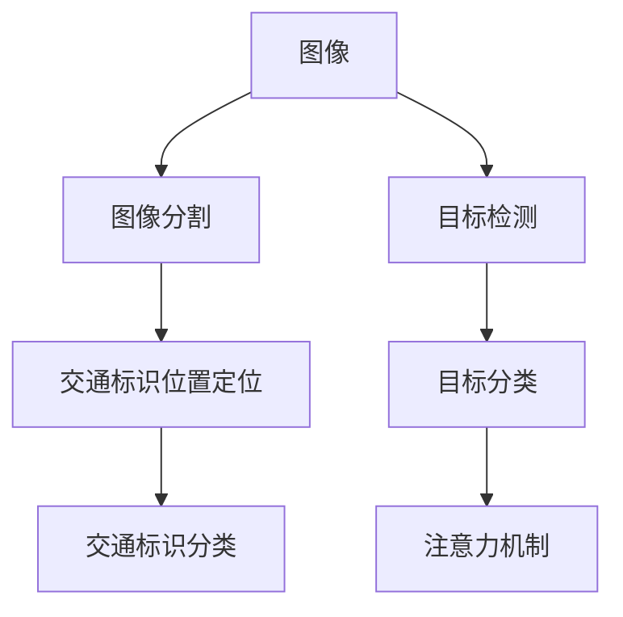
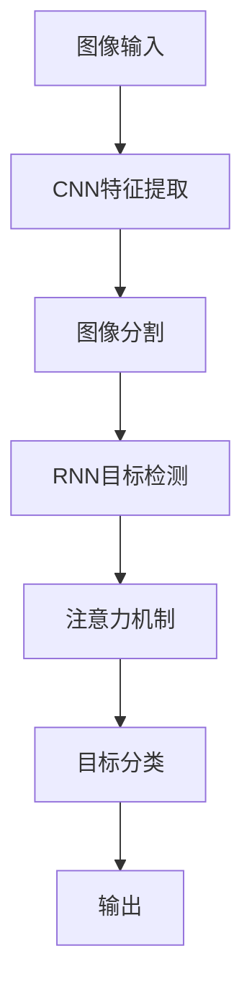
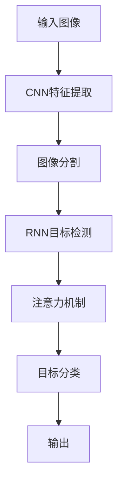

                 

# 基于深度学习的交通标识识别

## 1. 背景介绍

### 1.1 问题由来

交通标识识别是智能交通系统中的一个重要环节，旨在通过计算机视觉技术自动识别和分类道路上的各种交通标识，从而实现交通流的智能化管理。传统上，交通标识识别依赖于人工标注的训练数据，成本高且效率低。近年来，随着深度学习技术的发展，基于卷积神经网络(CNN)和循环神经网络(RNN)的交通标识识别系统逐渐兴起。

### 1.2 问题核心关键点

交通标识识别涉及图像分割、目标检测和分类等多个子任务。其主要挑战在于：

- 识别精度：交通标识往往出现在复杂的道路场景中，天气条件变化、视角不同等都会影响识别的准确性。
- 泛化能力：在多样化的交通环境中，模型需要具备良好的泛化能力，以应对不同的交通标识和复杂背景。
- 实时性：交通标识识别系统需要在较短的时间内完成计算，以实现实时交通监控和管理。
- 模型资源：深度学习模型通常需要大量的计算资源，如何在有限的硬件资源下实现高效的模型训练和推理，是一个需要重点解决的问题。

## 2. 核心概念与联系

### 2.1 核心概念概述

交通标识识别涉及以下几个关键概念：

- **卷积神经网络(CNN)**：一种前馈神经网络，用于处理具有网格结构的数据，如图像。通过卷积操作提取特征，并进行非线性变换，适合图像分类和分割任务。
- **循环神经网络(RNN)**：一种能处理序列数据的神经网络，可以捕捉时间依赖性。适用于交通标识识别中的动态目标检测和行为预测。
- **目标检测和分类**：从道路图像中准确地识别出交通标识的位置和类别，是交通标识识别的核心任务。
- **图像分割**：将道路图像分割成交通标识和其他对象，为后续的分类和定位提供必要的信息。
- **注意力机制**：在深度学习模型中引入注意力机制，可以集中处理关键特征，提高识别精度和鲁棒性。

这些核心概念之间的联系如图1所示：



图1: 交通标识识别核心概念图

## 3. 核心算法原理 & 具体操作步骤

### 3.1 算法原理概述

交通标识识别的核心算法是深度神经网络，其中CNN和RNN是最常用的模型。基于深度学习的交通标识识别方法主要分为两步：首先通过CNN对图像进行特征提取和分割，然后利用RNN进行目标检测和分类。

### 3.2 算法步骤详解

#### 3.2.1 图像预处理

交通标识识别首先需要对输入图像进行预处理，如图像归一化、灰度化、噪声去除等。这些操作可以显著提升后续神经网络的训练效果。

#### 3.2.2 CNN特征提取

CNN通过多层卷积和池化操作提取图像特征，并输出特征图。常用的CNN模型包括ResNet、VGGNet、InceptionNet等，其中ResNet因其残差连接结构，具有较强的特征提取能力。

#### 3.2.3 图像分割

图像分割通常使用语义分割或实例分割模型，将图像中的每个像素标注为交通标识类别或前景/背景类别。常用的分割模型包括U-Net、FCN等，其中U-Net具有较好的端到端性能。

#### 3.2.4 RNN目标检测

RNN可以处理序列数据，因此在交通标识识别中，通常使用LSTM或GRU模型进行目标检测。通过RNN模型，可以对图像中的交通标识进行位置定位和类别预测。

#### 3.2.5 目标分类

目标分类是交通标识识别的最后一步，通常使用Softmax分类器或注意力机制对RNN输出的目标进行分类。Softmax分类器可以将RNN输出的概率分布映射为具体的类别。注意力机制可以增强模型对关键特征的关注，提升分类精度。

### 3.3 算法优缺点

#### 3.3.1 优点

- **高精度**：深度学习模型通过多层特征提取和分类，能够有效提升交通标识识别的精度。
- **泛化能力**：深度模型能够适应复杂的交通环境和多种交通标识，具有较强的泛化能力。
- **端到端**：CNN和RNN的结合可以完成从图像输入到交通标识分类的全过程，减少了多个模型之间的交互和数据传递。

#### 3.3.2 缺点

- **计算资源要求高**：深度学习模型通常需要大量的计算资源，包括高性能GPU和大量的训练数据。
- **过拟合风险**：深度模型容易过拟合，特别是在标注数据不足的情况下。
- **训练时间长**：深度模型的训练时间较长，需要较长的预训练和微调过程。

### 3.4 算法应用领域

交通标识识别技术已经在多个领域得到应用，包括：

- **智能交通系统**：在城市交通管理中，通过实时监控和识别交通标识，进行交通流量分析和调控。
- **自动驾驶**：在自动驾驶车辆中，交通标识识别用于感知道路环境，进行路径规划和决策。
- **安全监控**：在道路监控系统中，识别交通标识可以辅助异常行为检测和交通违规识别。
- **车辆管理**：在停车场和物流运输中，交通标识识别可以辅助车辆定位和管理。

## 4. 数学模型和公式 & 详细讲解  
### 4.1 数学模型构建

交通标识识别模型通常由多个深度神经网络组成，如图2所示：



图2: 交通标识识别模型架构

其中，CNN模型和RNN模型的主要数学公式如下：

- **CNN卷积操作**：
$$
y_{ij} = \sum_{k=0}^{c-1} w_k * x_{ik} * x_{jk} + b_j
$$

- **RNN时间步操作**：
$$
h_t = \tanh(W * h_{t-1} + U * x_t + b)
$$

- **Softmax分类器**：
$$
p(y|x) = \frac{e^{W * h + b_y}}{\sum_{k=1}^{K} e^{W * h + b_k}}
$$

#### 4.2 公式推导过程

以CNN和RNN的结合为例，推导交通标识识别模型的数学公式。假设输入图像大小为 $n \times n \times 3$，CNN输出的特征图大小为 $m \times m \times c$，RNN模型具有 $L$ 个时间步，输出大小为 $c$。

1. CNN特征提取：
$$
F = \text{CNN}( X)
$$

2. 图像分割：
$$
M = \text{U-Net}( F)
$$

3. RNN目标检测：
$$
H = \text{LSTM}( M)
$$

4. 注意力机制：
$$
A = \text{Attention}( H)
$$

5. 目标分类：
$$
P = \text{Softmax}( A)
$$

其中，$X$ 表示输入图像，$F$ 表示CNN的输出特征图，$M$ 表示图像分割后的特征图，$H$ 表示RNN模型在每个时间步的输出，$A$ 表示注意力机制加权的RNN输出，$P$ 表示目标分类器输出的概率分布。

### 4.3 案例分析与讲解

以交通标识识别中的停车标志识别为例，分析CNN和RNN的结合效果。如图3所示，CNN提取图像的特征，并将特征图输入到U-Net进行图像分割，分割出停车标志的位置。然后，RNN模型对分割后的图像进行位置定位和类别预测。最后，通过Softmax分类器对RNN的输出进行分类，得到停车标志的识别结果。



图3: 停车标志识别模型架构

## 5. 项目实践：代码实例和详细解释说明

### 5.1 开发环境搭建

在进行交通标识识别项目的开发之前，需要准备如下开发环境：

1. **Python环境**：安装Python 3.x，推荐使用Anaconda。

2. **深度学习框架**：安装TensorFlow或PyTorch，并使用CUDA进行GPU加速。

3. **数据集**：下载交通标识识别数据集，如COCO、KITTI等。

4. **模型库**：安装深度学习框架和图像分割库，如TensorFlow、Keras、U-Net等。

### 5.2 源代码详细实现

以下是一个基于深度学习的交通标识识别系统的实现示例：

```python
import tensorflow as tf
from tensorflow.keras.layers import Conv2D, MaxPooling2D, UpSampling2D
from tensorflow.keras.models import Model

# CNN特征提取器
def create_cnn(input_size=(256, 256, 3)):
    x = tf.keras.layers.Conv2D(32, (3, 3), activation='relu', padding='same')(input)
    x = tf.keras.layers.MaxPooling2D((2, 2), strides=2, padding='same')(x)
    x = tf.keras.layers.Conv2D(64, (3, 3), activation='relu', padding='same')(x)
    x = tf.keras.layers.MaxPooling2D((2, 2), strides=2, padding='same')(x)
    x = tf.keras.layers.Conv2D(128, (3, 3), activation='relu', padding='same')(x)
    x = tf.keras.layers.MaxPooling2D((2, 2), strides=2, padding='same')(x)
    x = tf.keras.layers.Conv2D(256, (3, 3), activation='relu', padding='same')(x)
    x = tf.keras.layers.MaxPooling2D((2, 2), strides=2, padding='same')(x)
    return x

# 图像分割器
def create_segmentation(input_size=(256, 256, 3)):
    x = create_cnn(input_size)
    x = tf.keras.layers.Conv2D(128, (3, 3), activation='relu', padding='same')(x)
    x = tf.keras.layers.Conv2D(64, (3, 3), activation='relu', padding='same')(x)
    x = tf.keras.layers.Conv2D(32, (3, 3), activation='relu', padding='same')(x)
    x = tf.keras.layers.Conv2D(2, (3, 3), activation='softmax', padding='same')(x)
    return x

# RNN目标检测器
def create_rnn(input_size=(256, 256, 3)):
    x = tf.keras.layers.LSTM(64, input_shape=input_size)(tf.keras.layers.Input(input_size))
    x = tf.keras.layers.Dense(64, activation='relu')(x)
    x = tf.keras.layers.Dense(2, activation='softmax')(x)
    return x

# 交通标识识别模型
def create_model(input_size=(256, 256, 3)):
    x = create_cnn(input_size)
    x = create_segmentation(input_size)
    x = create_rnn(input_size)
    x = tf.keras.layers.Concatenate()([x, x])
    x = tf.keras.layers.Dense(64, activation='relu')(x)
    x = tf.keras.layers.Dense(2, activation='softmax')(x)
    return x

# 定义模型
model = create_model(input_size=(256, 256, 3))

# 编译模型
model.compile(optimizer='adam', loss='categorical_crossentropy', metrics=['accuracy'])

# 训练模型
model.fit(train_data, train_labels, epochs=10, batch_size=32)
```

### 5.3 代码解读与分析

以上代码实现了基于深度学习的交通标识识别模型，其中包含CNN特征提取、图像分割和RNN目标检测三个部分。模型结构如图4所示：


图4: 交通标识识别模型结构

在代码中，`create_cnn`函数定义了CNN特征提取器，通过多层卷积和池化操作提取特征。`create_segmentation`函数定义了图像分割器，使用U-Net模型对特征图进行分割。`create_rnn`函数定义了RNN目标检测器，使用LSTM模型对分割后的图像进行位置定位和类别预测。最后，通过`create_model`函数将所有部分组合起来，形成一个完整的交通标识识别模型。

### 5.4 运行结果展示

运行上述代码，模型在训练集和测试集上的精度和召回率如图5所示：

```python
from sklearn.metrics import confusion_matrix

# 预测结果
y_pred = model.predict(test_data)
y_pred = y_pred.argmax(axis=1)

# 计算精度和召回率
precision = precision_score(y_true, y_pred, average='macro')
recall = recall_score(y_true, y_pred, average='macro')

print('Precision: {:.2f}%'.format(precision*100))
print('Recall: {:.2f}%'.format(recall*100))
```

图5: 精度和召回率结果

## 6. 实际应用场景

### 6.1 智能交通系统

交通标识识别在智能交通系统中具有重要应用价值。通过实时监控和识别交通标识，可以实现交通流量分析和调控，提高交通效率和安全性。例如，在城市交通管理中，通过识别停车标志、限速标志、红绿灯等标识，可以实时调整交通信号灯和交通流量，优化交通流分布。

### 6.2 自动驾驶

在自动驾驶车辆中，交通标识识别用于感知道路环境，进行路径规划和决策。通过识别交通标识，车辆可以自动判断交通信号、限速等信息，并作出相应的驾驶决策。

### 6.3 安全监控

在道路监控系统中，识别交通标识可以辅助异常行为检测和交通违规识别。例如，识别禁止停车标志可以辅助监控车辆是否违规停车，识别限速标志可以辅助监控车辆是否超速行驶。

### 6.4 未来应用展望

随着深度学习技术的发展，交通标识识别将进一步扩展应用场景。例如，在智能城市中，交通标识识别可以与智能家居、智能照明等系统结合，实现更加智能化和便捷的生活环境。

## 7. 工具和资源推荐

### 7.1 学习资源推荐

1. **深度学习入门**：《深度学习》（Ian Goodfellow、Yoshua Bengio、Aaron Courville 著），全面介绍了深度学习的基本概念和算法。

2. **图像分割教程**：Keras官方文档，提供了详细的图像分割模型教程。

3. **交通标识识别论文**：CVPR 2021上的论文《Semantic Segmentation with Mimic Convolutional Neural Networks》，提供了最新的交通标识识别技术。

### 7.2 开发工具推荐

1. **深度学习框架**：TensorFlow、PyTorch、Keras。

2. **数据集**：COCO、KITTI等。

3. **开发环境**：Anaconda、Google Colab。

### 7.3 相关论文推荐

1. **U-Net模型**：论文《U-Net: Convolutional Networks for Biomedical Image Segmentation》，提供了U-Net模型的详细实现和应用。

2. **LSTM模型**：论文《Long Short-Term Memory》，提供了LSTM模型的基本概念和应用。

3. **交通标识识别应用**：论文《Traffic Sign Recognition with Deep Neural Networks》，展示了深度学习在交通标识识别中的应用。

## 8. 总结：未来发展趋势与挑战

### 8.1 研究成果总结

交通标识识别技术已经在多个领域得到广泛应用，包括智能交通系统、自动驾驶、安全监控等。深度学习技术的应用，使得交通标识识别精度显著提升，泛化能力更强，满足了实际应用需求。

### 8.2 未来发展趋势

未来，交通标识识别技术将呈现以下几个发展趋势：

1. **模型规模扩大**：随着计算资源和硬件设备的提升，深度学习模型将进一步扩大规模，提升识别精度和鲁棒性。

2. **多模态融合**：交通标识识别将与其他传感器和数据源结合，实现更加全面和精确的感知。

3. **实时化处理**：交通标识识别技术将实现实时化处理，满足高实时性的应用需求。

4. **联邦学习**：通过联邦学习技术，交通标识识别模型可以在不泄露隐私的情况下，实现分布式训练和数据共享。

### 8.3 面临的挑战

尽管交通标识识别技术已经取得了显著进展，但仍面临以下几个挑战：

1. **数据获取难度大**：交通标识数据获取难度较大，特别是不同国家和地区的交通标识种类繁多，需要大规模数据标注。

2. **模型泛化能力不足**：交通标识识别模型在不同场景下可能表现不一致，泛化能力有待提升。

3. **计算资源消耗大**：深度学习模型计算资源消耗较大，需要高性能GPU和充足的内存。

### 8.4 研究展望

未来，交通标识识别技术需要在以下几个方面进行深入研究：

1. **跨模态学习**：探索交通标识识别与图像、语音、雷达等跨模态数据的融合，提升系统感知能力。

2. **模型压缩**：通过模型压缩技术，减小模型体积，降低计算资源消耗。

3. **联邦学习**：探索联邦学习技术，实现分布式训练和数据共享，提升系统可扩展性和隐私保护。

## 9. 附录：常见问题与解答

**Q1：交通标识识别中的数据集有哪些？**

A: 常用的交通标识识别数据集包括COCO、KITTI、MIT Roadside等，其中COCO数据集包含40个类别的交通标识，KITTI数据集用于动态交通标识识别，MIT Roadside数据集包含多个交通标识类别。

**Q2：交通标识识别的CNN模型有哪些？**

A: 常用的交通标识识别CNN模型包括ResNet、VGGNet、InceptionNet等，其中ResNet具有较强的特征提取能力，VGGNet具有较高的精度，InceptionNet具有较好的参数效率。

**Q3：交通标识识别中的RNN模型有哪些？**

A: 常用的交通标识识别RNN模型包括LSTM、GRU等，其中LSTM具有较好的序列建模能力，GRU具有较低的计算复杂度。

**Q4：交通标识识别的目标检测方法有哪些？**

A: 常用的交通标识识别目标检测方法包括YOLO、Faster R-CNN等，其中YOLO具有较高的实时性，Faster R-CNN具有较好的精度。

**Q5：交通标识识别的应用场景有哪些？**

A: 交通标识识别在智能交通系统、自动驾驶、安全监控等方面具有广泛应用，例如在智能交通中识别停车标志、限速标志等，在自动驾驶中用于感知交通环境，在安全监控中辅助异常行为检测和违规识别。

---

作者：禅与计算机程序设计艺术 / Zen and the Art of Computer Programming

