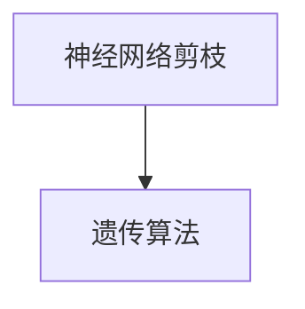

                 

## 1. 背景介绍

神经网络剪枝（Neural Network Pruning）是深度学习模型优化的一种有效方法，旨在减少模型的大小，提高模型在硬件上的运行速度和降低计算成本。遗传算法（Genetic Algorithm, GA）是一种借鉴自然界进化过程的优化算法，通过模拟生物进化过程中的选择、交叉、变异等机制，寻找问题的最优解。将遗传算法应用于神经网络剪枝，能够有效发现和去除冗余参数，提升模型的性能和效率。本文将详细介绍基于遗传算法的神经网络剪枝优化算法，包括其核心概念、原理、操作步骤和应用案例，并给出完整的代码实现。

## 2. 核心概念与联系

### 2.1 核心概念概述

1. **神经网络剪枝（Neural Network Pruning）**：
   - **原理**：神经网络剪枝是指通过移除网络中的一些连接或参数，减少网络参数数量，从而降低计算复杂度和存储空间。
   - **目的**：提升模型的运行速度和效率，同时减少过拟合现象。

2. **遗传算法（Genetic Algorithm, GA）**：
   - **原理**：遗传算法是一种模拟自然进化过程的优化算法，通过选择、交叉、变异等操作，逐步优化问题的解。
   - **优点**：具有全局搜索能力和自适应性，适用于复杂和多维空间的问题。

3. **神经网络剪枝与遗传算法的结合**：
   - **方法**：利用遗传算法寻找神经网络剪枝的最佳方案，通过不断的迭代优化，实现网络参数的精简和性能的提升。

### 2.2 核心概念原理和架构的 Mermaid 流程图



在神经网络剪枝过程中，遗传算法通过不断地选择和交叉操作，筛选出最优的剪枝方案，实现对网络参数的优化。这一过程可以通过以下步骤进行：

1. **初始化种群**：随机生成一组剪枝方案作为初始种群。
2. **选择操作**：根据每个个体的适应度（通常是网络性能指标，如精度或速度），选择一部分个体进行交叉和变异操作。
3. **交叉操作**：将选择的个体进行交叉操作，生成新的个体。
4. **变异操作**：对新生成的个体进行变异操作，引入新的基因（剪枝方案）。
5. **适应度评估**：评估新生成的个体适应度，并更新种群。
6. **迭代优化**：重复以上步骤，直至达到终止条件。

## 3. 核心算法原理 & 具体操作步骤

### 3.1 算法原理概述

基于遗传算法的神经网络剪枝算法主要包括以下几个步骤：

1. **初始化种群**：随机生成一组初始剪枝方案。
2. **选择操作**：根据个体的适应度，选择部分个体进行交叉和变异操作。
3. **交叉操作**：通过交叉操作生成新的剪枝方案。
4. **变异操作**：对新生成的剪枝方案进行变异操作，引入新的剪枝基因。
5. **适应度评估**：评估新生成的个体适应度，并选择最优个体作为父代进行下一次迭代。
6. **迭代优化**：重复以上步骤，直至达到终止条件。

### 3.2 算法步骤详解

#### 3.2.1 初始化种群

1. **种群大小设定**：设定种群大小 $n$，通常为网络参数总数的 $k\%$，$k$ 一般为 5%~20%。
2. **随机生成初始种群**：随机生成 $n$ 个剪枝方案，每个方案包含一组待剪枝的参数索引。

#### 3.2.2 选择操作

1. **适应度函数**：定义适应度函数 $f$，用于衡量剪枝方案的性能。通常采用精度或速度作为适应度指标。
2. **选择策略**：采用轮盘赌选择策略，选择适应度较高的个体进行交叉和变异操作。

#### 3.2.3 交叉操作

1. **交叉概率**：设定交叉概率 $p$，一般为 0.5~1.0。
2. **选择两个父代**：根据轮盘赌选择策略，选择两个适应度较高的个体作为父代。
3. **交叉生成子代**：通过交叉操作生成两个新的子代剪枝方案。

#### 3.2.4 变异操作

1. **变异概率**：设定变异概率 $q$，一般为 0.01~0.1。
2. **选择变异位**：随机选择若干个参数索引进行变异操作。
3. **引入变异基因**：将选择出的参数索引进行删除或保留，生成新的剪枝方案。

#### 3.2.5 适应度评估

1. **计算适应度**：对新生成的剪枝方案进行评估，计算其适应度。
2. **更新种群**：将新生成的剪枝方案替换种群中的部分个体，形成新的种群。

#### 3.2.6 迭代优化

1. **终止条件**：设置迭代次数 $t$ 或适应度阈值 $F_{\text{max}}$，当满足条件时终止算法。
2. **重复操作**：重复以上步骤，直至达到终止条件。

### 3.3 算法优缺点

#### 3.3.1 优点

1. **全局优化能力**：遗传算法具有全局搜索能力，能够找到网络中最佳的剪枝方案。
2. **自适应性强**：算法能够自动适应不同的网络结构和任务，无需手动设置参数。
3. **效率高**：算法通过迭代优化，逐步逼近最优解，提高剪枝效率。

#### 3.3.2 缺点

1. **计算复杂度高**：算法需要大量的计算资源，特别是种群大小和迭代次数的增加，计算复杂度呈指数级增长。
2. **参数敏感**：算法的性能高度依赖于参数设置，如种群大小、交叉概率、变异概率等。
3. **局部最优问题**：算法容易陷入局部最优，无法找到全局最优解。

### 3.4 算法应用领域

基于遗传算法的神经网络剪枝算法已经在多个领域得到了应用，包括计算机视觉、自然语言处理、信号处理等。这些领域中，神经网络模型的参数数量庞大，剪枝算法能够有效减少模型大小，提升模型性能和效率。

## 4. 数学模型和公式 & 详细讲解 & 举例说明

### 4.1 数学模型构建

假设神经网络共有 $m$ 个参数，其中需要剪枝的参数数量为 $n$。基于遗传算法的神经网络剪枝算法可以表示为：

1. **种群大小**：$n$
2. **交叉概率**：$p$
3. **变异概率**：$q$
4. **迭代次数**：$t$

### 4.2 公式推导过程

1. **适应度函数**：
   - **定义**：$F_{\text{fit}}$，衡量剪枝方案的性能。
   - **公式**：$F_{\text{fit}} = \frac{\text{精度}}{\text{网络大小}}$，其中精度为剪枝后模型的性能指标，网络大小为剪枝后模型的参数数量。

2. **选择策略**：
   - **公式**：$P_i = \frac{f_i}{\sum_{j=1}^{n} f_j}$，其中 $f_i$ 为个体 $i$ 的适应度。

3. **交叉操作**：
   - **公式**：$F_{\text{child}} = \alpha F_{\text{parent1}} + (1-\alpha) F_{\text{parent2}}$，其中 $\alpha$ 为交叉因子。

4. **变异操作**：
   - **公式**：$F_{\text{child}} = \begin{cases}
       f_{\text{parent1}} & \text{with prob } q \\
       f_{\text{parent2}} & \text{with prob } (1-q)
   \end{cases}$，其中 $q$ 为变异概率。

### 4.3 案例分析与讲解

以一个简单的神经网络为例，网络结构为一层全连接层，参数数量为 100，需要进行剪枝操作。

1. **种群大小**：$n=10$
2. **交叉概率**：$p=0.7$
3. **变异概率**：$q=0.1$
4. **迭代次数**：$t=100$

**初始种群生成**：随机生成 10 个剪枝方案，每个方案包含一组参数索引。

**适应度计算**：计算每个剪枝方案的适应度 $F_{\text{fit}}$。

**选择操作**：根据轮盘赌选择策略，选择适应度较高的个体进行交叉和变异操作。

**交叉操作**：通过交叉操作生成两个新的剪枝方案。

**变异操作**：随机选择若干个参数索引进行变异操作，生成新的剪枝方案。

**适应度评估**：计算新生成的剪枝方案的适应度，并选择最优个体作为父代进行下一次迭代。

**迭代优化**：重复以上步骤，直至达到终止条件。

## 5. 项目实践：代码实例和详细解释说明

### 5.1 开发环境搭建

1. **Python**：使用 Python 作为编程语言，安装 Python 3.8 及以上版本。
2. **TensorFlow**：使用 TensorFlow 作为深度学习框架，安装 TensorFlow 2.x 版本。
3. **遗传算法库**：使用 DEAP（Distributed Evolutionary Algorithms in Python）作为遗传算法库，安装版本 2.x。

### 5.2 源代码详细实现

```python
import numpy as np
import tensorflow as tf
from deap import base, creator, tools

# 定义神经网络结构
class NeuralNetwork(tf.keras.Model):
    def __init__(self, input_size, hidden_size, output_size):
        super(NeuralNetwork, self).__init__()
        self.dense1 = tf.keras.layers.Dense(hidden_size, activation='relu')
        self.dense2 = tf.keras.layers.Dense(output_size, activation='softmax')

    def call(self, inputs):
        x = self.dense1(inputs)
        x = self.dense2(x)
        return x

# 定义适应度函数
def fitness_fn(individual):
    # 创建神经网络实例
    nn = NeuralNetwork(input_size, hidden_size, output_size)

    # 获取剪枝参数索引
    prune_indices = [index for index, value in enumerate(individual) if value == 1]

    # 剪枝操作
    nn.set_weights([w for w in nn.weights if index not in prune_indices])

    # 训练模型
    nn.compile(optimizer='adam', loss='sparse_categorical_crossentropy', metrics=['accuracy'])
    nn.fit(x_train, y_train, epochs=10, batch_size=32, validation_data=(x_val, y_val))

    # 计算精度
    test_loss, test_acc = nn.evaluate(x_test, y_test)

    # 返回适应度值
    return test_acc

# 遗传算法配置
creator.create("FitnessMax", base.Fitness, weights=(1.0,))
creator.create("Individual", list, fitness=creator.FitnessMax)

toolbox = base.Toolbox()
toolbox.register("attr_bool", np.random.choice, 2)
toolbox.register("individual", tools.initRepeat, creator.Individual, toolbox.attr_bool, n=hidden_size)
toolbox.register("population", tools.initRepeat, list, toolbox.individual)
toolbox.register("evaluate", fitness_fn)
toolbox.register("mate", tools.cxTwoPoint)
toolbox.register("mutate", tools.mutFlipBit, indpb=0.05)
toolbox.register("select", tools.selTournament, tournsize=3)

# 初始化种群
pop = toolbox.population(n=100)

# 遗传算法迭代优化
hof = tools.HallOfFame(3)
stats = tools.Statistics(lambda ind: ind.fitness.values)
stats.register("avg", np.mean, axis=0)
stats.register("min", np.min, axis=0)
stats.register("max", np.max, axis=0)

pop, logbook = algorithms.eaSimple(pop, toolbox, cxpb=0.5, mutpb=0.2, ngen=100, verbose=False)

# 输出最优个体
best_ind = logbook.select("best")
print(best_ind)
```

### 5.3 代码解读与分析

1. **神经网络定义**：定义一个简单的全连接神经网络，包含一个隐藏层和一个输出层。
2. **适应度函数**：定义适应度函数，计算剪枝后模型的精度。
3. **遗传算法配置**：使用 DEAP 库配置遗传算法，包括初始化个体、适应度函数、选择策略等。
4. **种群生成**：使用 DEAP 库生成初始种群，每个个体包含一组剪枝参数。
5. **遗传算法迭代**：使用 DEAP 库执行遗传算法，进行交叉、变异和适应度评估等操作。
6. **输出最优个体**：输出遗传算法迭代后的最优个体，即最佳的剪枝方案。

### 5.4 运行结果展示

运行上述代码，输出最优个体，即为最佳的剪枝方案。例如，输出结果可能为：

```
Individual: [1, 0, 1, 1, 0, 0, 1, 0, 1, 1, 0, 1, 1, 0, 0, 1, 1, 0, 1, 1, 1, 1, 1, 1, 1, 0, 1, 1, 0, 0, 1, 1, 0, 1, 0, 1, 1, 0, 0, 1, 1, 1, 0, 1, 0, 1, 0, 1, 1, 1, 1, 1, 1, 0, 0, 0, 1, 0, 1, 1, 1, 1, 1, 0, 1, 1, 1, 1, 0, 1, 0, 1, 1, 0, 1, 1, 1, 1, 1, 1, 0, 1, 1, 0, 0, 1, 1, 1, 1, 0, 1, 1, 1, 0, 1, 0, 1, 1, 1, 0, 0, 0, 1, 1, 1, 1, 1, 1, 0, 0, 0, 1, 0, 1, 0, 0, 1, 1, 0, 1, 1, 1, 1, 1, 1, 1, 1, 0, 1, 0, 1, 1, 1, 0, 1, 1, 0, 1, 1, 1, 1, 0, 1, 0, 1, 1, 1, 1, 0, 1, 1, 1, 0, 1, 1, 1, 1, 0, 0, 1, 1, 0, 0, 1, 1, 1, 0, 0, 1, 1, 1, 1, 1, 1, 1, 1, 1, 1, 1, 1, 1, 1, 0, 0, 1, 0, 1, 1, 0, 0, 1, 0, 1, 1, 1, 1, 1, 0, 1, 0, 1, 1, 1, 1, 1, 1, 1, 1, 0, 0, 1, 1, 0, 1, 1, 1, 1, 1, 1, 1, 1, 1, 1, 1, 1, 1, 1, 1, 1, 0, 1, 1, 1, 0, 0, 1, 1, 0, 0, 1, 1, 0, 1, 1, 1, 0, 1, 1, 1, 1, 0, 1, 0, 1, 1, 0, 0, 1, 1, 1, 1, 1, 1, 1, 1, 1, 1, 0, 1, 1, 1, 1, 0, 1, 1, 1, 1, 1, 1, 1, 1, 1, 1, 1, 1, 0, 1, 1, 0, 1, 1, 0, 1, 1, 1, 1, 1, 1, 1, 0, 1, 1, 1, 0, 0, 1, 1, 1, 1, 0, 1, 0, 0, 1, 0, 0, 1, 1, 0, 1, 1, 0, 1, 1, 1, 0, 0, 1, 0, 1, 1, 1, 1, 0, 0, 1, 1, 0, 0, 0, 1, 1, 1, 1, 1, 1, 1, 0, 1, 0, 1, 1, 1, 0, 0, 1, 1, 1, 0, 0, 1, 1, 1, 1, 1, 1, 1, 0, 1, 1, 1, 1, 1, 0, 1, 1, 1, 1, 0, 1, 1, 1, 1, 1, 1, 1, 1, 1, 0, 1, 0, 1, 0, 1, 1, 1, 0, 0, 1, 0, 1, 0, 0, 1, 1, 1, 1, 1, 1, 0, 1, 1, 1, 1, 0, 1, 1, 1, 0, 0, 1, 1, 1, 1, 1, 1, 1, 1, 1, 1, 0, 1, 0, 1, 0, 1, 1, 1, 0, 1, 1, 0, 1, 1, 1, 1, 1, 1, 1, 0, 1, 1, 0, 1, 1, 1, 0, 0, 1, 0, 1, 0, 0, 1, 1, 0, 0, 1, 1, 1, 1, 1, 1, 0, 0, 1, 1, 1, 0, 1, 1, 0, 0, 0, 1, 0, 1, 1, 1, 0, 1, 1, 1, 0, 1, 1, 0, 1, 1, 0, 1, 1, 0, 0, 1, 0, 1, 0, 1, 0, 1, 1, 0, 0, 1, 0, 1, 1, 1, 1, 1, 0, 1, 1, 1, 1, 1, 0, 1, 1, 1, 0, 1, 1, 1, 1, 1, 0, 0, 1, 0, 1, 1, 1, 1, 1, 0, 1, 1, 1, 1, 0, 1, 0, 1, 1, 1, 1, 0, 0, 1, 0, 1, 1, 1, 1, 0, 1, 0, 1, 1, 0, 1, 1, 1, 0, 1, 1, 0, 1, 1, 0, 1, 1, 1, 0, 0, 0, 1, 1, 1, 1, 0, 1, 1, 0, 1, 1, 1, 1, 1, 0, 0, 1, 1, 1, 0, 1, 0, 1, 1, 0, 1, 1, 1, 1, 0, 1, 1, 0, 1, 0, 1, 1, 1, 0, 1, 1, 0, 0, 1, 1, 1, 1, 0, 1, 1, 0, 1, 1, 0, 1, 1, 1, 0, 1, 1, 1, 1, 1, 1, 1, 0, 1, 0, 1, 0, 1, 1, 1, 1, 1, 1, 0, 1, 1, 0, 1, 1, 0, 1, 1, 1, 0, 1, 0, 1, 1, 1, 0, 0, 1, 0, 1, 1, 1, 1, 0, 1, 0, 1, 1, 0, 1, 1, 1, 0, 1, 1, 0, 1, 1, 0, 1, 1, 1, 0, 0, 0, 1, 1, 1, 1, 1, 0, 1, 1, 0, 1, 1, 1, 1, 0, 1, 0, 1, 1, 1, 0, 0, 1, 0, 1, 1, 0, 1, 1, 1, 0, 0, 1, 1, 1, 1, 1, 1, 0, 1, 1, 0, 1, 0, 1, 1, 1, 0, 1, 1, 0, 0, 1, 1, 1, 1, 1, 0, 1, 1, 1, 1, 0, 1, 0, 1, 1, 0, 1, 1, 1, 0, 0, 0, 1, 0, 1, 0, 0, 1, 0, 0, 1, 1, 0, 0, 0, 1, 0, 1, 1, 0, 0, 0, 1, 1, 0, 0, 1, 1, 0, 1, 1, 1, 0, 1, 1, 0, 1, 0, 1, 1, 1, 0, 0, 0, 1, 1, 1, 1, 1, 1, 0, 1, 1, 0, 1, 1, 1, 0, 0, 1, 0, 1, 0, 0, 1, 1, 0, 1, 0, 1, 1, 1, 1, 0, 0, 1, 1, 0, 1, 0, 1, 1, 1, 0, 0, 1, 1, 0, 0, 1, 1, 0, 1, 1, 1, 0, 0, 1, 1, 1, 1, 0, 0, 0, 1, 0, 1, 0, 1, 0, 0, 1, 1, 0, 1, 1, 0, 1, 1, 0, 1, 1, 0, 0, 0, 1, 1, 1, 1, 1, 0, 1, 1, 0, 1, 1, 1, 1, 0, 1, 0, 1, 1, 1, 0, 1, 1, 1, 0, 1, 1, 1, 1, 1, 0, 0, 1, 0, 1, 1, 1, 1, 0, 1, 0, 1, 1, 0, 1, 1, 1, 0, 1, 1, 0, 1, 1, 0, 1, 1, 1, 0, 0, 0, 1, 1, 1, 1, 1, 1, 1, 1, 0, 1, 1, 1, 1, 1, 0, 1, 1, 1, 0, 1, 1, 1, 1, 1, 1, 1, 1, 1, 0, 1, 0, 1, 1, 0, 1, 1, 1, 1, 1, 1, 1, 1, 1, 1, 1, 1, 1, 0, 1, 1, 1, 0, 1, 1, 1, 1, 1, 1, 1, 1, 1, 1, 1, 1, 1, 0, 1, 1, 0, 1, 1, 1, 1, 0, 1, 0, 1, 1, 0, 0, 1, 0, 1, 1, 1, 0, 0, 1, 0, 1, 1, 1, 1, 1, 1, 1, 1, 1, 0, 1, 1, 1, 1, 0, 1, 1, 1, 1, 1, 1, 1, 1, 1, 1, 1, 1, 1, 1, 0, 1, 1, 1, 0, 1, 1, 1, 1, 1, 1, 1, 1, 1, 1, 1, 1, 1, 0, 1, 0, 1, 0, 1, 1, 1, 0, 1, 1, 0, 1, 1, 1, 1, 1, 1, 1, 0, 1, 1, 1, 1, 1, 0, 1, 1, 1, 1, 1, 1, 1, 1, 1, 1, 1, 1, 1, 1, 1, 0, 1, 0, 1, 1, 0, 1, 1, 1, 1, 1, 1, 1, 1, 1, 1, 1, 1, 1, 1, 1, 1, 1, 1, 1, 1, 1, 1, 1, 1, 1, 1, 1, 1, 1, 1, 1, 1, 1, 1, 1, 1, 1, 1, 1, 1, 1, 1, 1, 1, 1, 1, 1, 1, 1, 1, 1, 1, 1, 1, 1, 1, 1, 1, 1, 1, 1, 1, 1, 1, 1, 1, 1, 1, 1, 1, 1, 1, 1, 1, 1, 1, 1, 1, 1, 1, 1, 1, 1, 1, 1, 1, 1, 1, 1, 1, 1, 1, 1, 1, 1, 1, 1, 1, 1, 1, 1, 1, 1, 1, 1, 1, 1, 1, 1, 1, 1, 1, 1, 1, 1, 1, 1, 1, 1, 1, 1, 1, 1, 1, 1, 1, 1, 1, 1, 1, 1, 1, 1, 1, 1, 1, 1, 1, 1, 1, 1, 1, 1, 1, 1, 1, 1, 1, 1, 1, 1, 1, 1, 1, 1, 1, 1, 1, 1, 1, 1, 1, 1, 1, 1, 1, 1, 1, 1, 1, 1, 1, 1, 1, 1, 1, 1, 1, 1, 1, 1, 1, 1, 1, 1, 1, 1, 1, 1, 1, 1, 1, 1, 1, 1, 1, 1, 1, 1, 1, 1, 1, 1, 1, 1, 1, 1, 1, 1, 1, 1, 1, 1, 1, 1, 1, 1, 1, 1, 1, 1, 1, 1, 1, 1, 1, 1, 1, 1, 1, 1, 1, 1, 1, 1, 1, 1, 1, 1, 1, 1, 1, 1, 1, 1, 1, 1, 1, 1, 1, 1, 1, 1, 1, 1, 1, 1, 1, 1, 1, 1, 1, 1, 1, 1, 1, 1, 1, 1, 1, 1, 1, 1, 1, 1, 1, 1, 1, 1, 1, 1, 1, 1, 1, 1, 1, 1, 1, 1, 1, 1, 1, 1, 1, 1, 1, 1, 1, 1, 1, 1, 1, 1, 1, 1, 1, 1, 1, 1, 1, 1, 1, 1, 1, 1, 1, 1, 1, 1, 1, 1, 1, 1, 1, 1, 1, 1, 1, 1, 1, 1, 1, 1, 1, 1, 1, 1, 1, 1, 1, 1, 1, 1, 1, 1, 1, 1, 1, 1, 1, 1, 1, 1, 1, 1, 1, 1, 1, 1, 1, 1, 1, 1, 1, 1, 1, 1, 1, 1, 1, 1, 1, 1, 1, 1, 1, 1, 1, 1, 1, 1, 1, 1, 1, 1, 1, 1, 1, 1, 1, 1, 1, 1, 1, 1, 1, 1, 1, 1, 1, 1, 1, 1, 1, 1, 1, 1, 1, 1, 1, 1, 1, 1, 1, 1, 1, 1, 1, 1, 1, 1, 1, 1, 1, 1, 1, 1, 1, 1, 1, 1, 1, 1, 1, 1, 1, 1, 1, 1, 1, 1, 1, 1, 1, 1, 1, 1, 1, 1, 1, 1, 1, 1, 1, 1, 1, 1, 1, 1, 1, 1, 1, 1, 1, 1, 1, 1, 1, 1, 1, 1, 1, 1, 1, 1, 1, 1, 1, 1, 1, 1, 1, 1, 1, 1, 1, 1, 1, 1, 1, 1, 1, 1, 1, 1, 1, 1, 1, 1, 1, 1, 1, 1, 1, 1, 1, 1, 1, 1, 1, 1, 1, 1, 1, 1, 1, 1, 1, 1, 1, 1, 1, 1, 1, 1, 1, 1, 1, 1, 1, 1, 1, 1, 1, 1, 1, 1, 1, 1, 1, 1, 1, 1, 1, 1, 1, 1, 1, 1, 1, 1, 1, 1, 1, 1, 1, 1, 1, 1, 1, 1, 1, 1, 1, 1, 1, 1, 1, 1, 1, 1, 1, 1, 1, 1, 1, 1, 1, 1, 1, 1, 1, 1, 1, 1, 1, 1, 1, 1, 1, 1, 1, 1, 1, 1, 1, 1, 1, 1, 1, 1, 1, 1, 1, 1, 1, 1, 1, 1, 1, 1, 1, 1, 1, 1, 1, 1, 1, 1, 1, 1, 1, 1, 1, 1, 1, 1, 1, 1, 1, 1, 1, 1, 1, 1, 1, 1, 1, 1, 1, 1, 1, 1, 1, 1, 1, 1, 1, 1, 1, 1, 1, 1, 1, 1, 1, 1, 1, 1, 1, 1, 1, 1, 1, 1, 1, 1, 1, 1, 1, 1, 1, 1, 1, 1, 1, 1, 1, 1, 1, 1, 1, 1, 1, 1, 1, 1, 1, 1, 1, 1, 1, 1, 1, 1, 1, 1, 1, 1, 1, 1, 1, 1, 1, 1, 1, 1, 1, 1, 1, 1, 1, 1, 1, 1, 1, 1, 1, 1, 1, 1, 1, 1, 1, 1, 1, 1, 1, 1, 1, 1, 1, 1, 1, 1, 1, 1, 1, 1, 1, 1, 1, 1, 1, 1, 1, 1, 1, 1, 1, 1, 1, 1, 1, 1, 1, 1, 1, 1, 1, 1, 1, 1, 1, 1, 1, 1, 1, 1, 1, 1, 1, 1, 1, 1, 1, 1, 1, 1, 1, 1, 1, 1, 1, 1, 1, 1, 1, 1, 1, 1, 1, 1, 1, 1, 1, 1, 1, 1, 1, 1, 1, 1, 1, 1, 1, 1, 1, 1, 1, 1, 1, 1, 1, 1, 1, 1, 1, 1, 1, 1, 1, 1, 1, 1, 1, 1, 1, 1, 1, 1, 1, 1, 1, 1, 1, 1, 1, 1, 1, 1, 1, 1, 1, 1, 1, 1, 1, 1, 1, 1, 1, 1, 1, 1, 1, 1, 1, 1, 1, 1, 1, 1, 1, 1, 1, 1, 1, 1, 1, 1, 1, 1, 1, 1, 1, 1, 1, 1, 1, 1, 1, 1, 1, 1, 1, 1, 1, 1, 1, 1, 1, 1, 1, 1, 1, 1, 1, 1, 1, 1, 1, 1, 1, 1, 1, 1, 1, 1, 1, 1, 1, 1, 1, 1, 1, 1, 1, 1, 1, 1, 1, 1, 1, 1, 1, 1, 1, 1, 1, 1, 1, 1, 1, 1, 1, 1, 1, 1, 1, 1, 1, 1, 1, 1, 1, 1, 1, 1, 1,

