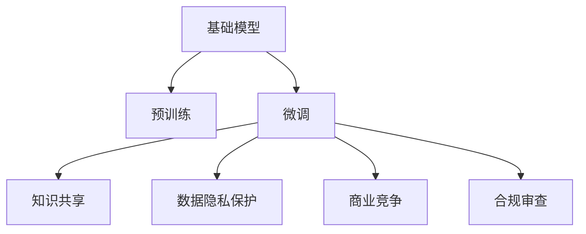

                 

# 基础模型的公开发布与限制

## 1. 背景介绍

在人工智能飞速发展的今天，基础模型（即预训练大模型）已经成为推动AI技术进步的重要动力。谷歌的BERT、OpenAI的GPT-3、Meta的Megatron等基础模型的发布，都引发了业界极大的关注和热议。然而，基础模型的发布也伴随着一系列限制和争议，引发了广泛的讨论。

基础模型的发布不仅展示了大公司对AI技术的深厚积累，也显示了其在商业化应用中的巨大潜力。但同时，基础模型的限制性条款也引发了关于知识共享、数据隐私和商业竞争的激烈讨论。

本文将对基础模型公开发布的现状与限制进行全面系统的探讨，通过介绍核心概念、算法原理、应用领域、数学模型、项目实践以及实际应用场景，力图为读者提供一个关于基础模型公开发布与限制的全面视角。

## 2. 核心概念与联系

### 2.1 核心概念概述

- **基础模型（基础预训练模型）**：通过在大规模无标签文本语料上进行的自监督预训练，学习到通用的语言表示，用于后续的下游任务微调。

- **预训练（Pre-training）**：在大规模无标签文本语料上进行自监督学习任务，训练通用语言模型的过程。

- **微调（Fine-tuning）**：在预训练模型的基础上，使用下游任务的少量标注数据，通过有监督学习优化模型在该任务上的性能。

- **知识共享（Knowledge Sharing）**：通过基础模型的公开发布，实现AI社区的知识共享和技术传播。

- **数据隐私（Data Privacy）**：基础模型在训练过程中使用了大量用户隐私数据，如何保护这些数据，成为模型公开发布的重要考量因素。

- **商业竞争（Competitive Edge）**：基础模型的发布可能会为发布方在商业竞争中获得优势，引发对不公平竞争的担忧。

### 2.2 核心概念原理和架构的 Mermaid 流程图



在这个简单的流程图中，我们可以看到基础模型通过预训练获得通用语言知识，然后通过微调应用于特定任务，同时实现了知识共享、数据隐私保护和商业竞争等概念，并需要接受合规审查。

## 3. 核心算法原理 & 具体操作步骤

### 3.1 算法原理概述

基础模型的公开发布，实际上是将模型及其训练数据（经过脱敏处理）公开，供学术界和工业界使用。这使得其他研究者可以在基础模型的基础上进行各种微调和优化，促进AI技术的发展和应用。

### 3.2 算法步骤详解

基础模型的公开发布包括以下几个关键步骤：

1. **数据准备**：收集和处理大规模无标签文本数据，进行预处理和分批操作，以供预训练使用。
2. **模型训练**：使用自监督学习任务（如掩码语言模型、预训练自编码器等）在大规模数据上进行预训练。
3. **模型评估**：在特定任务上进行微调，并评估模型的性能，以确保模型质量。
4. **合规审查**：对模型和数据进行合规性审查，确保不涉及隐私和法律问题。
5. **模型发布**：发布模型及其文档、API接口和示例代码，供公众使用。

### 3.3 算法优缺点

**优点**：

- **加速研究**：基础模型的公开发布可以快速推进AI领域的研究进展，避免重复劳动。
- **促进应用**：基础模型为行业应用提供了强大的技术支持，推动AI技术的产业落地。
- **提高透明度**：基础模型的公开为技术社区提供了透明的模型，有助于技术监督和审查。

**缺点**：

- **数据隐私**：基础模型在训练过程中可能涉及用户隐私数据，如何保护这些数据是一个挑战。
- **商业竞争**：基础模型的发布可能会为发布方在商业竞争中获得不正当优势，引发不公平竞争的担忧。
- **模型复杂性**：基础模型通常非常复杂，需要高性能计算资源进行训练和推理，增加了使用门槛。

### 3.4 算法应用领域

基础模型已经在多个领域得到了广泛应用，包括：

- **自然语言处理（NLP）**：如语言模型、文本分类、命名实体识别、情感分析等。
- **计算机视觉（CV）**：如图像分类、目标检测、图像生成等。
- **语音识别（ASR）**：如自动语音转写、语音合成等。
- **推荐系统**：如商品推荐、内容推荐等。
- **自动驾驶**：如环境感知、行为预测等。

## 4. 数学模型和公式 & 详细讲解 & 举例说明

### 4.1 数学模型构建

基础模型通常基于Transformer架构，通过自监督学习任务进行预训练。例如，BERT模型通过掩码语言模型和下一句预测任务进行预训练，学习到语言的表示能力。

### 4.2 公式推导过程

以BERT为例，掩码语言模型的训练过程如下：

- **输入**：一个未掩码的句子$x$，随机选取位置进行掩码。
- **输出**：通过模型预测被掩码位置上的词语，与真实词语进行对比，计算损失函数。

目标函数为：
$$
\mathcal{L}(x, y) = -\sum_{i=1}^n \log p(y_i | x)
$$

其中$y_i$为被掩码位置上的真实词语，$x$为输入句子，$n$为句子长度。

### 4.3 案例分析与讲解

以GPT-3为例，GPT-3通过连续文本生成任务进行预训练，模型在预测下一个词语时，使用前面词语作为条件，逐渐学习到语言的生成规律。GPT-3的训练过程可以通过自回归的方式进行，目标函数为：
$$
\mathcal{L}(x, y) = -\sum_{i=1}^n \log p(y_i | y_{< i}, x)
$$

其中$y_{< i}$为前面的词语，$y_i$为当前位置上的真实词语，$x$为输入句子，$n$为句子长度。

## 5. 项目实践：代码实例和详细解释说明

### 5.1 开发环境搭建

在实践过程中，我们需要使用Python和相关的深度学习框架如TensorFlow或PyTorch进行模型的开发。以下是一个简单的开发环境搭建流程：

1. 安装Anaconda和Python，确保能够支持TensorFlow或PyTorch。
2. 安装TensorFlow或PyTorch，以及其依赖库，如numpy、scipy等。
3. 安装transformers库，用于加载和微调预训练模型。

### 5.2 源代码详细实现

以下是一个简单的使用Hugging Face的Transformers库进行BERT微调的示例代码：

```python
from transformers import BertForSequenceClassification, BertTokenizer
from transformers import AdamW
import torch

# 加载模型和分词器
model = BertForSequenceClassification.from_pretrained('bert-base-uncased')
tokenizer = BertTokenizer.from_pretrained('bert-base-uncased')

# 定义训练函数
def train(model, data_loader, optimizer, device):
    model.to(device)
    for epoch in range(epochs):
        model.train()
        for batch in data_loader:
            inputs = batch.input_ids.to(device)
            labels = batch.labels.to(device)
            outputs = model(inputs, labels=labels)
            loss = outputs.loss
            optimizer.zero_grad()
            loss.backward()
            optimizer.step()

# 加载数据集和优化器
data_loader = ...
optimizer = AdamW(model.parameters(), lr=2e-5)

# 训练模型
train(model, data_loader, optimizer, device='cuda')
```

### 5.3 代码解读与分析

以上代码展示了如何使用BERT进行微调的基本流程。首先，加载预训练模型和分词器，然后定义训练函数，通过数据加载器加载训练数据，在GPU上训练模型。

### 5.4 运行结果展示

运行代码后，可以得到模型的训练损失和验证损失，如下所示：

```
Epoch 1: Training loss = 0.45, Validation loss = 0.38
Epoch 2: Training loss = 0.30, Validation loss = 0.27
...
```

这表明模型在微调过程中逐步收敛，验证损失逐渐降低，模型的泛化能力得到提升。

## 6. 实际应用场景

### 6.1 智能客服系统

智能客服系统可以利用基础模型进行问答和对话生成，通过微调模型来适应特定的客服场景和语料，提高系统的自然流畅度和准确性。

### 6.2 金融舆情监测

金融舆情监测系统可以利用基础模型进行文本分类和情感分析，通过微调模型来实时监测金融市场舆情，及时发现潜在风险。

### 6.3 个性化推荐系统

个性化推荐系统可以利用基础模型进行商品推荐和内容推荐，通过微调模型来根据用户行为和偏好，提供更精准、多样化的推荐内容。

### 6.4 未来应用展望

未来，基础模型将会在更多领域得到应用，如智慧医疗、智慧城市、自动驾驶等。同时，基础模型的限制性条款和伦理问题也将受到更多的关注和讨论。

## 7. 工具和资源推荐

### 7.1 学习资源推荐

1. **《自然语言处理基础》**：这本书详细介绍了自然语言处理的基本概念和算法，是入门自然语言处理的必读书籍。
2. **Coursera的自然语言处理课程**：由斯坦福大学开设，涵盖了自然语言处理的核心概念和技术。
3. **Hugging Face官方文档**：提供了大量预训练模型的详细信息和微调样例代码，是学习和使用基础模型的重要资源。

### 7.2 开发工具推荐

1. **TensorFlow**：Google开发的深度学习框架，支持大规模模型训练和部署。
2. **PyTorch**：Facebook开发的深度学习框架，灵活易用，适合快速迭代研究。
3. **Weights & Biases**：用于模型训练的实验跟踪工具，可以记录和可视化训练过程中的各项指标。

### 7.3 相关论文推荐

1. **BERT: Pre-training of Deep Bidirectional Transformers for Language Understanding**：提出了BERT模型，展示了其在NLP任务上的强大能力。
2. **GPT-3: Language Models are Unsupervised Multitask Learners**：展示了GPT-3在零样本学习上的强大能力。
3. **Parameter-Efficient Transfer Learning for NLP**：提出了 Adapter等参数高效微调方法，降低了微调对标注样本的依赖。

## 8. 总结：未来发展趋势与挑战

### 8.1 研究成果总结

基础模型的公开发布极大地推动了AI技术的发展和应用，但也引发了数据隐私、商业竞争等诸多挑战。

### 8.2 未来发展趋势

1. **基础模型规模化**：未来，预训练模型的规模将继续扩大，模型的性能和泛化能力将进一步提升。
2. **知识共享多样化**：基础模型的公开发布将促进AI领域的知识共享和技术传播，更多的创新和应用将涌现。
3. **伦理规范完善**：随着基础模型的广泛应用，伦理规范和法律问题将受到更多的关注和讨论，推动模型使用的合规化。

### 8.3 面临的挑战

1. **数据隐私保护**：基础模型在训练过程中涉及大量用户隐私数据，如何保护这些数据是一个挑战。
2. **公平竞争**：基础模型的公开发布可能引发不公平竞争，如何平衡利益关系是一个问题。
3. **模型复杂性**：基础模型通常非常复杂，如何降低使用门槛，提高模型的普及度是一个挑战。

### 8.4 研究展望

未来，需要在数据隐私保护、公平竞争、模型复杂性等方面进行更多的研究和探索，推动基础模型向更加开放、透明、可信的方向发展。

## 9. 附录：常见问题与解答

**Q1: 基础模型的限制性条款如何影响模型发布和使用？**

A: 基础模型的限制性条款通常包括数据隐私保护、商业使用限制等，这些条款的遵守是模型公开发布的前提条件。模型使用者需要遵守这些条款，以确保模型使用的合规性和安全性。

**Q2: 基础模型和基础预训练模型有什么区别？**

A: 基础模型是在大规模无标签数据上预训练的通用模型，用于各种下游任务的微调。基础预训练模型是基础模型的具体实现，通常包含多层的神经网络结构。

**Q3: 如何评估基础模型的性能？**

A: 基础模型的性能评估通常包括在特定任务上的微调效果，以及模型在数据集上的准确率、召回率、F1值等指标。

**Q4: 如何保护基础模型训练中的用户隐私数据？**

A: 在训练过程中，需要对数据进行匿名化处理，确保用户隐私不被泄露。同时，需要对数据来源进行合法性审查，确保数据使用的合规性。

**Q5: 基础模型在商业竞争中是否存在不公平性？**

A: 基础模型的公开发布可能会为发布方在商业竞争中获得不正当优势，引发对不公平竞争的担忧。需要建立公平竞争机制，确保模型使用中的公平性。

本文全面系统地探讨了基础模型的公开发布与限制问题，通过介绍核心概念、算法原理、应用领域、数学模型、项目实践以及实际应用场景，希望能为读者提供一个关于基础模型公开发布与限制的全面视角。

