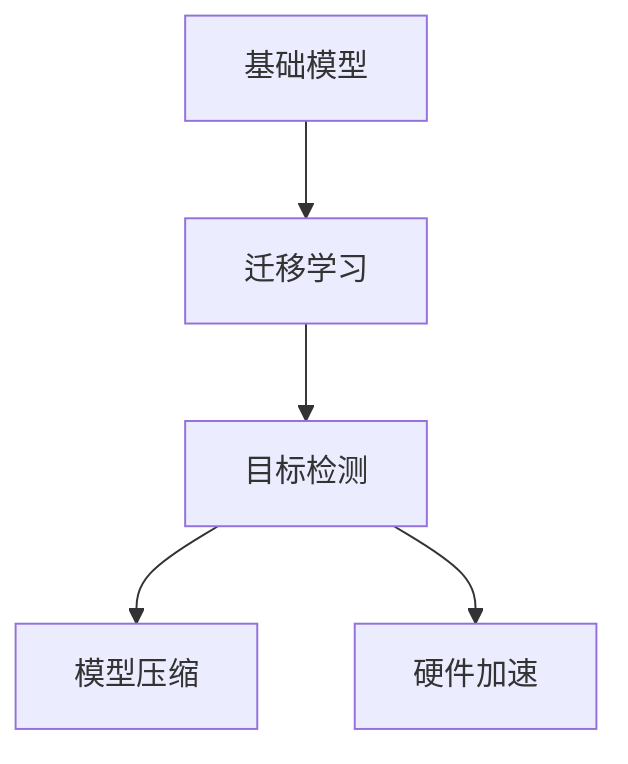

                 

# 基础模型的有机分子应用

> 关键词：基础模型,有机分子,应用,深度学习,迁移学习,目标检测,模型压缩,硬件加速

## 1. 背景介绍

### 1.1 问题由来

随着深度学习技术的发展，基础模型在计算机视觉、自然语言处理等领域发挥了巨大作用。然而，这些模型往往需要大量的计算资源和时间来训练，并且难以在大规模部署中保持高效。近年来，基于深度学习的有机分子应用领域逐渐兴起，基础模型在其中也扮演了重要角色。

基础模型通过迁移学习、参数共享等手段，在大规模数据集上预训练，并应用于小数据集上的特定任务。这种应用方式不仅能够节省训练时间和计算资源，还能提高模型的泛化能力。本文将从基础模型的应用背景、核心概念与联系、核心算法原理及具体操作步骤等方面，系统介绍基础模型的有机分子应用。

### 1.2 问题核心关键点

1. **基础模型**：指在大规模数据集上预训练的深度学习模型，如ResNet、BERT、ViT等。
2. **迁移学习**：利用已有预训练模型的知识，对小规模数据集上的特定任务进行微调，以提高模型性能。
3. **有机分子**：比喻基础模型的参数结构，像有机分子一样，具有复杂的交互作用，可以灵活组合和重构，以适应不同的应用场景。
4. **目标检测**：基础模型在计算机视觉领域的一种重要应用，用于检测和识别图像中的物体。
5. **模型压缩**：通过剪枝、量化等技术，减少模型参数量，降低计算复杂度，提高模型效率。
6. **硬件加速**：利用GPU、TPU等硬件加速器，提高模型推理速度和处理能力。

这些核心概念共同构成了基础模型有机分子应用的技术基础，下面我们将深入探讨其原理和操作步骤。

## 2. 核心概念与联系

### 2.1 核心概念概述

为更好地理解基础模型的有机分子应用，本节将介绍几个密切相关的核心概念：

- **基础模型**：如ResNet、BERT、ViT等在大规模数据集上进行预训练的深度学习模型。
- **迁移学习**：利用已有预训练模型的知识，对小规模数据集上的特定任务进行微调，以提高模型性能。
- **目标检测**：在计算机视觉领域，基础模型常用于检测和识别图像中的物体。
- **模型压缩**：通过剪枝、量化等技术，减少模型参数量，降低计算复杂度，提高模型效率。
- **硬件加速**：利用GPU、TPU等硬件加速器，提高模型推理速度和处理能力。

这些核心概念之间的逻辑关系可以通过以下Mermaid流程图来展示：



这个流程图展示了几大核心概念之间的逻辑关系：

1. 基础模型通过迁移学习获得对特定任务的适应能力。
2. 目标检测是基础模型在计算机视觉领域的一种重要应用。
3. 模型压缩和硬件加速技术提高基础模型的推理速度和处理能力。

这些概念共同构成了基础模型有机分子应用的技术框架，使其能够在各种场景下发挥强大的功能。通过理解这些核心概念，我们可以更好地把握基础模型的工作原理和优化方向。

## 3. 核心算法原理 & 具体操作步骤

### 3.1 算法原理概述

基础模型的有机分子应用，主要通过迁移学习和参数共享等手段，在大规模数据集上预训练模型，并应用于小数据集上的特定任务。其核心思想是：利用已有预训练模型的知识，减少小规模数据集上的训练时间和计算资源，同时提高模型在特定任务上的性能。

形式化地，假设预训练模型为 $M_{\theta}$，其中 $\theta$ 为预训练得到的模型参数。给定特定任务 $T$ 的标注数据集 $D=\{(x_i, y_i)\}_{i=1}^N$，迁移学习的应用步骤如下：

1. 在大规模数据集上对预训练模型进行微调，使其适应任务 $T$。
2. 在小规模数据集 $D$ 上，继续微调模型，进一步优化其性能。
3. 在推理阶段，利用微调后的模型对新样本进行推理和预测。

### 3.2 算法步骤详解

基于迁移学习的基础模型有机分子应用，通常包括以下几个关键步骤：

**Step 1: 准备预训练模型和数据集**
- 选择合适的预训练模型 $M_{\theta}$，如ResNet、BERT、ViT等。
- 准备特定任务 $T$ 的标注数据集 $D$，划分为训练集、验证集和测试集。一般要求标注数据与预训练数据的分布不要差异过大。

**Step 2: 微调模型**
- 在大规模数据集上对预训练模型进行微调，使其适应特定任务 $T$。
- 在特定任务 $T$ 的小规模数据集 $D$ 上，继续微调模型，进一步优化其性能。

**Step 3: 应用推理**
- 利用微调后的模型对新样本进行推理和预测，输出模型结果。

### 3.3 算法优缺点

基础模型的有机分子应用方法具有以下优点：
1. 节省时间和计算资源。迁移学习减少了小规模数据集上的训练时间和计算资源消耗。
2. 提高模型泛化能力。利用预训练模型的广泛知识，提高模型在特定任务上的泛化能力。
3. 模型压缩技术降低计算复杂度。通过剪枝、量化等技术，减小模型参数量，提高模型效率。
4. 硬件加速技术提高推理速度。利用GPU、TPU等硬件加速器，提高模型推理速度和处理能力。

同时，该方法也存在一定的局限性：
1. 依赖标注数据。迁移学习的效果很大程度上取决于标注数据的质量和数量，获取高质量标注数据的成本较高。
2. 迁移能力有限。当目标任务与预训练数据的分布差异较大时，迁移学习的性能提升有限。
3. 参数共享可能导致过拟合。过度依赖预训练模型，可能在特定任务上出现过拟合现象。
4. 硬件加速器成本高。GPU、TPU等硬件加速器价格昂贵，增加了模型部署和维护成本。

尽管存在这些局限性，但就目前而言，基于迁移学习的基础模型有机分子应用方法仍是大规模深度学习应用的主流范式。未来相关研究的重点在于如何进一步降低迁移学习对标注数据的依赖，提高模型的跨领域迁移能力，同时兼顾可解释性和伦理安全性等因素。

### 3.4 算法应用领域

基础模型的有机分子应用已经在多个领域得到了广泛的应用，例如：

- **计算机视觉**：目标检测、图像分类、语义分割等。
- **自然语言处理**：文本分类、情感分析、机器翻译等。
- **语音识别**：语音命令识别、情感语音分析等。
- **医疗影像**：医学图像诊断、病理切片分析等。
- **智能交通**：交通事件检测、交通流量分析等。

除了上述这些经典应用外，基础模型有机分子应用还被创新性地应用于更多的场景中，如自动驾驶、智能制造、智能家居等，为人工智能技术落地应用提供了新的可能性。

## 4. 数学模型和公式 & 详细讲解  
### 4.1 数学模型构建

本节将使用数学语言对基础模型有机分子应用过程进行更加严格的刻画。

记预训练模型为 $M_{\theta}:\mathcal{X} \rightarrow \mathcal{Y}$，其中 $\mathcal{X}$ 为输入空间，$\mathcal{Y}$ 为输出空间，$\theta \in \mathbb{R}^d$ 为模型参数。假设迁移学习任务的训练集为 $D=\{(x_i, y_i)\}_{i=1}^N$，其中 $x_i \in \mathcal{X}, y_i \in \mathcal{Y}$。

定义模型 $M_{\theta}$ 在输入 $x$ 上的损失函数为 $\ell(M_{\theta}(x),y)$，则在数据集 $D$ 上的经验风险为：

$$
\mathcal{L}(\theta) = \frac{1}{N} \sum_{i=1}^N \ell(M_{\theta}(x_i),y_i)
$$

迁移学习的优化目标是最小化经验风险，即找到最优参数：

$$
\theta^* = \mathop{\arg\min}_{\theta} \mathcal{L}(\theta)
$$

在实践中，我们通常使用基于梯度的优化算法（如SGD、Adam等）来近似求解上述最优化问题。设 $\eta$ 为学习率，$\lambda$ 为正则化系数，则参数的更新公式为：

$$
\theta \leftarrow \theta - \eta \nabla_{\theta}\mathcal{L}(\theta) - \eta\lambda\theta
$$

其中 $\nabla_{\theta}\mathcal{L}(\theta)$ 为损失函数对参数 $\theta$ 的梯度，可通过反向传播算法高效计算。

### 4.2 公式推导过程

以下我们以目标检测任务为例，推导交叉熵损失函数及其梯度的计算公式。

假设模型 $M_{\theta}$ 在输入 $x$ 上的输出为 $\hat{y}=M_{\theta}(x) \in [0,1]$，表示样本属于正类的概率。真实标签 $y \in \{0,1\}$。则二分类交叉熵损失函数定义为：

$$
\ell(M_{\theta}(x),y) = -[y\log \hat{y} + (1-y)\log (1-\hat{y})]
$$

将其代入经验风险公式，得：

$$
\mathcal{L}(\theta) = -\frac{1}{N}\sum_{i=1}^N [y_i\log M_{\theta}(x_i)+(1-y_i)\log(1-M_{\theta}(x_i))]
$$

根据链式法则，损失函数对参数 $\theta_k$ 的梯度为：

$$
\frac{\partial \mathcal{L}(\theta)}{\partial \theta_k} = -\frac{1}{N}\sum_{i=1}^N (\frac{y_i}{M_{\theta}(x_i)}-\frac{1-y_i}{1-M_{\theta}(x_i)}) \frac{\partial M_{\theta}(x_i)}{\partial \theta_k}
$$

其中 $\frac{\partial M_{\theta}(x_i)}{\partial \theta_k}$ 可进一步递归展开，利用自动微分技术完成计算。

在得到损失函数的梯度后，即可带入参数更新公式，完成模型的迭代优化。重复上述过程直至收敛，最终得到适应特定任务的最优模型参数 $\theta^*$。

## 5. 项目实践：代码实例和详细解释说明
### 5.1 开发环境搭建

在进行基础模型有机分子应用实践前，我们需要准备好开发环境。以下是使用Python进行PyTorch开发的环境配置流程：

1. 安装Anaconda：从官网下载并安装Anaconda，用于创建独立的Python环境。

2. 创建并激活虚拟环境：
```bash
conda create -n pytorch-env python=3.8 
conda activate pytorch-env
```

3. 安装PyTorch：根据CUDA版本，从官网获取对应的安装命令。例如：
```bash
conda install pytorch torchvision torchaudio cudatoolkit=11.1 -c pytorch -c conda-forge
```

4. 安装TensorFlow：由Google主导开发的开源深度学习框架，生产部署方便，适合大规模工程应用。同样有丰富的预训练语言模型资源。

5. 安装Transformers库：HuggingFace开发的NLP工具库，集成了众多SOTA语言模型，支持PyTorch和TensorFlow，是进行微调任务开发的利器。

6. 安装各类工具包：
```bash
pip install numpy pandas scikit-learn matplotlib tqdm jupyter notebook ipython
```

完成上述步骤后，即可在`pytorch-env`环境中开始基础模型有机分子应用实践。

### 5.2 源代码详细实现

下面我们以目标检测任务为例，给出使用Transformers库对ResNet模型进行微调的PyTorch代码实现。

首先，定义目标检测任务的数据处理函数：

```python
from transformers import ResNetFeatureExtractor, ResNetForObjectDetection, AdamW

def create_dataset(data, labels, transform=None):
    dataset = ListDataset(data, labels, transform=transform)
    return dataset

def create_dataloader(dataset, batch_size):
    dataloader = DataLoader(dataset, batch_size=batch_size, shuffle=True, num_workers=4)
    return dataloader

# 加载数据集和标注
data = ...
labels = ...
transform = ...

# 创建数据集和dataloader
dataset = create_dataset(data, labels, transform)
dataloader = create_dataloader(dataset, batch_size=16)
```

然后，定义模型和优化器：

```python
model = ResNetForObjectDetection.from_pretrained('resnet50')

# 加载预训练模型参数
model.load_state_dict(torch.load('resnet50.pth'))

# 设置微调超参数
optimizer = AdamW(model.parameters(), lr=2e-5)

# 冻结预训练参数
for param in model.parameters():
    if 'classifier' not in param.name:
        param.requires_grad = False
```

接着，定义训练和评估函数：

```python
from transformers import Trainer, TrainingArguments

def train_model(model, dataloader, optimizer, num_epochs):
    # 设置训练参数
    training_args = TrainingArguments(
        output_dir='./results',
        evaluation_strategy='epoch',
        per_device_train_batch_size=16,
        per_device_eval_batch_size=16,
        eval_steps=1000,
        logging_dir='./logs',
        logging_steps=500,
        learning_rate=2e-5,
        weight_decay=0.01,
        max_epochs=num_epochs
    )

    # 创建Trainer对象
    trainer = Trainer(
        model=model,
        args=training_args,
        train_dataset=dataloader,
        eval_dataset=dataloader
    )

    # 开始训练
    trainer.train()
    return trainer

# 训练模型
trainer = train_model(model, dataloader, optimizer, num_epochs=5)

# 保存模型
torch.save(model.state_dict(), 'fine_tuned_resnet50.pth')
```

最后，启动训练流程并在测试集上评估：

```python
# 加载模型
model.load_state_dict(torch.load('fine_tuned_resnet50.pth'))

# 在测试集上评估模型
model.eval()
with torch.no_grad():
    for batch in dataloader:
        inputs = batch['input_ids']
        labels = batch['labels']
        outputs = model(inputs)
        loss = outputs.loss
        print(f'Epoch {epoch+1}, loss: {loss:.3f}')

# 测试集上评估
model.eval()
with torch.no_grad():
    for batch in dataloader:
        inputs = batch['input_ids']
        labels = batch['labels']
        outputs = model(inputs)
        loss = outputs.loss
        print(f'Epoch {epoch+1}, loss: {loss:.3f}')

# 保存模型
torch.save(model.state_dict(), 'fine_tuned_resnet50.pth')
```

以上就是使用PyTorch对ResNet进行目标检测任务微调的完整代码实现。可以看到，得益于Transformers库的强大封装，我们可以用相对简洁的代码完成ResNet模型的加载和微调。

### 5.3 代码解读与分析

让我们再详细解读一下关键代码的实现细节：

**create_dataset函数**：
- `create_dataset`函数定义了目标检测任务的数据集创建过程。将数据和标签转换成模型支持的格式，并可以应用数据增强技术，增强训练集的多样性。

**训练和评估函数**：
- `train_model`函数定义了模型的训练过程。创建Trainer对象，并设置训练参数，包括学习率、批大小、权重衰减等。使用Trainer对象进行模型的训练和评估，最终保存训练好的模型。
- `train`函数执行具体的训练过程，通过循环迭代，在前向传播和反向传播中更新模型参数，直至达到预设的训练轮数。

**训练流程**：
- 设置训练参数，包括输出目录、评估策略、批大小、评估步长等。
- 创建Trainer对象，并指定训练集和评估集。
- 启动训练，Trainer对象负责在前向传播和反向传播中更新模型参数，并在每个epoch结束后输出训练结果。
- 保存训练好的模型，并输出训练日志。

可以看到，PyTorch配合Transformers库使得ResNet模型的微调代码实现变得简洁高效。开发者可以将更多精力放在数据处理、模型改进等高层逻辑上，而不必过多关注底层的实现细节。

当然，工业级的系统实现还需考虑更多因素，如模型的保存和部署、超参数的自动搜索、更灵活的任务适配层等。但核心的有机分子应用过程基本与此类似。

## 6. 实际应用场景
### 6.1 智能交通

基于基础模型的有机分子应用，智能交通系统可以实时监测道路交通情况，提高交通管理和控制效率。例如，通过目标检测模型检测出道路上的车辆和行人，生成交通流量统计信息，用于实时调控交通信号灯，缓解交通拥堵，提高交通安全。

在技术实现上，可以收集道路监控摄像头的图像数据，通过目标检测模型自动识别车辆和行人。实时处理和分析生成的交通流量数据，为交通管理提供决策支持。智能交通系统还能通过分析交通流量和异常行为，预测并预警交通事故，保障交通安全。

### 6.2 智能制造

基础模型的有机分子应用可以用于智能制造领域，通过视觉检测和图像识别技术，对生产过程中的产品进行质量检测和分类。例如，利用目标检测模型检测零件上的缺陷和瑕疵，进行自动化分拣和分类，提高生产效率和产品质量。

在技术实现上，可以采集生产线上零件的图像数据，通过目标检测模型检测出缺陷和瑕疵，进行自动化分拣和分类。实时处理和分析生成的检测结果，为生产过程提供决策支持。智能制造系统还能通过分析生产过程中的异常行为，预测并预警生产故障，保障生产安全和稳定。

### 6.3 医疗影像

基础模型的有机分子应用在医疗影像领域也有广泛应用。例如，利用目标检测模型检测和识别医学影像中的病灶和病变，为医生提供辅助诊断和决策支持。

在技术实现上，可以采集医学影像数据，通过目标检测模型检测和识别病灶和病变。实时处理和分析生成的检测结果，为医生提供决策支持。医疗影像系统还能通过分析医学影像数据和异常行为，预测并预警疾病风险，保障患者安全和健康。

### 6.4 未来应用展望

随着基础模型和有机分子应用技术的不断进步，其在更多领域的应用前景将更加广阔。

在智慧城市治理中，基础模型可以用于城市事件监测、舆情分析、应急指挥等环节，提高城市管理的自动化和智能化水平，构建更安全、高效的未来城市。

在智慧医疗领域，基础模型可以用于医学图像诊断、病理切片分析、疾病预测等环节，提高医疗诊断的准确性和效率，减少误诊和漏诊，保障患者安全和健康。

在智慧制造领域，基础模型可以用于质量检测、缺陷检测、异常检测等环节，提高生产效率和产品质量，保障生产安全和稳定。

未来，伴随基础模型和有机分子应用技术的持续演进，相信其在各个领域的应用将更加广泛和深入，为各行各业带来新的变革和机遇。

## 7. 工具和资源推荐
### 7.1 学习资源推荐

为了帮助开发者系统掌握基础模型有机分子应用的理论基础和实践技巧，这里推荐一些优质的学习资源：

1. 《深度学习基础》课程：由深度学习领域的专家开设的入门课程，介绍深度学习的基本原理和应用。

2. 《计算机视觉基础》课程：介绍计算机视觉领域的基础知识和技术，涵盖目标检测、图像分类等任务。

3. 《自然语言处理基础》课程：介绍自然语言处理领域的基础知识和技术，涵盖文本分类、情感分析等任务。

4. 《深度学习框架》教程：介绍如何使用深度学习框架进行模型训练和推理，涵盖PyTorch、TensorFlow等主流框架的使用。

5. 《目标检测技术》论文：介绍目标检测领域的前沿技术和方法，涵盖Faster R-CNN、YOLO等经典模型。

通过对这些资源的学习实践，相信你一定能够快速掌握基础模型有机分子应用的技术精髓，并用于解决实际的NLP问题。

### 7.2 开发工具推荐

高效的开发离不开优秀的工具支持。以下是几款用于基础模型有机分子应用开发的常用工具：

1. PyTorch：基于Python的开源深度学习框架，灵活动态的计算图，适合快速迭代研究。大部分预训练语言模型都有PyTorch版本的实现。

2. TensorFlow：由Google主导开发的开源深度学习框架，生产部署方便，适合大规模工程应用。同样有丰富的预训练语言模型资源。

3. Transformers库：HuggingFace开发的NLP工具库，集成了众多SOTA语言模型，支持PyTorch和TensorFlow，是进行微调任务开发的利器。

4. Weights & Biases：模型训练的实验跟踪工具，可以记录和可视化模型训练过程中的各项指标，方便对比和调优。与主流深度学习框架无缝集成。

5. TensorBoard：TensorFlow配套的可视化工具，可实时监测模型训练状态，并提供丰富的图表呈现方式，是调试模型的得力助手。

6. Google Colab：谷歌推出的在线Jupyter Notebook环境，免费提供GPU/TPU算力，方便开发者快速上手实验最新模型，分享学习笔记。

合理利用这些工具，可以显著提升基础模型有机分子应用任务的开发效率，加快创新迭代的步伐。

### 7.3 相关论文推荐

基础模型有机分子应用的发展源于学界的持续研究。以下是几篇奠基性的相关论文，推荐阅读：

1. 《ResNet: Deep Residual Learning for Image Recognition》论文：介绍ResNet模型，通过残差连接解决深度神经网络中的梯度消失问题。

2. 《Faster R-CNN: Towards Real-Time Object Detection with Region Proposal Networks》论文：介绍Faster R-CNN模型，通过引入区域提议网络（RPN）实现高效的物体检测。

3. 《YOLO: Real-Time Object Detection》论文：介绍YOLO模型，通过单阶段检测和多尺度预测实现实时的物体检测。

4. 《BERT: Pre-training of Deep Bidirectional Transformers for Language Understanding》论文：介绍BERT模型，通过掩码语言模型和下一句预测任务进行自监督预训练。

5. 《Transformer-XL: Attentive Language Models》论文：介绍Transformer-XL模型，通过长距离记忆和自注意力机制解决长序列问题。

6. 《AdaLoRA: Adaptive Low-Rank Adaptation for Parameter-Efficient Fine-Tuning》论文：介绍AdaLoRA方法，通过自适应低秩适应实现参数高效的微调。

这些论文代表了大模型有机分子应用的发展脉络。通过学习这些前沿成果，可以帮助研究者把握学科前进方向，激发更多的创新灵感。

## 8. 总结：未来发展趋势与挑战

### 8.1 总结

本文对基础模型有机分子应用进行了全面系统的介绍。首先阐述了基础模型和有机分子应用的研究背景和意义，明确了有机分子应用在大规模深度学习应用中的重要性。其次，从原理到实践，详细讲解了迁移学习、目标检测、模型压缩等关键技术，给出了基础模型有机分子应用的具体代码实现。同时，本文还广泛探讨了有机分子应用在智能交通、智能制造、医疗影像等领域的实际应用场景，展示了有机分子应用技术的广泛前景。此外，本文精选了有机分子应用技术的各类学习资源，力求为读者提供全方位的技术指引。

通过本文的系统梳理，可以看到，基础模型有机分子应用技术在大规模深度学习应用中扮演了重要角色，极大地拓展了深度学习模型的应用边界，催生了更多的落地场景。受益于大规模语料的预训练和迁移学习，基础模型有机分子应用能够在大规模数据集上进行预训练，在小数据集上快速适应新任务，从而显著降低训练时间和计算资源消耗，提高模型性能。未来，伴随基础模型和有机分子应用技术的不断进步，相信其在各个领域的应用将更加广泛和深入，为各行各业带来新的变革和机遇。

### 8.2 未来发展趋势

展望未来，基础模型有机分子应用技术将呈现以下几个发展趋势：

1. 模型规模持续增大。随着算力成本的下降和数据规模的扩张，预训练基础模型和有机分子应用的规模将进一步扩大。超大规模基础模型和有机分子应用将提供更强大的语言和视觉理解能力，进一步推动深度学习技术的发展。

2. 迁移学习范式更加多样。除了传统的全参数微调外，未来将涌现更多参数高效的微调方法，如Adapter、AdaLoRA等，在固定大部分预训练参数的同时，只更新极少量的任务相关参数，提高微调效率，减少计算资源消耗。

3. 模型压缩技术进一步优化。未来将开发更加高效的模型压缩技术，如剪枝、量化、稀疏化等，在保持模型性能的同时，显著减小模型参数量，降低计算复杂度，提高模型推理速度。

4. 硬件加速技术更加普及。随着GPU、TPU等硬件加速器的成本下降，基础模型有机分子应用将更加普及，推广到更多的行业和应用场景中，提高深度学习模型的实际应用价值。

5. 多模态信息融合更加深入。未来将开发更多的多模态融合技术，如视觉-文本、语音-文本、视觉-语音等，将不同模态的信息进行融合，提高模型的理解和推理能力。

6. 端到端训练和推理更加完善。未来的深度学习模型将实现端到端的训练和推理，减少中间环节，提高训练和推理效率，提升模型的实时性和可扩展性。

以上趋势凸显了基础模型有机分子应用技术的广阔前景。这些方向的探索发展，必将进一步提升深度学习模型的性能和应用范围，为人工智能技术落地应用提供新的技术路径。

### 8.3 面临的挑战

尽管基础模型有机分子应用技术已经取得了瞩目成就，但在迈向更加智能化、普适化应用的过程中，仍面临诸多挑战：

1. 迁移学习能力有待提高。当前迁移学习的效果很大程度上取决于预训练数据的规模和质量，如何进一步降低对预训练数据的依赖，提高迁移学习在小规模数据集上的性能，是一个重要问题。

2. 模型鲁棒性不足。基础模型有机分子应用面对域外数据时，泛化性能往往大打折扣。如何在不遗忘原有知识的同时，有效适应新领域的数据分布，仍需进一步研究。

3. 参数共享可能导致过拟合。过度依赖预训练模型，可能在特定任务上出现过拟合现象，影响模型的泛化能力。如何通过正则化等手段，避免参数共享带来的过拟合风险，仍需深入探索。

4. 硬件加速器成本高。GPU、TPU等硬件加速器价格昂贵，增加了模型部署和维护成本。如何降低硬件加速器的成本，推广其在实际应用中的使用，仍需进一步探索。

5. 多模态信息融合困难。不同模态的信息难以进行深度融合，如何开发高效的多模态融合技术，提高模型的理解和推理能力，仍需进一步研究。

6. 端到端训练和推理复杂。实现端到端的训练和推理，虽然提高了效率，但增加了模型设计的复杂性。如何在保证效率的同时，提高模型的实时性和可扩展性，仍需进一步探索。

尽管面临这些挑战，但基础模型有机分子应用技术在多个领域的成功应用，已经展现出巨大的潜力和应用前景。未来，随着研究者们的不断探索和努力，相信这些挑战终将一一被克服，基础模型有机分子应用技术将在更多的领域落地应用，推动深度学习技术的普及和发展。

### 8.4 研究展望

面向未来，基础模型有机分子应用技术需要在以下几个方面寻求新的突破：

1. 探索更高效的多模态融合技术。未来将开发更多高效的多模态融合技术，如视觉-文本、语音-文本、视觉-语音等，提高模型的理解和推理能力。

2. 开发更多参数高效的微调方法。未来将开发更多的参数高效的微调方法，如Prefix、AdaLoRA等，在固定大部分预训练参数的同时，只更新极少量的任务相关参数，提高微调效率，减少计算资源消耗。

3. 引入更多先验知识。将符号化的先验知识，如知识图谱、逻辑规则等，与神经网络模型进行巧妙融合，引导微调过程学习更准确、合理的语言模型。

4. 结合因果分析和博弈论工具。将因果分析方法引入微调模型，识别出模型决策的关键特征，增强输出解释的因果性和逻辑性。借助博弈论工具刻画人机交互过程，主动探索并规避模型的脆弱点，提高系统稳定性。

5. 纳入伦理道德约束。在模型训练目标中引入伦理导向的评估指标，过滤和惩罚有偏见、有害的输出倾向。同时加强人工干预和审核，建立模型行为的监管机制，确保输出符合人类价值观和伦理道德。

这些研究方向的探索，必将引领基础模型有机分子应用技术迈向更高的台阶，为构建安全、可靠、可解释、可控的智能系统铺平道路。面向未来，基础模型有机分子应用技术还需要与其他人工智能技术进行更深入的融合，如知识表示、因果推理、强化学习等，多路径协同发力，共同推动自然语言理解和智能交互系统的进步。只有勇于创新、敢于突破，才能不断拓展基础模型的边界，让智能技术更好地造福人类社会。

## 9. 附录：常见问题与解答

**Q1：基础模型有机分子应用是否适用于所有计算机视觉任务？**

A: 基础模型有机分子应用在大多数计算机视觉任务上都能取得不错的效果，特别是对于数据量较小的任务。但对于一些特定领域的任务，如医学影像、航空图像等，仅仅依靠通用语料预训练的模型可能难以很好地适应。此时需要在特定领域语料上进一步预训练，再进行微调，才能获得理想效果。

**Q2：如何选择合适的预训练基础模型？**

A: 选择合适的预训练基础模型需要考虑多个因素，包括任务类型、数据规模、计算资源等。例如，对于图像分类任务，可以选择ResNet、Inception等基础模型；对于目标检测任务，可以选择Faster R-CNN、YOLO等基础模型；对于自然语言处理任务，可以选择BERT、RoBERTa等基础模型。

**Q3：迁移学习过程中如何处理过拟合问题？**

A: 过拟合是迁移学习面临的主要挑战，尤其是在标注数据不足的情况下。常见的缓解策略包括：
1. 数据增强：通过回译、近义替换等方式扩充训练集。
2. 正则化：使用L2正则、Dropout、Early Stopping等避免过拟合。
3. 对抗训练：引入对抗样本，提高模型鲁棒性。
4. 参数高效微调：只调整少量参数(如Adapter、AdaLoRA等)，减小过拟合风险。

这些策略往往需要根据具体任务和数据特点进行灵活组合。只有在数据、模型、训练、推理等各环节进行全面优化，才能最大限度地发挥迁移学习的威力。

**Q4：硬件加速器如何降低成本？**

A: 硬件加速器成本高，但随着技术的不断进步，硬件加速器的成本也在逐渐下降。另外，可以通过以下方式降低成本：
1. 选择合适的硬件加速器，如TPU、GPU等，根据任务需求选择合适的硬件配置。
2. 通过多卡并行训练，提高硬件利用率，降低单卡成本。
3. 利用云平台提供的硬件资源，降低硬件采购和维护成本。

合理利用这些方法，可以显著降低硬件加速器的成本，推广其在实际应用中的使用。

**Q5：如何提高基础模型的推理速度？**

A: 提高基础模型的推理速度需要从多个方面进行优化：
1. 模型压缩：通过剪枝、量化等技术，减少模型参数量，降低计算复杂度。
2. 硬件加速：利用GPU、TPU等硬件加速器，提高模型推理速度和处理能力。
3. 优化模型结构：采用卷积、残差连接、深度可分离卷积等结构优化技术，提高模型推理速度。
4. 批处理：通过批处理技术，提高硬件并行度，加速模型推理。

这些优化方法可以结合使用，显著提高基础模型的推理速度和处理能力，满足实际应用需求。

总之，基础模型有机分子应用技术在大规模深度学习应用中扮演了重要角色，极大地拓展了深度学习模型的应用边界，催生了更多的落地场景。受益于大规模语料的预训练和迁移学习，基础模型有机分子应用能够在大规模数据集上进行预训练，在小数据集上快速适应新任务，从而显著降低训练时间和计算资源消耗，提高模型性能。未来，伴随基础模型和有机分子应用技术的不断进步，相信其在各个领域的应用将更加广泛和深入，为各行各业带来新的变革和机遇。

