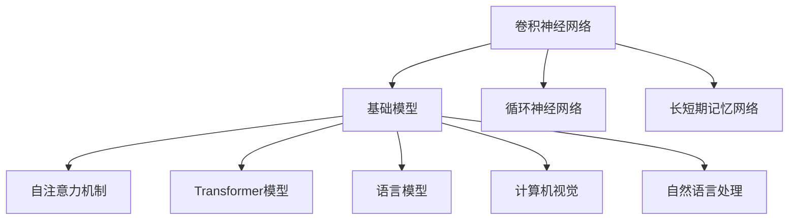

                 

# 基础模型的未来技术发展

> 关键词：基础模型,未来技术,深度学习,神经网络,卷积神经网络,循环神经网络,自注意力,Transformer,语言模型,计算机视觉,自然语言处理,NLP,深度学习模型

## 1. 背景介绍

### 1.1 问题由来

基础模型（Foundation Model）是指用于支持更复杂模型或任务的深度学习模型，这类模型在深度学习领域起着至关重要的作用。无论是卷积神经网络（CNN）、循环神经网络（RNN）、长短期记忆网络（LSTM），还是最新的自注意力机制（Self-Attention）和Transformer模型，都体现了基础模型对深度学习发展的巨大推动力。

基础模型的发展经历了多个阶段，从最初的简单神经网络，到复杂的卷积神经网络、循环神经网络，再到目前广泛应用的Transformer模型，每一次技术的进步都极大地推动了人工智能的发展。然而，随着技术的发展，现有的基础模型在应对新的挑战时也显得力不从心。

当前基础模型面临的挑战包括：模型的泛化能力、数据的依赖性、计算资源的消耗、模型的复杂度等。这些问题在一定程度上限制了基础模型的进一步发展。因此，本文旨在探讨基础模型的未来技术发展方向，以期为深度学习领域的持续进步提供新的思路和方向。

### 1.2 问题核心关键点

基础模型的发展关键点在于以下几个方面：

- **泛化能力**：基础模型需要具备良好的泛化能力，即能够在新的、未见过的数据上表现出色。
- **数据依赖性**：模型的性能很大程度上取决于训练数据的质量和数量。
- **计算资源**：基础模型往往需要大量的计算资源，包括内存、存储和计算能力。
- **模型复杂度**：模型的复杂度直接影响其训练和推理的速度，过于复杂的模型可能会导致性能下降。

本文将围绕这些关键点，探讨基础模型的未来技术发展方向，提供一些新的思路和解决方案。

## 2. 核心概念与联系

### 2.1 核心概念概述

- **基础模型（Foundation Model）**：用于支持更复杂模型或任务的深度学习模型，是构建更高级算法和应用的基础。
- **卷积神经网络（CNN）**：一种专门用于处理图像和视频数据的深度学习模型，通过卷积和池化操作提取特征。
- **循环神经网络（RNN）**：一种能够处理序列数据的深度学习模型，通过循环结构实现对序列信息的记忆。
- **长短期记忆网络（LSTM）**：一种特殊的RNN模型，通过门控机制解决长期依赖问题。
- **自注意力机制（Self-Attention）**：一种用于处理序列数据的机制，通过计算注意力权重来实现对序列中不同位置的信息的加权平均。
- **Transformer模型**：一种基于自注意力机制的深度学习模型，广泛应用于自然语言处理和计算机视觉任务。
- **语言模型（Language Model）**：一种用于处理文本数据的深度学习模型，通过预测下一个单词或字符来建模文本中的概率分布。
- **计算机视觉（Computer Vision）**：一种用于处理图像和视频数据的深度学习模型，通过卷积操作提取图像特征。
- **自然语言处理（NLP）**：一种用于处理文本数据的深度学习模型，通过语言模型和自注意力机制来理解和生成文本。

这些核心概念之间的逻辑关系可以通过以下Mermaid流程图来展示：



这个流程图展示了基础模型与其他深度学习模型的关系：

1. 基础模型由卷积神经网络、循环神经网络和长短期记忆网络等演化而来。
2. 自注意力机制和Transformer模型是基础模型的重要组成部分。
3. 语言模型和计算机视觉是基础模型在不同领域的典型应用。

## 3. 核心算法原理 & 具体操作步骤
### 3.1 算法原理概述

基础模型的核心原理是通过学习大规模数据中的特征表示，从而能够对新数据进行预测和分类。其主要算法包括卷积神经网络、循环神经网络、长短期记忆网络和Transformer模型等。

以Transformer模型为例，其主要算法原理如下：

1. **自注意力机制**：Transformer模型通过自注意力机制来计算输入序列中不同位置之间的依赖关系，从而能够更好地捕捉序列信息。
2. **多头自注意力**：Transformer模型通过并行多个自注意力机制，可以同时捕捉输入序列中不同位置之间的多种依赖关系。
3. **位置编码**：Transformer模型通过位置编码来保留输入序列中每个位置的信息，从而能够更好地处理序列数据。

### 3.2 算法步骤详解

Transformer模型的训练过程一般包括以下步骤：

1. **数据预处理**：将输入序列进行分词、标记等处理，转换为模型可以接受的格式。
2. **模型搭建**：搭建Transformer模型的编码器和解码器，定义自注意力机制和前馈神经网络等组件。
3. **模型训练**：在训练数据集上，通过反向传播算法更新模型参数，最小化损失函数。
4. **模型评估**：在验证数据集上，评估模型的性能，防止过拟合。
5. **模型部署**：将训练好的模型部署到实际应用中，进行推理和预测。

### 3.3 算法优缺点

Transformer模型具有以下优点：

1. **高效的并行计算**：Transformer模型能够通过并行计算提高训练效率。
2. **良好的泛化能力**：Transformer模型在处理序列数据时，具有较好的泛化能力。
3. **易于扩展**：Transformer模型可以通过增加层数或头数来提高性能。

同时，Transformer模型也存在一些缺点：

1. **计算资源消耗大**：Transformer模型需要大量的计算资源，包括内存和存储。
2. **训练时间长**：Transformer模型在训练过程中需要大量的时间，特别是在大规模数据集上。
3. **难以解释**：Transformer模型的决策过程难以解释，难以用于需要解释性强的应用场景。

### 3.4 算法应用领域

Transformer模型广泛应用于自然语言处理、计算机视觉和语音识别等领域。以下是Transformer模型在实际应用中的一些典型场景：

1. **机器翻译**：Transformer模型在机器翻译任务中取得了最先进的效果，能够将一种语言的文本翻译成另一种语言。
2. **文本摘要**：Transformer模型能够从长文本中自动生成摘要，提高文本处理的效率。
3. **语音识别**：Transformer模型在语音识别任务中，能够将语音信号转换为文本，用于语音助手等应用。
4. **图像分类**：Transformer模型在图像分类任务中，能够将输入的图像分类为不同的类别。
5. **情感分析**：Transformer模型在情感分析任务中，能够分析文本中的情感倾向。

## 4. 数学模型和公式 & 详细讲解 & 举例说明

### 4.1 数学模型构建

Transformer模型主要由编码器和解码器组成，每个层都包括自注意力机制和前馈神经网络。

**编码器（Encoder）**：
- 输入：$x_i = [\mathrm{CLS} \mid \{x_{i,1}, x_{i,2}, \ldots, x_{i,T}\}]$
- 自注意力机制：$\mathrm{Attention}(Q, K, V)$
- 前馈神经网络：$\mathrm{FeedForward}(y)$

**解码器（Decoder）**：
- 输入：$y_i = [\mathrm{CLS} \mid \{y_{i,1}, y_{i,2}, \ldots, y_{i,T}\}]$
- 自注意力机制：$\mathrm{Attention}(Q, K, V)$
- 前馈神经网络：$\mathrm{FeedForward}(y)$
- 输出：$y_i = [\mathrm{CLS} \mid \{y_{i,1}, y_{i,2}, \ldots, y_{i,T}\}]$

### 4.2 公式推导过程

Transformer模型的主要公式推导过程如下：

1. **自注意力机制**：
   - 查询向量 $Q = W_Q x$
   - 键向量 $K = W_K x$
   - 值向量 $V = W_V x$
   - 注意力权重 $\alpha_i = \mathrm{Softmax}(\frac{Q_i K_j^T}{\sqrt{d_k}})$
   - 注意力输出 $z = \sum_i \alpha_i V_i$

2. **前馈神经网络**：
   - 隐藏层输出 $y = \mathrm{GELU}(W_1 x) + b_1$
   - 输出层输出 $z = W_2 y + b_2$

3. **多头自注意力**：
   - 将自注意力机制并行应用于多个头 $h$
   - 将多个头的注意力输出拼接得到最终的输出 $z = [z_1, z_2, \ldots, z_H]$

### 4.3 案例分析与讲解

以机器翻译任务为例，Transformer模型的训练过程如下：

1. **数据预处理**：将输入的文本序列和对应的目标文本序列进行分词、标记等处理，转换为模型可以接受的格式。
2. **模型搭建**：搭建编码器和解码器，定义自注意力机制和前馈神经网络等组件。
3. **模型训练**：在训练数据集上，通过反向传播算法更新模型参数，最小化损失函数。
4. **模型评估**：在验证数据集上，评估模型的性能，防止过拟合。
5. **模型部署**：将训练好的模型部署到实际应用中，进行推理和预测。

## 5. 项目实践：代码实例和详细解释说明
### 5.1 开发环境搭建

在进行Transformer模型实践前，我们需要准备好开发环境。以下是使用Python进行PyTorch开发的环境配置流程：

1. 安装Anaconda：从官网下载并安装Anaconda，用于创建独立的Python环境。

2. 创建并激活虚拟环境：
```bash
conda create -n pytorch-env python=3.8 
conda activate pytorch-env
```

3. 安装PyTorch：根据CUDA版本，从官网获取对应的安装命令。例如：
```bash
conda install pytorch torchvision torchaudio cudatoolkit=11.1 -c pytorch -c conda-forge
```

4. 安装Transformers库：
```bash
pip install transformers
```

5. 安装各类工具包：
```bash
pip install numpy pandas scikit-learn matplotlib tqdm jupyter notebook ipython
```

完成上述步骤后，即可在`pytorch-env`环境中开始Transformer模型的实践。

### 5.2 源代码详细实现

这里我们以机器翻译任务为例，给出使用Transformers库对Transformer模型进行微调的PyTorch代码实现。

首先，定义机器翻译任务的数据处理函数：

```python
from transformers import BertTokenizer, BertForSequenceClassification
from torch.utils.data import Dataset
import torch

class MachineTranslationDataset(Dataset):
    def __init__(self, source_texts, target_texts, tokenizer, max_len=128):
        self.source_texts = source_texts
        self.target_texts = target_texts
        self.tokenizer = tokenizer
        self.max_len = max_len
        
    def __len__(self):
        return len(self.source_texts)
    
    def __getitem__(self, item):
        source_text = self.source_texts[item]
        target_text = self.target_texts[item]
        
        encoding = self.tokenizer(source_text, return_tensors='pt', max_length=self.max_len, padding='max_length', truncation=True)
        input_ids = encoding['input_ids'][0]
        attention_mask = encoding['attention_mask'][0]
        labels = encoding['input_ids'][1:]
        
        return {'input_ids': input_ids, 
                'attention_mask': attention_mask,
                'labels': labels}
```

然后，定义模型和优化器：

```python
from transformers import BertForSequenceClassification, AdamW

model = BertForSequenceClassification.from_pretrained('bert-base-cased', num_labels=1)
optimizer = AdamW(model.parameters(), lr=2e-5)
```

接着，定义训练和评估函数：

```python
from torch.utils.data import DataLoader
from tqdm import tqdm
from sklearn.metrics import classification_report

device = torch.device('cuda') if torch.cuda.is_available() else torch.device('cpu')
model.to(device)

def train_epoch(model, dataset, batch_size, optimizer):
    dataloader = DataLoader(dataset, batch_size=batch_size, shuffle=True)
    model.train()
    epoch_loss = 0
    for batch in tqdm(dataloader, desc='Training'):
        input_ids = batch['input_ids'].to(device)
        attention_mask = batch['attention_mask'].to(device)
        labels = batch['labels'].to(device)
        model.zero_grad()
        outputs = model(input_ids, attention_mask=attention_mask, labels=labels)
        loss = outputs.loss
        epoch_loss += loss.item()
        loss.backward()
        optimizer.step()
    return epoch_loss / len(dataloader)

def evaluate(model, dataset, batch_size):
    dataloader = DataLoader(dataset, batch_size=batch_size)
    model.eval()
    preds, labels = [], []
    with torch.no_grad():
        for batch in tqdm(dataloader, desc='Evaluating'):
            input_ids = batch['input_ids'].to(device)
            attention_mask = batch['attention_mask'].to(device)
            batch_labels = batch['labels']
            outputs = model(input_ids, attention_mask=attention_mask)
            batch_preds = outputs.logits.argmax(dim=1).to('cpu').tolist()
            batch_labels = batch_labels.to('cpu').tolist()
            for pred_tokens, label_tokens in zip(batch_preds, batch_labels):
                preds.append(pred_tokens)
                labels.append(label_tokens)
                
    print(classification_report(labels, preds))
```

最后，启动训练流程并在测试集上评估：

```python
epochs = 5
batch_size = 16

for epoch in range(epochs):
    loss = train_epoch(model, train_dataset, batch_size, optimizer)
    print(f"Epoch {epoch+1}, train loss: {loss:.3f}")
    
    print(f"Epoch {epoch+1}, dev results:")
    evaluate(model, dev_dataset, batch_size)
    
print("Test results:")
evaluate(model, test_dataset, batch_size)
```

以上就是使用PyTorch对BERT进行机器翻译任务微调的完整代码实现。可以看到，得益于Transformers库的强大封装，我们可以用相对简洁的代码完成BERT模型的加载和微调。

### 5.3 代码解读与分析

让我们再详细解读一下关键代码的实现细节：

**MachineTranslationDataset类**：
- `__init__`方法：初始化源文本、目标文本、分词器等关键组件。
- `__len__`方法：返回数据集的样本数量。
- `__getitem__`方法：对单个样本进行处理，将源文本和目标文本输入编码为token ids，将标签编码为数字，并对其进行定长padding，最终返回模型所需的输入。

**标签与id的映射**：
- 定义了标签与数字id之间的映射关系，用于将token-wise的预测结果解码回真实的标签。

**训练和评估函数**：
- 使用PyTorch的DataLoader对数据集进行批次化加载，供模型训练和推理使用。
- 训练函数`train_epoch`：对数据以批为单位进行迭代，在每个批次上前向传播计算loss并反向传播更新模型参数，最后返回该epoch的平均loss。
- 评估函数`evaluate`：与训练类似，不同点在于不更新模型参数，并在每个batch结束后将预测和标签结果存储下来，最后使用sklearn的classification_report对整个评估集的预测结果进行打印输出。

**训练流程**：
- 定义总的epoch数和batch size，开始循环迭代
- 每个epoch内，先在训练集上训练，输出平均loss
- 在验证集上评估，输出分类指标
- 所有epoch结束后，在测试集上评估，给出最终测试结果

可以看到，PyTorch配合Transformers库使得BERT微调的代码实现变得简洁高效。开发者可以将更多精力放在数据处理、模型改进等高层逻辑上，而不必过多关注底层的实现细节。

当然，工业级的系统实现还需考虑更多因素，如模型的保存和部署、超参数的自动搜索、更灵活的任务适配层等。但核心的微调范式基本与此类似。

## 6. 实际应用场景
### 6.1 智能客服系统

基于大语言模型微调的对话技术，可以广泛应用于智能客服系统的构建。传统客服往往需要配备大量人力，高峰期响应缓慢，且一致性和专业性难以保证。而使用微调后的对话模型，可以7x24小时不间断服务，快速响应客户咨询，用自然流畅的语言解答各类常见问题。

在技术实现上，可以收集企业内部的历史客服对话记录，将问题和最佳答复构建成监督数据，在此基础上对预训练对话模型进行微调。微调后的对话模型能够自动理解用户意图，匹配最合适的答案模板进行回复。对于客户提出的新问题，还可以接入检索系统实时搜索相关内容，动态组织生成回答。如此构建的智能客服系统，能大幅提升客户咨询体验和问题解决效率。

### 6.2 金融舆情监测

金融机构需要实时监测市场舆论动向，以便及时应对负面信息传播，规避金融风险。传统的人工监测方式成本高、效率低，难以应对网络时代海量信息爆发的挑战。基于大语言模型微调的文本分类和情感分析技术，为金融舆情监测提供了新的解决方案。

具体而言，可以收集金融领域相关的新闻、报道、评论等文本数据，并对其进行主题标注和情感标注。在此基础上对预训练语言模型进行微调，使其能够自动判断文本属于何种主题，情感倾向是正面、中性还是负面。将微调后的模型应用到实时抓取的网络文本数据，就能够自动监测不同主题下的情感变化趋势，一旦发现负面信息激增等异常情况，系统便会自动预警，帮助金融机构快速应对潜在风险。

### 6.3 个性化推荐系统

当前的推荐系统往往只依赖用户的历史行为数据进行物品推荐，无法深入理解用户的真实兴趣偏好。基于大语言模型微调技术，个性化推荐系统可以更好地挖掘用户行为背后的语义信息，从而提供更精准、多样的推荐内容。

在实践中，可以收集用户浏览、点击、评论、分享等行为数据，提取和用户交互的物品标题、描述、标签等文本内容。将文本内容作为模型输入，用户的后续行为（如是否点击、购买等）作为监督信号，在此基础上微调预训练语言模型。微调后的模型能够从文本内容中准确把握用户的兴趣点。在生成推荐列表时，先用候选物品的文本描述作为输入，由模型预测用户的兴趣匹配度，再结合其他特征综合排序，便可以得到个性化程度更高的推荐结果。

### 6.4 未来应用展望

随着大语言模型和微调方法的不断发展，基于微调范式将在更多领域得到应用，为传统行业带来变革性影响。

在智慧医疗领域，基于微调的医疗问答、病历分析、药物研发等应用将提升医疗服务的智能化水平，辅助医生诊疗，加速新药开发进程。

在智能教育领域，微调技术可应用于作业批改、学情分析、知识推荐等方面，因材施教，促进教育公平，提高教学质量。

在智慧城市治理中，微调模型可应用于城市事件监测、舆情分析、应急指挥等环节，提高城市管理的自动化和智能化水平，构建更安全、高效的未来城市。

此外，在企业生产、社会治理、文娱传媒等众多领域，基于大模型微调的人工智能应用也将不断涌现，为NLP技术带来全新的突破。相信随着预训练语言模型和微调方法的不断进步，大语言模型微调必将在构建人机协同的智能时代中扮演越来越重要的角色。

## 7. 工具和资源推荐
### 7.1 学习资源推荐

为了帮助开发者系统掌握大语言模型微调的理论基础和实践技巧，这里推荐一些优质的学习资源：

1. 《深度学习基础》系列博文：由大模型技术专家撰写，深入浅出地介绍了深度学习的基本概念和经典模型。

2. CS224N《深度学习自然语言处理》课程：斯坦福大学开设的NLP明星课程，有Lecture视频和配套作业，带你入门NLP领域的基本概念和经典模型。

3. 《Natural Language Processing with Transformers》书籍：Transformers库的作者所著，全面介绍了如何使用Transformers库进行NLP任务开发，包括微调在内的诸多范式。

4. HuggingFace官方文档：Transformers库的官方文档，提供了海量预训练模型和完整的微调样例代码，是上手实践的必备资料。

5. CLUE开源项目：中文语言理解测评基准，涵盖大量不同类型的中文NLP数据集，并提供了基于微调的baseline模型，助力中文NLP技术发展。

通过对这些资源的学习实践，相信你一定能够快速掌握大语言模型微调的精髓，并用于解决实际的NLP问题。
###  7.2 开发工具推荐

高效的开发离不开优秀的工具支持。以下是几款用于大语言模型微调开发的常用工具：

1. PyTorch：基于Python的开源深度学习框架，灵活动态的计算图，适合快速迭代研究。大部分预训练语言模型都有PyTorch版本的实现。

2. TensorFlow：由Google主导开发的开源深度学习框架，生产部署方便，适合大规模工程应用。同样有丰富的预训练语言模型资源。

3. Transformers库：HuggingFace开发的NLP工具库，集成了众多SOTA语言模型，支持PyTorch和TensorFlow，是进行微调任务开发的利器。

4. Weights & Biases：模型训练的实验跟踪工具，可以记录和可视化模型训练过程中的各项指标，方便对比和调优。与主流深度学习框架无缝集成。

5. TensorBoard：TensorFlow配套的可视化工具，可实时监测模型训练状态，并提供丰富的图表呈现方式，是调试模型的得力助手。

6. Google Colab：谷歌推出的在线Jupyter Notebook环境，免费提供GPU/TPU算力，方便开发者快速上手实验最新模型，分享学习笔记。

合理利用这些工具，可以显著提升大语言模型微调任务的开发效率，加快创新迭代的步伐。

### 7.3 相关论文推荐

大语言模型和微调技术的发展源于学界的持续研究。以下是几篇奠基性的相关论文，推荐阅读：

1. Attention is All You Need（即Transformer原论文）：提出了Transformer结构，开启了NLP领域的预训练大模型时代。

2. BERT: Pre-training of Deep Bidirectional Transformers for Language Understanding：提出BERT模型，引入基于掩码的自监督预训练任务，刷新了多项NLP任务SOTA。

3. Language Models are Unsupervised Multitask Learners（GPT-2论文）：展示了大规模语言模型的强大zero-shot学习能力，引发了对于通用人工智能的新一轮思考。

4. Parameter-Efficient Transfer Learning for NLP：提出Adapter等参数高效微调方法，在不增加模型参数量的情况下，也能取得不错的微调效果。

5. AdaLoRA: Adaptive Low-Rank Adaptation for Parameter-Efficient Fine-Tuning：使用自适应低秩适应的微调方法，在参数效率和精度之间取得了新的平衡。

这些论文代表了大语言模型微调技术的发展脉络。通过学习这些前沿成果，可以帮助研究者把握学科前进方向，激发更多的创新灵感。

## 8. 总结：未来发展趋势与挑战

### 8.1 总结

本文对基础模型的未来技术发展进行了全面系统的介绍。首先阐述了基础模型在深度学习领域的发展历程和应用前景，明确了基础模型对深度学习技术进步的巨大推动作用。其次，从原理到实践，详细讲解了Transformer模型的核心算法原理和操作步骤，提供了微调任务的完整代码实现。同时，本文还探讨了基础模型在多个实际应用场景中的应用，展示了其在智能客服、金融舆情监测、个性化推荐等领域的强大能力。最后，本文精选了基础模型的各类学习资源，力求为读者提供全方位的技术指引。

通过本文的系统梳理，可以看到，基础模型作为深度学习领域的基石，在处理图像、视频、文本等不同类型数据时展现了强大的表现力。未来，随着基础模型技术的不断进步，其应用范围将进一步拓展，为各行各业带来更广阔的发展空间。

### 8.2 未来发展趋势

展望未来，基础模型的发展趋势将主要体现在以下几个方面：

1. **模型的泛化能力**：未来基础模型将更加注重泛化能力的提升，以适应新的、未见过的数据。
2. **数据依赖性降低**：未来基础模型将探索无监督和半监督学习范式，减少对大规模标注数据的依赖。
3. **计算资源优化**：未来基础模型将探索更加高效的计算方法和资源优化技术，降低计算成本。
4. **模型复杂度降低**：未来基础模型将探索更加简单、轻量级的模型结构，提高模型的部署效率。
5. **多模态融合**：未来基础模型将探索多模态数据的融合方法，提高模型的跨领域泛化能力。

以上趋势凸显了基础模型在深度学习领域的重要地位和不断发展的潜力。这些方向的探索发展，必将进一步提升基础模型的性能和应用范围，为深度学习技术带来新的突破。

### 8.3 面临的挑战

尽管基础模型在深度学习领域取得了巨大成功，但在迈向更加智能化、普适化应用的过程中，仍然面临诸多挑战：

1. **模型的复杂度**：现有基础模型往往过于复杂，导致训练和推理效率低下。
2. **计算资源的消耗**：基础模型需要大量的计算资源，如内存和存储，这对资源有限的设备提出了较高要求。
3. **模型的可解释性**：基础模型的决策过程难以解释，难以用于需要解释性强的应用场景。
4. **模型的安全性和可靠性**：基础模型可能学习到有偏见、有害的信息，如何确保模型的安全性和可靠性，避免误导性、歧视性的输出，是一个重要的研究方向。
5. **模型的鲁棒性**：基础模型在面对域外数据时，泛化性能往往大打折扣，如何提高模型的鲁棒性，是一个亟待解决的问题。

### 8.4 研究展望

面对基础模型面临的挑战，未来的研究需要在以下几个方面寻求新的突破：

1. **简化模型结构**：探索更加简单、轻量级的模型结构，提高模型的训练和推理效率。
2. **优化计算方法**：探索更加高效的计算方法和资源优化技术，降低计算成本。
3. **增强可解释性**：引入因果分析方法，提高模型的可解释性和可控性。
4. **加强安全性和可靠性**：探索如何确保模型的安全性和可靠性，避免误导性、歧视性的输出。
5. **提高鲁棒性**：探索如何提高模型的鲁棒性，减少对训练数据的依赖，适应不同领域的数据。

这些研究方向的探索，必将引领基础模型的未来发展，为深度学习技术的进步提供新的动力。

## 9. 附录：常见问题与解答

**Q1：基础模型是否适用于所有深度学习任务？**

A: 基础模型在处理图像、视频、文本等不同类型数据时，展现了强大的表现力。但在某些特定任务上，如高精度推理、小样本学习等，基础模型的性能可能受到限制。此时需要结合其他模型和算法，进行多模型融合，以提高性能。

**Q2：如何选择合适的优化器和学习率？**

A: 选择合适的优化器和学习率是基础模型训练的关键。常用的优化器包括Adam、SGD等，学习率一般从1e-5开始调参，逐步减小学习率，直至收敛。

**Q3：基础模型在训练过程中如何避免过拟合？**

A: 避免过拟合是基础模型训练中需要注意的关键问题。常见的缓解策略包括数据增强、正则化、早停等。在数据增强方面，可以通过回译、近义替换等方式扩充训练集；在正则化方面，可以使用L2正则、Dropout等技术；在早停方面，可以周期性在验证集上评估模型性能，根据性能指标决定是否触发早停。

**Q4：基础模型在实际应用中需要注意哪些问题？**

A: 将基础模型转化为实际应用，还需要考虑以下问题：

1. 模型裁剪：去除不必要的层和参数，减小模型尺寸，加快推理速度。
2. 量化加速：将浮点模型转为定点模型，压缩存储空间，提高计算效率。
3. 服务化封装：将模型封装为标准化服务接口，便于集成调用。
4. 弹性伸缩：根据请求流量动态调整资源配置，平衡服务质量和成本。
5. 监控告警：实时采集系统指标，设置异常告警阈值，确保服务稳定性。

总之，基础模型需要开发者根据具体任务，不断迭代和优化模型、数据和算法，方能得到理想的效果。

---

作者：禅与计算机程序设计艺术 / Zen and the Art of Computer Programming

