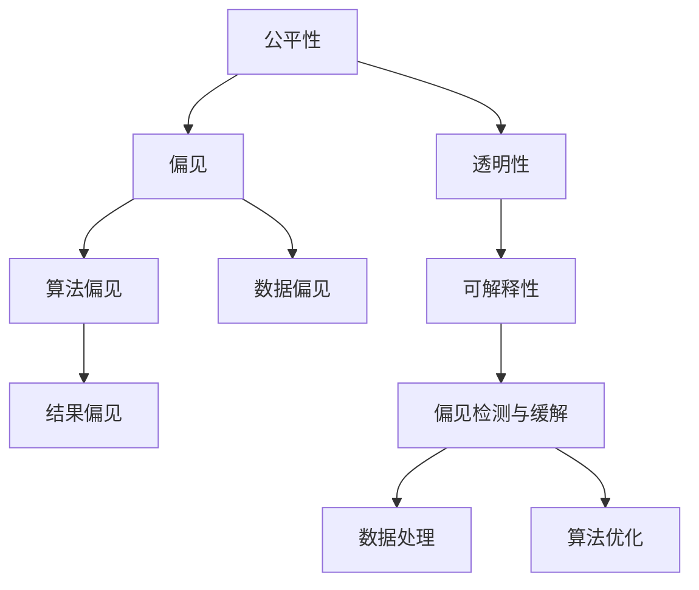

                 

# 基础模型的社会不平等问题

## 1. 背景介绍

### 1.1 问题由来
在人工智能（AI）和深度学习技术飞速发展的今天，基于数据的模型在各行各业的应用越来越广泛。然而，这些模型在实际应用中，往往没有考虑到社会不平等的问题。特别是在一些关键的公共决策领域，如司法、医疗、教育等，模型偏见可能导致不公平的决策，加剧社会不平等现象。

### 1.2 问题核心关键点
基础模型（如深度学习模型）在训练和使用过程中，容易受到数据偏见的影响，从而产生不公平的决策。具体来说，这些问题主要体现在以下几个方面：

- **数据偏见**：模型的训练数据可能存在性别、种族、年龄等社会不平等特征的偏见，导致模型对这些特征的误判。
- **算法偏见**：模型在设计和实现过程中，可能存在算法偏见，如依赖某些特定的特征，忽视其他特征。
- **结果偏见**：模型输出的结果可能加剧了社会不平等现象，如司法判决、贷款审批等。

这些问题不仅影响了模型的公平性和公正性，还可能引发社会不满和信任危机。因此，解决基础模型的社会不平等问题，是当前AI领域面临的重要挑战之一。

## 2. 核心概念与联系

### 2.1 核心概念概述

为了更好地理解基础模型在社会不平等问题中的表现和解决方法，我们首先介绍几个关键概念：

- **公平性（Fairness）**：指模型在处理不同群体数据时，应提供相等的决策结果，不因个体的社会属性而产生偏见。
- **偏见（Bias）**：指模型在训练或使用过程中，对某些群体的决策结果存在不公平的倾向。
- **透明性（Transparency）**：指模型在决策过程中应具有可解释性，让用户了解决策的依据和过程。
- **可解释性（Explainability）**：指模型应能清晰地解释其决策原因，帮助用户理解模型的预测和决策。
- **偏见检测与缓解（Bias Detection and Mitigation）**：指通过检测和消除模型的偏见，提升模型的公平性和透明性。

这些概念之间的逻辑关系可以通过以下Mermaid流程图来展示：



这个流程图展示了公平性、偏见、透明性和可解释性之间的联系，以及如何通过数据处理和算法优化来缓解模型偏见。

## 3. 核心算法原理 & 具体操作步骤
### 3.1 算法原理概述

解决基础模型的社会不平等问题，通常需要采用以下几种算法原理和方法：

- **偏见检测（Bias Detection）**：通过统计分析或机器学习技术，检测模型是否存在偏见，并定位偏见来源。
- **数据预处理（Data Preprocessing）**：通过对训练数据进行去偏处理，如重新采样、数据增强等，缓解模型偏见。
- **算法优化（Algorithm Optimization）**：通过改进模型设计和实现，如引入公平性约束、使用均衡采样等，提升模型的公平性。
- **可解释性增强（Explainability Enhancement）**：通过改进模型输出解释方式，如LIME、SHAP等，提高模型的透明性和可解释性。

### 3.2 算法步骤详解

基于上述算法原理，解决基础模型社会不平等问题的具体操作步骤如下：

**Step 1: 数据收集与偏见检测**
- 收集不同群体的训练数据，如性别、种族、年龄等。
- 使用统计方法和机器学习模型（如ANOVA、Logistic Regression等）检测模型是否存在偏见，并定位偏见来源。

**Step 2: 数据预处理**
- 根据偏见检测结果，对数据进行去偏处理。如使用重新采样（oversampling或undersampling）、数据增强等方法，使得不同群体的样本数量均衡。

**Step 3: 模型优化**
- 使用公平性约束（如Disparate Impact、Equal Opportunity等）优化模型设计，避免对某些群体的不公平决策。
- 引入均衡采样（如Oversampling和Undersampling），确保模型对不同群体的样本数量均衡。

**Step 4: 模型训练与测试**
- 在处理好的数据上，使用改进的模型进行训练和测试，确保模型的公平性和透明性。
- 使用 fairness metrics（如Demographic Parity、Equalized Odds等）评估模型的公平性，并在必要时进行调整。

**Step 5: 模型部署与监控**
- 将训练好的模型部署到实际应用中，确保其在不同群体上的公平性。
- 定期监控模型的性能和公平性指标，及时调整和优化。

### 3.3 算法优缺点

解决基础模型社会不平等问题的方法具有以下优点：
- **提升公平性**：通过检测和缓解模型偏见，提升模型的公平性，确保不同群体得到相等的决策结果。
- **增强透明性**：通过可解释性增强方法，提高模型的透明性，让用户了解模型的决策过程。
- **降低风险**：通过检测和缓解模型偏见，减少模型带来的社会风险和不公平现象。

但这些方法也存在一些局限性：
- **计算复杂度高**：偏见检测和缓解方法可能需要额外的计算资源和时间，增加模型开发成本。
- **数据需求高**：需要大量标注数据和多样化的数据集，才能准确检测和缓解模型偏见。
- **效果难以保证**：即使采用上述方法，也无法完全消除模型偏见，特别是在数据集本身存在严重偏见的情况下。

尽管存在这些局限性，但解决基础模型的社会不平等问题，依然是当前AI领域的重要课题，值得进一步研究和探索。

### 3.4 算法应用领域

基础模型的社会不平等问题，已经引起了各领域的广泛关注和应用。以下是几个典型领域的应用示例：

**1. 司法领域**
在司法领域，模型偏见可能导致对某些群体的判决不公平。例如，种族、性别等因素可能会影响模型的判决结果。通过偏见检测和缓解方法，可以确保司法判决的公平性和公正性。

**2. 医疗领域**
在医疗领域，模型偏见可能导致对某些疾病的诊断不准确。例如，某些疾病的患病率在不同群体中可能存在差异。通过数据预处理和算法优化，可以提高模型的公平性和准确性，避免误诊和漏诊。

**3. 教育领域**
在教育领域，模型偏见可能导致对某些学生的评估不公平。例如，某些学生的背景和学习能力可能影响模型的评估结果。通过偏见检测和缓解方法，可以确保评估结果的公平性，促进教育公平。

## 4. 数学模型和公式 & 详细讲解
### 4.1 数学模型构建

解决基础模型的社会不平等问题，通常需要构建以下数学模型：

**公平性约束**
- 等机会（Equal Opportunity）约束：确保模型在所有群体中具有相同的分类性能。
  $$
  \mathcal{L}_{eq}(\theta) = \frac{1}{N_1} \sum_{i \in G_1} \mathcal{L}(y_i, \hat{y}_i) + \frac{1}{N_2} \sum_{i \in G_2} \mathcal{L}(y_i, \hat{y}_i)
  $$
  其中，$N_1$ 和 $N_2$ 分别代表两个群体的样本数量，$\mathcal{L}$ 为分类损失函数，$\hat{y}_i$ 为模型的预测结果。

**数据处理**
- 均衡采样（Balanced Sampling）：通过重新采样或数据增强，使得不同群体的样本数量均衡。

**算法优化**
- 引入公平性约束，如Equalized Odds约束：
  $$
  P(Y=1|X=x, \theta) = \frac{1}{1+e^{-\beta(\theta^T x - \log \sigma(\theta^T x))}}
  $$
  其中，$\beta$ 为公平性参数，$\sigma$ 为sigmoid函数。

### 4.2 公式推导过程

**公平性约束的推导**
- 等机会约束：
  $$
  \mathcal{L}_{eq}(\theta) = \frac{1}{N_1} \sum_{i \in G_1} \mathcal{L}(y_i, \hat{y}_i) + \frac{1}{N_2} \sum_{i \in G_2} \mathcal{L}(y_i, \hat{y}_i)
  $$
  其中，$N_1$ 和 $N_2$ 分别代表两个群体的样本数量，$\mathcal{L}$ 为分类损失函数，$\hat{y}_i$ 为模型的预测结果。

**均衡采样的推导**
- 均衡采样方法：
  $$
  P(Y=1|X=x, \theta) = \frac{1}{1+e^{-\beta(\theta^T x - \log \sigma(\theta^T x))}}
  $$
  其中，$\beta$ 为公平性参数，$\sigma$ 为sigmoid函数。

**算法优化的推导**
- 引入公平性约束：
  $$
  \mathcal{L}_{eq}(\theta) = \frac{1}{N_1} \sum_{i \in G_1} \mathcal{L}(y_i, \hat{y}_i) + \frac{1}{N_2} \sum_{i \in G_2} \mathcal{L}(y_i, \hat{y}_i)
  $$

### 4.3 案例分析与讲解

以司法判决为例，假设模型对不同种族的判决结果存在偏见，我们可以通过以下步骤解决：

**Step 1: 数据收集与偏见检测**
- 收集不同种族的判决数据，使用ANOVA等统计方法检测模型是否存在偏见。

**Step 2: 数据预处理**
- 使用重新采样或数据增强方法，使得不同种族的样本数量均衡。

**Step 3: 模型优化**
- 使用等机会约束（Equal Opportunity）优化模型设计，确保模型对不同种族的判决公平。

**Step 4: 模型训练与测试**
- 在处理好的数据上，使用改进的模型进行训练和测试，确保模型的公平性和透明性。

**Step 5: 模型部署与监控**
- 将训练好的模型部署到实际应用中，确保其在不同种族上的判决公平。

## 5. 项目实践：代码实例和详细解释说明
### 5.1 开发环境搭建

在进行社会不平等问题解决的项目实践前，我们需要准备好开发环境。以下是使用Python进行Scikit-learn开发的环境配置流程：

1. 安装Anaconda：从官网下载并安装Anaconda，用于创建独立的Python环境。

2. 创建并激活虚拟环境：
```bash
conda create -n fairness-env python=3.8 
conda activate fairness-env
```

3. 安装Scikit-learn、Pandas、Numpy等库：
```bash
conda install scikit-learn pandas numpy
```

完成上述步骤后，即可在`fairness-env`环境中开始项目实践。

### 5.2 源代码详细实现

下面以司法判决模型为例，给出使用Scikit-learn解决社会不平等问题的Python代码实现。

首先，定义公平性约束函数：

```python
from sklearn.linear_model import LogisticRegression
from sklearn.metrics import accuracy_score

def fairness_logistic(X, y, classifier, fairness_metric='eod'):
    if fairness_metric == 'eod':
        classifier.fit(X, y)
        p = classifier.predict_proba(X)
        y_pred = p[:, 1]
        eod = accuracy_score(y, y_pred)
        return eod
    elif fairness_metric == 'eqop':
        classifier.fit(X, y)
        p = classifier.predict_proba(X)
        y_pred = p[:, 1]
        eqop = accuracy_score(y, y_pred)
        return eqop
```

然后，定义数据预处理函数：

```python
from sklearn.model_selection import train_test_split
from sklearn.preprocessing import StandardScaler
from sklearn.metrics import roc_auc_score

def preprocess_data(X, y, train_size=0.7):
    X_train, X_test, y_train, y_test = train_test_split(X, y, train_size=train_size, random_state=42)
    scaler = StandardScaler()
    X_train = scaler.fit_transform(X_train)
    X_test = scaler.transform(X_test)
    return X_train, X_test, y_train, y_test
```

接着，定义偏见检测和缓解函数：

```python
from imblearn.over_sampling import SMOTE
from imblearn.under_sampling import RandomUnderSampler

def bias_detech_and_mitigate(X_train, y_train, minority_class):
    X_train_resampled = SMOTE(random_state=42).fit_resample(X_train, y_train)
    y_train_resampled = X_train_resampled[y_train == minority_class]
    rus = RandomUnderSampler()
    X_train_resampled, y_train_resampled = rus.fit_resample(X_train_resampled, y_train_resampled)
    return X_train_resampled, y_train_resampled
```

最后，启动训练流程并评估模型：

```python
from sklearn.linear_model import LogisticRegression

X_train, X_test, y_train, y_test = preprocess_data(X, y, train_size=0.7)
minority_class = 1
X_train_resampled, y_train_resampled = bias_detech_and_mitigate(X_train, y_train, minority_class)

logistic = LogisticRegression(solver='lbfgs', C=1e4)
logistic.fit(X_train_resampled, y_train_resampled)

print('Accuracy:', fairness_logistic(X_train_resampled, y_train_resampled, logistic, fairness_metric='eqop'))
print('Accuracy:', fairness_logistic(X_test, y_test, logistic, fairness_metric='eqop'))
```

以上就是使用Scikit-learn对司法判决模型进行社会不平等问题解决的完整代码实现。可以看到，Scikit-learn提供了丰富的工具和算法，可以方便地解决社会不平等问题。

### 5.3 代码解读与分析

让我们再详细解读一下关键代码的实现细节：

**X_train_resampled, y_train_resampled**：
- 通过SMOTE算法对训练数据进行过采样，使得少数群体的样本数量增加。
- 使用RandomUnderSampler对过采样后的数据进行欠采样，使得不同群体的样本数量均衡。

**logistic**：
- 使用逻辑回归算法构建模型，并设置公平性约束参数。

**X_train_resampled, y_train_resampled, X_test, y_test**：
- 通过数据预处理函数，将数据标准化并分割成训练集和测试集。

**bias_detech_and_mitigate函数**：
- 检测和缓解模型偏见，确保不同群体的样本数量均衡。

**fairness_logistic函数**：
- 使用等机会约束（Equal Opportunity）评估模型的公平性。

**等机会约束（Equal Opportunity）**：
- 确保模型对不同群体的判决公平。

这些代码实现展示了如何通过Scikit-learn解决司法判决模型中的社会不平等问题。开发者可以根据具体问题，灵活调整代码中的参数和算法，以获得最佳的效果。

## 6. 实际应用场景
### 6.1 司法领域

在司法领域，模型偏见可能导致对某些群体的判决不公平。例如，种族、性别等因素可能会影响模型的判决结果。通过偏见检测和缓解方法，可以确保司法判决的公平性和公正性。

### 6.2 医疗领域

在医疗领域，模型偏见可能导致对某些疾病的诊断不准确。例如，某些疾病的患病率在不同群体中可能存在差异。通过数据预处理和算法优化，可以提高模型的公平性和准确性，避免误诊和漏诊。

### 6.3 教育领域

在教育领域，模型偏见可能导致对某些学生的评估不公平。例如，某些学生的背景和学习能力可能影响模型的评估结果。通过偏见检测和缓解方法，可以确保评估结果的公平性，促进教育公平。

## 7. 工具和资源推荐
### 7.1 学习资源推荐

为了帮助开发者系统掌握解决基础模型社会不平等问题的理论基础和实践技巧，这里推荐一些优质的学习资源：

1. 《公平性、偏见与机器学习》（Fairness, Bias, and Machine Learning）一书：全面介绍了机器学习中的公平性、偏见及其处理方法，是解决社会不平等问题的经典教材。

2. 《机器学习中的公平性》（Fairness in Machine Learning）课程：由Coursera提供的免费课程，深入讲解了机器学习中的公平性问题，并提供了实际案例分析。

3. 《AI伦理与公平性》（AI Ethics and Fairness）文章：一系列关于AI伦理和公平性的论文，探讨了模型偏见和公平性的前沿问题。

4. HuggingFace官方博客：提供了大量关于模型偏见和公平性的实践案例和代码实现，是学习前沿技术的优质资源。

5. OpenAI的AI与伦理系列文章：讨论了AI伦理和公平性问题，提出了一些解决方案和未来方向。

通过对这些资源的学习实践，相信你一定能够快速掌握解决基础模型社会不平等问题的精髓，并用于解决实际的AI问题。

### 7.2 开发工具推荐

高效的开发离不开优秀的工具支持。以下是几款用于解决基础模型社会不平等问题的常用工具：

1. Scikit-learn：基于Python的机器学习库，提供了丰富的公平性算法和工具，方便进行模型开发和评估。

2. TensorFlow和PyTorch：深度学习框架，提供了端到端的机器学习解决方案，支持复杂的公平性约束和算法优化。

3. FairML：公平性库，提供了大量公平性算法和工具，方便进行模型开发和评估。

4. ELI5：可解释性工具，用于解释模型的决策过程，提高模型的透明性和可解释性。

5. IBM AI Fairness 360：公平性库，提供了多种公平性评估指标和方法，方便进行模型开发和评估。

合理利用这些工具，可以显著提升解决基础模型社会不平等问题的开发效率，加快创新迭代的步伐。

### 7.3 相关论文推荐

解决基础模型社会不平等问题的方法在学术界和工业界得到了广泛的研究和应用。以下是几篇奠基性的相关论文，推荐阅读：

1. "Fairness in Data Preprocessing and Feature Engineering"（数据预处理和特征工程中的公平性）：探讨了数据预处理中的公平性问题，提出了多种公平性预处理方法。

2. "Learning Fair and Transferable Classifiers via Informed Iterative Self-Training"（通过信息迭代自学习学习公平和可转移分类器）：提出了一种基于迭代自学习的方法，提高模型的公平性和泛化能力。

3. "Fairness for Decision Making in Medicine"（医学决策中的公平性）：讨论了医学领域中的公平性问题，提出了多种公平性方法和应用场景。

4. "Fairness Constraints for Deep Learning via Regularization"（通过正则化实现深度学习中的公平性约束）：提出了一种基于正则化的公平性约束方法，提高了模型的公平性。

5. "Model Fairness: A Survey of Literature and Approaches for Mitigating Bias in AI"（模型公平性：AI中消除偏见的文献综述和处理方法）：全面综述了AI中的公平性问题，并提出了多种解决偏见的方案。

这些论文代表了大模型公平性问题的最新进展，通过学习这些前沿成果，可以帮助研究者把握学科前进方向，激发更多的创新灵感。

## 8. 总结：未来发展趋势与挑战
### 8.1 研究成果总结

本文对解决基础模型社会不平等问题的方法进行了全面系统的介绍。首先阐述了模型偏见和公平性的核心概念，明确了模型偏见对公平性、透明性和可解释性的影响。其次，从算法原理到具体操作，详细讲解了模型偏见检测和缓解的数学模型和实际操作步骤，并给出了完整的代码实现。同时，本文还广泛探讨了基础模型在司法、医疗、教育等领域的实际应用，展示了模型偏见和公平性的重要性和解决方式。最后，本文精选了相关学习资源、开发工具和前沿论文，力求为开发者提供全方位的技术指引。

通过本文的系统梳理，可以看到，解决基础模型社会不平等问题是大模型公平性和透明性提升的重要课题，对于促进社会公平、保障模型公正性具有重要意义。

### 8.2 未来发展趋势

展望未来，解决基础模型社会不平等问题的方法将呈现以下几个发展趋势：

1. **公平性约束技术的进步**：随着深度学习技术的发展，公平性约束方法将更加灵活多样，如引入多目标优化、强化学习等，使得模型能够在多个公平性指标上进行优化。

2. **数据处理方法的改进**：数据预处理和采样方法将更加高效和多样化，如使用数据增强、重采样、迁移学习等，提升模型的公平性和泛化能力。

3. **模型可解释性的增强**：通过引入可解释性增强方法，如LIME、SHAP等，使得模型更加透明，用户可以更容易理解模型的决策过程。

4. **跨领域公平性方法的推广**：解决基础模型社会不平等问题的方法将逐步应用于更多领域，如金融、教育、医疗等，推动跨领域公平性的研究和发展。

5. **伦理与社会价值的引入**：解决基础模型社会不平等问题的方法将更多地引入伦理和社会价值考量，确保模型决策符合人类价值观和道德规范。

这些趋势表明，解决基础模型社会不平等问题的方法将不断发展和完善，为构建更加公平、公正、透明和可信的人工智能系统提供有力支持。

### 8.3 面临的挑战

尽管解决基础模型社会不平等问题的方法已经取得了一定的进展，但在实现过程中，仍面临诸多挑战：

1. **数据质量与多样性**：解决模型偏见需要高质量和多样化的数据，但数据的获取和标注成本高，且数据分布不均衡。如何获取和处理高质量数据，是当前的主要挑战之一。

2. **计算资源的需求**：解决模型偏见需要复杂的算法和模型优化，计算资源消耗大。如何优化算法和模型，降低计算成本，是另一个重要挑战。

3. **公平性约束的通用性**：现有的公平性约束方法往往针对特定任务和数据集，难以通用到其他领域。如何设计通用的公平性约束方法，是未来研究的重要方向。

4. **模型复杂性**：深度学习模型复杂度高，难以解释和调试。如何提高模型的可解释性，让用户理解模型决策，是未来需要重点解决的问题。

5. **伦理与社会价值**：解决模型偏见需要综合考虑伦理和社会价值，如何在算法设计和模型应用中体现公平性和公正性，是未来研究的难点。

这些挑战表明，解决基础模型社会不平等问题的方法仍需进一步探索和改进，需要在数据、算法、计算、伦理等多个方面协同努力，才能实现公平性、透明性和可解释性。

### 8.4 研究展望

面对基础模型社会不平等问题面临的诸多挑战，未来的研究需要在以下几个方面寻求新的突破：

1. **跨领域公平性方法**：设计跨领域的公平性约束方法，确保不同领域和任务中的公平性。

2. **多目标优化**：将公平性约束与模型性能优化结合，实现多目标优化。

3. **公平性约束的自动化**：开发自动化公平性约束工具，简化模型开发和优化过程。

4. **数据增强和重采样技术**：探索高效的数据增强和重采样技术，提升模型的公平性和泛化能力。

5. **模型可解释性增强**：开发更强大的可解释性增强方法，提高模型的透明性和可解释性。

6. **伦理与社会价值**：在模型设计和应用中引入伦理和社会价值考量，确保模型决策符合人类价值观和道德规范。

这些研究方向的探索，将推动解决基础模型社会不平等问题的方法不断成熟和完善，为构建公平、公正、透明和可信的人工智能系统提供有力支持。

## 9. 附录：常见问题与解答

**Q1: 如何检测模型中的偏见？**

A: 可以使用多种统计方法和机器学习模型（如ANOVA、Logistic Regression等）检测模型是否存在偏见，并定位偏见来源。

**Q2: 如何解决模型中的偏见？**

A: 可以通过数据预处理（如重新采样、数据增强等）和算法优化（如公平性约束、均衡采样等）来解决模型中的偏见。

**Q3: 如何解决模型中的公平性问题？**

A: 可以使用公平性约束（如Equal Opportunity、Equalized Odds等）优化模型设计，确保模型对不同群体的决策公平。

**Q4: 如何提高模型的透明性和可解释性？**

A: 可以使用可解释性增强方法（如LIME、SHAP等），提高模型的透明性和可解释性，让用户了解模型的决策过程。

**Q5: 如何解决跨领域公平性问题？**

A: 可以设计跨领域的公平性约束方法，确保不同领域和任务中的公平性。

这些常见问题与解答展示了基础模型解决社会不平等问题的关键点和方法。开发者可以根据具体问题，灵活调整和优化模型，以获得最佳的效果。

---

作者：禅与计算机程序设计艺术 / Zen and the Art of Computer Programming

