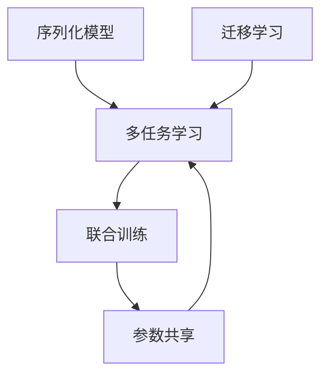

                 

# 多任务学习 原理与代码实例讲解

> 关键词：多任务学习, 联合训练, 参数共享, 序列化模型, 迁移学习, 模型压缩, 应用场景

## 1. 背景介绍

### 1.1 问题由来
近年来，多任务学习(Multitask Learning, MTL)作为一种提升模型泛化能力和利用数据资源的新兴方法，吸引了广泛的关注。在自然语言处理(NLP)领域，多任务学习已经被证明能够显著提高模型的性能，特别是在资源受限、标注数据稀缺的场景下。例如，在文本分类和情感分析等任务上，通过联合训练，多任务模型能够在多个任务间共享知识和参数，从而取得比单任务模型更好的效果。

然而，尽管多任务学习在理论和应用上都有不少突破，但实际应用中的多任务学习仍面临诸多挑战。例如，如何在多个任务间合理分配计算资源和参数共享比例，如何设计合理的任务损失函数和优化策略，如何在保持模型复杂度较低的同时提升泛化能力，这些问题都需要进一步研究。

### 1.2 问题核心关键点
本节将详细介绍多任务学习的核心概念和关键技术，包括：

- 多任务学习的定义和基本原理
- 多任务模型的参数共享策略
- 多任务模型的损失函数设计
- 多任务模型的联合训练算法
- 多任务学习在NLP领域的应用案例

## 2. 核心概念与联系

### 2.1 核心概念概述

为了更好地理解多任务学习，首先需要明确以下几个核心概念：

- 多任务学习：在多个相关任务上共同训练一个共享的模型，通过在多个任务间共享知识，提升模型泛化能力和利用数据资源的技术。
- 联合训练(Shared Training)：将多个任务同时输入模型进行训练，通过优化模型在所有任务上的损失函数，共同更新模型参数。
- 参数共享(Parameter Sharing)：在联合训练中，模型在不同任务间共享部分或全部参数，减少模型的总参数量，提升泛化能力。
- 序列化模型(Sequential Model)：一种特殊的多任务模型，将多个任务的输出连接起来，形成一个序列预测的架构。
- 迁移学习：通过在多个任务上的联合训练，模型可以在一个任务上学习到的知识迁移到另一个相关任务上，提升新任务的性能。

这些概念之间的逻辑关系可以通过以下Mermaid流程图来展示：



这个流程图展示了多任务学习的主要组成部分及其相互关系：

1. 多任务学习作为一个整体过程，通过联合训练实现多个任务的共同优化。
2. 参数共享是联合训练的核心策略，通过减少模型参数量来提升泛化能力。
3. 序列化模型是多任务学习的一种形式，适用于序列化预测任务。
4. 迁移学习是通过多任务学习实现的，可在多个任务间共享知识，提升新任务的性能。

## 3. 核心算法原理 & 具体操作步骤

### 3.1 算法原理概述

多任务学习的基本原理是通过在多个任务上共享模型的知识，提升模型的泛化能力和数据利用率。其主要思想是：通过联合训练的方式，将多个任务共同输入模型，在所有任务上优化同一个损失函数，共同更新模型参数。

设模型 $M_{\theta}$ 在多个任务 $\{T_i\}_{i=1}^N$ 上的预测结果为 $\{y_i = M_{\theta}(x_i)\}_{i=1}^N$，其中 $x_i$ 为输入数据，$\theta$ 为模型参数。多任务学习的目标是最小化所有任务的联合损失函数：

$$
\mathcal{L}(\theta) = \sum_{i=1}^N \ell_i(y_i, M_{\theta}(x_i))
$$

其中 $\ell_i$ 为任务 $T_i$ 的损失函数，可以是交叉熵、均方误差等。通过联合训练，模型能够在多个任务上共享知识，提升泛化能力。

### 3.2 算法步骤详解

多任务学习的具体步骤如下：

**Step 1: 准备数据集和任务**
- 收集多个任务的标注数据集，将数据集按照不同的任务划分。
- 准备任务损失函数 $\ell_i$，如交叉熵、均方误差等。

**Step 2: 设计模型架构**
- 选择一个合适的模型架构，如Transformer、RNN等。
- 设计模型在不同任务上的输出层，如分类器、回归器等。
- 确定模型在不同任务间共享的参数数量，并进行参数初始化。

**Step 3: 设计损失函数和优化器**
- 定义联合损失函数 $\mathcal{L}(\theta)$。
- 选择合适的优化器，如Adam、SGD等，设置学习率、批大小、迭代轮数等。

**Step 4: 联合训练模型**
- 将多个任务的数据集加载到模型中，前向传播计算损失函数。
- 反向传播计算参数梯度，根据设定的优化器更新模型参数。
- 在每个epoch结束时，计算模型在所有任务上的平均损失和准确率。
- 重复上述步骤直至收敛。

**Step 5: 模型评估和应用**
- 在测试集上评估模型在各个任务上的性能，对比单任务模型和多任务模型。
- 使用模型进行序列化预测任务，如机器翻译、对话生成等。
- 针对特定的任务进行进一步的微调，提升模型性能。

以上是多任务学习的基本流程。在实际应用中，还需要根据具体任务的特点，对模型架构、损失函数、优化器等进行优化设计，以进一步提升模型性能。

### 3.3 算法优缺点

多任务学习具有以下优点：

1. 提升泛化能力。通过在多个任务上共享知识，模型能够更好地泛化到新数据和任务上。
2. 降低标注成本。在多任务学习中，每个任务的标注数据可以共享，减少了标注样本的需求。
3. 提高数据利用率。多任务学习能够利用未标注的数据，提升模型训练效率和数据利用率。
4. 提升模型鲁棒性。通过联合训练，模型能够学习到多个任务的共性特征，减少单个任务的过拟合风险。

同时，多任务学习也存在以下缺点：

1. 参数共享复杂。在多个任务间进行参数共享时，需要平衡各任务间的权重，优化复杂。
2. 训练成本高。在联合训练时，需要同时处理多个任务的输入数据，计算成本较高。
3. 任务间数据分布差异。不同任务间的数据分布可能差异较大，难以充分共享知识。
4. 模型复杂度高。在多任务学习中，模型参数量较大，容易出现过拟合现象。
5. 序列化模型风险。序列化模型需要在多个任务之间共享预测结果，容易引入噪音和误差。

尽管存在这些缺点，但多任务学习在实际应用中仍具有显著的优势，特别是在标注数据稀缺和计算资源有限的场景下，能够显著提升模型的性能。

### 3.4 算法应用领域

多任务学习已经在NLP领域得到了广泛的应用，特别是在以下几类任务上：

1. 文本分类：如情感分析、主题分类、意图识别等。通过联合训练，模型可以同时学习多个分类任务，提升整体性能。
2. 命名实体识别：识别文本中的人名、地名、机构名等特定实体。多任务学习能够共享语言知识，提升实体识别的准确率。
3. 关系抽取：从文本中抽取实体之间的语义关系。多任务学习通过联合训练，学习实体-关系三元组，提升抽取效果。
4. 问答系统：对自然语言问题给出答案。多任务学习通过联合训练，学习问答任务的共性特征，提升回答的准确性。
5. 文本摘要：将长文本压缩成简短摘要。多任务学习通过联合训练，学习摘要和原文的关联特征，提升摘要的质量。
6. 对话系统：使机器能够与人自然对话。多任务学习通过联合训练，学习对话生成和理解任务，提升对话系统的智能水平。

除了上述这些经典任务外，多任务学习还被创新性地应用到更多场景中，如可控文本生成、常识推理、代码生成、数据增强等，为NLP技术带来了全新的突破。随着多任务学习的不断进步，相信NLP技术将在更广阔的应用领域大放异彩。

## 4. 数学模型和公式 & 详细讲解  
### 4.1 数学模型构建

本节将使用数学语言对多任务学习的数学模型进行更加严格的刻画。

设模型 $M_{\theta}$ 在多个任务 $\{T_i\}_{i=1}^N$ 上的预测结果为 $\{y_i = M_{\theta}(x_i)\}_{i=1}^N$，其中 $x_i$ 为输入数据，$\theta$ 为模型参数。定义模型 $M_{\theta}$ 在数据样本 $(x_i,y_i)$ 上的损失函数为 $\ell_i(M_{\theta}(x_i),y_i)$，则在数据集 $D=\{(x_i,y_i)\}_{i=1}^N$ 上的联合损失函数为：

$$
\mathcal{L}(\theta) = \frac{1}{N}\sum_{i=1}^N \ell_i(M_{\theta}(x_i),y_i)
$$

通过梯度下降等优化算法，多任务学习的优化目标是最小化联合损失函数，即找到最优参数：

$$
\theta^* = \mathop{\arg\min}_{\theta} \mathcal{L}(\theta)
$$

其中 $\mathcal{L}(\theta)$ 为联合损失函数，可进一步表示为：

$$
\mathcal{L}(\theta) = \frac{1}{N}\sum_{i=1}^N \ell_i(M_{\theta}(x_i),y_i) = \frac{1}{N}\sum_{i=1}^N \ell_i(y_i, M_{\theta}(x_i))
$$

这个公式表示了多任务学习的数学基础，即在多个任务上共同优化一个损失函数，并通过联合训练更新模型参数。

### 4.2 公式推导过程

以下我们以文本分类和命名实体识别为例，推导联合损失函数的计算公式。

假设模型 $M_{\theta}$ 在输入 $x$ 上的输出为 $\hat{y}=M_{\theta}(x)$，表示样本属于类别 $y$ 的概率。分类任务和命名实体识别任务的损失函数分别为：

- 分类任务的损失函数 $\ell_{\text{cls}}$ 为交叉熵损失函数：

$$
\ell_{\text{cls}}(M_{\theta}(x),y) = -\sum_{k=1}^K y_k\log M_{\theta}(x)_k
$$

其中 $K$ 为类别数，$y_k$ 为样本属于第 $k$ 类的标签。

- 命名实体识别任务的损失函数 $\ell_{\text{ner}}$ 为交叉熵损失函数：

$$
\ell_{\text{ner}}(M_{\theta}(x),y) = -\sum_{n=1}^N \sum_{t=1}^L y_{nt}\log M_{\text{ner}}(x)_{nt}
$$

其中 $N$ 为命名实体个数，$L$ 为最大命名实体长度，$y_{nt}$ 为第 $n$ 个命名实体是否属于第 $t$ 个标签，$M_{\text{ner}}(x)_{nt}$ 为第 $n$ 个命名实体是否属于第 $t$ 个标签的预测概率。

将分类任务和命名实体识别任务的损失函数代入联合损失函数，得：

$$
\mathcal{L}(\theta) = \frac{1}{N}\sum_{i=1}^N [\ell_{\text{cls}}(y_i, M_{\theta}(x_i)) + \ell_{\text{ner}}(y_i, M_{\theta}(x_i))]
$$

通过链式法则，损失函数对参数 $\theta_k$ 的梯度为：

$$
\frac{\partial \mathcal{L}(\theta)}{\partial \theta_k} = \frac{1}{N}\sum_{i=1}^N [\frac{\partial \ell_{\text{cls}}(y_i, M_{\theta}(x_i))}{\partial \theta_k} + \frac{\partial \ell_{\text{ner}}(y_i, M_{\theta}(x_i))}{\partial \theta_k}]
$$

其中 $\frac{\partial \ell_{\text{cls}}(y_i, M_{\theta}(x_i))}{\partial \theta_k}$ 和 $\frac{\partial \ell_{\text{ner}}(y_i, M_{\theta}(x_i))}{\partial \theta_k}$ 分别表示分类任务和命名实体识别任务对参数 $\theta_k$ 的梯度，可通过反向传播算法高效计算。

在得到联合损失函数的梯度后，即可带入参数更新公式，完成模型的迭代优化。重复上述过程直至收敛，最终得到适应多个任务的最优模型参数 $\theta^*$。

## 5. 项目实践：代码实例和详细解释说明
### 5.1 开发环境搭建

在进行多任务学习实践前，我们需要准备好开发环境。以下是使用Python进行PyTorch开发的环境配置流程：

1. 安装Anaconda：从官网下载并安装Anaconda，用于创建独立的Python环境。

2. 创建并激活虚拟环境：
```bash
conda create -n pytorch-env python=3.8 
conda activate pytorch-env
```

3. 安装PyTorch：根据CUDA版本，从官网获取对应的安装命令。例如：
```bash
conda install pytorch torchvision torchaudio cudatoolkit=11.1 -c pytorch -c conda-forge
```

4. 安装Transformers库：
```bash
pip install transformers
```

5. 安装各类工具包：
```bash
pip install numpy pandas scikit-learn matplotlib tqdm jupyter notebook ipython
```

完成上述步骤后，即可在`pytorch-env`环境中开始多任务学习实践。

### 5.2 源代码详细实现

下面我们以文本分类和命名实体识别任务为例，给出使用Transformers库对BERT模型进行多任务学习的PyTorch代码实现。

首先，定义多任务数据处理函数：

```python
from transformers import BertTokenizer, BertForSequenceClassification, BertForTokenClassification, AdamW

class MultiTaskDataset(Dataset):
    def __init__(self, texts, labels):
        self.texts = texts
        self.labels = labels
        self.tokenizer = BertTokenizer.from_pretrained('bert-base-cased')
        
    def __len__(self):
        return len(self.texts)
    
    def __getitem__(self, item):
        text = self.texts[item]
        labels = self.labels[item]
        
        encoding = self.tokenizer(text, return_tensors='pt', max_length=128, padding='max_length', truncation=True)
        input_ids = encoding['input_ids'][0]
        attention_mask = encoding['attention_mask'][0]
        
        # 对token-wise的标签进行编码
        encoded_labels = [label2id[label] for label in labels] 
        encoded_labels.extend([label2id['O']] * (self.max_len - len(encoded_labels)))
        labels = torch.tensor(encoded_labels, dtype=torch.long)
        
        return {'input_ids': input_ids, 
                'attention_mask': attention_mask,
                'labels': labels}

# 标签与id的映射
cls2id = {'O': 0, 'B-PER': 1, 'I-PER': 2, 'B-ORG': 3, 'I-ORG': 4, 'B-LOC': 5, 'I-LOC': 6}
id2cls = {v: k for k, v in cls2id.items()}

# 创建dataset
tokenizer = BertTokenizer.from_pretrained('bert-base-cased')

train_dataset = MultiTaskDataset(train_texts, train_labels)
dev_dataset = MultiTaskDataset(dev_texts, dev_labels)
test_dataset = MultiTaskDataset(test_texts, test_labels)
```

然后，定义模型和优化器：

```python
from transformers import BertForSequenceClassification, BertForTokenClassification, AdamW

model = BertForSequenceClassification.from_pretrained('bert-base-cased', num_labels=len(cls2id))
model.add_module('ner', BertForTokenClassification.from_pretrained('bert-base-cased', num_labels=len(cls2id)))

optimizer = AdamW(model.parameters(), lr=2e-5)
```

接着，定义训练和评估函数：

```python
from torch.utils.data import DataLoader
from tqdm import tqdm
from sklearn.metrics import classification_report

device = torch.device('cuda') if torch.cuda.is_available() else torch.device('cpu')
model.to(device)

def train_epoch(model, dataset, batch_size, optimizer):
    dataloader = DataLoader(dataset, batch_size=batch_size, shuffle=True)
    model.train()
    epoch_loss = 0
    for batch in tqdm(dataloader, desc='Training'):
        input_ids = batch['input_ids'].to(device)
        attention_mask = batch['attention_mask'].to(device)
        labels = batch['labels'].to(device)
        model.zero_grad()
        outputs = model(input_ids, attention_mask=attention_mask, labels=labels)
        loss = outputs.loss
        epoch_loss += loss.item()
        loss.backward()
        optimizer.step()
    return epoch_loss / len(dataloader)

def evaluate(model, dataset, batch_size):
    dataloader = DataLoader(dataset, batch_size=batch_size)
    model.eval()
    preds, labels = [], []
    with torch.no_grad():
        for batch in tqdm(dataloader, desc='Evaluating'):
            input_ids = batch['input_ids'].to(device)
            attention_mask = batch['attention_mask'].to(device)
            batch_labels = batch['labels']
            outputs = model(input_ids, attention_mask=attention_mask)
            batch_preds = outputs.logits.argmax(dim=2).to('cpu').tolist()
            batch_labels = batch_labels.to('cpu').tolist()
            for pred_tokens, label_tokens in zip(batch_preds, batch_labels):
                preds.append(pred_tokens[:len(label_tokens)])
                labels.append(label_tokens)
                
    print(classification_report(labels, preds))
```

最后，启动训练流程并在测试集上评估：

```python
epochs = 5
batch_size = 16

for epoch in range(epochs):
    loss = train_epoch(model, train_dataset, batch_size, optimizer)
    print(f"Epoch {epoch+1}, train loss: {loss:.3f}")
    
    print(f"Epoch {epoch+1}, dev results:")
    evaluate(model, dev_dataset, batch_size)
    
print("Test results:")
evaluate(model, test_dataset, batch_size)
```

以上就是使用PyTorch对BERT模型进行多任务学习的完整代码实现。可以看到，得益于Transformers库的强大封装，我们仅需简洁的代码即可实现多任务学习模型的训练和评估。

### 5.3 代码解读与分析

让我们再详细解读一下关键代码的实现细节：

**MultiTaskDataset类**：
- `__init__`方法：初始化文本、标签、分词器等关键组件。
- `__len__`方法：返回数据集的样本数量。
- `__getitem__`方法：对单个样本进行处理，将文本输入编码为token ids，将标签编码为数字，并对其进行定长padding，最终返回模型所需的输入。

**cls2id和id2cls字典**：
- 定义了分类标签与数字id之间的映射关系，用于将token-wise的预测结果解码回真实的分类标签。

**训练和评估函数**：
- 使用PyTorch的DataLoader对数据集进行批次化加载，供模型训练和推理使用。
- 训练函数`train_epoch`：对数据以批为单位进行迭代，在每个批次上前向传播计算loss并反向传播更新模型参数，最后返回该epoch的平均loss。
- 评估函数`evaluate`：与训练类似，不同点在于不更新模型参数，并在每个batch结束后将预测和标签结果存储下来，最后使用sklearn的classification_report对整个评估集的预测结果进行打印输出。

**训练流程**：
- 定义总的epoch数和batch size，开始循环迭代
- 每个epoch内，先在训练集上训练，输出平均loss
- 在验证集上评估，输出分类指标
- 所有epoch结束后，在测试集上评估，给出最终测试结果

可以看到，PyTorch配合Transformers库使得多任务学习的代码实现变得简洁高效。开发者可以将更多精力放在数据处理、模型改进等高层逻辑上，而不必过多关注底层的实现细节。

当然，工业级的系统实现还需考虑更多因素，如模型的保存和部署、超参数的自动搜索、更灵活的任务适配层等。但核心的联合训练和多任务学习原理基本与此类似。

## 6. 实际应用场景
### 6.1 智能客服系统

基于多任务学习的对话技术，可以广泛应用于智能客服系统的构建。传统客服往往需要配备大量人力，高峰期响应缓慢，且一致性和专业性难以保证。而使用多任务学习的对话模型，可以7x24小时不间断服务，快速响应客户咨询，用自然流畅的语言解答各类常见问题。

在技术实现上，可以收集企业内部的历史客服对话记录，将问题和最佳答复构建成监督数据，在此基础上对预训练对话模型进行多任务学习。多任务学习后的对话模型能够自动理解用户意图，匹配最合适的答案模板进行回复。对于客户提出的新问题，还可以接入检索系统实时搜索相关内容，动态组织生成回答。如此构建的智能客服系统，能大幅提升客户咨询体验和问题解决效率。

### 6.2 金融舆情监测

金融机构需要实时监测市场舆论动向，以便及时应对负面信息传播，规避金融风险。传统的人工监测方式成本高、效率低，难以应对网络时代海量信息爆发的挑战。基于多任务学习的文本分类和情感分析技术，为金融舆情监测提供了新的解决方案。

具体而言，可以收集金融领域相关的新闻、报道、评论等文本数据，并对其进行主题标注和情感标注。在此基础上对预训练语言模型进行多任务学习，使其能够自动判断文本属于何种主题，情感倾向是正面、中性还是负面。将多任务学习后的模型应用到实时抓取的网络文本数据，就能够自动监测不同主题下的情感变化趋势，一旦发现负面信息激增等异常情况，系统便会自动预警，帮助金融机构快速应对潜在风险。

### 6.3 个性化推荐系统

当前的推荐系统往往只依赖用户的历史行为数据进行物品推荐，无法深入理解用户的真实兴趣偏好。基于多任务学习的多任务推荐系统可以更好地挖掘用户行为背后的语义信息，从而提供更精准、多样的推荐内容。

在实践中，可以收集用户浏览、点击、评论、分享等行为数据，提取和用户交互的物品标题、描述、标签等文本内容。将文本内容作为模型输入，用户的后续行为（如是否点击、购买等）作为监督信号，在此基础上对预训练语言模型进行多任务学习。多任务学习后的模型能够从文本内容中准确把握用户的兴趣点。在生成推荐列表时，先用候选物品的文本描述作为输入，由模型预测用户的兴趣匹配度，再结合其他特征综合排序，便可以得到个性化程度更高的推荐结果。

### 6.4 未来应用展望

随着多任务学习的不断进步，在NLP领域的应用场景将越来越广泛。以下几类任务将可能得到更多应用：

1. 机器翻译：多任务学习可以联合训练多个语言翻译任务，提升翻译质量和泛化能力。
2. 问答系统：通过多任务学习，问答系统可以同时学习问答生成和理解任务，提升回答的准确性和多样性。
3. 情感分析：多任务学习可以联合训练情感分类和情感抽取任务，提升情感分析的准确性和鲁棒性。
4. 知识图谱构建：通过多任务学习，模型可以联合学习实体抽取、关系抽取和知识推理任务，构建更加全面、准确的知识图谱。
5. 多模态融合：多任务学习可以联合处理图像、语音、文本等多模态数据，提升跨模态数据融合的效果。
6. 可控文本生成：通过多任务学习，模型可以同时学习文本生成和文本摘要任务，生成可控的文本摘要。

除了这些经典任务外，多任务学习还被创新性地应用到更多场景中，如文本摘要生成、对话生成、知识图谱推理等，为NLP技术带来了全新的突破。随着多任务学习的不断进步，相信NLP技术将在更广阔的应用领域大放异彩。

## 7. 工具和资源推荐
### 7.1 学习资源推荐

为了帮助开发者系统掌握多任务学习的理论基础和实践技巧，这里推荐一些优质的学习资源：

1. 《Multitask Learning in Deep Learning》系列博文：由大模型技术专家撰写，深入浅出地介绍了多任务学习的基本原理、实践方法和最新研究进展。

2. CS231n《卷积神经网络》课程：斯坦福大学开设的经典课程，涵盖深度学习基础和模型设计，对多任务学习也有详细讲解。

3. 《Deep Learning with Python》书籍：深度学习经典教材，介绍了多任务学习的基本概念和应用场景，适合入门读者。

4. arXiv上的相关论文：最新的多任务学习论文，涵盖了从基础原理到应用实践的广泛内容，是了解前沿动态的好资源。

5. Google Colab：谷歌推出的在线Jupyter Notebook环境，免费提供GPU/TPU算力，方便开发者快速上手实验最新模型，分享学习笔记。

通过对这些资源的学习实践，相信你一定能够快速掌握多任务学习的精髓，并用于解决实际的NLP问题。
###  7.2 开发工具推荐

高效的开发离不开优秀的工具支持。以下是几款用于多任务学习开发的常用工具：

1. PyTorch：基于Python的开源深度学习框架，灵活动态的计算图，适合快速迭代研究。大部分预训练语言模型都有PyTorch版本的实现。

2. TensorFlow：由Google主导开发的开源深度学习框架，生产部署方便，适合大规模工程应用。同样有丰富的预训练语言模型资源。

3. Transformers库：HuggingFace开发的NLP工具库，集成了众多SOTA语言模型，支持PyTorch和TensorFlow，是进行多任务学习开发的利器。

4. Weights & Biases：模型训练的实验跟踪工具，可以记录和可视化模型训练过程中的各项指标，方便对比和调优。与主流深度学习框架无缝集成。

5. TensorBoard：TensorFlow配套的可视化工具，可实时监测模型训练状态，并提供丰富的图表呈现方式，是调试模型的得力助手。

6. Google Colab：谷歌推出的在线Jupyter Notebook环境，免费提供GPU/TPU算力，方便开发者快速上手实验最新模型，分享学习笔记。

合理利用这些工具，可以显著提升多任务学习的开发效率，加快创新迭代的步伐。

### 7.3 相关论文推荐

多任务学习在NLP领域已经取得了诸多突破，以下是几篇奠基性的相关论文，推荐阅读：

1. Multitask Learning with Multi-Task Loss: A New Framework for Structuring Multitask Learning（多任务学习框架）：提出多任务学习的损失函数设计，为多任务学习提供基础理论。

2. Learning Multiple Tasks with Joint Objective：提出多任务学习的联合优化策略，探讨参数共享和任务权重问题。

3. Transformer-XL: Attentive Language Models Beyond a Fixed-Length Context（Transformer-XL）：提出多任务学习在序列化预测任务中的应用，提升了模型的长期记忆能力。

4. Multi-Task Sequence-to-Sequence Learning via Sequence-Level Training（多序列到序列学习）：提出多任务学习的联合优化策略，应用于文本生成任务。

5. Mixture-of-Experts for Multilingual Multitask Learning（多语言多任务学习）：提出多任务学习的多专家融合策略，提升了多语言文本处理的泛化能力。

这些论文代表了大任务学习的进展脉络。通过学习这些前沿成果，可以帮助研究者把握学科前进方向，激发更多的创新灵感。

## 8. 总结：未来发展趋势与挑战

### 8.1 总结

本文对多任务学习的核心概念和关键技术进行了全面系统的介绍。首先阐述了多任务学习的定义、基本原理和应用场景，明确了多任务学习在提升模型泛化能力和数据利用率方面的独特价值。其次，从原理到实践，详细讲解了多任务学习的数学模型和关键步骤，给出了多任务学习任务开发的完整代码实例。同时，本文还探讨了多任务学习在多个NLP任务中的应用案例，展示了多任务学习方法的广泛应用前景。

通过本文的系统梳理，可以看到，多任务学习作为提升模型泛化能力的重要手段，在实际应用中已经取得了显著的效果。多任务学习能够通过联合训练和参数共享，充分利用数据资源，提升模型的泛化能力和数据利用率，从而在标注数据稀缺和计算资源有限的场景下，依然能够获得理想的模型性能。未来，随着多任务学习的不断进步，相信其在NLP领域的落地应用将会越来越广泛，为智能系统的智能水平提升带来更多可能性。

### 8.2 未来发展趋势

展望未来，多任务学习将呈现以下几个发展趋势：

1. 多任务学习的应用场景将更加广泛。随着多任务学习的不断演进，其应用领域将从NLP扩展到更多的领域，如计算机视觉、语音识别、推荐系统等，带来新的突破。

2. 多任务学习的联合训练策略将更加多样。未来将出现更多参数共享、任务权重优化的方法，提升多任务学习的效率和性能。

3. 多任务学习的模型结构将更加灵活。未来将出现更多适应多任务学习需求的新模型架构，如Transformer-XL、PlugNet等，提升多任务学习的效果。

4. 多任务学习的分布式训练将更加高效。未来将出现更多适应大规模多任务学习任务分布式训练方法，如Horovod、MesonNest等，提升多任务学习的训练效率。

5. 多任务学习的可解释性将更加增强。未来将出现更多多任务学习的可解释性方法和工具，帮助用户更好地理解和调试多任务学习模型。

6. 多任务学习的迁移学习能力将更加提升。未来将出现更多多任务学习的迁移学习方法，通过多任务学习提升新任务的性能。

以上趋势凸显了多任务学习在智能系统中的重要地位。这些方向的探索发展，必将进一步提升多任务学习的效能，为智能系统的智能水平提升带来更多可能性。

### 8.3 面临的挑战

尽管多任务学习已经取得了显著进展，但在实际应用中仍面临诸多挑战：

1. 数据分布差异：不同任务间的数据分布可能差异较大，难以充分共享知识。

2. 任务间冲突：不同任务间可能存在冲突，难以共同优化。

3. 超参数调优：多任务学习需要平衡多个任务之间的权重，调整超参数难度较大。

4. 计算成本高：多任务学习需要在多个任务间进行联合训练，计算成本较高。

5. 可解释性不足：多任务学习模型通常较为复杂，难以解释其内部工作机制。

尽管存在这些挑战，但多任务学习在实际应用中仍具有显著的优势，特别是在标注数据稀缺和计算资源有限的场景下，能够显著提升模型的性能。

### 8.4 研究展望

面对多任务学习面临的挑战，未来的研究需要在以下几个方面寻求新的突破：

1. 探索更高效的数据分布方法。通过数据增强、数据迁移等方法，提升多任务学习的数据分布效果。

2. 引入更多先验知识。将符号化的先验知识，如知识图谱、逻辑规则等，与神经网络模型进行巧妙融合，引导多任务学习过程学习更准确、合理的语言模型。

3. 融合因果分析和博弈论工具。将因果分析方法引入多任务学习，识别出模型决策的关键特征，增强输出解释的因果性和逻辑性。借助博弈论工具刻画人机交互过程，主动探索并规避模型的脆弱点，提高系统稳定性。

4. 纳入伦理道德约束。在多任务学习模型的训练目标中引入伦理导向的评估指标，过滤和惩罚有偏见、有害的输出倾向。同时加强人工干预和审核，建立模型行为的监管机制，确保输出符合人类价值观和伦理道德。

这些研究方向的探索，必将引领多任务学习走向更高的台阶，为智能系统的智能水平提升带来更多可能性。面向未来，多任务学习需要与其他人工智能技术进行更深入的融合，如知识表示、因果推理、强化学习等，多路径协同发力，共同推动智能系统的进步。只有勇于创新、敢于突破，才能不断拓展多任务学习边界，让智能技术更好地造福人类社会。

## 9. 附录：常见问题与解答

**Q1：多任务学习是否适用于所有NLP任务？**

A: 多任务学习在大多数NLP任务上都能取得不错的效果，特别是对于数据量较小的任务。但对于一些特定领域的任务，如医学、法律等，仅依靠通用语料预训练的模型可能难以很好地适应。此时需要在特定领域语料上进一步预训练，再进行多任务学习，才能获得理想效果。此外，对于一些需要时效性、个性化很强的任务，如对话、推荐等，多任务学习方法也需要针对性的改进优化。

**Q2：如何选择合适的多任务学习损失函数？**

A: 多任务学习的损失函数设计需要考虑多个任务的关联性和权重。常见的损失函数包括交叉熵、均方误差等。可以选择不同的损失函数进行实验对比，选择最优的损失函数。同时，可以引入任务权重调节参数，平衡不同任务之间的贡献，提升整体性能。

**Q3：多任务学习中的参数共享策略有哪些？**

A: 多任务学习中的参数共享策略主要分为两种：

1. 固定权重参数共享：将模型的所有参数固定，只对任务特定的输出层进行微调。
2. 自适应权重参数共享：根据不同任务的权重，动态调整模型参数的共享比例。例如，可以通过注意力机制学习任务之间的权重，自适应地调整共享参数。

**Q4：多任务学习在训练过程中如何处理计算资源分配？**

A: 在多任务学习中，计算资源的分配需要平衡多个任务之间的计算成本和参数共享策略。通常采用以下方法：

1. 设置合适的超参数，如学习率、批大小、迭代轮数等，控制每个任务的计算资源。
2. 引入任务权重调节参数，平衡不同任务之间的计算资源分配。
3. 采用分布式训练方法，如Horovod、MesonNest等，提升多任务学习的训练效率。

**Q5：多任务学习中的模型压缩和稀疏化方法有哪些？**

A: 在多任务学习中，模型压缩和稀疏化方法可以降低模型参数量，提升推理速度。常用的方法包括：

1. 权重剪枝：通过剪枝方法去除冗余权重，减小模型尺寸。
2. 量化压缩：将浮点模型转为定点模型，减少存储空间和计算量。
3. 稀疏化存储：采用稀疏矩阵等方法，存储模型参数，减少存储空间。

这些方法能够有效提升多任务学习的模型效率，降低计算成本。

