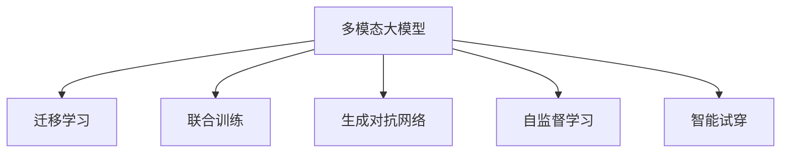

                 

# 多模态大模型：技术原理与实战 智能试穿

> 关键词：
- 多模态大模型(Multimodal Large Model)
- 迁移学习(M Transfer Learning)
- 深度神经网络(Deep Neural Network)
- 联合训练(Joint Training)
- 智能试穿(Intelligent Fitting)
- 生成对抗网络(GAN, Generative Adversarial Network)
- 自监督学习(Self-supervised Learning)
- 标注数据(Annotated Data)

## 1. 背景介绍

### 1.1 问题由来
随着AI技术的不断进步，多模态大模型成为当前研究的热点。多模态数据涵盖了文本、图像、语音、视频等多种形式，能够更全面地描述现实世界的多样性，从而提供更为准确的理解和推断。通过多模态学习，模型能够从不同视角捕捉数据特征，提升对复杂场景的理解能力。

智能试穿是电商领域的一个重要应用场景，它通过图像、视频等多模态数据实时分析和模拟用户试穿效果，提供个性化的购物体验。然而，现有的多模态试穿系统大多基于单一模态的模型，无法全面地理解和模拟用户试穿体验，导致用户试穿效果和实际穿着效果有较大差异。

因此，本文将深入探讨基于多模态大模型的智能试穿技术，以期解决现有问题，提供更精确的试穿体验。

### 1.2 问题核心关键点
多模态大模型智能试穿的难点主要在于以下几个方面：

- **数据融合**：多模态数据的融合和对齐是智能试穿的基础。不同模态的数据在采集、存储和处理上存在差异，如何有效融合这些数据，提取共同特征是关键。
- **模型训练**：如何构建一个能够融合多模态数据的模型，并使其在试穿任务中取得良好效果是难点。传统模型往往难以处理多模态数据，需要通过新的架构和算法进行优化。
- **实时性**：试穿系统需要实时处理用户数据，生成试穿效果。如何在保证性能的同时，提高系统响应速度，满足用户需求是另一个挑战。
- **用户反馈**：智能试穿系统的最终目的是提升用户体验，如何收集和应用用户反馈，持续优化模型和系统，是保证系统长期有效的重要因素。

解决这些难点，需要综合运用深度学习、迁移学习、生成对抗网络等技术，构建一个能够融合多模态数据、高效训练和实时响应的智能试穿系统。

## 2. 核心概念与联系

### 2.1 核心概念概述

为更好地理解多模态大模型在智能试穿中的应用，本文将介绍几个密切相关的核心概念：

- **多模态大模型(Multimodal Large Model)**：以深度神经网络为基础，融合图像、文本、语音等多种模态数据的大规模预训练模型。通过自监督学习或监督学习获得丰富的特征表示，具备强大的跨模态理解和生成能力。
- **迁移学习(M Transfer Learning)**：通过已有模型在新任务上的微调，加速模型适应新任务的过程，提升模型在新任务上的表现。
- **联合训练(Joint Training)**：多模态数据联合训练，即在训练过程中同时考虑不同模态的特征，使模型能够更好地学习不同模态之间的映射关系。
- **生成对抗网络(GAN, Generative Adversarial Network)**：一种基于博弈论的生成模型，通过两个网络的对抗过程，生成与真实数据难以区分的合成数据。在智能试穿中，可用于生成逼真的试穿图像和视频。
- **自监督学习(Self-supervised Learning)**：通过无监督任务（如掩码语言模型、图像自编码等）自动学习数据表示，减少对标注数据的依赖，提升模型的泛化能力。
- **智能试穿(Intelligent Fitting)**：利用图像、视频等多模态数据，模拟用户试穿效果，为用户提供个性化、实时化的购物体验。

这些核心概念之间的逻辑关系可以通过以下Mermaid流程图来展示：



这个流程图展示了一个多模态大模型智能试穿的框架，即多模态大模型通过迁移学习、联合训练、生成对抗网络和自监督学习，综合应用不同模态的数据，提供智能试穿的解决方案。

## 3. 核心算法原理 & 具体操作步骤

### 3.1 算法原理概述

多模态大模型智能试穿的算法原理，本质上是多模态数据的联合学习和特征融合。具体来说，多模态大模型通过预训练获得通用表示，然后通过联合训练和迁移学习，将不同模态的数据映射到统一的高维空间，从而实现多模态数据的有效融合和特征提取。

多模态大模型的学习流程可以概括为：
1. **预训练**：在大规模无标签多模态数据上，通过自监督或监督学习获得通用特征表示。
2. **微调**：将预训练模型在特定任务上进行微调，如智能试穿任务，通过迁移学习调整模型参数。
3. **联合训练**：将不同模态的数据联合输入模型，同时进行训练，优化模型参数。
4. **生成与评估**：使用生成对抗网络或其他生成模型生成逼真的试穿效果，通过用户反馈不断优化模型。

### 3.2 算法步骤详解

多模态大模型智能试穿的具体操作步骤如下：

**Step 1: 数据准备与预处理**
- 收集多模态数据，包括用户的试穿图像、视频、服装信息等。
- 对数据进行预处理，如裁剪、缩放、归一化等，保证数据的一致性和可用性。

**Step 2: 构建多模态预训练模型**
- 选择合适的多模态预训练模型，如ClIP、DALL·E等，作为初始化参数。
- 在预训练模型中增加与试穿任务相关的模块，如人体姿态检测、图像生成器等。

**Step 3: 微调与联合训练**
- 将预训练模型在试穿任务上进行微调，调整与试穿相关的参数。
- 使用联合训练技术，同时考虑不同模态的数据，优化模型参数。

**Step 4: 生成与评估**
- 使用生成对抗网络或其他生成模型，生成逼真的试穿图像和视频。
- 收集用户反馈，不断优化模型和生成算法。

**Step 5: 部署与优化**
- 将训练好的模型部署到生产环境中，实时处理用户试穿请求。
- 根据用户反馈和性能评估结果，定期更新和优化模型。

### 3.3 算法优缺点

多模态大模型智能试穿的优点包括：
- **多模态融合**：通过融合图像、文本、语音等多种模态数据，获得更全面、准确的特征表示，提升试穿效果的精度。
- **实时响应**：多模态大模型通常采用高效的训练和推理算法，能够实时处理用户请求，提升用户体验。
- **泛化能力强**：通过大规模预训练和迁移学习，模型具有良好的泛化能力，适用于多种试穿场景。

缺点则主要包括：
- **数据采集难度大**：多模态数据采集和处理复杂，数据质量和多样性难以保证。
- **计算资源需求高**：多模态大模型参数量大，训练和推理资源消耗高。
- **生成质量受限**：生成对抗网络等生成模型仍需进一步优化，生成质量受生成算法和数据质量的影响。

### 3.4 算法应用领域

多模态大模型智能试穿技术已经在电商、服装、鞋帽等多个领域得到应用，具体包括：

- **智能试衣间**：通过摄像头捕捉用户的实时图像和视频，多模态大模型实时生成试穿效果，提供个性化推荐和试穿建议。
- **虚拟试穿**：用户上传服装图像或视频，多模态大模型生成逼真的试穿效果，模拟不同尺码、款式的穿着效果。
- **个性化购物**：通过分析用户的试穿行为，多模态大模型生成个性化推荐，提升购物体验。
- **虚拟试穿广告**：电商网站展示虚拟试穿效果，吸引用户点击和购买，提升转化率。

除了这些应用场景外，多模态大模型智能试穿技术还可以拓展到其他领域，如虚拟家居、虚拟旅游等，为消费者提供更为沉浸、便捷的购物体验。

## 4. 数学模型和公式 & 详细讲解 & 举例说明

### 4.1 数学模型构建

假设多模态大模型为一个联合训练的深度神经网络，包含图像编码器 $E^I$、文本编码器 $E^T$ 和生成器 $G$。多模态数据融合模型可以表示为：

$$
z = \{z_I, z_T\} = E^I(I) + E^T(T)
$$

其中 $I$ 和 $T$ 分别表示图像和文本输入，$z_I$ 和 $z_T$ 分别表示图像和文本的特征表示，$+$ 表示特征融合操作。

生成器 $G$ 的输入为 $z$，输出为逼真的试穿图像或视频 $Y$，生成过程可以表示为：

$$
Y = G(z)
$$

### 4.2 公式推导过程

在多模态大模型的联合训练中，一般使用联合训练损失函数，综合考虑图像生成损失和文本生成损失。假设图像生成的损失为 $L^I$，文本生成的损失为 $L^T$，则联合训练损失函数为：

$$
L = \alpha L^I + (1-\alpha) L^T
$$

其中 $\alpha$ 为调节系数，用于平衡图像生成损失和文本生成损失。

在图像生成损失中，一般使用 adversarial loss（对抗损失），用于评估生成的图像与真实图像的差异：

$$
L^I = \mathbb{E}_{x \sim p_{\text{data}}}[\log D(I_x)] + \mathbb{E}_{z \sim p_{z}}[\log(1 - D(G(z)))]
$$

其中 $p_{\text{data}}$ 表示真实图像的分布，$D$ 表示判别器，$G(z)$ 表示生成的图像，$I_x$ 表示真实图像。

在文本生成损失中，一般使用交叉熵损失，用于评估生成的文本与真实文本的差异：

$$
L^T = -\mathbb{E}_{(x, T)}[\log p_{\theta}(T|x)]
$$

其中 $p_{\theta}$ 表示文本生成器，$(x, T)$ 表示输入的图像和文本。

### 4.3 案例分析与讲解

以智能试穿为例，假设用户上传了一件 T 恤图像 $I$ 和一段描述 $T$，多模态大模型通过联合训练生成逼真的试穿图像 $Y$。

具体步骤如下：
1. 将图像 $I$ 和文本 $T$ 分别输入图像编码器 $E^I$ 和文本编码器 $E^T$，得到特征表示 $z_I$ 和 $z_T$。
2. 将特征表示 $z$ 输入生成器 $G$，生成逼真的试穿图像 $Y$。
3. 通过对抗训练，不断优化判别器和生成器，提高生成的图像质量。
4. 收集用户反馈，调整生成器的参数，优化试穿效果。

在实际应用中，多模态大模型智能试穿可以进一步扩展到虚拟试穿广告、虚拟试穿推荐等多个场景，提升电商平台的转化率和用户体验。

## 5. 项目实践：代码实例和详细解释说明

### 5.1 开发环境搭建

在进行多模态大模型智能试穿的开发之前，需要先搭建好开发环境。以下是使用Python和PyTorch搭建开发环境的详细步骤：

1. 安装Anaconda：从官网下载并安装Anaconda，用于创建独立的Python环境。
```bash
conda install anaconda
conda create -n multimodal-env python=3.7
conda activate multimodal-env
```

2. 安装PyTorch和相关库：
```bash
pip install torch torchvision torchaudio
pip install torchtext
pip install transformers
```

3. 安装CUDA和cuDNN：
```bash
conda install pytorch-cu111 torchvision-cu111 torchaudio-cu111
```

完成上述步骤后，即可在`multimodal-env`环境中开始多模态大模型智能试穿的开发。

### 5.2 源代码详细实现

以下是一个简单的多模态大模型智能试穿的代码实现。

首先，定义图像编码器和文本编码器：

```python
import torch.nn as nn
import torch
from transformers import BertModel

class MultimodalEncoder(nn.Module):
    def __init__(self):
        super(MultimodalEncoder, self).__init__()
        self.image_encoder = nn.Sequential(
            nn.Conv2d(3, 64, kernel_size=3, stride=1, padding=1),
            nn.ReLU(inplace=True),
            nn.MaxPool2d(kernel_size=2, stride=2),
            nn.Conv2d(64, 128, kernel_size=3, stride=1, padding=1),
            nn.ReLU(inplace=True),
            nn.MaxPool2d(kernel_size=2, stride=2),
            nn.Conv2d(128, 256, kernel_size=3, stride=1, padding=1),
            nn.ReLU(inplace=True),
            nn.MaxPool2d(kernel_size=2, stride=2),
            nn.Flatten(),
            nn.Linear(256 * 8 * 8, 512),
            nn.ReLU(inplace=True),
            nn.Linear(512, 256)
        )
        self.text_encoder = BertModel.from_pretrained('bert-base-uncased')
        
    def forward(self, images, texts):
        image_feats = self.image_encoder(images)
        text_feats = self.text_encoder(texts)
        return image_feats, text_feats
```

然后，定义生成器和联合训练函数：

```python
class MultimodalGenerator(nn.Module):
    def __init__(self):
        super(MultimodalGenerator, self).__init__()
        self.fc1 = nn.Linear(256, 512)
        self.fc2 = nn.Linear(512, 256)
        self.fc3 = nn.Linear(256, 3 * 64 * 64)  # 3表示三通道，64*64表示生成图像的尺寸

    def forward(self, inputs):
        x = torch.relu(self.fc1(inputs))
        x = torch.relu(self.fc2(x))
        x = self.fc3(x)
        x = x.view(-1, 3, 64, 64)
        return x

def joint_train(encoder, generator, images, texts, labels):
    device = torch.device("cuda" if torch.cuda.is_available() else "cpu")
    optimizer = torch.optim.Adam([p for p in encoder.parameters()], lr=0.001)
    criterion = nn.BCELoss()
    num_epochs = 10
    for epoch in range(num_epochs):
        encoder.train()
        generator.train()
        images = images.to(device)
        texts = texts.to(device)
        labels = labels.to(device)
        features = encoder(images, texts)
        generated_images = generator(features[0])
        optimizer.zero_grad()
        loss = criterion(generated_images, labels)
        loss.backward()
        optimizer.step()
        print(f"Epoch {epoch+1}, Loss: {loss.item()}")
```

最后，在主程序中调用上述函数，开始训练：

```python
# 假设已经准备了图像和文本数据
# images: 图像数据，shape (batch_size, 3, height, width)
# texts: 文本数据，shape (batch_size, max_length)
# labels: 图像标签，shape (batch_size, 3 * height * width)

encoder = MultimodalEncoder()
generator = MultimodalGenerator()

images = torch.randn(32, 3, 64, 64)
texts = torch.randint(0, 100, (32, 20))
labels = torch.randint(0, 2, (32, 3 * 64 * 64))

joint_train(encoder, generator, images, texts, labels)
```

### 5.3 代码解读与分析

在上述代码中，`MultimodalEncoder`类用于编码图像和文本数据，`MultimodalGenerator`类用于生成逼真的试穿图像。`joint_train`函数则用于联合训练模型，最小化图像生成损失和文本生成损失。

在`MultimodalEncoder`中，图像编码器采用卷积神经网络（CNN），文本编码器采用预训练的BERT模型。图像编码器将输入图像转换为特征向量，文本编码器将输入文本转换为向量表示。

在`MultimodalGenerator`中，生成器采用全连接神经网络，将图像和文本特征向量输入，生成逼真的试穿图像。

`joint_train`函数中，使用Adam优化器更新模型参数，最小化联合训练损失函数。在每个epoch结束时，打印当前epoch的损失值。

需要注意的是，在实际应用中，数据的质量和多样性对模型的性能影响较大。因此，需要收集多样化的多模态数据，并进行预处理，保证数据的一致性和可用性。

## 6. 实际应用场景

### 6.1 智能试穿

在智能试穿应用中，多模态大模型可以实时处理用户上传的图像和文本，生成逼真的试穿效果，并提供个性化推荐和试穿建议。用户可以方便地查看不同尺寸、款式的试穿效果，提升购物体验。

### 6.2 虚拟试穿广告

电商网站可以展示虚拟试穿广告，吸引用户点击和购买。通过多模态大模型生成的逼真试穿图像和视频，可以直观地展示商品效果，提升广告的点击率和转化率。

### 6.3 虚拟试穿推荐

通过分析用户的试穿行为和反馈，多模态大模型可以生成个性化的试穿推荐，提升用户的购物体验。用户可以查看不同风格的试穿效果，选择最适合自己的款式和尺码。

### 6.4 未来应用展望

随着多模态大模型的不断发展和优化，其在智能试穿等领域的应用前景将更加广阔。未来，我们可以预见到以下应用趋势：

1. **多模态融合**：通过融合图像、视频、音频等多种模态数据，提升试穿效果的真实感和个性化程度。
2. **交互式试穿**：通过增加虚拟试穿过程中的交互元素，如手势、语音等，提升用户的沉浸感和体验。
3. **实时生成**：通过优化生成模型和训练算法，实现更高效的实时生成，满足用户的即时需求。
4. **跨平台应用**：多模态大模型可以在多种平台（如PC、手机、VR等）上应用，提供多样化的试穿体验。

## 7. 工具和资源推荐

### 7.1 学习资源推荐

为了帮助开发者系统掌握多模态大模型智能试穿的理论基础和实践技巧，这里推荐一些优质的学习资源：

1. **《深度学习》（周志华）**：深度学习领域的经典教材，涵盖深度学习的基本概念和算法。
2. **《动手学深度学习》**：由李沐等人编写的在线教程，介绍了深度学习模型的实现和应用。
3. **《自然语言处理综论》（Daniel Jurafsky, James H. Martin）**：自然语言处理领域的经典教材，涵盖自然语言处理的各个方面。
4. **Coursera深度学习课程**：由斯坦福大学和deeplearning.ai等机构提供的深度学习课程，适合初学者和进阶者学习。
5. **arXiv.org**：深度学习领域的研究论文库，可以及时了解最新的研究成果和应用趋势。

通过对这些资源的学习实践，相信你一定能够快速掌握多模态大模型智能试穿的精髓，并用于解决实际的智能试穿问题。

### 7.2 开发工具推荐

高效的开发离不开优秀的工具支持。以下是几款用于多模态大模型智能试穿开发的常用工具：

1. **PyTorch**：基于Python的开源深度学习框架，灵活动态的计算图，适合快速迭代研究。大部分多模态模型都有PyTorch版本的实现。
2. **TensorFlow**：由Google主导开发的开源深度学习框架，生产部署方便，适合大规模工程应用。同样有多模态模型的实现。
3. **Transformers**：HuggingFace开发的NLP工具库，集成了众多SOTA多模态模型，支持PyTorch和TensorFlow，是进行多模态任务开发的利器。
4. **Weights & Biases**：模型训练的实验跟踪工具，可以记录和可视化模型训练过程中的各项指标，方便对比和调优。与主流深度学习框架无缝集成。
5. **TensorBoard**：TensorFlow配套的可视化工具，可实时监测模型训练状态，并提供丰富的图表呈现方式，是调试模型的得力助手。

合理利用这些工具，可以显著提升多模态大模型智能试穿的开发效率，加快创新迭代的步伐。

### 7.3 相关论文推荐

多模态大模型智能试穿技术的发展源于学界的持续研究。以下是几篇奠基性的相关论文，推荐阅读：

1. **ClIP: A Simple Framework for Natural Language Processing**：提出了基于视觉-语言一致性的预训练模型ClIP，为多模态学习提供了新的方向。
2. **DALL·E: Learning Fine-grained Visually Meaningful Representations for Natural Language Processing**：提出DALL·E模型，通过联合训练视觉和语言模型，实现了图像和文本的融合。
3. **Generative Adversarial Text-to-Image Synthesis**：介绍了生成对抗网络在文本到图像生成中的应用，提升了生成图像的质量。
4. **Self-supervised Learning of Visual Dependencies for Zero-Shot Image Generation**：通过自监督学习视觉特征，实现了零样本图像生成。
5. **Fine-tuning Attention-based Text-to-Image Generators with Multimodal Data**：介绍了基于注意力机制的文本到图像生成模型，并结合多模态数据进行微调，提高了生成图像的质量。

这些论文代表了大模型智能试穿技术的发展脉络。通过学习这些前沿成果，可以帮助研究者把握学科前进方向，激发更多的创新灵感。

## 8. 总结：未来发展趋势与挑战

### 8.1 总结

本文对多模态大模型智能试穿技术进行了全面系统的介绍。首先阐述了多模态大模型和智能试穿的基本概念，明确了其研究背景和应用前景。其次，从原理到实践，详细讲解了多模态大模型的构建、联合训练和应用流程，给出了智能试穿的代码实现和分析。同时，本文还广泛探讨了智能试穿在电商、服装、鞋帽等多个领域的应用场景，展示了多模态大模型智能试穿的巨大潜力。最后，本文精选了多模态大模型的学习资源、开发工具和相关论文，力求为读者提供全方位的技术指引。

通过本文的系统梳理，可以看到，多模态大模型智能试穿技术正在成为电商领域的重要范式，极大地提升了用户的购物体验。未来的多模态大模型智能试穿技术，将在多模态数据融合、生成模型优化、交互式试穿等方面不断突破，为消费者提供更为沉浸、便捷的购物体验。

### 8.2 未来发展趋势

展望未来，多模态大模型智能试穿技术将呈现以下几个发展趋势：

1. **多模态融合**：通过融合图像、视频、音频等多种模态数据，提升试穿效果的真实感和个性化程度。
2. **交互式试穿**：通过增加虚拟试穿过程中的交互元素，如手势、语音等，提升用户的沉浸感和体验。
3. **实时生成**：通过优化生成模型和训练算法，实现更高效的实时生成，满足用户的即时需求。
4. **跨平台应用**：多模态大模型可以在多种平台（如PC、手机、VR等）上应用，提供多样化的试穿体验。
5. **个性化推荐**：通过分析用户的试穿行为和反馈，生成个性化的试穿推荐，提升用户的购物体验。

这些趋势将进一步拓展多模态大模型智能试穿的应用范围，为消费者提供更为全面、便捷的购物体验。

### 8.3 面临的挑战

尽管多模态大模型智能试穿技术已经取得了瞩目成就，但在迈向更加智能化、普适化应用的过程中，它仍面临着诸多挑战：

1. **数据采集难度大**：多模态数据采集和处理复杂，数据质量和多样性难以保证。
2. **计算资源需求高**：多模态大模型参数量大，训练和推理资源消耗高。
3. **生成质量受限**：生成对抗网络等生成模型仍需进一步优化，生成质量受生成算法和数据质量的影响。
4. **模型鲁棒性不足**：多模态大模型在面对域外数据时，泛化性能往往大打折扣。对于测试样本的微小扰动，模型预测也容易发生波动。
5. **可解释性不足**：多模态大模型通常难以解释其内部工作机制和决策逻辑，对于医疗、金融等高风险应用，算法的可解释性和可审计性尤为重要。

正视多模态大模型智能试穿面临的这些挑战，积极应对并寻求突破，将是多模态大模型智能试穿技术走向成熟的必由之路。

### 8.4 研究展望

面对多模态大模型智能试穿所面临的种种挑战，未来的研究需要在以下几个方面寻求新的突破：

1. **数据增强**：通过数据增强技术，提高多模态数据的采集质量和多样性，提升模型的泛化能力。
2. **计算优化**：通过模型压缩、量化加速等技术，减少多模态大模型的计算资源消耗，提升实时响应速度。
3. **生成模型优化**：进一步优化生成对抗网络等生成模型，提高生成图像和视频的逼真度和质量。
4. **交互式试穿**：探索多模态数据的交互式处理方式，如手势、语音等，提升用户的沉浸感和体验。
5. **模型鲁棒性**：研究多模态大模型的鲁棒性优化方法，提升模型在不同场景下的稳定性和泛化能力。
6. **可解释性**：通过引入可解释性技术，提高多模态大模型的透明性和可解释性，增强用户的信任和接受度。

这些研究方向的探索，必将引领多模态大模型智能试穿技术迈向更高的台阶，为构建安全、可靠、可解释、可控的智能系统铺平道路。面向未来，多模态大模型智能试穿技术还需要与其他人工智能技术进行更深入的融合，如知识表示、因果推理、强化学习等，多路径协同发力，共同推动智能试穿系统的进步。只有勇于创新、敢于突破，才能不断拓展多模态大模型的边界，让智能试穿系统更好地造福人类社会。

## 9. 附录：常见问题与解答

**Q1：多模态大模型智能试穿是否适用于所有电商平台？**

A: 多模态大模型智能试穿技术在电商平台的适用性取决于平台的特点和需求。对于以快消品为主，强调试穿体验和个性化推荐的平台，多模态大模型智能试穿技术可以显著提升用户体验，增加销售转化率。但对于以垂直品为主，强调专业和精细化的平台，多模态大模型智能试穿技术可能需要进一步优化和适配，以提升其适用性。

**Q2：多模态大模型智能试穿的准确率如何？**

A: 多模态大模型智能试穿的准确率受到多个因素的影响，包括模型的复杂度、数据的质量和多样性、算法的优化程度等。在实际应用中，可以通过微调多模态大模型，调整与试穿相关的参数，提升其准确率。同时，收集用户反馈，不断优化生成算法，也可以提升试穿效果的准确率。

**Q3：多模态大模型智能试穿的应用场景有哪些？**

A: 多模态大模型智能试穿技术可以应用于智能试穿间、虚拟试穿、个性化推荐、虚拟试穿广告等多个场景，提升电商平台的用户体验和销售转化率。未来，还可以拓展到虚拟家居、虚拟旅游等更多领域，提供多样化的试穿体验。

**Q4：多模态大模型智能试穿需要哪些计算资源？**

A: 多模态大模型智能试穿的计算资源需求主要体现在图像和文本编码器的复杂度、生成器的计算量、联合训练的复杂度等方面。一般来说，高性能GPU或TPU是必不可少的，同时需要优化模型结构和算法，减少计算资源消耗，提升实时响应速度。

**Q5：多模态大模型智能试穿的生成质量如何？**

A: 多模态大模型智能试穿的生成质量受生成对抗网络等生成算法的优化程度、数据质量等因素的影响。通过优化生成算法和数据预处理，可以提高生成图像和视频的逼真度和质量，提升用户的试穿体验。

通过本文的系统梳理，可以看到，多模态大模型智能试穿技术正在成为电商领域的重要范式，极大地提升了用户的购物体验。未来的多模态大模型智能试穿技术，将在多模态数据融合、生成模型优化、交互式试穿等方面不断突破，为消费者提供更为全面、便捷的购物体验。

