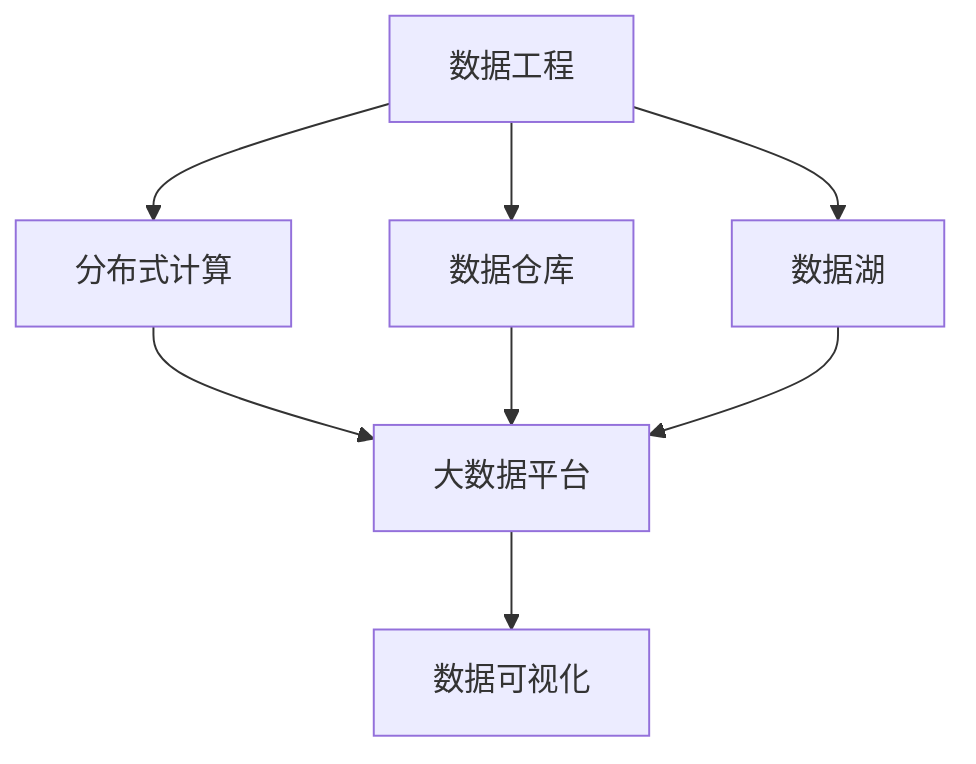

                 

# 大数据时代：人类计算如何应对海量数据

在数字化时代，海量数据的生成速度和规模远远超出了人类的处理能力。如何高效、精确地处理这些数据，成为了全社会共同面对的重大挑战。本文将从数据工程、计算模型、隐私保护三个角度，探讨人类计算在应对海量数据时面临的挑战与机遇。

## 1. 背景介绍

### 1.1 问题由来
随着互联网、物联网、移动通信等技术的迅猛发展，全球数据量呈现指数级增长。根据IDC的预测，到2025年，全球数据量将达到175ZB。在金融、医疗、交通、零售等诸多领域，数据已成为驱动创新和竞争的关键资源。

然而，传统的计算方式，如基于单台计算机或单机服务器集中式处理，面对海量数据显得力不从心。分布式计算和云计算的出现，使得数据处理能力得到了极大的提升。但分布式系统本身的复杂性，如数据一致性、系统调度等问题，又带来了新的挑战。

### 1.2 问题核心关键点
大数据时代的核心问题是如何高效、精确地处理海量数据，并从中挖掘出有用的信息。其关键在于：

- 如何高效存储和检索数据，以降低数据处理成本。
- 如何构建高效、可扩展的计算模型，以适应数据量级的不断增长。
- 如何在数据处理过程中保护用户隐私和数据安全。

## 2. 核心概念与联系

### 2.1 核心概念概述

为更好地理解人类计算应对海量数据的方法，本节将介绍几个密切相关的核心概念：

- 数据工程(Data Engineering)：包括数据收集、数据清洗、数据存储、数据处理等过程。数据工程的目标是确保数据质量，为后续分析和应用提供可靠的基础。

- 分布式计算(Distributed Computing)：通过将计算任务分布到多台计算节点上进行协同计算，以提高计算效率和系统可靠性。Hadoop、Spark、Flink等是当前常用的分布式计算框架。

- 数据仓库(Data Warehouse)：用于存储和分析历史数据，支持多维数据分析和数据挖掘。典型的数据仓库系统如Oracle、SAP、Snowflake等。

- 大数据平台(Big Data Platform)：集成多种数据存储、计算、分析工具，支持大规模数据处理和应用。如Apache Hadoop、Apache Spark、Apache Hive等。

- 数据湖(Data Lake)：不同于数据仓库，数据湖支持非结构化数据的存储，更灵活地处理海量数据。Hadoop生态中的HDFS、S3等可以作为数据湖的基础设施。

- 数据可视化(Data Visualization)：通过图形化手段展示数据信息，帮助人们更直观地理解数据。常见的工具包括Tableau、PowerBI、D3.js等。

这些核心概念之间的逻辑关系可以通过以下Mermaid流程图来展示：



这个流程图展示了大数据处理的主要流程：

1. 数据工程负责收集、清洗和存储数据。
2. 分布式计算通过将任务分散到多台服务器上，提高数据处理效率。
3. 数据仓库和大数据平台集成多种计算工具，支持大规模数据处理。
4. 数据可视化帮助人们直观理解数据信息，提升决策效率。

## 3. 核心算法原理 & 具体操作步骤
### 3.1 算法原理概述

人类计算应对海量数据的本质是通过高效的数据处理算法，快速、精确地从数据中提取出有价值的信息。其核心算法原理包括以下几个方面：

- 分布式算法：通过将数据和计算任务分散到多台服务器上，利用并行计算加速数据处理速度。如MapReduce、Spark等。
- 聚合算法：对数据进行聚合操作，如求和、求均值、统计计数等。聚合算法能够快速处理大量数据，如Hive中的MapReduce算法。
- 近似算法：在数据量过大无法全部处理时，通过抽样、分块等方式，获取近似的计算结果。近似算法能够有效降低计算成本，如Mikheev-Skachkov近似算法。
- 机器学习算法：利用机器学习模型对数据进行建模，提取数据特征和规律。机器学习算法能够处理大规模数据集，如TensorFlow、PyTorch等深度学习框架。

### 3.2 算法步骤详解

人类计算应对海量数据的典型步骤包括：

**Step 1: 数据预处理**
- 数据采集：通过API、爬虫、数据库等方式收集数据。
- 数据清洗：处理缺失值、重复值、异常值等。
- 数据转换：将数据转化为适合计算的格式，如表格、图形等。

**Step 2: 数据存储与组织**
- 数据存储：选择合适的数据存储方式，如Hadoop HDFS、Amazon S3、Google Cloud Storage等。
- 数据组织：通过分区、分片等方式，优化数据访问路径，提高数据查询效率。

**Step 3: 数据处理与分析**
- 数据聚合：对数据进行统计聚合，如MapReduce、Spark等。
- 数据建模：利用机器学习模型对数据进行建模，提取特征和规律。
- 数据可视化：将分析结果转化为图表、报告等可视化形式，帮助用户理解数据。

**Step 4: 数据优化与调度**
- 资源管理：通过监控工具对计算资源进行管理，保证计算任务的稳定运行。
- 任务调度：利用调度算法对任务进行优先级排序和资源分配，提高系统效率。

### 3.3 算法优缺点

人类计算应对海量数据的方法具有以下优点：

- 高效性：分布式计算和大数据平台能够快速处理大规模数据，提高数据处理效率。
- 可扩展性：通过增加计算节点，可以动态扩展数据处理能力。
- 灵活性：数据湖支持非结构化数据的存储，更加灵活地处理各种数据类型。

同时，该方法也存在一些局限性：

- 复杂性：分布式计算系统的部署和维护较为复杂，需要专业技术支持。
- 数据一致性：分布式系统的一致性问题可能会影响数据处理结果。
- 数据隐私：数据处理过程中需要考虑隐私保护和数据安全问题。

## 4. 数学模型和公式 & 详细讲解 & 举例说明

### 4.1 数学模型构建

为了更好地理解人类计算应对海量数据的方法，本节将使用数学语言对相关算法进行详细讲解。

假设我们有一组大小为 $N$ 的数据集 $D=\{x_i\}_{i=1}^N$，其中 $x_i$ 表示第 $i$ 个样本，$N$ 表示样本总数。我们的目标是计算这组数据的平均值和标准差。

定义数据集的经验平均值和标准差为：

$$
\overline{x} = \frac{1}{N}\sum_{i=1}^N x_i
$$

$$
\sigma = \sqrt{\frac{1}{N}\sum_{i=1}^N (x_i - \overline{x})^2}
$$

为了提高计算效率，我们可以采用MapReduce算法，将计算任务分布到多台服务器上，并行计算平均值和标准差。具体步骤如下：

1. Map阶段：每个节点将数据集分成若干个小数据块，对每个小数据块进行局部计算，得到每个小数据块的平均值和标准差。
2. Reduce阶段：将每个小数据块的平均值和标准差汇总，得到全数据集的平均值和标准差。

MapReduce算法的优点在于能够高效地处理大规模数据集，同时具有可扩展性和容错性。但缺点是处理复杂度较高，需要对数据集进行合适的划分和调度。

### 4.2 公式推导过程

为了更好地理解MapReduce算法的具体计算过程，我们以计算一个子集为例，进行公式推导：

假设一个子集大小为 $M$，其元素为 $\{x_{i_1}, x_{i_2}, \dots, x_{i_M}\}$，其中 $i_j \in [1, N]$。

在Map阶段，每个元素 $x_{i_j}$ 被映射到一个函数上，计算其对平均值的贡献：

$$
\frac{x_{i_j} - \overline{x}}{N}
$$

将所有元素的贡献累加，得到子集的数据总和 $S$：

$$
S = \sum_{j=1}^M \frac{x_{i_j} - \overline{x}}{N}
$$

然后，将子集的平均值和标准差计算出来：

$$
\overline{S} = \frac{S}{M}
$$

$$
\sigma_S = \sqrt{\frac{1}{M}\sum_{j=1}^M \left(\frac{x_{i_j} - \overline{x}}{N}\right)^2}
$$

最终，Reduce阶段将所有子集的平均值和标准差汇总，得到全数据集的平均值和标准差。

### 4.3 案例分析与讲解

为了更好地理解MapReduce算法的应用，我们可以考虑一个具体的案例：

假设我们有一组大小为 $1,000,000$ 的用户访问数据，每个用户访问记录包含时间戳、IP地址、访问页面等字段。我们需要计算用户访问的平均页面访问量。

我们可以将数据集分成若干个小数据块，每个数据块大小为 $100,000$。在Map阶段，每个数据块在本地机器上进行统计，计算每个数据块的平均页面访问量。然后，Reduce阶段将所有数据块的平均页面访问量汇总，得到全数据集的平均页面访问量。

## 5. 项目实践：代码实例和详细解释说明

### 5.1 开发环境搭建

在进行人类计算应对海量数据的实践前，我们需要准备好开发环境。以下是使用Python进行PySpark开发的环境配置流程：

1. 安装Anaconda：从官网下载并安装Anaconda，用于创建独立的Python环境。

2. 创建并激活虚拟环境：
```bash
conda create -n pyspark-env python=3.8 
conda activate pyspark-env
```

3. 安装PySpark：根据CUDA版本，从官网获取对应的安装命令。例如：
```bash
conda install pyarrow pydantic pyyaml transformers
```

4. 安装各类工具包：
```bash
pip install pyspark pandas scikit-learn matplotlib tqdm jupyter notebook ipython
```

完成上述步骤后，即可在`pyspark-env`环境中开始人类计算的实践。

### 5.2 源代码详细实现

下面我们以计算用户访问的平均页面访问量为例，给出使用PySpark进行大数据处理的PyTorch代码实现。

首先，定义数据集：

```python
from pyspark.sql import SparkSession
from pyspark.sql.functions import col, count, avg, struct

spark = SparkSession.builder.getOrCreate()
df = spark.read.csv("user_visits.csv", header=True, inferSchema=True)
```

然后，进行数据预处理和转换：

```python
df = df.dropna()
df = df.select(col("timestamp"), col("ip_address"), col("page").alias("page_access_count"))
```

接着，使用MapReduce算法计算平均页面访问量：

```python
df = df.map(lambda row: (row.timestamp, row.ip_address, row.page_access_count))

def calculate_page_access(row):
    timestamp, ip_address, page_access_count = row
    return struct(timestamp=timestamp, ip_address=ip_address, page_access_count=page_access_count), page_access_count

df = df.rdd.mapPartitions(calculate_page_access, numSlices=100)
df = df.groupBy("timestamp", "ip_address") \
    .agg(avg("page_access_count").alias("avg_page_access_count"))
```

最后，输出结果：

```python
df.show()
```

以上便是使用PySpark进行大数据处理的完整代码实现。可以看到，借助分布式计算框架，我们能够高效地处理大规模数据集，快速得到所需的结果。

### 5.3 代码解读与分析

让我们再详细解读一下关键代码的实现细节：

**数据集定义**：
- `spark.read.csv`：读取CSV文件，自动解析为DataFrame。
- `df.dropna`：删除缺失值，保证数据完整性。

**数据预处理和转换**：
- `df.select`：选择需要的字段，并进行重命名。
- `df.map`：将数据集分成若干个小数据块，对每个小数据块进行局部计算。

**MapReduce算法实现**：
- `calculate_page_access`函数：对每个小数据块进行统计，计算平均页面访问量。
- `df.rdd.mapPartitions`：将数据块分发到多个节点上进行并行计算。
- `df.groupBy`：对数据进行分组，计算每个分组的平均页面访问量。
- `df.agg`：聚合计算平均页面访问量。

可以看到，通过PySpark，我们可以非常方便地实现分布式计算任务，快速处理大规模数据集。

## 6. 实际应用场景
### 6.1 智能客服系统

在大数据时代，智能客服系统面临着海量用户咨询数据的处理挑战。传统集中式存储和计算方式无法满足实时响应的需求，分布式计算和大数据平台成为首选方案。

在技术实现上，可以将用户咨询数据存储在大数据平台中，如Apache Hadoop、Apache Spark等。然后，通过分布式计算任务对数据进行处理，如用户情感分析、问题分类、自动回复等。最终，将处理结果反馈到智能客服系统中，实现实时响应。

### 6.2 金融风险预警

金融机构需要实时监测市场动态，评估金融风险。面对海量市场数据，集中式存储和计算方式难以满足实时性和高并发的需求，分布式计算和大数据平台成为必要手段。

具体而言，可以将市场数据存储在大数据平台中，利用分布式计算任务进行实时数据分析和风险预警。例如，通过MapReduce算法计算市场指数变化，发现异常波动并触发预警。

### 6.3 智慧城市治理

智慧城市治理需要实时监测城市事件，保障城市安全。面对大规模城市数据，传统存储和计算方式难以应对。分布式计算和大数据平台能够提供高效、可靠的数据处理能力。

具体而言，可以将城市事件数据存储在大数据平台中，利用分布式计算任务进行实时监测和预警。例如，通过MapReduce算法分析视频监控数据，发现异常行为并及时响应。

### 6.4 未来应用展望

随着大数据技术的不断演进，未来人类计算将更加高效、智能、灵活。以下是几个未来应用展望：

- 数据湖和数据平台将更加普及，提供更加灵活的数据存储和处理方式。
- 分布式计算框架将不断优化，提供更加高效、可扩展的数据处理能力。
- 大数据技术将与人工智能、物联网等技术深度融合，提供更加智能的数据处理和分析能力。
- 数据隐私和安全将成为重要课题，分布式系统将更加注重数据隐私保护和数据安全。

## 7. 工具和资源推荐
### 7.1 学习资源推荐

为了帮助开发者掌握人类计算应对海量数据的方法，这里推荐一些优质的学习资源：

1. 《大数据时代》系列博文：由大数据领域专家撰写，深入浅出地介绍了大数据工程、分布式计算、数据湖等核心概念。

2. 《Python数据科学手册》书籍：全面介绍Python在大数据领域的应用，包括PySpark、Pandas、NumPy等。

3. 《大数据技术与应用》课程：由知名大学开设的在线课程，涵盖大数据工程、分布式计算、数据仓库等多个核心主题。

4. Hadoop官方文档：Apache Hadoop的官方文档，提供详细的API文档和示例代码，是学习Hadoop的最佳资源。

5. Cloudera提供的Cloudera Manager：提供Hadoop、Spark、Hive等大数据平台的集成管理，帮助开发者快速搭建和部署大数据系统。

通过对这些资源的学习实践，相信你一定能够快速掌握人类计算应对海量数据的方法，并用于解决实际的业务问题。

### 7.2 开发工具推荐

高效的开发离不开优秀的工具支持。以下是几款用于大数据处理开发的常用工具：

1. PySpark：基于Python的分布式计算框架，支持大规模数据处理和分析。与Hadoop生态无缝集成。

2. Apache Hadoop：开源分布式计算框架，支持大规模数据存储和处理。
3. Apache Spark：开源分布式计算框架，支持大规模数据处理、图计算和机器学习。
4. Apache Flink：开源流式数据处理框架，支持低延迟、高吞吐量的数据流处理。
5. Elasticsearch：开源搜索和分析引擎，支持大规模数据索引和查询。
6. Apache Kafka：开源分布式消息队列，支持高吞吐量的数据流传输。

合理利用这些工具，可以显著提升大数据处理任务的开发效率，加快创新迭代的步伐。

### 7.3 相关论文推荐

大数据技术的发展离不开学界的持续研究。以下是几篇奠基性的相关论文，推荐阅读：

1. MapReduce: Simplified Data Processing on Large Clusters（MapReduce原论文）：提出了MapReduce算法，成为分布式计算的经典范式。

2. Apache Hadoop: A Distributed File System（Hadoop原论文）：介绍了Hadoop分布式文件系统的设计思想和技术实现。

3. Apache Spark: Cluster Computing with Machine Memory（Spark原论文）：提出了Spark内存计算模型，大幅提升了数据处理效率。

4. Apache Flink: State and Event-based Computations over Unbounded Data Streams（Flink原论文）：介绍了Flink流式计算框架的设计和实现。

5. Apache Kafka: The Real-Time Distributed Streaming Platform（Kafka原论文）：介绍了Kafka分布式消息队列的设计和技术实现。

这些论文代表了大数据技术的发展脉络。通过学习这些前沿成果，可以帮助研究者把握学科前进方向，激发更多的创新灵感。

## 8. 总结：未来发展趋势与挑战

### 8.1 总结

本文对人类计算应对海量数据的方法进行了全面系统的介绍。首先阐述了大数据时代的背景和挑战，明确了分布式计算、大数据平台、数据湖等核心概念，以及数据工程、分布式算法、数据可视化等关键技术。其次，从原理到实践，详细讲解了MapReduce算法和大数据处理流程，给出了大数据处理的完整代码实现。同时，本文还广泛探讨了大数据技术在智能客服、金融预警、智慧城市等实际应用场景中的应用前景，展示了大数据技术的广泛应用。最后，本文精选了大数据技术的各类学习资源，力求为读者提供全方位的技术指引。

通过本文的系统梳理，可以看到，大数据技术在应对海量数据处理方面，已经形成了较为成熟的技术体系。分布式计算和大数据平台为大规模数据处理提供了高效、可靠、可扩展的解决方案。未来，随着技术的不断演进，大数据技术将更加智能、高效、安全，为各行各业提供更强大的数据处理能力。

### 8.2 未来发展趋势

展望未来，大数据技术的发展将呈现以下几个趋势：

1. 数据湖和大数据平台的普及：数据湖将更加普及，支持更灵活的数据存储和处理方式。大数据平台将更加成熟，提供更高效的数据处理能力。

2. 分布式计算框架的优化：分布式计算框架将不断优化，提供更高效、可扩展的数据处理能力。

3. 数据隐私和安全的重视：数据隐私和安全将成为重要课题，分布式系统将更加注重数据隐私保护和数据安全。

4. 大数据技术与其他技术的融合：大数据技术将与人工智能、物联网、区块链等技术深度融合，提供更加智能、高效、可靠的数据处理和分析能力。

5. 数据智能化的提升：大数据技术将结合数据可视化、数据挖掘等技术，提供更加智能化的数据分析和决策支持。

以上趋势凸显了大数据技术的广阔前景。这些方向的探索发展，必将进一步提升大数据系统的性能和应用范围，为各行各业提供更强大的数据处理能力。

### 8.3 面临的挑战

尽管大数据技术已经取得了瞩目成就，但在迈向更加智能化、普适化应用的过程中，它仍面临着诸多挑战：

1. 数据一致性问题：分布式系统的一致性问题可能会影响数据处理结果，需要在系统设计中进行优化。

2. 数据隐私问题：在大数据处理过程中，需要考虑数据隐私保护和数据安全问题，防止数据泄露和滥用。

3. 数据处理成本问题：大规模数据处理需要高性能计算资源，成本较高。如何降低数据处理成本，提升系统效率，是亟待解决的问题。

4. 数据处理效率问题：大数据平台和分布式计算框架需要不断优化，提高数据处理效率，满足实时性要求。

5. 数据处理复杂性问题：大数据处理涉及数据采集、数据清洗、数据转换等多个环节，系统复杂度较高，需要专业知识支持。

6. 数据处理可靠性问题：大规模数据处理过程中，可能会出现数据丢失、网络延迟等问题，需要系统设计保证数据处理可靠性。

正视大数据处理面临的这些挑战，积极应对并寻求突破，将是大数据技术走向成熟的必由之路。相信随着学界和产业界的共同努力，这些挑战终将一一被克服，大数据技术必将在构建智慧社会的进程中扮演越来越重要的角色。

### 8.4 研究展望

面向未来，大数据技术的研究方向将包括以下几个方面：

1. 数据智能化的提升：结合数据可视化、数据挖掘等技术，提升大数据系统的智能分析和决策能力。

2. 数据隐私保护：研究数据隐私保护算法，确保数据处理过程中的隐私安全。

3. 数据处理的可扩展性：优化分布式计算框架，提升大数据系统的可扩展性和灵活性。

4. 数据处理的可靠性：研究分布式系统的一致性算法和故障恢复策略，确保数据处理的高可靠性。

5. 数据处理的成本控制：优化数据存储和计算方式，降低数据处理成本。

6. 数据处理的实时性：提升数据处理的实时性，满足各种业务场景的实时需求。

这些研究方向将推动大数据技术在各个领域的应用，为构建智能、高效、安全的智慧社会提供有力支持。未来，大数据技术将在社会治理、智慧城市、金融预警等领域发挥重要作用，推动社会治理的数字化、智能化进程。

## 9. 附录：常见问题与解答

**Q1：分布式计算框架如何选择？**

A: 分布式计算框架的选择应考虑以下几点：

- 数据处理量级：根据数据量级选择适合的数据处理框架，如Hadoop适合处理海量数据，Spark适合处理高并发的数据流。

- 数据处理需求：根据数据处理需求选择适合的框架，如Hadoop适合离线数据处理，Spark适合实时数据处理。

- 系统扩展性：考虑框架的可扩展性和灵活性，如Hadoop适合大规模集群扩展，Spark适合动态节点扩展。

- 系统复杂度：考虑框架的复杂度和开发成本，如Hadoop系统复杂度较高，需要专业知识支持；Spark易于上手，开发成本较低。

- 数据处理效率：考虑框架的效率和性能，如Hadoop性能较低，Spark性能较高。

**Q2：大数据平台如何搭建？**

A: 大数据平台的搭建包括以下几个步骤：

- 选择适合的基础设施：如Hadoop、Spark等。

- 安装和配置框架：安装和配置大数据平台的基础框架，并进行系统测试。

- 部署数据存储和计算节点：根据数据处理需求，部署计算节点和存储节点。

- 配置数据访问权限：配置数据访问权限，确保数据安全和隐私。

- 集成数据处理工具：集成数据清洗、数据转换、数据建模等工具。

- 进行数据处理：利用分布式计算框架进行数据处理，生成分析结果。

**Q3：大数据平台如何优化？**

A: 大数据平台的优化包括以下几个方面：

- 数据压缩和存储优化：优化数据压缩和存储方式，减少存储成本。

- 计算资源优化：优化计算资源分配和调度，提高计算效率。

- 数据访问优化：优化数据访问路径，减少数据传输时间和成本。

- 数据处理效率优化：优化数据处理算法和流程，提高处理效率。

- 数据隐私和安全优化：优化数据隐私保护算法，确保数据安全。

- 系统稳定性和可靠性优化：优化系统设计，提高系统的稳定性和可靠性。

**Q4：大数据平台如何监控和管理？**

A: 大数据平台的监控和管理包括以下几个方面：

- 数据处理监控：监控数据处理任务和进程，确保任务正常执行。

- 资源使用监控：监控计算资源和存储资源的使用情况，防止资源浪费。

- 异常告警：设置异常告警阈值，及时发现和处理系统异常。

- 日志和审计：记录系统日志和操作记录，便于问题分析和故障排查。

- 性能调优：根据监控结果，进行系统性能调优和优化。

**Q5：大数据平台如何保证数据一致性？**

A: 大数据平台保证数据一致性的方法包括：

- 数据副本机制：通过多副本机制，确保数据的一致性和可靠性。

- 数据同步机制：通过数据同步机制，确保数据的实时一致性。

- 事务处理机制：通过事务处理机制，确保数据的原子性和一致性。

- 一致性协议：如Paxos、Zookeeper等协议，确保系统的一致性和稳定性。

- 数据校验机制：通过数据校验机制，发现和修复数据不一致问题。

以上这些方法和策略，将有助于大数据平台在大数据处理过程中，保持数据的一致性和可靠性，保证数据处理的正确性和有效性。

---

作者：禅与计算机程序设计艺术 / Zen and the Art of Computer Programming

