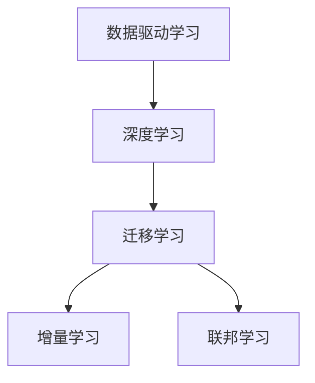

                 

# 大数据驱动AI学习的未来

在人工智能（AI）领域，数据始终是驱动学习进步的关键因素。从最初的规则驱动系统到现在的深度学习，数据的角色变得越来越重要。特别是随着大数据时代的到来，AI学习方式和应用场景正在发生深刻变革。本文将从背景介绍、核心概念、核心算法、项目实践、应用场景、工具和资源推荐、总结与展望等多个方面，深入探讨大数据驱动AI学习的未来。

## 1. 背景介绍

### 1.1 数据的重要性

数据的重要性在AI领域不言而喻。早期AI系统大多基于专家知识，依赖手工设计的规则进行推理和决策。然而，这些系统往往难以应对复杂多变的现实世界，且难以涵盖全面的知识领域。

自20世纪90年代以来，机器学习（ML）的兴起让AI从“规则驱动”转向“数据驱动”。通过对大量标注数据进行训练，机器学习模型能够自动学习输入特征和输出结果之间的映射关系。这种基于数据的训练方式，极大地提升了AI的泛化能力和适应性，使得其在视觉、语言、推荐等诸多领域取得了突破性进展。

### 1.2 大数据的兴起

大数据时代，数据量呈现出指数级增长，数据类型也越来越多样化，从传统的结构化数据到半结构化、非结构化数据，再到实时数据，数据的形式和来源发生了深刻变化。这对AI学习提出了新的挑战，也带来了新的机遇。

大数据不仅增加了模型的训练数据量，还带来了更高的数据质量和多样性。通过大数据的驱动，AI可以更有效地学习复杂的模式和规律，提升模型的性能和精度。同时，大数据也推动了深度学习（DL）的发展，使AI从浅层网络向深层网络演进，进一步提升了模型的表达能力。

## 2. 核心概念与联系

### 2.1 核心概念概述

- **数据驱动学习**：指利用大规模、高质量的数据进行模型训练，从中自动学习输入和输出之间的关系。

- **深度学习**：指通过深层神经网络进行模型训练，深度学习模型的每一层都可以学习到输入数据的高级抽象特征，从而更好地适应复杂的现实世界。

- **迁移学习**：指将在一个领域学到的知识迁移到另一个领域，使得模型能够在新领域中更好地泛化。

- **增量学习**：指模型在不断接受新数据的同时，能够持续学习并更新已有知识，保持知识的时效性。

- **联邦学习**：指在多个设备或服务器之间分布式训练模型，充分利用数据资源，同时保护数据隐私。

这些概念之间的关系可以通过以下Mermaid流程图来展示：



这个流程图展示了AI学习过程的基本逻辑：

1. 数据驱动学习是基础，通过大量数据训练模型。
2. 深度学习在数据驱动学习的基础上，通过多层次网络提升模型表达能力。
3. 迁移学习让模型能够跨领域泛化，增强模型的泛化能力。
4. 增量学习保持模型知识的时效性，让模型能够持续学习新数据。
5. 联邦学习利用分布式数据，提升模型训练效率，同时保护数据隐私。

## 3. 核心算法原理 & 具体操作步骤

### 3.1 算法原理概述

基于大数据驱动的AI学习，主要是通过深度学习模型，利用大规模数据进行训练，自动学习输入特征和输出结果之间的复杂映射关系。深度学习模型的核心思想是通过多层次网络结构，逐层提取输入数据的高级抽象特征，从而在输出层得到更准确的预测结果。

形式化地，假设输入数据为 $\mathbf{x}$，输出结果为 $\mathbf{y}$，深度学习模型的目标是最小化预测结果 $\hat{\mathbf{y}}$ 与真实结果 $\mathbf{y}$ 之间的差异，即：

$$
\min_{\theta} \mathcal{L}(\mathbf{x}, \hat{\mathbf{y}})
$$

其中 $\theta$ 为模型参数，$\mathcal{L}$ 为损失函数。常见的损失函数包括交叉熵损失、均方误差损失等。

### 3.2 算法步骤详解

基于大数据驱动的AI学习，一般包括以下几个关键步骤：

**Step 1: 数据准备与预处理**

- 收集大规模、高质量的数据集。数据集应覆盖广泛的现实世界场景，以提升模型的泛化能力。
- 进行数据清洗和预处理，包括去噪、填补缺失值、数据增强等操作，确保数据质量。

**Step 2: 模型选择与构建**

- 选择合适的深度学习模型架构，如卷积神经网络（CNN）、循环神经网络（RNN）、Transformer等。
- 使用开源框架（如TensorFlow、PyTorch）构建模型，并进行模型超参数的初始化。

**Step 3: 训练与优化**

- 使用大规模数据集对模型进行训练，通常使用GPU/TPU等高性能设备加速训练过程。
- 定义损失函数，并使用优化算法（如Adam、SGD等）对模型参数进行优化。
- 引入正则化技术（如L2正则、Dropout），防止过拟合。
- 定期在验证集上评估模型性能，及时调整训练策略。

**Step 4: 测试与部署**

- 使用测试集对训练好的模型进行评估，获取模型的准确率、召回率、F1值等指标。
- 部署模型到实际应用场景中，确保模型的性能和稳定性。
- 持续收集新数据，定期重新训练模型，以适应数据分布的变化。

### 3.3 算法优缺点

基于大数据驱动的AI学习具有以下优点：

1. 数据量大，能够更好地学习复杂模式。
2. 多样化数据来源，提升模型的泛化能力。
3. 模型表达能力强，可以自动学习高级特征。
4. 可迁移性强，能够在多个领域应用。
5. 灵活性高，可以通过增量学习保持模型时效性。

同时，也存在以下缺点：

1. 数据采集成本高，需要大量标注数据。
2. 训练时间长，硬件要求高。
3. 模型复杂，调试难度大。
4. 数据隐私问题，需要在联邦学习中处理。

尽管如此，大数据驱动的AI学习在诸多领域已取得显著成效，推动了AI技术的发展。

### 3.4 算法应用领域

基于大数据驱动的AI学习在多个领域得到了广泛应用，例如：

- 计算机视觉：图像分类、物体检测、图像分割等。
- 自然语言处理：语言建模、机器翻译、问答系统等。
- 语音识别：语音识别、语音合成、情感分析等。
- 推荐系统：个性化推荐、广告推荐、新闻推荐等。
- 医疗健康：医学影像分析、疾病预测、基因组学分析等。
- 自动驾驶：目标检测、车道保持、行为预测等。

除了这些经典应用外，AI学习还广泛应用于金融风控、智能制造、智慧城市、智能家居等诸多领域，推动了各行各业的数字化转型。

## 4. 数学模型和公式 & 详细讲解 & 举例说明

### 4.1 数学模型构建

以卷积神经网络（CNN）为例，介绍基于大数据驱动的AI学习模型的数学模型构建。

假设输入数据为 $x \in \mathbb{R}^n$，输出结果为 $y \in \mathbb{R}^m$。假设网络中包含 $L$ 层卷积核，第 $l$ 层的卷积核大小为 $h_l \times w_l$，特征图大小为 $s_l$。

卷积神经网络的基本结构如下：

$$
y = \text{CNN}(x; \theta) = \sum_{l=1}^L \mathbf{W}_l * \mathbf{F}_{l-1} + b_l
$$

其中 $\mathbf{W}_l$ 为第 $l$ 层的卷积核，$\mathbf{F}_{l-1}$ 为第 $l-1$ 层的特征图，$*$ 表示卷积运算，$b_l$ 为偏置项，$\theta$ 为模型参数。

### 4.2 公式推导过程

以图像分类任务为例，推导卷积神经网络的基本训练流程。

假设网络结构已知，输出结果为 $\hat{y}$，则交叉熵损失函数为：

$$
\mathcal{L}(y, \hat{y}) = -\sum_{i=1}^N y_i \log \hat{y}_i
$$

其中 $y$ 为真实标签，$\hat{y}$ 为模型预测结果。

在训练过程中，通过反向传播算法计算损失函数对每个参数的梯度，并使用优化算法（如Adam、SGD等）更新模型参数。训练流程如下：

1. 初始化模型参数 $\theta$。
2. 对每个训练样本 $x_i$ 进行前向传播，计算输出 $\hat{y}_i$。
3. 计算损失函数 $\mathcal{L}(y_i, \hat{y}_i)$。
4. 反向传播计算梯度。
5. 使用优化算法更新模型参数。
6. 重复步骤2-5，直到收敛。

### 4.3 案例分析与讲解

以医学影像分类任务为例，介绍如何使用CNN进行微调。

假设已有医学影像分类数据集，包含 $n$ 个样本，每个样本大小为 $m \times m \times 3$，共有 $k$ 个类别。

首先，将原始数据进行预处理和增强，如随机裁剪、旋转、缩放等。然后，构建CNN模型，定义输出层为 $k$ 分类器，并使用softmax函数输出概率分布。

定义交叉熵损失函数：

$$
\mathcal{L}(y, \hat{y}) = -\sum_{i=1}^N \sum_{j=1}^k y_{ij} \log \hat{y}_{ij}
$$

其中 $y_{ij}$ 为样本 $i$ 属于类别 $j$ 的真实标签。

使用GPU进行模型训练，使用Adam优化器，设置学习率为 $0.001$，训练轮数为 $1000$。训练过程中，使用验证集每100个epoch评估一次模型性能。最终得到微调后的CNN模型，可以用于新的医学影像分类任务。

## 5. 项目实践：代码实例和详细解释说明

### 5.1 开发环境搭建

在进行AI学习项目实践前，我们需要准备好开发环境。以下是使用Python进行TensorFlow开发的示例环境配置流程：

1. 安装Anaconda：从官网下载并安装Anaconda，用于创建独立的Python环境。

2. 创建并激活虚拟环境：
```bash
conda create -n tf-env python=3.8 
conda activate tf-env
```

3. 安装TensorFlow：从官网获取对应的安装命令。例如：
```bash
pip install tensorflow-gpu==2.3.0
```

4. 安装其他依赖库：
```bash
pip install numpy scipy matplotlib tensorflow-hub
```

完成上述步骤后，即可在`tf-env`环境中开始AI学习项目实践。

### 5.2 源代码详细实现

下面以手写数字识别任务为例，给出使用TensorFlow实现CNN的代码实现。

首先，定义CNN模型：

```python
import tensorflow as tf

def cnn_model(input_shape, num_classes):
    model = tf.keras.models.Sequential()
    model.add(tf.keras.layers.Conv2D(32, (3, 3), activation='relu', input_shape=input_shape))
    model.add(tf.keras.layers.MaxPooling2D((2, 2)))
    model.add(tf.keras.layers.Conv2D(64, (3, 3), activation='relu'))
    model.add(tf.keras.layers.MaxPooling2D((2, 2)))
    model.add(tf.keras.layers.Flatten())
    model.add(tf.keras.layers.Dense(64, activation='relu'))
    model.add(tf.keras.layers.Dense(num_classes, activation='softmax'))
    return model
```

然后，定义训练和评估函数：

```python
from tensorflow.keras.datasets import mnist
from tensorflow.keras.utils import to_categorical

# 加载MNIST数据集
(x_train, y_train), (x_test, y_test) = mnist.load_data()

# 数据预处理
x_train = x_train / 255.0
x_test = x_test / 255.0
y_train = to_categorical(y_train, num_classes=10)
y_test = to_categorical(y_test, num_classes=10)

# 构建CNN模型
model = cnn_model((28, 28, 1), 10)

# 定义优化器、损失函数和评价指标
optimizer = tf.keras.optimizers.Adam(learning_rate=0.001)
loss_fn = tf.keras.losses.CategoricalCrossentropy()
metrics = [tf.keras.metrics.CategoricalAccuracy()]

# 定义训练函数
def train_step(input, target):
    with tf.GradientTape() as tape:
        logits = model(input)
        loss = loss_fn(target, logits)
    gradients = tape.gradient(loss, model.trainable_variables)
    optimizer.apply_gradients(zip(gradients, model.trainable_variables))
    return loss

# 训练模型
model.compile(optimizer=optimizer, loss=loss_fn, metrics=metrics)
model.fit(x_train, y_train, epochs=1000, validation_data=(x_test, y_test), callbacks=[tf.keras.callbacks.EarlyStopping(patience=100)])

# 评估模型
model.evaluate(x_test, y_test)
```

可以看到，TensorFlow提供了丰富的API和工具，使得构建和训练AI模型变得简单高效。通过以上代码，即可实现基于CNN的手写数字识别任务。

### 5.3 代码解读与分析

让我们再详细解读一下关键代码的实现细节：

**cnn_model函数**：
- 定义了CNN的基本结构，包括卷积层、池化层、全连接层等。

**数据预处理**：
- 使用`mnist.load_data()`函数加载MNIST数据集，并进行数据归一化处理。
- 使用`to_categorical()`函数将标签转换为独热编码。

**模型训练**：
- 使用`model.compile()`方法配置优化器、损失函数和评价指标。
- 定义`train_step`函数，用于每个训练批次的计算和更新。
- 使用`model.fit()`方法进行模型训练，并在验证集上进行评估。

**模型评估**：
- 使用`model.evaluate()`方法评估模型性能，输出准确率和损失值。

通过以上代码，我们可以完成CNN模型的构建、训练和评估。TensorFlow的高层次抽象和丰富的API支持，使得开发者能够更专注于模型的设计和调优。

当然，工业级的系统实现还需考虑更多因素，如模型的保存和部署、超参数的自动搜索、更灵活的任务适配层等。但核心的训练流程基本与此类似。

## 6. 实际应用场景

### 6.1 计算机视觉

计算机视觉是AI应用的重要领域之一。通过大数据驱动，计算机视觉模型已经取得了显著进展，在图像分类、目标检测、图像分割等任务上取得了很好的效果。

在实际应用中，计算机视觉模型可以广泛应用于智能监控、自动驾驶、医疗影像分析等场景。例如，智能监控系统可以通过对视频流进行实时分析，检测异常行为并及时报警。自动驾驶车辆可以通过摄像头和激光雷达获取周围环境信息，进行路径规划和障碍物检测。医疗影像分析模型可以辅助医生进行疾病诊断，提升诊断效率和准确性。

### 6.2 自然语言处理

自然语言处理（NLP）是AI的另一个重要分支。通过大数据驱动，NLP模型已经取得了显著进展，在机器翻译、文本分类、情感分析等任务上取得了很好的效果。

在实际应用中，NLP模型可以广泛应用于智能客服、智能翻译、信息抽取等场景。例如，智能客服系统可以通过对用户咨询进行自然语言理解，自动给出最佳答复。智能翻译系统可以将不同语言的文本进行翻译，帮助全球用户进行沟通交流。信息抽取系统可以从海量的文本数据中提取结构化信息，辅助决策支持系统。

### 6.3 推荐系统

推荐系统是AI在商业领域的重要应用。通过大数据驱动，推荐系统已经取得了显著进展，在个性化推荐、广告推荐、新闻推荐等任务上取得了很好的效果。

在实际应用中，推荐系统可以广泛应用于电商、视频、音乐等平台。例如，电商平台可以通过对用户浏览行为和商品属性进行建模，推荐用户可能感兴趣的商品。视频平台可以通过对用户观看历史和评分数据进行分析，推荐用户可能喜欢的视频。音乐平台可以通过对用户听歌行为进行分析，推荐用户可能喜欢的歌曲。

### 6.4 未来应用展望

随着大数据的不断增长，AI学习将迎来新的发展机遇。未来，基于大数据驱动的AI学习将进一步提升模型的性能和泛化能力，推动AI技术在更多领域的应用。

在智慧城市领域，AI学习将应用于智能交通、智能安防、智慧医疗等场景，提升城市管理和公共服务的智能化水平。

在智能制造领域，AI学习将应用于预测性维护、质量控制、工艺优化等场景，提升制造业的效率和质量。

在智慧农业领域，AI学习将应用于作物病虫害监测、产量预测、智能灌溉等场景，提升农业生产的智能化水平。

总之，基于大数据驱动的AI学习将在更多领域发挥重要作用，推动社会的数字化转型。

## 7. 工具和资源推荐

### 7.1 学习资源推荐

为了帮助开发者系统掌握大数据驱动AI学习的基本概念和实践技巧，这里推荐一些优质的学习资源：

1. 《深度学习》书籍：Ian Goodfellow、Yoshua Bengio、Aaron Courville合著的《深度学习》（Deep Learning），全面介绍了深度学习的基本原理和实践方法。

2. CS231n《卷积神经网络》课程：斯坦福大学开设的计算机视觉课程，涵盖了卷积神经网络、目标检测、图像分割等核心内容，有详细的Lecture视频和作业。

3. CS224n《自然语言处理》课程：斯坦福大学开设的自然语言处理课程，涵盖了语言模型、序列标注、机器翻译等核心内容，有详细的Lecture视频和作业。

4. CS229《机器学习》课程：斯坦福大学开设的机器学习课程，涵盖了监督学习、无监督学习、强化学习等核心内容，有详细的Lecture视频和作业。

5. Coursera《深度学习专项课程》：由斯坦福大学和deeplearning.ai提供的深度学习专项课程，包含四门课程，涵盖了深度学习的基本原理和实践方法。

6. TensorFlow官方文档：TensorFlow官方文档提供了丰富的学习资源，包括详细的API文档、案例教程、TensorFlow Hub等。

通过对这些资源的学习实践，相信你一定能够快速掌握大数据驱动AI学习的基本原理和实践技巧。

### 7.2 开发工具推荐

高效的开发离不开优秀的工具支持。以下是几款用于大数据驱动AI学习开发的常用工具：

1. TensorFlow：由Google主导开发的开源深度学习框架，提供丰富的API和工具，适合大规模工程应用。

2. PyTorch：由Facebook主导开发的开源深度学习框架，灵活高效，适合研究和原型开发。

3. Keras：一个高层API，提供简单易用的API接口，可以运行于TensorFlow、Theano、CNTK等后端。

4. Jupyter Notebook：一个交互式笔记本，支持Python、R等语言，适合数据分析和模型开发。

5. TensorBoard：TensorFlow配套的可视化工具，可以实时监测模型训练状态，并提供丰富的图表呈现方式。

6. Weights & Biases：模型训练的实验跟踪工具，可以记录和可视化模型训练过程中的各项指标，方便对比和调优。

合理利用这些工具，可以显著提升大数据驱动AI学习的开发效率，加快创新迭代的步伐。

### 7.3 相关论文推荐

大数据驱动AI学习领域的研究工作主要集中在以下几个方面：

1. 深度学习模型设计：研究各种深度学习模型的架构、优化算法和损失函数，提升模型的表达能力和泛化能力。

2. 数据增强和数据清洗：研究各种数据增强和数据清洗技术，提升数据的有效性和多样性。

3. 迁移学习与跨领域学习：研究迁移学习、跨领域学习等方法，提升模型的泛化能力和适应性。

4. 联邦学习与分布式学习：研究联邦学习、分布式学习等方法，提升模型训练效率和数据隐私保护。

5. 自动化机器学习（AutoML）：研究自动化机器学习技术，提升模型训练的自动化水平和效率。

6. 自监督学习和无监督学习：研究各种自监督和无监督学习方法，提升模型的自适应能力和泛化能力。

以下是几篇经典的论文，推荐阅读：

1. AlexNet：ImageNet大规模视觉识别竞赛中的冠军模型，标志着深度学习在计算机视觉领域的突破。

2. VGGNet：提出使用多层次卷积层进行图像分类，证明了更深的网络不一定意味着更好的性能。

3. ResNet：提出残差连接网络结构，解决了深层网络训练过程中出现的梯度消失问题。

4. LSTM和GRU：提出长短期记忆网络结构，解决了传统RNN模型在长序列预测中的梯度消失问题。

5. Transformer：提出自注意力机制，提升了模型在自然语言处理任务上的表现。

6. BERT：提出预训练语言模型，提升了模型在文本分类、问答等任务上的性能。

这些论文代表了大数据驱动AI学习领域的发展脉络。通过学习这些前沿成果，可以帮助研究者把握学科前进方向，激发更多的创新灵感。

## 8. 总结：未来发展趋势与挑战

### 8.1 研究成果总结

本文对大数据驱动AI学习的基本原理和实践方法进行了系统介绍。从数据驱动学习的概念出发，详细介绍了深度学习模型的原理和训练流程。通过具体案例，展示了如何使用CNN、RNN等模型进行图像分类、自然语言处理等任务。

大数据驱动AI学习在诸多领域已取得显著成效，推动了AI技术的广泛应用。未来，基于大数据驱动的AI学习将进一步提升模型的性能和泛化能力，推动AI技术在更多领域的应用。

### 8.2 未来发展趋势

展望未来，大数据驱动的AI学习将呈现以下几个发展趋势：

1. 数据量的进一步增长。未来，随着数据采集技术的进步和数据源的多样化，数据的总量将进一步增长，提升模型的泛化能力和表达能力。

2. 数据质量的提升。未来，数据清洗和数据增强技术将进一步提升数据的质量，使得模型能够更好地学习数据的特征。

3. 模型复杂度的增加。未来，深度学习模型将进一步复杂化，采用更深的层次和更广泛的特征提取方式，提升模型的表达能力。

4. 模型的可解释性提升。未来，模型的可解释性将得到重视，研究者将更加关注模型的决策过程和输出解释。

5. 模型的时间效率提升。未来，模型训练和推理的时间效率将得到重视，研究者将更多地关注模型的优化和部署。

6. 模型的隐私保护提升。未来，数据隐私保护将得到重视，研究者将更多地关注模型的分布式训练和隐私保护技术。

以上趋势凸显了大数据驱动的AI学习技术的广阔前景。这些方向的探索发展，将进一步提升AI技术的性能和应用范围。

### 8.3 面临的挑战

尽管大数据驱动的AI学习取得了显著成效，但在迈向更加智能化、普适化应用的过程中，仍然面临诸多挑战：

1. 数据采集成本高。尽管数据量的增加可以提升模型的性能，但数据采集和标注的成本仍然较高，成为制约AI技术发展的瓶颈。

2. 模型复杂度高。深度学习模型复杂度较高，调试和优化难度大，需要更多的工程实践经验。

3. 数据隐私问题。数据隐私保护是AI学习的重要课题，如何在保证数据隐私的同时进行模型训练，仍然是一个挑战。

4. 模型可解释性不足。深度学习模型通常被视为“黑盒”系统，难以解释其内部工作机制和决策逻辑。

5. 计算资源需求大。深度学习模型训练和推理计算资源需求大，需要在高性能设备上进行优化。

6. 模型泛化能力差。尽管深度学习模型在特定任务上表现优异，但在新数据和新场景下的泛化能力仍然不足。

正视这些挑战，积极应对并寻求突破，将是大数据驱动的AI学习技术走向成熟的必由之路。

### 8.4 研究展望

面对大数据驱动AI学习所面临的种种挑战，未来的研究需要在以下几个方面寻求新的突破：

1. 自动化机器学习（AutoML）。研究自动化机器学习技术，提升模型训练的自动化水平和效率，降低模型调优的复杂度。

2. 可解释性增强。研究可解释性增强技术，提升模型的可解释性，使得模型的决策过程更加透明和可理解。

3. 跨领域学习。研究跨领域学习技术，提升模型的泛化能力和适应性，使得模型能够在多个领域进行应用。

4. 数据隐私保护。研究数据隐私保护技术，使得模型能够在保护数据隐私的同时进行训练和推理。

5. 高效模型训练。研究高效模型训练技术，提升模型训练和推理的效率，降低计算资源的消耗。

6. 模型优化与部署。研究模型优化和部署技术，提升模型的效率和性能，使得模型能够在实际应用中稳定运行。

这些研究方向的探索，将引领大数据驱动AI学习技术迈向更高的台阶，为构建安全、可靠、可解释、可控的智能系统铺平道路。面向未来，大数据驱动AI学习技术还需要与其他人工智能技术进行更深入的融合，如知识表示、因果推理、强化学习等，多路径协同发力，共同推动自然语言理解和智能交互系统的进步。只有勇于创新、敢于突破，才能不断拓展AI学习的边界，让AI技术更好地造福人类社会。

## 9. 附录：常见问题与解答

**Q1：大数据驱动AI学习的优势和劣势是什么？**

A: 大数据驱动AI学习的优势包括：
1. 数据量大，能够更好地学习复杂模式。
2. 数据多样化，提升模型的泛化能力。
3. 模型表达能力强，可以自动学习高级特征。

劣势包括：
1. 数据采集成本高，需要大量标注数据。
2. 训练时间长，硬件要求高。
3. 模型复杂，调试难度大。
4. 数据隐私问题，需要在联邦学习中处理。

**Q2：如何在数据采集和标注过程中保护用户隐私？**

A: 数据采集和标注过程中，保护用户隐私的方法包括：
1. 匿名化处理。对用户数据进行去标识化处理，使得无法反识别用户身份。
2. 数据加密。对用户数据进行加密处理，防止数据泄露。
3. 分布式学习。采用联邦学习等分布式学习技术，减少数据集中存储和传输的风险。
4. 隐私保护算法。研究隐私保护算法，如差分隐私、多方安全计算等，保护用户隐私。

**Q3：什么是联邦学习？**

A: 联邦学习是一种分布式机器学习技术，多个参与方共同参与模型训练，但数据分布在本地，不进行集中存储和传输。联邦学习的核心思想是：
1. 数据分散。参与方本地训练模型，不进行集中存储和传输。
2. 模型聚合。参与方将本地模型参数上传至中心服务器进行聚合，更新全局模型。
3. 隐私保护。通过加密和差分隐私等技术，保护参与方的数据隐私。

**Q4：如何提高AI模型的可解释性？**

A: 提高AI模型可解释性的方法包括：
1. 可视化技术。使用可视化技术，如特征热图、梯度图等，展示模型的决策过程。
2. 模型简化。采用模型简化技术，如特征选择、剪枝等，降低模型的复杂度，提高可解释性。
3. 解释性模型。研究解释性模型，如线性模型、决策树等，使得模型的决策过程更加透明和可理解。

**Q5：未来AI学习的主要趋势是什么？**

A: 未来AI学习的主要趋势包括：
1. 自动化机器学习（AutoML）。提升模型训练的自动化水平和效率，降低模型调优的复杂度。
2. 可解释性增强。提升模型的可解释性，使得模型的决策过程更加透明和可理解。
3. 跨领域学习。提升模型的泛化能力和适应性，使得模型能够在多个领域进行应用。
4. 数据隐私保护。在保护数据隐私的同时进行模型训练和推理。
5. 高效模型训练。提升模型训练和推理的效率，降低计算资源的消耗。
6. 模型优化与部署。提升模型的效率和性能，使得模型能够在实际应用中稳定运行。

这些趋势凸显了AI学习技术的广阔前景，需要研究者持续探索和创新，推动AI技术的不断发展。

---

作者：禅与计算机程序设计艺术 / Zen and the Art of Computer Programming

