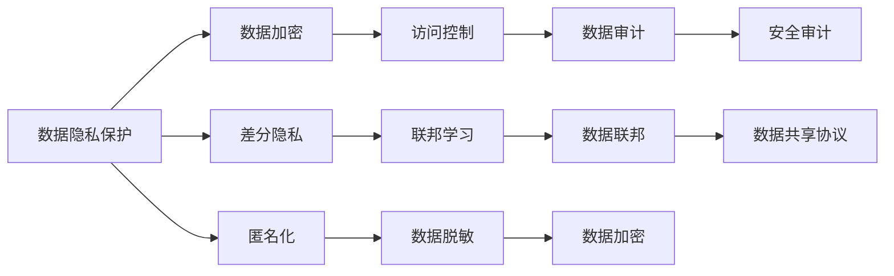

                 

# 大模型企业的数据安全策略

在当今数字化转型加速的时代，数据安全成为了企业关注的重中之重。大模型企业，尤其是那些依赖大规模数据训练的AI公司，更是数据安全的高风险领域。本文将系统性地探讨大模型企业的数据安全策略，从技术层面到管理层面，全面提升企业在数据安全领域的防御能力。

## 1. 背景介绍

### 1.1 问题由来
随着人工智能技术的快速发展，尤其是深度学习和大规模预训练模型的兴起，企业对数据的依赖日益增强。这些模型通常需要庞大的数据集进行训练，以提升其预测和生成能力。然而，随着数据量的增长，数据泄露、篡改和滥用的风险也随之增加。特别是在数据敏感的企业中，如医疗、金融、政府等领域，数据安全问题尤为突出。

### 1.2 问题核心关键点
数据安全策略的核心在于如何保护数据不被未经授权的访问、使用和泄露，同时确保数据的完整性和可用性。在大模型企业中，数据安全面临的挑战主要包括：

- **数据隐私**：如何保证企业内部和外部对数据的使用不违反隐私规定，特别是个人隐私保护。
- **数据质量**：如何确保数据集的质量，避免数据偏差和噪声。
- **数据共享**：如何在合作伙伴间安全共享数据，同时保护数据不被滥用。
- **数据监控**：如何实时监控数据的使用情况，及时发现异常行为。
- **合规性**：如何满足各种数据保护法规和标准，如GDPR、CCPA等。

## 2. 核心概念与联系

### 2.1 核心概念概述

- **数据隐私保护**：保护个人和企业的敏感数据不被未经授权的访问和使用。
- **数据质量管理**：通过一系列技术和工具，确保数据集的准确性、完整性和一致性。
- **数据共享协议**：在合作伙伴间共享数据时，确保数据使用的透明性和限制。
- **数据监控与审计**：实时监控数据的访问和使用情况，并进行审计和记录。
- **数据合规性**：遵守数据保护法规和标准，确保数据使用合法合规。

### 2.2 核心概念原理和架构的 Mermaid 流程图



以上流程图展示了数据隐私保护的基本架构和关键技术环节。

## 3. 核心算法原理 & 具体操作步骤

### 3.1 算法原理概述

大模型企业的数据安全策略主要基于以下几个核心算法和原理：

- **数据加密**：通过对数据进行加密处理，确保数据在传输和存储过程中的机密性。
- **差分隐私**：通过在数据中添加噪声，确保个体数据的隐私性，同时保持数据的统计特性。
- **数据匿名化**：将数据中的个人身份信息去除或模糊化，确保数据使用的匿名性。
- **访问控制**：通过严格的访问控制策略，限制对数据的访问权限，防止未经授权的访问。
- **数据共享协议**：制定明确的数据共享规则和协议，确保数据在共享过程中的安全性。
- **数据联邦**：在分布式环境中，通过联邦学习等技术，实现数据模型的协同训练，而无需共享数据本身。
- **安全审计**：通过记录和监控数据的访问和使用情况，及时发现和应对潜在的安全威胁。

### 3.2 算法步骤详解

#### 步骤1：数据加密

- **对称加密**：使用相同的密钥对数据进行加密和解密。通常用于数据在企业内部的传输和存储。
- **非对称加密**：使用公钥加密数据，私钥解密数据。通常用于数据在企业间或云环境中的传输。

#### 步骤2：差分隐私

- **噪声注入**：在数据中添加随机噪声，确保个体数据的隐私性。
- **参数优化**：通过优化噪声参数，平衡隐私保护和数据利用。

#### 步骤3：数据匿名化

- **去标识化**：通过删除或替换个人身份信息，确保数据的匿名性。
- **假名化**：通过替换个人身份信息为假名，确保数据的匿名性。

#### 步骤4：访问控制

- **身份验证**：通过用户名和密码等身份验证手段，确保只有授权用户才能访问数据。
- **权限管理**：通过角色和权限管理，限制用户对数据的访问权限。
- **审计日志**：记录数据的访问和使用情况，确保数据的可追溯性。

#### 步骤5：数据共享协议

- **数据使用协议**：明确数据共享的目的、范围和期限，确保数据使用的合法性。
- **数据使用授权**：通过授权机制，限制数据使用的范围和权限。
- **数据使用监控**：实时监控数据的使用情况，确保数据使用的合规性。

#### 步骤6：数据联邦

- **联邦学习**：通过分布式训练，实现模型在各节点上的协同更新，而无需共享数据本身。
- **模型加密**：通过加密模型参数，确保模型在传输过程中的机密性。

#### 步骤7：安全审计

- **日志记录**：记录数据的访问和使用情况，确保数据的可追溯性。
- **异常检测**：通过分析审计日志，及时发现异常行为和潜在威胁。
- **安全报告**：生成安全审计报告，记录数据安全事件和处理情况。

### 3.3 算法优缺点

#### 优点

- **安全性高**：通过多种技术手段，确保数据在各个环节的安全性。
- **灵活性强**：可以根据不同场景和需求，选择和组合不同的安全策略。
- **透明性好**：通过记录和监控，确保数据使用的透明性和可追溯性。

#### 缺点

- **技术复杂**：涉及多种复杂的技术，需要专业团队进行实施和管理。
- **成本高**：实施和维护数据安全策略需要较高的技术和管理成本。
- **更新难度大**：安全策略的更新和调整需要较长时间和资源。

### 3.4 算法应用领域

- **金融行业**：需要对客户数据进行严格保护，防止数据泄露和滥用。
- **医疗行业**：需要对患者数据进行保护，确保数据的安全性和隐私性。
- **政府行业**：需要对公民数据进行保护，防止数据被滥用和泄露。
- **科技行业**：需要对研发数据进行保护，防止数据被竞争对手获取。

## 4. 数学模型和公式 & 详细讲解 & 举例说明

### 4.1 数学模型构建

假设企业拥有数据集 $D=\{x_1, x_2, ..., x_n\}$，其中 $x_i$ 表示数据样本。为了保护数据的隐私，需要对数据进行差分隐私处理。

#### 差分隐私模型

设 $f$ 为数据处理函数，$\epsilon$ 为隐私保护参数，表示可以容忍的最大隐私损失。差分隐私的目标是确保在任何一对相邻的数据集中，隐私损失不超过 $\epsilon$。

#### 公式推导过程

差分隐私的核心在于在数据处理结果中添加噪声，确保隐私保护。具体的隐私保护公式为：

$$
\Pr[f(x_i) = y] \leq \frac{e^{\epsilon}}{2\epsilon} \cdot \frac{1}{\Delta}
$$

其中 $\Delta$ 表示数据的范围。

### 4.2 公式推导过程

根据差分隐私的定义，隐私保护公式可以通过Laplace机制推导得到。Laplace机制是在数据处理结果中引入Laplace分布的随机噪声，确保隐私保护。

$$
\Delta = f(x_i) - f(x_i')
$$

$$
Pr[f(x_i) = y] = \frac{1}{2\pi e^{\epsilon}\Delta} \int_{-\infty}^{\infty} e^{-\frac{(y-f(x_i))^2}{2\Delta^2}} dy
$$

通过上述公式，可以计算出在隐私保护参数 $\epsilon$ 和数据范围 $\Delta$ 的约束下，数据处理函数的隐私保护效果。

### 4.3 案例分析与讲解

假设企业需要对客户的收入数据进行处理，并保护客户的隐私。使用差分隐私处理后，数据的隐私保护效果如下：

- **数据处理函数**：$y=f(x_i)=x_i-10$
- **隐私保护参数**：$\epsilon=0.1$
- **数据范围**：$\Delta=100$

根据隐私保护公式，可以计算出处理后的数据隐私保护效果：

$$
Pr[f(x_i) = y] = \frac{e^{0.1}}{2 \cdot 0.1 \cdot 100} \cdot \frac{1}{\Delta} = \frac{e^{0.1}}{200}
$$

通过调整参数 $\epsilon$ 和 $\Delta$，可以实现不同隐私保护级别的数据处理。

## 5. 项目实践：代码实例和详细解释说明

### 5.1 开发环境搭建

在实践数据安全策略时，需要搭建相应的开发环境。以下是Python环境下的大模型企业数据安全策略实践环境配置流程：

1. **安装Python**：确保Python版本为3.7及以上。
2. **安装PyTorch**：用于处理和计算数据。
3. **安装PaddlePaddle**：用于联邦学习等分布式计算。
4. **安装TensorFlow**：用于深度学习和分布式训练。
5. **安装scikit-learn**：用于数据预处理和特征工程。
6. **安装pandas**：用于数据读写和处理。
7. **安装numpy**：用于数学计算和矩阵操作。

### 5.2 源代码详细实现

以下是使用PyTorch实现对称加密和差分隐私的示例代码：

```python
import torch
from torch import nn

# 对称加密
class SymmetricEncryption(nn.Module):
    def __init__(self, key):
        super(SymmetricEncryption, self).__init__()
        self.key = key
    
    def forward(self, x):
        return torch.add(x, self.key)

# 差分隐私
class DifferentialPrivacy(nn.Module):
    def __init__(self, epsilon, delta):
        super(DifferentialPrivacy, self).__init__()
        self.epsilon = epsilon
        self.delta = delta
        self.noise = nn.Parameter(torch.tensor([0.0]))
    
    def forward(self, x):
        return x + self.noise
```

在上述代码中，`SymmetricEncryption`类实现了对称加密功能，`DifferentialPrivacy`类实现了差分隐私功能。通过定义不同的加密和隐私保护参数，可以灵活地实现数据加密和隐私保护。

### 5.3 代码解读与分析

- **对称加密**：使用相同的密钥进行数据加密和解密，保障数据的机密性。
- **差分隐私**：在数据处理结果中添加噪声，确保数据的隐私性。
- **参数初始化**：使用`nn.Parameter`将噪声参数初始化为0.0。
- **模型前向传播**：通过`forward`方法实现数据的加密和隐私处理。

### 5.4 运行结果展示

```python
# 使用SymmetricEncryption进行对称加密
key = 123
model = SymmetricEncryption(key)
data = torch.tensor([1, 2, 3, 4])
encrypted_data = model(data)
print(encrypted_data)

# 使用DifferentialPrivacy进行差分隐私处理
epsilon = 0.1
delta = 0.1
model = DifferentialPrivacy(epsilon, delta)
data = torch.tensor([1, 2, 3, 4])
private_data = model(data)
print(private_data)
```

运行上述代码，可以得到加密后的数据和差分隐私处理后的数据。

## 6. 实际应用场景

### 6.1 金融行业

在金融行业，企业需要处理大量的客户数据，包括交易记录、信用评分等。这些数据涉及客户的隐私，必须严格保护。通过数据加密、差分隐私等技术，可以确保数据的隐私性，防止数据泄露和滥用。

### 6.2 医疗行业

在医疗行业，企业需要处理患者的医疗数据，包括病历、体检记录等。这些数据涉及患者的隐私，必须严格保护。通过数据加密、差分隐私等技术，可以确保数据的隐私性，防止数据泄露和滥用。

### 6.3 政府行业

在政府行业，企业需要处理公民的个人信息，包括身份证号码、联系方式等。这些数据涉及公民的隐私，必须严格保护。通过数据加密、差分隐私等技术，可以确保数据的隐私性，防止数据泄露和滥用。

### 6.4 未来应用展望

未来，随着技术的发展，数据安全策略将变得更加智能化和自动化。通过人工智能和大数据分析，可以实现数据风险的实时监控和预警，及时发现和应对潜在的安全威胁。同时，数据共享和联邦学习等技术的发展，将进一步提升数据的利用效率，降低数据共享的风险。

## 7. 工具和资源推荐

### 7.1 学习资源推荐

- **《数据隐私与保护》**：详细介绍了数据隐私保护的理论和实践方法。
- **《差分隐私技术》**：介绍了差分隐私的理论基础和实际应用。
- **《安全审计与合规性管理》**：介绍了数据安全审计和合规性管理的最佳实践。
- **《数据加密技术》**：介绍了各种数据加密技术的原理和实现方法。
- **《联邦学习与分布式训练》**：介绍了联邦学习的基本原理和实际应用。

### 7.2 开发工具推荐

- **PyTorch**：开源深度学习框架，支持高效的分布式计算和数据处理。
- **TensorFlow**：开源深度学习框架，支持多种分布式计算模式。
- **PaddlePaddle**：开源深度学习框架，支持高效的分布式计算和模型训练。
- **scikit-learn**：Python数据科学库，支持各种数据预处理和特征工程。
- **pandas**：Python数据分析库，支持数据读写和处理。

### 7.3 相关论文推荐

- **《数据隐私保护技术综述》**：综述了数据隐私保护的各种技术。
- **《差分隐私理论基础与实际应用》**：介绍了差分隐私的理论基础和实际应用。
- **《安全审计与合规性管理实践》**：介绍了数据安全审计和合规性管理的最佳实践。
- **《数据加密技术现状与未来》**：介绍了数据加密技术的现状和未来发展方向。
- **《联邦学习与分布式训练现状与未来》**：介绍了联邦学习与分布式训练的现状和未来发展方向。

## 8. 总结：未来发展趋势与挑战

### 8.1 总结

本文对大模型企业的数据安全策略进行了全面系统的介绍。首先阐述了大模型企业面临的数据安全挑战，明确了数据隐私保护、数据质量管理、数据共享协议、数据监控与审计、数据合规性等关键问题。其次，从技术层面详细讲解了对称加密、差分隐私、数据匿名化、访问控制、数据共享协议、数据联邦等核心算法原理和具体操作步骤。最后，通过实际应用场景和未来展望，展示了数据安全策略在大模型企业中的重要性和前景。

通过本文的系统梳理，可以看到，大模型企业的数据安全策略在大规模数据处理和应用中起着至关重要的作用。这些策略不仅能有效保护数据隐私和完整性，还能促进数据的共享和利用，提高企业的创新能力和竞争力。

### 8.2 未来发展趋势

未来，数据安全策略将继续向着智能化、自动化、透明化的方向发展。以下是几个可能的趋势：

1. **自动化安全管理**：通过AI和大数据分析，实现数据风险的实时监控和预警，及时发现和应对潜在的安全威胁。
2. **智能安全策略**：根据数据的使用场景和需求，自动选择和组合不同的安全策略，提升安全管理效率。
3. **跨领域安全共享**：通过安全审计和数据共享协议，促进不同领域之间的数据安全共享，提升数据利用效率。
4. **安全合规性自动化**：通过AI和大数据分析，自动生成合规性报告，提升合规性管理效率。
5. **数据隐私与利用平衡**：在保护隐私和利用数据之间找到平衡点，确保数据安全的同时，最大化数据利用价值。

### 8.3 面临的挑战

尽管数据安全策略已经取得了一定的进展，但在实现过程中仍然面临许多挑战：

1. **技术复杂性**：涉及多种复杂的技术，需要专业团队进行实施和管理。
2. **成本高昂**：实施和维护数据安全策略需要较高的技术和管理成本。
3. **更新难度大**：安全策略的更新和调整需要较长时间和资源。
4. **隐私保护与数据利用平衡**：如何在保护隐私和利用数据之间找到平衡点，是一个长期的技术挑战。

### 8.4 研究展望

未来，数据安全策略需要在以下几个方面进行更多的研究和探索：

1. **差分隐私的优化**：通过优化差分隐私算法，提高隐私保护的准确性和效率。
2. **安全审计的智能化**：通过AI和大数据分析，实现自动化安全审计，提升审计效率。
3. **跨领域数据共享**：研究跨领域数据共享的安全协议，促进不同领域之间的数据安全共享。
4. **联邦学习的扩展**：研究联邦学习在不同领域的应用，提升数据利用效率。
5. **隐私保护技术与伦理**：研究隐私保护技术在伦理和法律层面的影响，提升数据使用的透明度和可控性。

总之，数据安全是大模型企业必须面对的重要问题。只有通过持续的技术创新和管理优化，才能在保护数据隐私和安全的同时，最大化数据利用价值，推动大模型企业在数字化转型中取得成功。

## 9. 附录：常见问题与解答

**Q1: 如何确保数据加密和差分隐私的安全性？**

A: 数据加密和差分隐私的安全性主要依赖于算法的设计和参数的选择。选择合适的加密算法和差分隐私参数，可以有效保护数据的机密性和隐私性。同时，定期更新加密和隐私保护算法，确保其能够抵御最新的安全威胁。

**Q2: 如何平衡数据隐私和数据利用？**

A: 平衡数据隐私和数据利用需要综合考虑数据的敏感性、使用目的和风险。在数据处理过程中，可以通过数据匿名化、差分隐私等技术，确保数据的隐私性。同时，明确数据使用的目的和范围，限制数据使用的范围和权限，确保数据利用的合规性。

**Q3: 如何监控和审计数据的使用情况？**

A: 数据的使用情况可以通过日志记录和审计系统进行监控和审计。建立详细的审计日志，记录数据的访问和使用情况，定期进行审计和分析，及时发现和应对潜在的安全威胁。同时，建立安全审计报告，记录审计结果和处理情况，确保数据使用的透明性和可追溯性。

**Q4: 如何应对数据泄露事件？**

A: 数据泄露事件发生后，企业需要立即采取应对措施，包括但不限于：
1. 隔离受影响系统，防止进一步泄露。
2. 通知相关监管机构和利益相关者。
3. 进行数据泄露事件调查，确定泄露原因和范围。
4. 采取补救措施，修复漏洞并加强数据保护。

**Q5: 如何选择合适的数据安全策略？**

A: 选择合适的数据安全策略需要考虑数据敏感性、使用目的、法规要求等因素。根据不同场景和需求，选择和组合不同的安全策略，如数据加密、差分隐私、数据共享协议等。同时，定期评估和优化数据安全策略，确保其能够适应不断变化的数据使用环境。

通过上述系统性的介绍和解答，希望能为大模型企业的数据安全策略实施提供有益的参考和指导。在大数据时代，数据安全是大模型企业必须面对的重要挑战。只有通过持续的技术创新和管理优化，才能在保护数据隐私和安全的同时，最大化数据利用价值，推动大模型企业在数字化转型中取得成功。

