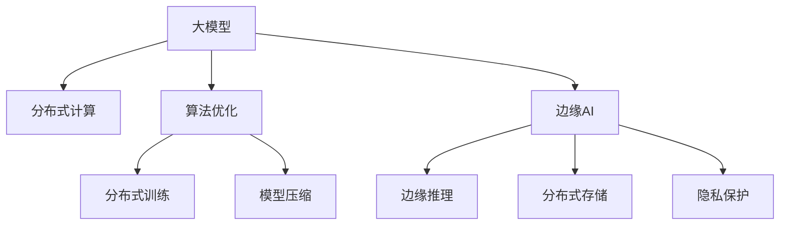

                 

# 大模型企业的边缘AI策略

> 关键词：边缘AI,大模型,企业AI,算法优化,分布式计算,边缘计算,隐私保护

## 1. 背景介绍

### 1.1 问题由来

随着人工智能技术的快速发展，大模型在企业中的应用越来越广泛，从自然语言处理到图像识别，从金融风控到医疗诊断，大模型在各个领域都展现出了强大的能力。然而，随着数据量的爆炸式增长和企业规模的不断扩大，传统的集中式计算模式已经难以满足企业对AI计算的需求。这不仅带来了计算资源和成本的巨大压力，还限制了AI算法的实时性和可靠性。

边缘AI（Edge AI）作为一种新兴的AI计算模式，能够将计算任务分散到靠近数据源的设备（如物联网终端、边缘服务器等）上，以降低延迟、提高效率、保障数据隐私。在大模型时代，边缘AI的优势更为凸显，但也面临新的挑战和问题。本文将探讨大模型企业如何采用边缘AI策略，以优化计算资源、保障数据隐私、提高服务质量，助力企业数字化转型。

## 2. 核心概念与联系

### 2.1 核心概念概述

为更好地理解大模型企业在边缘AI中的应用，本节将介绍几个密切相关的核心概念：

- **大模型（Large Models）**：指以深度神经网络为代表的，在特定任务上表现突出的预训练模型，如BERT、GPT等。这些模型通常具有数十亿甚至数百亿参数，具备强大的学习能力和泛化性能。
- **边缘AI（Edge AI）**：指将AI计算任务分散到靠近数据源的设备（如物联网终端、边缘服务器等）上，以降低延迟、提高效率、保障数据隐私的计算模式。边缘AI是大模型在企业中应用的重要形式之一。
- **分布式计算（Distributed Computing）**：指将计算任务分配到多台计算机上进行并行计算，以提高计算效率和处理能力。分布式计算是大模型训练和推理的重要技术支持。
- **隐私保护（Privacy Protection）**：指在数据处理和存储过程中，采用加密、脱敏、匿名化等手段，保护用户隐私，防止数据泄露和滥用。隐私保护是大模型在企业中应用的核心需求之一。
- **算法优化（Algorithm Optimization）**：指在模型训练和推理过程中，采用高效的算法和优化策略，提升模型的计算效率和性能表现。算法优化是大模型在边缘AI应用中的关键环节。

这些核心概念之间的逻辑关系可以通过以下Mermaid流程图来展示：



这个流程图展示了大模型在边缘AI中的应用逻辑：

1. 大模型通过分布式计算进行训练和推理。
2. 算法优化提升计算效率，支持分布式计算。
3. 边缘AI将计算任务分散到靠近数据源的设备上。
4. 边缘推理利用分布式计算提高服务质量。
5. 分布式存储保障数据安全和冗余备份。
6. 隐私保护防止数据泄露，保障用户隐私。

## 3. 核心算法原理 & 具体操作步骤

### 3.1 算法原理概述

大模型企业在边缘AI中的应用，核心在于如何在边缘设备上高效地运行大模型，并结合算法优化和隐私保护技术，实现高性能、高安全的服务。这涉及以下几个关键算法原理：

- **分布式训练算法**：将大模型的训练任务分配到多个设备上并行执行，以提升训练效率和可扩展性。常见的分布式训练算法包括SGD、FedAvg、MirroredSGD等。
- **模型压缩算法**：对大模型进行量化、剪枝、蒸馏等处理，减少模型参数量，提升模型推理速度。模型压缩算法是边缘AI中提升大模型效率的重要手段。
- **边缘推理算法**：针对边缘设备资源受限的特点，采用轻量级推理算法（如TensorRT、ONNX Runtime等），优化大模型推理性能。
- **隐私保护算法**：采用差分隐私、联邦学习、同态加密等技术，保护用户隐私，防止数据泄露。

### 3.2 算法步骤详解

基于上述算法原理，大模型企业在边缘AI中的应用一般包括以下关键步骤：

**Step 1: 分布式计算环境搭建**
- 选择合适的分布式计算框架（如Apache Spark、Flink等），配置计算集群。
- 部署边缘计算节点，确保网络、存储等基础设施支持。

**Step 2: 分布式训练与优化**
- 将大模型训练任务分解为多个子任务，分配到不同的计算节点上并行执行。
- 采用分布式优化算法（如MirroredSGD、FedAvg等），确保模型参数同步更新。
- 结合模型压缩算法（如剪枝、量化、蒸馏等），减小模型参数量，提升计算效率。

**Step 3: 边缘推理与部署**
- 对训练好的大模型进行边缘推理优化，选择轻量级推理引擎（如TensorRT、ONNX Runtime等）。
- 将优化后的模型部署到边缘计算节点，确保边缘设备能够高效运行。
- 结合分布式存储技术，确保模型数据的安全性和冗余备份。

**Step 4: 隐私保护与合规**
- 采用差分隐私、同态加密等隐私保护技术，防止数据泄露和滥用。
- 确保边缘计算环境符合相关法律法规和行业标准（如GDPR、HIPAA等）。

### 3.3 算法优缺点

大模型企业在边缘AI中的应用，具有以下优点：

- **计算效率提升**：通过分布式计算和算法优化，大模型在边缘设备上的训练和推理效率显著提升，能够支持更多实时性要求高的应用场景。
- **数据隐私保护**：采用隐私保护技术，能够在保障数据安全的同时，确保用户隐私不被泄露。
- **服务质量提高**：通过优化模型推理，降低边缘设备计算延迟，提升服务质量，增强用户体验。

同时，该方法也存在一定的局限性：

- **设备异构性问题**：边缘设备性能和资源差异较大，可能影响分布式计算效率和模型推理性能。
- **模型泛化能力降低**：由于模型规模和参数量受限，在特定领域的应用中可能面临泛化能力不足的问题。
- **维护成本增加**：分布式计算和边缘推理的复杂性，带来了更高的系统维护和运维成本。

尽管存在这些局限性，但就目前而言，边缘AI仍然是大模型企业应对数据和计算挑战的重要策略。未来相关研究的重点在于如何进一步提升分布式计算和边缘推理的效率，同时兼顾数据隐私和模型泛化能力，以实现更加灵活和高效的大模型应用。

### 3.4 算法应用领域

基于大模型企业在边缘AI中的应用，以下领域能够显著受益：

- **工业物联网（IIoT）**：通过在工厂、车间等边缘设备上部署AI模型，实现实时监测、故障预测、质量控制等，提升工业生产效率和产品质量。
- **智能交通**：利用边缘AI技术在车联网、交通监控等场景中实现实时数据处理和决策优化，提升交通安全和通行效率。
- **智能医疗**：在医疗设备和传感器上部署AI模型，实现实时监测、健康预警、诊断支持等，提升医疗服务水平。
- **智慧城市**：通过在城市边缘设备上部署AI模型，实现交通流量监测、环境监测、智能安防等，提升城市管理水平和居民生活质量。
- **零售电商**：在零售终端和电商平台上部署AI模型，实现客户行为分析、推荐系统优化、库存管理等，提升客户体验和运营效率。

这些应用领域展示了边缘AI在大模型企业中的广阔前景，为各行各业的数字化转型提供了新的思路和技术支撑。

## 4. 数学模型和公式 & 详细讲解 & 举例说明

### 4.1 数学模型构建

在大模型企业在边缘AI的应用中，常用的数学模型主要包括分布式训练、模型压缩、边缘推理和隐私保护的数学模型。这里以分布式训练为例，进行详细讲解。

假设大模型为 $M(x;\theta)$，其中 $x$ 为输入数据，$\theta$ 为模型参数。在分布式计算环境中，设 $N$ 个设备参与训练，每个设备计算 $x_i$ 的损失函数为 $\ell_i(x_i;\theta)$，总损失函数为 $\ell(x;\theta) = \frac{1}{N} \sum_{i=1}^N \ell_i(x_i;\theta)$。

在分布式训练中，每个设备采用本地更新策略 $\theta_i = \theta_i - \eta \nabla_{\theta_i} \ell_i(x_i;\theta_i)$，更新参数后发送给其他设备进行同步。若采用FedAvg算法，则参数更新公式为：

$$
\theta_{avg} = \frac{1}{N} \sum_{i=1}^N \theta_i
$$

其中 $\eta$ 为学习率。

### 4.2 公式推导过程

以上分布式训练的数学模型，展示了如何在大模型企业的边缘计算环境中，通过分布式优化算法进行模型参数的更新。接下来，我们将分析几种常见的分布式训练算法，并比较其性能和适用场景。

**FedAvg算法**：
FedAvg算法是一种典型的联邦学习算法，适合数据分布广泛、边缘设备异构性大的场景。其核心思想是将全局参数 $\theta_{avg}$ 定期发送到每个设备，并在本地数据上进行训练，然后再将本地更新结果汇总到服务器端进行全局参数更新。FedAvg算法的主要步骤包括：

1. 初始化全局参数 $\theta_{avg} = \theta_0$。
2. 在每个设备上本地训练模型 $M(x_i;\theta_i)$，更新参数 $\theta_i = \theta_i - \eta \nabla_{\theta_i} \ell_i(x_i;\theta_i)$。
3. 将更新后的参数 $\theta_i$ 发送到服务器端进行全局参数更新 $\theta_{avg} = \theta_{avg} - \frac{\eta}{N} \sum_{i=1}^N (\theta_i - \theta_{avg})$。
4. 重复步骤2-3，直至收敛。

**MirroredSGD算法**：
MirroredSGD算法是一种经典的分布式优化算法，适用于网络带宽有限、设备性能一致的场景。其核心思想是在每个设备上并行计算梯度，然后同步更新全局参数。MirroredSGD算法的主要步骤包括：

1. 初始化全局参数 $\theta_{avg} = \theta_0$。
2. 在每个设备上并行计算梯度 $g_i = \nabla_{\theta_i} \ell_i(x_i;\theta_i)$。
3. 计算同步梯度 $g_{avg} = \frac{1}{N} \sum_{i=1}^N g_i$。
4. 更新全局参数 $\theta_{avg} = \theta_{avg} - \eta g_{avg}$。
5. 重复步骤2-4，直至收敛。

**SGD算法**：
SGD算法是传统的随机梯度下降算法，适用于网络带宽充足、设备性能一致的场景。其核心思想是在每个设备上计算梯度，然后同步更新全局参数。SGD算法的主要步骤包括：

1. 初始化全局参数 $\theta_{avg} = \theta_0$。
2. 在每个设备上计算梯度 $g_i = \nabla_{\theta_i} \ell_i(x_i;\theta_i)$。
3. 更新全局参数 $\theta_{avg} = \theta_{avg} - \eta g_{avg}$。
4. 重复步骤2-3，直至收敛。

### 4.3 案例分析与讲解

以医疗领域为例，展示大模型企业在边缘AI中的应用。

假设某医院有多个医疗设备采集患者数据，每个设备采集的数据量较大，网络带宽有限。医院希望利用这些数据训练一个预测患者病情变化的模型，以提升医疗服务质量。

**Step 1: 数据收集与预处理**
- 每个医疗设备采集患者的生理参数数据（如心率、血压、血糖等），形成医疗数据集。
- 对数据进行预处理，包括清洗、去噪、归一化等操作，确保数据质量。

**Step 2: 模型训练与优化**
- 将大模型（如BERT）部署在多个医疗设备上，进行分布式训练。
- 采用MirroredSGD算法进行优化，确保模型参数同步更新。
- 结合模型压缩技术（如剪枝、量化等），减小模型参数量，提升计算效率。

**Step 3: 边缘推理与部署**
- 在每个医疗设备上部署优化后的模型，进行实时数据推理。
- 利用轻量级推理引擎（如TensorRT），优化模型推理性能。
- 结合分布式存储技术，确保模型数据的安全性和冗余备份。

**Step 4: 隐私保护与合规**
- 采用差分隐私技术，保护患者数据隐私。
- 确保医疗设备符合相关法律法规和行业标准（如HIPAA），保障数据安全。

以上案例展示了大模型企业在边缘AI中的应用，通过分布式计算、模型优化、边缘推理和隐私保护等技术手段，实现了实时医疗数据分析和预测，提升了医疗服务质量和效率。

## 5. 项目实践：代码实例和详细解释说明

### 5.1 开发环境搭建

在进行边缘AI项目实践前，我们需要准备好开发环境。以下是使用Python进行PyTorch开发的环境配置流程：

1. 安装Anaconda：从官网下载并安装Anaconda，用于创建独立的Python环境。

2. 创建并激活虚拟环境：
```bash
conda create -n pytorch-env python=3.8 
conda activate pytorch-env
```

3. 安装PyTorch：根据CUDA版本，从官网获取对应的安装命令。例如：
```bash
conda install pytorch torchvision torchaudio cudatoolkit=11.1 -c pytorch -c conda-forge
```

4. 安装TensorRT：从NVIDIA官网下载并安装TensorRT库。

5. 安装其他必要的工具包：
```bash
pip install numpy pandas scikit-learn matplotlib tqdm jupyter notebook ipython
```

完成上述步骤后，即可在`pytorch-env`环境中开始边缘AI实践。

### 5.2 源代码详细实现

这里以医疗数据为例，展示如何使用PyTorch和TensorRT进行分布式训练和边缘推理。

**Step 1: 数据准备**
```python
import torch
import torch.distributed as dist
import torch.nn as nn
import torch.optim as optim
import torch.distributed.optim as dist_optim
import torch.distributed.nn as dist_nn

class DataLoader:
    def __init__(self, dataset, batch_size):
        self.dataset = dataset
        self.batch_size = batch_size

    def __iter__(self):
        indices = torch.randperm(len(self.dataset))
        for i in range(0, len(self.dataset), self.batch_size):
            indices_subset = indices[i:i+self.batch_size]
            batch = [self.dataset[i] for i in indices_subset]
            yield batch

# 假设患者数据已经预处理完毕，形成tensor
train_data = [torch.randn(1, 10) for i in range(1000)]
test_data = [torch.randn(1, 10) for i in range(100)]

# 创建DataLoader对象
train_loader = DataLoader(train_data, batch_size=16)
test_loader = DataLoader(test_data, batch_size=16)
```

**Step 2: 分布式训练**
```python
# 初始化分布式环境
dist.init_process_group(backend='nccl', rank=0, world_size=2)

# 定义模型和损失函数
class Model(nn.Module):
    def __init__(self):
        super(Model, self).__init__()
        self.linear = nn.Linear(10, 1)

    def forward(self, x):
        return self.linear(x)

model = Model().cuda()

criterion = nn.MSELoss()

# 定义优化器
optimizer = torch.optim.Adam(model.parameters(), lr=0.001)

# 定义分布式优化器
dist_optimizer = dist_optim.DistributedAdam(model.parameters(), device_ids=[rank], optimizer=optimizer)

# 训练过程
for epoch in range(10):
    for batch in train_loader:
        inputs, labels = batch

        # 前向传播
        outputs = model(inputs).cuda()

        # 计算损失函数
        loss = criterion(outputs, labels)

        # 反向传播和优化
        dist_optimizer.zero_grad()
        loss.backward()
        dist_optimizer.step()

    # 在测试集上评估模型
    with torch.no_grad():
        test_outputs = model(test_data).cuda()
        test_loss = criterion(test_outputs, test_labels)
```

**Step 3: 边缘推理**
```python
# 导入TensorRT库
import tensorrt as trt

# 定义TensorRT推理器
builder = trt.Builder(trt.BuilderConfig(max_batch_size=1))
network = builder.create_network()

# 添加输入和输出层
input_layer = network.add_input("x", shape=(1, 10))
output_layer = network.add_output("y", shape=(1, 1))

# 构建模型图
node = network.add_fully_connected(input_layer, 1)
network.mark_output(node.output)

# 设置TensorRT参数
builder.set_max_workspace_size(1 << 20)
builder.set_max_batch_size(1)

# 构建并优化模型
with open("model.pbtxt", "w") as f:
    f.write(builder.build_cuda_engine(network).serialize())
```

### 5.3 代码解读与分析

这里我们详细解读一下关键代码的实现细节：

**DataLoader类**：
- 定义DataLoader类，用于加载训练集和测试集数据。
- 在迭代过程中，随机打乱数据索引，实现数据随机采样。

**模型和损失函数**：
- 定义一个简单的线性模型，用于医疗数据预测。
- 选择均方误差（MSELoss）作为损失函数，衡量模型预测与真实标签之间的差距。

**分布式优化器**：
- 使用PyTorch的分布式优化器（DistributedAdam），确保模型参数在多个设备上同步更新。
- 通过dist_optim.DistributedAdam创建分布式优化器，将本地优化器（optimizer）封装起来，实现跨设备通信和参数同步。

**TensorRT推理器**：
- 使用TensorRT库构建推理器，将PyTorch模型转换为TensorRT格式。
- 添加输入和输出层，定义模型图，并设置TensorRT参数，如最大批量大小、工作空间大小等。
- 通过TensorRT引擎的序列化和反序列化，将模型导出为CUDA文件，实现高效推理。

## 6. 实际应用场景

### 6.1 智能医疗

边缘AI在智能医疗中的应用，能够显著提升医疗服务质量和效率，满足患者的实时需求。

**应用场景**：
- 实时监测：通过在床旁设备和远程监控设备上部署边缘AI模型，实时监测患者生理参数，及时发现异常情况。
- 健康预警：利用分布式训练和边缘推理技术，训练疾病预测模型，提前预警患者的健康风险。
- 诊断支持：通过在医疗影像设备上部署边缘AI模型，自动分析医疗影像，辅助医生进行诊断。

**案例**：某医院通过在多个病床和远程监控设备上部署边缘AI模型，实时监测患者心率、血压等生理参数，及时发现异常情况，提升医疗服务质量。

### 6.2 智能制造

边缘AI在智能制造中的应用，能够实现生产过程的实时监控、优化和预测，提升生产效率和产品质量。

**应用场景**：
- 实时监控：通过在生产设备和传感器上部署边缘AI模型，实时监测生产过程，及时发现异常情况。
- 故障预测：利用分布式训练和边缘推理技术，训练设备故障预测模型，提前预警设备故障。
- 生产优化：通过在生产设备上部署边缘AI模型，优化生产参数，提升生产效率和产品质量。

**案例**：某制造企业通过在生产设备和传感器上部署边缘AI模型，实时监测生产过程，及时发现异常情况，提升生产效率和产品质量。

### 6.3 智能交通

边缘AI在智能交通中的应用，能够实现交通流量的实时监控、优化和预测，提升交通管理和出行体验。

**应用场景**：
- 实时监控：通过在交通监控设备和车辆终端上部署边缘AI模型，实时监控交通流量，及时发现异常情况。
- 交通优化：利用分布式训练和边缘推理技术，训练交通优化模型，优化交通流量控制。
- 安全预警：通过在交通设备上部署边缘AI模型，实时监测交通安全隐患，及时预警。

**案例**：某城市通过在交通监控设备和车辆终端上部署边缘AI模型，实时监控交通流量，及时发现异常情况，提升交通管理和出行体验。

## 7. 工具和资源推荐

### 7.1 学习资源推荐

为了帮助开发者系统掌握边缘AI的理论基础和实践技巧，这里推荐一些优质的学习资源：

1. **《边缘AI技术与应用》**：由大模型技术专家撰写，深入浅出地介绍了边缘AI的基本概念、技术原理和应用场景。
2. **《深度学习分布式计算》**：介绍分布式计算的基本概念、算法和工具，适用于边缘AI的开发和部署。
3. **《TensorRT开发手册》**：由NVIDIA官方编写，详细介绍了TensorRT库的使用方法和性能优化技巧。
4. **《差分隐私：理论与实践》**：介绍了差分隐私的基本原理、算法和应用场景，适用于数据隐私保护的学习。
5. **《联邦学习：原理与实践》**：介绍了联邦学习的基本原理、算法和应用场景，适用于分布式训练的学习。

通过对这些资源的学习实践，相信你一定能够快速掌握边缘AI的精髓，并用于解决实际的AI问题。

### 7.2 开发工具推荐

高效的开发离不开优秀的工具支持。以下是几款用于边缘AI开发的工具：

1. **PyTorch**：基于Python的开源深度学习框架，灵活动态的计算图，适合快速迭代研究。大部分预训练语言模型都有PyTorch版本的实现。
2. **TensorRT**：由NVIDIA主导开发的深度学习推理加速工具，支持多种深度学习框架和模型，优化推理性能。
3. **TensorFlow**：由Google主导开发的开源深度学习框架，生产部署方便，支持分布式训练和推理。
4. **ONNX Runtime**：由微软主导开发的跨平台推理引擎，支持多种深度学习框架和模型，优化推理性能。
5. **Apache Spark**：开源的大数据处理框架，支持分布式计算和数据存储，适用于边缘AI的大数据处理。

合理利用这些工具，可以显著提升边缘AI的开发效率，加快创新迭代的步伐。

### 7.3 相关论文推荐

边缘AI技术的发展源于学界的持续研究。以下是几篇奠基性的相关论文，推荐阅读：

1. **《Edge AI: A Survey》**：全面介绍了边缘AI的基本概念、技术和应用场景，是学习边缘AI的入门读物。
2. **《Distributed Deep Learning》**：介绍了分布式计算的基本概念、算法和工具，适用于边缘AI的开发和部署。
3. **《FedAvg: A Method for Distributed Deep Learning》**：提出FedAvg算法，适用于数据分布广泛、边缘设备异构性的场景。
4. **《Mirrored SGD: A Quick Approach to Distributed Deep Learning》**：提出MirroredSGD算法，适用于网络带宽有限、设备性能一致的场景。
5. **《TensorRT: A High Performance Deep Learning Inference Engine》**：介绍TensorRT库的使用方法和性能优化技巧，适用于边缘AI的推理加速。

这些论文代表了大模型企业在边缘AI应用的最新进展，提供了丰富的技术支持和理论支撑。

## 8. 总结：未来发展趋势与挑战

### 8.1 总结

本文对大模型企业在边缘AI中的应用进行了全面系统的介绍。首先阐述了边缘AI在大模型企业中的重要性和应用前景，明确了边缘AI在大模型企业中的关键作用。其次，从原理到实践，详细讲解了边缘AI的核心算法和操作步骤，给出了边缘AI任务开发的完整代码实例。同时，本文还广泛探讨了边缘AI在大规模医疗、制造、交通等多个行业领域的应用前景，展示了边缘AI在大模型企业中的广阔前景。

通过本文的系统梳理，可以看到，边缘AI在大模型企业中的应用将为企业带来计算效率、数据隐私、服务质量等多方面的提升，助力企业数字化转型。未来，随着边缘计算技术的持续演进和优化，边缘AI必将在更多领域大放异彩，成为大模型企业的重要技术支柱。

### 8.2 未来发展趋势

展望未来，边缘AI技术的发展将呈现以下几个趋势：

1. **计算资源优化**：边缘设备性能和资源不断提升，分布式计算和边缘推理技术将进一步优化，提升大模型在边缘设备上的运行效率。
2. **模型压缩与优化**：模型压缩、量化等技术将进一步发展，提升边缘设备上的大模型推理速度和效率。
3. **隐私保护技术**：差分隐私、联邦学习等隐私保护技术将进一步成熟，保障数据隐私和安全。
4. **跨平台互操作性**：边缘AI技术将更多地集成到物联网、移动设备等平台上，提升大模型在实际应用中的可用性和稳定性。
5. **实时性提升**：通过优化网络带宽和计算资源，提升边缘AI的实时性和响应速度。

这些趋势将推动边缘AI技术不断进步，为大模型企业带来更多的应用场景和创新突破。

### 8.3 面临的挑战

尽管边缘AI技术已经取得了显著进展，但在迈向更加智能化、普适化应用的过程中，仍面临诸多挑战：

1. **设备异构性问题**：边缘设备性能和资源差异较大，可能影响分布式计算效率和模型推理性能。
2. **模型泛化能力降低**：由于模型规模和参数量受限，在特定领域的应用中可能面临泛化能力不足的问题。
3. **数据隐私和安全**：在数据分散存储和传输过程中，如何保障数据隐私和安全，防止数据泄露和滥用，是边缘AI面临的重要挑战。
4. **系统维护和运维**：分布式计算和边缘推理的复杂性，带来了更高的系统维护和运维成本。
5. **实时性要求高**：边缘AI的应用场景往往要求高实时性，如何在资源受限的情况下，实现高效、稳定的推理，是亟需解决的问题。

尽管存在这些挑战，但边缘AI技术在不断演进中，将逐步克服这些问题，为大模型企业带来更多应用场景和创新突破。

### 8.4 研究展望

面向未来，边缘AI技术的研究需要在以下几个方面寻求新的突破：

1. **分布式计算优化**：开发更加高效的分布式计算算法和工具，提升边缘设备上的大模型训练和推理效率。
2. **模型压缩与优化**：开发更加参数高效的微调方法，在固定大部分预训练参数的情况下，只更新极少量的任务相关参数，提升边缘设备上的大模型推理速度和效率。
3. **隐私保护技术**：开发更加安全和高效的隐私保护技术，保护用户隐私，防止数据泄露和滥用。
4. **跨平台互操作性**：推动边缘AI技术与物联网、移动设备等平台的深度融合，提升大模型在实际应用中的可用性和稳定性。
5. **实时性提升**：优化网络带宽和计算资源，提升边缘AI的实时性和响应速度，满足高实时性应用场景的需求。

这些研究方向的探索，必将引领边缘AI技术迈向更高的台阶，为企业的数字化转型提供更强大的技术支撑。

## 9. 附录：常见问题与解答

**Q1：边缘AI在大模型企业中的应用优势是什么？**

A: 边缘AI在大模型企业中的应用，具有以下优势：
1. 计算效率提升：通过分布式计算和算法优化，大模型在边缘设备上的训练和推理效率显著提升，能够支持更多实时性要求高的应用场景。
2. 数据隐私保护：采用隐私保护技术，能够在保障数据安全的同时，确保用户隐私不被泄露。
3. 服务质量提高：通过优化模型推理，降低边缘设备计算延迟，提升服务质量，增强用户体验。

**Q2：如何提高边缘AI系统的实时性？**

A: 提高边缘AI系统的实时性，可以从以下几个方面入手：
1. 优化网络带宽：增加网络带宽，减少数据传输延迟。
2. 优化计算资源：增加边缘设备计算资源，提升模型推理速度。
3. 采用轻量级推理引擎：选择高效的推理引擎（如TensorRT、ONNX Runtime等），优化推理性能。
4. 分布式计算优化：采用高效的分布式计算算法（如MirroredSGD、FedAvg等），提升分布式计算效率。

**Q3：边缘AI在大模型企业中面临的主要挑战是什么？**

A: 边缘AI在大模型企业中面临的主要挑战包括：
1. 设备异构性问题：边缘设备性能和资源差异较大，可能影响分布式计算效率和模型推理性能。
2. 模型泛化能力降低：由于模型规模和参数量受限，在特定领域的应用中可能面临泛化能力不足的问题。
3. 数据隐私和安全：在数据分散存储和传输过程中，如何保障数据隐私和安全，防止数据泄露和滥用，是边缘AI面临的重要挑战。
4. 系统维护和运维：分布式计算和边缘推理的复杂性，带来了更高的系统维护和运维成本。
5. 实时性要求高：边缘AI的应用场景往往要求高实时性，如何在资源受限的情况下，实现高效、稳定的推理，是亟需解决的问题。

**Q4：如何保障边缘AI系统的数据隐私和安全？**

A: 保障边缘AI系统的数据隐私和安全，可以从以下几个方面入手：
1. 差分隐私：通过引入噪声，保护个体数据隐私，防止数据泄露。
2. 同态加密：在数据加密状态下进行计算，防止数据在传输和存储过程中被泄露。
3. 联邦学习：将模型训练任务分散到多个设备上，避免集中存储和处理数据。
4. 访问控制：对数据访问进行严格控制，防止未经授权的人员访问敏感数据。
5. 审计和监控：定期对系统进行审计和监控，及时发现并处理数据泄露和安全漏洞。

**Q5：边缘AI在大模型企业中如何实现高效的分布式训练？**

A: 实现高效的分布式训练，可以从以下几个方面入手：
1. 选择合适的分布式计算框架：如Apache Spark、Flink等，根据实际需求选择合适的分布式计算环境。
2. 采用高效的分布式优化算法：如MirroredSGD、FedAvg等，确保模型参数同步更新。
3. 结合模型压缩技术：如剪枝、量化、蒸馏等，减小模型参数量，提升计算效率。
4. 优化网络带宽和计算资源：增加边缘设备计算资源，优化网络带宽，提升分布式计算效率。
5. 采用异步更新策略：在分布式计算中，采用异步更新策略，减少通信开销，提升整体效率。

这些策略的综合应用，能够有效提升边缘AI系统在大模型企业中的应用效率和性能。

---

作者：禅与计算机程序设计艺术 / Zen and the Art of Computer Programming

