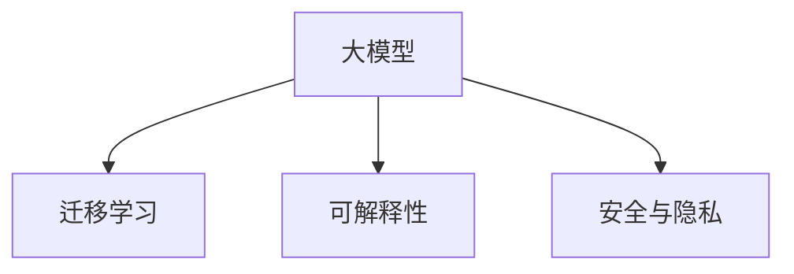

                 

## 1. 背景介绍

随着人工智能技术的迅猛发展，大模型（Large Models）逐渐成为科技领域的一大热门话题。这类模型拥有巨大的参数量，能够处理复杂的数据结构和任务，通常涉及自然语言处理（Natural Language Processing, NLP）、计算机视觉（Computer Vision）、生成对抗网络（Generative Adversarial Networks, GANs）等多个领域。

大模型的优势在于能够高效地利用大量的数据进行训练，从而提升模型的泛化能力和表现。然而，在实际的创业环境中，大模型的开发、训练和应用面临诸多挑战。如何在商业化过程中权衡这些风险与机遇，是大模型创业的核心问题。

## 2. 核心概念与联系

### 2.1 核心概念概述

为了更好地理解大模型创业的风险与机遇，我们首先需要明确几个关键概念：

- **大模型（Large Models）**：指具有亿量级参数的大型神经网络模型，例如BERT、GPT等。这些模型通常需要海量数据进行训练，以获得出色的性能。
- **迁移学习（Transfer Learning）**：指将在大规模数据集上训练的模型，迁移到新任务或数据集上进行微调，以提升模型的性能。
- **可解释性（Explainability）**：指模型决策过程的可理解性，特别是在大模型中，如何解释模型的输出，是一个重要的研究课题。
- **安全与隐私（Security & Privacy）**：随着大模型应用范围的扩大，模型的安全性与隐私保护变得尤为关键。

### 2.2 核心概念原理和架构的 Mermaid 流程图



这个流程图展示了大模型的核心概念及其相互关系：大模型通过迁移学习在不同任务上进行微调，提升其性能。同时，可解释性与安全隐私是大模型应用过程中需要特别注意的两个方面。

## 3. 核心算法原理 & 具体操作步骤

### 3.1 算法原理概述

大模型创业的核心在于如何将模型转化为具有商业价值的产品或服务。这涉及到大模型的迁移学习、可解释性和安全隐私保护等多个方面。

**迁移学习**：通过在大规模数据集上预训练模型，然后在目标任务上对其进行微调，使得模型能够高效地适应新的任务，减少训练时间和成本。

**可解释性**：为了使大模型的决策过程更加透明和可理解，需要通过模型可视化、特征重要性分析等方式，揭示模型内部工作机制。

**安全与隐私**：在商业化过程中，必须确保模型的安全性，避免模型被恶意攻击，同时保护用户的隐私，确保数据不被滥用。

### 3.2 算法步骤详解

1. **数据准备**：收集和整理目标任务的数据集，确保数据的多样性和代表性。
2. **模型选择与微调**：选择合适的大模型，并在目标任务上进行微调，以提升模型性能。
3. **可解释性分析**：使用特征重要性分析、模型可视化等方法，解析模型决策过程。
4. **安全与隐私保护**：采用差分隐私、模型加密等技术，保护用户隐私和数据安全。

### 3.3 算法优缺点

**优点**：
- **高性能**：大模型能够处理复杂的任务，提供高精度的结果。
- **泛化能力强**：通过迁移学习，模型能够适应不同领域和任务，提升模型的泛化能力。
- **快速迭代**：微调过程相对简单，可以快速部署和迭代。

**缺点**：
- **资源消耗大**：大模型的训练和推理需要大量的计算资源，成本较高。
- **可解释性不足**：大模型通常被视为“黑盒”模型，难以解释其决策过程。
- **安全风险高**：大模型可能被恶意攻击，造成数据泄露或功能滥用。

### 3.4 算法应用领域

大模型创业主要应用于以下几个领域：

- **自然语言处理**：如聊天机器人、文本分类、情感分析等。
- **计算机视觉**：如图像分类、目标检测、人脸识别等。
- **生成对抗网络**：如图像生成、视频生成、文本生成等。
- **语音识别**：如语音转文本、语音合成等。

## 4. 数学模型和公式 & 详细讲解 & 举例说明

### 4.1 数学模型构建

假设我们有一个大模型 $M$，目标任务为分类问题，输入为 $x$，输出为 $y$。则模型的损失函数可以表示为：

$$
L(M(x), y) = \sum_i \ell(M(x), y_i)
$$

其中 $\ell$ 为损失函数，$y_i$ 为训练样本的标签。

### 4.2 公式推导过程

对于分类任务，常用的损失函数包括交叉熵损失：

$$
\ell(M(x), y) = -\sum_i y_i \log M(x)_i
$$

对于回归任务，常用的损失函数包括均方误差损失：

$$
\ell(M(x), y) = \frac{1}{2} ||M(x) - y||^2
$$

通过最小化损失函数，可以更新模型参数 $w$：

$$
w_{new} = w_{old} - \eta \nabla_{w}L(M(x), y)
$$

其中 $\eta$ 为学习率，$\nabla_{w}L(M(x), y)$ 为损失函数对模型参数的梯度。

### 4.3 案例分析与讲解

以文本分类为例，我们可以使用BERT模型，在大规模语料库上进行预训练，然后在目标任务上进行微调。具体步骤如下：

1. 收集目标任务的标注数据集 $D$。
2. 使用BERT模型作为初始化参数。
3. 设计分类器，如全连接层，并将其与BERT模型的输出连接。
4. 使用交叉熵损失函数，最小化损失，更新模型参数。

## 5. 项目实践：代码实例和详细解释说明

### 5.1 开发环境搭建

要构建一个基于大模型的项目，首先需要搭建好开发环境。常用的深度学习框架包括PyTorch和TensorFlow，推荐使用PyTorch，因为它易于上手且文档齐全。

1. 安装Anaconda，并创建虚拟环境。
2. 安装PyTorch和相关依赖库。
3. 配置GPU环境，确保模型训练和推理可以在GPU上运行。

### 5.2 源代码详细实现

以下是一个简单的PyTorch代码示例，用于微调BERT模型进行文本分类任务：

```python
import torch
import torch.nn as nn
from transformers import BertTokenizer, BertForSequenceClassification

# 初始化BERT模型和分词器
model = BertForSequenceClassification.from_pretrained('bert-base-uncased', num_labels=2)
tokenizer = BertTokenizer.from_pretrained('bert-base-uncased')

# 定义训练函数
def train(model, train_data, train_loader, device):
    model.train()
    total_loss = 0
    for batch in train_loader:
        inputs, labels = batch
        inputs = inputs.to(device)
        labels = labels.to(device)
        outputs = model(inputs)
        loss = nn.CrossEntropyLoss()(outputs, labels)
        total_loss += loss.item()
        loss.backward()
        optimizer.step()
        optimizer.zero_grad()
    return total_loss / len(train_loader)

# 定义评估函数
def evaluate(model, dev_data, dev_loader, device):
    model.eval()
    total_loss = 0
    predictions, true_labels = [], []
    with torch.no_grad():
        for batch in dev_loader:
            inputs, labels = batch
            inputs = inputs.to(device)
            labels = labels.to(device)
            outputs = model(inputs)
            predictions.append(outputs.argmax(dim=1).to('cpu').tolist())
            true_labels.append(labels.to('cpu').tolist())
    print('Accuracy:', (torch.tensor(predictions) == true_labels).float().mean().item())

# 训练模型
model.train()
device = torch.device('cuda' if torch.cuda.is_available() else 'cpu')
model.to(device)
optimizer = torch.optim.Adam(model.parameters(), lr=2e-5)

# 假设训练数据和验证数据已经加载到train_loader和dev_loader中
for epoch in range(10):
    train_loss = train(model, train_loader, train_loader, device)
    evaluate(model, dev_loader, dev_loader, device)
```

### 5.3 代码解读与分析

上述代码中，我们使用了BERT模型作为基础模型，通过定义训练函数和评估函数，进行模型的微调。训练函数中，我们使用交叉熵损失函数，并使用Adam优化器更新模型参数。评估函数中，我们计算模型在验证集上的准确率。

## 6. 实际应用场景

### 6.1 聊天机器人

聊天机器人的开发可以大幅受益于大模型的迁移学习。通过微调，大模型可以学习到对话数据中的语境和回复策略，从而提供更加自然流畅的对话体验。

### 6.2 图像分类

图像分类是大模型的另一大应用场景。通过在大规模图像数据上进行预训练，模型可以学习到图像特征的高级表示，从而实现高效、准确的图像分类。

### 6.3 文本生成

生成对抗网络（GANs）等大模型可以用于文本生成任务，如自动生成文章、对话等。通过微调，模型可以生成高质量的文本，满足不同应用场景的需求。

## 7. 工具和资源推荐

### 7.1 学习资源推荐

为了深入了解大模型创业的各个方面，以下是一些推荐的学习资源：

1. **《Deep Learning with PyTorch》**：这是一本详细的PyTorch教程，适合初学者和中级开发者。
2. **《Transfer Learning with PyTorch》**：介绍了迁移学习在大模型中的应用，包括微调、特征迁移等。
3. **《Explainable AI》**：介绍了可解释性在大模型中的应用，包括模型可视化、特征重要性分析等。
4. **《Security and Privacy in AI》**：介绍了如何在大模型中保护用户隐私和安全，包括差分隐私、模型加密等。

### 7.2 开发工具推荐

以下是一些常用的开发工具，可以显著提升大模型创业的效率：

1. **PyTorch**：一个开源深度学习框架，支持GPU加速，易于使用。
2. **TensorFlow**：一个由Google开发的深度学习框架，支持大规模分布式训练。
3. **Jupyter Notebook**：一个交互式的数据分析平台，方便实验记录和分享。
4. **Git**：一个版本控制系统，方便代码管理和协作。

### 7.3 相关论文推荐

以下是一些相关领域的重要论文，值得深入阅读：

1. **"Attention is All You Need"**：提出了Transformer模型，为大模型的发展奠定了基础。
2. **"BERT: Pre-training of Deep Bidirectional Transformers for Language Understanding"**：介绍了BERT模型的预训练方法和微调过程。
3. **"Explainable AI"**：介绍了可解释性在大模型中的应用。
4. **"Privacy-Preserving Machine Learning"**：介绍了差分隐私、模型加密等保护隐私的技术。

## 8. 总结：未来发展趋势与挑战

### 8.1 研究成果总结

大模型创业的研究成果表明，通过迁移学习、可解释性和安全隐私保护，大模型可以在多个领域实现高效、准确的应用。然而，其面临的挑战也不容忽视。

### 8.2 未来发展趋势

未来，大模型将朝着以下几个方向发展：

1. **更大规模**：随着计算能力的提升，大模型的参数量将继续增大，模型性能将进一步提升。
2. **更高效**：大模型将逐渐引入更加高效的算法和架构，提高训练和推理速度。
3. **更广泛应用**：大模型将拓展到更多领域，如自动驾驶、医疗、金融等，带来更多商业机会。

### 8.3 面临的挑战

尽管大模型创业前景广阔，但仍然面临以下挑战：

1. **资源消耗大**：大模型的训练和推理需要大量计算资源，成本较高。
2. **可解释性不足**：大模型通常被视为“黑盒”模型，难以解释其决策过程。
3. **安全风险高**：大模型可能被恶意攻击，造成数据泄露或功能滥用。

### 8.4 研究展望

未来，如何平衡大模型的性能和资源消耗，提高其可解释性和安全性，将是重要的研究方向。大模型将与更多领域的知识和技术结合，形成更加智能、可靠的系统。

## 9. 附录：常见问题与解答

**Q1：大模型创业的成本主要包括哪些方面？**

A: 大模型创业的主要成本包括：
1. 计算资源：大模型的训练和推理需要大量计算资源，如GPU和TPU。
2. 数据资源：收集和标注大规模数据集需要大量时间和人力。
3. 人力成本：开发和维护大模型项目需要大量的开发者和技术支持。

**Q2：如何评估大模型的性能？**

A: 评估大模型的性能通常从以下几个方面考虑：
1. 准确率：模型在测试集上的分类准确率或回归精度。
2. 召回率：模型对正样本的识别能力。
3. F1分数：综合准确率和召回率，衡量模型整体性能。
4. 推理速度：模型的推理速度和延迟时间。

**Q3：如何保护大模型的安全与隐私？**

A: 保护大模型的安全与隐私主要从以下几个方面考虑：
1. 差分隐私：通过数据扰动、噪声注入等方法，保护用户隐私。
2. 模型加密：使用加密技术保护模型参数，防止模型被恶意攻击。
3. 访问控制：限制对模型的访问权限，防止未授权访问。

**Q4：大模型的可解释性有哪些常见方法？**

A: 大模型的可解释性方法包括：
1. 特征重要性分析：通过计算每个特征对模型输出的贡献度，理解模型内部机制。
2. 模型可视化：通过可视化工具，直观展示模型内部结构和工作流程。
3. 模型解释器：开发专门的模型解释器，解析模型的决策过程。

**Q5：如何优化大模型的训练和推理过程？**

A: 优化大模型的训练和推理过程主要从以下几个方面考虑：
1. 模型剪枝：去除不必要的参数，减小模型尺寸，提高推理速度。
2. 量化加速：将浮点模型转为定点模型，压缩存储空间，提高计算效率。
3. 模型并行：采用模型并行技术，将大模型拆分为多个小模型，并行计算。
4. 分布式训练：使用分布式计算框架，加速模型训练过程。

---

作者：禅与计算机程序设计艺术 / Zen and the Art of Computer Programming

