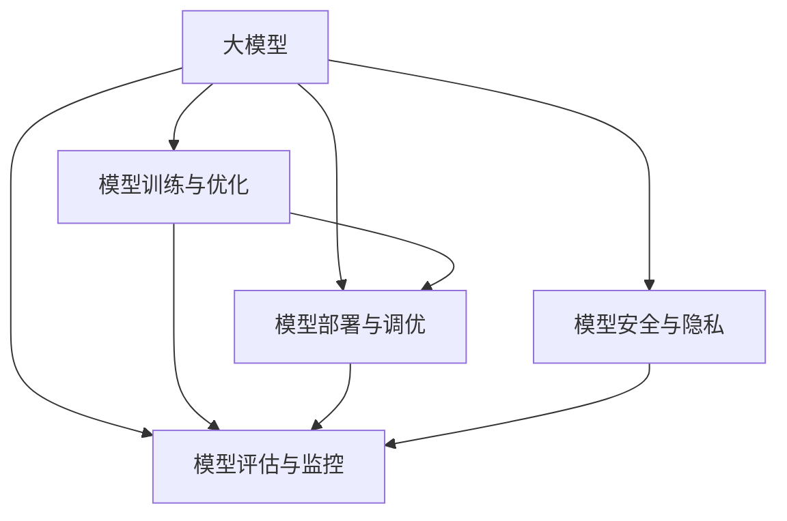

                 

# 大模型应用开发的实用技术

> 关键词：大模型应用开发, 实用技术, 深度学习, 人工智能, 算法优化, 模型部署, 场景应用, 技术创新

## 1. 背景介绍

在当今信息爆炸和数字化转型的背景下，大模型正迅速成为各行各业信息化和智能化改造的核心引擎。从自然语言处理(NLP)到计算机视觉(CV)，从语音识别到智能推荐，大模型以其强大的自适应能力和泛化能力，正在推动着AI技术的飞速发展。但大模型的开发和部署不仅需要前沿的算法和深奥的数学理论，更需要一整套实用技术支持。本文旨在系统介绍大模型在应用开发过程中所需掌握的实用技术，涵盖从模型构建、训练优化到模型部署的各个环节。

## 2. 核心概念与联系

### 2.1 核心概念概述

为更好地理解大模型应用开发的实用技术，本节将介绍几个密切相关的核心概念：

- **大模型(Large Model)**：以深度神经网络为代表的大规模模型，如BERT、GPT等，通过在大量数据上进行训练，具备强大的泛化能力和自适应能力。
- **模型训练与优化**：在大模型训练过程中，需采用各种优化算法（如梯度下降、Adam、RMSprop等）和正则化技术（如L2正则、Dropout等），以保证模型的收敛性和泛化能力。
- **模型部署与调优**：将训练好的模型部署到实际应用中，需要进行模型压缩、量化、模型服务化等一系列调优操作，以保证模型的实时性、效率和稳定性。
- **模型评估与监控**：对模型在实际应用中的表现进行评估，并实时监控模型的运行状态，以确保其符合业务需求和预期。
- **模型安全与隐私**：在大模型开发和应用过程中，需关注模型可能带来的潜在风险，如数据隐私泄露、模型偏见、安全性等，确保模型使用的合规性和安全性。

这些核心概念之间的逻辑关系可以通过以下Mermaid流程图来展示：



这个流程图展示了大模型应用开发中的核心概念及其之间的关系：

1. 大模型通过训练与优化获得良好的性能和泛化能力。
2. 经过优化后的模型再通过部署与调优，适配实际应用环境。
3. 部署后的模型需进行评估与监控，以确保其满足业务需求。
4. 在部署与调优过程中，还需考虑模型的安全与隐私，避免潜在的风险。

## 3. 核心算法原理 & 具体操作步骤
### 3.1 算法原理概述

大模型应用开发的实用技术涵盖了从模型构建到部署的各个环节，其核心算法原理可归纳为以下几个方面：

1. **数据预处理**：在大模型训练前，需对数据进行清洗、标准化、分片等预处理操作，以便于模型训练。
2. **模型构建**：选择合适的模型架构（如Transformer、CNN等），并使用深度学习框架（如PyTorch、TensorFlow等）进行模型定义。
3. **模型训练**：通过梯度下降等优化算法对模型参数进行迭代优化，同时采用各种正则化技术防止过拟合。
4. **模型调优**：在模型部署前，需进行量化、剪枝、模型压缩等调优操作，以提高模型的实时性和效率。
5. **模型部署**：将训练好的模型封装成标准化的服务接口，集成到实际应用系统中。
6. **模型监控**：实时监控模型的运行状态，及时发现和解决问题。
7. **模型安全**：对模型进行隐私保护和合规性检查，确保模型使用的安全性和合规性。

### 3.2 算法步骤详解

基于上述核心算法原理，大模型应用开发的具体操作步骤如下：

1. **数据预处理**：
   - 收集和清洗数据：收集相关的业务数据，并进行清洗、去重、标准化等操作。
   - 数据分片与拼接：将数据按比例分为训练集、验证集和测试集，并拼接成模型输入格式。
   - 数据增强：采用数据增强技术，如随机裁剪、翻转、旋转等，增加数据多样性，避免过拟合。

2. **模型构建**：
   - 选择合适的模型架构：根据任务需求选择合适的模型架构，如Transformer、ResNet等。
   - 定义模型层次结构：使用深度学习框架定义模型的输入、隐藏层和输出层，以及相应的权重和偏置。
   - 初始化模型参数：随机初始化模型的权重和偏置，并设置合适的学习率和优化器。

3. **模型训练**：
   - 定义损失函数：根据任务需求定义合适的损失函数，如交叉熵、均方误差等。
   - 迭代优化模型参数：使用梯度下降等优化算法，对模型参数进行迭代优化，同时加入正则化技术防止过拟合。
   - 定期评估模型：在训练过程中，定期在验证集上评估模型性能，以防止过拟合。

4. **模型调优**：
   - 模型压缩：通过量化、剪枝等技术，减小模型大小，提高推理速度。
   - 模型压缩：通过权重共享、层融合等技术，进一步压缩模型，提高实时性。
   - 模型优化：优化模型的计算图，减少计算量，提高效率。

5. **模型部署**：
   - 封装模型：将训练好的模型封装成标准化的服务接口，以便于调用。
   - 集成模型：将模型集成到实际应用系统中，如网站、移动应用等。
   - 测试与调优：对部署后的模型进行测试，优化性能，确保实时性。

6. **模型监控**：
   - 监控指标：实时监控模型的推理速度、准确率、错误率等指标。
   - 问题检测：通过监控及时发现模型异常，采取相应措施。

7. **模型安全**：
   - 隐私保护：采用数据加密、隐私保护技术，保护数据隐私。
   - 合规性检查：确保模型使用的合规性，遵守相关法律法规。

### 3.3 算法优缺点

大模型应用开发的实用技术具有以下优点：
1. 灵活性高：可以灵活选择不同的模型架构和优化算法，适应各种应用场景。
2. 泛化能力强：通过优化和调优，可以提升模型的泛化能力，适应更多业务需求。
3. 高效性：通过模型压缩和优化，可以提高模型的实时性和效率。
4. 可扩展性强：可以方便地将模型集成到不同的应用系统中，实现快速迭代。

但这些实用技术也存在一些缺点：
1. 复杂度高：从数据预处理到模型部署，需要经过多个步骤，过程较为复杂。
2. 资源消耗大：大模型的训练和调优需要大量计算资源和时间。
3. 依赖技术栈：不同的深度学习框架和优化算法，对技术人员的技术栈要求较高。
4. 技术门槛高：模型的构建、调优和监控需要较高的技术门槛，非专业人员难以掌握。

## 4. 数学模型和公式 & 详细讲解  
### 4.1 数学模型构建

在本节中，我们将使用数学语言对大模型应用开发的实用技术进行更加严格的刻画。

假设我们有一个大模型 $M$，用于解决某个特定的NLP任务。模型的输入为 $x$，输出为 $y$，其中 $x$ 为文本序列，$y$ 为分类标签。模型的输出为 $y'$，表示模型对输入 $x$ 的预测。模型的训练目标是最大化模型在训练集 $D$ 上的准确率。

定义损失函数 $\mathcal{L}(M)$ 为：

$$
\mathcal{L}(M) = -\frac{1}{N}\sum_{i=1}^N \log \sigma(M(x_i)) \cdot y_i
$$

其中 $\sigma$ 为模型输出层使用的激活函数，$y_i$ 为样本的标签。

模型的训练过程可以概括为以下步骤：

1. 定义损失函数 $\mathcal{L}(M)$。
2. 初始化模型参数 $\theta$。
3. 使用梯度下降等优化算法迭代更新模型参数。
4. 在训练集 $D$ 上反复迭代训练，直至模型收敛。

### 4.2 公式推导过程

以二分类任务为例，我们将进一步推导模型训练的具体步骤。

假设模型的输出层使用 sigmoid 激活函数，即：

$$
\sigma(M(x)) = \frac{1}{1 + e^{-M(x)}}
$$

则损失函数可以表示为：

$$
\mathcal{L}(M) = -\frac{1}{N}\sum_{i=1}^N y_i \log \sigma(M(x_i)) + (1-y_i) \log (1-\sigma(M(x_i)))
$$

其梯度可以表示为：

$$
\nabla_{\theta} \mathcal{L}(M) = -\frac{1}{N}\sum_{i=1}^N \left( y_i (\sigma(M(x_i)) - 1) \nabla_{\theta} M(x_i) \right)
$$

其中 $\nabla_{\theta} M(x_i)$ 为模型输出对参数 $\theta$ 的梯度，可以使用反向传播算法计算。

通过迭代更新参数 $\theta$，最小化损失函数 $\mathcal{L}(M)$，即可得到训练好的模型 $M$。

### 4.3 案例分析与讲解

假设我们有一个二分类文本分类任务，训练集 $D = \{(x_i, y_i)\}_{i=1}^N$，其中 $x_i$ 为文本序列，$y_i \in \{0, 1\}$。我们使用一个Transformer模型 $M_{\theta}$ 进行训练，其中 $\theta$ 为模型参数。

1. **数据预处理**：
   - 收集文本数据：收集相关的业务文本数据。
   - 文本分词：对文本进行分词，生成模型输入序列。
   - 标签编码：将分类标签 $y_i$ 编码为模型输出序列。

2. **模型构建**：
   - 定义Transformer模型：使用PyTorch框架定义Transformer模型，并随机初始化模型参数 $\theta$。
   - 定义损失函数：定义交叉熵损失函数 $\mathcal{L}(M_{\theta})$。

3. **模型训练**：
   - 迭代优化模型参数：使用Adam优化算法迭代更新模型参数 $\theta$，最小化损失函数 $\mathcal{L}(M_{\theta})$。
   - 定期评估模型：在验证集上评估模型性能，防止过拟合。

4. **模型调优**：
   - 模型压缩：通过量化、剪枝等技术，减小模型大小，提高推理速度。
   - 模型优化：优化模型的计算图，减少计算量，提高效率。

5. **模型部署**：
   - 封装模型：将训练好的模型封装成标准化的服务接口，如TensorFlow Serving、Fiddler等。
   - 集成模型：将模型集成到实际应用系统中，如网站、移动应用等。

6. **模型监控**：
   - 监控指标：实时监控模型的推理速度、准确率、错误率等指标。
   - 问题检测：通过监控及时发现模型异常，采取相应措施。

7. **模型安全**：
   - 隐私保护：采用数据加密、隐私保护技术，保护数据隐私。
   - 合规性检查：确保模型使用的合规性，遵守相关法律法规。

## 5. 项目实践：代码实例和详细解释说明
### 5.1 开发环境搭建

在进行大模型应用开发的实用技术实践前，我们需要准备好开发环境。以下是使用Python进行PyTorch开发的环境配置流程：

1. 安装Anaconda：从官网下载并安装Anaconda，用于创建独立的Python环境。

2. 创建并激活虚拟环境：
```bash
conda create -n pytorch-env python=3.8 
conda activate pytorch-env
```

3. 安装PyTorch：根据CUDA版本，从官网获取对应的安装命令。例如：
```bash
conda install pytorch torchvision torchaudio cudatoolkit=11.1 -c pytorch -c conda-forge
```

4. 安装TensorFlow：
```bash
conda install tensorflow
```

5. 安装各类工具包：
```bash
pip install numpy pandas scikit-learn matplotlib tqdm jupyter notebook ipython
```

完成上述步骤后，即可在`pytorch-env`环境中开始实用技术实践。

### 5.2 源代码详细实现

这里我们以文本分类任务为例，给出使用PyTorch进行模型训练和调优的完整代码实现。

首先，定义数据处理函数：

```python
from torch.utils.data import Dataset
from transformers import BertTokenizer

class TextDataset(Dataset):
    def __init__(self, texts, labels, tokenizer):
        self.texts = texts
        self.labels = labels
        self.tokenizer = tokenizer
        
    def __len__(self):
        return len(self.texts)
    
    def __getitem__(self, item):
        text = self.texts[item]
        label = self.labels[item]
        
        encoding = self.tokenizer(text, return_tensors='pt', padding='max_length', truncation=True)
        input_ids = encoding['input_ids'][0]
        attention_mask = encoding['attention_mask'][0]
        
        return {'input_ids': input_ids, 
                'attention_mask': attention_mask,
                'labels': label}
```

然后，定义模型和优化器：

```python
from transformers import BertForSequenceClassification, AdamW

model = BertForSequenceClassification.from_pretrained('bert-base-cased', num_labels=2)

optimizer = AdamW(model.parameters(), lr=2e-5)
```

接着，定义训练和评估函数：

```python
from torch.utils.data import DataLoader
from tqdm import tqdm

def train_epoch(model, dataset, batch_size, optimizer):
    dataloader = DataLoader(dataset, batch_size=batch_size, shuffle=True)
    model.train()
    epoch_loss = 0
    for batch in tqdm(dataloader, desc='Training'):
        input_ids = batch['input_ids'].to(device)
        attention_mask = batch['attention_mask'].to(device)
        labels = batch['labels'].to(device)
        model.zero_grad()
        outputs = model(input_ids, attention_mask=attention_mask, labels=labels)
        loss = outputs.loss
        epoch_loss += loss.item()
        loss.backward()
        optimizer.step()
    return epoch_loss / len(dataloader)

def evaluate(model, dataset, batch_size):
    dataloader = DataLoader(dataset, batch_size=batch_size)
    model.eval()
    preds, labels = [], []
    with torch.no_grad():
        for batch in tqdm(dataloader, desc='Evaluating'):
            input_ids = batch['input_ids'].to(device)
            attention_mask = batch['attention_mask'].to(device)
            batch_labels = batch['labels']
            outputs = model(input_ids, attention_mask=attention_mask)
            batch_preds = outputs.logits.argmax(dim=2).to('cpu').tolist()
            batch_labels = batch_labels.to('cpu').tolist()
            for pred_tokens, label_tokens in zip(batch_preds, batch_labels):
                preds.append(pred_tokens[:len(label_tokens)])
                labels.append(label_tokens)
                
    print(classification_report(labels, preds))
```

最后，启动训练流程并在测试集上评估：

```python
epochs = 5
batch_size = 16

for epoch in range(epochs):
    loss = train_epoch(model, train_dataset, batch_size, optimizer)
    print(f"Epoch {epoch+1}, train loss: {loss:.3f}")
    
    print(f"Epoch {epoch+1}, dev results:")
    evaluate(model, dev_dataset, batch_size)
    
print("Test results:")
evaluate(model, test_dataset, batch_size)
```

以上就是使用PyTorch对BERT进行文本分类任务训练和调优的完整代码实现。可以看到，得益于HuggingFace的Transformer库，我们可以用相对简洁的代码完成BERT模型的构建和调优。

### 5.3 代码解读与分析

让我们再详细解读一下关键代码的实现细节：

**TextDataset类**：
- `__init__`方法：初始化文本、标签、分词器等关键组件。
- `__len__`方法：返回数据集的样本数量。
- `__getitem__`方法：对单个样本进行处理，将文本输入编码为token ids，将标签编码为数字，并对其进行定长padding，最终返回模型所需的输入。

**模型和优化器**：
- 使用BertForSequenceClassification定义Transformer模型，设置合适的超参数。
- 使用AdamW优化器进行模型参数的更新，设置合适的学习率。

**训练和评估函数**：
- 使用PyTorch的DataLoader对数据集进行批次化加载，供模型训练和推理使用。
- 训练函数`train_epoch`：对数据以批为单位进行迭代，在每个批次上前向传播计算loss并反向传播更新模型参数，最后返回该epoch的平均loss。
- 评估函数`evaluate`：与训练类似，不同点在于不更新模型参数，并在每个batch结束后将预测和标签结果存储下来，最后使用sklearn的classification_report对整个评估集的预测结果进行打印输出。

**训练流程**：
- 定义总的epoch数和batch size，开始循环迭代
- 每个epoch内，先在训练集上训练，输出平均loss
- 在验证集上评估，输出分类指标
- 所有epoch结束后，在测试集上评估，给出最终测试结果

可以看到，PyTorch配合HuggingFace的Transformer库使得模型构建和调优的代码实现变得简洁高效。开发者可以将更多精力放在数据处理、模型改进等高层逻辑上，而不必过多关注底层的实现细节。

当然，工业级的系统实现还需考虑更多因素，如模型的保存和部署、超参数的自动搜索、更灵活的任务适配层等。但核心的实用技术基本与此类似。

## 6. 实际应用场景
### 6.1 智能客服系统

基于大模型应用开发的实用技术，智能客服系统可以显著提升客户咨询体验和问题解决效率。传统客服往往需要配备大量人力，高峰期响应缓慢，且一致性和专业性难以保证。而使用微调后的对话模型，可以7x24小时不间断服务，快速响应客户咨询，用自然流畅的语言解答各类常见问题。

在技术实现上，可以收集企业内部的历史客服对话记录，将问题和最佳答复构建成监督数据，在此基础上对预训练对话模型进行微调。微调后的对话模型能够自动理解用户意图，匹配最合适的答案模板进行回复。对于客户提出的新问题，还可以接入检索系统实时搜索相关内容，动态组织生成回答。如此构建的智能客服系统，能大幅提升客户咨询体验和问题解决效率。

### 6.2 金融舆情监测

金融机构需要实时监测市场舆论动向，以便及时应对负面信息传播，规避金融风险。传统的人工监测方式成本高、效率低，难以应对网络时代海量信息爆发的挑战。基于大模型应用开发的实用技术，金融舆情监测得以实现实时化、智能化。

具体而言，可以收集金融领域相关的新闻、报道、评论等文本数据，并对其进行主题标注和情感标注。在此基础上对预训练语言模型进行微调，使其能够自动判断文本属于何种主题，情感倾向是正面、中性还是负面。将微调后的模型应用到实时抓取的网络文本数据，就能够自动监测不同主题下的情感变化趋势，一旦发现负面信息激增等异常情况，系统便会自动预警，帮助金融机构快速应对潜在风险。

### 6.3 个性化推荐系统

当前的推荐系统往往只依赖用户的历史行为数据进行物品推荐，无法深入理解用户的真实兴趣偏好。基于大模型应用开发的实用技术，个性化推荐系统可以更好地挖掘用户行为背后的语义信息，从而提供更精准、多样的推荐内容。

在实践中，可以收集用户浏览、点击、评论、分享等行为数据，提取和用户交互的物品标题、描述、标签等文本内容。将文本内容作为模型输入，用户的后续行为（如是否点击、购买等）作为监督信号，在此基础上微调预训练语言模型。微调后的模型能够从文本内容中准确把握用户的兴趣点。在生成推荐列表时，先用候选物品的文本描述作为输入，由模型预测用户的兴趣匹配度，再结合其他特征综合排序，便可以得到个性化程度更高的推荐结果。

### 6.4 未来应用展望

随着大模型和实用技术的不断发展，基于微调的方法将在更多领域得到应用，为传统行业带来变革性影响。

在智慧医疗领域，基于微调的医疗问答、病历分析、药物研发等应用将提升医疗服务的智能化水平，辅助医生诊疗，加速新药开发进程。

在智能教育领域，微调技术可应用于作业批改、学情分析、知识推荐等方面，因材施教，促进教育公平，提高教学质量。

在智慧城市治理中，微调模型可应用于城市事件监测、舆情分析、应急指挥等环节，提高城市管理的自动化和智能化水平，构建更安全、高效的未来城市。

此外，在企业生产、社会治理、文娱传媒等众多领域，基于大模型应用开发的实用技术也将不断涌现，为NLP技术带来新的突破。相信随着预训练语言模型和微调方法的持续演进，这些技术的落地应用将进一步拓展，推动人工智能技术向更广阔的领域发展。

## 7. 工具和资源推荐
### 7.1 学习资源推荐

为了帮助开发者系统掌握大模型应用开发的实用技术，这里推荐一些优质的学习资源：

1. **《深度学习入门》**：邱锡纯著，全面介绍了深度学习的基本概念和常用模型，是入门级读者必读之作。
2. **《TensorFlow实战》**：极客时间出版的实战教程，详细讲解了TensorFlow的使用方法和最佳实践。
3. **《PyTorch深度学习实践》**：李沐著，介绍了PyTorch的基本用法和模型构建技巧。
4. **《Transformer从原理到实践》**：HuggingFace官方博客系列，详细讲解了Transformer模型和微调技术的原理与实践。
5. **《自然语言处理入门》**：斯坦福大学提供的入门课程，包含大量的NLP项目和代码示例。

通过对这些资源的学习实践，相信你一定能够快速掌握大模型应用开发的实用技术，并用于解决实际的NLP问题。
###  7.2 开发工具推荐

高效的开发离不开优秀的工具支持。以下是几款用于大模型应用开发实用技术开发的常用工具：

1. **PyTorch**：基于Python的开源深度学习框架，灵活动态的计算图，适合快速迭代研究。大部分预训练语言模型都有PyTorch版本的实现。
2. **TensorFlow**：由Google主导开发的开源深度学习框架，生产部署方便，适合大规模工程应用。同样有丰富的预训练语言模型资源。
3. **Transformers库**：HuggingFace开发的NLP工具库，集成了众多SOTA语言模型，支持PyTorch和TensorFlow，是进行实用技术开发的利器。
4. **Weights & Biases**：模型训练的实验跟踪工具，可以记录和可视化模型训练过程中的各项指标，方便对比和调优。与主流深度学习框架无缝集成。
5. **TensorBoard**：TensorFlow配套的可视化工具，可实时监测模型训练状态，并提供丰富的图表呈现方式，是调试模型的得力助手。
6. **Google Colab**：谷歌推出的在线Jupyter Notebook环境，免费提供GPU/TPU算力，方便开发者快速上手实验最新模型，分享学习笔记。

合理利用这些工具，可以显著提升大模型应用开发的效率，加快创新迭代的步伐。

### 7.3 相关论文推荐

大模型和实用技术的发展源于学界的持续研究。以下是几篇奠基性的相关论文，推荐阅读：

1. **Attention is All You Need**：提出Transformer结构，开启了NLP领域的预训练大模型时代。
2. **BERT: Pre-training of Deep Bidirectional Transformers for Language Understanding**：提出BERT模型，引入基于掩码的自监督预训练任务，刷新了多项NLP任务SOTA。
3. **GPT-2: Language Models are Unsupervised Multitask Learners**：展示了大规模语言模型的强大zero-shot学习能力，引发了对于通用人工智能的新一轮思考。
4. **Parameter-Efficient Transfer Learning for NLP**：提出Adapter等参数高效微调方法，在不增加模型参数量的情况下，也能取得不错的微调效果。
5. **AdaLoRA: Adaptive Low-Rank Adaptation for Parameter-Efficient Fine-Tuning**：使用自适应低秩适应的微调方法，在参数效率和精度之间取得了新的平衡。
6. **Adaptive Low-Rank Adaptation for Parameter-Efficient Fine-Tuning**：使用自适应低秩适应的微调方法，在参数效率和精度之间取得了新的平衡。

这些论文代表了大模型应用开发实用技术的发展脉络。通过学习这些前沿成果，可以帮助研究者把握学科前进方向，激发更多的创新灵感。

## 8. 总结：未来发展趋势与挑战

### 8.1 总结

本文对大模型应用开发的实用技术进行了全面系统的介绍。首先阐述了大模型和实用技术的研究背景和意义，明确了实用技术在模型构建、训练优化、模型部署等方面的重要性。其次，从原理到实践，详细讲解了实用技术的数学原理和关键步骤，给出了实用技术任务开发的完整代码实例。同时，本文还广泛探讨了实用技术在智能客服、金融舆情、个性化推荐等多个行业领域的应用前景，展示了实用技术范式的巨大潜力。此外，本文精选了实用技术的学习资源，力求为读者提供全方位的技术指引。

通过本文的系统梳理，可以看到，大模型应用开发的实用技术正在成为大模型应用落地的重要范式，极大地拓展了预训练语言模型的应用边界，催生了更多的落地场景。得益于大规模语料的预训练和微调方法的不断演进，实用技术在大模型应用中发挥着至关重要的作用，为NLP技术在各行各业的落地应用提供了坚实的基础。未来，随着实用技术的不断优化和创新，大模型应用开发必将在更多领域得到应用，为人工智能技术的发展注入新的动力。

### 8.2 未来发展趋势

展望未来，大模型应用开发的实用技术将呈现以下几个发展趋势：

1. **模型规模持续增大**：随着算力成本的下降和数据规模的扩张，预训练语言模型的参数量还将持续增长。超大规模语言模型蕴含的丰富语言知识，有望支撑更加复杂多变的下游任务微调。
2. **实用技术日趋多样**：除了传统的全参数微调外，未来会涌现更多参数高效的微调方法，如Prefix-Tuning、LoRA等，在节省计算资源的同时也能保证微调精度。
3. **持续学习成为常态**：随着数据分布的不断变化，实用技术模型也需要持续学习新知识以保持性能。如何在不遗忘原有知识的同时，高效吸收新样本信息，将成为重要的研究课题。
4. **标注样本需求降低**：受启发于提示学习(Prompt-based Learning)的思路，未来的实用技术方法将更好地利用大模型的语言理解能力，通过更加巧妙的任务描述，在更少的标注样本上也能实现理想的微调效果。
5. **少样本学习崛起**：未来的实用技术将更加注重少样本学习能力的提升，使得模型在少量标注数据的情况下，仍能取得不错的性能。
6. **模型通用性增强**：经过海量数据的预训练和多领域任务的微调，未来的实用技术模型将具备更强大的常识推理和跨领域迁移能力，逐步迈向通用人工智能(AGI)的目标。

以上趋势凸显了大模型应用开发实用技术的广阔前景。这些方向的探索发展，必将进一步提升大模型实用技术的性能和应用范围，为人工智能技术的发展注入新的动力。

### 8.3 面临的挑战

尽管大模型应用开发的实用技术已经取得了瞩目成就，但在迈向更加智能化、普适化应用的过程中，它仍面临着诸多挑战：

1. **标注成本瓶颈**：虽然微调大大降低了标注数据的需求，但对于长尾应用场景，难以获得充足的高质量标注数据，成为制约实用技术性能的瓶颈。如何进一步降低实用技术对标注样本的依赖，将是一大难题。
2. **模型鲁棒性不足**：当前实用技术模型面对域外数据时，泛化性能往往大打折扣。对于测试样本的微小扰动，实用技术模型的预测也容易发生波动。如何提高实用技术模型的鲁棒性，避免灾难性遗忘，还需要更多理论和实践的积累。
3. **推理效率有待提高**：大规模语言模型虽然精度高，但在实际部署时往往面临推理速度慢、内存占用大等效率问题。如何在保证性能的同时，简化模型结构，提升推理速度，优化资源占用，将是重要的优化方向。
4. **可解释性亟需加强**：当前实用技术模型更像是"黑盒"系统，难以解释其内部工作机制和决策逻辑。对于医疗、金融等高风险应用，算法的可解释性和可审计性尤为重要。如何赋予实用技术模型更强的可解释性，将是亟待攻克的难题。
5. **安全性有待保障**：预训练语言模型难免会学习到有偏见、有害的信息，通过实用技术传递到下游任务，产生误导性、歧视性的输出，给实际应用带来安全隐患。如何从数据和算法层面消除实用技术模型的偏见，避免恶意用途，确保输出的安全性，也将是重要的研究课题。
6. **知识整合能力不足**：现有的实用技术模型往往局限于任务内数据，难以灵活吸收和运用更广泛的先验知识。如何让实用技术过程更好地与外部知识库、规则库等专家知识结合，形成更加全面、准确的信息整合能力，还有很大的想象空间。

正视实用技术面临的这些挑战，积极应对并寻求突破，将是大模型应用开发实用技术的必由之路。相信随着学界和产业界的共同努力，这些挑战终将一一被克服，实用技术必将在构建人机协同的智能时代中扮演越来越重要的角色。

### 8.4 研究展望

面向未来，实用技术的创新发展将引领大模型应用向更加智能化、普适化、可解释化方向迈进。以下是一些值得关注的研究方向：

1. **无监督和半监督实用技术**：摆脱对大规模标注数据的依赖，利用自监督学习、主动学习等无监督和半监督范式，最大限度利用非结构化数据，实现更加灵活高效的实用技术。
2. **参数高效实用技术**：开发更加参数高效的实用技术方法，在固定大部分预训练参数的同时，只更新极少量的任务相关参数。
3. **因果分析和博弈论工具**：将因果分析方法引入实用技术模型，识别出模型决策的关键特征，增强输出解释的因果性和逻辑性。借助博弈论工具刻画人机交互过程，主动探索并规避模型的脆弱点，提高系统稳定性。
4. **多模态实用技术**：将符号化的先验知识，如知识图谱、逻辑规则等，与神经网络模型进行巧妙融合，引导实用技术过程学习更准确、合理的语言模型。同时加强不同模态数据的整合，实现视觉、语音等多模态信息与文本信息的协同建模。
5. **伦理道德约束**：在实用技术训练目标中引入伦理导向的评估指标，过滤和惩罚有偏见、有害的输出倾向。同时加强人工干预和审核，建立实用技术模型的监管机制，确保模型使用的安全性和合规性。

这些研究方向的探索，必将引领实用技术向更高的台阶发展，为构建安全、可靠、可解释、可控的智能系统铺平道路。面向未来，实用技术还需要与其他人工智能技术进行更深入的融合，如知识表示、因果推理、强化学习等，多路径协同发力，共同推动人工智能技术的发展。只有勇于创新、敢于突破，才能不断拓展实用技术的边界，让智能技术更好地造福人类社会。

## 9. 附录：常见问题与解答

**Q1：大模型应用开发是否需要掌握多种深度学习框架？**

A: 大模型应用开发通常需要使用多个深度学习框架，如PyTorch、TensorFlow等。掌握这些框架的基本用法和最佳实践，是进行实用技术开发的基础。但并非需要全面掌握每种框架，只需要根据具体任务和项目需求选择适合的框架即可。

**Q2：实用技术训练过程中如何防止过拟合？**

A: 实用技术训练过程中防止过拟合可以采用以下策略：
1. 数据增强：通过回译、近义替换等方式扩充训练集。
2. 正则化：使用L2正则、Dropout、Early Stopping等技术防止过拟合。
3. 对抗训练：加入对抗样本，提高模型鲁棒性。
4. 模型压缩：通过量化、剪枝等技术减小模型大小，避免过拟合。

**Q3：实用技术模型部署时需要注意哪些问题？**

A: 实用技术模型部署时需要注意以下问题：
1. 模型裁剪：去除不必要的层和参数，减小模型尺寸，加快推理速度。
2. 模型压缩：通过量化、剪枝等技术，进一步压缩模型，提高实时性。
3. 模型优化：优化模型的计算图，减少计算量，提高效率。
4. 模型服务化：将模型封装成标准化的服务接口，如TensorFlow Serving、Fiddler等。

**Q4：实用技术模型调优时如何进行参数高效微调？**

A: 实用技术模型调优时进行参数高效微调可以采用以下策略：
1. 使用Adapter等参数高效微调方法，在固定大部分预训练参数的情况下，只更新极少量的任务相关参数。
2. 引入Prefix-Tuning等技术，通过在输入文本中添加提示模板(Prompt Template)，引导模型按期望方式输出，减少微调参数。
3. 使用LoRA等轻量级微调方法，在不改变预训练权重的情况下，只更新一小部分顶层参数。

**Q5：实用技术模型训练过程中如何设置合适的学习率？**

A: 实用技术模型训练过程中设置合适的学习率可以采用以下策略：
1. 使用warmup策略，在开始阶段使用较小的学习率，再逐渐过渡到预设值。
2. 根据任务需求和学习曲线调整学习率。
3. 采用动态学习率调整策略，如学习率衰减等。

**Q6：实用技术模型调优时如何进行模型压缩？**

A: 实用技术模型调优时进行模型压缩可以采用以下策略：
1. 量化：将浮点模型转为定点模型，压缩存储空间，提高计算效率。
2. 剪枝：去除冗余的连接和参数，减小模型大小，提高推理速度。
3. 权重共享：通过共享权重减少模型参数，提高推理效率。
4. 模型融合：将多个模型进行融合，减小单个模型的复杂度。

**Q7：实用技术模型评估与监控过程中需要注意哪些问题？**

A: 实用技术模型评估与监控过程中需要注意以下问题：
1. 监控指标：实时监控模型的推理速度、准确率、错误率等指标。
2. 问题检测：通过监控及时发现模型异常，采取相应措施。
3. 模型更新：根据监控结果定期更新模型参数，避免过拟合。

**Q8：实用技术模型安全与隐私过程中需要注意哪些问题？**

A: 实用技术模型安全与隐私过程中需要注意以下问题：
1. 隐私保护：采用数据加密、隐私保护技术，保护数据隐私。
2. 合规性检查：确保模型使用的合规性，遵守相关法律法规。
3. 模型审计：定期对模型进行审计，发现和修复潜在的安全漏洞。

通过回答这些问题，可以帮助读者更好地理解实用技术开发和应用的各个环节，从而更加高效地进行大模型应用开发。

---

作者：禅与计算机程序设计艺术 / Zen and the Art of Computer Programming

