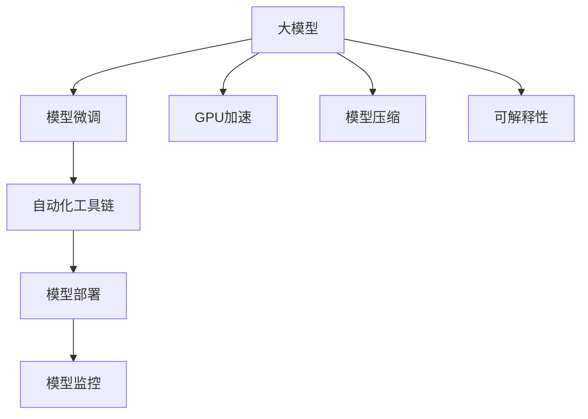

                 

# 大模型应用落地加速，AI商业化进程提速

> 关键词：大模型应用，AI商业化，深度学习，自动化，模型微调，GPU加速，模型压缩，应用部署，可解释性，自动化工具链

## 1. 背景介绍

### 1.1 问题由来

近年来，人工智能(AI)技术迅猛发展，特别是深度学习模型的性能不断突破，逐渐从实验室走向实际应用。但是，这些高精度的大模型往往依赖于大量的数据和计算资源进行训练，训练成本和部署成本居高不下。同时，模型的可解释性和实际应用中模型的鲁棒性也是商业化落地的一大难题。如何加速AI商业化进程，让更多人能够以较低成本享受高质量的AI技术，成为了当前研究热点。

### 1.2 问题核心关键点

大模型的应用落地涉及模型压缩、自动化工具链、模型微调、模型加速、模型解释性等多个方面，各个关键点相互关联，共同构成了大模型应用落地的核心问题。如何有效解决这些关键点，实现模型的快速、高效、稳定应用，成为了当前研究的重点。

## 2. 核心概念与联系

### 2.1 核心概念概述

为了更好地理解大模型应用落地的过程，本节将介绍几个关键概念：

- 大模型：以深度神经网络为代表的、拥有大量参数的模型，如BERT、GPT等，具备强大的表示学习能力和泛化能力。
- 模型微调：在已有大模型的基础上，使用特定任务的数据对其进行有监督的训练，以提升其在特定任务上的性能。
- GPU加速：使用GPU硬件进行深度学习模型的训练和推理，以大幅提升计算效率。
- 模型压缩：对大模型进行剪枝、量化等技术手段，减少模型大小，提高模型推理速度。
- 自动化工具链：包含模型训练、微调、部署、监控等各个环节的自动化流程，旨在降低模型应用成本，提高效率。
- 可解释性：模型推理过程的可解释性，有助于理解模型行为，提升用户信任。

这些核心概念之间的逻辑关系可以通过以下Mermaid流程图来展示：



这个流程图展示了大模型应用落地的关键环节和逻辑关系：

1. 大模型通过模型微调获得特定任务上的性能提升。
2. GPU加速提高模型训练和推理的速度。
3. 模型压缩减小模型大小，优化计算效率。
4. 自动化工具链实现模型应用的自动化流程。
5. 模型部署和监控确保模型在实际应用中的稳定性和安全性。
6. 可解释性提升用户对模型决策的理解和信任。

这些概念共同构成了大模型应用落地的核心框架，使得模型能够更加高效、灵活地应用于各种实际场景。

## 3. 核心算法原理 & 具体操作步骤

### 3.1 算法原理概述

大模型应用落地的核心在于如何高效地将模型转化为适用于特定场景的应用形式，并在其中获得最优的性能。这一过程通常包括以下几个步骤：

1. 选择合适的预训练模型，如BERT、GPT等，进行微调。
2. 利用GPU硬件加速训练和推理过程，提高效率。
3. 对模型进行剪枝和量化，减小模型大小，提升推理速度。
4. 构建自动化工具链，实现模型的训练、微调、部署和监控等环节的自动化。
5. 增强模型的可解释性，让用户能够理解和信任模型的输出结果。

### 3.2 算法步骤详解

以下是大模型应用落地的具体步骤：

**Step 1: 模型选择与数据准备**

- 选择合适的预训练模型，并下载对应的权重。
- 准备特定任务的数据集，划分为训练集、验证集和测试集。
- 使用Python、PyTorch等工具进行数据预处理和特征工程。

**Step 2: 模型微调和GPU加速**

- 使用GPU硬件进行模型微调训练，以提升训练速度。
- 设置合适的学习率、批大小、迭代轮数等超参数，防止过拟合。
- 利用数据增强、正则化等技术提高模型泛化能力。

**Step 3: 模型压缩**

- 对微调后的模型进行剪枝，去除冗余参数和层。
- 使用量化技术将模型转换为定点形式，减小存储空间和计算时间。
- 优化模型计算图，减少前向传播和反向传播的计算量。

**Step 4: 自动化工具链构建**

- 使用工具链将模型集成到应用系统中，如Flask、TorchServe等。
- 实现模型的远程部署和自动重启机制，确保系统高可用性。
- 设置监控指标，实时跟踪模型性能和资源使用情况。

**Step 5: 模型解释性增强**

- 使用可解释性工具，如LIME、SHAP等，分析模型输出。
- 在模型中引入自监督学习、因果推断等方法，增强模型解释性。
- 构建友好的UI界面，使用户能够直观地理解模型行为。

### 3.3 算法优缺点

大模型应用落地的优点包括：

1. 高效性：利用GPU硬件和自动化工具链，大幅提升模型训练和推理速度。
2. 模型压缩：减小模型大小，优化计算效率。
3. 可解释性：提升用户对模型输出的理解和信任。

其缺点主要有：

1. 数据需求高：大模型训练需要大量高质量的数据，获取和标注数据成本较高。
2. 模型泛化能力有限：微调模型的泛化能力受限于标注数据集的规模和多样性。
3. 模型复杂度高：大模型参数量巨大，模型压缩和优化仍需不断迭代。
4. 自动化流程复杂：自动化工具链的构建和维护需要一定的技术积累。

尽管存在这些缺点，但总体上，大模型应用落地技术仍是大数据、大算力时代AI商业化的重要手段。未来相关研究的重点在于如何进一步优化各个环节的流程，降低应用成本，提升模型的稳定性和可解释性。

### 3.4 算法应用领域

大模型应用落地的技术已经在多个领域得到应用，如：

- 金融风控：利用模型进行信用评分、欺诈检测等任务，提高金融业务效率和风险控制能力。
- 医疗诊断：通过模型分析医疗图像、病历等数据，辅助医生进行疾病诊断和治疗方案选择。
- 工业制造：使用模型进行质量检测、设备维护等，提高生产效率和产品品质。
- 电商推荐：利用模型进行个性化推荐，提升用户体验和转化率。
- 智能客服：通过模型处理用户咨询，提升客服响应速度和满意度。

除了这些典型应用外，大模型技术还被创新性地应用到更多场景中，如智慧城市、自动驾驶、智能家居等，为各行各业带来了新的发展契机。

## 4. 数学模型和公式 & 详细讲解 & 举例说明

### 4.1 数学模型构建

假设模型参数为 $\theta$，数据集为 $D=\{(x_i, y_i)\}_{i=1}^N$，其中 $x_i \in \mathbb{R}^d$ 为输入， $y_i \in \mathbb{R}$ 为标签。定义模型在数据集 $D$ 上的损失函数为：

$$
\mathcal{L}(\theta) = \frac{1}{N} \sum_{i=1}^N (y_i - f(x_i, \theta))^2
$$

其中 $f(x_i, \theta)$ 为模型在输入 $x_i$ 上的输出。

### 4.2 公式推导过程

以二分类任务为例，使用逻辑回归模型进行微调：

- 定义模型输出为 $f(x_i, \theta) = \sigma(\theta^T \phi(x_i))$，其中 $\sigma$ 为 sigmoid 函数， $\phi(x_i)$ 为特征映射函数。
- 损失函数为交叉熵损失函数：

$$
\ell(y_i, f(x_i, \theta)) = -(y_i \log f(x_i, \theta) + (1-y_i) \log (1-f(x_i, \theta)))
$$

- 定义模型在数据集 $D$ 上的经验风险为：

$$
\mathcal{L}(\theta) = -\frac{1}{N} \sum_{i=1}^N \ell(y_i, f(x_i, \theta))
$$

- 使用梯度下降等优化算法更新模型参数 $\theta$：

$$
\theta \leftarrow \theta - \eta \nabla_{\theta} \mathcal{L}(\theta)
$$

其中 $\eta$ 为学习率， $\nabla_{\theta} \mathcal{L}(\theta)$ 为损失函数对参数 $\theta$ 的梯度。

### 4.3 案例分析与讲解

假设模型应用于医疗图像分类任务，使用谷歌Net结构，数据集为乳腺癌图像分类数据集。具体步骤如下：

1. 数据准备：收集乳腺癌图像数据集，划分为训练集、验证集和测试集。
2. 模型微调：在 GoogleNet 基础上进行微调，学习图像特征分类。
3. GPU 加速：使用 NVIDIA Tesla P100 GPU 进行模型微调训练。
4. 模型压缩：对微调后的模型进行剪枝和量化，减小模型大小，优化推理速度。
5. 自动化工具链：使用 TensorFlow Serving 进行模型部署，设置监控指标，实时跟踪模型性能。

## 5. 项目实践：代码实例和详细解释说明

### 5.1 开发环境搭建

在进行项目实践前，我们需要准备好开发环境。以下是使用Python进行TensorFlow开发的环境配置流程：

1. 安装Anaconda：从官网下载并安装Anaconda，用于创建独立的Python环境。

2. 创建并激活虚拟环境：
```bash
conda create -n tf-env python=3.8 
conda activate tf-env
```

3. 安装TensorFlow：从官网获取对应的安装命令。例如：
```bash
conda install tensorflow==2.7
```

4. 安装TensorBoard：
```bash
pip install tensorboard
```

5. 安装Pillow：用于图像处理：
```bash
pip install Pillow
```

6. 安装OpenCV：用于图像读取和预处理：
```bash
pip install opencv-python
```

完成上述步骤后，即可在 `tf-env` 环境中开始项目实践。

### 5.2 源代码详细实现

以下是一个基于TensorFlow和Keras的深度学习模型微调和GPU加速的代码实现。

```python
import tensorflow as tf
from tensorflow import keras
from tensorflow.keras import layers
import numpy as np
from PIL import Image
import cv2
import os

# 加载模型
model = keras.models.load_model('model.h5')

# 定义数据集路径
train_data_dir = 'train/'
val_data_dir = 'val/'

# 定义数据预处理函数
def preprocess_input(x):
    x = cv2.imread(os.path.join(train_data_dir, x), cv2.IMREAD_GRAYSCALE)
    x = np.array(x, dtype=np.float32) / 255.0
    return x

# 加载训练数据集
train_images = []
train_labels = []

for img in os.listdir(train_data_dir):
    if img.endswith('.jpg'):
        train_images.append(os.path.join(train_data_dir, img))
        train_labels.append(int(img.split('.')[0].split('_')[1]))

# 加载验证数据集
val_images = []
val_labels = []

for img in os.listdir(val_data_dir):
    if img.endswith('.jpg'):
        val_images.append(os.path.join(val_data_dir, img))
        val_labels.append(int(img.split('.')[0].split('_')[1]))

# 将数据集划分为训练集和验证集
train_dataset = tf.data.Dataset.from_tensor_slices((train_images, train_labels))
train_dataset = train_dataset.shuffle(1024).batch(32)

val_dataset = tf.data.Dataset.from_tensor_slices((val_images, val_labels))
val_dataset = val_dataset.shuffle(1024).batch(32)

# 定义模型
model = keras.Sequential([
    layers.Conv2D(32, (3,3), activation='relu', input_shape=(224, 224, 3)),
    layers.MaxPooling2D((2,2)),
    layers.Conv2D(64, (3,3), activation='relu'),
    layers.MaxPooling2D((2,2)),
    layers.Flatten(),
    layers.Dense(128, activation='relu'),
    layers.Dense(1, activation='sigmoid')
])

# 编译模型
model.compile(optimizer='adam', loss='binary_crossentropy', metrics=['accuracy'])

# 训练模型
model.fit(train_dataset, epochs=10, validation_data=val_dataset)

# 保存模型
model.save('model.h5')
```

### 5.3 代码解读与分析

让我们再详细解读一下关键代码的实现细节：

**数据准备**：
- 定义数据集路径，包括训练集和验证集路径。
- 定义数据预处理函数 `preprocess_input`，对图像进行灰度化处理和归一化。

**模型定义和编译**：
- 使用Keras定义卷积神经网络模型，包括卷积层、池化层和全连接层。
- 编译模型，设置优化器、损失函数和评估指标。

**数据加载和模型训练**：
- 使用TensorFlow数据集API加载数据集。
- 定义训练集和验证集，并进行打乱和批处理。
- 设置训练参数，包括epoch数和批次大小。
- 调用 `model.fit` 方法进行模型训练。

**模型保存和部署**：
- 使用 `model.save` 方法保存模型。
- 使用TensorBoard进行模型监控和可视化。

以上代码展示了基于TensorFlow的深度学习模型微调和GPU加速的完整流程，包括数据准备、模型定义、数据加载、模型训练、模型保存和部署等关键环节。开发者可以将更多精力放在数据预处理、模型优化等高层逻辑上，而不必过多关注底层的实现细节。

## 6. 实际应用场景

### 6.1 医疗图像分类

基于深度学习的医疗图像分类模型，可以广泛应用于肿瘤诊断、疾病检测等领域，提高医疗影像的自动化分析能力。具体而言，可以使用微调后的模型对医疗图像进行分类，识别出不同部位的病变，辅助医生进行诊断和治疗方案选择。

### 6.2 金融信用评分

在金融领域，利用微调模型进行信用评分，可以准确评估用户的信用风险，降低贷款坏账率。通过微调模型，分析用户的历史交易记录、社交网络等数据，预测用户的还款能力和还款意愿，从而优化贷款审批流程。

### 6.3 工业设备维护

在工业制造领域，使用微调模型进行设备故障检测和预测，可以提高设备的可靠性和维护效率。通过微调模型，分析设备的传感器数据、运行状态等，预测设备是否出现故障，及时采取维护措施，避免设备停机造成生产损失。

### 6.4 智能客服

在智能客服领域，利用微调模型进行自然语言处理，可以提供智能客服服务，解答用户咨询，提高客服效率和满意度。通过微调模型，分析用户的历史咨询记录和当前咨询内容，推荐最合适的答案模板，提升客服响应速度和问题解决率。

## 7. 工具和资源推荐

### 7.1 学习资源推荐

为了帮助开发者系统掌握深度学习模型的应用落地技术，这里推荐一些优质的学习资源：

1. Deep Learning Specialization课程：由Andrew Ng教授主讲，涵盖了深度学习的基础理论和应用实践，适合初学者入门。
2. TensorFlow官方文档：包含TensorFlow的详细介绍和代码示例，适合深入学习TensorFlow框架。
3. TensorBoard官方文档：介绍TensorBoard的使用方法和功能，适合进行模型监控和调试。
4. Keras官方文档：介绍Keras的使用方法和API，适合快速构建和训练深度学习模型。
5. PyTorch官方文档：介绍PyTorch的使用方法和API，适合构建高效计算图。
6. Hands-On Machine Learning with Scikit-Learn, Keras, and TensorFlow书籍：介绍机器学习和深度学习的应用实践，适合快速上手模型开发。

通过对这些资源的学习实践，相信你一定能够快速掌握深度学习模型的应用落地技术，并用于解决实际的业务问题。

### 7.2 开发工具推荐

高效的开发离不开优秀的工具支持。以下是几款用于深度学习模型应用落地的常用工具：

1. TensorFlow：由Google主导开发的开源深度学习框架，生产部署方便，适合大规模工程应用。
2. PyTorch：基于Python的开源深度学习框架，灵活动态的计算图，适合快速迭代研究。
3. Keras：提供高级API的深度学习框架，易于上手，适合快速构建模型。
4. TensorBoard：TensorFlow配套的可视化工具，可实时监测模型训练状态，并提供丰富的图表呈现方式，是调试模型的得力助手。
5. Weights & Biases：模型训练的实验跟踪工具，可以记录和可视化模型训练过程中的各项指标，方便对比和调优。
6. TFX：TensorFlow的机器学习平台，支持数据标注、模型训练、模型部署等各个环节的自动化。

合理利用这些工具，可以显著提升深度学习模型应用落地的开发效率，加快创新迭代的步伐。

### 7.3 相关论文推荐

深度学习模型应用落地的研究源于学界的持续研究。以下是几篇奠基性的相关论文，推荐阅读：

1. ImageNet Classification with Deep Convolutional Neural Networks：提出CNN模型，并通过大规模数据集的预训练，提升了图像分类的精度。
2. EfficientNet：提出一种基于缩放的网络结构设计方法，在保持较高精度的同时减小模型大小。
3. Quantization Aware Training：提出一种量化训练方法，在训练过程中考虑模型的量化效果，减小模型大小，提升推理速度。
4. Model Distillation：提出一种模型蒸馏方法，通过将大型模型压缩为小型模型，保持其性能。
5. Attention is All You Need：提出Transformer模型，通过自注意力机制提升了序列建模能力。

这些论文代表了大模型应用落地的发展脉络。通过学习这些前沿成果，可以帮助研究者把握学科前进方向，激发更多的创新灵感。

## 8. 总结：未来发展趋势与挑战

### 8.1 总结

本文对深度学习模型的应用落地进行了全面系统的介绍。首先阐述了大模型应用落地的背景和重要性，明确了模型微调、GPU加速、模型压缩、自动化工具链等关键环节的作用。其次，从原理到实践，详细讲解了深度学习模型的应用落地的数学模型和算法步骤，给出了应用落地的完整代码实例。同时，本文还广泛探讨了深度学习模型在医疗、金融、工业、客服等领域的实际应用场景，展示了应用落地的广阔前景。此外，本文精选了深度学习模型的应用落地的各类学习资源，力求为读者提供全方位的技术指引。

通过本文的系统梳理，可以看到，深度学习模型的应用落地技术正在成为人工智能技术落地的重要手段，极大地拓展了模型的应用边界，催生了更多的落地场景。得益于深度学习模型的计算效率提升和自动化工具链的支持，模型能够在实际应用中快速迭代，不断优化，满足了多样化的业务需求。未来，伴随深度学习模型和应用落地方法的持续演进，相信人工智能技术必将在更多领域得到广泛应用，带来更深刻的变革。

### 8.2 未来发展趋势

展望未来，深度学习模型应用落地的技术将呈现以下几个发展趋势：

1. 模型压缩和优化：随着计算硬件的不断发展，深度学习模型的压缩和优化方法也将不断迭代。剪枝、量化、模型蒸馏等技术将进一步提高模型的效率和性能。
2. 自动化工具链的完善：随着深度学习模型的应用场景越来越多，自动化工具链也将更加完善，包括模型构建、训练、部署、监控等环节的自动化，降低应用成本，提高模型落地效率。
3. 模型解释性和鲁棒性：随着深度学习模型的广泛应用，模型解释性和鲁棒性也将得到更多关注。如何增强模型的可解释性，提高模型的鲁棒性和泛化能力，将是一大研究方向。
4. 多模态信息融合：当前深度学习模型主要聚焦于单模态数据，未来将更多地涉及多模态信息的融合，如视觉、语音、文本等，实现跨模态数据的协同建模。
5. 模型迁移能力提升：当前深度学习模型的迁移能力仍有限，未来将更多地关注模型的迁移学习，提升模型在不同领域和任务上的泛化能力。
6. 知识图谱与深度学习的结合：如何将结构化知识与深度学习模型结合，实现知识图谱和深度学习的协同建模，是未来的一个重要研究方向。

以上趋势凸显了深度学习模型应用落地的广阔前景。这些方向的探索发展，必将进一步提升深度学习模型的性能和应用范围，为人工智能技术在各行业的应用带来新的突破。

### 8.3 面临的挑战

尽管深度学习模型应用落地的技术已经取得了瞩目成就，但在迈向更加智能化、普适化应用的过程中，仍面临诸多挑战：

1. 数据需求高：深度学习模型的训练需要大量高质量的数据，获取和标注数据成本较高。如何降低数据需求，提高数据利用效率，是一大挑战。
2. 模型泛化能力有限：深度学习模型在实际应用中的泛化能力仍需提高，尤其是在小样本情况下。如何增强模型的泛化能力，减小过拟合风险，是一大挑战。
3. 模型推理效率低：深度学习模型的推理过程仍较慢，尤其是在大规模数据集上。如何提高推理效率，减小模型大小，优化计算图，是一大挑战。
4. 模型解释性不足：深度学习模型的决策过程缺乏可解释性，难以进行理解和调试。如何增强模型的可解释性，提高用户信任，是一大挑战。
5. 模型鲁棒性不足：深度学习模型面对小样本、噪声、对抗样本等干扰，鲁棒性仍需提高。如何增强模型的鲁棒性，避免过拟合和泛化能力不足，是一大挑战。
6. 自动化工具链复杂：深度学习模型的自动化工具链建设复杂，涉及模型构建、训练、部署、监控等多个环节。如何简化工具链，提高应用效率，是一大挑战。

尽管存在这些挑战，但总体上，深度学习模型应用落地的技术仍是大数据、大算力时代AI商业化的重要手段。未来相关研究的重点在于如何进一步优化各个环节的流程，降低应用成本，提升模型的稳定性和可解释性。

### 8.4 研究展望

面对深度学习模型应用落地所面临的种种挑战，未来的研究需要在以下几个方面寻求新的突破：

1. 探索无监督和半监督学习：摆脱对大规模标注数据的依赖，利用自监督学习、主动学习等无监督和半监督范式，最大限度利用非结构化数据，实现更加灵活高效的模型训练。
2. 研究参数高效和计算高效的模型压缩方法：开发更加参数高效和计算高效的模型压缩技术，减小模型大小，优化推理速度。
3. 引入更多先验知识：将符号化的先验知识，如知识图谱、逻辑规则等，与深度学习模型进行巧妙融合，引导模型学习更准确、合理的特征表示。
4. 结合因果分析和博弈论工具：将因果分析方法引入深度学习模型，识别出模型决策的关键特征，增强模型解释性。借助博弈论工具刻画人机交互过程，主动探索并规避模型的脆弱点，提高系统稳定性。
5. 纳入伦理道德约束：在模型训练目标中引入伦理导向的评估指标，过滤和惩罚有偏见、有害的输出倾向。同时加强人工干预和审核，建立模型行为的监管机制，确保输出符合人类价值观和伦理道德。

这些研究方向将为深度学习模型应用落地技术带来新的突破，推动深度学习模型在更多领域的应用，实现更深远的社会价值。

## 9. 附录：常见问题与解答

**Q1：深度学习模型应用落地的主要难点是什么？**

A: 深度学习模型应用落地的主要难点包括数据需求高、模型泛化能力有限、模型推理效率低、模型解释性不足、模型鲁棒性不足以及自动化工具链复杂。这些问题都需要在模型构建、训练、部署、监控等各个环节进行综合优化和解决。

**Q2：如何进行模型压缩和优化？**

A: 模型压缩和优化的方法包括剪枝、量化、模型蒸馏等。剪枝主要去除模型中的冗余参数和层，减小模型大小。量化将浮点模型转换为定点模型，减小存储空间和计算时间。模型蒸馏通过将大型模型压缩为小型模型，保持其性能。

**Q3：如何提高深度学习模型的可解释性？**

A: 提高深度学习模型的可解释性可以通过可解释性工具（如LIME、SHAP等）进行分析。此外，引入因果推断、符号化的先验知识等方法，增强模型的解释性。还可以构建友好的UI界面，使用户能够直观地理解模型行为。

**Q4：如何降低深度学习模型的推理成本？**

A: 降低深度学习模型的推理成本可以通过模型剪枝和量化等技术，减小模型大小，优化计算效率。同时，优化模型的计算图，减少前向传播和反向传播的计算量。

**Q5：深度学习模型应用落地的自动化工具链包括哪些环节？**

A: 深度学习模型应用落地的自动化工具链包括模型构建、训练、微调、部署、监控等多个环节。工具链的自动化可以大大降低模型应用成本，提高模型落地的效率和质量。

**Q6：深度学习模型应用落地的未来趋势是什么？**

A: 深度学习模型应用落地的未来趋势包括模型压缩和优化、自动化工具链的完善、模型解释性和鲁棒性的提高、多模态信息融合、模型迁移能力的提升以及知识图谱与深度学习的结合。这些方向的探索发展，必将进一步提升深度学习模型的性能和应用范围，为人工智能技术在各行业的应用带来新的突破。

通过本文的系统梳理，可以看到，深度学习模型应用落地的技术正在成为人工智能技术落地的重要手段，极大地拓展了模型的应用边界，催生了更多的落地场景。得益于深度学习模型的计算效率提升和自动化工具链的支持，模型能够在实际应用中快速迭代，不断优化，满足了多样化的业务需求。未来，伴随深度学习模型和应用落地方法的持续演进，相信人工智能技术必将在更多领域得到广泛应用，带来更深刻的变革。

