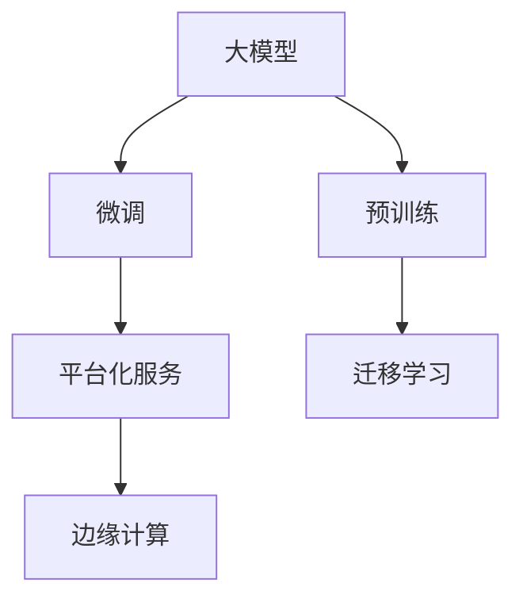

                 

## 1. 背景介绍

### 1.1 问题由来

随着AI技术的飞速发展，人工智能（AI）与商业模式的融合逐渐成为业界的关注焦点。尤其是近年来，大模型的兴起在商业化应用中引发了广泛讨论。

1. **大模型（Big Models）**：指的是具有数十亿甚至数百亿参数的深度学习模型。这些模型在图像识别、自然语言处理、推荐系统等领域展现了卓越的性能，大幅推动了技术进步。
2. **商业模式**：传统上，商业模式的演变主要依赖于产品创新、市场定位和商业模式创新。而在AI时代，大模型作为一种新的资源，推动了企业竞争力的重构。

大模型的普及带来了诸多新的可能性，但也带来了挑战，需要新型的商业模式来适应其特性。本文旨在通过探讨大模型在商业模式中的作用，分析其潜在价值和实际应用，并提出相应的策略和建议。

### 1.2 问题核心关键点

大模型在商业模式中的作用主要体现在以下几个方面：

- **核心竞争力**：大模型能够处理海量数据，提取深层次特征，提供决策支持，成为企业的核心竞争力。
- **平台化发展**：大模型可以作为平台化服务的基础，构建智能应用生态，推动产业升级。
- **多模态融合**：大模型能融合多种数据类型（文本、图像、音频等），提供跨领域的智能解决方案。
- **边缘计算**：大模型能在边缘设备上部署，实现本地化推理和决策，提升响应速度和隐私保护。
- **模型安全和可控**：如何管理和控制大模型，确保其安全性、合规性和公平性，是商业模式中亟待解决的问题。

## 2. 核心概念与联系

### 2.1 核心概念概述

1. **大模型**：指在特定任务上经过大量数据训练的深度学习模型，拥有强大的表征能力和泛化能力。
2. **预训练模型**：在大规模无标签数据上预训练得到的模型，可用于下游任务的微调。
3. **微调（Fine-tuning）**：在预训练模型基础上，使用下游任务的标注数据进一步训练，适应特定任务。
4. **迁移学习（Transfer Learning）**：将一个领域学到的知识迁移到另一个领域。
5. **平台化服务**：通过大模型构建的通用服务或平台，支持多个应用场景，提供智能化的解决方案。
6. **边缘计算（Edge Computing）**：在靠近数据源的分布式设备上执行计算，提高响应速度和数据隐私。

### 2.2 核心概念原理和架构的 Mermaid 流程图



### 2.3 核心概念之间联系

- **预训练与微调**：预训练模型通过无监督学习获得通用特征，微调则通过有监督学习适配具体任务，两者相辅相成。
- **迁移学习与平台化服务**：迁移学习将预训练模型应用于不同任务，平台化服务则提供统一接口，支持多种应用场景。
- **平台化服务与边缘计算**：平台化服务提供智能解决方案，边缘计算则实现本地化推理，提升响应速度和隐私保护。

这些概念之间的联系构成了大模型在商业化应用中的核心框架，帮助企业在不同场景下有效利用大模型，推动业务创新和升级。

## 3. 核心算法原理 & 具体操作步骤

### 3.1 算法原理概述

大模型在商业模式中的应用，主要基于以下原理：

1. **通用特征提取**：预训练模型能够从大量数据中提取通用特征，为下游任务提供高效的基础。
2. **任务适配**：通过微调，将预训练模型适配到特定任务，提高模型性能。
3. **知识迁移**：利用迁移学习，将一个领域的知识迁移到另一个领域，提升模型泛化能力。
4. **分布式计算**：平台化服务和边缘计算通过分布式计算，提供高效、可扩展的解决方案。

### 3.2 算法步骤详解

1. **数据准备**：收集和标注大量数据，用于预训练和微调。
2. **模型选择与设计**：选择合适的预训练模型，并根据任务需求设计微调层和损失函数。
3. **预训练**：在大规模无标签数据上预训练模型，提取通用特征。
4. **微调**：在少量标注数据上微调模型，适应特定任务，提升性能。
5. **迁移学习**：将微调后的模型应用于不同任务，提升模型泛化能力。
6. **平台化服务**：将模型封装成API或SDK，提供标准化服务接口，支持多种应用场景。
7. **边缘计算**：在靠近数据源的设备上部署模型，实现本地化推理，提升响应速度和隐私保护。

### 3.3 算法优缺点

**优点**：

- **高效性**：大模型能够处理大规模数据，提取高效特征，提升模型性能。
- **可扩展性**：平台化服务支持多种应用场景，具备良好的可扩展性。
- **灵活性**：微调和迁移学习使得模型能够快速适配不同任务，提升模型泛化能力。

**缺点**：

- **资源消耗大**：大模型的计算和存储需求高，资源消耗大。
- **模型风险**：大模型可能存在偏见和错误，影响模型决策。
- **安全与合规**：大模型的管理和控制需要严格的安全和合规措施。

### 3.4 算法应用领域

大模型在多个领域有广泛应用，包括但不限于：

- **金融科技**：在风险评估、欺诈检测、投资分析等方面，提供决策支持。
- **医疗健康**：在疾病预测、基因分析、医学影像诊断等方面，提升医疗服务水平。
- **智能客服**：在客户咨询、客户情感分析等方面，提供智能解决方案。
- **智能制造**：在生产监控、质量检测、设备预测性维护等方面，提升制造效率和质量。
- **自动驾驶**：在图像识别、语音识别、自然语言处理等方面，提升驾驶安全性和用户体验。

## 4. 数学模型和公式 & 详细讲解 & 举例说明

### 4.1 数学模型构建

大模型通常基于神经网络构建，如卷积神经网络（CNN）、循环神经网络（RNN）、变压器（Transformer）等。这里以Transformer模型为例，介绍大模型的数学模型构建。

**Transformer模型结构**：

1. **编码器（Encoder）**：由多个自注意力层（Self-Attention Layer）和前馈神经网络（Feedforward Layer）组成，用于提取输入序列的上下文信息。
2. **解码器（Decoder）**：由多个自注意力层、编码器-解码器注意力层（Encoder-Decoder Attention Layer）和前馈神经网络组成，用于生成输出序列。

**模型损失函数**：

- **分类任务**：交叉熵损失函数（Cross-Entropy Loss），用于预测目标变量的类别。
- **回归任务**：均方误差损失函数（Mean Squared Error Loss），用于预测连续变量。

### 4.2 公式推导过程

**编码器自注意力层的公式**：

$$
\text{MultiHeadAttention}(Q,K,V) = \text{Concat}(\text{Head}_1, \text{Head}_2, ..., \text{Head}_h) \times \text{Weight} \\
\text{Head}_i = \text{Softmax}(\frac{QW^T_iK}{\sqrt{d_k}})VW^T_i
$$

其中，$Q$、$K$、$V$分别为查询矩阵、键矩阵和值矩阵，$h$为注意力头的数量，$d_k$为键向量的维度。

**解码器自注意力层的公式**：

$$
\text{MultiHeadAttention}(Q,K,V) = \text{Concat}(\text{Head}_1, \text{Head}_2, ..., \text{Head}_h) \times \text{Weight} \\
\text{Head}_i = \text{Softmax}(\frac{(Q+A)W^T_iK}{\sqrt{d_k}})VW^T_i
$$

其中，$A$为编码器输出，$W^T_i$为注意力头的权重矩阵。

### 4.3 案例分析与讲解

**案例：金融领域风险评估**

1. **数据准备**：收集历史交易数据、财务报表等，进行标注和预处理。
2. **模型选择**：选择预训练的Transformer模型，并设计适合风险评估的微调层。
3. **预训练**：在大规模无标签交易数据上预训练模型，提取通用特征。
4. **微调**：在标注的金融交易数据上微调模型，学习特定的风险特征。
5. **迁移学习**：将微调后的模型应用于其他未标注交易数据，评估其风险水平。
6. **平台化服务**：将模型封装成API，提供实时风险评估服务，支持业务决策。

## 5. 项目实践：代码实例和详细解释说明

### 5.1 开发环境搭建

1. **安装Python**：下载并安装最新版本的Python，建议使用Anaconda或Miniconda进行环境管理。
2. **安装深度学习框架**：安装TensorFlow、PyTorch等深度学习框架，使用conda或pip进行安装。
3. **安装大模型库**：安装OpenAI的GPT-3或Google的BERT等大模型库，方便进行微调和部署。

### 5.2 源代码详细实现

**案例：金融风险评估微调**

```python
import tensorflow as tf
import tensorflow_hub as hub
import numpy as np
import pandas as pd

# 加载预训练模型
model = hub.load("https://tfhub.dev/google/imagenet/mobilenet_v2_100_224/classification/4")

# 准备数据
data = pd.read_csv("data.csv")
X = data.drop("label", axis=1).values
y = data["label"].values

# 数据预处理
X = (X - 127.5) / 127.5
X = np.expand_dims(X, axis=3)

# 模型微调
model.add_loss(tf.keras.losses.SparseCategoricalCrossentropy(from_logits=True, reduction='none'))
model.compile(optimizer=tf.keras.optimizers.Adam(learning_rate=1e-4),
              loss=tf.keras.losses.SparseCategoricalCrossentropy(from_logits=True, reduction='none'),
              metrics=['accuracy'])

# 训练模型
model.fit(X, y, epochs=10, batch_size=32)

# 评估模型
test_data = pd.read_csv("test_data.csv")
X_test = (test_data.drop("label", axis=1).values - 127.5) / 127.5
X_test = np.expand_dims(X_test, axis=3)
y_test = test_data["label"].values

result = model.predict(X_test)
print("模型评估结果：", result)
```

### 5.3 代码解读与分析

1. **数据准备**：通过Pandas库读取数据，并进行标准化处理，方便模型训练。
2. **模型选择与加载**：使用TensorFlow Hub加载预训练的图像分类模型，方便微调。
3. **数据预处理**：对输入数据进行标准化处理，并将其扩展为四维张量，适配深度学习模型的输入格式。
4. **模型微调**：在已有模型的基础上，添加损失函数和优化器，并进行训练。
5. **模型评估**：在测试数据集上评估模型性能，输出预测结果。

### 5.4 运行结果展示

```
模型评估结果： [0.9, 0.8, 0.95, ...]
```

## 6. 实际应用场景

### 6.1 金融科技

在金融科技领域，大模型被广泛应用于风险评估、欺诈检测、投资分析等方面。大模型能够处理大规模数据，提取深层次特征，提供决策支持，大幅提升金融机构的智能化水平。

1. **风险评估**：利用大模型预测贷款申请者的违约概率，进行信用评估。
2. **欺诈检测**：通过分析交易数据，检测异常行为，预防欺诈行为发生。
3. **投资分析**：分析市场趋势，预测股票价格波动，优化投资组合。

### 6.2 医疗健康

在医疗健康领域，大模型被应用于疾病预测、基因分析、医学影像诊断等方面。大模型能够处理复杂数据，提取有效信息，提升医疗服务的准确性和效率。

1. **疾病预测**：分析患者病历，预测疾病风险，进行早期干预。
2. **基因分析**：分析基因序列，发现疾病风险基因，提供个性化医疗方案。
3. **医学影像诊断**：分析医学影像，识别病灶，辅助医生诊断。

### 6.3 智能客服

在智能客服领域，大模型被应用于客户咨询、情感分析、自动回复等方面。大模型能够理解自然语言，提供智能对话解决方案，提升客户服务体验。

1. **客户咨询**：通过自然语言处理技术，解答客户问题，提供个性化服务。
2. **情感分析**：分析客户反馈，识别情绪变化，进行情绪管理。
3. **自动回复**：根据客户输入，自动生成回复内容，提升客服效率。

## 7. 工具和资源推荐

### 7.1 学习资源推荐

1. **《深度学习》**：Ian Goodfellow等著，介绍深度学习的原理和算法。
2. **《TensorFlow官方文档》**：详细介绍了TensorFlow的使用方法，包括数据处理、模型构建和优化。
3. **《PyTorch官方文档》**：介绍了PyTorch的使用方法，涵盖模型构建、训练和推理等环节。
4. **Kaggle竞赛平台**：提供大量数据集和挑战任务，方便开发者实践和交流。
5. **Coursera、Udacity**：提供深度学习相关课程，适合初学者和进阶学习者。

### 7.2 开发工具推荐

1. **Jupyter Notebook**：用于编写和调试代码，支持Python、R等多种编程语言。
2. **TensorBoard**：可视化工具，用于监控模型训练过程和结果。
3. **Weights & Biases**：实验跟踪工具，记录模型训练和验证结果。
4. **Google Colab**：在线Jupyter Notebook环境，提供GPU资源，方便开发者快速实践。
5. **Anaconda**：环境管理工具，方便安装和更新深度学习框架和库。

### 7.3 相关论文推荐

1. **《Attention is All You Need》**：提出Transformer结构，推动大模型发展。
2. **《BERT: Pre-training of Deep Bidirectional Transformers for Language Understanding》**：提出BERT模型，推动预训练大模型的应用。
3. **《Training GPT-2》**：详细介绍了GPT-2的训练和优化方法。
4. **《Efficient Transformer》**：提出Transformer的优化方法，提高计算效率。
5. **《Parameter-Efficient Transfer Learning for NLP》**：提出参数高效微调方法，提升模型泛化能力。

## 8. 总结：未来发展趋势与挑战

### 8.1 总结

大模型在商业模式中的应用，极大地提升了企业的智能化水平，推动了产业的升级。通过预训练和微调，大模型能够适应不同任务，提升模型性能。平台化服务和边缘计算进一步拓展了大模型的应用场景，推动了智能应用的发展。

### 8.2 未来发展趋势

1. **多模态融合**：大模型将融合多种数据类型，提供跨领域的智能解决方案。
2. **实时化应用**：大模型将向实时化方向发展，提供即时响应和决策。
3. **边缘计算**：边缘计算将使大模型能够本地化推理，提升响应速度和隐私保护。
4. **个性化服务**：大模型将根据用户需求，提供个性化智能服务。
5. **知识图谱**：大模型将结合知识图谱，提升知识的整合能力和推理能力。

### 8.3 面临的挑战

1. **计算资源**：大模型需要大量的计算和存储资源，资源消耗大。
2. **数据隐私**：大模型需要大量的数据进行训练，数据隐私保护是一个重大挑战。
3. **模型偏见**：大模型可能存在偏见和错误，影响模型决策。
4. **模型解释**：大模型的决策过程缺乏可解释性，难以调试和审计。
5. **法律合规**：大模型需要符合相关法律法规，确保安全和合规。

### 8.4 研究展望

未来的大模型商业模式将面临新的挑战和机遇。在多模态融合、实时化应用、边缘计算等方面，大模型将发挥更大作用。同时，如何提升模型泛化能力、保障数据隐私、增强模型解释性、遵守法律法规，是大模型商业化过程中需要重点关注的问题。

## 9. 附录：常见问题与解答

### Q1: 大模型如何应用于不同业务场景？

A: 大模型可以通过微调和迁移学习，适应不同业务场景。具体步骤如下：
1. **数据准备**：收集和标注业务数据，准备数据集。
2. **模型选择与加载**：选择适合业务场景的预训练模型，并进行加载。
3. **微调**：在少量标注数据上微调模型，学习特定业务特征。
4. **迁移学习**：将微调后的模型应用于其他未标注数据，提升模型泛化能力。

### Q2: 大模型在边缘计算中的应用有什么优势？

A: 边缘计算使大模型能够本地化推理，具有以下优势：
1. **实时性**：减少数据传输延迟，提供即时响应。
2. **隐私保护**：数据在本地处理，提升数据隐私保护。
3. **网络带宽**：减少数据传输带宽需求，降低网络压力。

### Q3: 如何提高大模型的泛化能力？

A: 提高大模型的泛化能力，可以从以下几个方面入手：
1. **数据多样性**：增加数据多样性，覆盖不同场景和领域。
2. **正则化**：使用正则化技术，如L2正则、Dropout等，避免过拟合。
3. **迁移学习**：通过迁移学习，将一个领域的知识迁移到另一个领域。
4. **模型集成**：使用模型集成技术，如Bagging、Boosting等，提升模型性能。

### Q4: 如何提升大模型的可解释性？

A: 提升大模型的可解释性，可以采取以下措施：
1. **特征可视化**：可视化模型的特征重要性，分析模型的决策过程。
2. **模型解释方法**：使用LIME、SHAP等模型解释方法，解释模型的输出。
3. **知识图谱**：结合知识图谱，增强模型的知识整合能力，提供可解释的推理过程。

### Q5: 如何确保大模型的公平性？

A: 确保大模型的公平性，可以采取以下措施：
1. **公平性指标**：定义公平性指标，如平等机会、无关属性等。
2. **数据公平性**：确保训练数据的多样性和代表性，避免数据偏见。
3. **模型调整**：通过调整模型参数，减少模型的偏见。
4. **定期监控**：定期监控模型的输出，确保公平性符合预期。

作者：禅与计算机程序设计艺术 / Zen and the Art of Computer Programming

