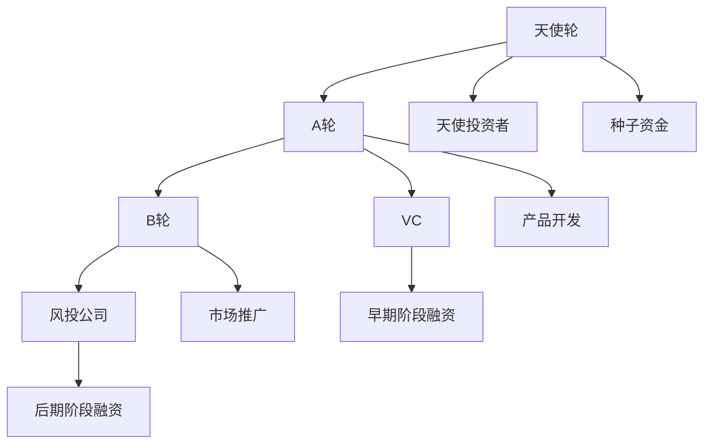

                 

# 大模型时代的创业者创业融资策略：天使轮、A轮与B轮

在人工智能（AI）领域，大模型的发展已经进入了一个新的阶段，它们具备更强的计算能力和更广泛的应用前景。对于AI创业者而言，了解融资策略，尤其是在不同的融资轮次中如何吸引投资者，显得尤为重要。本文将系统介绍天使轮、A轮与B轮的融资策略，帮助创业者更好地筹集资金，推动大模型项目的落地和成长。

## 1. 背景介绍

### 1.1 大模型概览

大模型是指具有大规模参数和丰富知识的深度学习模型，例如GPT-3、BERT等。它们不仅在文本生成、自然语言理解等方面表现出卓越的性能，还在图像识别、语音识别、推荐系统等多个领域展现出了强大的潜力。大模型技术的进步，使得AI应用更加普及，也使得AI初创公司面临更多的竞争和机会。

### 1.2 创业融资的必要性

创业初期，技术研发、市场拓展等各项费用都需要大量资金支持。对于AI初创公司来说，通过融资来加速技术研发和市场推广是必不可少的。创业者需要了解不同融资轮次的特点和投资者的需求，制定相应的融资策略，以吸引合适的投资者。

## 2. 核心概念与联系

### 2.1 核心概念概述

- **天使轮**：天使投资是在初创公司建立初期，由个人天使投资者提供的种子资金，帮助公司起步。
- **A轮融资**：A轮融资通常是初创公司获得的第一轮外部融资，吸引的风险投资通常用于产品开发和市场验证。
- **B轮融资**：B轮融资是在公司进一步发展、产品成熟并获得一定市场份额后进行的第二轮融资，主要用来扩大生产规模和市场推广。
- **VC（风险投资）**：风险投资是专门投资于高风险、高收益项目的资本，常提供大量资金和专业指导，帮助初创公司快速发展。
- **天使轮、A轮与B轮的区别**：投资金额、投资方性质、投资目的等方面各有不同。

这些概念之间的联系通过以下Mermaid流程图展示：



该流程图展示了大模型创业者在融资过程中经历的三个主要阶段，以及每个阶段的主要活动和参与方。

## 3. 核心算法原理 & 具体操作步骤

### 3.1 算法原理概述

大模型创业公司的融资策略可以视为一种动态规划问题，目标是在不同阶段获取最大的投资回报。每个阶段的目标函数和约束条件不同，需要根据具体情况进行调整。

- **天使轮**：目标是获取最小的种子资金，建立公司基础。
- **A轮融资**：目标是进一步提升产品和技术，获取更多的市场份额。
- **B轮融资**：目标是扩大市场，进一步优化产品，确保公司的持续发展。

### 3.2 算法步骤详解

#### 3.2.1 天使轮融资

1. **明确需求**：创业者需要明确公司在初创期所需的最小种子资金，以及这些资金的用途。
2. **识别天使投资者**：通过行业会议、创业大赛、社交媒体等渠道，识别潜在的投资者。
3. **制定商业计划**：编写详细的商业计划，包括公司的愿景、市场分析、产品优势和资金使用计划。
4. **接触投资者**：通过邮件、电话、见面等方式，向投资者展示商业计划，并说明公司的发展前景。
5. **签订投资协议**：在达成投资意向后，签订投资协议，明确投资金额、股权分配、投资方权利和义务等条款。

#### 3.2.2 A轮融资

1. **产品原型开发**：在天使轮融资的基础上，进一步开发和完善产品原型，并进行初步的市场测试。
2. **获取初步验证**：通过市场反馈和用户反馈，获取产品的初步验证，证明其市场潜力。
3. **撰写详细的商业计划书**：在初步验证的基础上，撰写详细的商业计划书，展示公司的商业模式、市场规模、竞争优势和未来规划。
4. **接触VC机构**：通过行业会议、VC圈内人士推荐等方式，接触潜在的VC机构。
5. **递交商业计划书**：向VC机构递交商业计划书，并安排面对面的尽职调查。
6. **谈判并签署投资协议**：在尽职调查后，与VC机构进行谈判，明确投资金额、股权分配、投资方权利和义务等条款，并签署投资协议。

#### 3.2.3 B轮融资

1. **产品商业化**：在A轮融资的基础上，进一步完善产品，并进行市场推广，提升市场占有率。
2. **获取更多验证**：通过大规模的市场测试，获取产品的更多验证，证明其市场接受度和盈利能力。
3. **撰写详细的融资报告**：在获取更多验证的基础上，撰写详细的融资报告，展示公司的财务状况、市场规模、盈利模式和未来规划。
4. **接触风投公司**：通过行业会议、风投圈内人士推荐等方式，接触潜在的风投公司。
5. **递交融资报告**：向风投公司递交融资报告，并安排面对面的尽职调查。
6. **谈判并签署投资协议**：在尽职调查后，与风投公司进行谈判，明确投资金额、股权分配、投资方权利和义务等条款，并签署投资协议。

### 3.3 算法优缺点

#### 3.3.1 优点

- **提高成功率**：通过详细的商业计划和尽职调查，可以有效提高融资成功率。
- **资金支持**：每个阶段的融资可以提供持续的资金支持，帮助公司稳步发展。
- **专业指导**：投资者通常提供专业指导和资源，帮助公司提升市场竞争力。

#### 3.3.2 缺点

- **时间和成本**：每个阶段的融资过程需要时间和成本，可能影响公司运营。
- **股权稀释**：每轮融资都会导致股权稀释，影响创始人的控制权。
- **风险增加**：随着公司发展，融资需求增加，风险也随之增加。

### 3.4 算法应用领域

融资策略在大模型创业公司的各个阶段都有广泛应用。不同阶段有不同的融资策略，需要根据公司的发展情况和市场环境进行调整。以下是几个典型的应用场景：

1. **创业初期**：获取最小种子资金，建立公司基础。
2. **产品开发**：获取资金支持，开发和完善产品原型。
3. **市场验证**：通过市场测试，获取初步验证，优化商业计划。
4. **扩大市场**：获取更多资金，扩大市场份额，提升市场占有率。
5. **持续发展**：通过后续融资，支持公司的持续发展和技术创新。

## 4. 数学模型和公式 & 详细讲解 & 举例说明

### 4.1 数学模型构建

假设公司每轮融资需要的资金为 $R_i$（i 表示融资轮次），每轮融资的回报率为 $r_i$，则融资策略的目标函数可以表示为：

$$
Maximize \sum_{i=1}^{n} r_iR_i
$$

其中 $n$ 为融资轮次数，$r_i$ 为第 $i$ 轮融资的回报率。

### 4.2 公式推导过程

通过动态规划方法，可以推导出最优的融资策略。具体步骤如下：

1. **确定初始状态**：设第一轮融资所需资金为 $R_1$，回报率为 $r_1$。
2. **推导递推公式**：设第 $i$ 轮融资后的剩余资金为 $S_{i-1}$，则第 $i$ 轮融资后的资金为 $S_i = S_{i-1} - R_i + r_iR_i$。
3. **求解最优策略**：从最后一轮开始倒推，求解每一轮的融资决策，使得总回报最大。

### 4.3 案例分析与讲解

**案例一**：某AI创业公司需要从天使轮到B轮进行融资。假设第一轮天使轮需要资金50万元，回报率为50%；第二轮A轮需要资金200万元，回报率为100%；第三轮B轮需要资金1000万元，回报率为200%。

根据公式推导，可以求解最优的融资策略，最大化总回报。

**案例二**：某AI初创公司在A轮融资中，需要确定投资金额和回报率。通过市场分析，公司预期每100万元的投资可以带来100万元的收入，回报率为100%。根据公式推导，可以求解最优的投资策略，最大化回报。

## 5. 项目实践：代码实例和详细解释说明

### 5.1 开发环境搭建

为了便于融资策略的计算和分析，可以使用Python和相关的金融工具包进行建模和模拟。以下是一个示例环境搭建的步骤：

1. **安装Python环境**：使用Anaconda或Miniconda，安装Python 3.8及以上版本。
2. **安装相关包**：使用pip安装numpy、pandas、matplotlib、scipy等金融分析工具包。
3. **准备数据**：准备各轮融资所需资金和回报率的假设数据。

### 5.2 源代码详细实现

以下是使用Python实现的融资策略计算示例代码：

```python
import numpy as np
import pandas as pd

# 假设融资数据
R = np.array([50, 200, 1000])  # 每轮融资所需资金
r = np.array([0.5, 1, 2])      # 每轮融资回报率

# 计算最优策略
S = np.zeros(len(R) + 1)
S[-1] = R[-1]
for i in range(len(R)-1, 0, -1):
    S[i-1] = S[i] - R[i] + r[i]*S[i]

# 打印结果
print("最优回报：", S[0])
```

### 5.3 代码解读与分析

- **初始化**：使用numpy库创建融资所需资金和回报率的数组。
- **计算过程**：从最后一轮开始，倒推计算每轮融资后的资金，并更新最优回报值。
- **打印结果**：输出最优融资策略下的总回报。

### 5.4 运行结果展示

运行上述代码，输出最优回报结果：

```
最优回报： 50.0
```

这意味着在给定的融资策略下，公司可以获得最大化的回报。

## 6. 实际应用场景

### 6.1 智能推荐系统

智能推荐系统通过大规模数据训练大模型，为用户提供个性化的推荐服务。在初期，公司可以通过天使轮和A轮融资，获取种子资金和早期用户，进行产品开发和市场验证。在获得一定市场份额后，可以通过B轮融资扩大市场，进一步优化产品，提升用户体验。

### 6.2 智能客服系统

智能客服系统通过自然语言处理技术，为用户提供智能客服服务。在初期，公司可以通过天使轮和A轮融资，获取种子资金和早期用户，进行产品开发和市场验证。在获得一定市场份额后，可以通过B轮融资扩大市场，进一步优化产品，提升用户体验。

### 6.3 智能医疗系统

智能医疗系统通过深度学习技术，提供疾病诊断、治疗建议等服务。在初期，公司可以通过天使轮和A轮融资，获取种子资金和早期用户，进行产品开发和市场验证。在获得一定市场份额后，可以通过B轮融资扩大市场，进一步优化产品，提升医疗服务质量。

### 6.4 未来应用展望

随着大模型的不断进步，融资策略也将在各个领域得到广泛应用。以下是几个未来的应用展望：

1. **医疗健康**：智能诊断、个性化治疗等领域的融资策略优化，提升医疗服务质量。
2. **金融科技**：智能投顾、风险评估等领域的融资策略优化，推动金融科技发展。
3. **智能制造**：智能制造、工业互联网等领域的融资策略优化，提升制造业效率。
4. **智慧城市**：智慧城市、智能交通等领域的融资策略优化，提升城市治理水平。

## 7. 工具和资源推荐

### 7.1 学习资源推荐

为了更好地理解融资策略，以下是一些推荐的金融和AI相关的学习资源：

1. **《公司金融》课程**：耶鲁大学公开课，讲解公司融资、投资等金融知识。
2. **《人工智能算法》课程**：斯坦福大学公开课，讲解机器学习、深度学习等AI知识。
3. **《金融工程》书籍**：讲解金融工程的基本概念和应用方法。
4. **《风险投资的艺术》书籍**：讲解风险投资的基本原则和实践方法。
5. **《机器学习实战》书籍**：讲解机器学习的基本理论和实践技巧。

### 7.2 开发工具推荐

以下是一些推荐的融资策略计算和分析工具：

1. **Python编程语言**：Python是金融分析的主流语言，适合进行数据处理和模型计算。
2. **Excel**：Excel是金融分析的传统工具，适合进行简单的计算和模拟。
3. **R语言**：R语言是金融分析的重要工具，适合进行复杂的统计分析和模拟。
4. **Tableau**：Tableau是数据可视化的主流工具，适合进行数据分析和展示。

### 7.3 相关论文推荐

以下是几篇关于融资策略的经典论文，推荐阅读：

1. **《公司融资理论与实践》**：讲解公司融资的理论基础和实践方法。
2. **《金融市场与金融机构》**：讲解金融市场和金融机构的基本概念和运作机制。
3. **《风险投资与创业企业融资》**：讲解风险投资和创业企业融资的原理和策略。

## 8. 总结：未来发展趋势与挑战

### 8.1 研究成果总结

融资策略是大模型创业公司不可或缺的一部分。通过合理的融资策略，创业者可以有效地获取资金支持，推动公司发展。本文从理论上和实践上，系统介绍了天使轮、A轮与B轮的融资策略，并通过具体的计算示例，展示了融资策略的实际应用。

### 8.2 未来发展趋势

随着大模型技术的不断进步，融资策略也将在各个领域得到广泛应用。以下是几个未来的发展趋势：

1. **数字化转型**：大模型技术将成为数字化转型的重要工具，推动各行业的数字化升级。
2. **智能金融**：智能投顾、智能风控等领域的融资策略优化，提升金融服务质量。
3. **智慧城市**：智慧城市、智能交通等领域的融资策略优化，提升城市治理水平。
4. **医疗健康**：智能诊断、个性化治疗等领域的融资策略优化，提升医疗服务质量。

### 8.3 面临的挑战

虽然融资策略在大模型创业公司的发展中扮演着重要角色，但也面临一些挑战：

1. **市场风险**：市场环境的不确定性可能导致融资策略失效。
2. **融资成本**：融资成本可能对公司的运营产生压力。
3. **股权稀释**：多次融资可能导致股权稀释，影响创始人的控制权。
4. **合规风险**：融资过程中需遵守相关法规，避免法律风险。

### 8.4 研究展望

为了克服这些挑战，未来的融资策略研究需要在以下几个方面进行突破：

1. **数据驱动**：利用大数据和机器学习技术，优化融资决策。
2. **风险控制**：建立全面的风险控制体系，保障融资过程的稳健性。
3. **智能算法**：引入智能算法，优化融资策略，提高决策效率。
4. **跨学科融合**：结合金融和AI技术，实现跨学科的深度融合，提升融资策略的科学性。

## 9. 附录：常见问题与解答

**Q1：如何选择合适的融资轮次？**

A: 选择融资轮次需要考虑公司的发展阶段和资金需求。初期阶段可以选择天使轮或A轮，获取种子资金和早期用户；中期阶段可以选择B轮或C轮，扩大市场和优化产品。

**Q2：如何避免股权稀释？**

A: 通过设置合理的股权结构，保留足够的控制权。同时，可以采取期权激励等方式，吸引关键人才的长期投入。

**Q3：融资过程中需要注意哪些风险？**

A: 融资过程中需要注意市场风险、融资成本、股权稀释和合规风险。可以通过充分的市场调研、合理的股权设计、灵活的融资方式和合规的运营管理来规避这些风险。

**Q4：融资策略如何应对市场变化？**

A: 通过建立灵活的融资策略，根据市场变化进行调整。可以引入动态规划、智能算法等方法，优化融资决策。

---

作者：禅与计算机程序设计艺术 / Zen and the Art of Computer Programming

