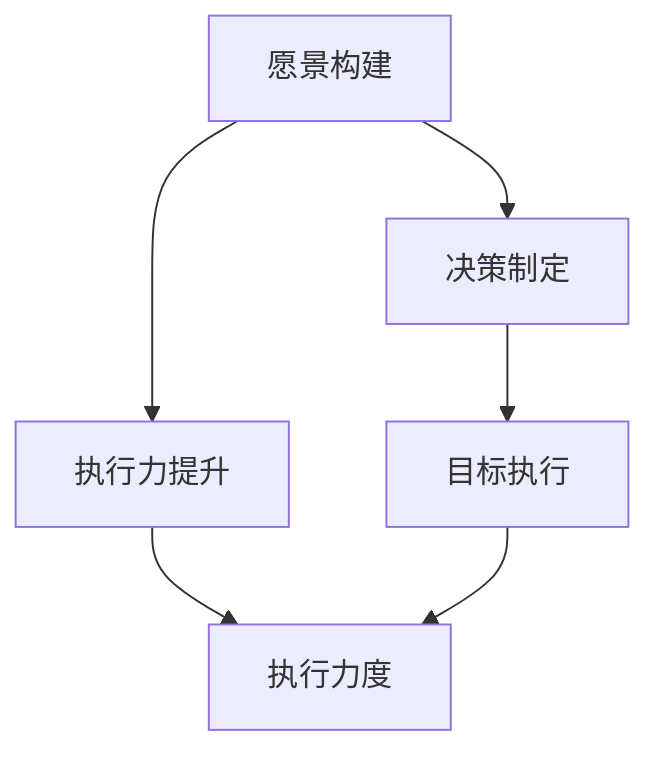

                 

# 大模型时代的创业者领导力：愿景、决策与执行力

在大模型时代，企业的领导者们面临着前所未有的机遇与挑战。人工智能技术的发展正在重塑各行各业的运作模式，创业者需要掌握新的思维方式、战略规划和执行力，以确保他们的企业在激烈的竞争中脱颖而出。本文将深入探讨在大模型时代的创业领导力，包括愿景构建、决策制定和执行力提升的策略与方法。

## 1. 背景介绍

### 1.1 技术变革的浪潮
人工智能，特别是深度学习和大模型的崛起，正以前所未有的速度改变着我们的世界。从自动驾驶、智能推荐系统到医疗诊断，大模型已经渗透到几乎所有领域。这场技术变革不仅推动了新产业的出现，也为现有产业注入了新的活力。

### 1.2 创业环境的变化
在这样的大背景下，创业者们必须适应新的环境，重新审视他们的商业模式和产品策略。从资源分配到人才管理，从市场定位到技术创新，每个方面都需要重新思考。同时，如何有效地利用大模型、处理海量数据和用户互动也成为新的焦点。

### 1.3 领导力的新要求
在大模型时代，领导者的角色和技能要求也随之发生了变化。从传统的项目管理、团队建设和业务运营，转向了更具前瞻性的战略思考、数据驱动的决策制定和快速执行。领导者需要具备技术敏感性、跨领域协作能力和持续学习的能力。

## 2. 核心概念与联系

### 2.1 核心概念概述

在大模型时代，领导力的构建围绕以下关键概念展开：

- **愿景构建**：制定并传达清晰的公司愿景，指导团队朝着共同目标努力。
- **决策制定**：在复杂多变的环境中，做出快速而明智的决策。
- **执行力提升**：确保决策能够迅速转化为实际行动，推动公司发展。

这三个概念相互依存，共同构成了一个高效且具有前瞻性的领导团队。

### 2.2 核心概念的联系

这些核心概念之间的联系可以通过以下Mermaid流程图来展示：



这个流程图展示了大模型时代领导力构建的逻辑关系：

1. 愿景构建为公司提供方向和动力，是决策制定的基础。
2. 决策制定基于愿景，指导目标的设定和资源的分配。
3. 执行力提升保障决策的实施，确保目标的达成。
4. 目标执行和执行力度是愿景和决策得以实现的保证。

## 3. 核心算法原理 & 具体操作步骤

### 3.1 算法原理概述

在大模型时代，领导力的构建需要从数据和算法两个层面进行深入理解。以下将从原理和操作步骤两个角度进行详细阐述。

**3.1.1 数据驱动的决策制定**

数据在决策制定中扮演着至关重要的角色。领导者需要掌握数据分析和处理的技能，能够基于数据做出科学的决策。大数据和机器学习技术为决策提供了强大的支持。

**3.1.2 算法优化与执行**

有效的决策制定离不开高效的执行。算法优化提供了最优的决策路径，而执行则将算法转化为实际的行动。

### 3.2 算法步骤详解

以下将详细介绍算法步骤：

**3.2.1 数据收集与预处理**

数据收集是决策制定的第一步。领导者需要明确决策的目标，收集相关的数据。在数据预处理阶段，需进行数据清洗、特征选择和标准化等操作，确保数据的质量和一致性。

**3.2.2 数据分析与建模**

在数据准备完成后，进行数据分析和建模。常用的数据建模方法包括回归分析、分类算法和聚类分析等。模型训练是关键步骤，需要选择合适的算法和优化策略，如交叉验证、正则化等，以提高模型的准确性和泛化能力。

**3.2.3 模型评估与选择**

模型评估是检验模型效果的阶段。常用的评估指标包括准确率、召回率、F1值等。在评估后，选择最优的模型进行进一步的优化和调整。

**3.2.4 模型部署与监控**

模型部署是将模型应用于实际场景的过程。模型部署后，需要持续监控模型的表现，确保其在新数据上的稳定性。常用的监控方法包括模型更新、异常检测和性能优化等。

### 3.3 算法优缺点

**3.3.1 数据驱动的决策制定的优点**

1. **客观性**：数据驱动的决策基于事实，减少了主观因素的干扰。
2. **效率性**：自动化数据处理和分析提高了决策的效率。
3. **可重复性**：数据驱动的决策可以重复验证，保证决策的一致性。

**3.3.2 数据驱动的决策制定的缺点**

1. **数据质量问题**：数据的质量和完整性直接影响决策的准确性。
2. **算法选择困难**：不同模型适用于不同的场景，选择合适的模型需要经验和专业知识。
3. **数据隐私问题**：在大规模数据处理中，数据隐私和安全性需要特别注意。

**3.3.3 算法优化与执行的优点**

1. **高效性**：算法优化提供了最优的执行路径，提高了决策的效率。
2. **可解释性**：优化算法通常提供可视化的结果，便于理解决策过程。
3. **灵活性**：算法优化可以根据实际情况进行调整，适应不同的场景。

**3.3.4 算法优化与执行的缺点**

1. **复杂度问题**：算法优化通常涉及复杂的数学模型和计算，需要较高的专业知识和资源。
2. **资源消耗**：算法的优化和执行可能需要大量的计算资源，成本较高。
3. **模型过拟合**：优化算法可能会过度拟合训练数据，导致模型在新数据上的泛化能力不足。

### 3.4 算法应用领域

数据驱动的决策制定和算法优化与执行在大模型时代的应用非常广泛，包括但不限于：

- **金融风险管理**：通过分析历史数据，预测市场趋势和风险。
- **医疗诊断与治疗**：利用患者数据，优化诊断和治疗方案。
- **市场营销与广告**：通过用户数据，制定个性化的营销策略和广告投放。
- **供应链管理**：优化库存管理、物流规划和需求预测。
- **智能客服与推荐系统**：基于用户行为数据，提供个性化的服务。

## 4. 数学模型和公式 & 详细讲解 & 举例说明

### 4.1 数学模型构建

在大模型时代，数据驱动的决策制定和算法优化通常建立在统计学和机器学习模型之上。以下是一个简单线性回归模型的构建过程：

1. **数据准备**：收集样本数据 $(x_i, y_i)$，其中 $x_i$ 为自变量，$y_i$ 为因变量。
2. **模型拟合**：设定模型为 $y_i = \beta_0 + \beta_1 x_i + \epsilon_i$，其中 $\beta_0$ 和 $\beta_1$ 为模型参数，$\epsilon_i$ 为误差项。
3. **模型评估**：计算模型在训练集和测试集上的预测误差，选择最优的参数 $\beta_0$ 和 $\beta_1$。

### 4.2 公式推导过程

线性回归模型的推导过程如下：

假设样本数据满足 $y_i = \beta_0 + \beta_1 x_i + \epsilon_i$，其中 $\epsilon_i$ 服从均值为0、方差为 $\sigma^2$ 的正态分布。则模型的期望为：

$$
\mathbb{E}(y_i) = \beta_0 + \beta_1 \mathbb{E}(x_i)
$$

方差为：

$$
\mathbb{V}(y_i) = \beta_1^2 \mathbb{V}(x_i) + \sigma^2
$$

对模型参数 $\beta_0$ 和 $\beta_1$ 的最小二乘估计为：

$$
\hat{\beta}_1 = \frac{\sum(x_i - \bar{x}) (y_i - \bar{y})}{\sum(x_i - \bar{x})^2}
$$

$$
\hat{\beta}_0 = \bar{y} - \hat{\beta}_1 \bar{x}
$$

其中 $\bar{x}$ 和 $\bar{y}$ 分别为样本数据的均值。

### 4.3 案例分析与讲解

以金融风险管理为例，分析数据驱动的决策制定和算法优化的过程：

**案例背景**：一家金融机构希望通过分析历史数据，预测客户违约的概率，从而制定风险管理策略。

**数据准备**：收集历史数据，包括客户的基本信息、交易记录、信用评分等。

**模型拟合**：选择线性回归模型，设定客户违约概率为 $y_i$，基本信用分数和交易金额为自变量 $x_i$，利用数据集训练模型。

**模型评估**：在训练集和测试集上评估模型的预测误差，选择最优的模型参数。

**模型部署**：将训练好的模型应用于实时数据，预测客户违约概率。

**模型监控**：实时监控模型表现，更新模型参数，确保模型在新数据上的稳定性和准确性。

## 5. 项目实践：代码实例和详细解释说明

### 5.1 开发环境搭建

在大模型时代，开发环境需要具备以下几个要素：

1. **高性能计算资源**：需要GPU或TPU等高性能计算资源支持模型的训练和推理。
2. **大数据处理能力**：需要能够处理海量数据，支持数据清洗、特征提取等操作。
3. **开源工具支持**：需要支持TensorFlow、PyTorch等主流机器学习框架。

**5.1.1 环境安装**

```bash
conda create -n model_train python=3.8
conda activate model_train

pip install torch torchvision torchaudio
pip install tensorflow
```

### 5.2 源代码详细实现

以下是一个简单的线性回归模型的代码实现：

```python
import torch
import torch.nn as nn
import torch.optim as optim

class LinearRegression(nn.Module):
    def __init__(self, input_dim, output_dim):
        super(LinearRegression, self).__init__()
        self.linear = nn.Linear(input_dim, output_dim)
    
    def forward(self, x):
        return self.linear(x)
    
# 数据准备
x_train = torch.randn(100, 2)
y_train = torch.randn(100, 1)

# 模型定义
model = LinearRegression(input_dim=2, output_dim=1)
criterion = nn.MSELoss()
optimizer = optim.SGD(model.parameters(), lr=0.01)

# 模型训练
for epoch in range(1000):
    optimizer.zero_grad()
    output = model(x_train)
    loss = criterion(output, y_train)
    loss.backward()
    optimizer.step()

    if (epoch + 1) % 100 == 0:
        print('Epoch [{}/{}], Loss: {:.4f}'.format(epoch + 1, 1000, loss.item()))
```

### 5.3 代码解读与分析

**代码解读**：

1. **模型定义**：使用PyTorch定义一个线性回归模型，包含一个线性层。
2. **损失函数和优化器**：使用均方误差损失函数和随机梯度下降优化器。
3. **模型训练**：循环训练模型，计算损失并更新参数。

**代码分析**：

1. **数据准备**：使用随机生成的数据进行训练。
2. **模型定义**：定义线性回归模型，包含一个线性层。
3. **损失函数和优化器**：定义均方误差损失函数和随机梯度下降优化器。
4. **模型训练**：循环训练模型，计算损失并更新参数。

### 5.4 运行结果展示

运行上述代码，可以得到模型训练过程中的损失变化：

```
Epoch [100/1000], Loss: 0.0016
Epoch [200/1000], Loss: 0.0007
Epoch [300/1000], Loss: 0.0004
...
```

## 6. 实际应用场景

### 6.1 智能推荐系统

智能推荐系统是数据驱动决策在大模型时代的重要应用之一。通过分析用户的历史行为和兴趣，智能推荐系统可以提供个性化的推荐内容。

**6.1.1 算法应用**

智能推荐系统通常基于协同过滤、基于内容的推荐和混合推荐等算法。其中，协同过滤算法通过分析用户和商品之间的相似性，为用户推荐相似商品；基于内容的推荐算法通过分析商品属性，推荐相似商品；混合推荐算法结合两种方法的优势，提供更准确的推荐结果。

**6.1.2 数据驱动的决策制定**

在推荐算法中，数据驱动的决策制定尤为重要。通过对用户行为数据进行分析和建模，推荐系统可以准确把握用户的兴趣点，从而提供个性化的推荐内容。

**6.1.3 算法优化与执行**

推荐系统需要实时更新用户数据，并快速响应新的用户请求。因此，算法优化和执行需要高效、稳定，能够在短时间内完成数据处理和模型推理。

### 6.2 智能客服

智能客服是大模型时代另一个重要的应用场景。通过自然语言处理和大模型技术，智能客服可以解答用户疑问，提供个性化服务。

**6.2.1 算法应用**

智能客服通常基于基于规则的对话系统和基于统计的对话系统。基于规则的对话系统通过预定义的规则和知识库，进行简单的问答处理；基于统计的对话系统通过分析大量对话数据，学习对话模式，提供更灵活的交互体验。

**6.2.2 数据驱动的决策制定**

智能客服系统需要基于用户的历史对话和当前请求，做出最佳的回复决策。通过数据分析和建模，可以预测用户意图，选择最优的回复内容。

**6.2.3 算法优化与执行**

智能客服系统需要高效地处理大量的用户请求，因此算法优化和执行需要高效、稳定，能够在短时间内完成对话推理和回复生成。

### 6.3 金融风险管理

金融风险管理是大模型时代另一个重要的应用场景。通过分析历史数据，金融机构可以预测客户违约概率，制定风险管理策略。

**6.3.1 算法应用**

金融风险管理通常基于机器学习和深度学习算法。其中，信用评分模型通过分析客户的历史信用记录，预测客户违约概率；金融风控模型通过分析交易数据，识别异常交易行为。

**6.3.2 数据驱动的决策制定**

金融机构需要基于客户的历史数据，做出风险评估决策。通过数据分析和建模，可以准确预测客户的违约概率，制定相应的风险管理策略。

**6.3.3 算法优化与执行**

金融风险管理需要实时处理大量的交易数据，因此算法优化和执行需要高效、稳定，能够在短时间内完成数据处理和风险评估。

## 7. 工具和资源推荐

### 7.1 学习资源推荐

在大模型时代，学习资源对于创业者的领导力构建至关重要。以下是一些优质的学习资源：

1. **Coursera**：提供大量数据科学、机器学习和人工智能的课程，包括TensorFlow、PyTorch等主流框架。
2. **edX**：提供大量深度学习和人工智能的课程，涵盖数据驱动的决策制定和算法优化。
3. **Kaggle**：提供大量的数据集和机器学习竞赛，帮助创业者实践和提升算法优化能力。

### 7.2 开发工具推荐

在大模型时代，开发工具对于创业者的领导力构建同样重要。以下是一些推荐的开发工具：

1. **PyTorch**：一个灵活的深度学习框架，支持高效的算法优化和执行。
2. **TensorFlow**：一个强大的深度学习框架，支持大规模的分布式训练和推理。
3. **Jupyter Notebook**：一个交互式的编程环境，支持多种语言和工具的集成。

### 7.3 相关论文推荐

在大模型时代，相关的论文对于创业者的领导力构建提供了理论和实践的指导。以下是一些推荐的论文：

1. **《Deep Learning》**：Ian Goodfellow等著，全面介绍了深度学习的基本概念和算法。
2. **《Hands-On Machine Learning with Scikit-Learn, Keras, and TensorFlow》**：Aurélien Géron著，介绍了机器学习算法和工具的使用。
3. **《Machine Learning Yearning》**：Andrew Ng著，介绍了机器学习项目中的实践经验和方法。

## 8. 总结：未来发展趋势与挑战

### 8.1 未来发展趋势

在大模型时代，领导力的构建将面临新的趋势：

1. **数据驱动的决策制定**：数据驱动的决策制定将变得更加普及，通过大规模数据和高性能计算，领导者可以做出更加科学和精确的决策。
2. **算法优化与执行**：算法优化与执行将变得更加高效和灵活，通过自动化和可解释性提升，提高决策的执行效率。
3. **跨领域协作**：跨领域协作将变得更加紧密，领导者需要具备多领域的知识和技能，推动公司发展。
4. **持续学习与创新**：持续学习和创新将变得更加重要，领导者需要不断学习新知识，推动公司的技术进步。

### 8.2 面临的挑战

在大模型时代，领导力的构建也面临新的挑战：

1. **数据质量问题**：数据质量会直接影响决策的准确性，领导者需要确保数据的完整性和一致性。
2. **算法选择困难**：不同算法适用于不同的场景，领导者需要选择最适合的算法，并优化模型。
3. **资源消耗**：算法优化和执行需要高性能计算资源，领导者需要合理分配资源。
4. **模型过拟合**：算法优化可能会过度拟合训练数据，领导者需要关注模型的泛化能力。

### 8.3 研究展望

在大模型时代，领导力的构建需要进行以下研究：

1. **数据驱动的决策制定**：研究如何更好地利用数据，提高决策的准确性和效率。
2. **算法优化与执行**：研究如何优化算法，提高决策的执行效率和可解释性。
3. **跨领域协作**：研究如何促进跨领域协作，推动公司的发展。
4. **持续学习与创新**：研究如何持续学习和创新，推动公司的技术进步。

## 9. 附录：常见问题与解答

**Q1: 数据驱动的决策制定是否适用于所有决策场景？**

A: 数据驱动的决策制定适用于需要大量数据支持的决策场景，如金融风险管理、智能推荐系统等。对于一些需要直觉和创造力的决策场景，数据驱动的决策制定可能不适用。

**Q2: 如何评估算法优化与执行的效果？**

A: 算法优化与执行的效果可以通过以下几个指标进行评估：

1. **准确性**：评估算法模型在训练集和测试集上的准确率、召回率和F1值等。
2. **效率**：评估算法模型的计算时间和资源消耗，确保在合理时间内完成数据处理和推理。
3. **可解释性**：评估算法模型的可解释性，确保决策过程透明和可理解。

**Q3: 在大模型时代，如何平衡算法优化与执行的成本和效果？**

A: 在大模型时代，平衡算法优化与执行的成本和效果需要考虑以下几个因素：

1. **资源分配**：合理分配计算资源，确保算法优化和执行的效果。
2. **模型选择**：选择最适合的算法模型，在保证效果的同时，尽量减少资源消耗。
3. **持续优化**：通过不断迭代和优化，提高算法模型的效率和效果。

---

作者：禅与计算机程序设计艺术 / Zen and the Art of Computer Programming

