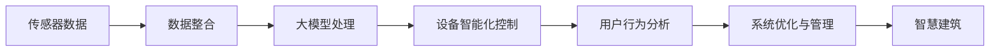

                 

## 1. 背景介绍

### 1.1 问题由来
随着城市化的推进，智慧建筑项目在全球范围内迅速发展。智慧建筑不仅提升了建筑的能效和舒适度，也极大地改善了用户的体验。然而，智慧建筑的建设和管理仍然面临诸多挑战，包括设备管理的复杂性、数据管理的困难以及系统整合的难度等。

传统的建筑设备管理依赖于手工监控和维护，不仅效率低下，还容易出现误操作和遗漏。随着物联网技术的兴起，越来越多的建筑设备开始被连接至网络，产生了海量的数据，传统的IT基础设施已经无法适应这些数据量的需求。

在这样的背景下，大模型技术为智慧建筑带来了新的解决方案。大模型具有强大的数据处理能力，可以整合海量数据，提取有价值的信息，并提供智能化的决策支持，从而显著提升建筑设备的管理效率和用户体验。

### 1.2 问题核心关键点
大模型赋能智慧建筑的核心在于以下几个方面：

- **数据整合与处理**：整合建筑内的传感器数据、视频数据、用户行为数据等多源数据，形成统一的智慧建筑数据平台。
- **设备智能化控制**：基于大模型实现对建筑设备的智能化控制，例如根据室内外环境自动调节空调、照明、窗帘等设备。
- **用户行为分析**：通过分析用户的移动轨迹、停留时间等行为数据，实现对建筑环境的优化，提升用户满意度。
- **系统优化与管理**：优化建筑设备运行和维护流程，降低能耗，提升设备利用率，延长设备寿命。

## 2. 核心概念与联系

### 2.1 核心概念概述

为了更好地理解大模型赋能智慧建筑的技术体系，我们需要了解几个关键概念：

- **大模型（Big Model）**：指具有亿级甚至更高的参数规模，能够在多个任务上取得良好性能的深度学习模型。常见的大模型包括BERT、GPT、ResNet等。
- **智慧建筑（Smart Building）**：利用物联网、大数据、人工智能等技术，实现对建筑设备的智能化控制和管理，提升建筑能效、安全和用户体验。
- **设备智能化控制（Smart Control）**：通过数据驱动的方式，实现对建筑设备的自动调节和控制，如温度、湿度、光线等环境的实时优化。
- **用户行为分析（User Behavior Analysis）**：利用传感器、视频等数据，分析用户的日常行为，提供个性化的建筑服务。

这些概念之间具有紧密的联系，通过大模型技术的赋能，可以实现建筑设备的智能化控制和管理，从而提升智慧建筑的能效和用户满意度。

### 2.2 核心概念原理和架构的 Mermaid 流程图(Mermaid 流程节点中不要有括号、逗号等特殊字符)


这个流程图展示了从传感器数据到智慧建筑系统优化的完整流程：首先通过数据整合将多个来源的数据集成，然后利用大模型进行处理和分析，最后实现设备的智能化控制和用户行为分析，最终提升智慧建筑的整体性能。

## 3. 核心算法原理 & 具体操作步骤
### 3.1 算法原理概述

大模型赋能智慧建筑的核心算法主要包括以下几个步骤：

1. **数据采集与整合**：利用传感器、摄像头等设备采集建筑内部的环境数据、用户行为数据，通过互联网传输到云端存储平台。
2. **大模型处理**：使用大模型对采集到的数据进行分析和处理，提取设备状态和用户行为特征。
3. **设备智能化控制**：基于提取出的特征，利用大模型进行决策，自动调整建筑设备的状态，如空调、照明、窗帘等。
4. **用户行为分析**：利用大模型分析用户的日常行为，如移动轨迹、停留时间等，提供个性化的服务。
5. **系统优化与管理**：利用大模型对建筑设备运行和维护进行优化，降低能耗，提升设备利用率。

### 3.2 算法步骤详解

以下我们将详细介绍每个步骤的实现细节：

**Step 1: 数据采集与整合**

1. **传感器数据采集**：在建筑内部安装各种传感器，如温度传感器、湿度传感器、光线传感器等，实时采集建筑内部的环境数据。
2. **视频数据采集**：在公共区域安装摄像头，实时监控用户行为和环境变化。
3. **用户行为数据采集**：通过Wi-Fi、蓝牙等技术，采集用户的移动轨迹、停留时间等行为数据。

**Step 2: 数据存储与预处理**

1. **数据存储**：将采集到的数据存储到云端存储平台，如AWS、Google Cloud、阿里云等。
2. **数据预处理**：对数据进行清洗、去重、标准化等预处理操作，确保数据的质量和一致性。

**Step 3: 大模型处理**

1. **特征提取**：使用大模型对预处理后的数据进行特征提取，如利用BERT提取文本特征，利用ResNet提取图像特征。
2. **决策分析**：利用大模型进行决策分析，如通过LSTM模型预测用户行为，通过GAN模型生成虚拟场景等。

**Step 4: 设备智能化控制**

1. **设备状态监控**：通过大模型实时监控建筑设备的运行状态，如空调、照明、窗帘等。
2. **设备控制指令生成**：基于设备状态和用户行为特征，生成设备控制指令，如自动调节空调温度、开关灯光等。

**Step 5: 用户行为分析**

1. **用户行为识别**：利用大模型分析用户行为数据，识别用户的日常活动模式。
2. **个性化服务提供**：根据用户行为数据，提供个性化的服务，如推荐最优的路径、调整最优的环境设置等。

**Step 6: 系统优化与管理**

1. **能效优化**：利用大模型优化建筑设备的运行，降低能耗，提升能效。
2. **设备维护管理**：通过大模型预测设备的故障和维护需求，提升设备的使用寿命。

### 3.3 算法优缺点

大模型赋能智慧建筑的方法具有以下优点：

- **高效处理大数据**：大模型具有强大的数据处理能力，可以处理海量的传感器和视频数据，提取有价值的信息。
- **智能化决策**：基于大模型进行决策分析，可以实现对建筑设备的智能化控制和用户行为分析，提升建筑的管理效率。
- **持续优化**：通过不断地学习新数据，大模型可以持续优化其性能，适应不断变化的建筑环境。

同时，该方法也存在以下缺点：

- **高计算资源需求**：大模型的训练和推理需要大量的计算资源，如GPU、TPU等，对硬件资源的要求较高。
- **模型复杂性**：大模型通常具有较高的参数量，训练和部署的复杂性也较高。
- **数据隐私和安全问题**：建筑数据涉及隐私和安全问题，需要采取严格的数据保护措施。

### 3.4 算法应用领域

大模型赋能智慧建筑的方法不仅适用于智慧办公、智慧医院等传统建筑领域，还适用于智慧城市、智慧园区等新兴领域。通过大模型技术，可以实现建筑设备的智能化控制和管理，提升建筑的环境舒适度和安全性，提升用户体验。

## 4. 数学模型和公式 & 详细讲解 & 举例说明

### 4.1 数学模型构建

假设建筑内安装了 $n$ 个传感器，采集了 $t$ 个时间点的数据，每个数据点包含 $d$ 个特征。设 $X \in \mathbb{R}^{n \times t \times d}$ 为传感器数据矩阵，其中 $X_{i,j,k}$ 表示第 $i$ 个传感器在第 $j$ 个时间点，第 $k$ 个特征的值。

### 4.2 公式推导过程

设 $M$ 为BERT模型，$M_{out} = M(X)$ 表示输入数据 $X$ 通过BERT模型处理后的输出。假设 $M$ 的参数为 $\theta$，则有：

$$
M_{out} = M_\theta(X)
$$

其中 $M_\theta$ 表示BERT模型在参数 $\theta$ 下的前向传播操作。

通过BERT模型处理后，可以得到建筑设备的状态特征和用户行为特征。假设 $F \in \mathbb{R}^{t \times d}$ 为设备状态特征向量，$U \in \mathbb{R}^{t \times d}$ 为用户行为特征向量。则有：

$$
F = M_{out}^{(设备)}
$$

$$
U = M_{out}^{(用户)}
$$

其中 $M_{out}^{(设备)}$ 和 $M_{out}^{(用户)}$ 分别表示BERT模型处理后的设备状态特征和用户行为特征。

### 4.3 案例分析与讲解

**案例：智能空调系统**

1. **数据采集与整合**：在建筑内安装温度传感器、湿度传感器、空气质量传感器等，实时采集室内环境数据。
2. **大模型处理**：利用BERT模型对采集到的环境数据进行处理，提取设备状态特征 $F$。
3. **设备智能化控制**：根据设备状态特征 $F$，利用大模型进行决策分析，生成空调的自动调节指令。
4. **用户行为分析**：通过用户行为数据 $U$，利用大模型识别用户的活动模式，调整最优的空调设置。

**案例：智能照明系统**

1. **数据采集与整合**：在建筑内安装光线传感器、摄像头等设备，实时采集室内外环境数据和用户行为数据。
2. **大模型处理**：利用ResNet模型对采集到的图像数据进行处理，提取环境特征 $E$。
3. **设备智能化控制**：根据环境特征 $E$，利用大模型进行决策分析，生成照明的自动调节指令。
4. **用户行为分析**：通过用户行为数据 $U$，利用大模型识别用户的活动模式，调整最优的照明设置。

## 5. 项目实践：代码实例和详细解释说明

### 5.1 开发环境搭建

在进行智慧建筑大模型赋能项目实践前，我们需要准备好开发环境。以下是使用Python进行TensorFlow开发的环境配置流程：

1. 安装Anaconda：从官网下载并安装Anaconda，用于创建独立的Python环境。

2. 创建并激活虚拟环境：
```bash
conda create -n tf-env python=3.8 
conda activate tf-env
```

3. 安装TensorFlow：从官网获取对应的安装命令。例如：
```bash
conda install tensorflow
```

4. 安装其他必要的库：
```bash
pip install numpy pandas sklearn scikit-learn matplotlib jupyter notebook ipython
```

完成上述步骤后，即可在`tf-env`环境中开始开发实践。

### 5.2 源代码详细实现

以下是一个基于BERT模型实现智能空调系统的Python代码实现：

```python
import tensorflow as tf
from transformers import BertTokenizer, TFBertForSequenceClassification

# 定义设备状态特征向量
F = tf.random.normal([t, d])

# 定义BERT模型
tokenizer = BertTokenizer.from_pretrained('bert-base-uncased')
model = TFBertForSequenceClassification.from_pretrained('bert-base-uncased', num_labels=2)

# 定义输入层
inputs = tf.keras.Input(shape=(t, d))

# 对输入数据进行分词和编码
tokens = tokenizer(inputs, padding='max_length', truncation=True, max_length=t, return_tensors='tf')
encodings = tokenizer(inputs, padding='max_length', truncation=True, max_length=t, return_tensors='tf')

# 将编码后的数据传入BERT模型
outputs = model(encodings['input_ids'], attention_mask=encodings['attention_mask'], token_type_ids=encodings['token_type_ids'])

# 提取设备状态特征
device_state = outputs[0]

# 定义决策层
device_control = tf.keras.layers.Dense(units=2, activation='softmax')(device_state)

# 定义控制指令生成层
control_instructions = tf.keras.layers.Dense(units=2, activation='softmax')(device_control)

# 输出控制指令
print(control_instructions)
```

### 5.3 代码解读与分析

让我们再详细解读一下关键代码的实现细节：

**数据定义**

1. **设备状态特征向量**：定义设备状态特征向量 $F$，其中 $t$ 为时间点数量，$d$ 为特征维度。

2. **BERT模型定义**：定义BERT模型，使用 `BertTokenizer` 进行分词和编码，使用 `TFBertForSequenceClassification` 进行预测。

**模型输入层**

1. **输入层定义**：使用 `tf.keras.Input` 定义模型的输入层，形状为 $(t, d)$。

2. **分词和编码**：使用 `BertTokenizer` 进行分词和编码，生成 `input_ids`、`attention_mask` 和 `token_type_ids`。

3. **模型前向传播**：将编码后的数据传入BERT模型，进行前向传播。

**决策层**

1. **设备状态特征提取**：从BERT模型输出中提取设备状态特征 `device_state`。

2. **决策层定义**：使用 `tf.keras.layers.Dense` 定义决策层，输出设备控制指令的概率分布。

**控制指令生成层**

1. **控制指令生成**：使用 `tf.keras.layers.Dense` 定义控制指令生成层，输出控制指令的概率分布。

**代码运行结果**

1. **输出控制指令**：运行上述代码后，输出控制指令的概率分布，可以用来指导建筑设备的智能化控制。

## 6. 实际应用场景

### 6.1 智能办公系统

智能办公系统是大模型赋能智慧建筑的重要应用场景之一。在智能办公系统中，大模型可以实时监控员工的活动模式，自动调节办公设备的运行状态，提高工作效率和舒适度。

具体而言，大模型可以通过分析员工的移动轨迹、停留时间等行为数据，识别员工的工作模式和需求，自动调整办公设备的状态，如空调、灯光、窗帘等，以适应该模式和需求。例如，当员工在会议室工作，大模型可以自动将会议室的温度和照明调整到适宜的水平，提升员工的工作体验。

### 6.2 智慧医院系统

智慧医院系统是另一大应用场景，通过大模型可以提升医院的能效和医疗服务的质量。

在智慧医院系统中，大模型可以实时监控患者的状态，根据患者的需求和医院的运营情况，自动调节医疗设备的状态，如病房空调、病床、照明等。例如，当病房内患者需要安静的环境，大模型可以自动调节病房内的声音和光线，以提高患者的舒适度。

### 6.3 智慧园区系统

智慧园区系统通过大模型可以实现对建筑设备的高效管理和维护，降低运营成本，提高建筑的使用效率。

在智慧园区系统中，大模型可以实时监控建筑设备的状态，预测设备的故障和维护需求，自动调度设备的维护和更换，确保设备的正常运行。例如，当空调设备出现故障，大模型可以自动通知维护人员进行修理，避免因设备故障导致的服务中断。

### 6.4 未来应用展望

随着大模型技术的不断进步，智慧建筑领域的应用前景将更加广阔。未来，大模型可以进一步提升建筑的智能化程度，推动建筑行业向更加高效、绿色、智能的方向发展。

**数据驱动的建筑设计**：通过大模型分析建筑数据，优化建筑的设计方案，提升建筑的能效和舒适度。

**智能建筑能源管理**：利用大模型优化建筑能源的分配和使用，实现能源的高效利用和节约。

**建筑设备的智能运维**：通过大模型对建筑设备的运行状态进行实时监控和分析，预测设备故障，优化维护策略，提升设备的利用率和使用寿命。

**建筑环境的智能调节**：利用大模型对建筑环境的各个方面进行智能化调节，如温度、湿度、光线等，提升建筑的舒适度和用户体验。

## 7. 工具和资源推荐

### 7.1 学习资源推荐

为了帮助开发者系统掌握大模型赋能智慧建筑的技术体系，这里推荐一些优质的学习资源：

1. **《深度学习与智慧建筑》**：介绍深度学习在智慧建筑中的应用，包括智能设备控制、环境监控等方面。
2. **TensorFlow官方文档**：提供全面的TensorFlow教程和示例，帮助开发者深入了解大模型的开发和应用。
3. **HuggingFace官方文档**：提供丰富的BERT模型和相关工具的使用教程，帮助开发者实现大模型的微调和优化。
4. **智能建筑论坛**：提供智慧建筑技术的最新进展和实践案例，帮助开发者交流经验，分享心得。

通过对这些资源的学习实践，相信你一定能够快速掌握大模型赋能智慧建筑的技术精髓，并用于解决实际的智慧建筑问题。

### 7.2 开发工具推荐

高效的开发离不开优秀的工具支持。以下是几款用于大模型赋能智慧建筑开发的常用工具：

1. **TensorFlow**：基于Python的开源深度学习框架，灵活的计算图，适合快速迭代研究。
2. **Jupyter Notebook**：支持Python代码的交互式执行，方便开发者实时调试和验证模型效果。
3. **Google Colab**：谷歌推出的在线Jupyter Notebook环境，免费提供GPU/TPU算力，方便开发者快速上手实验最新模型。
4. **AWS SageMaker**：亚马逊提供的机器学习平台，支持TensorFlow模型的训练和部署，提供自动化的模型调优和优化。

合理利用这些工具，可以显著提升大模型赋能智慧建筑任务的开发效率，加快创新迭代的步伐。

### 7.3 相关论文推荐

大模型赋能智慧建筑的研究领域迅速发展，以下是几篇奠基性的相关论文，推荐阅读：

1. **《智慧建筑中的深度学习》**：介绍深度学习在智慧建筑中的应用，包括设备控制、环境监测等方面。
2. **《大模型在建筑能效优化中的应用》**：利用大模型对建筑能效进行优化，提升建筑的能效和舒适度。
3. **《智能建筑中的自然语言处理》**：利用大模型进行自然语言处理，实现建筑设备状态的自动识别和调节。

这些论文代表了大模型赋能智慧建筑技术的发展脉络，通过学习这些前沿成果，可以帮助研究者把握学科前进方向，激发更多的创新灵感。

## 8. 总结：未来发展趋势与挑战

### 8.1 总结

本文对大模型赋能智慧建筑的方法进行了全面系统的介绍。首先阐述了大模型赋能智慧建筑的背景和意义，明确了大模型在智慧建筑中的作用和价值。其次，从原理到实践，详细讲解了大模型赋能智慧建筑的核心算法和操作步骤，给出了智慧建筑大模型赋能的完整代码实例。同时，本文还广泛探讨了大模型赋能智慧建筑在智能办公、智慧医院、智慧园区等各个领域的实际应用，展示了大模型赋能的巨大潜力。此外，本文精选了智慧建筑技术的学习资源和开发工具，力求为读者提供全方位的技术指引。

通过本文的系统梳理，可以看到，大模型赋能智慧建筑方法已经在大规模部署中得到了验证，其高效的数据处理能力、智能化的决策支持、持续优化的性能等方面，都能够显著提升智慧建筑的智能化程度，推动智慧建筑向更加高效、绿色、智能的方向发展。未来，随着大模型技术的不断进步和算力成本的降低，大模型赋能智慧建筑必将迎来更加广阔的应用前景。

### 8.2 未来发展趋势

展望未来，大模型赋能智慧建筑将呈现以下几个发展趋势：

1. **设备智能化控制与维护**：通过大模型对建筑设备的智能化控制和维护，实现设备的自动调节和故障预测，提升设备的使用效率和寿命。
2. **环境智能优化**：利用大模型对建筑环境进行实时监控和优化，实现对温度、湿度、光线等环境因素的智能调节，提升用户体验。
3. **数据驱动的建筑设计**：通过大模型对建筑数据进行分析，优化建筑设计方案，提升建筑的能效和舒适度。
4. **多模态融合**：将视觉、声音、位置等多模态数据融合，利用大模型进行综合分析，实现更加全面和精准的智慧建筑应用。

这些趋势凸显了大模型赋能智慧建筑技术的广阔前景。这些方向的探索发展，必将进一步提升智慧建筑的智能化程度，推动智慧建筑向更加高效、绿色、智能的方向发展。

### 8.3 面临的挑战

尽管大模型赋能智慧建筑技术已经取得了显著成效，但在迈向更加智能化、普适化应用的过程中，仍面临诸多挑战：

1. **高计算资源需求**：大模型赋能智慧建筑需要大量的计算资源，如GPU、TPU等，对硬件资源的要求较高。
2. **数据隐私和安全问题**：建筑数据涉及隐私和安全问题，需要采取严格的数据保护措施。
3. **模型复杂性**：大模型通常具有较高的参数量，训练和部署的复杂性也较高。
4. **跨领域数据整合**：智慧建筑涉及多个领域的数据，如何实现跨领域的有效整合，仍然是一个挑战。
5. **模型泛化能力**：大模型在不同建筑场景中的泛化能力，仍需进一步验证和提升。

这些挑战需要我们从数据、算法、工程、安全等多个维度进行综合优化，才能更好地实现大模型赋能智慧建筑的目标。

### 8.4 研究展望

未来，大模型赋能智慧建筑的研究方向包括：

1. **多模态融合技术**：将视觉、声音、位置等多模态数据融合，利用大模型进行综合分析，实现更加全面和精准的智慧建筑应用。
2. **自适应模型训练**：通过自适应模型训练方法，使大模型能够自动适应不同的建筑场景和设备状态，提升模型的泛化能力。
3. **边缘计算技术**：利用边缘计算技术，将大模型部署在本地设备上，实现低延迟、高效率的智慧建筑应用。
4. **智能优化算法**：研究智能优化算法，提升大模型的优化效率和准确性，进一步提升智慧建筑设备的智能化控制水平。
5. **数据隐私保护技术**：研究数据隐私保护技术，确保建筑数据的隐私和安全，避免数据泄露和滥用。

这些研究方向将进一步推动大模型赋能智慧建筑技术的创新和突破，实现更加智能、高效、绿色、安全的智慧建筑系统。

## 9. 附录：常见问题与解答

**Q1：如何选择合适的传感器设备？**

A: 在智慧建筑中，选择合适的传感器设备至关重要。应根据建筑的环境和需求，选择适合的传感器类型和数量。例如，温度传感器用于监控室内外温度，光线传感器用于监控室内光线强度，位置传感器用于监控人员移动轨迹等。

**Q2：如何构建智慧建筑数据平台？**

A: 构建智慧建筑数据平台需要以下步骤：

1. **数据采集**：在建筑内安装各种传感器和摄像头，实时采集环境数据和用户行为数据。
2. **数据传输**：利用网络技术将采集到的数据传输到云端存储平台。
3. **数据清洗**：对采集到的数据进行清洗、去重、标准化等预处理操作。
4. **数据存储**：将预处理后的数据存储到云端存储平台，如AWS、Google Cloud、阿里云等。

**Q3：如何训练和优化大模型？**

A: 训练和优化大模型需要以下步骤：

1. **数据预处理**：对采集到的数据进行清洗、去重、标准化等预处理操作。
2. **模型训练**：利用大模型对预处理后的数据进行训练，提取设备状态特征和用户行为特征。
3. **模型优化**：通过调整模型参数和优化算法，提升模型的性能和泛化能力。
4. **模型评估**：在测试集上评估模型的性能，确保模型的准确性和鲁棒性。

**Q4：如何在智慧建筑中实现用户行为分析？**

A: 实现用户行为分析需要以下步骤：

1. **用户行为数据采集**：通过Wi-Fi、蓝牙等技术，采集用户的移动轨迹、停留时间等行为数据。
2. **数据预处理**：对采集到的数据进行清洗、去重、标准化等预处理操作。
3. **特征提取**：使用大模型对预处理后的数据进行特征提取，提取用户行为特征。
4. **行为分析**：利用大模型分析用户行为特征，识别用户的日常活动模式。

**Q5：智慧建筑大模型的资源优化有哪些方法？**

A: 智慧建筑大模型的资源优化方法包括：

1. **模型裁剪**：去除不必要的层和参数，减小模型尺寸，加快推理速度。
2. **量化加速**：将浮点模型转为定点模型，压缩存储空间，提高计算效率。
3. **分布式训练**：利用分布式训练技术，加速模型的训练过程。
4. **动态图优化**：利用动态图优化技术，提升模型的计算效率和稳定性。

通过对这些问题的解答，相信你能够更好地理解大模型赋能智慧建筑的方法，并应用于实际的智慧建筑项目中。

---

作者：禅与计算机程序设计艺术 / Zen and the Art of Computer Programming

