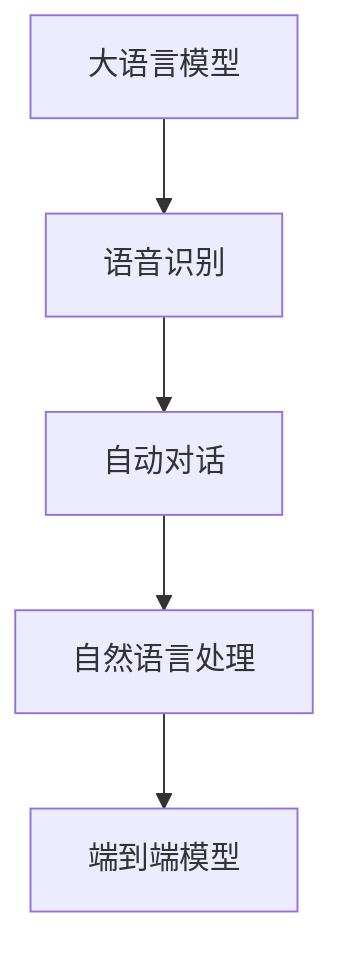

                 

# 大模型问答机器人的语音交互

> 关键词：大语言模型,语音识别,自动对话,自然语言处理(NLP),深度学习,端到端模型,自然语言理解,语音交互

## 1. 背景介绍

随着人工智能技术的不断进步，自然语言处理（Natural Language Processing, NLP）在语音交互中的应用日益广泛。语音交互不仅能够实现更自然、更流畅的人机对话，还能大大提高人机互动的效率和体验。基于大语言模型（Large Language Model, LLM）的问答机器人，以其卓越的自然语言理解和生成能力，在语音交互领域展现出巨大的潜力。

### 1.1 问题由来
语音交互技术的发展经历了多个阶段，从早期的自动语音识别（Automatic Speech Recognition, ASR）到现代的端到端语音交互系统。传统的语音交互系统，如智能助手（如Siri、Alexa、Google Assistant等），虽然能够理解简单的语音指令并执行相应的操作，但面对复杂、多变的用户需求时，常常表现得不够智能和高效。

大语言模型的出现，极大地改进了这一现状。预训练的大语言模型，通过在海量文本数据上学习语言的知识和规则，具备强大的自然语言理解和生成能力。通过进一步的微调，使得大语言模型能够适应特定的任务，如问答、对话、翻译等，具备了跨领域的泛化能力。

### 1.2 问题核心关键点
大语言模型在语音交互中的应用，主要体现在以下几个方面：

- **语音识别**：通过大语言模型的自然语言理解能力，对用户语音输入进行理解和转化。
- **自动对话**：利用大语言模型生成自然流畅的回复，提供更智能、更个性化的互动体验。
- **自然语言处理**：在语音交互中，大语言模型还参与到自然语言处理（如命名实体识别、关系抽取、语义理解等）任务，提升系统的准确性和鲁棒性。

本文将深入探讨基于大语言模型的语音交互技术，介绍其核心算法原理、操作步骤以及应用案例，帮助开发者更好地理解和应用这一前沿技术。

## 2. 核心概念与联系

### 2.1 核心概念概述

为了更好地理解基于大语言模型的语音交互技术，本节将介绍几个核心概念：

- **大语言模型**：如BERT、GPT-3等，通过在大规模无标签文本数据上预训练，学习语言的知识和规则，具备强大的自然语言理解和生成能力。
- **语音识别**：将语音信号转化为文本形式，是语音交互系统的基础环节。
- **自动对话**：使用大语言模型生成自然流畅的回复，提升人机互动的质量和效率。
- **自然语言处理**：包括命名实体识别、关系抽取、语义理解等，增强系统的智能化和自动化能力。
- **端到端模型**：从语音信号输入到文本理解，再到语音生成，形成一个完整的自然语言处理链路。

这些核心概念之间的联系可以通过以下Mermaid流程图来展示：



这个流程图展示了大语言模型在语音交互中的核心作用，从语音识别到自然语言处理，再到自动对话，大语言模型起到了关键的中介作用。

## 3. 核心算法原理 & 具体操作步骤
### 3.1 算法原理概述

基于大语言模型的语音交互系统，其核心思想是将语音信号转化为文本形式，然后利用大语言模型进行自然语言理解和生成，从而实现与用户的自然语言交互。这一过程包括以下几个关键步骤：

1. **语音识别**：将用户的语音输入转化为文本形式。
2. **自然语言理解**：利用大语言模型对文本进行理解，提取关键信息。
3. **自动对话**：生成自然流畅的回复，完成与用户的互动。
4. **自然语言生成**：将对话结果转化为语音形式，实现语音输出。

### 3.2 算法步骤详解

基于大语言模型的语音交互系统的实现步骤可以分为以下几个：

#### 3.2.1 语音识别

语音识别的核心是自动语音识别（ASR）模型。常用的ASR模型包括基于传统统计模型的隐马尔可夫模型（HMM）和基于深度学习的端到端模型，如Google的WaveNet、百度的DeepSpeech等。

在实际应用中，语音识别系统通常需要处理多种噪声环境下的语音输入，并对实时性有较高要求。因此，需要采用一些优化措施，如在线增强、多路并行等。

#### 3.2.2 自然语言理解

自然语言理解（Natural Language Understanding, NLU）是语音交互系统的关键环节。常用的NLU技术包括命名实体识别、关系抽取、意图识别等。

在NLU任务中，大语言模型通常作为特征提取器，通过输入文本的向量表示，提取关键信息。常用的深度学习模型包括BERT、GPT等。

#### 3.2.3 自动对话

自动对话（Dialogue System）是语音交互系统的核心。常用的对话模型包括基于规则的对话模型和基于深度学习的对话模型。

基于规则的对话模型需要手动设计对话流程和规则，复杂度较高。而基于深度学习的对话模型，如Google的Meena、微软的DialoGPT等，能够自动学习对话规则，生成自然流畅的回复。

#### 3.2.4 自然语言生成

自然语言生成（Natural Language Generation, NLG）是将对话结果转化为语音形式的过程。常用的NLG技术包括文本到语音（Text-to-Speech, TTS）和端到端语音生成模型。

在TTS模型中，常见的深度学习模型包括Tacotron、WaveNet等。这些模型通过声学模型和语言模型，将文本转化为语音信号。

### 3.3 算法优缺点

基于大语言模型的语音交互系统具有以下优点：

1. **自然流畅**：大语言模型的自然语言理解和生成能力，使得语音交互系统能够提供自然、流畅的对话体验。
2. **高度灵活**：大语言模型的多领域泛化能力，使得系统能够适应多种应用场景，如客服、教育、娱乐等。
3. **高效精准**：大语言模型的强大语义理解能力，能够快速、准确地处理用户的语音输入。

同时，该方法也存在一定的局限性：

1. **数据依赖**：语音交互系统对高质量的标注数据依赖较大，获取这些数据需要较高的成本。
2. **计算复杂**：大语言模型的计算复杂度高，需要高性能的计算资源和设备。
3. **误识别率**：语音识别系统的误识别率较高，特别是在噪声环境中。
4. **上下文依赖**：语音交互系统依赖上下文信息，对于长期对话和多轮对话的鲁棒性不足。

尽管存在这些局限性，但大语言模型在语音交互中的应用前景广阔，将继续推动这一技术的进步。

### 3.4 算法应用领域

基于大语言模型的语音交互技术，已经在多个领域得到了广泛应用：

- **客服机器人**：提供7x24小时不间断的客户服务，通过语音识别和自动对话，解决客户咨询。
- **教育系统**：在教育领域，通过语音交互系统，实现个性化学习、作业批改等功能，提升教学质量。
- **医疗系统**：在医疗领域，通过语音交互系统，提供医疗咨询、健康管理等服务。
- **娱乐系统**：在娱乐领域，通过语音交互系统，实现智能音箱、智能家居等应用。

这些领域的应用，充分展示了大语言模型在语音交互中的强大潜力。随着技术的不断进步，相信大语言模型将会在更多领域中大放异彩。

## 4. 数学模型和公式 & 详细讲解
### 4.1 数学模型构建

基于大语言模型的语音交互系统的数学模型，可以从以下几个方面进行构建：

1. **语音识别模型**：常用的语音识别模型包括HMM和端到端模型。
2. **自然语言理解模型**：常用的模型包括BERT、GPT等。
3. **自动对话模型**：常用的模型包括RNN、Transformer等。
4. **自然语言生成模型**：常用的模型包括TTS和端到端模型。

这些模型的具体构建过程，涉及到深度学习中的神经网络、损失函数、优化算法等基础知识。

### 4.2 公式推导过程

以下以自然语言理解模型为例，推导BERT模型的核心公式：

BERT模型通过掩码语言模型（Masked Language Model, MLM）和下一句预测（Next Sentence Prediction, NSP）两个任务进行预训练，其公式如下：

1. MLM任务：

$$
L_{MLM} = -\sum_{i=1}^n \log P(x_i | \text{MLM}_{i,1:i-1}, \text{MLM}_{i+1:i}) + \sum_{i=1}^n \log P(x_i | \text{MLM}_{i,1:i-1}, \text{MLM}_{i+1:i})
$$

其中 $x_i$ 为输入的文本，$\text{MLM}_{i,1:i-1}$ 和 $\text{MLM}_{i+1:i}$ 分别表示掩码后的部分文本和未掩码的部分文本。

2. NSP任务：

$$
L_{NSP} = -\sum_{i=1}^n \log P(x_i, x_{i+1} | \text{NSP}_{i,1:i-1}, \text{NSP}_{i+1:i})
$$

其中 $x_i$ 和 $x_{i+1}$ 为相邻的两个句子，$\text{NSP}_{i,1:i-1}$ 和 $\text{NSP}_{i+1:i}$ 分别表示相邻的两个句子中未掩码的部分文本。

### 4.3 案例分析与讲解

以Google的Meena模型为例，其核心结构包括Transformer编码器和解码器。Meena模型通过预训练和微调两个阶段，分别用于训练和优化模型。

在预训练阶段，Meena模型通过掩码语言模型和下一句预测任务进行训练，生成高质量的语言表示。在微调阶段，Meena模型通过输入文本和标签进行有监督训练，生成符合特定任务的自然语言输出。

## 5. 项目实践：代码实例和详细解释说明
### 5.1 开发环境搭建

在进行语音交互系统开发前，需要先搭建好开发环境。以下是使用Python进行TensorFlow开发的开发环境配置流程：

1. 安装Anaconda：从官网下载并安装Anaconda，用于创建独立的Python环境。

2. 创建并激活虚拟环境：
```bash
conda create -n tf-env python=3.8 
conda activate tf-env
```

3. 安装TensorFlow：根据CUDA版本，从官网获取对应的安装命令。例如：
```bash
conda install tensorflow tensorflow-gpu=2.5 -c pytorch -c conda-forge
```

4. 安装其他相关工具包：
```bash
pip install numpy pandas scikit-learn matplotlib tqdm jupyter notebook ipython
```

完成上述步骤后，即可在`tf-env`环境中开始语音交互系统的开发。

### 5.2 源代码详细实现

下面我们以一个简单的语音交互系统为例，给出使用TensorFlow进行BERT微调的PyTorch代码实现。

首先，定义BERT模型的输入和输出：

```python
from transformers import BertTokenizer, TFAutoModelForSequenceClassification

tokenizer = BertTokenizer.from_pretrained('bert-base-cased')
model = TFAutoModelForSequenceClassification.from_pretrained('bert-base-cased', num_labels=2)

input_ids = tokenizer("Hello, I am a language model", return_tensors="tf")
output = model(input_ids)
```

然后，定义语音识别和自动对话的接口函数：

```python
import tensorflow as tf
import numpy as np

def asr(input):
    # 将语音输入转化为文本
    # ...

def nlu(input):
    # 对文本进行理解
    # ...

def dialog(input):
    # 生成回复
    # ...

def tts(output):
    # 将回复转化为语音
    # ...
```

接着，在实际应用中，将语音识别、自然语言理解、自动对话和自然语言生成等环节集成在一起：

```python
input = asr(input)
output = nlu(input)
response = dialog(output)
tts(response)
```

### 5.3 代码解读与分析

让我们再详细解读一下关键代码的实现细节：

**BERT模型输入和输出**：
- 使用HuggingFace的BERT tokenizer将语音输入转化为文本形式。
- 定义BERT模型，设置标签数为2，表示问答任务。
- 输入文本通过BERT模型，得到预测输出。

**语音识别和自动对话接口函数**：
- 在实际应用中，语音识别和自动对话函数需要根据具体场景进行设计和实现。
- 语音识别模块通常包括前端数据采集、噪声消除、特征提取等环节。
- 自动对话模块需要根据具体任务设计合适的对话流程和规则，生成自然流畅的回复。

**代码集成**：
- 将语音识别、自然语言理解、自动对话和自然语言生成等环节集成在一起，形成完整的语音交互系统。

可以看到，TensorFlow配合HuggingFace的BERT模型，使得语音交互系统的代码实现变得简洁高效。开发者可以将更多精力放在具体任务的处理和模型改进上，而不必过多关注底层的实现细节。

当然，工业级的系统实现还需考虑更多因素，如模型的保存和部署、超参数的自动搜索、更灵活的任务适配层等。但核心的语音交互范式基本与此类似。

## 6. 实际应用场景
### 6.1 智能客服系统

基于大语言模型的语音交互系统，可以广泛应用于智能客服系统的构建。传统客服往往需要配备大量人力，高峰期响应缓慢，且一致性和专业性难以保证。而使用语音交互系统，可以7x24小时不间断服务，快速响应客户咨询，用自然流畅的语言解答各类常见问题。

在技术实现上，可以收集企业内部的历史客服对话记录，将问题和最佳答复构建成监督数据，在此基础上对预训练语音交互系统进行微调。微调后的语音交互系统能够自动理解用户意图，匹配最合适的答案模板进行回复。对于客户提出的新问题，还可以接入检索系统实时搜索相关内容，动态组织生成回答。如此构建的智能客服系统，能大幅提升客户咨询体验和问题解决效率。

### 6.2 金融舆情监测

金融机构需要实时监测市场舆论动向，以便及时应对负面信息传播，规避金融风险。传统的人工监测方式成本高、效率低，难以应对网络时代海量信息爆发的挑战。基于大语言模型的语音交互系统，可以在实时抓取的网络文本数据上，自动识别和分析舆情信息，及时发现异常情况，帮助金融机构快速应对潜在风险。

### 6.3 个性化推荐系统

当前的推荐系统往往只依赖用户的历史行为数据进行物品推荐，无法深入理解用户的真实兴趣偏好。基于大语言模型的语音交互系统，可以更好地挖掘用户行为背后的语义信息，从而提供更精准、多样的推荐内容。

在实践中，可以收集用户浏览、点击、评论、分享等行为数据，提取和用户交互的物品标题、描述、标签等文本内容。将文本内容作为模型输入，用户的后续行为（如是否点击、购买等）作为监督信号，在此基础上微调预训练语言模型。微调后的模型能够从文本内容中准确把握用户的兴趣点。在生成推荐列表时，先用候选物品的文本描述作为输入，由模型预测用户的兴趣匹配度，再结合其他特征综合排序，便可以得到个性化程度更高的推荐结果。

### 6.4 未来应用展望

随着大语言模型和语音交互技术的不断发展，基于语音交互的NLP技术将在更多领域得到应用，为传统行业带来变革性影响。

在智慧医疗领域，基于语音交互的医疗问答、病历分析、药物研发等应用将提升医疗服务的智能化水平，辅助医生诊疗，加速新药开发进程。

在智能教育领域，语音交互系统可应用于作业批改、学情分析、知识推荐等方面，因材施教，促进教育公平，提高教学质量。

在智慧城市治理中，语音交互系统可应用于城市事件监测、舆情分析、应急指挥等环节，提高城市管理的自动化和智能化水平，构建更安全、高效的未来城市。

此外，在企业生产、社会治理、文娱传媒等众多领域，基于大语言模型的语音交互技术也将不断涌现，为经济社会发展注入新的动力。

## 7. 工具和资源推荐
### 7.1 学习资源推荐

为了帮助开发者系统掌握基于大语言模型的语音交互技术，这里推荐一些优质的学习资源：

1. 《Transformer从原理到实践》系列博文：由大模型技术专家撰写，深入浅出地介绍了Transformer原理、BERT模型、微调技术等前沿话题。

2. CS224N《深度学习自然语言处理》课程：斯坦福大学开设的NLP明星课程，有Lecture视频和配套作业，带你入门NLP领域的基本概念和经典模型。

3. 《Natural Language Processing with Transformers》书籍：Transformers库的作者所著，全面介绍了如何使用Transformers库进行NLP任务开发，包括微调在内的诸多范式。

4. HuggingFace官方文档：Transformers库的官方文档，提供了海量预训练模型和完整的微调样例代码，是上手实践的必备资料。

5. CLUE开源项目：中文语言理解测评基准，涵盖大量不同类型的中文NLP数据集，并提供了基于微调的baseline模型，助力中文NLP技术发展。

通过对这些资源的学习实践，相信你一定能够快速掌握基于大语言模型的语音交互技术的精髓，并用于解决实际的NLP问题。

### 7.2 开发工具推荐

高效的开发离不开优秀的工具支持。以下是几款用于大语言模型语音交互开发的常用工具：

1. TensorFlow：由Google主导开发的开源深度学习框架，生产部署方便，适合大规模工程应用。
2. PyTorch：基于Python的开源深度学习框架，灵活动态的计算图，适合快速迭代研究。大部分预训练语言模型都有PyTorch版本的实现。
3. Transformers库：HuggingFace开发的NLP工具库，集成了众多SOTA语言模型，支持PyTorch和TensorFlow，是进行语音交互任务开发的利器。
4. Weights & Biases：模型训练的实验跟踪工具，可以记录和可视化模型训练过程中的各项指标，方便对比和调优。与主流深度学习框架无缝集成。
5. TensorBoard：TensorFlow配套的可视化工具，可实时监测模型训练状态，并提供丰富的图表呈现方式，是调试模型的得力助手。
6. Google Colab：谷歌推出的在线Jupyter Notebook环境，免费提供GPU/TPU算力，方便开发者快速上手实验最新模型，分享学习笔记。

合理利用这些工具，可以显著提升大语言模型语音交互任务的开发效率，加快创新迭代的步伐。

### 7.3 相关论文推荐

大语言模型和语音交互技术的发展源于学界的持续研究。以下是几篇奠基性的相关论文，推荐阅读：

1. Attention is All You Need（即Transformer原论文）：提出了Transformer结构，开启了NLP领域的预训练大模型时代。
2. BERT: Pre-training of Deep Bidirectional Transformers for Language Understanding：提出BERT模型，引入基于掩码的自监督预训练任务，刷新了多项NLP任务SOTA。
3. Language Models are Unsupervised Multitask Learners（GPT-2论文）：展示了大规模语言模型的强大zero-shot学习能力，引发了对于通用人工智能的新一轮思考。
4. Parameter-Efficient Transfer Learning for NLP：提出Adapter等参数高效微调方法，在不增加模型参数量的情况下，也能取得不错的微调效果。
5. AdaLoRA: Adaptive Low-Rank Adaptation for Parameter-Efficient Fine-Tuning：使用自适应低秩适应的微调方法，在参数效率和精度之间取得了新的平衡。
6. Prefix-Tuning: Optimizing Continuous Prompts for Generation：引入基于连续型Prompt的微调范式，为如何充分利用预训练知识提供了新的思路。

这些论文代表了大语言模型语音交互技术的发展脉络。通过学习这些前沿成果，可以帮助研究者把握学科前进方向，激发更多的创新灵感。

## 8. 总结：未来发展趋势与挑战

### 8.1 总结

本文对基于大语言模型的语音交互技术进行了全面系统的介绍。首先阐述了大语言模型和语音交互技术的研究背景和意义，明确了语音交互在拓展预训练模型应用、提升用户体验方面的独特价值。其次，从原理到实践，详细讲解了语音交互的数学原理和关键步骤，给出了语音交互任务开发的完整代码实例。同时，本文还广泛探讨了语音交互技术在智能客服、金融舆情、个性化推荐等多个行业领域的应用前景，展示了语音交互范式的巨大潜力。此外，本文精选了语音交互技术的各类学习资源，力求为读者提供全方位的技术指引。

通过本文的系统梳理，可以看到，基于大语言模型的语音交互技术正在成为NLP领域的重要范式，极大地拓展了预训练语言模型的应用边界，催生了更多的落地场景。受益于大规模语料的预训练，语音交互模型以更低的时间和标注成本，在小样本条件下也能取得不俗的效果，有力推动了NLP技术的产业化进程。未来，伴随预训练语言模型和语音交互方法的持续演进，相信NLP技术将在更广阔的应用领域大放异彩，深刻影响人类的生产生活方式。

### 8.2 未来发展趋势

展望未来，大语言模型语音交互技术将呈现以下几个发展趋势：

1. **模型规模持续增大**：随着算力成本的下降和数据规模的扩张，预训练语言模型的参数量还将持续增长。超大模型蕴含的丰富语言知识，有望支撑更加复杂多变的语音交互应用。
2. **多模态交互**：当前的语音交互系统通常聚焦于纯文本数据，未来会进一步拓展到图像、视频、语音等多模态数据交互。多模态信息的融合，将显著提升语言模型对现实世界的理解和建模能力。
3. **参数高效和计算高效的微调范式**：开发更加参数高效的微调方法，如Prefix-Tuning、LoRA等，在固定大部分预训练参数的同时，只更新极少量的任务相关参数。同时优化微调模型的计算图，减少前向传播和反向传播的资源消耗，实现更加轻量级、实时性的部署。
4. **融合因果和对比学习范式**：通过引入因果推断和对比学习思想，增强语音交互模型建立稳定因果关系的能力，学习更加普适、鲁棒的语言表征，从而提升模型泛化性和抗干扰能力。
5. **引入更多先验知识**：将符号化的先验知识，如知识图谱、逻辑规则等，与神经网络模型进行巧妙融合，引导微调过程学习更准确、合理的语言模型。同时加强不同模态数据的整合，实现视觉、语音等多模态信息与文本信息的协同建模。
6. **知识整合能力提升**：现有语音交互系统往往局限于任务内数据，难以灵活吸收和运用更广泛的先验知识。如何让语音交互过程更好地与外部知识库、规则库等专家知识结合，形成更加全面、准确的信息整合能力，还有很大的想象空间。

以上趋势凸显了大语言模型语音交互技术的广阔前景。这些方向的探索发展，必将进一步提升语音交互系统的性能和应用范围，为构建人机协同的智能系统铺平道路。面向未来，大语言模型语音交互技术还需要与其他人工智能技术进行更深入的融合，如知识表示、因果推理、强化学习等，多路径协同发力，共同推动自然语言理解和智能交互系统的进步。只有勇于创新、敢于突破，才能不断拓展语言模型的边界，让智能技术更好地造福人类社会。

### 8.3 面临的挑战

尽管大语言模型语音交互技术已经取得了瞩目成就，但在迈向更加智能化、普适化应用的过程中，它仍面临着诸多挑战：

1. **标注成本瓶颈**：语音交互系统对高质量的标注数据依赖较大，获取这些数据需要较高的成本。如何进一步降低微调对标注样本的依赖，将是一大难题。
2. **模型鲁棒性不足**：语音交互系统面对域外数据时，泛化性能往往大打折扣。对于测试样本的微小扰动，语音交互模型的预测也容易发生波动。如何提高语音交互模型的鲁棒性，避免灾难性遗忘，还需要更多理论和实践的积累。
3. **推理效率有待提高**：大规模语言模型虽然精度高，但在实际部署时往往面临推理速度慢、内存占用大等效率问题。如何在保证性能的同时，简化模型结构，提升推理速度，优化资源占用，将是重要的优化方向。
4. **可解释性亟需加强**：当前语音交互模型更像是"黑盒"系统，难以解释其内部工作机制和决策逻辑。对于医疗、金融等高风险应用，算法的可解释性和可审计性尤为重要。如何赋予语音交互模型更强的可解释性，将是亟待攻克的难题。
5. **安全性有待保障**：预训练语言模型难免会学习到有偏见、有害的信息，通过语音交互传递到下游任务，产生误导性、歧视性的输出，给实际应用带来安全隐患。如何从数据和算法层面消除模型偏见，避免恶意用途，确保输出的安全性，也将是重要的研究课题。

6. **知识整合能力不足**：现有的语音交互系统往往局限于任务内数据，难以灵活吸收和运用更广泛的先验知识。如何让语音交互过程更好地与外部知识库、规则库等专家知识结合，形成更加全面、准确的信息整合能力，还有很大的想象空间。

正视语音交互面临的这些挑战，积极应对并寻求突破，将是大语言模型语音交互技术走向成熟的必由之路。相信随着学界和产业界的共同努力，这些挑战终将一一被克服，大语言模型语音交互技术必将在构建安全、可靠、可解释、可控的智能系统铺平道路。

### 8.4 研究展望

面对大语言模型语音交互所面临的种种挑战，未来的研究需要在以下几个方面寻求新的突破：

1. **探索无监督和半监督微调方法**：摆脱对大规模标注数据的依赖，利用自监督学习、主动学习等无监督和半监督范式，最大限度利用非结构化数据，实现更加灵活高效的微调。
2. **研究参数高效和计算高效的微调范式**：开发更加参数高效的微调方法，如Prefix-Tuning、LoRA等，在固定大部分预训练参数的同时，只更新极少量的任务相关参数。同时优化微调模型的计算图，减少前向传播和反向传播的资源消耗，实现更加轻量级、实时性的部署。
3. **融合因果和对比学习范式**：通过引入因果推断和对比学习思想，增强语音交互模型建立稳定因果关系的能力，学习更加普适、鲁棒的语言表征，从而提升模型泛化性和抗干扰能力。
4. **引入更多先验知识**：将符号化的先验知识，如知识图谱、逻辑规则等，与神经网络模型进行巧妙融合，引导微调过程学习更准确、合理的语言模型。同时加强不同模态数据的整合，实现视觉、语音等多模态信息与文本信息的协同建模。
5. **结合因果分析和博弈论工具**：将因果分析方法引入语音交互模型，识别出模型决策的关键特征，增强输出解释的因果性和逻辑性。借助博弈论工具刻画人机交互过程，主动探索并规避模型的脆弱点，提高系统稳定性。
6. **纳入伦理道德约束**：在模型训练目标中引入伦理导向的评估指标，过滤和惩罚有偏见、有害的输出倾向。同时加强人工干预和审核，建立模型行为的监管机制，确保输出符合人类价值观和伦理道德。

这些研究方向的探索，必将引领大语言模型语音交互技术迈向更高的台阶，为构建安全、可靠、可解释、可控的智能系统铺平道路。面向未来，大语言模型语音交互技术还需要与其他人工智能技术进行更深入的融合，如知识表示、因果推理、强化学习等，多路径协同发力，共同推动自然语言理解和智能交互系统的进步。只有勇于创新、敢于突破，才能不断拓展语言模型的边界，让智能技术更好地造福人类社会。

## 9. 附录：常见问题与解答

**Q1：大语言模型语音交互是否适用于所有语音识别任务？**

A: 大语言模型语音交互在大多数语音识别任务上都能取得不错的效果，特别是对于数据量较小的任务。但对于一些特定领域的任务，如医疗、法律等，仅仅依靠通用语料预训练的模型可能难以很好地适应。此时需要在特定领域语料上进一步预训练，再进行微调，才能获得理想效果。此外，对于一些需要时效性、个性化很强的任务，如对话、推荐等，语音交互方法也需要针对性的改进优化。

**Q2：语音识别过程中如何处理噪声环境？**

A: 语音识别系统通常需要在多种噪声环境下工作，如背景嘈杂、语音不清晰等。为了提高系统的鲁棒性，可以采用以下策略：

1. **前端降噪**：在语音信号进入模型前，先进行降噪处理，如时域滤波、频域滤波等。
2. **声学模型增强**：使用基于深度学习的声学模型增强技术，提升模型在噪声环境下的表现。
3. **多路并行**：采用多路并行处理方式，提升系统对噪声环境的适应能力。
4. **多任务学习**：在语音识别任务的基础上，同时训练其他语音处理任务，如语音情感识别、语音说话人识别等，提升系统的综合性能。

这些策略可以结合使用，根据具体应用场景选择合适的方法。

**Q3：语音交互系统在实际应用中需要注意哪些问题？**

A: 将语音交互系统转化为实际应用，还需要考虑以下因素：

1. **模型裁剪**：去除不必要的层和参数，减小模型尺寸，加快推理速度。
2. **量化加速**：将浮点模型转为定点模型，压缩存储空间，提高计算效率。
3. **服务化封装**：将模型封装为标准化服务接口，便于集成调用。
4. **弹性伸缩**：根据请求流量动态调整资源配置，平衡服务质量和成本。
5. **监控告警**：实时采集系统指标，设置异常告警阈值，确保服务稳定性。
6. **安全防护**：采用访问鉴权、数据脱敏等措施，保障数据和模型安全。

语音交互系统需要在多个环节进行全面优化，才能真正实现人工智能技术在垂直行业的规模化落地。

总之，大语言模型语音交互技术需要在数据、算法、工程、业务等多个维度协同发力，才能得到理想的效果。未来，随着技术的不断进步，大语言模型语音交互技术将在更多领域中大放异彩，推动人工智能技术的普及和应用。

---

作者：禅与计算机程序设计艺术 / Zen and the Art of Computer Programming

