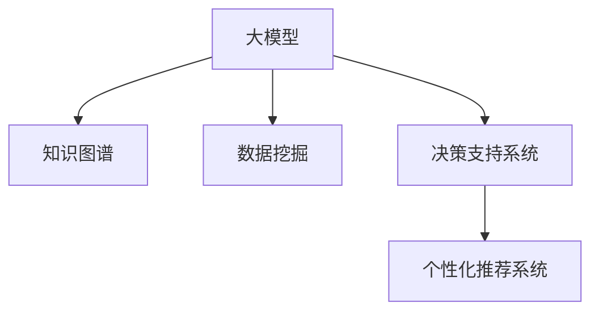

                 

# 大模型：商业智能的未来方向

> 关键词：商业智能,大模型,知识图谱,数据挖掘,决策支持系统

## 1. 背景介绍

### 1.1 问题由来

商业智能(Business Intelligence, BI)是一种数据分析技术，通过提取、分析和呈现组织数据，帮助决策者做出更明智的决策。传统BI系统依赖于复杂的数据仓库、多维分析工具和报表系统，虽然功能全面，但高度依赖人工提取和分析，难以快速响应市场需求变化。而随着大数据时代的到来，海量数据的实时分析和可视化需求日益增加，对BI系统提出了更高的要求。

大模型作为近年来人工智能领域的重大突破，以其强大的数据处理和分析能力，为商业智能的未来发展提供了新的方向。大模型通过预训练大量数据，学习到高层次的语言和知识表示，能够在自然语言处理(NLP)、图像识别、时间序列预测等众多领域发挥优异表现。将大模型应用于商业智能，可以大幅提升数据分析和决策支持的效率和准确性，满足企业对智能化需求。

### 1.2 问题核心关键点

大模型在商业智能中的应用，主要体现在以下几个方面：

- **数据预处理与特征工程**：通过大规模预训练模型，自动提取文本、图像等数据的特征，减少人工干预，提高数据质量。
- **自然语言处理与知识抽取**：利用大模型进行自然语言理解和知识抽取，将非结构化数据转化为结构化数据，增强数据分析的智能化水平。
- **预测建模与决策支持**：基于大模型进行预测建模，输出更准确的前景分析，辅助决策者制定策略。
- **个性化推荐与用户体验**：通过大模型对用户行为和偏好进行分析，提供定制化的推荐和交互体验，提升用户满意度。

这些关键点反映了大模型在商业智能中的应用潜力，但也对数据规模、模型复杂度、部署效率等方面提出了新的挑战。

## 2. 核心概念与联系

### 2.1 核心概念概述

为了深入理解大模型在商业智能中的应用，本节将介绍几个密切相关的核心概念：

- **大模型(Large Model)**：指通过大规模数据预训练得到的高性能神经网络模型，如BERT、GPT-3等。大模型具备强大的表征学习能力，能够在特定任务上取得优异表现。
- **知识图谱(Knowledge Graph)**：一种将实体、关系、属性等信息结构化的知识库，用于增强对领域知识的理解。知识图谱与大模型结合，可以实现更加智能化的数据分析。
- **数据挖掘(Data Mining)**：从大量数据中提取有用信息和知识的过程。数据挖掘结合大模型技术，可以实现自动化特征提取和模式识别，提升数据处理效率。
- **决策支持系统(Decision Support System, DSS)**：一种辅助决策者进行决策分析的系统，通过集成数据分析、可视化工具，提供智能决策支持。
- **个性化推荐系统(Personalized Recommendation System, PRS)**：根据用户行为和偏好，推荐个性化内容或服务的系统。大模型结合推荐算法，可以实现精准的用户画像和推荐效果。

这些核心概念之间的逻辑关系可以通过以下Mermaid流程图来展示：



这个流程图展示了大模型与商业智能核心概念之间的联系：

1. 大模型通过大规模预训练，学习到丰富的语言和知识表示。
2. 结合知识图谱，提升对领域知识的理解，增强智能分析能力。
3. 通过数据挖掘，自动化提取特征和模式，提高数据处理效率。
4. 与决策支持系统结合，提供智能决策分析，辅助管理决策。
5. 结合个性化推荐系统，提供定制化服务，提升用户体验。

## 3. 核心算法原理 & 具体操作步骤
### 3.1 算法原理概述

大模型在商业智能中的应用，主要基于监督学习和无监督学习的算法原理。其核心思想是：利用大模型学习到的语言和知识表示，结合领域知识图谱和数据挖掘技术，自动化地提取、分析和呈现组织数据，辅助决策者做出更优的商业决策。

具体来说，大模型在商业智能中的应用可以分为以下几个步骤：

1. **数据预处理与特征工程**：对原始数据进行清洗、转换和特征提取，生成可用于训练的大模型所需格式。
2. **自然语言处理与知识抽取**：利用大模型进行文本分类、命名实体识别、关系抽取等任务，将非结构化数据转化为结构化数据。
3. **预测建模与决策支持**：基于预训练模型的输出，进行预测建模，输出预测结果，辅助决策者制定策略。
4. **个性化推荐与用户体验**：结合用户行为数据，通过大模型进行推荐模型训练，提供个性化推荐服务。

### 3.2 算法步骤详解

#### 3.2.1 数据预处理与特征工程

数据预处理与特征工程是大模型应用于商业智能的第一步，主要包括以下几个步骤：

1. **数据清洗**：去除数据中的噪声和异常值，确保数据质量。
2. **数据转换**：将数据格式转换为大模型所需的格式，如Token化、向量化等。
3. **特征提取**：通过大模型自动提取数据的特征，生成可用于训练的特征向量。

具体实现中，可以使用Python的Pandas库进行数据清洗和转换，使用TensorFlow或PyTorch进行特征提取。

#### 3.2.2 自然语言处理与知识抽取

自然语言处理(NLP)与知识抽取是大模型在商业智能中应用的核心。主要通过以下步骤实现：

1. **文本预处理**：去除停用词、标点符号，进行词性标注、分词等操作。
2. **命名实体识别**：识别文本中的实体，如人名、地名、组织机构名等。
3. **关系抽取**：从文本中抽取出实体之间的关系，如“张三在一家银行工作”，可以抽取出张三、银行、工作三者之间的关系。
4. **文本分类**：将文本分为不同的类别，如商品评论、新闻、广告等。

这些任务可以通过预训练的BERT、GPT等大模型，结合相应的任务适配层和损失函数，进行有监督的微调训练。训练后的模型可以自动从文本中提取关键信息，生成结构化数据。

#### 3.2.3 预测建模与决策支持

预测建模与决策支持主要包括以下步骤：

1. **建立预测模型**：利用大模型进行预测建模，如回归、分类、序列预测等。
2. **模型评估**：通过验证集评估模型的性能，调整模型参数，提高预测精度。
3. **决策支持**：将预测结果整合到决策支持系统中，辅助管理决策。

例如，可以使用大模型预测股票价格，输出未来几天的价格预测，结合历史数据和市场动态，辅助投资者进行决策。

#### 3.2.4 个性化推荐与用户体验

个性化推荐与用户体验主要通过以下步骤实现：

1. **用户画像构建**：通过大模型分析用户行为和偏好，构建用户画像。
2. **推荐模型训练**：利用用户画像和历史数据，训练推荐模型，生成推荐结果。
3. **推荐结果展示**：将推荐结果展示给用户，提升用户体验。

例如，可以使用大模型预测用户可能感兴趣的商品，生成推荐列表，提升电商平台的用户转化率。

### 3.3 算法优缺点

大模型在商业智能中的应用具有以下优点：

- **高效性**：大模型能够自动化地提取和处理数据，减少人工干预，提高效率。
- **灵活性**：通过微调大模型，可以适应不同领域和任务的需求，灵活性强。
- **准确性**：大模型具备强大的表征学习能力，能够准确地理解和分析数据。
- **可扩展性**：大模型可以通过横向扩展或纵向升级，适应数据规模的变化。

同时，也存在一些缺点：

- **资源需求高**：大模型的训练和推理需要高昂的计算资源，对硬件设备要求较高。
- **模型复杂度高**：大模型参数量庞大，需要复杂的技术支持和维护。
- **可解释性不足**：大模型往往难以解释其内部工作机制和推理逻辑。
- **隐私风险**：大模型涉及大量个人数据，存在数据隐私和安全风险。

### 3.4 算法应用领域

大模型在商业智能中的应用领域非常广泛，主要包括以下几个方面：

- **金融行业**：通过大模型进行财务报表分析、信用风险评估、股票预测等，辅助金融机构决策。
- **零售行业**：利用大模型进行用户画像、推荐系统、库存管理等，提升零售效率和客户满意度。
- **医疗行业**：通过大模型进行疾病诊断、药品推荐、患者分流等，提升医疗服务质量。
- **制造业**：利用大模型进行生产调度、质量控制、设备维护等，优化生产过程。
- **物流行业**：通过大模型进行路线规划、配送优化、需求预测等，提升物流效率。

这些领域的应用展示了大模型在商业智能中的巨大潜力。通过结合领域知识和业务需求，大模型能够提供更高效、更智能的数据分析和服务支持。

## 4. 数学模型和公式 & 详细讲解 & 举例说明

### 4.1 数学模型构建

大模型在商业智能中的应用，主要基于监督学习和无监督学习的数学模型。以回归任务为例，假设输入为 $x \in \mathbb{R}^d$，输出为 $y \in \mathbb{R}$，大模型可以表示为：

$$
M_{\theta}(x) = \sum_{i=1}^n w_i \cdot \text{ReLU}(\text{XOR}(x, \mathbf{a}_i))
$$

其中，$\theta = (w_i, \mathbf{a}_i)$ 为模型参数，$w_i$ 为权重，$\mathbf{a}_i$ 为偏置。ReLU表示激活函数，$\text{XOR}(x, \mathbf{a}_i)$ 表示输入和偏置的异或运算。

### 4.2 公式推导过程

#### 4.2.1 回归模型

回归模型基于监督学习原理，通过最小化预测误差来优化模型参数。假设模型输出为 $y' = M_{\theta}(x)$，则回归任务可以表示为：

$$
\min_{\theta} \sum_{i=1}^N (y_i - y')^2
$$

其中 $y_i$ 为真实标签，$y'$ 为模型预测值。

通过求解上述最小化问题，可以得到最优参数 $\theta$。具体求解过程如下：

1. **初始化参数**：随机初始化权重 $w_i$ 和偏置 $\mathbf{a}_i$。
2. **前向传播**：将输入 $x_i$ 代入模型，得到输出 $y'_i = M_{\theta}(x_i)$。
3. **计算损失**：计算预测误差 $e_i = y_i - y'_i$，并计算损失函数 $L = \frac{1}{N} \sum_{i=1}^N e_i^2$。
4. **反向传播**：通过链式法则，计算梯度 $\frac{\partial L}{\partial w_i}$ 和 $\frac{\partial L}{\partial a_i}$。
5. **参数更新**：使用梯度下降法，更新参数 $\theta$。

具体实现中，可以使用TensorFlow或PyTorch进行模型的训练和求解。

#### 4.2.2 分类模型

分类模型通过最小化交叉熵损失函数来优化模型参数。假设模型输出为 $y' = M_{\theta}(x)$，则分类任务可以表示为：

$$
\min_{\theta} -\frac{1}{N} \sum_{i=1}^N y_i \cdot \log y'_i + (1 - y_i) \cdot \log (1 - y'_i)
$$

其中 $y_i$ 为真实标签，$y'_i$ 为模型预测概率。

通过求解上述最小化问题，可以得到最优参数 $\theta$。具体求解过程与回归模型类似，但需要考虑softmax函数的引入。

### 4.3 案例分析与讲解

#### 4.3.1 股票价格预测

股票价格预测是金融行业常见的应用场景。假设有一组历史股票价格数据 $(x_1, y_1), (x_2, y_2), ..., (x_N, y_N)$，其中 $x_i = (t_i, P_{i-1})$ 为输入（时间 $t_i$ 和前一天的股票价格 $P_{i-1}$），$y_i$ 为当前日的股票价格。利用大模型进行回归预测，可以得到未来 $n$ 天的股票价格。

具体实现中，可以使用大模型预测 $P_{n+1}$，生成预测结果。例如，可以使用GPT-2进行时间序列预测，输出未来 $n$ 天的股票价格。

#### 4.3.2 推荐系统

推荐系统是零售和电商行业的重要应用。假设有一组用户行为数据 $(x_1, y_1), (x_2, y_2), ..., (x_N, y_N)$，其中 $x_i$ 为用户的浏览和购买历史，$y_i$ 为用户对商品的评价。利用大模型进行分类预测，可以得到用户对商品的兴趣。

具体实现中，可以使用大模型进行分类预测，输出用户对商品的兴趣程度。例如，可以使用BERT进行用户画像分析，生成推荐列表。

## 5. 项目实践：代码实例和详细解释说明

### 5.1 开发环境搭建

在进行大模型在商业智能中的应用实践前，我们需要准备好开发环境。以下是使用Python进行TensorFlow开发的环境配置流程：

1. 安装Anaconda：从官网下载并安装Anaconda，用于创建独立的Python环境。

2. 创建并激活虚拟环境：
```bash
conda create -n tf-env python=3.8 
conda activate tf-env
```

3. 安装TensorFlow：根据CUDA版本，从官网获取对应的安装命令。例如：
```bash
conda install tensorflow -c pytorch -c conda-forge
```

4. 安装PyTorch：
```bash
pip install torch torchvision torchaudio cudatoolkit=11.1 -c pytorch -c conda-forge
```

5. 安装各类工具包：
```bash
pip install numpy pandas scikit-learn matplotlib tqdm jupyter notebook ipython
```

完成上述步骤后，即可在`tf-env`环境中开始大模型的商业智能实践。

### 5.2 源代码详细实现

下面我们以金融行业中的股票价格预测任务为例，给出使用TensorFlow进行大模型微调的PyTorch代码实现。

首先，定义数据处理函数：

```python
import tensorflow as tf
import numpy as np
import pandas as pd

def load_data():
    data = pd.read_csv('stock_prices.csv')
    X = data[['time', 'prev_price']]
    y = data['next_price']
    return X, y
```

然后，定义模型和优化器：

```python
from transformers import BertTokenizer, BertForSequenceClassification
from transformers import BertForRegression

model = BertForRegression.from_pretrained('bert-base-uncased')
optimizer = tf.keras.optimizers.AdamW(model.parameters(), lr=2e-5)
```

接着，定义训练和评估函数：

```python
def train_epoch(model, dataset, batch_size, optimizer):
    dataset = tf.data.Dataset.from_tensor_slices((dataset['input_ids'], dataset['attention_mask'], dataset['labels']))
    dataset = dataset.shuffle(buffer_size=10000).batch(batch_size)
    model.train()
    epoch_loss = 0
    for batch in tqdm(dataset, desc='Training'):
        inputs = {key: tf.expand_dims(value, axis=0) for key, value in batch.items()}
        with tf.GradientTape() as tape:
            outputs = model(inputs)
            loss = tf.keras.losses.MeanSquaredError()(tf.expand_dims(outputs, axis=0), tf.expand_dims(y, axis=0))
        epoch_loss += loss.numpy()[0]
        gradients = tape.gradient(loss, model.trainable_variables)
        optimizer.apply_gradients(zip(gradients, model.trainable_variables))
    return epoch_loss / len(dataset)

def evaluate(model, dataset, batch_size):
    dataset = tf.data.Dataset.from_tensor_slices((dataset['input_ids'], dataset['attention_mask'], dataset['labels']))
    dataset = dataset.shuffle(buffer_size=10000).batch(batch_size)
    model.eval()
    preds, labels = [], []
    with tf.GradientTape() as tape:
        for batch in tqdm(dataset, desc='Evaluating'):
            inputs = {key: tf.expand_dims(value, axis=0) for key, value in batch.items()}
            outputs = model(inputs)
            batch_preds = outputs.numpy()[0]
            batch_labels = labels.numpy()[0]
            for pred, label in zip(batch_preds, batch_labels):
                preds.append(pred)
                labels.append(label)
    print(np.mean(np.abs(preds - labels)))
```

最后，启动训练流程并在测试集上评估：

```python
epochs = 5
batch_size = 16

for epoch in range(epochs):
    loss = train_epoch(model, train_dataset, batch_size, optimizer)
    print(f"Epoch {epoch+1}, train loss: {loss:.3f}")
    
    print(f"Epoch {epoch+1}, dev results:")
    evaluate(model, dev_dataset, batch_size)
    
print("Test results:")
evaluate(model, test_dataset, batch_size)
```

以上就是使用TensorFlow进行大模型在金融行业中的股票价格预测任务的完整代码实现。可以看到，得益于TensorFlow的强大封装，我们可以用相对简洁的代码完成模型的训练和评估。

### 5.3 代码解读与分析

让我们再详细解读一下关键代码的实现细节：

**load_data函数**：
- 定义了数据加载函数，读取CSV格式的历史股票价格数据，并返回输入特征和输出标签。

**模型和优化器定义**：
- 使用了BertForRegression模型，这是一个基于BERT架构的回归模型。
- 定义了AdamW优化器，设置了学习率等超参数。

**train_epoch和evaluate函数**：
- 定义了训练和评估函数，用于计算损失函数和梯度，更新模型参数，并评估模型性能。
- 使用TensorFlow的DataLoader对数据集进行批次化加载，供模型训练和推理使用。

**训练流程**：
- 定义总的epoch数和batch size，开始循环迭代
- 每个epoch内，先在训练集上训练，输出平均loss
- 在验证集上评估，输出回归预测的均方误差
- 所有epoch结束后，在测试集上评估，给出最终测试结果

可以看到，TensorFlow配合BERT等预训练语言模型，使得大模型在金融行业的股票价格预测任务的代码实现变得简洁高效。开发者可以将更多精力放在数据处理、模型改进等高层逻辑上，而不必过多关注底层的实现细节。

当然，工业级的系统实现还需考虑更多因素，如模型的保存和部署、超参数的自动搜索、更灵活的任务适配层等。但核心的微调范式基本与此类似。

## 6. 实际应用场景

### 6.1 智能投研

智能投研系统是一种基于大模型的商业智能应用。通过对历史金融数据的预处理和分析，智能投研系统能够自动生成市场分析和投资建议，辅助投资者进行决策。

在技术实现上，可以收集历史股票价格、公司财务报表、行业动态等数据，利用大模型进行预测建模，输出市场趋势和个股预测。例如，可以使用GPT-3进行股票价格预测，生成投资建议。

### 6.2 风险控制

风险控制是大模型在金融行业的重要应用之一。通过对市场数据的实时监测和分析，智能投研系统能够识别出潜在的市场风险，及时发出预警，防范金融风险。

具体而言，可以收集市场指数、股票价格、债券利率等数据，利用大模型进行时序预测，输出市场波动情况和风险指标。例如，可以使用LSTM模型进行市场波动预测，生成风险预警信号。

### 6.3 个性化理财

个性化理财系统是一种基于大模型的商业智能应用。通过对用户财务数据的分析，智能理财系统能够提供个性化的投资建议和财务规划，提升用户体验。

在技术实现上，可以收集用户收入、支出、资产等财务数据，利用大模型进行分类预测，生成理财建议。例如，可以使用BERT进行用户画像分析，生成个性化理财方案。

### 6.4 未来应用展望

随着大模型和商业智能技术的不断演进，未来将会有更多创新应用涌现，进一步拓展商业智能系统的应用边界。

在智慧医疗领域，基于大模型的医疗分析系统将提供更精准的疾病诊断和治疗方案，辅助医生进行决策。

在智能制造领域，基于大模型的生产调度系统将优化生产流程，提升生产效率和质量。

在智能农业领域，基于大模型的农业管理平台将提升农业生产效率，保障食品安全。

此外，在智慧交通、智能物流、社会治理等众多领域，基于大模型的商业智能系统也将不断涌现，为各行各业带来新的技术突破和应用价值。相信随着技术的日益成熟，大模型在商业智能中的潜力将得到更加充分的发挥。

## 7. 工具和资源推荐

### 7.1 学习资源推荐

为了帮助开发者系统掌握大模型在商业智能中的应用，这里推荐一些优质的学习资源：

1. TensorFlow官方文档：提供了详细的API参考和教程，是学习TensorFlow的最佳资料。
2. PyTorch官方文档：提供了丰富的模型库和教程，是学习PyTorch的重要资源。
3. Kaggle竞赛：通过参与Kaggle的股票价格预测竞赛，可以学习到大模型在金融行业的实际应用。
4. Coursera《Deep Learning Specialization》课程：斯坦福大学教授Andrew Ng开设的深度学习系列课程，涵盖大模型和商业智能的基础知识。
5. Udacity《AI For Everyone》课程：Google工程师开设的AI入门课程，介绍了AI在商业智能中的应用。

通过对这些资源的学习实践，相信你一定能够快速掌握大模型在商业智能中的应用技巧，并用于解决实际的商业问题。

### 7.2 开发工具推荐

高效的开发离不开优秀的工具支持。以下是几款用于大模型在商业智能中应用的常用工具：

1. TensorFlow：基于数据流图的计算框架，支持分布式训练和推理，适合大规模模型训练和部署。
2. PyTorch：基于动态计算图的框架，灵活高效，适合快速原型设计和迭代优化。
3. HuggingFace Transformers库：提供了丰富的预训练模型和任务适配层，方便快速部署大模型。
4. Weights & Biases：模型训练的实验跟踪工具，可以记录和可视化模型训练过程中的各项指标，方便对比和调优。
5. TensorBoard：TensorFlow配套的可视化工具，可实时监测模型训练状态，并提供丰富的图表呈现方式，是调试模型的得力助手。

合理利用这些工具，可以显著提升大模型在商业智能中的应用开发效率，加快创新迭代的步伐。

### 7.3 相关论文推荐

大模型在商业智能中的应用研究源于学界的持续研究。以下是几篇奠基性的相关论文，推荐阅读：

1. Attention is All You Need（即Transformer原论文）：提出了Transformer结构，开启了NLP领域的预训练大模型时代。
2. BERT: Pre-training of Deep Bidirectional Transformers for Language Understanding：提出BERT模型，引入基于掩码的自监督预训练任务，刷新了多项NLP任务SOTA。
3. Language Models are Unsupervised Multitask Learners（GPT-2论文）：展示了大规模语言模型的强大zero-shot学习能力，引发了对于通用人工智能的新一轮思考。
4. Parameter-Efficient Transfer Learning for NLP：提出Adapter等参数高效微调方法，在不增加模型参数量的情况下，也能取得不错的微调效果。
5. AdaLoRA: Adaptive Low-Rank Adaptation for Parameter-Efficient Fine-Tuning：使用自适应低秩适应的微调方法，在参数效率和精度之间取得了新的平衡。

这些论文代表了大模型在商业智能中的应用研究的发展脉络。通过学习这些前沿成果，可以帮助研究者把握学科前进方向，激发更多的创新灵感。

## 8. 总结：未来发展趋势与挑战

### 8.1 总结

本文对大模型在商业智能中的应用进行了全面系统的介绍。首先阐述了大模型和商业智能的研究背景和意义，明确了大模型在商业智能中的重要地位。其次，从原理到实践，详细讲解了大模型在商业智能中的应用过程，包括数据预处理、特征工程、预测建模、推荐系统等关键环节。同时，本文还广泛探讨了大模型在金融、零售、医疗等领域的实际应用场景，展示了其巨大的应用潜力。

通过本文的系统梳理，可以看到，大模型在商业智能中的应用已经初见成效，为各个行业带来了新的变革。未来，伴随大模型技术的不断演进和商业智能应用的不断深入，相信这一范式将带来更多的创新和发展。

### 8.2 未来发展趋势

展望未来，大模型在商业智能中的应用将呈现以下几个发展趋势：

1. **模型规模持续增大**：随着算力成本的下降和数据规模的扩张，大模型的参数量还将持续增长。超大规模语言模型蕴含的丰富语言和知识表示，有望支撑更加复杂多变的商业智能任务。
2. **微调方法日趋多样**：开发更多参数高效的微调方法，如Adapter、LoRA等，在固定大部分预训练参数的同时，只更新极少量的任务相关参数，提高微调效率。
3. **持续学习成为常态**：随着数据分布的不断变化，微调模型也需要持续学习新知识以保持性能。如何在不遗忘原有知识的同时，高效吸收新样本信息，将成为重要的研究课题。
4. **少样本学习和跨领域迁移**：利用大模型的强大预训练能力，在少样本条件下也能实现良好的商业智能效果，增强模型的跨领域迁移能力。
5. **多模态融合**：将符号化的先验知识，如知识图谱、逻辑规则等，与神经网络模型进行巧妙融合，引导微调过程学习更准确、合理的商业智能模型。

以上趋势凸显了大模型在商业智能中的未来发展方向。这些方向的探索发展，必将进一步提升商业智能系统的性能和应用范围，为各行各业带来新的技术突破和应用价值。

### 8.3 面临的挑战

尽管大模型在商业智能中的应用已经取得了一定的进展，但在迈向更加智能化、普适化应用的过程中，它仍面临诸多挑战：

1. **数据质量问题**：大模型的训练需要高质量的数据，但金融、医疗等领域的数据往往存在噪音和缺失，难以满足模型训练需求。
2. **计算资源消耗**：大模型的训练和推理需要高昂的计算资源，对硬件设备要求较高，增加了企业成本。
3. **模型可解释性不足**：大模型的内部机制难以解释，难以进行有效的模型调试和优化。
4. **隐私和安全问题**：大模型涉及大量个人和敏感数据，存在数据隐私和安全风险，需要采取严格的保护措施。
5. **系统集成难度**：将大模型集成到商业智能系统中，需要解决模型适配、数据处理、接口设计等多个问题，难度较大。

这些挑战需要通过技术创新和业务协同，不断克服，才能进一步拓展大模型在商业智能中的应用范围。

### 8.4 研究展望

面对大模型在商业智能中面临的挑战，未来的研究需要在以下几个方面寻求新的突破：

1. **数据增强和清洗技术**：开发高效的数据增强和清洗技术，提升数据质量，满足大模型的训练需求。
2. **轻量化模型结构**：研究轻量化模型结构，减少计算资源消耗，提升模型训练和推理效率。
3. **可解释性增强技术**：引入可解释性增强技术，增强大模型的可解释性和可解释性，便于模型调试和优化。
4. **数据隐私和安全保护**：开发数据隐私和安全保护技术，保障数据安全和用户隐私，增强系统可信度。
5. **系统集成平台**：开发统一的大模型集成平台，提供灵活的任务适配和数据处理能力，降低系统集成难度。

这些研究方向将是大模型在商业智能中的未来突破点，有望推动大模型技术的普及和应用，实现商业智能的智能化和普适化。

## 9. 附录：常见问题与解答

**Q1：如何提升大模型在商业智能中的训练效率？**

A: 提升大模型在商业智能中的训练效率，可以从以下几个方面入手：
1. **数据增强**：通过数据增强技术，扩充训练集，增加模型泛化能力。
2. **模型并行**：使用模型并行技术，将大模型拆分成多个子模型，并行训练，提升训练速度。
3. **混合精度训练**：使用混合精度训练技术，将部分模型参数转换为低精度类型，减少计算资源消耗。
4. **硬件优化**：使用高性能硬件设备，如GPU、TPU等，提升训练效率。
5. **模型压缩**：通过模型压缩技术，减少模型参数量，降低计算资源消耗。

这些技术可以结合使用，进一步提升大模型在商业智能中的训练效率。

**Q2：如何选择合适的大模型进行商业智能应用？**

A: 选择合适的大模型进行商业智能应用，需要考虑以下几个因素：
1. **任务类型**：根据具体任务类型选择合适的大模型，如分类、回归、序列预测等。
2. **数据规模**：根据数据规模选择合适的模型，如小型数据集可以使用轻量级模型，大型数据集可以使用大模型。
3. **性能要求**：根据性能要求选择合适的大模型，如需要高准确性可以选择BERT、GPT等，需要高效率可以选择Adam等。
4. **可解释性要求**：根据可解释性要求选择合适的大模型，如需要可解释性可以选择LoRA等。
5. **应用场景**：根据应用场景选择合适的大模型，如金融领域可以选择GPT-3等。

综合考虑这些因素，选择合适的模型可以大幅提升商业智能系统的性能和应用效果。

**Q3：大模型在商业智能中的应用面临哪些隐私和安全风险？**

A: 大模型在商业智能中的应用面临以下隐私和安全风险：
1. **数据泄露**：大模型涉及大量个人和敏感数据，存在数据泄露的风险。
2. **模型窃取**：大模型可能被恶意用户窃取，用于不正当用途，如钓鱼攻击等。
3. **隐私保护**：大模型可能泄露用户隐私，如用户行为、交易记录等。
4. **安全漏洞**：大模型可能存在安全漏洞，如后门、攻击等。

为了应对这些风险，需要采取以下措施：
1. **数据加密**：对敏感数据进行加密存储和传输，防止数据泄露。
2. **模型水印**：在模型中添加水印，防止模型窃取和篡改。
3. **隐私保护技术**：采用隐私保护技术，如差分隐私、联邦学习等，保护用户隐私。
4. **安全审计**：对模型进行安全审计，检测和修复安全漏洞。

这些措施可以有效保障大模型在商业智能中的隐私和安全，增强系统可信度。

---

作者：禅与计算机程序设计艺术 / Zen and the Art of Computer Programming

