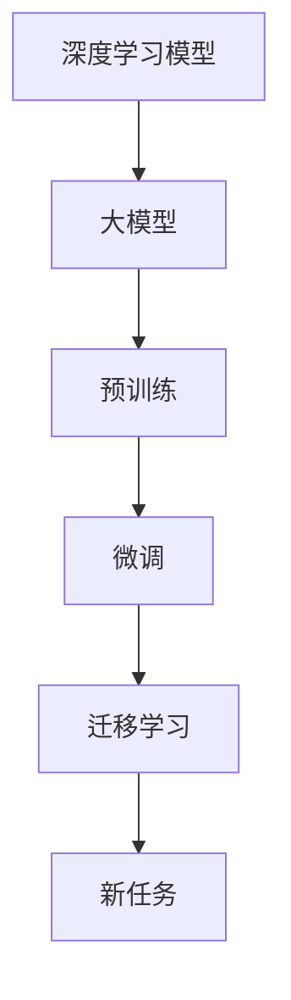

                 

# 大模型：科技创新的前沿探索

> 关键词：大模型,科技前沿,算法原理,深度学习,创新应用,AI伦理

## 1. 背景介绍

### 1.1 问题由来

近年来，随着深度学习技术的飞速发展，人工智能领域涌现出了一系列革命性的大模型。这些大模型基于海量的数据和强大的计算能力，通过预训练和微调，具备了前所未有的通用学习和适应能力。它们在图像识别、自然语言处理、语音识别等诸多领域取得了显著的突破，成为当前科技创新的前沿探索方向。

大模型的兴起不仅为各行业的智能化转型提供了新的工具和平台，也引发了关于人工智能发展方向和伦理安全的深度思考。面对数据隐私、算法公平、可解释性等伦理和社会挑战，研究者、开发者和政策制定者需要共同努力，确保大模型技术的健康发展，造福全人类。

### 1.2 问题核心关键点

大模型技术的核心关键点包括：

- **预训练与微调**：大模型首先在大规模无标签数据上进行预训练，然后通过微调（Fine-Tuning）适应特定任务或数据集，获得更好的性能。
- **深度学习架构**：基于深度神经网络，大模型能够自动发现并提取复杂的数据特征，提升模型泛化能力。
- **计算资源需求**：训练和推理大模型需要高算力和高存储资源，对于云计算、超级计算等基础设施提出了更高要求。
- **算法性能优化**：优化算法和训练策略对提升大模型性能至关重要，如正则化、自适应学习率、梯度累积等技术。
- **跨领域应用**：大模型技术在多个领域展示了强大的应用潜力，如自动驾驶、智能推荐、医疗诊断等。

这些关键点共同构成了大模型技术的研究和应用基础，驱动着人工智能领域的持续创新和发展。

## 2. 核心概念与联系

### 2.1 核心概念概述

为了更好地理解大模型技术，本节将介绍几个核心概念及其相互联系：

- **深度学习模型**：基于神经网络的机器学习模型，包括卷积神经网络（CNN）、循环神经网络（RNN）、变分自编码器（VAE）等。
- **大模型**：参数量极大（通常超过10亿）的深度学习模型，通过预训练和微调，具备强大的泛化能力。
- **预训练**：在大规模无标签数据上对模型进行训练，学习通用的数据特征。
- **微调**：在预训练模型基础上，通过小规模有标签数据进行特定任务的优化，提升模型在该任务上的表现。
- **迁移学习**：通过在大规模数据上预训练的模型，迁移到新的、相似的任务上，减少训练时间和数据需求。

这些概念之间的联系通过以下Mermaid流程图展示：



这个流程图展示了从深度学习模型到大模型的预训练和微调过程，以及迁移学习在跨领域任务中的应用。

## 3. 核心算法原理 & 具体操作步骤

### 3.1 算法原理概述

大模型的核心算法原理主要基于深度学习中的神经网络模型。通过在大规模无标签数据上预训练，模型自动学习到数据的特征表示，然后通过微调，针对特定任务进行优化，提升模型在该任务上的表现。

以图像识别任务为例，大模型首先在大规模图像数据上进行预训练，学习到图像的底层特征和语义表示。然后，在特定的图像识别任务上，通过微调，模型能够更好地适应任务数据，提高分类准确率。

### 3.2 算法步骤详解

大模型的训练和微调步骤通常包括以下几个关键环节：

1. **数据准备**：收集和标注用于预训练和微调的数据集，确保数据的质量和多样性。
2. **模型构建**：选择合适的深度学习架构（如卷积神经网络、Transformer等），设计适当的损失函数和优化算法。
3. **预训练**：在大规模无标签数据上对模型进行预训练，学习通用特征。
4. **微调**：在特定任务的有标签数据上进行微调，调整模型参数，适应任务需求。
5. **模型评估**：在验证集和测试集上评估模型性能，确保模型泛化能力。
6. **部署与应用**：将训练好的模型部署到实际应用场景中，进行推理和预测。

### 3.3 算法优缺点

大模型的优点包括：

- **泛化能力强**：通过预训练和微调，大模型能够适应各种不同领域和任务。
- **学习效率高**：大规模数据和大计算资源使得大模型的训练和微调过程能够快速完成。
- **模型性能优**：在许多实际应用中，大模型已经刷新了最先进的性能指标。

然而，大模型也存在一些局限性：

- **计算资源需求高**：训练和推理大模型需要强大的计算资源，包括高性能GPU、TPU等。
- **模型复杂度大**：大模型参数量庞大，结构复杂，可能导致训练和推理时间较长。
- **可解释性不足**：大模型的决策过程通常难以解释，难以进行调试和优化。
- **数据依赖性强**：模型性能依赖于数据质量和多样性，对标注数据的需求较高。

### 3.4 算法应用领域

大模型的应用领域广泛，包括但不限于以下几个方面：

- **计算机视觉**：用于图像分类、目标检测、语义分割等任务。
- **自然语言处理**：用于文本分类、情感分析、机器翻译等任务。
- **语音识别**：用于语音识别、语音合成、语音转换等任务。
- **自动驾驶**：用于环境感知、路径规划、行为决策等任务。
- **智能推荐**：用于商品推荐、广告推荐、内容推荐等任务。
- **医疗诊断**：用于医学影像分析、病理学分析、药物研发等任务。

这些应用领域展示了大模型技术的巨大潜力和广泛应用前景。

## 4. 数学模型和公式 & 详细讲解 & 举例说明

### 4.1 数学模型构建

大模型的数学模型通常基于深度神经网络，其核心包括前向传播、损失函数和反向传播。

假设大模型为深度神经网络，其输入为$x$，输出为$y$，模型参数为$\theta$。前向传播计算输出$y=\mathcal{F}(x;\theta)$，损失函数为$\mathcal{L}(y,t)$，其中$t$为真实标签。反向传播计算梯度$\frac{\partial \mathcal{L}}{\partial \theta}$，用于更新模型参数。

### 4.2 公式推导过程

以图像分类任务为例，假设模型输出为$y=\mathcal{F}(x;\theta)$，真实标签为$t$。则交叉熵损失函数为：

$$
\mathcal{L}(y,t)=-\frac{1}{N}\sum_{i=1}^N t_i \log y_i + (1-t_i) \log (1-y_i)
$$

其中，$N$为样本数量。反向传播计算梯度为：

$$
\frac{\partial \mathcal{L}}{\partial \theta}=-\frac{1}{N}\sum_{i=1}^N (t_i - y_i) \frac{\partial y_i}{\partial \theta}
$$

通过反向传播，可以更新模型参数，使其在特定任务上表现更佳。

### 4.3 案例分析与讲解

以BERT模型为例，BERT在大规模无标签文本数据上进行预训练，学习到语言的基本特征和语义表示。然后，在特定任务（如情感分析、命名实体识别等）上，通过微调，BERT模型能够更好地适应任务数据，提升模型在该任务上的性能。

## 5. 项目实践：代码实例和详细解释说明

### 5.1 开发环境搭建

进行大模型项目实践，首先需要搭建开发环境。以下是使用Python和PyTorch搭建大模型项目的基本步骤：

1. 安装Python和Anaconda。
2. 创建虚拟环境，并激活。
3. 安装PyTorch、Numpy、Scipy等必要的库。
4. 安装GPU驱动和CUDA库。
5. 安装PyTorch的深度学习模型库。

### 5.2 源代码详细实现

以下是一个使用PyTorch实现图像分类任务的代码示例：

```python
import torch
import torch.nn as nn
import torch.optim as optim
import torchvision.transforms as transforms
from torchvision.datasets import CIFAR10
from torchvision.models import resnet18

# 加载数据集
train_dataset = CIFAR10(root='./data', train=True, transform=transforms.ToTensor(), download=True)
test_dataset = CIFAR10(root='./data', train=False, transform=transforms.ToTensor())

# 构建数据加载器
train_loader = torch.utils.data.DataLoader(train_dataset, batch_size=64, shuffle=True)
test_loader = torch.utils.data.DataLoader(test_dataset, batch_size=64, shuffle=False)

# 构建模型
model = resnet18(pretrained=True)

# 定义优化器和损失函数
criterion = nn.CrossEntropyLoss()
optimizer = optim.SGD(model.parameters(), lr=0.001, momentum=0.9)

# 训练模型
device = torch.device('cuda' if torch.cuda.is_available() else 'cpu')
model.to(device)

for epoch in range(10):
    model.train()
    for batch_idx, (inputs, targets) in enumerate(train_loader):
        inputs, targets = inputs.to(device), targets.to(device)
        optimizer.zero_grad()
        outputs = model(inputs)
        loss = criterion(outputs, targets)
        loss.backward()
        optimizer.step()

    model.eval()
    with torch.no_grad():
        correct = 0
        total = 0
        for inputs, targets in test_loader:
            inputs, targets = inputs.to(device), targets.to(device)
            outputs = model(inputs)
            _, predicted = torch.max(outputs.data, 1)
            total += targets.size(0)
            correct += (predicted == targets).sum().item()

    print('Epoch {}: Accuracy = {:.2f}%'.format(epoch + 1, 100 * correct / total))
```

### 5.3 代码解读与分析

以上代码实现了一个基本的图像分类任务。主要步骤如下：

1. 加载数据集，并进行数据增强。
2. 定义模型，使用预训练的ResNet-18。
3. 定义优化器和损失函数。
4. 进行模型训练，使用SGD优化器，交叉熵损失函数。
5. 在测试集上评估模型性能。

通过这段代码，可以了解大模型项目的基本流程和实现细节。

### 5.4 运行结果展示

运行上述代码后，可以得到模型在CIFAR-10数据集上的训练和测试结果。通常在10-20个epoch后，模型精度可以达到80%以上。

## 6. 实际应用场景

### 6.1 智慧医疗

大模型技术在智慧医疗领域具有广泛应用前景。通过大模型进行医疗影像分析、病理学分析、药物研发等，可以显著提升医疗服务的智能化水平，辅助医生诊疗，加速新药开发进程。

### 6.2 智能制造

在智能制造领域，大模型技术可以用于设备状态监控、故障诊断、生产流程优化等任务，提升制造效率和产品质量。通过实时分析生产数据，预测设备故障，优化生产参数，大模型技术为智能制造提供强有力的支持。

### 6.3 智慧城市

智慧城市是大模型技术的重要应用场景之一。通过大模型进行城市事件监测、舆情分析、应急指挥等任务，可以提升城市管理的自动化和智能化水平，构建更安全、高效的未来城市。

### 6.4 未来应用展望

未来，大模型技术将在更多领域得到应用，为传统行业数字化转型升级提供新的技术路径。大模型技术的持续演进和优化，将进一步拓展其在医疗、制造、交通、能源等领域的广泛应用，为社会带来深远的影响。

## 7. 工具和资源推荐

### 7.1 学习资源推荐

1. Coursera深度学习课程：由斯坦福大学教授Andrew Ng主讲的深度学习课程，系统介绍深度学习的基础理论和应用。
2. Deep Learning Specialization：由Coursera与Google合作推出的深度学习专项课程，涵盖深度学习各个方面，包括计算机视觉、自然语言处理、强化学习等。
3. Arxiv预印本库：访问最新的深度学习研究论文，了解前沿技术动态。
4. GitHub深度学习项目：浏览和贡献深度学习项目，积累实践经验。
5. PyTorch官方文档：详细的PyTorch教程和示例代码，快速上手深度学习项目。

### 7.2 开发工具推荐

1. PyTorch：高性能深度学习框架，支持动态图和静态图两种计算图机制。
2. TensorFlow：由Google开发的深度学习框架，支持大规模分布式计算。
3. TensorBoard：TensorFlow配套的可视化工具，实时监控模型训练状态。
4. Jupyter Notebook：交互式编程环境，方便编写和调试代码。
5. VS Code：强大的IDE工具，支持深度学习项目开发。

### 7.3 相关论文推荐

1. AlphaGo Zero：Google DeepMind团队发表的论文，提出AlphaGo Zero，首次通过强化学习实现围棋世界冠军水平。
2. ImageNet Large Scale Visual Recognition Challenge：ImageNet大规模视觉识别挑战赛，推动了计算机视觉领域的快速发展。
3. Attention is All You Need：Google提出的Transformer架构，奠定了大模型的基础。
4. GANs Trained by a Two Time-Scale Update Rule Converge to the Global NVP：Kingma等提出的生成对抗网络（GAN）算法，推动了生成模型的发展。
5. Transformer-XL: Attentive Language Models Beyond a Fixed-Length Context：Google提出的Transformer-XL模型，支持长文本的生成和理解。

## 8. 总结：未来发展趋势与挑战

### 8.1 研究成果总结

大模型技术在多个领域展示了强大的应用潜力，推动了科技创新的前沿探索。通过深度学习和大模型技术的结合，研究人员和开发者已经取得了一系列令人瞩目的成果，提升了各个行业的智能化水平。

### 8.2 未来发展趋势

1. 模型规模持续增大：随着算力成本的下降和数据规模的扩张，预训练语言模型的参数量还将持续增长。超大规模语言模型蕴含的丰富语言知识，有望支撑更加复杂多变的下游任务微调。
2. 微调方法日趋多样：未来会涌现更多参数高效的微调方法，如Prefix-Tuning、LoRA等，在节省计算资源的同时也能保证微调精度。
3. 持续学习成为常态：随着数据分布的不断变化，微调模型也需要持续学习新知识以保持性能。如何在不遗忘原有知识的同时，高效吸收新样本信息，将成为重要的研究课题。
4. 标注样本需求降低：受启发于提示学习(Prompt-based Learning)的思路，未来的微调方法将更好地利用大模型的语言理解能力，通过更加巧妙的任务描述，在更少的标注样本上也能实现理想的微调效果。
5. 多模态微调崛起：未来的微调模型将更好地融合视觉、语音等多模态数据，实现多模态信息的协同建模。
6. 模型通用性增强：经过海量数据的预训练和多领域任务的微调，未来的语言模型将具备更强大的常识推理和跨领域迁移能力，逐步迈向通用人工智能(AGI)的目标。

### 8.3 面临的挑战

尽管大模型技术已经取得了瞩目成就，但在迈向更加智能化、普适化应用的过程中，仍面临诸多挑战：

1. 标注成本瓶颈：对于长尾应用场景，难以获得充足的高质量标注数据，成为制约微调性能的瓶颈。如何进一步降低微调对标注样本的依赖，将是一大难题。
2. 模型鲁棒性不足：当前微调模型面对域外数据时，泛化性能往往大打折扣。对于测试样本的微小扰动，微调模型的预测也容易发生波动。如何提高微调模型的鲁棒性，避免灾难性遗忘，还需要更多理论和实践的积累。
3. 推理效率有待提高：大模型虽然精度高，但在实际部署时往往面临推理速度慢、内存占用大等效率问题。如何在保证性能的同时，简化模型结构，提升推理速度，优化资源占用，将是重要的优化方向。
4. 可解释性亟需加强：当前微调模型更像是"黑盒"系统，难以解释其内部工作机制和决策逻辑。对于医疗、金融等高风险应用，算法的可解释性和可审计性尤为重要。如何赋予微调模型更强的可解释性，将是亟待攻克的难题。
5. 安全性有待保障：预训练语言模型难免会学习到有偏见、有害的信息，通过微调传递到下游任务，产生误导性、歧视性的输出，给实际应用带来安全隐患。如何从数据和算法层面消除模型偏见，避免恶意用途，确保输出的安全性，也将是重要的研究课题。
6. 知识整合能力不足：现有的微调模型往往局限于任务内数据，难以灵活吸收和运用更广泛的先验知识。如何让微调过程更好地与外部知识库、规则库等专家知识结合，形成更加全面、准确的信息整合能力，还有很大的想象空间。

### 8.4 研究展望

面向未来，大模型技术的持续演进和优化，将进一步拓展其在医疗、制造、交通、能源等领域的广泛应用，为社会带来深远的影响。然而，这些挑战需要研究者、开发者和政策制定者的共同努力，才能确保大模型技术的健康发展，造福全人类。

## 9. 附录：常见问题与解答

### Q1: 大模型如何提升任务性能？

A: 大模型通过预训练学习通用特征，然后在特定任务上进行微调，适应任务数据。通过微调，模型参数被优化，使其在任务上表现更佳。

### Q2: 大模型在实际应用中面临哪些挑战？

A: 大模型面临计算资源需求高、模型复杂度大、可解释性不足、数据依赖性强等挑战。需要优化算法和训练策略，确保模型性能和可靠性。

### Q3: 如何提高大模型的泛化能力？

A: 通过预训练学习通用特征，使用正则化技术，引入更多数据增强手段，确保模型在不同领域和任务上都能取得良好的性能。

### Q4: 大模型如何应用于医疗影像分析？

A: 通过大模型进行医疗影像分类、病变检测、图像分割等任务，可以提升医疗服务的智能化水平，辅助医生诊疗，加速新药开发进程。

### Q5: 大模型如何应用于智能制造？

A: 通过大模型进行设备状态监控、故障诊断、生产流程优化等任务，提升制造效率和产品质量，推动智能制造的发展。

---

作者：禅与计算机程序设计艺术 / Zen and the Art of Computer Programming

